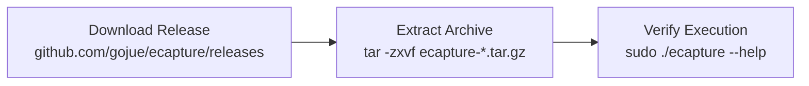
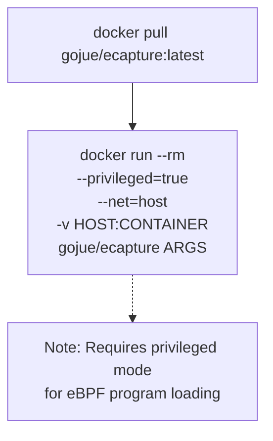
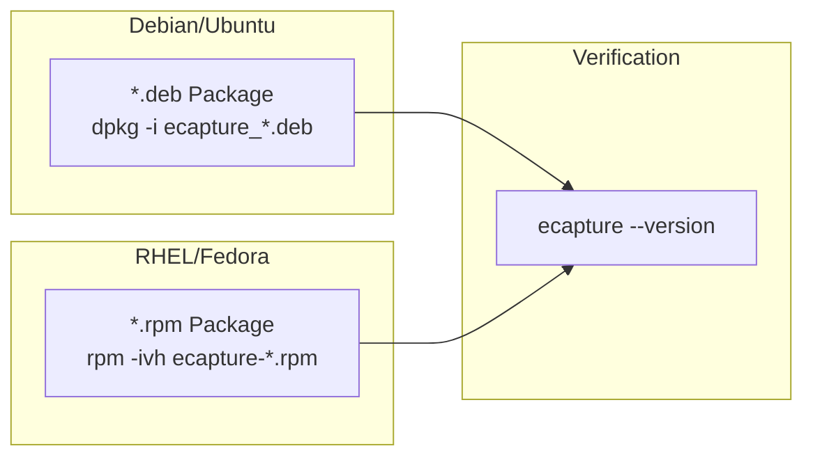
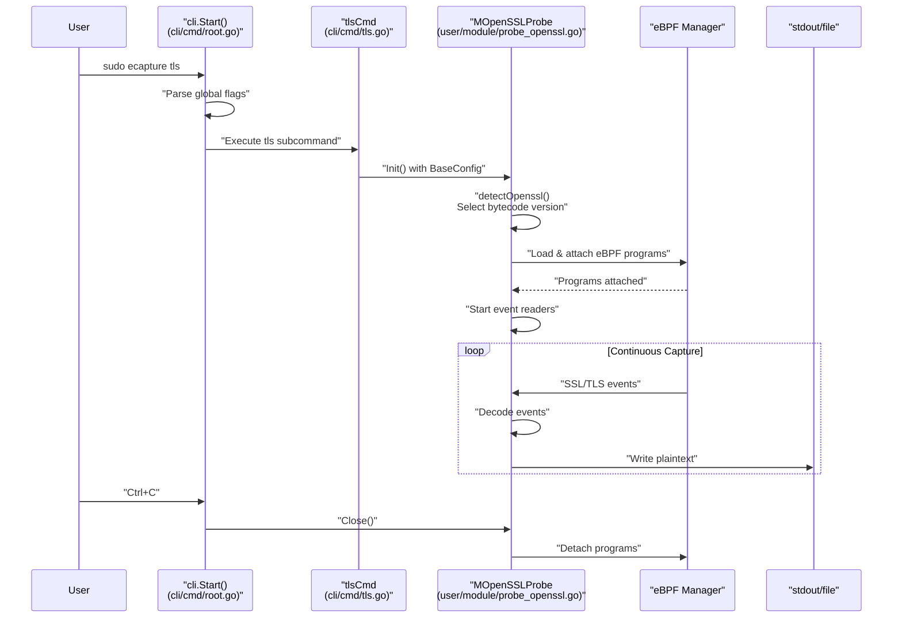
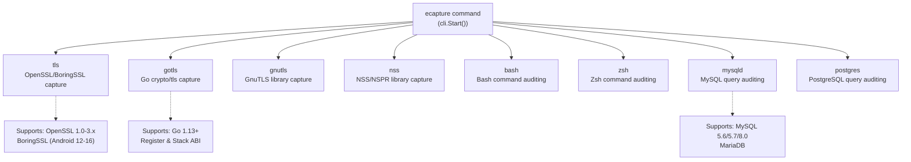

# Installation and Quick Start

<details>
<summary>Relevant source files</summary>

The following files were used as context for generating this wiki page:

- [CHANGELOG.md](https://github.com/gojue/ecapture/blob/ca085d05/CHANGELOG.md)
- [README.md](https://github.com/gojue/ecapture/blob/ca085d05/README.md)
- [README_CN.md](https://github.com/gojue/ecapture/blob/ca085d05/README_CN.md)
- [README_JA.md](https://github.com/gojue/ecapture/blob/ca085d05/README_JA.md)
- [images/ecapture-help-v0.8.9.svg](https://github.com/gojue/ecapture/blob/ca085d05/images/ecapture-help-v0.8.9.svg)
- [images/ecapture-logo.png](images/ecapture-logo.png)
- [main.go](https://github.com/gojue/ecapture/blob/ca085d05/main.go)
- [protobuf/PROTOCOLS.md](https://github.com/gojue/ecapture/blob/ca085d05/protobuf/PROTOCOLS.md)
- [protobuf/PROTOCOLS_CN.md](https://github.com/gojue/ecapture/blob/ca085d05/protobuf/PROTOCOLS_CN.md)
- [protobuf/README.md](https://github.com/gojue/ecapture/blob/ca085d05/protobuf/README.md)
- [protobuf/README_CN.md](https://github.com/gojue/ecapture/blob/ca085d05/protobuf/README_CN.md)
- [utils/protobuf_visualizer/README.md](https://github.com/gojue/ecapture/blob/ca085d05/utils/protobuf_visualizer/README.md)
- [utils/protobuf_visualizer/README_CN.md](https://github.com/gojue/ecapture/blob/ca085d05/utils/protobuf_visualizer/README_CN.md)

</details>


## Purpose and Scope

This document guides you through installing eCapture and running your first SSL/TLS plaintext capture. It covers system requirements, installation methods (binary, Docker, package managers), and a basic capture workflow. For detailed information about specific modules and their capabilities, see [Capture Modules](../3-capture-modules/index.md). For command-line interface documentation, see [Command Line Interface](1.2-command-line-interface.md).

---

## System Requirements

eCapture requires specific Linux kernel versions and permissions to function:

| Requirement | Specification |
|------------|---------------|
| **Architecture** | x86_64 or aarch64 (ARM64) |
| **Linux Kernel** | x86_64: 4.18+, aarch64: 5.5+ |
| **Permissions** | ROOT (or CAP_BPF, CAP_PERFMON capabilities) |
| **BTF Support** | Required for CO-RE mode (optional for non-CO-RE) |
| **Supported Platforms** | Linux, Android |
| **Unsupported Platforms** | Windows, macOS |

eCapture automatically detects whether your kernel supports BTF (BPF Type Format) and selects the appropriate eBPF bytecode mode (CO-RE or non-CO-RE). See [eBPF Engine](../2-architecture/2.1-ebpf-engine.md) for details on bytecode selection.

**Sources:** [README.md:14-16](https://github.com/gojue/ecapture/blob/ca085d05/README.md#L14-L16), [README_CN.md:15-17](https://github.com/gojue/ecapture/blob/ca085d05/README_CN.md#L15-L17)

---

## Installation Methods

### Binary Installation

The simplest installation method is downloading pre-built ELF binaries from the GitHub releases page.



**Installation Steps:**

1. **Download the appropriate release:**
   ```bash
   # For x86_64
   wget https://github.com/gojue/ecapture/releases/download/v1.5.0/ecapture-v1.5.0-linux-x86_64.tar.gz
   
   # For aarch64
   wget https://github.com/gojue/ecapture/releases/download/v1.5.0/ecapture-v1.5.0-linux-arm64.tar.gz
   ```

2. **Extract the archive:**
   ```bash
   tar -zxvf ecapture-v*.tar.gz
   cd ecapture-v*-linux-*/
   ```

3. **Verify installation:**
   ```bash
   sudo ./ecapture --help
   ```

The binary is statically linked with libpcap and includes all necessary eBPF bytecode embedded via `go-bindata` (see [assets/ebpf_probe.go](https://github.com/gojue/ecapture/blob/ca085d05/assets/ebpf_probe.go)). No additional dependencies are required.

**Sources:** [README.md:50-56](https://github.com/gojue/ecapture/blob/ca085d05/README.md#L50-L56), [CHANGELOG.md:140-195](https://github.com/gojue/ecapture/blob/ca085d05/CHANGELOG.md#L140-L195)

---

### Docker Installation

eCapture provides official Docker images for containerized deployment.



**Installation Steps:**

1. **Pull the Docker image:**
   ```bash
   docker pull gojue/ecapture:latest
   ```

2. **Run eCapture in Docker:**
   ```bash
   docker run --rm \
     --privileged=true \
     --net=host \
     -v /path/on/host:/data \
     gojue/ecapture tls -m pcap --pcapfile=/data/capture.pcapng
   ```

**Docker Requirements:**
- `--privileged=true`: Required for loading eBPF programs into the kernel
- `--net=host`: Required for capturing host network traffic
- Volume mount: Optional, for saving output files to the host filesystem

**Sources:** [README.md:58-70](https://github.com/gojue/ecapture/blob/ca085d05/README.md#L58-L70), [README_CN.md:58-67](https://github.com/gojue/ecapture/blob/ca085d05/README_CN.md#L58-L67)

---

### Package Manager Installation

eCapture provides native packages for major Linux distributions.



**Debian/Ubuntu:**
```bash
# Download .deb package from releases
wget https://github.com/gojue/ecapture/releases/download/v1.5.0/ecapture_1.5.0_amd64.deb

# Install
sudo dpkg -i ecapture_1.5.0_amd64.deb
```

**RHEL/Fedora:**
```bash
# Download .rpm package from releases
wget https://github.com/gojue/ecapture/releases/download/v1.5.0/ecapture-1.5.0-1.x86_64.rpm

# Install
sudo rpm -ivh ecapture-1.5.0-1.x86_64.rpm
```

**Sources:** [CHANGELOG.md:671-679](https://github.com/gojue/ecapture/blob/ca085d05/CHANGELOG.md#L671-L679), Diagram 6 from high-level architecture

---

## Quick Start: First Capture

This section demonstrates capturing SSL/TLS plaintext from HTTPS traffic using the `tls` module.

### Command Execution Flow



### Basic TLS Capture

**Command:**
```bash
sudo ecapture tls
```

This command captures all SSL/TLS plaintext traffic on the system using OpenSSL/BoringSSL libraries.

**Expected Output:**
```
2024-09-15T11:51:31Z INF AppName="eCapture(旁观者)"
2024-09-15T11:51:31Z INF HomePage=https://ecapture.cc
2024-09-15T11:51:31Z INF Repository=https://github.com/gojue/ecapture
2024-09-15T11:51:31Z INF Version=linux_arm64:0.8.6-20240915-d87ae48:5.15.0-113-generic
2024-09-15T11:51:31Z INF Listen=localhost:28256
2024-09-15T11:51:31Z INF BTF bytecode mode: CORE. btfMode=0
2024-09-15T11:51:31Z INF Module initialization. isReload=false moduleName=EBPFProbeOPENSSL
2024-09-15T11:51:31Z WRN OpenSSL/BoringSSL version not found, used default version OpenSSL Version=linux_default_3_0
2024-09-15T11:51:31Z INF BPF bytecode file is matched. bpfFileName=user/bytecode/openssl_3_0_0_kern_core.o
2024-09-15T11:51:31Z INF module started successfully. moduleName=EBPFProbeOPENSSL

2024-09-15T11:51:53Z ??? UUID:233851_233851_curl_5_1_172.16.71.1:51837, Name:HTTP2Request, Type:2
GET / HTTP/2
Host: google.com
User-Agent: curl/7.81.0
```

**Sources:** [README.md:72-149](https://github.com/gojue/ecapture/blob/ca085d05/README.md#L72-L149), [main.go:1-12](https://github.com/gojue/ecapture/blob/ca085d05/main.go#L1-L12)

---

### Understanding the Output

Each captured event displays:

| Field | Description | Example Value |
|-------|-------------|---------------|
| **Timestamp** | Event capture time | `2024-09-15T11:51:53Z` |
| **UUID** | Event identifier | `233851_233851_curl_5_1_172.16.71.1:51837` |
| **Name** | Protocol/Event type | `HTTP2Request`, `HTTPResponse` |
| **Type** | Numeric type code | `1=HTTP/1.x Req, 2=HTTP/2 Req, 3=HTTP/1.x Resp, 4=HTTP/2 Resp` |
| **Length** | Payload size | Displayed in header line |
| **Payload** | Plaintext content | Request/response data |

The UUID format is: `PID_TID_ProcessName_FD_Direction_RemoteAddress:Port`

**Sources:** [protobuf/PROTOCOLS.md:24-42](https://github.com/gojue/ecapture/blob/ca085d05/protobuf/PROTOCOLS.md#L24-L42), [user/event/event_ssl.go](https://github.com/gojue/ecapture/blob/ca085d05/user/event/event_ssl.go)

---

### Additional Capture Examples

**Capture with PCAP output:**
```bash
sudo ecapture tls -m pcap -i eth0 --pcapfile=output.pcapng
```

This saves captured plaintext in pcapng format, compatible with Wireshark. The file includes Decryption Secrets Blocks (DSB) for TLS key logging.

**Capture with keylog mode:**
```bash
sudo ecapture tls -m keylog --keylogfile=keys.log
```

This extracts TLS master secrets and traffic secrets, compatible with `SSLKEYLOGFILE` format for use with `tshark` or Wireshark.

**Filter by process ID:**
```bash
sudo ecapture tls --pid=1234
```

**Filter by user ID:**
```bash
sudo ecapture tls --uid=1000
```

**Sources:** [README.md:172-253](https://github.com/gojue/ecapture/blob/ca085d05/README.md#L172-L253), [README_CN.md:150-220](https://github.com/gojue/ecapture/blob/ca085d05/README_CN.md#L150-L220)

---

## Module Selection Reference

eCapture provides multiple specialized modules. Use `ecapture <module>` to start a specific module:



**Available Modules:**

| Module | Purpose | Target Libraries/Applications |
|--------|---------|-------------------------------|
| `tls` | SSL/TLS plaintext capture | OpenSSL, BoringSSL, LibreSSL |
| `gotls` | Go TLS capture | Go `crypto/tls` package |
| `gnutls` | GnuTLS capture | GnuTLS library |
| `nss` | NSS/NSPR capture | NSS/NSPR libraries |
| `bash` | Command auditing | Bash shell |
| `zsh` | Command auditing | Zsh shell |
| `mysqld` | SQL query capture | MySQL, MariaDB |
| `postgres` | SQL query capture | PostgreSQL |

For detailed module documentation, see [Capture Modules](../3-capture-modules/index.md).

**Sources:** [README.md:152-161](https://github.com/gojue/ecapture/blob/ca085d05/README.md#L152-L161), [cli/cmd/root.go](https://github.com/gojue/ecapture/blob/ca085d05/cli/cmd/root.go), Diagram 1 from high-level architecture

---

## Verifying Installation

To verify your eCapture installation:

1. **Check version:**
   ```bash
   sudo ecapture --version
   ```

2. **Verify kernel compatibility:**
   ```bash
   uname -r  # Should be 4.18+ (x86_64) or 5.5+ (aarch64)
   ```

3. **Check BTF support:**
   ```bash
   cat /boot/config-$(uname -r) | grep CONFIG_DEBUG_INFO_BTF
   # Should show: CONFIG_DEBUG_INFO_BTF=y
   ```

4. **Test basic capture:**
   ```bash
   # In terminal 1: Start capture
   sudo ecapture tls
   
   # In terminal 2: Generate HTTPS traffic
   curl https://www.example.com
   
   # Terminal 1 should display captured plaintext
   ```

**Sources:** [README_CN.md:228-233](https://github.com/gojue/ecapture/blob/ca085d05/README_CN.md#L228-L233), [Dependencies and System Requirements](1.3-dependencies-and-system-requirements.md)

---

## Troubleshooting Common Issues

| Issue | Cause | Solution |
|-------|-------|----------|
| **"BTF not found"** | Kernel lacks BTF support | Use non-CO-RE mode (automatic) or upgrade kernel |
| **"Permission denied"** | Missing ROOT/capabilities | Run with `sudo` or grant CAP_BPF/CAP_PERFMON |
| **"No events captured"** | No matching SSL/TLS traffic | Verify target application uses supported library |
| **"Version not found"** | Unsupported library version | Check supported versions or use `--libssl` flag |

For detailed troubleshooting, see [Troubleshooting and FAQ](../6-troubleshooting-and-faq/index.md).

**Sources:** [README.md:14-16](https://github.com/gojue/ecapture/blob/ca085d05/README.md#L14-L16), Inferred from common eBPF issues

---

## Next Steps

After successful installation and basic capture:

1. **Explore output modes:** Learn about `text`, `pcap`, and `keylog` modes in [OpenSSL Module](../3-capture-modules/3.1.1-openssl-module.md)
2. **Module-specific features:** See [Capture Modules](../3-capture-modules/index.md) for GoTLS, database auditing, and more
3. **Advanced configuration:** Review [Configuration System](../2-architecture/2.4-configuration-system.md) for filtering, custom settings
4. **Remote GUI:** Consider [eCaptureQ](https://github.com/gojue/ecaptureq) for graphical interface
5. **Event forwarding:** Integrate with external tools via WebSocket ([Protobuf Integration](../4-output-formats/4.4-protobuf-and-external-integration.md))

**Sources:** Table of contents structure, [README.md:287-305](https://github.com/gojue/ecapture/blob/ca085d05/README.md#L287-L305)