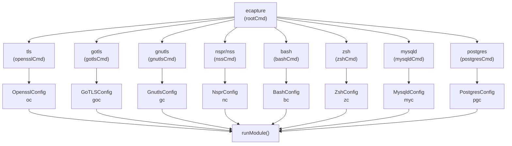
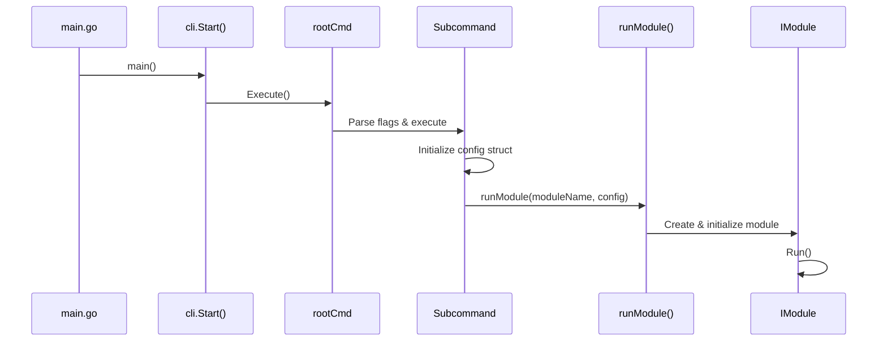
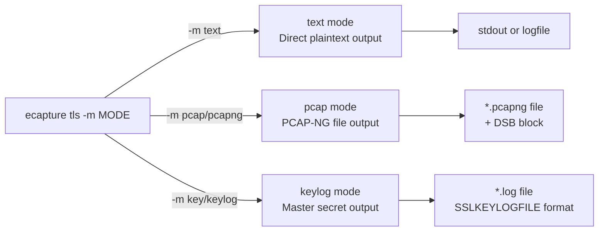
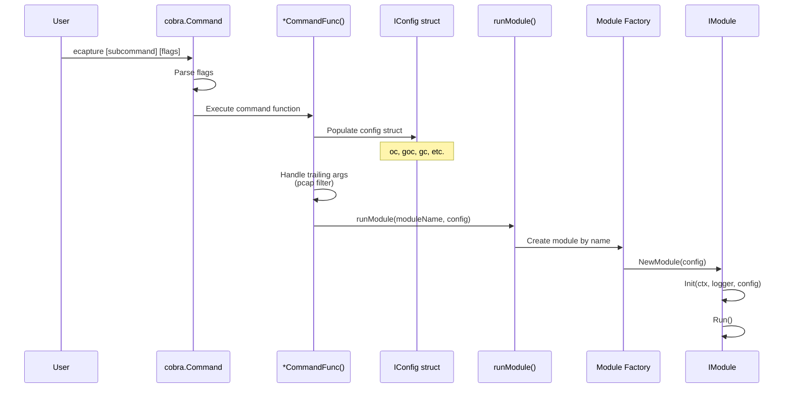
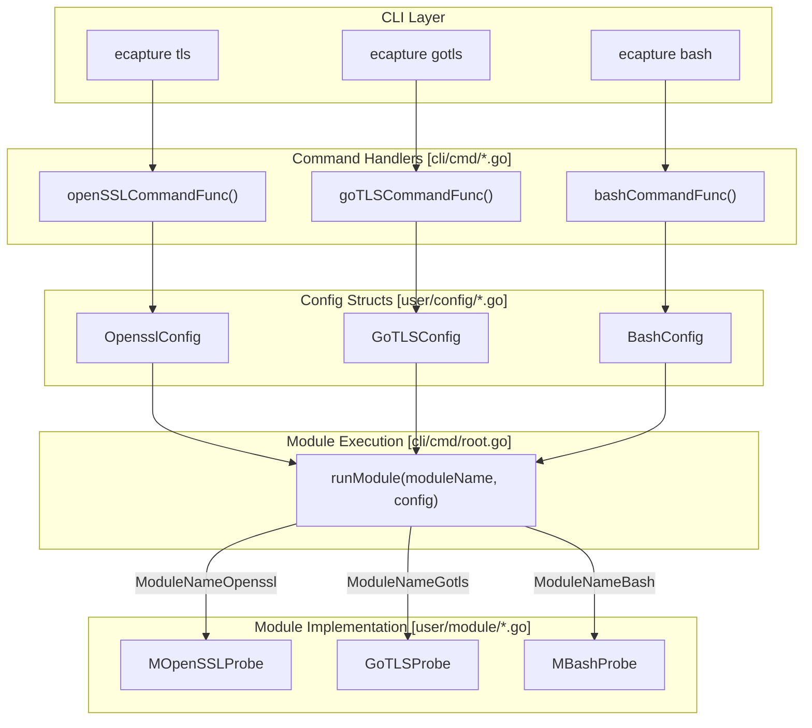

# Command Line Interface

<details>
<summary>Relevant source files</summary>

The following files were used as context for generating this wiki page:

- [CHANGELOG.md](https://github.com/gojue/ecapture/blob/ca085d05/CHANGELOG.md)
- [README.md](https://github.com/gojue/ecapture/blob/ca085d05/README.md)
- [README_CN.md](https://github.com/gojue/ecapture/blob/ca085d05/README_CN.md)
- [cli/cmd/bash.go](https://github.com/gojue/ecapture/blob/ca085d05/cli/cmd/bash.go)
- [cli/cmd/gnutls.go](https://github.com/gojue/ecapture/blob/ca085d05/cli/cmd/gnutls.go)
- [cli/cmd/gotls.go](https://github.com/gojue/ecapture/blob/ca085d05/cli/cmd/gotls.go)
- [cli/cmd/mysqld.go](https://github.com/gojue/ecapture/blob/ca085d05/cli/cmd/mysqld.go)
- [cli/cmd/nspr.go](https://github.com/gojue/ecapture/blob/ca085d05/cli/cmd/nspr.go)
- [cli/cmd/postgres.go](https://github.com/gojue/ecapture/blob/ca085d05/cli/cmd/postgres.go)
- [cli/cmd/tls.go](https://github.com/gojue/ecapture/blob/ca085d05/cli/cmd/tls.go)
- [cli/cmd/zsh.go](https://github.com/gojue/ecapture/blob/ca085d05/cli/cmd/zsh.go)
- [images/ecapture-help-v0.8.9.svg](https://github.com/gojue/ecapture/blob/ca085d05/images/ecapture-help-v0.8.9.svg)
- [main.go](https://github.com/gojue/ecapture/blob/ca085d05/main.go)
- [pkg/util/ws/client.go](https://github.com/gojue/ecapture/blob/ca085d05/pkg/util/ws/client.go)
- [pkg/util/ws/client_test.go](https://github.com/gojue/ecapture/blob/ca085d05/pkg/util/ws/client_test.go)

</details>


## Purpose and Scope

This document describes eCapture's command-line interface (CLI), including the root command, global flags, module-specific subcommands, and their respective configuration options. The CLI is built using the [Cobra](https://github.com/spf13/cobra) framework and serves as the primary user interaction layer for initiating capture operations.

For information about how CLI commands translate into module execution and eBPF attachment, see [Module System and Lifecycle](../2-architecture/2.5-module-system-and-lifecycle.md). For details on the configuration structures used by each module, see [Configuration System](../2-architecture/2.4-configuration-system.md).

---

## CLI Architecture Overview

The eCapture CLI follows a hierarchical command structure with a root command (`ecapture`) and multiple module-specific subcommands. Each subcommand corresponds to a capture module and accepts both global flags (inherited from root) and module-specific flags.

### Command Hierarchy



**Sources:** [cli/cmd/tls.go:29-48](https://github.com/gojue/ecapture/blob/ca085d05/cli/cmd/tls.go#L29-L48), [cli/cmd/gotls.go:29-40](https://github.com/gojue/ecapture/blob/ca085d05/cli/cmd/gotls.go#L29-L40), [cli/cmd/gnutls.go:32-45](https://github.com/gojue/ecapture/blob/ca085d05/cli/cmd/gnutls.go#L32-L45), [cli/cmd/nspr.go:30-41](https://github.com/gojue/ecapture/blob/ca085d05/cli/cmd/nspr.go#L30-L41), [cli/cmd/bash.go:27-33](https://github.com/gojue/ecapture/blob/ca085d05/cli/cmd/bash.go#L27-L33), [cli/cmd/zsh.go:30-36](https://github.com/gojue/ecapture/blob/ca085d05/cli/cmd/zsh.go#L30-L36), [cli/cmd/mysqld.go:30-37](https://github.com/gojue/ecapture/blob/ca085d05/cli/cmd/mysqld.go#L30-L37), [cli/cmd/postgres.go:30-34](https://github.com/gojue/ecapture/blob/ca085d05/cli/cmd/postgres.go#L30-L34)

### Entry Point Flow



**Sources:** [main.go:9-11](https://github.com/gojue/ecapture/blob/ca085d05/main.go#L9-L11)

---

## Global Flags

While not shown in the provided files, the root command (`rootCmd`) in [cli/cmd/root.go](https://github.com/gojue/ecapture/blob/ca085d05/cli/cmd/root.go) defines global flags that are inherited by all subcommands. Based on the README examples and architecture, these include:

| Flag | Type | Description |
|------|------|-------------|
| `--pid` | int | Target process ID to capture |
| `--uid` | int | Target user ID to capture |
| `--hex` | bool | Output captured data in hexadecimal format |
| `-l, --logfile` | string | Path to log file for captured events |
| `--mapsize` | int | eBPF map size in KB (default: 5120) |

Global flags apply to all modules and can be combined with module-specific flags.

**Sources:** [README.md:72-149](https://github.com/gojue/ecapture/blob/ca085d05/README.md#L72-L149)

---

## Module Subcommands

### TLS/OpenSSL Module

**Command:** `ecapture tls` (alias: `openssl`)

The TLS module captures plaintext from OpenSSL/BoringSSL-encrypted connections. It supports three capture modes and can target all OpenSSL versions 1.0.x, 1.1.x, and 3.x.

#### Flags

| Flag | Short | Type | Default | Description |
|------|-------|------|---------|-------------|
| `--libssl` | | string | (auto-detect) | Path to libssl.so file |
| `--cgroup_path` | | string | `/sys/fs/cgroup` | cgroup path for process filtering |
| `-m, --model` | | string | `text` | Capture mode: `text`, `pcap`/`pcapng`, `key`/`keylog` |
| `-k, --keylogfile` | | string | `ecapture_openssl_key.log` | Path to save TLS master secrets |
| `-w, --pcapfile` | | string | `save.pcapng` | Path to save packets in pcapng format |
| `-i, --ifname` | | string | | Network interface name (required for pcap mode) |
| `--ssl_version` | | string | (auto-detect) | OpenSSL/BoringSSL version string |

#### Capture Modes



**Sources:** [cli/cmd/tls.go:26-67](https://github.com/gojue/ecapture/blob/ca085d05/cli/cmd/tls.go#L26-L67)

#### Usage Examples

```bash
# Text mode - capture all OpenSSL traffic
sudo ecapture tls

# PCAP mode - save to file with filter
sudo ecapture tls -m pcap -i eth0 -w output.pcapng tcp port 443

# Keylog mode - extract master secrets
sudo ecapture tls -m keylog -k keys.log

# Target specific library version
sudo ecapture tls --libssl=/lib/x86_64-linux-gnu/libssl.so.3 --ssl_version="openssl 3.0.5"
```

**Sources:** [cli/cmd/tls.go:33-46](https://github.com/gojue/ecapture/blob/ca085d05/cli/cmd/tls.go#L33-L46), [README.md:72-149](https://github.com/gojue/ecapture/blob/ca085d05/README.md#L72-L149)

#### Configuration Structure

The `OpensslConfig` struct ([user/config/openssl.go](https://github.com/gojue/ecapture/blob/ca085d05/user/config/openssl.go)) is initialized at [cli/cmd/tls.go:26](https://github.com/gojue/ecapture/blob/ca085d05/cli/cmd/tls.go#L26):

```go
var oc = config.NewOpensslConfig()
```

The configuration is passed to the OpenSSL module via `runModule(module.ModuleNameOpenssl, oc)` at [cli/cmd/tls.go:66](https://github.com/gojue/ecapture/blob/ca085d05/cli/cmd/tls.go#L66).

#### PCAP Filter Support

The TLS and GoTLS modules support [pcap filter expressions](https://www.tcpdump.org/manpages/pcap-filter.7.html) in pcap mode. Filters are passed as trailing arguments:

```bash
sudo ecapture tls -m pcap -i eth0 host 192.168.1.1 and tcp port 443
```

The filter is extracted at [cli/cmd/tls.go:63-65](https://github.com/gojue/ecapture/blob/ca085d05/cli/cmd/tls.go#L63-L65) and stored in `oc.PcapFilter`.

**Sources:** [cli/cmd/tls.go:62-67](https://github.com/gojue/ecapture/blob/ca085d05/cli/cmd/tls.go#L62-L67)

---

### GoTLS Module

**Command:** `ecapture gotls` (alias: `tlsgo`)

Captures plaintext from Go programs using the native `crypto/tls` library. Requires specifying the target Go binary path.

#### Flags

| Flag | Short | Type | Default | Description |
|------|-------|------|---------|-------------|
| `-e, --elfpath` | | string | (required) | Path to Go binary built with Go toolchain |
| `-w, --pcapfile` | | string | `ecapture_gotls.pcapng` | Path to save packets in pcapng format |
| `-m, --model` | | string | `text` | Capture mode: `text`, `pcap`/`pcapng`, `key`/`keylog` |
| `-k, --keylogfile` | | string | `ecapture_gotls_key.log` | Path to save TLS keys |
| `-i, --ifname` | | string | | Network interface name (required for pcap mode) |

**Sources:** [cli/cmd/gotls.go:26-59](https://github.com/gojue/ecapture/blob/ca085d05/cli/cmd/gotls.go#L26-L59)

#### Usage Examples

```bash
# Capture specific Go binary
sudo ecapture gotls --elfpath=/usr/bin/my-go-app

# PCAP mode with filter
sudo ecapture gotls -m pcap -e /usr/bin/my-go-app -i eth0 -w output.pcapng tcp port 8443

# Keylog mode
sudo ecapture gotls -m keylog -k gotls_keys.log --elfpath=/usr/bin/my-go-app
```

**Sources:** [cli/cmd/gotls.go:34-38](https://github.com/gojue/ecapture/blob/ca085d05/cli/cmd/gotls.go#L34-L38), [README.md:256-276](https://github.com/gojue/ecapture/blob/ca085d05/README.md#L256-L276)

#### Configuration Structure

The `GoTLSConfig` struct is initialized at [cli/cmd/gotls.go:26](https://github.com/gojue/ecapture/blob/ca085d05/cli/cmd/gotls.go#L26) and passed to the module at [cli/cmd/gotls.go:57](https://github.com/gojue/ecapture/blob/ca085d05/cli/cmd/gotls.go#L57).

---

### GnuTLS Module

**Command:** `ecapture gnutls` (alias: `gnu`)

Captures plaintext from applications using the GnuTLS library (e.g., `wget`).

#### Flags

| Flag | Short | Type | Default | Description |
|------|-------|------|---------|-------------|
| `--gnutls` | | string | (auto-detect) | Path to libgnutls.so file |
| `-m, --model` | | string | `text` | Capture mode: `text`, `pcap`/`pcapng`, `key`/`keylog` |
| `-k, --keylogfile` | | string | `ecapture_gnutls_key.log` | Path to save TLS keys |
| `-w, --pcapfile` | | string | `save.pcapng` | Path to save packets in pcapng format |
| `-i, --ifname` | | string | | Network interface name |
| `--ssl_version` | | string | (auto-detect) | GnuTLS version string (e.g., "3.7.9") |

**Sources:** [cli/cmd/gnutls.go:29-64](https://github.com/gojue/ecapture/blob/ca085d05/cli/cmd/gnutls.go#L29-L64)

#### Usage Examples

```bash
# Auto-detect GnuTLS library
sudo ecapture gnutls

# Specify library path
sudo ecapture gnutls --gnutls=/lib/x86_64-linux-gnu/libgnutls.so

# Keylog mode with version
sudo ecapture gnutls -m keylog -k keys.log --ssl_version="3.7.9"
```

**Sources:** [cli/cmd/gnutls.go:37-43](https://github.com/gojue/ecapture/blob/ca085d05/cli/cmd/gnutls.go#L37-L43)

---

### NSS/NSPR Module

**Command:** `ecapture nspr` (alias: `nss`)

Captures plaintext from applications using Mozilla's NSS/NSPR libraries (e.g., Firefox).

#### Flags

| Flag | Type | Default | Description |
|------|------|---------|-------------|
| `--nspr` | string | (auto-detect) | Path to libnspr44.so file |

**Sources:** [cli/cmd/nspr.go:27-51](https://github.com/gojue/ecapture/blob/ca085d05/cli/cmd/nspr.go#L27-L51)

#### Usage Examples

```bash
# Auto-detect NSPR library
sudo ecapture nspr

# Specify library path
sudo ecapture nspr --nspr=/lib/x86_64-linux-gnu/libnspr44.so
```

**Sources:** [cli/cmd/nspr.go:35-39](https://github.com/gojue/ecapture/blob/ca085d05/cli/cmd/nspr.go#L35-L39)

---

### Bash Audit Module

**Command:** `ecapture bash`

Captures bash command input/output for security audit purposes by hooking the readline library.

#### Flags

| Flag | Short | Type | Default | Description |
|------|-------|------|---------|-------------|
| `--bash` | | string | `$SHELL` | Path to bash binary |
| `--readlineso` | | string | (auto-detect) | Path to readline.so library |
| `-e, --errnumber` | | int | `module.BashErrnoDefault` | Filter commands by exit status |

**Sources:** [cli/cmd/bash.go:24-55](https://github.com/gojue/ecapture/blob/ca085d05/cli/cmd/bash.go#L24-L55)

#### Usage Examples

```bash
# Capture all bash commands
sudo ecapture bash

# Filter by specific error code
sudo ecapture bash -e 127

# Specify bash path
sudo ecapture bash --bash=/bin/bash
```

**Sources:** [cli/cmd/bash.go:30-32](https://github.com/gojue/ecapture/blob/ca085d05/cli/cmd/bash.go#L30-L32)

#### Configuration Structure

The `BashConfig` struct is initialized at [cli/cmd/bash.go:24](https://github.com/gojue/ecapture/blob/ca085d05/cli/cmd/bash.go#L24) and includes the `ErrNo` field for filtering command results by exit status ([cli/cmd/bash.go:38](https://github.com/gojue/ecapture/blob/ca085d05/cli/cmd/bash.go#L38)).

---

### Zsh Audit Module

**Command:** `ecapture zsh`

Captures zsh command input/output for security audit purposes, similar to the bash module.

#### Flags

| Flag | Short | Type | Default | Description |
|------|-------|------|---------|-------------|
| `--zsh` | | string | `$SHELL` | Path to zsh binary |
| `-e, --errnumber` | | int | `module.ZshErrnoDefault` | Filter commands by exit status |

**Sources:** [cli/cmd/zsh.go:27-57](https://github.com/gojue/ecapture/blob/ca085d05/cli/cmd/zsh.go#L27-L57)

#### Usage Examples

```bash
# Capture all zsh commands
sudo ecapture zsh

# Specify zsh path
sudo ecapture zsh --zsh=/bin/zsh
```

**Sources:** [cli/cmd/zsh.go:33-34](https://github.com/gojue/ecapture/blob/ca085d05/cli/cmd/zsh.go#L33-L34)

---

### MySQL Audit Module

**Command:** `ecapture mysqld`

Captures SQL queries from MySQL/MariaDB servers (versions 5.6, 5.7, 8.0, and MariaDB 10.5+).

#### Flags

| Flag | Short | Type | Default | Description |
|------|-------|------|---------|-------------|
| `-m, --mysqld` | | string | `/usr/sbin/mariadbd` | Path to mysqld binary |
| `--offset` | | uint64 | 0 | Function offset for manual hooking |
| `-f, --funcname` | | string | | Function name to hook |

**Sources:** [cli/cmd/mysqld.go:27-49](https://github.com/gojue/ecapture/blob/ca085d05/cli/cmd/mysqld.go#L27-L49)

#### Usage Examples

```bash
# Auto-detect MySQL binary
sudo ecapture mysqld

# Specify MySQL path
sudo ecapture mysqld -m /usr/sbin/mysqld
```

**Sources:** [cli/cmd/mysqld.go:33-35](https://github.com/gojue/ecapture/blob/ca085d05/cli/cmd/mysqld.go#L33-L35)

---

### PostgreSQL Audit Module

**Command:** `ecapture postgres`

Captures SQL queries from PostgreSQL servers (version 10 and above).

#### Flags

| Flag | Short | Type | Default | Description |
|------|-------|------|---------|-------------|
| `-m, --postgres` | | string | `/usr/bin/postgres` | Path to postgres binary |
| `-f, --funcname` | | string | | Function name to hook |

**Sources:** [cli/cmd/postgres.go:27-45](https://github.com/gojue/ecapture/blob/ca085d05/cli/cmd/postgres.go#L27-L45)

#### Usage Examples

```bash
# Auto-detect PostgreSQL binary
sudo ecapture postgres

# Specify PostgreSQL path
sudo ecapture postgres -m /usr/bin/postgres
```

**Sources:** [cli/cmd/postgres.go:32-33](https://github.com/gojue/ecapture/blob/ca085d05/cli/cmd/postgres.go#L32-L33)

---

## Common Patterns and Conventions

### Capture Mode Pattern

Several modules (TLS, GoTLS, GnuTLS) share a common `-m, --model` flag pattern with three standard values:

| Mode | Values | Purpose |
|------|--------|---------|
| Text | `text` | Direct plaintext output to console/file |
| PCAP | `pcap`, `pcapng` | Save packets in PCAP-NG format |
| Keylog | `key`, `keylog` | Extract and save TLS master secrets |

**Sources:** [cli/cmd/tls.go:53](https://github.com/gojue/ecapture/blob/ca085d05/cli/cmd/tls.go#L53), [cli/cmd/gotls.go:45](https://github.com/gojue/ecapture/blob/ca085d05/cli/cmd/gotls.go#L45), [cli/cmd/gnutls.go:50](https://github.com/gojue/ecapture/blob/ca085d05/cli/cmd/gnutls.go#L50)

### Library Path Detection

All TLS-related modules support automatic library detection but allow manual override:

- `--libssl` for OpenSSL/BoringSSL ([cli/cmd/tls.go:51](https://github.com/gojue/ecapture/blob/ca085d05/cli/cmd/tls.go#L51))
- `--gnutls` for GnuTLS ([cli/cmd/gnutls.go:49](https://github.com/gojue/ecapture/blob/ca085d05/cli/cmd/gnutls.go#L49))
- `--nspr` for NSS/NSPR ([cli/cmd/nspr.go:44](https://github.com/gojue/ecapture/blob/ca085d05/cli/cmd/nspr.go#L44))
- `--elfpath` for Go binaries ([cli/cmd/gotls.go:43](https://github.com/gojue/ecapture/blob/ca085d05/cli/cmd/gotls.go#L43))

### Command Execution Flow



**Sources:** [cli/cmd/tls.go:62-67](https://github.com/gojue/ecapture/blob/ca085d05/cli/cmd/tls.go#L62-L67), [cli/cmd/gotls.go:52-58](https://github.com/gojue/ecapture/blob/ca085d05/cli/cmd/gotls.go#L52-L58)

### Config Structure to Module Mapping

Each subcommand maintains a package-level configuration variable and passes it to `runModule()`:

| Subcommand | Config Variable | Module Name | Source |
|------------|----------------|-------------|--------|
| `tls` | `oc` (`OpensslConfig`) | `ModuleNameOpenssl` | [cli/cmd/tls.go:26,66]() |
| `gotls` | `goc` (`GoTLSConfig`) | `ModuleNameGotls` | [cli/cmd/gotls.go:26,57]() |
| `gnutls` | `gc` (`GnutlsConfig`) | `ModuleNameGnutls` | [cli/cmd/gnutls.go:29,63]() |
| `nspr` | `nc` (`NsprConfig`) | `ModuleNameNspr` | [cli/cmd/nspr.go:27,50]() |
| `bash` | `bc` (`BashConfig`) | `ModuleNameBash` | [cli/cmd/bash.go:24,54]() |
| `zsh` | `zc` (`ZshConfig`) | `ModuleNameZsh` | [cli/cmd/zsh.go:27,56]() |
| `mysqld` | `myc` (`MysqldConfig`) | `ModuleNameMysqld` | [cli/cmd/mysqld.go:27,48]() |
| `postgres` | `pgc` (`PostgresConfig`) | `ModuleNamePostgres` | [cli/cmd/postgres.go:27,44]() |

---

## Command-to-Code Entity Mapping

The following diagram shows how CLI commands map to concrete Go types and functions in the codebase:



**Sources:** [cli/cmd/tls.go:62-67](https://github.com/gojue/ecapture/blob/ca085d05/cli/cmd/tls.go#L62-L67), [cli/cmd/gotls.go:52-58](https://github.com/gojue/ecapture/blob/ca085d05/cli/cmd/gotls.go#L52-L58), [cli/cmd/bash.go:53-55](https://github.com/gojue/ecapture/blob/ca085d05/cli/cmd/bash.go#L53-L55)

---

## Platform-Specific Behavior

Some modules are conditionally compiled based on build tags:

### Android GKI Exclusions

Modules excluded from Android GKI builds (`//go:build !androidgki`):
- `gnutls` ([cli/cmd/gnutls.go:1-2](https://github.com/gojue/ecapture/blob/ca085d05/cli/cmd/gnutls.go#L1-L2))
- `mysqld` ([cli/cmd/mysqld.go:1-2](https://github.com/gojue/ecapture/blob/ca085d05/cli/cmd/mysqld.go#L1-L2))
- `postgres` ([cli/cmd/postgres.go:1-2](https://github.com/gojue/ecapture/blob/ca085d05/cli/cmd/postgres.go#L1-L2))
- `nspr` ([cli/cmd/nspr.go:1-2](https://github.com/gojue/ecapture/blob/ca085d05/cli/cmd/nspr.go#L1-L2))
- `zsh` ([cli/cmd/zsh.go:1-2](https://github.com/gojue/ecapture/blob/ca085d05/cli/cmd/zsh.go#L1-L2))

These modules are unavailable when building for Android environments due to platform constraints or missing library dependencies.

**Sources:** [cli/cmd/gnutls.go:1-2](https://github.com/gojue/ecapture/blob/ca085d05/cli/cmd/gnutls.go#L1-L2), [cli/cmd/mysqld.go:1-2](https://github.com/gojue/ecapture/blob/ca085d05/cli/cmd/mysqld.go#L1-L2), [cli/cmd/postgres.go:1-2](https://github.com/gojue/ecapture/blob/ca085d05/cli/cmd/postgres.go#L1-L2), [cli/cmd/nspr.go:1-2](https://github.com/gojue/ecapture/blob/ca085d05/cli/cmd/nspr.go#L1-L2), [cli/cmd/zsh.go:1-2](https://github.com/gojue/ecapture/blob/ca085d05/cli/cmd/zsh.go#L1-L2)

---

## Summary Table: All Subcommands

| Command | Aliases | Target | Primary Flags | Output Modes |
|---------|---------|--------|---------------|--------------|
| `tls` | `openssl` | OpenSSL/BoringSSL | `--libssl`, `-m`, `-i` | text, pcap, keylog |
| `gotls` | `tlsgo` | Go crypto/tls | `--elfpath`, `-m`, `-i` | text, pcap, keylog |
| `gnutls` | `gnu` | GnuTLS | `--gnutls`, `-m`, `-i` | text, pcap, keylog |
| `nspr` | `nss` | NSS/NSPR | `--nspr` | text |
| `bash` | | Bash shell | `--bash`, `-e` | text |
| `zsh` | | Zsh shell | `--zsh`, `-e` | text |
| `mysqld` | | MySQL/MariaDB | `-m`, `--offset` | text |
| `postgres` | | PostgreSQL | `-m`, `-f` | text |

**Sources:** All [cli/cmd/*.go]() files