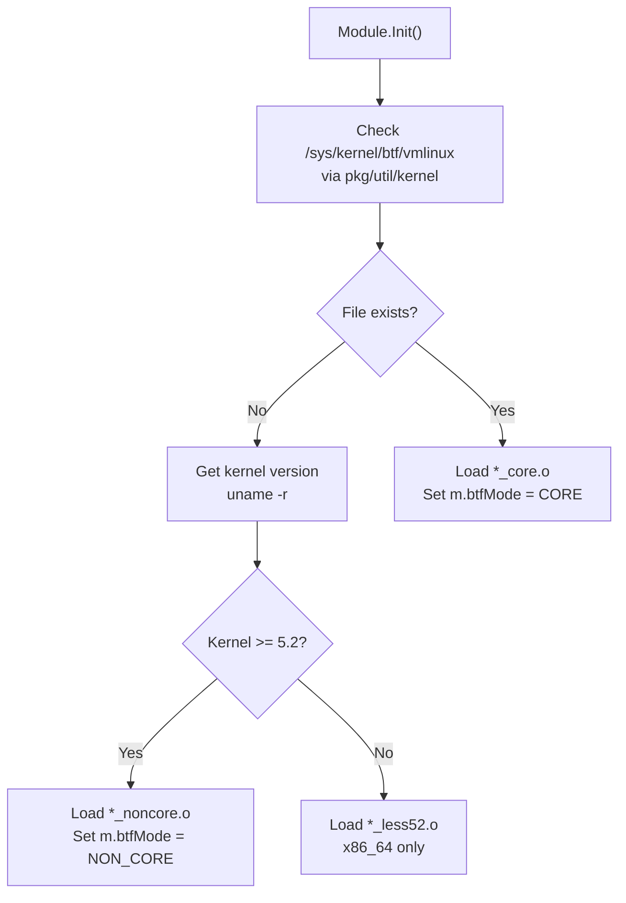
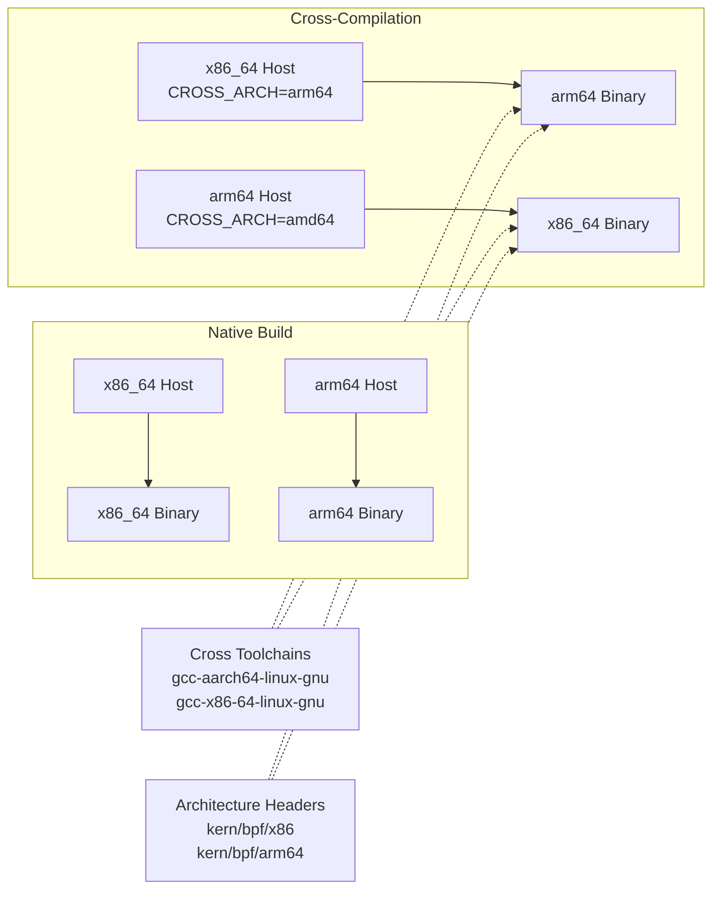
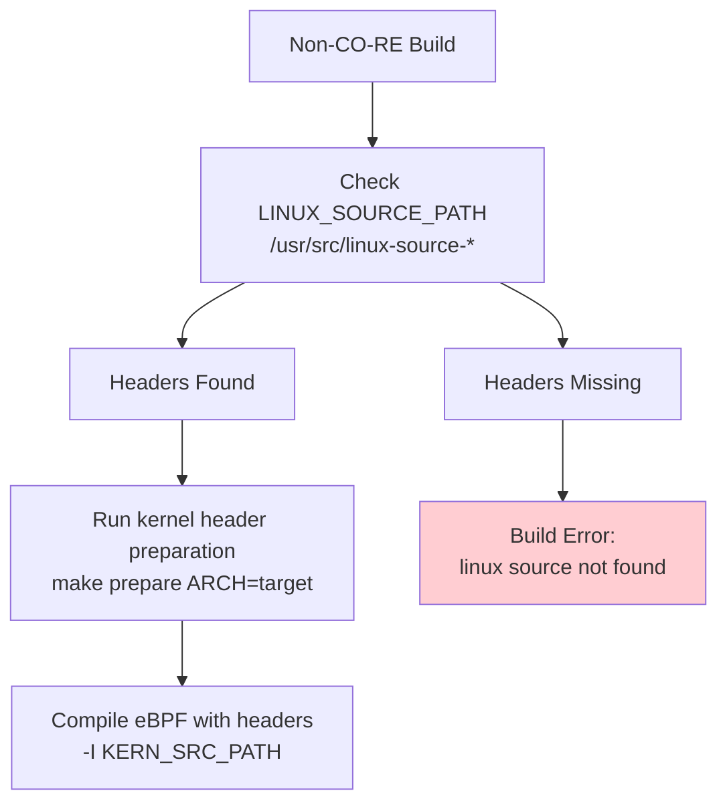
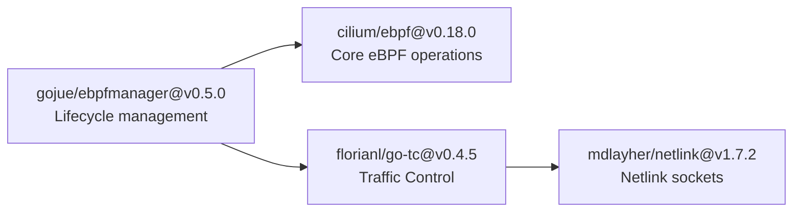
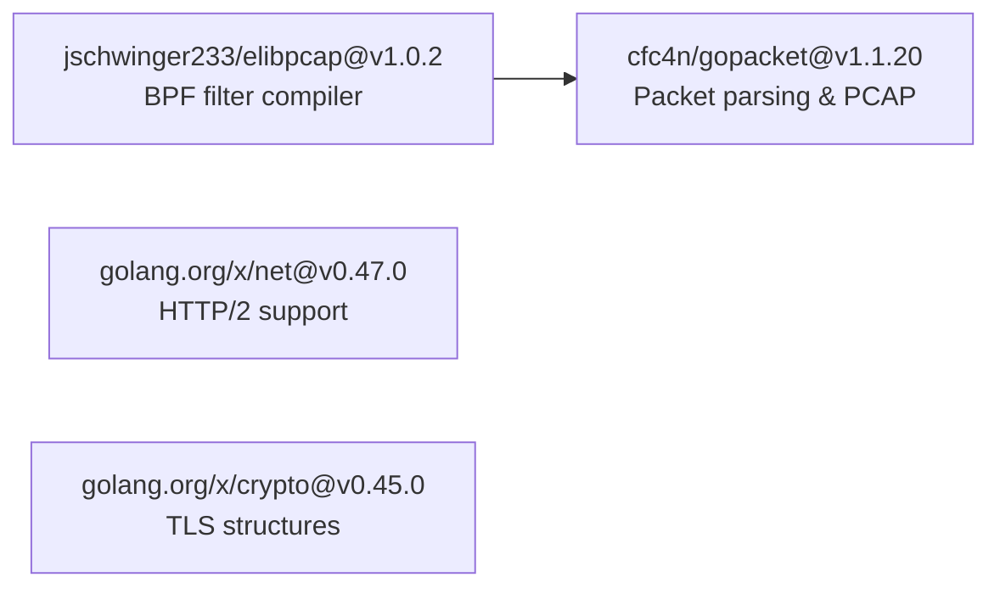
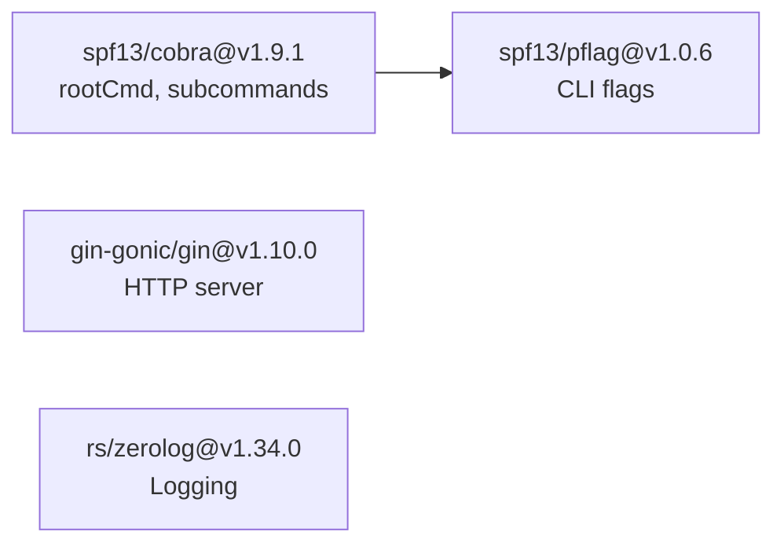
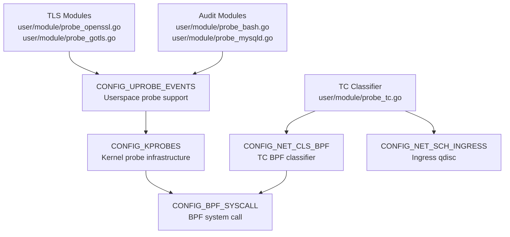
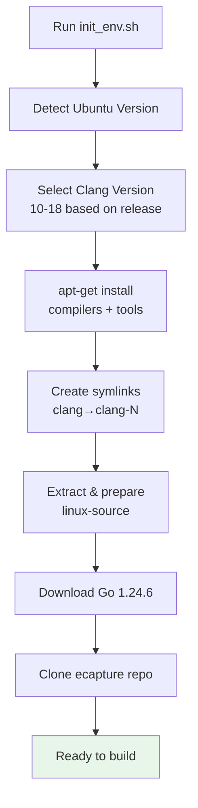
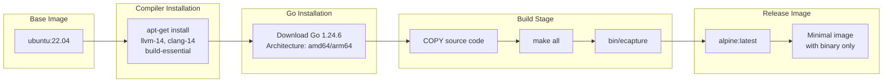

# Dependencies and System Requirements

<details>
<summary>Relevant source files</summary>

The following files were used as context for generating this wiki page:

- [.github/workflows/codeql-analysis.yml](https://github.com/gojue/ecapture/blob/ca085d05/.github/workflows/codeql-analysis.yml)
- [.github/workflows/go-c-cpp.yml](https://github.com/gojue/ecapture/blob/ca085d05/.github/workflows/go-c-cpp.yml)
- [.github/workflows/release.yml](https://github.com/gojue/ecapture/blob/ca085d05/.github/workflows/release.yml)
- [CHANGELOG.md](https://github.com/gojue/ecapture/blob/ca085d05/CHANGELOG.md)
- [Makefile](https://github.com/gojue/ecapture/blob/ca085d05/Makefile)
- [README.md](https://github.com/gojue/ecapture/blob/ca085d05/README.md)
- [README_CN.md](https://github.com/gojue/ecapture/blob/ca085d05/README_CN.md)
- [builder/Dockerfile](https://github.com/gojue/ecapture/blob/ca085d05/builder/Dockerfile)
- [builder/Makefile.release](https://github.com/gojue/ecapture/blob/ca085d05/builder/Makefile.release)
- [builder/init_env.sh](https://github.com/gojue/ecapture/blob/ca085d05/builder/init_env.sh)
- [functions.mk](https://github.com/gojue/ecapture/blob/ca085d05/functions.mk)
- [go.mod](https://github.com/gojue/ecapture/blob/ca085d05/go.mod)
- [go.sum](https://github.com/gojue/ecapture/blob/ca085d05/go.sum)
- [images/ecapture-help-v0.8.9.svg](https://github.com/gojue/ecapture/blob/ca085d05/images/ecapture-help-v0.8.9.svg)
- [main.go](https://github.com/gojue/ecapture/blob/ca085d05/main.go)
- [user/config/config_gotls.go](https://github.com/gojue/ecapture/blob/ca085d05/user/config/config_gotls.go)
- [user/module/probe_gotls_keylog.go](https://github.com/gojue/ecapture/blob/ca085d05/user/module/probe_gotls_keylog.go)
- [user/module/probe_gotls_text.go](https://github.com/gojue/ecapture/blob/ca085d05/user/module/probe_gotls_text.go)

</details>


This page documents the system requirements, dependencies, and toolchain prerequisites for building and running eCapture. It covers kernel version requirements, supported architectures, build-time tooling, runtime dependencies, and Go package dependencies.

For information about the build process itself, see [Build System](../5-development-guide/5.1-build-system.md). For installation instructions, see [Installation and Quick Start](1.1-installation-and-quick-start.md).

---

## Overview

eCapture has distinct requirements for build-time (compiling eBPF programs and Go binary) and runtime (executing the compiled binary). The system supports two compilation modes with different requirements:

- **CO-RE (Compile Once - Run Everywhere)**: Requires BTF-enabled kernels (≥5.2) at runtime, but produces portable binaries
- **Non-CO-RE**: Requires kernel headers at build-time, produces kernel-specific binaries for older systems

---

## Kernel Requirements

### Minimum Kernel Versions

eCapture requires different minimum kernel versions depending on CPU architecture and compilation mode:

| Architecture | Minimum Version | BTF/CO-RE Support | Non-CO-RE Support |
|--------------|----------------|-------------------|-------------------|
| x86_64 (amd64) | 4.18+ | ≥5.2 recommended | ≥4.18 |
| aarch64 (arm64) | 5.5+ | ≥5.5 | ≥5.5 |

**Critical Constraint**: ARM64 support requires kernel 5.5 or newer regardless of compilation mode. This is enforced at runtime and documented in [README.md:14](https://github.com/gojue/ecapture/blob/ca085d05/README.md#L14).

### Compilation Mode Requirements

| Mode | Kernel Requirement | BTF Required | Bytecode Suffix |
|------|-------------------|--------------|-----------------|
| CO-RE | ≥5.2 (x86_64), ≥5.5 (arm64) | Yes | `_core.o` |
| CO-RE (legacy) | 4.18-5.1 (x86_64 only) | No | `_less52.o` |
| Non-CO-RE | ≥4.18 (x86_64), ≥5.5 (arm64) | No | `_noncore.o` |

The kernel version detection and handling is implemented in [variables.mk:1-20](https://github.com/gojue/ecapture/blob/ca085d05/variables.mk#L1-L20) which sets `KERNEL_LESS_5_2_PREFIX` for kernels < 5.2. The runtime selection logic is in [pkg/util/kernel/kernel.go](https://github.com/gojue/ecapture/blob/ca085d05/pkg/util/kernel/kernel.go).

### BTF (BPF Type Format) Support

BTF is required for CO-RE mode. The runtime detection determines which bytecode variant to load:

**Runtime Bytecode Selection Flow**



**Detection Implementation**: The `Module` base class implements BTF detection in its initialization sequence. The file `/sys/kernel/btf/vmlinux` is checked using standard file existence checks. The `btfMode` field in the module struct stores the selected mode (0=CORE, 1=NON_CORE).

**Bytecode Location**: All variants are embedded in the binary via go-bindata at [user/bytecode/](https://github.com/gojue/ecapture/blob/ca085d05/user/bytecode/) and selected at runtime based on kernel capabilities.

Sources: [pkg/util/kernel/kernel.go](https://github.com/gojue/ecapture/blob/ca085d05/pkg/util/kernel/kernel.go), [user/module/module.go](https://github.com/gojue/ecapture/blob/ca085d05/user/module/module.go), [Makefile:122-134](https://github.com/gojue/ecapture/blob/ca085d05/Makefile#L122-L134)

---

## Supported Architectures

| Architecture | Status | Kernel Minimum | Cross-Compilation | Notes |
|--------------|--------|----------------|-------------------|-------|
| x86_64 (amd64) | ✅ Full | 4.18+ | To arm64 | Primary development platform |
| aarch64 (arm64) | ✅ Full | 5.5+ | To x86_64 | Full feature parity, higher kernel requirement |
| Android arm64 | ⚠️ Limited | 5.5+ | From x86_64/arm64 | BoringSSL-only, requires Redroid/Docker |

Architecture detection is handled in [variables.mk:25-35](https://github.com/gojue/ecapture/blob/ca085d05/variables.mk#L25-L35) which sets `TARGET_ARCH`, `GOARCH`, `LINUX_ARCH`, and `LIBPCAP_ARCH` based on `uname -m` or `CROSS_ARCH` environment variable. The Android build target is specified via [Makefile:253-265](https://github.com/gojue/ecapture/blob/ca085d05/Makefile#L253-L265) and uses non-CO-RE bytecode exclusively.



Sources: [.github/workflows/go-c-cpp.yml:59-65](https://github.com/gojue/ecapture/blob/ca085d05/.github/workflows/go-c-cpp.yml#L59-L65), [.github/workflows/release.yml:93-97](https://github.com/gojue/ecapture/blob/ca085d05/.github/workflows/release.yml#L93-L97), [builder/init_env.sh:43-61](https://github.com/gojue/ecapture/blob/ca085d05/builder/init_env.sh#L43-L61)

---

## Build-Time Dependencies

### Required Compilers and Tools

The following table lists all build-time dependencies with minimum versions:

| Tool | Minimum Version | Purpose | Package Name (Ubuntu) |
|------|----------------|---------|----------------------|
| **clang** | 9.0+ | Compile eBPF C to bytecode | `clang-14` (recommended) |
| **llc** | 9.0+ | LLVM compiler backend | `llvm-14` |
| **llvm-strip** | 9.0+ | Strip debug symbols | `llvm-14` |
| **gcc** | System default | C compilation, CGO | `build-essential` |
| **go** | 1.24.3+ | Go compilation | N/A (install from golang.org) |
| **bpftool** | Any | Generate `vmlinux.h` from BTF | `linux-tools-generic` |
| **flex** | Any | Lexer for kernel builds | `flex` |
| **bison** | Any | Parser for kernel builds | `bison` |
| **elfutils** | Any | ELF file manipulation | `libelf-dev` |
| **pkgconf** | Any | Package configuration | `pkgconf` |
| **libssl-dev** | Any | SSL headers for offset extraction | `libssl-dev` |
| **go-bindata** | 4.0.0+ | Embed bytecode in `assets/` | `github.com/shuLhan/go-bindata` |

**Version Enforcement:**

Build-time version checks are implemented in [functions.mk:13-35](https://github.com/gojue/ecapture/blob/ca085d05/functions.mk#L13-L35):
- **Clang**: `CLANG_VERSION >= 9` (extracted from `clang --version`)
- **Go**: `GO_VERSION_MAJ=1` and `GO_VERSION_MIN >= 24` (from `go version`)

The minimum Go version is declared in [go.mod:3](https://github.com/gojue/ecapture/blob/ca085d05/go.mod#L3) as `go 1.24.3`. CI workflows use Go 1.24.6 as specified in [.github/workflows/go-c-cpp.yml:15](https://github.com/gojue/ecapture/blob/ca085d05/.github/workflows/go-c-cpp.yml#L15) and [.github/workflows/release.yml:19](https://github.com/gojue/ecapture/blob/ca085d05/.github/workflows/release.yml#L19).

**Tool Symlinks:**

The build system expects tools to be available without version suffixes. The [builder/init_env.sh:75-79](https://github.com/gojue/ecapture/blob/ca085d05/builder/init_env.sh#L75-L79) script creates symlinks:
```bash
sudo ln -s /usr/bin/clang-14 /usr/bin/clang
sudo ln -s /usr/bin/llc-14 /usr/bin/llc
sudo ln -s /usr/bin/llvm-strip-14 /usr/bin/llvm-strip
```

Sources: [.github/workflows/go-c-cpp.yml:16-24](https://github.com/gojue/ecapture/blob/ca085d05/.github/workflows/go-c-cpp.yml#L16-L24), [.github/workflows/release.yml:17-19](https://github.com/gojue/ecapture/blob/ca085d05/.github/workflows/release.yml#L17-L19), [functions.mk:13-35](https://github.com/gojue/ecapture/blob/ca085d05/functions.mk#L13-L35), [go.mod:3](https://github.com/gojue/ecapture/blob/ca085d05/go.mod#L3), [builder/init_env.sh:72-79](https://github.com/gojue/ecapture/blob/ca085d05/builder/init_env.sh#L72-L79)

### Kernel Headers (Non-CO-RE Only)

For non-CO-RE builds, kernel headers matching the target kernel are required. The build system searches for headers in multiple locations:



Header paths used during compilation [Makefile:154-161](https://github.com/gojue/ecapture/blob/ca085d05/Makefile#L154-L161):
- `-I $(KERN_SRC_PATH)/arch/$(LINUX_ARCH)/include`
- `-I $(KERN_BUILD_PATH)/arch/$(LINUX_ARCH)/include/generated`
- `-I $(KERN_SRC_PATH)/include`
- `-I $(KERN_BUILD_PATH)/include/generated/uapi`

Sources: [Makefile:98-104](https://github.com/gojue/ecapture/blob/ca085d05/Makefile#L98-L104), [Makefile:146-183](https://github.com/gojue/ecapture/blob/ca085d05/Makefile#L146-L183), [builder/init_env.sh:81-89](https://github.com/gojue/ecapture/blob/ca085d05/builder/init_env.sh#L81-L89)

### Cross-Compilation Dependencies

Cross-compilation requires architecture-specific toolchains:

| Host → Target | Required Package | Notes |
|---------------|-----------------|-------|
| x86_64 → arm64 | `gcc-aarch64-linux-gnu` | Sets `CC=aarch64-linux-gnu-gcc` |
| arm64 → x86_64 | `gcc-x86-64-linux-gnu` | Ubuntu 24.04+ package name |
| Any → Android | NDK not required | Uses standard cross-compiler |

Sources: [.github/workflows/go-c-cpp.yml:19](https://github.com/gojue/ecapture/blob/ca085d05/.github/workflows/go-c-cpp.yml#L19), [builder/init_env.sh:46-58](https://github.com/gojue/ecapture/blob/ca085d05/builder/init_env.sh#L46-L58)

---

## Go Dependencies

### Core Dependencies

The project uses Go 1.24.3 as specified in [go.mod:3](https://github.com/gojue/ecapture/blob/ca085d05/go.mod#L3). Major dependencies by category:

**eBPF and Program Management**



**Network and Protocol Handling**



**CLI and API Framework**



**Dependency Details:**

The following dependencies form the core infrastructure of eCapture:

1. **cilium/ebpf v0.18.0** [go.mod:6](https://github.com/gojue/ecapture/blob/ca085d05/go.mod#L6)
   - Core eBPF library providing:
     - `ebpf.CollectionSpec`: Loads eBPF program bytecode
     - `ebpf.Map`: BPF map operations (read/write/update)
     - `btf.Spec`: CO-RE relocation handling for kernel structure compatibility
   - Used in all modules for low-level eBPF interactions

2. **gojue/ebpfmanager v0.5.0** [go.mod:8](https://github.com/gojue/ecapture/blob/ca085d05/go.mod#L8)
   - Lifecycle management wrapper implementing:
     - `manager.Manager`: Orchestrates multiple probes and maps
     - `manager.Probe`: Uprobe/kprobe attachment metadata
     - `manager.InitWithOptions()`: eBPF program loading and verification
   - Abstracts cilium/ebpf complexity in [user/module/module.go](https://github.com/gojue/ecapture/blob/ca085d05/user/module/module.go)

3. **cfc4n/gopacket v1.1.20** [go.mod:60](https://github.com/gojue/ecapture/blob/ca085d05/go.mod#L60)
   - Fork of `google/gopacket` with PCAP-NG DSB support
   - Key types:
     - `layers.Ethernet`, `layers.IPv4`: Packet construction
     - `pcapgo.NgWriter`: PCAP-NG file writing with decryption secrets
   - Used in [user/module/probe_openssl.go](https://github.com/gojue/ecapture/blob/ca085d05/user/module/probe_openssl.go) and [user/module/probe_gotls.go](https://github.com/gojue/ecapture/blob/ca085d05/user/module/probe_gotls.go) for pcap mode

4. **jschwinger233/elibpcap v1.0.2** [go.mod:10](https://github.com/gojue/ecapture/blob/ca085d05/go.mod#L10)
   - BPF filter compiler wrapping libpcap's `pcap_compile()`
   - Function: `NewBPFFilter(expr string) ([]bpf.RawInstruction, error)`
   - Translates tcpdump-style expressions (e.g., `"tcp port 443"`) into BPF bytecode
   - Used in [user/module/probe_tc.go](https://github.com/gojue/ecapture/blob/ca085d05/user/module/probe_tc.go) for packet filtering

5. **shuLhan/go-bindata v4.0.0** [go.mod:12](https://github.com/gojue/ecapture/blob/ca085d05/go.mod#L12)
   - Build-time tool embedding eBPF `.o` files as Go byte arrays
   - Generates [assets/ebpf_probe.go](https://github.com/gojue/ecapture/blob/ca085d05/assets/ebpf_probe.go) containing `Asset(name string) ([]byte, error)`
   - Invoked by [Makefile:164-171](https://github.com/gojue/ecapture/blob/ca085d05/Makefile#L164-L171) targets `assets` and `assets_noncore`

6. **spf13/cobra v1.9.1** [go.mod:13](https://github.com/gojue/ecapture/blob/ca085d05/go.mod#L13)
   - CLI framework defining command tree:
     - `rootCmd` in [cli/cmd/root.go](https://github.com/gojue/ecapture/blob/ca085d05/cli/cmd/root.go)
     - Module subcommands: `tlsCmd`, `gotlsCmd`, `bashCmd` in [cli/cmd/](https://github.com/gojue/ecapture/blob/ca085d05/cli/cmd/)
   - Provides flag parsing and help generation

7. **gin-gonic/gin v1.10.0** [go.mod:7](https://github.com/gojue/ecapture/blob/ca085d05/go.mod#L7)
   - HTTP server framework for remote configuration API
   - Router defined in [cli/cmd/root.go](https://github.com/gojue/ecapture/blob/ca085d05/cli/cmd/root.go)
   - Default listen address: `localhost:28256`
   - API endpoints documented in [docs/remote-config-update-api.md](https://github.com/gojue/ecapture/blob/ca085d05/docs/remote-config-update-api.md)

8. **google.golang.org/protobuf v1.36.6** [go.mod:19](https://github.com/gojue/ecapture/blob/ca085d05/go.mod#L19)
   - Protocol buffer runtime for event serialization
   - Schema: [protobuf/log.proto](https://github.com/gojue/ecapture/blob/ca085d05/protobuf/log.proto) defining `LogEntry`, `Event` messages
   - Used in WebSocket event forwarding to eCaptureQ GUI

9. **golang.org/x/crypto v0.45.0** [go.mod:16](https://github.com/gojue/ecapture/blob/ca085d05/go.mod#L16)
   - TLS structure definitions (`tls.ConnectionState`, `tls.Config`)
   - Used in [user/config/config_gotls.go](https://github.com/gojue/ecapture/blob/ca085d05/user/config/config_gotls.go) for Go binary symbol parsing

10. **golang.org/x/net v0.47.0** [go.mod:17](https://github.com/gojue/ecapture/blob/ca085d05/go.mod#L17)
    - HTTP/2 framing: `http2.Framer`, `http2.Frame`
    - Used in [pkg/event_processor/](https://github.com/gojue/ecapture/blob/ca085d05/pkg/event_processor/) for HTTP/2 request/response parsing

Sources: [go.mod:3-20](https://github.com/gojue/ecapture/blob/ca085d05/go.mod#L3-L20), [go.sum:1-200](https://github.com/gojue/ecapture/blob/ca085d05/go.sum#L1-L200)

### Indirect Dependencies

Critical indirect dependencies include:

| Package | Version | Purpose |
|---------|---------|---------|
| `florianl/go-tc` | v0.4.5 | Linux Traffic Control netlink interface |
| `vishvananda/netlink` | v1.3.1 | Generic netlink operations |
| `mdlayher/netlink` | v1.7.2 | Low-level netlink socket library |
| `hashicorp/go-multierror` | v1.1.1 | Error aggregation |

Sources: [go.mod:22-58](https://github.com/gojue/ecapture/blob/ca085d05/go.mod#L22-L58)

---

## Runtime Dependencies

### Minimal Runtime Requirements

The compiled `ecapture` binary has no runtime dependencies beyond kernel features:

| Requirement | Description |
|-------------|-------------|
| Linux kernel | x86_64: 4.18+, arm64: 5.5+ |
| BTF support | For CO-RE mode, requires `/sys/kernel/btf/vmlinux` |
| `CAP_SYS_ADMIN` | Root privileges to load eBPF programs |
| `CAP_BPF` + `CAP_PERFMON` | On kernels 5.8+ as alternative to `CAP_SYS_ADMIN` |

**Static Linking**: The binary is statically linked with libpcap via CGO flags in [functions.mk:48-53](https://github.com/gojue/ecapture/blob/ca085d05/functions.mk#L48-L53):
```
CGO_CFLAGS='-I$(CURDIR)/lib/libpcap/'
CGO_LDFLAGS='-L$(CURDIR)/lib/libpcap/ -lpcap -static'
LDFLAGS='-linkmode=external -extldflags -static'
```

This produces a self-contained binary with no shared library dependencies. Verification: `ldd ecapture` should show "not a dynamic executable".

**Capability Checking**: The capability check is implemented in [cli/cmd/root.go](https://github.com/gojue/ecapture/blob/ca085d05/cli/cmd/root.go) using Linux capability syscalls. The check distinguishes between `CAP_BPF` (preferred on 5.8+) and `CAP_SYS_ADMIN` (required on older kernels).

### Kernel Feature Requirements by Module

Module-specific kernel configuration requirements:

**Required Kernel Config Symbols**



**Module Requirements Table:**

| Module | eBPF Program Type | Kernel Config | Attachment Function |
|--------|------------------|---------------|---------------------|
| `probe_openssl.go` | Uprobe | `CONFIG_UPROBE_EVENTS` | `SSL_read`, `SSL_write` |
| `probe_gotls.go` | Uprobe | `CONFIG_UPROBE_EVENTS` | `crypto/tls.(*Conn).Read` |
| `probe_bash.go` | Uprobe | `CONFIG_UPROBE_EVENTS` | `readline` |
| `probe_tc.go` | TC classifier | `CONFIG_NET_CLS_BPF` | `tc_ingress`, `tc_egress` |
| `probe_mysqld.go` | Uprobe | `CONFIG_UPROBE_EVENTS` | `dispatch_command` |

**Config Verification**: Check current kernel config with:
```bash
grep -E "CONFIG_(UPROBE|KPROBES|BPF|NET_CLS_BPF)" /boot/config-$(uname -r)
```

All modules require `CONFIG_BPF_SYSCALL=y` as the base requirement.

Sources: [user/module/probe_openssl.go:1-50](https://github.com/gojue/ecapture/blob/ca085d05/user/module/probe_openssl.go#L1-L50), [user/module/probe_tc.go:1-50](https://github.com/gojue/ecapture/blob/ca085d05/user/module/probe_tc.go#L1-L50), [kern/tc_kern.c:1-30](https://github.com/gojue/ecapture/blob/ca085d05/kern/tc_kern.c#L1-L30)

---

## Compilation Modes Comparison

### CO-RE vs Non-CO-RE

| Aspect | CO-RE Mode | Non-CO-RE Mode |
|--------|-----------|----------------|
| **Build Requirements** | clang, llc, vmlinux.h (BTF) | clang, llc, full kernel headers |
| **Runtime Requirements** | BTF-enabled kernel: x86_64 ≥5.2, arm64 ≥5.5 | x86_64 ≥4.18, arm64 ≥5.5 |
| **Portability** | Single binary for all compatible kernels | Binary tied to specific kernel version |
| **Bytecode Size** | Larger (includes BTF relocation metadata) | Smaller (hardcoded offsets) |
| **Build Time** | Fast (no kernel source extraction) | Slow (requires `make prepare` in kernel source) |
| **Use Case** | Distribution binaries, modern systems | Legacy x86_64 systems (4.18-5.1), Android |

**Compilation Flag Differences:**

CO-RE [Makefile:122-134](https://github.com/gojue/ecapture/blob/ca085d05/Makefile#L122-L134):
```bash
clang -target bpfel -D__TARGET_ARCH_$(LINUX_ARCH) \
  -D__BPF_TRACING__ -DCORE \
  -I/usr/include/$(LINUX_ARCH)-linux-gnu \
  -g -O2 -c kern/openssl_kern.c -o openssl_kern_core.o
```

Non-CO-RE [Makefile:146-166](https://github.com/gojue/ecapture/blob/ca085d05/Makefile#L146-L166):
```bash
clang -D__KERNEL__ -D__ASM_SYSREG_H \
  -I $(KERN_SRC_PATH)/arch/$(LINUX_ARCH)/include \
  -I $(KERN_BUILD_PATH)/include/generated \
  -I $(KERN_SRC_PATH)/include \
  -I $(KERN_BUILD_PATH)/include/generated/uapi \
  -g -O2 -emit-llvm -c kern/openssl_kern.c -o - | \
llc -march=bpf -filetype=obj -o openssl_kern_noncore.o
```

Key difference: CO-RE uses `-target bpfel` for direct BPF output, while non-CO-RE uses LLVM IR (`-emit-llvm`) then `llc` for compilation. Non-CO-RE includes explicit kernel header paths.

**Bytecode Embedding**: Both variants are embedded via go-bindata in [Makefile:243-249](https://github.com/gojue/ecapture/blob/ca085d05/Makefile#L243-L249) and stored in [assets/ebpf_probe.go](https://github.com/gojue/ecapture/blob/ca085d05/assets/ebpf_probe.go). Runtime selection occurs in module initialization.

Sources: [Makefile:122-183](https://github.com/gojue/ecapture/blob/ca085d05/Makefile#L122-L183), [variables.mk:1-50](https://github.com/gojue/ecapture/blob/ca085d05/variables.mk#L1-L50)

---

## Development Environment Setup

### Automated Setup (Ubuntu)

The project provides [builder/init_env.sh](https://github.com/gojue/ecapture/blob/ca085d05/builder/init_env.sh) for automated environment setup:



Version-specific clang selection in [builder/init_env.sh:16-39](https://github.com/gojue/ecapture/blob/ca085d05/builder/init_env.sh#L16-L39):
- Ubuntu 20.04 (Focal): clang-10, llvm-10
- Ubuntu 22.04 (Jammy): clang-12, llvm-12
- Ubuntu 23.04 (Lunar): clang-15, llvm-15
- Ubuntu 23.10 (Mantic): clang-15, llvm-15
- Ubuntu 24.04 (Noble): clang-18, llvm-18

The script creates symlinks `/usr/bin/clang` → `/usr/bin/clang-N` to ensure consistent naming.

**Go Installation**: The script downloads Go 1.24.6 from `https://golang.google.cn/dl/go1.24.6.linux-{amd64,arm64}.tar.gz` (using Chinese mirror) as shown in [builder/init_env.sh:63-64](https://github.com/gojue/ecapture/blob/ca085d05/builder/init_env.sh#L63-L64) and [builder/init_env.sh:94-97](https://github.com/gojue/ecapture/blob/ca085d05/builder/init_env.sh#L94-L97), then extracts to `/usr/local/go`.

Sources: [builder/init_env.sh:1-106](https://github.com/gojue/ecapture/blob/ca085d05/builder/init_env.sh#L1-L106)

### Manual Setup

For manual setup, install these package groups:

**Essential Tools:**
```bash
sudo apt-get install build-essential pkgconf libelf-dev libssl-dev
```

**LLVM Toolchain (version-specific):**
```bash
# Ubuntu 22.04 and later
sudo apt-get install llvm-14 clang-14

# Create version-agnostic symlinks (required by Makefile)
sudo ln -sf /usr/bin/clang-14 /usr/bin/clang
sudo ln -sf /usr/bin/llc-14 /usr/bin/llc
sudo ln -sf /usr/bin/llvm-strip-14 /usr/bin/llvm-strip
```

**Kernel Tools:**
```bash
sudo apt-get install linux-tools-common linux-tools-generic flex bison
```

**Cross-Compilation (optional):**
```bash
# For arm64 target on x86_64 host
sudo apt-get install gcc-aarch64-linux-gnu

# For x86_64 target on arm64 host (Ubuntu 24.04+)
sudo apt-get install gcc-x86-64-linux-gnu
```

**Kernel Headers (for non-CO-RE mode only):**
```bash
sudo apt-get install linux-source
cd /usr/src
sudo tar -xf linux-source-*.tar.bz2
cd linux-source-*/

# Prepare headers for native architecture
sudo make oldconfig
sudo make prepare

# For cross-compilation, prepare target architecture headers
sudo make ARCH=arm64 CROSS_COMPILE=aarch64-linux-gnu- prepare
```

**Go Installation:**
```bash
# Download and install Go 1.24.3 or newer
wget https://go.dev/dl/go1.24.6.linux-amd64.tar.gz
sudo rm -rf /usr/local/go
sudo tar -C /usr/local -xzf go1.24.6.linux-amd64.tar.gz

# Add to PATH
export PATH=$PATH:/usr/local/go/bin
```

Sources: [.github/workflows/go-c-cpp.yml:16-33](https://github.com/gojue/ecapture/blob/ca085d05/.github/workflows/go-c-cpp.yml#L16-L33), [builder/init_env.sh:72-106](https://github.com/gojue/ecapture/blob/ca085d05/builder/init_env.sh#L72-L106)

---

## Docker Build Environment

The project provides a Dockerfile for containerized builds:



The multi-stage build [builder/Dockerfile:1-39](https://github.com/gojue/ecapture/blob/ca085d05/builder/Dockerfile#L1-L39):
1. **Builder stage**: Full toolchain on Ubuntu 22.04
2. **Release stage**: Minimal Alpine image with static binary

Build for multiple architectures:
```bash
docker buildx build --platform linux/amd64,linux/arm64 -t ecapture:latest .
```

Sources: [builder/Dockerfile:1-39](https://github.com/gojue/ecapture/blob/ca085d05/builder/Dockerfile#L1-L39), [.github/workflows/release.yml:101-129](https://github.com/gojue/ecapture/blob/ca085d05/.github/workflows/release.yml#L101-L129)

---

## Verification Commands

After setup, verify dependencies:

```bash
# Check tool versions (enforced by functions.mk:13-35)
clang --version          # Should be >= 9.0
go version               # Should be >= 1.24.3 (go.mod:3)
llc --version            # Should match clang version
llvm-strip --version     # Should match clang version
bpftool version          # Any version

# Check BTF support (runtime, required for CO-RE)
ls -l /sys/kernel/btf/vmlinux  # Should exist for CO-RE mode
file /sys/kernel/btf/vmlinux   # Should show "BTF data"

# Check eBPF kernel configs (from /boot/config-$(uname -r))
grep CONFIG_BPF_SYSCALL /boot/config-$(uname -r)     # Must be =y (all modules)
grep CONFIG_UPROBE_EVENTS /boot/config-$(uname -r)   # =y (TLS/audit modules)
grep CONFIG_KPROBES /boot/config-$(uname -r)         # =y (connection tracking)
grep CONFIG_NET_CLS_BPF /boot/config-$(uname -r)     # =y (TC packet capture)
grep CONFIG_NET_SCH_INGRESS /boot/config-$(uname -r) # =y (TC ingress qdisc)

# Verify static linking (should show "not a dynamic executable")
ldd ./bin/ecapture
# Expected output: "not a dynamic executable" or "statically linked"

# Check libpcap static library presence (build-time only)
ls -l ./lib/libpcap/libpcap.a

# Verify Go dependencies
go mod verify  # Should show "all modules verified"
```

**Runtime Capability Verification:**
```bash
# Check process capabilities (requires root or CAP_SYS_ADMIN)
sudo ./bin/ecapture --help
# Should not show capability errors

# For kernel 5.8+, check for CAP_BPF and CAP_PERFMON
sudo setcap cap_sys_admin,cap_bpf,cap_perfmon=eip ./bin/ecapture
getcap ./bin/ecapture
```

**Build System Verification:**
```bash
# Run environment check from Makefile
make env
# Should display all variables (CLANG_VERSION, GO_VERSION, KERN_RELEASE, etc.)

# Test CO-RE build
make clean
make all

# Test non-CO-RE build
make clean
make nocore
```

Sources: [functions.mk:2-39](https://github.com/gojue/ecapture/blob/ca085d05/functions.mk#L2-L39), [go.mod:3](https://github.com/gojue/ecapture/blob/ca085d05/go.mod#L3), [Makefile:19-64](https://github.com/gojue/ecapture/blob/ca085d05/Makefile#L19-L64), [README.md:14-16](https://github.com/gojue/ecapture/blob/ca085d05/README.md#L14-L16)

---

## Common Issues

### Clang Version Too Old

**Problem**: Build fails with "you MUST use clang 9 or newer"

**Solution**: Install a newer clang version and create symlinks [builder/init_env.sh:75-79](https://github.com/gojue/ecapture/blob/ca085d05/builder/init_env.sh#L75-L79):
```bash
sudo apt-get install clang-14 llc-14 llvm-strip-14
sudo ln -sf /usr/bin/clang-14 /usr/bin/clang
```

### Missing Kernel Headers

**Problem**: Non-CO-RE build fails with "linux source not found"

**Solution**: Install and prepare kernel headers [Makefile:98-104](https://github.com/gojue/ecapture/blob/ca085d05/Makefile#L98-L104):
```bash
sudo apt-get install linux-source
cd /usr/src && sudo tar -xf linux-source-*.tar.bz2
cd linux-source-*/ && sudo make prepare
```

### Go Version Too Old

**Problem**: Build fails with "you MUST use golang 1.24 or newer"

**Solution**: Download Go 1.24.6+ from [golang.org/dl](https://golang.org/dl/) and update PATH.

Sources: [functions.mk:13-35](https://github.com/gojue/ecapture/blob/ca085d05/functions.mk#L13-L35), [Makefile:98-104](https://github.com/gojue/ecapture/blob/ca085d05/Makefile#L98-L104), [builder/init_env.sh:72-89](https://github.com/gojue/ecapture/blob/ca085d05/builder/init_env.sh#L72-L89)