# eBPF Engine

<details>
<summary>Relevant source files</summary>

The following files were used as context for generating this wiki page:

- [CHANGELOG.md](https://github.com/gojue/ecapture/blob/ca085d05/CHANGELOG.md)
- [README.md](https://github.com/gojue/ecapture/blob/ca085d05/README.md)
- [README_CN.md](https://github.com/gojue/ecapture/blob/ca085d05/README_CN.md)
- [images/ecapture-help-v0.8.9.svg](https://github.com/gojue/ecapture/blob/ca085d05/images/ecapture-help-v0.8.9.svg)
- [kern/common.h](https://github.com/gojue/ecapture/blob/ca085d05/kern/common.h)
- [kern/ecapture.h](https://github.com/gojue/ecapture/blob/ca085d05/kern/ecapture.h)
- [kern/openssl.h](https://github.com/gojue/ecapture/blob/ca085d05/kern/openssl.h)
- [kern/openssl_masterkey.h](https://github.com/gojue/ecapture/blob/ca085d05/kern/openssl_masterkey.h)
- [kern/openssl_masterkey_3.0.h](https://github.com/gojue/ecapture/blob/ca085d05/kern/openssl_masterkey_3.0.h)
- [kern/tc.h](https://github.com/gojue/ecapture/blob/ca085d05/kern/tc.h)
- [main.go](https://github.com/gojue/ecapture/blob/ca085d05/main.go)
- [user/module/probe_openssl_keylog.go](https://github.com/gojue/ecapture/blob/ca085d05/user/module/probe_openssl_keylog.go)
- [user/module/probe_openssl_text.go](https://github.com/gojue/ecapture/blob/ca085d05/user/module/probe_openssl_text.go)

</details>


The eBPF Engine is the core component responsible for loading, verifying, and managing eBPF bytecode programs within the ecapture system. It handles kernel compatibility detection, dynamic bytecode selection between CO-RE (Compile Once, Run Everywhere) and non-CO-RE modes, program lifecycle management, and probe attachment. This engine serves as the bridge between user-space capture modules and kernel-space instrumentation.

For information about specific capture modules that utilize this engine, see [Capture Modules](../3-capture-modules/index.md). For details on eBPF program development and structure, see [eBPF Program Development](../5-development-guide/5.2-ebpf-program-development.md).

## Architecture Overview

The eBPF Engine operates as a multi-layer system that translates capture requirements into active kernel instrumentation:

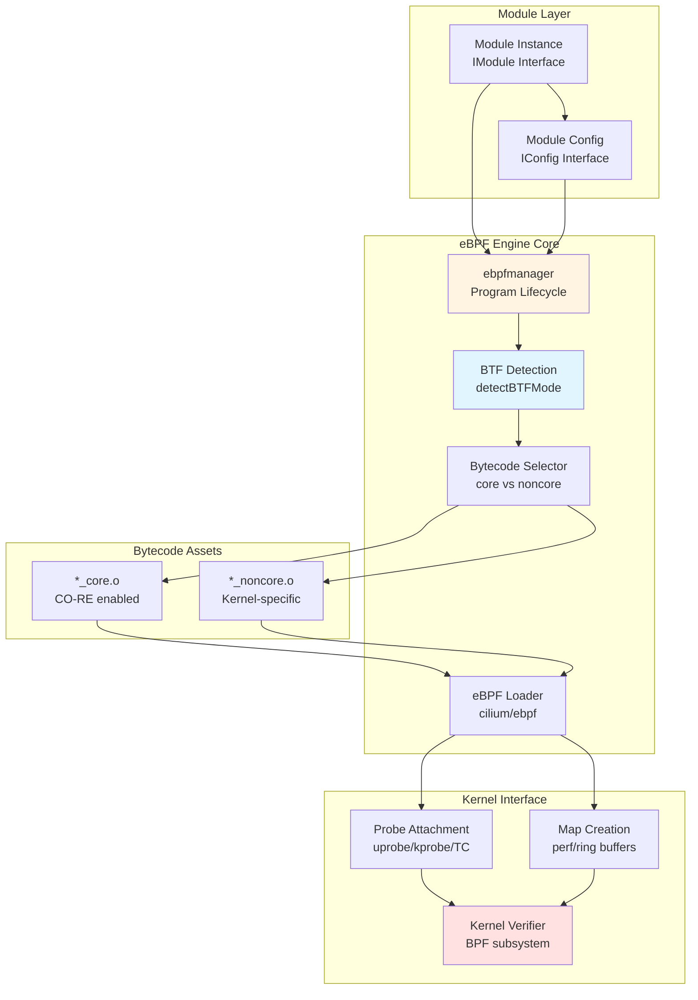

**Architecture Flow**: Capture modules instantiate the eBPF Engine through `ebpfmanager`, which performs BTF detection to determine kernel compatibility. Based on BTF availability and container status, the engine selects either CO-RE or non-CO-RE bytecode from embedded assets. The `cilium/ebpf` loader loads the bytecode and attaches probes, with the kernel verifier ensuring safety before allowing execution.

Sources: [Makefile:1-269](https://github.com/gojue/ecapture/blob/ca085d05/Makefile#L1-L269), [.github/workflows/go-c-cpp.yml:1-128](https://github.com/gojue/ecapture/blob/ca085d05/.github/workflows/go-c-cpp.yml#L1-L128), [README.md:1-335](https://github.com/gojue/ecapture/blob/ca085d05/README.md#L1-L335)

## CO-RE vs Non-CO-RE Modes

The eBPF Engine supports two distinct compilation and runtime modes to maximize kernel compatibility:

### Build-Time Compilation

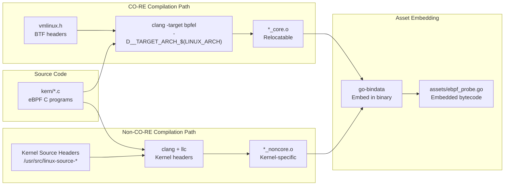

The build system produces both bytecode variants simultaneously, embedding them into the final binary through `go-bindata`.

**CO-RE Compilation** ([Makefile:118-135](https://github.com/gojue/ecapture/blob/ca085d05/Makefile#L118-L135)):
- Uses `clang -target bpfel` with BTF type information
- Produces position-independent bytecode with CO-RE relocations
- Single bytecode works across kernel versions (4.18+/5.5+ for arm64)
- Smaller build artifacts due to single version

**Non-CO-RE Compilation** ([Makefile:146-183](https://github.com/gojue/ecapture/blob/ca085d05/Makefile#L146-L183)):
- Requires full kernel source headers at build time
- Uses `clang` → `llc` pipeline with `-march=bpf`
- Bytecode contains hardcoded kernel structure offsets
- Kernel-specific: must match build kernel version

Sources: [Makefile:118-183](https://github.com/gojue/ecapture/blob/ca085d05/Makefile#L118-L183), [.github/workflows/go-c-cpp.yml:16-33](https://github.com/gojue/ecapture/blob/ca085d05/.github/workflows/go-c-cpp.yml#L16-L33), [builder/init_env.sh:1-106](https://github.com/gojue/ecapture/blob/ca085d05/builder/init_env.sh#L1-L106)

### Runtime Detection and Selection

The engine performs environment detection at startup to select the appropriate bytecode:

| Detection Factor | Method | Impact |
|-----------------|--------|--------|
| **BTF Availability** | Check `/sys/kernel/btf/vmlinux` existence | Enables CO-RE mode |
| **Container Environment** | Check `/proc/1/cgroup`, `/.dockerenv` | Forces CO-RE to avoid host kernel dependency |
| **Kernel Version** | `uname -r` parsing | Validates minimum version requirements |
| **Architecture** | `runtime.GOARCH` | Selects arch-specific bytecode |

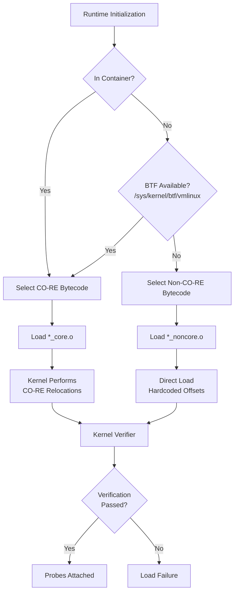

The detection logic prefers CO-RE when available, falling back to non-CO-RE only when BTF is absent and not running in a container. This ensures maximum portability while maintaining kernel-specific optimization capability.

Sources: [README.md:82-102](https://github.com/gojue/ecapture/blob/ca085d05/README.md#L82-L102), [CHANGELOG.md:228-230](https://github.com/gojue/ecapture/blob/ca085d05/CHANGELOG.md#L228-L230), [Makefile:38-63](https://github.com/gojue/ecapture/blob/ca085d05/Makefile#L38-L63)

## BTF Detection

BTF (BPF Type Format) is a metadata format that describes the types used in BPF programs and the kernel. The eBPF Engine uses BTF to enable CO-RE functionality:

### BTF Detection Process

The engine checks for BTF support through multiple indicators:

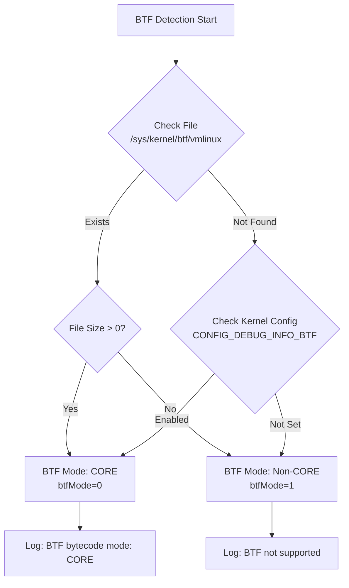

**Detection Implementation**:
1. Primary check: `/sys/kernel/btf/vmlinux` file existence and size
2. Fallback: Parse `/boot/config-$(uname -r)` for `CONFIG_DEBUG_INFO_BTF=y`
3. Runtime log indicates detected mode (see log output in examples)

### BTF Benefits for CO-RE

BTF enables several critical capabilities:

| Feature | Without BTF (non-CO-RE) | With BTF (CO-RE) |
|---------|-------------------------|------------------|
| **Structure Access** | Hardcoded offsets in bytecode | Runtime relocations by kernel |
| **Kernel Portability** | Single target kernel version | All kernels with BTF |
| **Build Requirements** | Full kernel headers needed | Only vmlinux.h needed |
| **Container Support** | Requires host kernel match | Adapts to host kernel automatically |
| **Binary Size** | Per-kernel-version bytecode | Single bytecode for all |

The CO-RE relocations happen during eBPF program load, where the kernel's BTF information is used to resolve field offsets, type sizes, and existence checks.

Sources: [README.md:89](https://github.com/gojue/ecapture/blob/ca085d05/README.md#L89), [README_CN.md:90](https://github.com/gojue/ecapture/blob/ca085d05/README_CN.md#L90), [CHANGELOG.md:249-250](https://github.com/gojue/ecapture/blob/ca085d05/CHANGELOG.md#L249-L250)

## Bytecode Loading

The eBPF Engine uses the `cilium/ebpf` library to load bytecode into the kernel. The loading process involves bytecode selection, asset extraction, and kernel verification:

### Bytecode Asset Management

All eBPF bytecode is embedded into the binary at build time using `go-bindata`:

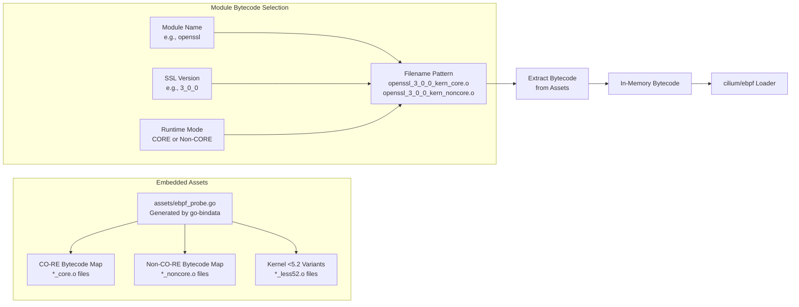

The asset generation happens in the build process ([Makefile:186-195](https://github.com/gojue/ecapture/blob/ca085d05/Makefile#L186-L195)):
- `go-bindata` scans `user/bytecode/*.o` files
- Generates `assets/ebpf_probe.go` with embedded byte arrays
- Each bytecode file is accessible by its original filename

### Loading Sequence

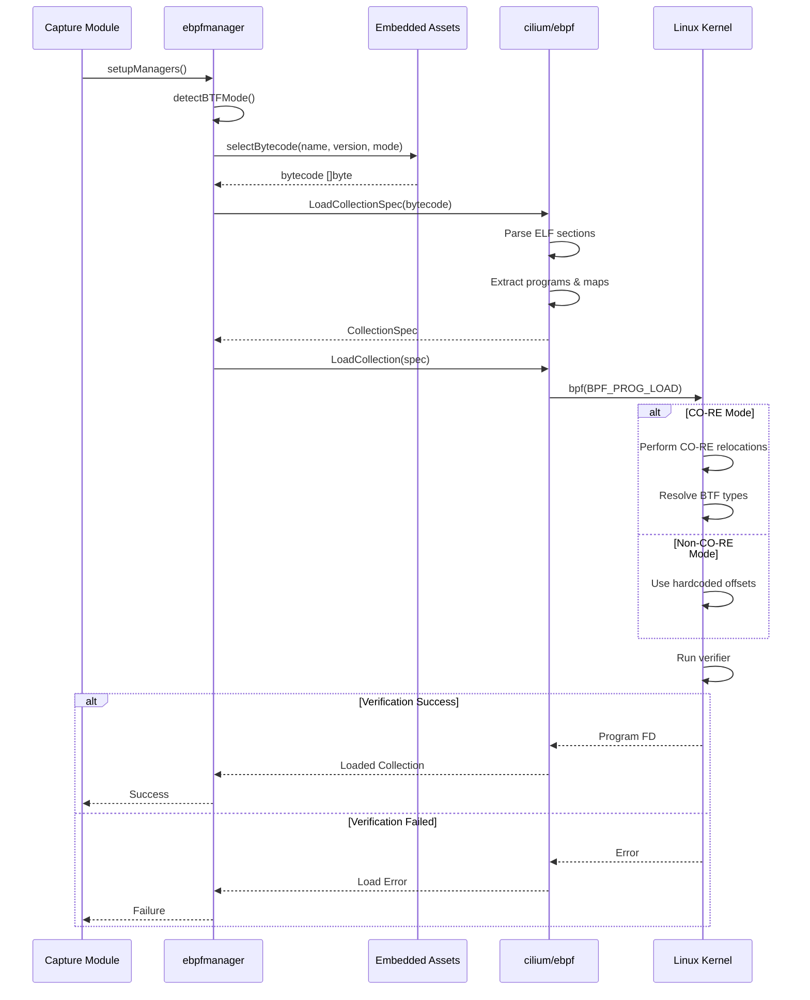

The loading process includes:
1. **Bytecode Selection**: Based on module name, version, and detected mode
2. **ELF Parsing**: Extract program definitions, map definitions, and BTF info
3. **Kernel Loading**: Submit bytecode via `bpf()` syscall
4. **Verification**: Kernel verifier checks safety constraints
5. **Relocation** (CO-RE only): Resolve structure field offsets using BTF

Sources: [Makefile:186-195](https://github.com/gojue/ecapture/blob/ca085d05/Makefile#L186-L195), [README.md:89-102](https://github.com/gojue/ecapture/blob/ca085d05/README.md#L89-L102)

## Probe Attachment Mechanisms

The eBPF Engine supports three primary probe attachment types, each serving different instrumentation needs:

### Probe Types

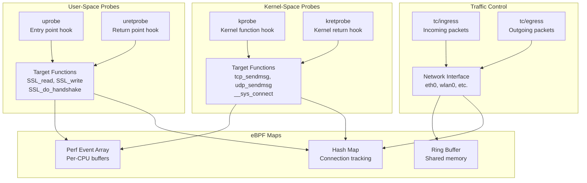

### Uprobe Attachment

Uprobes instrument user-space functions by placing breakpoints at function entry and return points:

| Aspect | Implementation |
|--------|---------------|
| **Target Discovery** | ELF symbol table parsing, dynamic library path resolution |
| **Offset Calculation** | Symbol table lookup for function address |
| **Attachment Method** | `link.Uprobe()` via `cilium/ebpf` |
| **Common Targets** | `SSL_read`, `SSL_write`, `SSL_do_handshake`, `crypto/tls.*` |
| **Event Context** | PID, TID, function arguments, return value |

**Example**: OpenSSL module attaches to `SSL_read` at offset determined by parsing `/usr/lib/x86_64-linux-gnu/libssl.so.3` ELF symbols.

### Kprobe Attachment

Kprobes instrument kernel functions for network connection tracking:

| Aspect | Implementation |
|--------|---------------|
| **Target Discovery** | `/proc/kallsyms` kernel symbol table |
| **Offset Calculation** | Direct symbol address from kallsyms |
| **Attachment Method** | `link.Kprobe()` via `cilium/ebpf` |
| **Common Targets** | `tcp_sendmsg`, `udp_sendmsg`, `__sys_connect`, `inet_csk_accept` |
| **Event Context** | Socket address, PID, UID, network tuple (IP:port) |

**Purpose**: Correlate user-space captured data with network connection metadata (source/dest IP, port).

### TC (Traffic Control) Attachment

TC classifiers capture raw network packets at the data link layer:

| Aspect | Implementation |
|--------|---------------|
| **Target** | Network interface (eth0, wlan0, etc.) |
| **Hook Points** | Ingress (incoming) and Egress (outgoing) |
| **Attachment Method** | `netlink` via `tc qdisc` and `tc filter` |
| **Filter Support** | BPF bytecode filters (pcap syntax compiled to BPF) |
| **Event Context** | Full packet data, skb metadata, PID/UID from map lookup |

**TC Integration Flow**:
1. Attach TC classifier to network interface
2. Classifier executes on every packet
3. Lookup PID/UID from connection tracking map
4. Filter packets based on BPF filter program
5. Write matching packets to ring buffer

Sources: [README.md:183-184](https://github.com/gojue/ecapture/blob/ca085d05/README.md#L183-L184), [CHANGELOG.md:618-637](https://github.com/gojue/ecapture/blob/ca085d05/CHANGELOG.md#L618-L637)

## Map Types and Usage

eBPF maps provide shared memory between kernel eBPF programs and user-space applications. The engine uses multiple map types:

### Map Type Overview

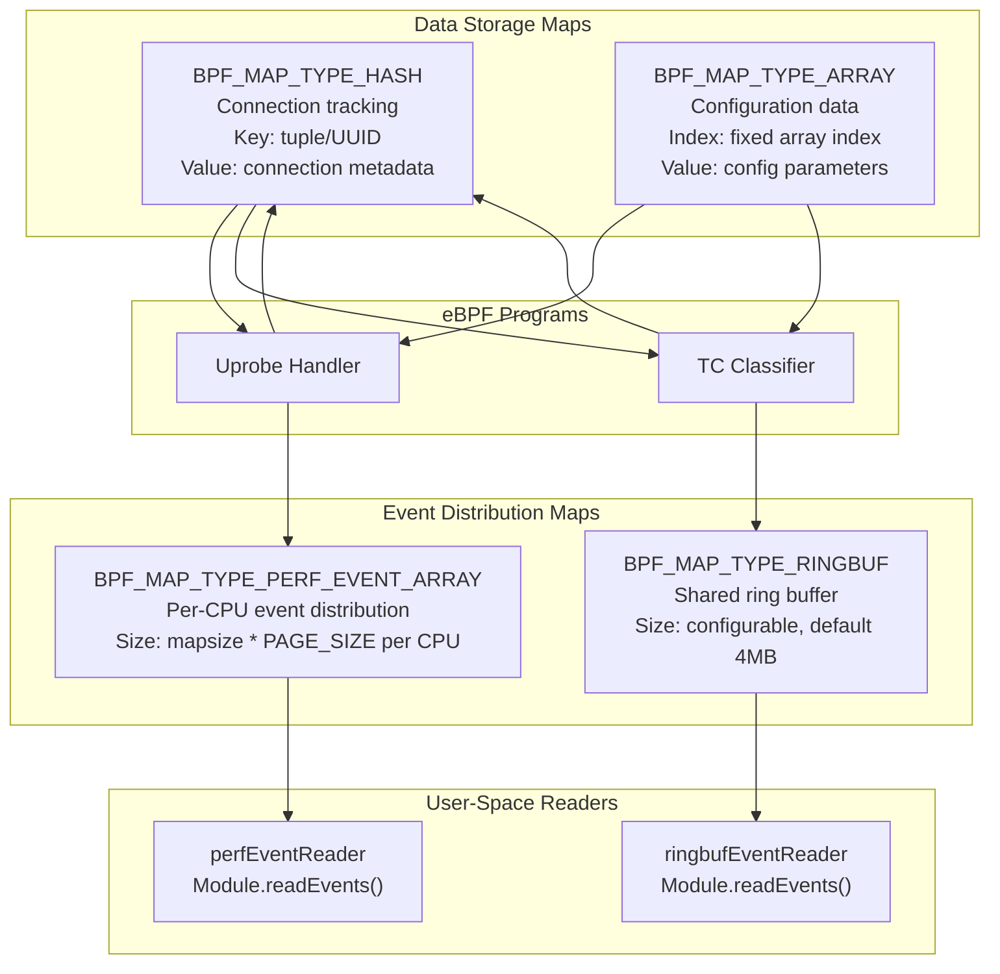

### Perf Event Arrays

Used for high-throughput event streaming from kernel to user-space:

**Configuration** ([README.md:99-100](https://github.com/gojue/ecapture/blob/ca085d05/README.md#L99-L100)):
```
INF perfEventReader created mapSize(MB)=4
```

**Characteristics**:
- Per-CPU buffers to avoid contention
- Configurable size via `--mapsize` flag (default 5120 KB = ~1024 KB per CPU on 5-CPU system)
- Used for: SSL data events, connection events, master key events
- User-space polling via `perf_event_open()` syscall

### Ring Buffers

Introduced in kernel 5.8+, provides shared memory ring for efficient event delivery:

**Characteristics**:
- Single shared buffer across all CPUs
- More memory-efficient than per-CPU perf arrays
- Used for: Network packet data (TC classifier output)
- Automatic backpressure handling
- User-space polling via `epoll()` on ring buffer FD

### Hash Maps

Store connection metadata for correlation:

**Use Cases**:
- **Connection Tracking**: Map socket FD to network tuple (IP:port)
- **PID/UID Lookup**: Map network tuple to process information
- **TLS Session Data**: Map client random to master secret
- **Protocol State**: Track HTTP/2 stream state

**Example Map Definition** (conceptual):
```c
struct {
    __uint(type, BPF_MAP_TYPE_HASH);
    __uint(max_entries, 2048);
    __type(key, __u64);      // socket FD or tuple
    __type(value, struct conn_info_t);
} conn_map SEC(".maps");
```

Sources: [README.md:99-101](https://github.com/gojue/ecapture/blob/ca085d05/README.md#L99-L101), [CHANGELOG.md:674](https://github.com/gojue/ecapture/blob/ca085d05/CHANGELOG.md#L674)

## Error Handling and Diagnostics

The eBPF Engine implements comprehensive error handling and diagnostic logging:

### Common Error Scenarios

| Error Type | Cause | Resolution |
|------------|-------|------------|
| **BTF Detection Failed** | Kernel lacks BTF support, file missing | Use non-CO-RE build or upgrade kernel |
| **Verifier Rejection** | Unsafe memory access, invalid helpers | Review eBPF program code, check kernel version |
| **Symbol Not Found** | Target function missing from binary | Check library version, may need different bytecode |
| **Map Creation Failed** | Insufficient memory, wrong permissions | Adjust `--mapsize`, verify `CAP_BPF` capability |
| **Probe Attach Failed** | Invalid offset, missing symbol | Verify ELF symbol table, check architecture match |

### Diagnostic Logging

The engine outputs structured logs at various levels (from examples in README):

```
2024-09-15T11:51:31Z INF Kernel Info=5.15.152 Pid=233698
2024-09-15T11:51:31Z INF BTF bytecode mode: CORE. btfMode=0
2024-09-15T11:51:31Z WRN OpenSSL/BoringSSL version not found from shared library file, used default version OpenSSL Version=linux_default_3_0
2024-09-15T11:51:31Z INF BPF bytecode file is matched. bpfFileName=user/bytecode/openssl_3_0_0_kern_core.o
2024-09-15T11:51:32Z INF perfEventReader created mapSize(MB)=4
```

**Log Interpretation**:
- `BTF bytecode mode: CORE` - CO-RE mode selected
- `BPF bytecode file is matched` - Bytecode loaded successfully
- `perfEventReader created` - Maps initialized

### Kernel Compatibility Checks

The engine validates kernel requirements at startup:

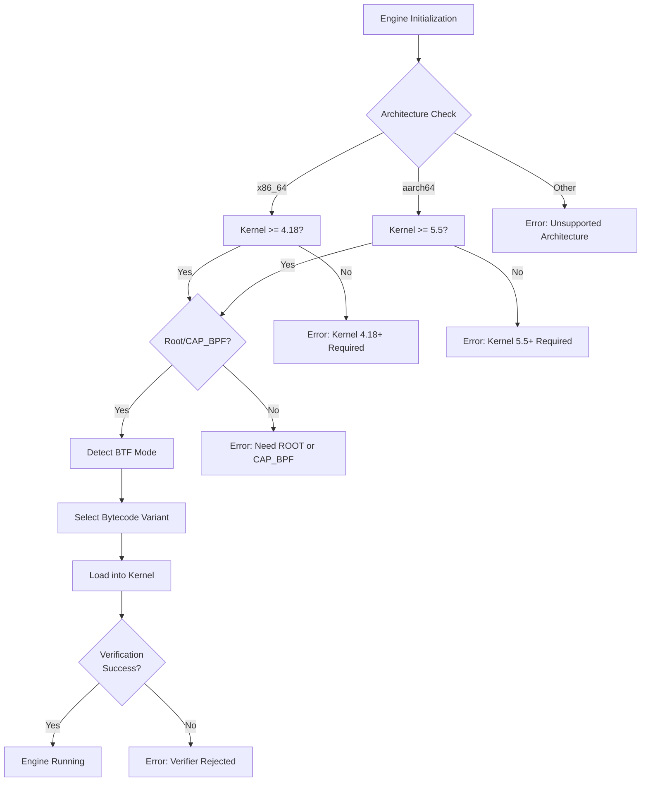

The version requirements reflect eBPF feature availability:
- **4.18+** (x86_64): BTF support, bounded loops
- **5.5+** (aarch64): ARM64 eBPF JIT improvements
- **5.8+**: Ring buffer support (auto-detected, falls back to perf arrays)

Sources: [README.md:14-16](https://github.com/gojue/ecapture/blob/ca085d05/README.md#L14-L16), [README_CN.md:14-17](https://github.com/gojue/ecapture/blob/ca085d05/README_CN.md#L14-L17), [CHANGELOG.md:41](https://github.com/gojue/ecapture/blob/ca085d05/CHANGELOG.md#L41)

## Integration with ebpfmanager

While the raw eBPF loading is handled by `cilium/ebpf`, the engine integrates with a higher-level manager for lifecycle control:

### Manager Responsibilities

The `ebpfmanager` component (referenced in diagrams and logs) provides:

1. **Program Lifecycle**: Init → Load → Attach → Run → Detach → Close
2. **Multi-Program Coordination**: Manage multiple eBPF programs per module
3. **Map Management**: Create, populate, and clean up eBPF maps
4. **Resource Cleanup**: Ensure proper teardown on module close

### Module Integration Pattern

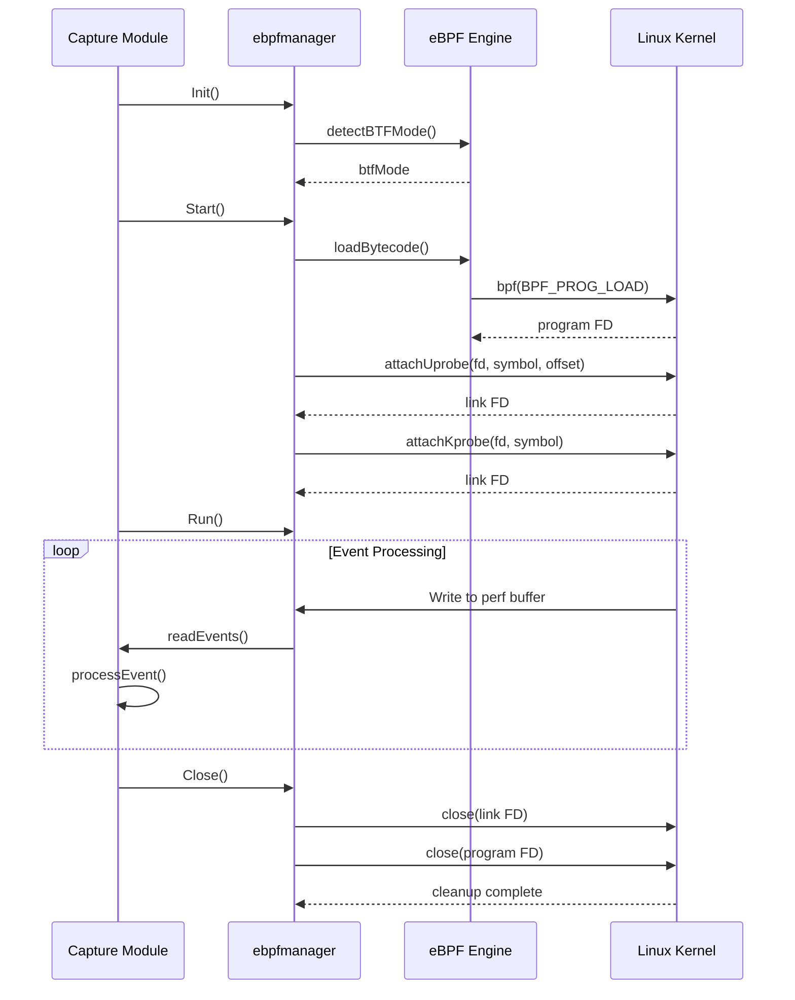

The manager abstracts the low-level eBPF operations, allowing capture modules to focus on data processing rather than kernel interaction details.

Sources: [README.md:91-102](https://github.com/gojue/ecapture/blob/ca085d05/README.md#L91-L102), [CHANGELOG.md:462](https://github.com/gojue/ecapture/blob/ca085d05/CHANGELOG.md#L462)

## Performance Considerations

The eBPF Engine is designed for high-performance event capture with minimal overhead:

### Memory Configuration

**Map Size Tuning** ([CHANGELOG.md:709](https://github.com/gojue/ecapture/blob/ca085d05/CHANGELOG.md#L709)):
- Default: 5120 KB total (distributed across per-CPU buffers)
- Configurable via `--mapsize` flag
- Calculation: `mapsize * PAGE_SIZE * num_CPUs`
- Impact: Larger maps reduce event loss but increase memory usage

### Event Loss Prevention

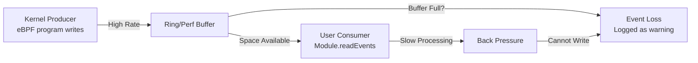

**Mitigation Strategies**:
1. Increase `--mapsize` for high-throughput scenarios
2. Use multiple event workers for parallel processing
3. Enable filtering at eBPF level (e.g., PID filter, pcap filter)
4. Batch event processing in user-space

### eBPF Program Optimization

**Verifier-Friendly Patterns**:
- Bounded loops (kernel 5.3+) or unrolled loops
- Stack size ≤ 512 bytes
- Helper function call limits
- Avoid dynamic jumps

The CO-RE mode additionally benefits from kernel-optimized relocations, avoiding manual offset calculations in the eBPF program itself.

Sources: [CHANGELOG.md:709](https://github.com/gojue/ecapture/blob/ca085d05/CHANGELOG.md#L709), [CHANGELOG.md:674](https://github.com/gojue/ecapture/blob/ca085d05/CHANGELOG.md#L674), [Makefile:23-24](https://github.com/gojue/ecapture/blob/ca085d05/Makefile#L23-L24)