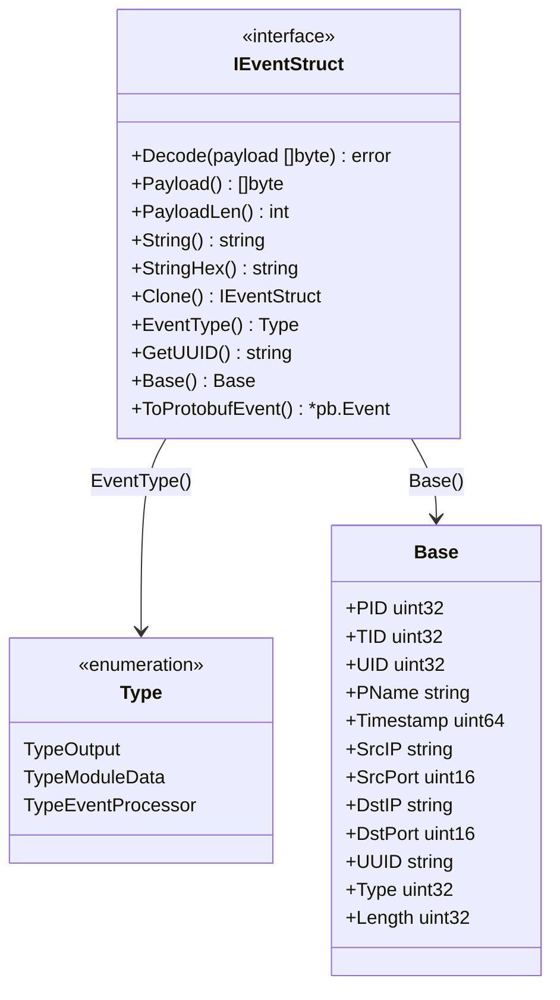
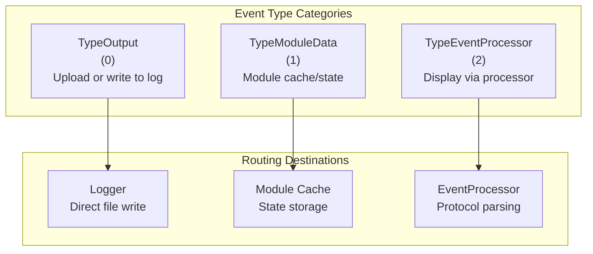
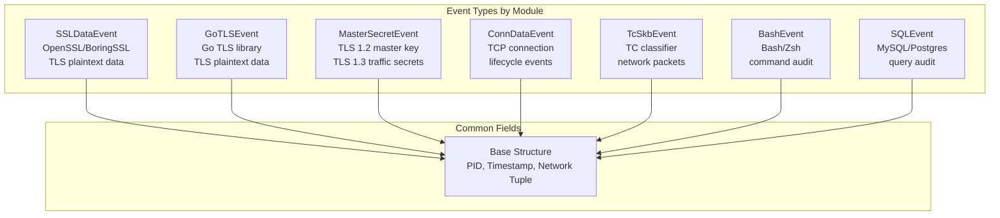
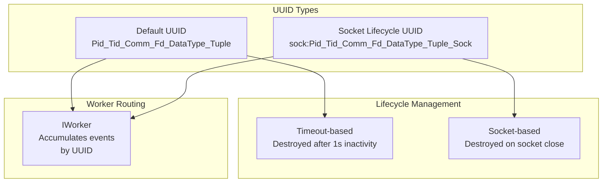
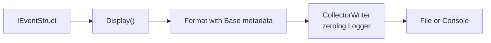
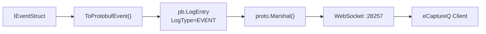
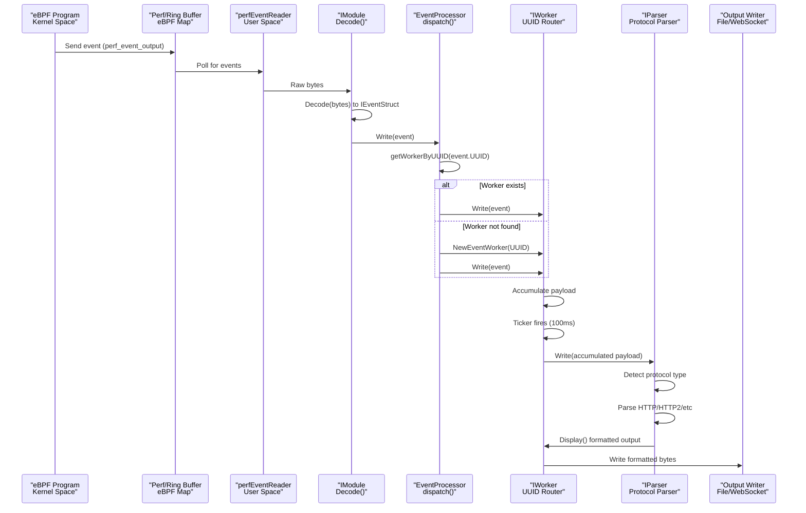
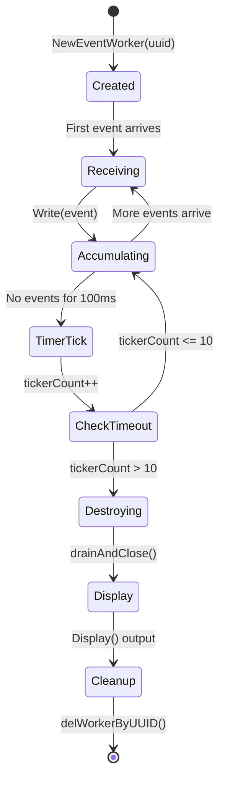
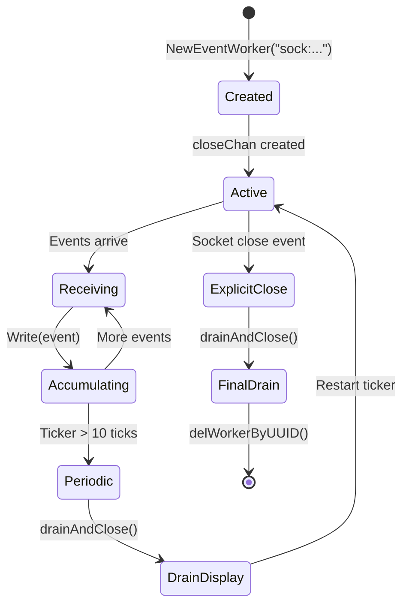

# Event Structures and Types

<details>
<summary>Relevant source files</summary>

The following files were used as context for generating this wiki page:

- [CHANGELOG.md](https://github.com/gojue/ecapture/blob/ca085d05/CHANGELOG.md)
- [README.md](https://github.com/gojue/ecapture/blob/ca085d05/README.md)
- [README_CN.md](https://github.com/gojue/ecapture/blob/ca085d05/README_CN.md)
- [images/ecapture-help-v0.8.9.svg](https://github.com/gojue/ecapture/blob/ca085d05/images/ecapture-help-v0.8.9.svg)
- [main.go](https://github.com/gojue/ecapture/blob/ca085d05/main.go)
- [pkg/event_processor/http_request.go](https://github.com/gojue/ecapture/blob/ca085d05/pkg/event_processor/http_request.go)
- [pkg/event_processor/http_response.go](https://github.com/gojue/ecapture/blob/ca085d05/pkg/event_processor/http_response.go)
- [pkg/event_processor/iparser.go](https://github.com/gojue/ecapture/blob/ca085d05/pkg/event_processor/iparser.go)
- [pkg/event_processor/iworker.go](https://github.com/gojue/ecapture/blob/ca085d05/pkg/event_processor/iworker.go)
- [pkg/event_processor/processor.go](https://github.com/gojue/ecapture/blob/ca085d05/pkg/event_processor/processor.go)
- [user/event/ievent.go](https://github.com/gojue/ecapture/blob/ca085d05/user/event/ievent.go)

</details>


This page documents the event structures and types used throughout eCapture to represent captured data from eBPF programs. Events are the fundamental data units that flow from kernel space through user space processing to final output.

For information about how events are processed after creation, see [Event Processing Pipeline](2.2-event-processing-pipeline.md). For information about specific output formats, see [Output Formats](../4-output-formats/index.md).

---

## Overview

eCapture uses a unified event interface (`IEventStruct`) to represent all captured data, whether TLS plaintext, connection metadata, master secrets, or network packets. Each event type implements this interface and carries domain-specific payload data along with common metadata fields.

**Key Concepts:**

- **IEventStruct Interface**: Common contract for all event types
- **Base Structure**: Shared metadata fields (PID, timestamps, network tuple)
- **Event Types**: Categorical classification for routing and processing
- **UUID System**: Unique identifiers for event correlation and worker routing
- **Serialization**: Support for both text (zerolog) and binary (protobuf) formats

Sources: [user/event/ievent.go:1-71](https://github.com/gojue/ecapture/blob/ca085d05/user/event/ievent.go#L1-L71)

---

## IEventStruct Interface

All events in eCapture implement the `IEventStruct` interface, which defines the contract for event handling, serialization, and identification.

### Interface Definition



**IEventStruct Methods**

| Method | Purpose |
|--------|---------|
| `Decode(payload []byte)` | Decode raw bytes from eBPF into structured event |
| `Payload()` | Return the actual data payload (e.g., plaintext TLS data) |
| `PayloadLen()` | Length of payload in bytes |
| `String()` | Human-readable representation |
| `StringHex()` | Hex dump representation |
| `Clone()` | Create deep copy of event |
| `EventType()` | Return routing type (Output/ModuleData/EventProcessor) |
| `GetUUID()` | Return unique identifier for event correlation |
| `Base()` | Return common metadata structure |
| `ToProtobufEvent()` | Convert to protobuf for WebSocket transmission |

Sources: [user/event/ievent.go:41-52](https://github.com/gojue/ecapture/blob/ca085d05/user/event/ievent.go#L41-L52)

---

## Event Type Classification

Events are classified by their `EventType()` value, which determines how they are routed through the system.



**Type Constants:**

- **TypeOutput (0)**: Events intended for immediate output to logger or server upload
- **TypeModuleData (1)**: Events containing module-specific state data for caching
- **TypeEventProcessor (2)**: Events requiring protocol parsing and formatting before output

Sources: [user/event/ievent.go:26-37](https://github.com/gojue/ecapture/blob/ca085d05/user/event/ievent.go#L26-L37)

---

## Base Event Structure

The `Base` structure contains metadata common to all events, including process context, network tuple, and timing information.

### Base Fields

| Field | Type | Description |
|-------|------|-------------|
| `PID` | uint32 | Process ID that generated the event |
| `TID` | uint32 | Thread ID within the process |
| `UID` | uint32 | User ID of the process |
| `PName` | string | Process name/command |
| `Timestamp` | uint64 | Event timestamp (nanoseconds since boot) |
| `SrcIP` | string | Source IP address |
| `SrcPort` | uint16 | Source port number |
| `DstIP` | string | Destination IP address |
| `DstPort` | uint16 | Destination port number |
| `UUID` | string | Unique event identifier for routing |
| `Type` | uint32 | Parser type (e.g., HTTP request/response) |
| `Length` | uint32 | Payload length in bytes |

**Network Tuple:** The combination of `(SrcIP, SrcPort, DstIP, DstPort)` identifies the connection. Combined with `PID` and `TID`, this creates a unique context for event correlation.

Sources: [user/event/ievent.go:41-52](https://github.com/gojue/ecapture/blob/ca085d05/user/event/ievent.go#L41-L52), [pkg/event_processor/iworker.go:201-206](https://github.com/gojue/ecapture/blob/ca085d05/pkg/event_processor/iworker.go#L201-L206)

---

## Major Event Types

eCapture uses several concrete event types for different capture scenarios. Each type extends the base structure with domain-specific fields.



### SSLDataEvent

Captures plaintext data from OpenSSL/BoringSSL `SSL_read()` and `SSL_write()` functions.

**Key Fields:**
- Base metadata (PID, timestamp, network tuple)
- `DataType`: Read (0) or Write (1)
- `Data`: Plaintext payload (up to 4KB per event)
- `Fd`: File descriptor number
- `Version`: TLS version (1.2, 1.3, etc.)

**Usage Context:** Generated by OpenSSL module when hooking `SSL_read`/`SSL_write` return probes. Events with the same UUID are accumulated by a worker for protocol parsing.

Sources: [pkg/event_processor/iworker.go:230-245](https://github.com/gojue/ecapture/blob/ca085d05/pkg/event_processor/iworker.go#L230-L245), [README.md:72-149](https://github.com/gojue/ecapture/blob/ca085d05/README.md#L72-L149)

### MasterSecretEvent

Captures TLS encryption keys for offline decryption.

**TLS 1.2 Fields:**
- `ClientRandom`: 32-byte random value from ClientHello
- `MasterSecret`: 48-byte master secret

**TLS 1.3 Fields:**
- `ClientRandom`: 32-byte random value
- Multiple traffic secrets (CLIENT_HANDSHAKE_TRAFFIC_SECRET, SERVER_HANDSHAKE_TRAFFIC_SECRET, etc.)

**Usage Context:** Generated during TLS handshake when hooking `SSL_do_handshake()`. Written to keylog files in SSLKEYLOGFILE format for use with Wireshark/tshark.

Sources: [README.md:234-252](https://github.com/gojue/ecapture/blob/ca085d05/README.md#L234-L252), [CHANGELOG.md:135-137](https://github.com/gojue/ecapture/blob/ca085d05/CHANGELOG.md#L135-L137)

### ConnDataEvent

Tracks TCP connection lifecycle (connect, accept, close).

**Key Fields:**
- Base metadata
- `EventType`: Connect/Accept/Close
- `Sock`: Kernel socket pointer
- Connection tuple (source/destination IP:port)

**Usage Context:** Generated by kprobes on `tcp_connect()`, `tcp_sendmsg()`, and socket destruction functions. Used to build PID-to-socket mapping for enriching TC packet events.

Sources: High-level architecture Diagram 3

### TcSkbEvent

Captures raw network packets from Traffic Control (TC) hooks.

**Key Fields:**
- Base metadata
- `Data`: Raw packet bytes (Ethernet frame)
- Direction: Egress or Ingress
- Associated PID from connection tracking

**Usage Context:** Generated by TC classifier eBPF programs on egress/ingress paths. Requires connection tracking via kprobes to associate packets with processes.

Sources: High-level architecture Diagram 3

### BashEvent

Audits shell command input/output.

**Key Fields:**
- Base metadata (PID of bash/zsh process)
- `Line`: Command line text
- `RetVal`: Command exit code

**Usage Context:** Generated by uprobes on `readline()` function in bash/zsh. Used for host security auditing.

Sources: [README.md:40-41](https://github.com/gojue/ecapture/blob/ca085d05/README.md#L40-L41), [README.md:153-154](https://github.com/gojue/ecapture/blob/ca085d05/README.md#L153-L154)

### SQLEvent (MySQL/Postgres)

Audits database queries.

**Key Fields:**
- Base metadata (PID of mysqld/postgres)
- `Query`: SQL query text
- `QueryLen`: Length of query
- Database context (user, database name)

**Usage Context:** Generated by uprobes on query dispatch functions (`dispatch_command()` for MySQL, `exec_simple_query()` for Postgres).

Sources: [README.md:42](https://github.com/gojue/ecapture/blob/ca085d05/README.md#L42), [README.md:157-160](https://github.com/gojue/ecapture/blob/ca085d05/README.md#L157-L160)

---

## Event UUID System

Each event has a UUID string that uniquely identifies its context and determines routing to event workers. The UUID format varies by lifecycle model.

### UUID Formats



### Default UUID Format

Format: `{PID}_{TID}_{ProcessName}_{Fd}_{DataType}_{Tuple}`

**Example:** `12345_12346_curl_5_1_192.168.1.100:443`

**Components:**
- PID: Process ID
- TID: Thread ID
- ProcessName: Command name
- Fd: File descriptor
- DataType: 0 (read) or 1 (write)
- Tuple: Destination IP:Port

**Lifecycle:** Workers with default UUIDs self-destruct after `MaxTickerCount * 100ms` (1 second) of inactivity.

Sources: [pkg/event_processor/iworker.go:100-123](https://github.com/gojue/ecapture/blob/ca085d05/pkg/event_processor/iworker.go#L100-L123)

### Socket Lifecycle UUID Format

Format: `sock:{PID}_{TID}_{ProcessName}_{Fd}_{DataType}_{Tuple}_{Sock}`

**Example:** `sock:12345_12346_curl_5_1_192.168.1.100:443_0xffff888012340000`

**Components:**
- Prefix: `sock:` (constant `SocketLifecycleUUIDPrefix`)
- Standard UUID fields
- Sock: Kernel socket pointer (uint64)

**Lifecycle:** Workers with socket UUIDs persist until an explicit close event with matching `Sock` value arrives. This prevents premature destruction for long-lived connections.

**UUID Parsing Logic:**
```
uuidOutput = core part without "sock:" prefix and trailing "_Sock"
DestroyUUID = Sock value for explicit lifecycle management
```

Sources: [user/event/ievent.go:39](https://github.com/gojue/ecapture/blob/ca085d05/user/event/ievent.go#L39), [pkg/event_processor/iworker.go:100-123](https://github.com/gojue/ecapture/blob/ca085d05/pkg/event_processor/iworker.go#L100-L123)

---

## Event Serialization

Events support two serialization formats depending on the output destination.

### Text Format (CollectorWriter)

Used for file logging and console output via zerolog.



**Format:**
```
PID:{PID}, Comm:{ProcessName}, Src:{SrcIP}:{SrcPort}, Dest:{DstIP}:{DstPort},
{Formatted Payload}
```

**Implementation:** The `CollectorWriter` wraps a `zerolog.Logger` and formats events as structured log entries.

Sources: [user/event/ievent.go:54-71](https://github.com/gojue/ecapture/blob/ca085d05/user/event/ievent.go#L54-L71), [pkg/event_processor/iworker.go:198-212](https://github.com/gojue/ecapture/blob/ca085d05/pkg/event_processor/iworker.go#L198-L212)

### Protobuf Format (ProtobufWriter)

Used for WebSocket transmission to eCaptureQ and other consumers.



**Structure:**
```protobuf
message LogEntry {
  LogType log_type = 1;  // LOG_TYPE_EVENT
  oneof payload {
    Event event_payload = 2;
  }
}

message Event {
  uint32 pid = 1;
  uint32 tid = 2;
  uint32 uid = 3;
  string comm = 4;
  uint64 timestamp = 5;
  string src_ip = 6;
  uint32 src_port = 7;
  string dst_ip = 8;
  uint32 dst_port = 9;
  string uuid = 10;
  uint32 type = 11;
  bytes payload = 12;
  uint32 length = 13;
}
```

**Implementation:** Each `IEventStruct` implements `ToProtobufEvent()` to convert its fields to the protobuf schema.

Sources: [pkg/event_processor/iworker.go:214-227](https://github.com/gojue/ecapture/blob/ca085d05/pkg/event_processor/iworker.go#L214-L227), [README.md:307-312](https://github.com/gojue/ecapture/blob/ca085d05/README.md#L307-L312)

---

## Event Flow Through the System

Events flow through multiple processing stages from kernel space to final output.



**Key Stages:**

1. **eBPF Emission**: eBPF programs use `bpf_perf_event_output()` or ringbuf APIs to send event bytes
2. **User Space Reading**: `perfEventReader`/`ringbufEventReader` polls and reads raw bytes
3. **Decoding**: Module's `Decode()` method unmarshals bytes into `IEventStruct`
4. **Dispatching**: `EventProcessor.dispatch()` routes to worker by UUID
5. **Accumulation**: Worker buffers multiple event fragments
6. **Parsing**: After timeout or explicit close, worker triggers protocol parsing
7. **Output**: Formatted data written to logger or WebSocket

Sources: [pkg/event_processor/processor.go:65-109](https://github.com/gojue/ecapture/blob/ca085d05/pkg/event_processor/processor.go#L65-L109), [pkg/event_processor/iworker.go:262-306](https://github.com/gojue/ecapture/blob/ca085d05/pkg/event_processor/iworker.go#L262-L306), High-level architecture Diagram 5

---

## Event Worker Lifecycle

Workers have two distinct lifecycle models based on their UUID prefix.

### Default Lifecycle (Timeout-Based)



**Characteristics:**
- `closeChan` is nil
- Self-destructs after 1 second (10 * 100ms) of inactivity
- Suitable for short-lived connections or request/response pairs

Sources: [pkg/event_processor/iworker.go:51-63](https://github.com/gojue/ecapture/blob/ca085d05/pkg/event_processor/iworker.go#L51-L63), [pkg/event_processor/iworker.go:262-306](https://github.com/gojue/ecapture/blob/ca085d05/pkg/event_processor/iworker.go#L262-L306)

### Socket Lifecycle (Explicit Close)



**Characteristics:**
- `closeChan` is created, `DestroyUUID` holds socket pointer
- Persists across idle periods, only destroyed by explicit close
- Periodic drain every 1 second to output accumulated data
- Suitable for long-lived connections (HTTP/2, WebSocket, streaming)

**Close Trigger:** `EventProcessor.WriteDestroyConn(sock_addr)` sends destroy signal when socket close is detected by eBPF kprobe.

Sources: [pkg/event_processor/iworker.go:57-63](https://github.com/gojue/ecapture/blob/ca085d05/pkg/event_processor/iworker.go#L57-L63), [pkg/event_processor/iworker.go:100-123](https://github.com/gojue/ecapture/blob/ca085d05/pkg/event_processor/iworker.go#L100-L123), [pkg/event_processor/processor.go:115-128](https://github.com/gojue/ecapture/blob/ca085d05/pkg/event_processor/processor.go#L115-L128)

---

## Event Processing Configuration

Event processing behavior can be configured via `EventProcessor` parameters.

### Configuration Options

| Parameter | Type | Purpose |
|-----------|------|---------|
| `logger` | io.Writer | Output destination (CollectorWriter or ProtobufWriter) |
| `isHex` | bool | If true, output payload as hex dump instead of text |
| `truncateSize` | uint64 | Maximum payload size per worker (0 = unlimited) |

**Truncation Behavior:** When `truncateSize > 0`, workers stop accumulating payload once the limit is reached, preventing memory exhaustion on large transfers.

**Hex Mode:** When `isHex = true`, all payload data is converted to hex dump format before output, useful for binary protocols.

Sources: [pkg/event_processor/processor.go:206-215](https://github.com/gojue/ecapture/blob/ca085d05/pkg/event_processor/processor.go#L206-L215), [pkg/event_processor/iworker.go:236-242](https://github.com/gojue/ecapture/blob/ca085d05/pkg/event_processor/iworker.go#L236-L242)

---

## Summary Table: Event Types and Usage

| Event Type | Module(s) | Payload Content | UUID Type | Primary Use Case |
|------------|-----------|-----------------|-----------|------------------|
| SSLDataEvent | OpenSSL, BoringSSL | TLS plaintext | Both | Capture HTTPS traffic |
| GoTLSEvent | GoTLS | TLS plaintext | Default | Capture Go TLS traffic |
| MasterSecretEvent | All TLS modules | TLS keys | N/A (direct output) | Keylog mode, offline decryption |
| ConnDataEvent | All TLS modules | Connection metadata | Socket | Track connection lifecycle |
| TcSkbEvent | TC module | Raw packets | Default | Packet capture mode |
| BashEvent | Bash, Zsh | Command text | Default | Command auditing |
| SQLEvent | MySQL, Postgres | SQL query | Default | Database auditing |

---

This page documented the event structures, types, and lifecycle management in eCapture. For details on how these events are parsed and formatted, see [Protocol Parsing](2.8-protocol-parsing.md). For output format specifications, see [Output Formats](../4-output-formats/index.md).