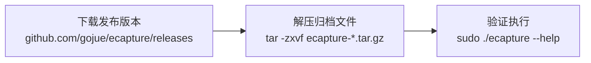
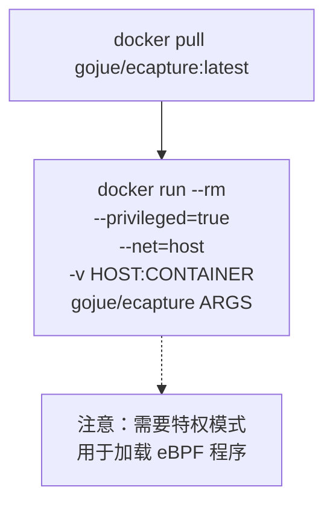
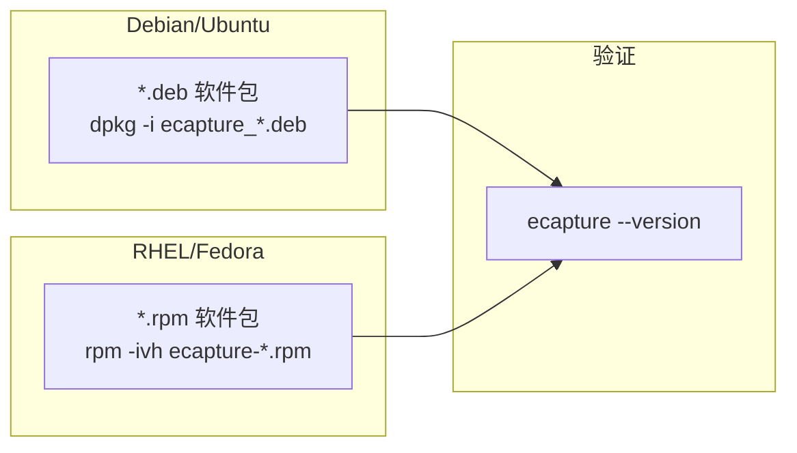
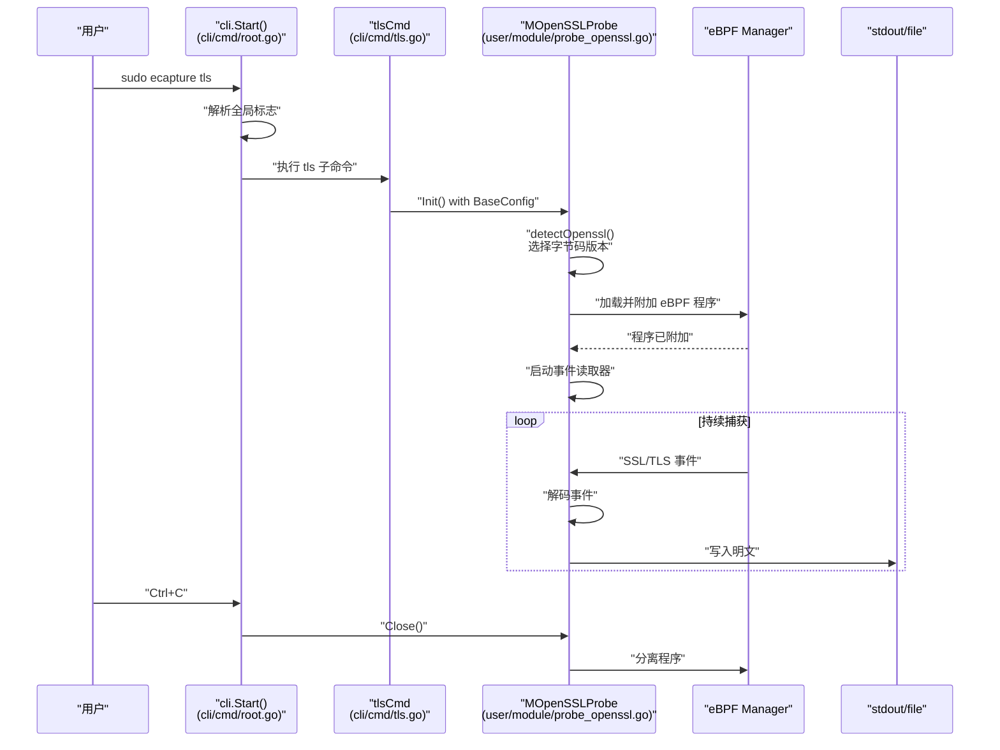
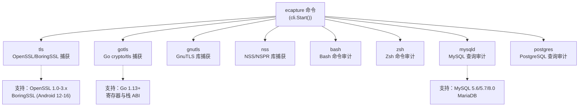

# 安装与快速入门

## 目的与范围

本文档指导您安装 eCapture 并运行首次 SSL/TLS 明文捕获。涵盖系统要求、安装方法（二进制、Docker、包管理器）以及基本捕获工作流程。有关特定模块及其功能的详细信息，请参阅[捕获模块](../3-capture-modules/index.md)。有关命令行接口文档，请参阅[命令行接口](1.2-command-line-interface.md)。

---

## 系统要求

eCapture 需要特定的 Linux 内核版本和权限才能运行：

| 要求 | 规格 |
|------------|---------------|
| **架构** | x86_64 或 aarch64 (ARM64) |
| **Linux 内核** | x86_64: 4.18+, aarch64: 5.5+ |
| **权限** | ROOT（或 CAP_BPF、CAP_PERFMON 能力） |
| **BTF 支持** | CO-RE 模式需要（non-CO-RE 模式可选） |
| **支持平台** | Linux, Android |
| **不支持平台** | Windows, macOS |

eCapture 自动检测内核是否支持 BTF（BPF 类型格式）并选择适当的 eBPF 字节码模式（CO-RE 或 non-CO-RE）。有关字节码选择的详细信息，请参阅 [eBPF 引擎](../2-architecture/2.1-ebpf-engine.md)。

**来源：** [README.md:14-16](https://github.com/gojue/ecapture/blob/ca085d05/README.md#L14-L16), [README_CN.md:15-17](https://github.com/gojue/ecapture/blob/ca085d05/README_CN.md#L15-L17)

---

## 安装方法

### 二进制安装

最简单的安装方法是从 GitHub releases 页面下载预构建的 ELF 二进制文件。



**安装步骤：**

1. **下载适当的发布版本：**
   ```bash
   # 针对 x86_64
   wget https://github.com/gojue/ecapture/releases/download/v1.5.0/ecapture-v1.5.0-linux-x86_64.tar.gz
   
   # 针对 aarch64
   wget https://github.com/gojue/ecapture/releases/download/v1.5.0/ecapture-v1.5.0-linux-arm64.tar.gz
   ```

2. **解压归档文件：**
   ```bash
   tar -zxvf ecapture-v*.tar.gz
   cd ecapture-v*-linux-*/
   ```

3. **验证安装：**
   ```bash
   sudo ./ecapture --help
   ```

二进制文件静态链接了 libpcap，并通过 `go-bindata` 嵌入了所有必要的 eBPF 字节码（参见 [assets/ebpf_probe.go](https://github.com/gojue/ecapture/blob/ca085d05/assets/ebpf_probe.go)）。无需额外依赖。

**来源：** [README.md:50-56](https://github.com/gojue/ecapture/blob/ca085d05/README.md#L50-L56), [CHANGELOG.md:140-195](https://github.com/gojue/ecapture/blob/ca085d05/CHANGELOG.md#L140-L195)

---

### Docker 安装

eCapture 提供官方 Docker 镜像用于容器化部署。



**安装步骤：**

1. **拉取 Docker 镜像：**
   ```bash
   docker pull gojue/ecapture:latest
   ```

2. **在 Docker 中运行 eCapture：**
   ```bash
   docker run --rm \
     --privileged=true \
     --net=host \
     -v /path/on/host:/data \
     gojue/ecapture tls -m pcap --pcapfile=/data/capture.pcapng
   ```

**Docker 要求：**
- `--privileged=true`：加载 eBPF 程序到内核所必需
- `--net=host`：捕获主机网络流量所必需
- 卷挂载：可选，用于将输出文件保存到主机文件系统

**来源：** [README.md:58-70](https://github.com/gojue/ecapture/blob/ca085d05/README.md#L58-L70), [README_CN.md:58-67](https://github.com/gojue/ecapture/blob/ca085d05/README_CN.md#L58-L67)

---

### 包管理器安装

eCapture 为主要 Linux 发行版提供原生软件包。



**Debian/Ubuntu：**
```bash
# 从 releases 下载 .deb 软件包
wget https://github.com/gojue/ecapture/releases/download/v1.5.0/ecapture_1.5.0_amd64.deb

# 安装
sudo dpkg -i ecapture_1.5.0_amd64.deb
```

**RHEL/Fedora：**
```bash
# 从 releases 下载 .rpm 软件包
wget https://github.com/gojue/ecapture/releases/download/v1.5.0/ecapture-1.5.0-1.x86_64.rpm

# 安装
sudo rpm -ivh ecapture-1.5.0-1.x86_64.rpm
```

**来源：** [CHANGELOG.md:671-679](https://github.com/gojue/ecapture/blob/ca085d05/CHANGELOG.md#L671-L679), 高级架构的图表 6

---

## 快速入门：首次捕获

本节演示使用 `tls` 模块从 HTTPS 流量中捕获 SSL/TLS 明文。

### 命令执行流程



### 基本 TLS 捕获

**命令：**
```bash
sudo ecapture tls
```

此命令使用 OpenSSL/BoringSSL 库捕获系统上的所有 SSL/TLS 明文流量。

**预期输出：**
```
2024-09-15T11:51:31Z INF AppName="eCapture(旁观者)"
2024-09-15T11:51:31Z INF HomePage=https://ecapture.cc
2024-09-15T11:51:31Z INF Repository=https://github.com/gojue/ecapture
2024-09-15T11:51:31Z INF Version=linux_arm64:0.8.6-20240915-d87ae48:5.15.0-113-generic
2024-09-15T11:51:31Z INF Listen=localhost:28256
2024-09-15T11:51:31Z INF BTF bytecode mode: CORE. btfMode=0
2024-09-15T11:51:31Z INF Module initialization. isReload=false moduleName=EBPFProbeOPENSSL
2024-09-15T11:51:31Z WRN OpenSSL/BoringSSL version not found, used default version OpenSSL Version=linux_default_3_0
2024-09-15T11:51:31Z INF BPF bytecode file is matched. bpfFileName=user/bytecode/openssl_3_0_0_kern_core.o
2024-09-15T11:51:31Z INF module started successfully. moduleName=EBPFProbeOPENSSL

2024-09-15T11:51:53Z ??? UUID:233851_233851_curl_5_1_172.16.71.1:51837, Name:HTTP2Request, Type:2
GET / HTTP/2
Host: google.com
User-Agent: curl/7.81.0
```

**来源：** [README.md:72-149](https://github.com/gojue/ecapture/blob/ca085d05/README.md#L72-L149), [main.go:1-12](https://github.com/gojue/ecapture/blob/ca085d05/main.go#L1-L12)

---

### 理解输出内容

每个捕获的事件显示：

| 字段 | 描述 | 示例值 |
|-------|-------------|---------------|
| **时间戳** | 事件捕获时间 | `2024-09-15T11:51:53Z` |
| **UUID** | 事件标识符 | `233851_233851_curl_5_1_172.16.71.1:51837` |
| **名称** | 协议/事件类型 | `HTTP2Request`, `HTTPResponse` |
| **类型** | 数字类型代码 | `1=HTTP/1.x 请求, 2=HTTP/2 请求, 3=HTTP/1.x 响应, 4=HTTP/2 响应` |
| **长度** | 载荷大小 | 显示在标题行 |
| **载荷** | 明文内容 | 请求/响应数据 |

UUID 格式为：`PID_TID_进程名_FD_方向_远程地址:端口`

**来源：** [protobuf/PROTOCOLS.md:24-42](https://github.com/gojue/ecapture/blob/ca085d05/protobuf/PROTOCOLS.md#L24-L42), [user/event/event_ssl.go](https://github.com/gojue/ecapture/blob/ca085d05/user/event/event_ssl.go)

---

### 其他捕获示例

**使用 PCAP 输出捕获：**
```bash
sudo ecapture tls -m pcap -i eth0 --pcapfile=output.pcapng
```

这将以 pcapng 格式保存捕获的明文，与 Wireshark 兼容。文件包含用于 TLS 密钥记录的解密密钥块（DSB）。

**使用 keylog 模式捕获：**
```bash
sudo ecapture tls -m keylog --keylogfile=keys.log
```

这将提取 TLS 主密钥和流量密钥，与 `SSLKEYLOGFILE` 格式兼容，可用于 `tshark` 或 Wireshark。

**按进程 ID 过滤：**
```bash
sudo ecapture tls --pid=1234
```

**按用户 ID 过滤：**
```bash
sudo ecapture tls --uid=1000
```

**来源：** [README.md:172-253](https://github.com/gojue/ecapture/blob/ca085d05/README.md#L172-L253), [README_CN.md:150-220](https://github.com/gojue/ecapture/blob/ca085d05/README_CN.md#L150-L220)

---

## 模块选择参考

eCapture 提供多个专门的模块。使用 `ecapture <模块>` 启动特定模块：



**可用模块：**

| 模块 | 用途 | 目标库/应用程序 |
|--------|---------|-------------------------------|
| `tls` | SSL/TLS 明文捕获 | OpenSSL, BoringSSL, LibreSSL |
| `gotls` | Go TLS 捕获 | Go `crypto/tls` 包 |
| `gnutls` | GnuTLS 捕获 | GnuTLS 库 |
| `nss` | NSS/NSPR 捕获 | NSS/NSPR 库 |
| `bash` | 命令审计 | Bash shell |
| `zsh` | 命令审计 | Zsh shell |
| `mysqld` | SQL 查询捕获 | MySQL, MariaDB |
| `postgres` | SQL 查询捕获 | PostgreSQL |

有关详细的模块文档，请参阅[捕获模块](../3-capture-modules/index.md)。

**来源：** [README.md:152-161](https://github.com/gojue/ecapture/blob/ca085d05/README.md#L152-L161), [cli/cmd/root.go](https://github.com/gojue/ecapture/blob/ca085d05/cli/cmd/root.go), 高级架构的图表 1

---

## 验证安装

验证您的 eCapture 安装：

1. **检查版本：**
   ```bash
   sudo ecapture --version
   ```

2. **验证内核兼容性：**
   ```bash
   uname -r  # 应为 4.18+ (x86_64) 或 5.5+ (aarch64)
   ```

3. **检查 BTF 支持：**
   ```bash
   cat /boot/config-$(uname -r) | grep CONFIG_DEBUG_INFO_BTF
   # 应显示：CONFIG_DEBUG_INFO_BTF=y
   ```

4. **测试基本捕获：**
   ```bash
   # 终端 1：启动捕获
   sudo ecapture tls
   
   # 终端 2：生成 HTTPS 流量
   curl https://www.example.com
   
   # 终端 1 应显示捕获的明文
   ```

**来源：** [README_CN.md:228-233](https://github.com/gojue/ecapture/blob/ca085d05/README_CN.md#L228-L233), [依赖与系统要求](1.3-dependencies-and-system-requirements.md)

---

## 常见问题故障排除

| 问题 | 原因 | 解决方案 |
|-------|-------|----------|
| **"BTF not found"** | 内核缺少 BTF 支持 | 使用 non-CO-RE 模式（自动）或升级内核 |
| **"Permission denied"** | 缺少 ROOT/能力 | 使用 `sudo` 运行或授予 CAP_BPF/CAP_PERFMON |
| **"No events captured"** | 没有匹配的 SSL/TLS 流量 | 验证目标应用程序使用支持的库 |
| **"Version not found"** | 不支持的库版本 | 检查支持的版本或使用 `--libssl` 标志 |

有关详细的故障排除，请参阅[故障排除与常见问题](../6-troubleshooting-and-faq/index.md)。

**来源：** [README.md:14-16](https://github.com/gojue/ecapture/blob/ca085d05/README.md#L14-L16), 从常见 eBPF 问题推断

---

## 下一步

成功安装和基本捕获后：

1. **探索输出模式：** 在 [OpenSSL 模块](../3-capture-modules/3.1.1-openssl-module.md) 中了解 `text`、`pcap` 和 `keylog` 模式
2. **模块特定功能：** 参见[捕获模块](../3-capture-modules/index.md)了解 GoTLS、数据库审计等
3. **高级配置：** 查看[配置系统](../2-architecture/2.4-configuration-system.md)了解过滤、自定义设置
4. **远程 GUI：** 考虑使用 [eCaptureQ](https://github.com/gojue/ecaptureq) 作为图形界面
5. **事件转发：** 通过 WebSocket 与外部工具集成（[Protobuf 与外部集成](../4-output-formats/4.4-protobuf-and-external-integration.md)）

**来源：** 目录结构，[README.md:287-305](https://github.com/gojue/ecapture/blob/ca085d05/README.md#L287-L305)