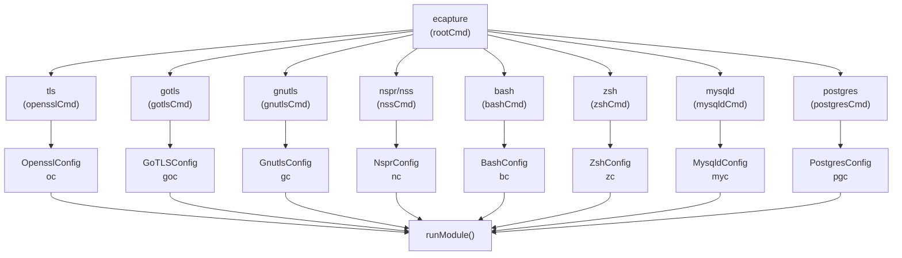
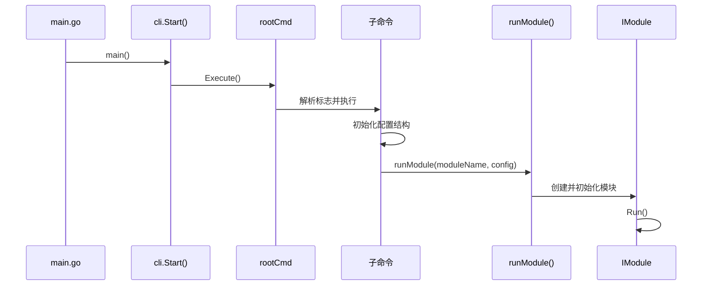
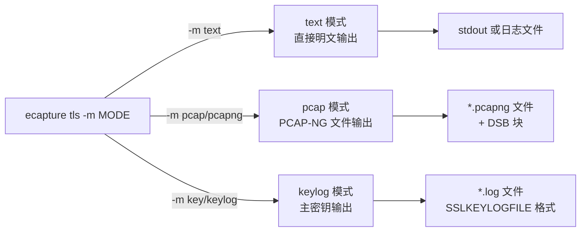
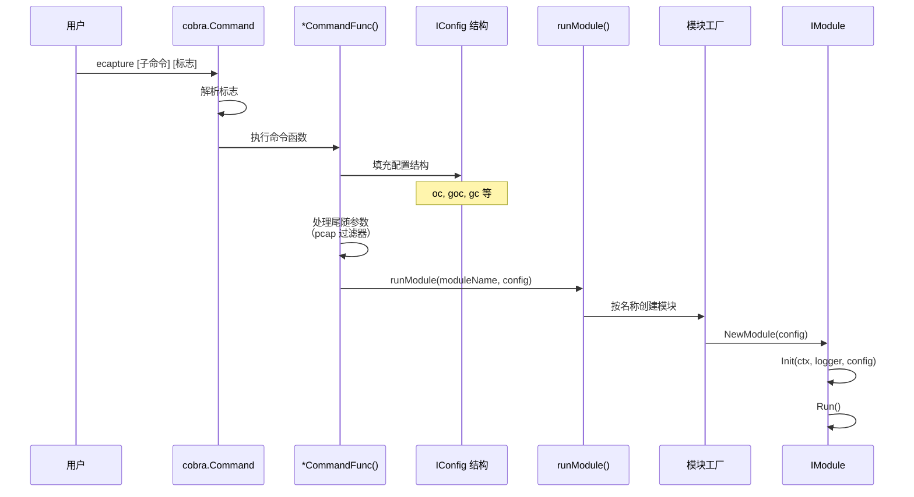
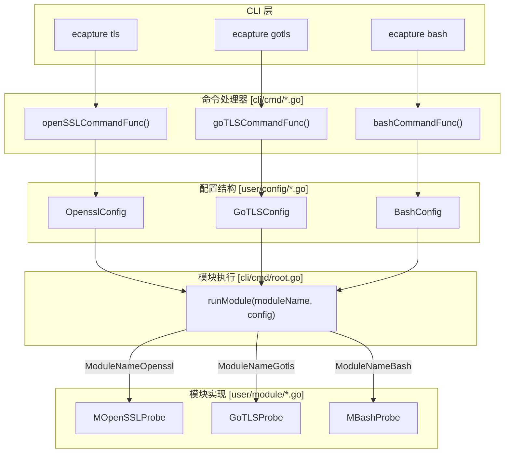

# 命令行接口

## 目的与范围

本文档描述 eCapture 的命令行接口（CLI），包括根命令、全局标志、模块特定的子命令及其相应的配置选项。CLI 基于 [Cobra](https://github.com/spf13/cobra) 框架构建，是用户发起捕获操作的主要交互层。

有关 CLI 命令如何转换为模块执行和 eBPF 附加的信息，请参见[模块系统与生命周期](../2-architecture/2.5-module-system-and-lifecycle.md)。有关每个模块使用的配置结构的详细信息，请参见[配置系统](../2-architecture/2.4-configuration-system.md)。

---

## CLI 架构概览

eCapture CLI 遵循分层命令结构，包含一个根命令（`ecapture`）和多个模块特定的子命令。每个子命令对应一个捕获模块，并接受全局标志（从根命令继承）和模块特定标志。

### 命令层次结构



**来源：** [cli/cmd/tls.go:29-48](https://github.com/gojue/ecapture/blob/ca085d05/cli/cmd/tls.go#L29-L48), [cli/cmd/gotls.go:29-40](https://github.com/gojue/ecapture/blob/ca085d05/cli/cmd/gotls.go#L29-L40), [cli/cmd/gnutls.go:32-45](https://github.com/gojue/ecapture/blob/ca085d05/cli/cmd/gnutls.go#L32-L45), [cli/cmd/nspr.go:30-41](https://github.com/gojue/ecapture/blob/ca085d05/cli/cmd/nspr.go#L30-L41), [cli/cmd/bash.go:27-33](https://github.com/gojue/ecapture/blob/ca085d05/cli/cmd/bash.go#L27-L33), [cli/cmd/zsh.go:30-36](https://github.com/gojue/ecapture/blob/ca085d05/cli/cmd/zsh.go#L30-L36), [cli/cmd/mysqld.go:30-37](https://github.com/gojue/ecapture/blob/ca085d05/cli/cmd/mysqld.go#L30-L37), [cli/cmd/postgres.go:30-34](https://github.com/gojue/ecapture/blob/ca085d05/cli/cmd/postgres.go#L30-L34)

### 入口点流程



**来源：** [main.go:9-11](https://github.com/gojue/ecapture/blob/ca085d05/main.go#L9-L11)

---

## 全局标志

虽然提供的文件中未显示，但在 [cli/cmd/root.go](https://github.com/gojue/ecapture/blob/ca085d05/cli/cmd/root.go) 中的根命令（`rootCmd`）定义了所有子命令继承的全局标志。基于 README 示例和架构，这些标志包括：

| 标志 | 类型 | 描述 |
|------|------|------|
| `--pid` | int | 要捕获的目标进程 ID |
| `--uid` | int | 要捕获的目标用户 ID |
| `--hex` | bool | 以十六进制格式输出捕获的数据 |
| `-l, --logfile` | string | 捕获事件日志文件的路径 |
| `--mapsize` | int | eBPF 映射大小（KB）（默认：5120） |

全局标志适用于所有模块，可以与模块特定标志组合使用。

**来源：** [README.md:72-149](https://github.com/gojue/ecapture/blob/ca085d05/README.md#L72-L149)

---

## 模块子命令

### TLS/OpenSSL 模块

**命令：** `ecapture tls`（别名：`openssl`）

TLS 模块从 OpenSSL/BoringSSL 加密连接捕获明文。它支持三种捕获模式，可以针对所有 OpenSSL 版本 1.0.x、1.1.x 和 3.x。

#### 标志

| 标志 | 简写 | 类型 | 默认值 | 描述 |
|------|------|------|---------|------|
| `--libssl` | | string | （自动检测） | libssl.so 文件路径 |
| `--cgroup_path` | | string | `/sys/fs/cgroup` | 用于进程过滤的 cgroup 路径 |
| `-m, --model` | | string | `text` | 捕获模式：`text`、`pcap`/`pcapng`、`key`/`keylog` |
| `-k, --keylogfile` | | string | `ecapture_openssl_key.log` | 保存 TLS 主密钥的路径 |
| `-w, --pcapfile` | | string | `save.pcapng` | 以 pcapng 格式保存数据包的路径 |
| `-i, --ifname` | | string | | 网络接口名称（pcap 模式必需） |
| `--ssl_version` | | string | （自动检测） | OpenSSL/BoringSSL 版本字符串 |

#### 捕获模式



**来源：** [cli/cmd/tls.go:26-67](https://github.com/gojue/ecapture/blob/ca085d05/cli/cmd/tls.go#L26-L67)

#### 使用示例

```bash
# Text 模式 - 捕获所有 OpenSSL 流量
sudo ecapture tls

# PCAP 模式 - 使用过滤器保存到文件
sudo ecapture tls -m pcap -i eth0 -w output.pcapng tcp port 443

# Keylog 模式 - 提取主密钥
sudo ecapture tls -m keylog -k keys.log

# 针对特定库版本
sudo ecapture tls --libssl=/lib/x86_64-linux-gnu/libssl.so.3 --ssl_version="openssl 3.0.5"
```

**来源：** [cli/cmd/tls.go:33-46](https://github.com/gojue/ecapture/blob/ca085d05/cli/cmd/tls.go#L33-L46), [README.md:72-149](https://github.com/gojue/ecapture/blob/ca085d05/README.md#L72-L149)

#### 配置结构

`OpensslConfig` 结构（[user/config/openssl.go](https://github.com/gojue/ecapture/blob/ca085d05/user/config/openssl.go)）在 [cli/cmd/tls.go:26](https://github.com/gojue/ecapture/blob/ca085d05/cli/cmd/tls.go#L26) 初始化：

```go
var oc = config.NewOpensslConfig()
```

配置通过 [cli/cmd/tls.go:66](https://github.com/gojue/ecapture/blob/ca085d05/cli/cmd/tls.go#L66) 的 `runModule(module.ModuleNameOpenssl, oc)` 传递给 OpenSSL 模块。

#### PCAP 过滤器支持

TLS 和 GoTLS 模块在 pcap 模式下支持 [pcap 过滤器表达式](https://www.tcpdump.org/manpages/pcap-filter.7.html)。过滤器作为尾随参数传递：

```bash
sudo ecapture tls -m pcap -i eth0 host 192.168.1.1 and tcp port 443
```

过滤器在 [cli/cmd/tls.go:63-65](https://github.com/gojue/ecapture/blob/ca085d05/cli/cmd/tls.go#L63-L65) 提取并存储在 `oc.PcapFilter` 中。

**来源：** [cli/cmd/tls.go:62-67](https://github.com/gojue/ecapture/blob/ca085d05/cli/cmd/tls.go#L62-L67)

---

### GoTLS 模块

**命令：** `ecapture gotls`（别名：`tlsgo`）

从使用原生 `crypto/tls` 库的 Go 程序捕获明文。需要指定目标 Go 二进制文件路径。

#### 标志

| 标志 | 简写 | 类型 | 默认值 | 描述 |
|------|------|------|---------|------|
| `-e, --elfpath` | | string | （必需） | 使用 Go 工具链构建的 Go 二进制文件路径 |
| `-w, --pcapfile` | | string | `ecapture_gotls.pcapng` | 以 pcapng 格式保存数据包的路径 |
| `-m, --model` | | string | `text` | 捕获模式：`text`、`pcap`/`pcapng`、`key`/`keylog` |
| `-k, --keylogfile` | | string | `ecapture_gotls_key.log` | 保存 TLS 密钥的路径 |
| `-i, --ifname` | | string | | 网络接口名称（pcap 模式必需） |

**来源：** [cli/cmd/gotls.go:26-59](https://github.com/gojue/ecapture/blob/ca085d05/cli/cmd/gotls.go#L26-L59)

#### 使用示例

```bash
# 捕获特定 Go 二进制文件
sudo ecapture gotls --elfpath=/usr/bin/my-go-app

# 带过滤器的 PCAP 模式
sudo ecapture gotls -m pcap -e /usr/bin/my-go-app -i eth0 -w output.pcapng tcp port 8443

# Keylog 模式
sudo ecapture gotls -m keylog -k gotls_keys.log --elfpath=/usr/bin/my-go-app
```

**来源：** [cli/cmd/gotls.go:34-38](https://github.com/gojue/ecapture/blob/ca085d05/cli/cmd/gotls.go#L34-L38), [README.md:256-276](https://github.com/gojue/ecapture/blob/ca085d05/README.md#L256-L276)

#### 配置结构

`GoTLSConfig` 结构在 [cli/cmd/gotls.go:26](https://github.com/gojue/ecapture/blob/ca085d05/cli/cmd/gotls.go#L26) 初始化，并在 [cli/cmd/gotls.go:57](https://github.com/gojue/ecapture/blob/ca085d05/cli/cmd/gotls.go#L57) 传递给模块。

---

### GnuTLS 模块

**命令：** `ecapture gnutls`（别名：`gnu`）

从使用 GnuTLS 库的应用程序（例如 `wget`）捕获明文。

#### 标志

| 标志 | 简写 | 类型 | 默认值 | 描述 |
|------|------|------|---------|------|
| `--gnutls` | | string | （自动检测） | libgnutls.so 文件路径 |
| `-m, --model` | | string | `text` | 捕获模式：`text`、`pcap`/`pcapng`、`key`/`keylog` |
| `-k, --keylogfile` | | string | `ecapture_gnutls_key.log` | 保存 TLS 密钥的路径 |
| `-w, --pcapfile` | | string | `save.pcapng` | 以 pcapng 格式保存数据包的路径 |
| `-i, --ifname` | | string | | 网络接口名称 |
| `--ssl_version` | | string | （自动检测） | GnuTLS 版本字符串（例如："3.7.9"） |

**来源：** [cli/cmd/gnutls.go:29-64](https://github.com/gojue/ecapture/blob/ca085d05/cli/cmd/gnutls.go#L29-L64)

#### 使用示例

```bash
# 自动检测 GnuTLS 库
sudo ecapture gnutls

# 指定库路径
sudo ecapture gnutls --gnutls=/lib/x86_64-linux-gnu/libgnutls.so

# 带版本的 Keylog 模式
sudo ecapture gnutls -m keylog -k keys.log --ssl_version="3.7.9"
```

**来源：** [cli/cmd/gnutls.go:37-43](https://github.com/gojue/ecapture/blob/ca085d05/cli/cmd/gnutls.go#L37-L43)

---

### NSS/NSPR 模块

**命令：** `ecapture nspr`（别名：`nss`）

从使用 Mozilla 的 NSS/NSPR 库的应用程序（例如 Firefox）捕获明文。

#### 标志

| 标志 | 类型 | 默认值 | 描述 |
|------|------|---------|------|
| `--nspr` | string | （自动检测） | libnspr44.so 文件路径 |

**来源：** [cli/cmd/nspr.go:27-51](https://github.com/gojue/ecapture/blob/ca085d05/cli/cmd/nspr.go#L27-L51)

#### 使用示例

```bash
# 自动检测 NSPR 库
sudo ecapture nspr

# 指定库路径
sudo ecapture nspr --nspr=/lib/x86_64-linux-gnu/libnspr44.so
```

**来源：** [cli/cmd/nspr.go:35-39](https://github.com/gojue/ecapture/blob/ca085d05/cli/cmd/nspr.go#L35-L39)

---

### Bash 审计模块

**命令：** `ecapture bash`

通过挂钩 readline 库捕获 bash 命令输入/输出，用于安全审计目的。

#### 标志

| 标志 | 简写 | 类型 | 默认值 | 描述 |
|------|------|------|---------|------|
| `--bash` | | string | `$SHELL` | bash 二进制文件路径 |
| `--readlineso` | | string | （自动检测） | readline.so 库路径 |
| `-e, --errnumber` | | int | `module.BashErrnoDefault` | 按退出状态过滤命令 |

**来源：** [cli/cmd/bash.go:24-55](https://github.com/gojue/ecapture/blob/ca085d05/cli/cmd/bash.go#L24-L55)

#### 使用示例

```bash
# 捕获所有 bash 命令
sudo ecapture bash

# 按特定错误代码过滤
sudo ecapture bash -e 127

# 指定 bash 路径
sudo ecapture bash --bash=/bin/bash
```

**来源：** [cli/cmd/bash.go:30-32](https://github.com/gojue/ecapture/blob/ca085d05/cli/cmd/bash.go#L30-L32)

#### 配置结构

`BashConfig` 结构在 [cli/cmd/bash.go:24](https://github.com/gojue/ecapture/blob/ca085d05/cli/cmd/bash.go#L24) 初始化，包含用于按退出状态过滤命令结果的 `ErrNo` 字段（[cli/cmd/bash.go:38](https://github.com/gojue/ecapture/blob/ca085d05/cli/cmd/bash.go#L38)）。

---

### Zsh 审计模块

**命令：** `ecapture zsh`

捕获 zsh 命令输入/输出以用于安全审计目的，类似于 bash 模块。

#### 标志

| 标志 | 简写 | 类型 | 默认值 | 描述 |
|------|------|------|---------|------|
| `--zsh` | | string | `$SHELL` | zsh 二进制文件路径 |
| `-e, --errnumber` | | int | `module.ZshErrnoDefault` | 按退出状态过滤命令 |

**来源：** [cli/cmd/zsh.go:27-57](https://github.com/gojue/ecapture/blob/ca085d05/cli/cmd/zsh.go#L27-L57)

#### 使用示例

```bash
# 捕获所有 zsh 命令
sudo ecapture zsh

# 指定 zsh 路径
sudo ecapture zsh --zsh=/bin/zsh
```

**来源：** [cli/cmd/zsh.go:33-34](https://github.com/gojue/ecapture/blob/ca085d05/cli/cmd/zsh.go#L33-L34)

---

### MySQL 审计模块

**命令：** `ecapture mysqld`

从 MySQL/MariaDB 服务器（版本 5.6、5.7、8.0 和 MariaDB 10.5+）捕获 SQL 查询。

#### 标志

| 标志 | 简写 | 类型 | 默认值 | 描述 |
|------|------|------|---------|------|
| `-m, --mysqld` | | string | `/usr/sbin/mariadbd` | mysqld 二进制文件路径 |
| `--offset` | | uint64 | 0 | 用于手动挂钩的函数偏移量 |
| `-f, --funcname` | | string | | 要挂钩的函数名称 |

**来源：** [cli/cmd/mysqld.go:27-49](https://github.com/gojue/ecapture/blob/ca085d05/cli/cmd/mysqld.go#L27-L49)

#### 使用示例

```bash
# 自动检测 MySQL 二进制文件
sudo ecapture mysqld

# 指定 MySQL 路径
sudo ecapture mysqld -m /usr/sbin/mysqld
```

**来源：** [cli/cmd/mysqld.go:33-35](https://github.com/gojue/ecapture/blob/ca085d05/cli/cmd/mysqld.go#L33-L35)

---

### PostgreSQL 审计模块

**命令：** `ecapture postgres`

从 PostgreSQL 服务器（版本 10 及以上）捕获 SQL 查询。

#### 标志

| 标志 | 简写 | 类型 | 默认值 | 描述 |
|------|------|------|---------|------|
| `-m, --postgres` | | string | `/usr/bin/postgres` | postgres 二进制文件路径 |
| `-f, --funcname` | | string | | 要挂钩的函数名称 |

**来源：** [cli/cmd/postgres.go:27-45](https://github.com/gojue/ecapture/blob/ca085d05/cli/cmd/postgres.go#L27-L45)

#### 使用示例

```bash
# 自动检测 PostgreSQL 二进制文件
sudo ecapture postgres

# 指定 PostgreSQL 路径
sudo ecapture postgres -m /usr/bin/postgres
```

**来源：** [cli/cmd/postgres.go:32-33](https://github.com/gojue/ecapture/blob/ca085d05/cli/cmd/postgres.go#L32-L33)

---

## 常见模式与约定

### 捕获模式模式

几个模块（TLS、GoTLS、GnuTLS）共享一个通用的 `-m, --model` 标志模式，具有三个标准值：

| 模式 | 值 | 目的 |
|------|-----|------|
| Text | `text` | 直接明文输出到控制台/文件 |
| PCAP | `pcap`、`pcapng` | 以 PCAP-NG 格式保存数据包 |
| Keylog | `key`、`keylog` | 提取并保存 TLS 主密钥 |

**来源：** [cli/cmd/tls.go:53](https://github.com/gojue/ecapture/blob/ca085d05/cli/cmd/tls.go#L53), [cli/cmd/gotls.go:45](https://github.com/gojue/ecapture/blob/ca085d05/cli/cmd/gotls.go#L45), [cli/cmd/gnutls.go:50](https://github.com/gojue/ecapture/blob/ca085d05/cli/cmd/gnutls.go#L50)

### 库路径检测

所有与 TLS 相关的模块都支持自动库检测，但允许手动覆盖：

- 用于 OpenSSL/BoringSSL 的 `--libssl`（[cli/cmd/tls.go:51](https://github.com/gojue/ecapture/blob/ca085d05/cli/cmd/tls.go#L51)）
- 用于 GnuTLS 的 `--gnutls`（[cli/cmd/gnutls.go:49](https://github.com/gojue/ecapture/blob/ca085d05/cli/cmd/gnutls.go#L49)）
- 用于 NSS/NSPR 的 `--nspr`（[cli/cmd/nspr.go:44](https://github.com/gojue/ecapture/blob/ca085d05/cli/cmd/nspr.go#L44)）
- 用于 Go 二进制文件的 `--elfpath`（[cli/cmd/gotls.go:43](https://github.com/gojue/ecapture/blob/ca085d05/cli/cmd/gotls.go#L43)）

### 命令执行流程



**来源：** [cli/cmd/tls.go:62-67](https://github.com/gojue/ecapture/blob/ca085d05/cli/cmd/tls.go#L62-L67), [cli/cmd/gotls.go:52-58](https://github.com/gojue/ecapture/blob/ca085d05/cli/cmd/gotls.go#L52-L58)

### 配置结构到模块映射

每个子命令维护一个包级配置变量并将其传递给 `runModule()`：

| 子命令 | 配置变量 | 模块名称 | 来源 |
|--------|----------|----------|------|
| `tls` | `oc`（`OpensslConfig`） | `ModuleNameOpenssl` | [cli/cmd/tls.go:26,66]() |
| `gotls` | `goc`（`GoTLSConfig`） | `ModuleNameGotls` | [cli/cmd/gotls.go:26,57]() |
| `gnutls` | `gc`（`GnutlsConfig`） | `ModuleNameGnutls` | [cli/cmd/gnutls.go:29,63]() |
| `nspr` | `nc`（`NsprConfig`） | `ModuleNameNspr` | [cli/cmd/nspr.go:27,50]() |
| `bash` | `bc`（`BashConfig`） | `ModuleNameBash` | [cli/cmd/bash.go:24,54]() |
| `zsh` | `zc`（`ZshConfig`） | `ModuleNameZsh` | [cli/cmd/zsh.go:27,56]() |
| `mysqld` | `myc`（`MysqldConfig`） | `ModuleNameMysqld` | [cli/cmd/mysqld.go:27,48]() |
| `postgres` | `pgc`（`PostgresConfig`） | `ModuleNamePostgres` | [cli/cmd/postgres.go:27,44]() |

---

## 命令到代码实体映射

下图显示了 CLI 命令如何映射到代码库中的具体 Go 类型和函数：



**来源：** [cli/cmd/tls.go:62-67](https://github.com/gojue/ecapture/blob/ca085d05/cli/cmd/tls.go#L62-L67), [cli/cmd/gotls.go:52-58](https://github.com/gojue/ecapture/blob/ca085d05/cli/cmd/gotls.go#L52-L58), [cli/cmd/bash.go:53-55](https://github.com/gojue/ecapture/blob/ca085d05/cli/cmd/bash.go#L53-L55)

---

## 平台特定行为

某些模块根据构建标签进行条件编译：

### Android GKI 排除项

从 Android GKI 构建中排除的模块（`//go:build !androidgki`）：
- `gnutls`（[cli/cmd/gnutls.go:1-2](https://github.com/gojue/ecapture/blob/ca085d05/cli/cmd/gnutls.go#L1-L2)）
- `mysqld`（[cli/cmd/mysqld.go:1-2](https://github.com/gojue/ecapture/blob/ca085d05/cli/cmd/mysqld.go#L1-L2)）
- `postgres`（[cli/cmd/postgres.go:1-2](https://github.com/gojue/ecapture/blob/ca085d05/cli/cmd/postgres.go#L1-L2)）
- `nspr`（[cli/cmd/nspr.go:1-2](https://github.com/gojue/ecapture/blob/ca085d05/cli/cmd/nspr.go#L1-L2)）
- `zsh`（[cli/cmd/zsh.go:1-2](https://github.com/gojue/ecapture/blob/ca085d05/cli/cmd/zsh.go#L1-L2)）

由于平台限制或缺少库依赖项，在为 Android 环境构建时这些模块不可用。

**来源：** [cli/cmd/gnutls.go:1-2](https://github.com/gojue/ecapture/blob/ca085d05/cli/cmd/gnutls.go#L1-L2), [cli/cmd/mysqld.go:1-2](https://github.com/gojue/ecapture/blob/ca085d05/cli/cmd/mysqld.go#L1-L2), [cli/cmd/postgres.go:1-2](https://github.com/gojue/ecapture/blob/ca085d05/cli/cmd/postgres.go#L1-L2), [cli/cmd/nspr.go:1-2](https://github.com/gojue/ecapture/blob/ca085d05/cli/cmd/nspr.go#L1-L2), [cli/cmd/zsh.go:1-2](https://github.com/gojue/ecapture/blob/ca085d05/cli/cmd/zsh.go#L1-L2)

---

## 汇总表：所有子命令

| 命令 | 别名 | 目标 | 主要标志 | 输出模式 |
|------|------|------|---------|----------|
| `tls` | `openssl` | OpenSSL/BoringSSL | `--libssl`、`-m`、`-i` | text、pcap、keylog |
| `gotls` | `tlsgo` | Go crypto/tls | `--elfpath`、`-m`、`-i` | text、pcap、keylog |
| `gnutls` | `gnu` | GnuTLS | `--gnutls`、`-m`、`-i` | text、pcap、keylog |
| `nspr` | `nss` | NSS/NSPR | `--nspr` | text |
| `bash` | | Bash shell | `--bash`、`-e` | text |
| `zsh` | | Zsh shell | `--zsh`、`-e` | text |
| `mysqld` | | MySQL/MariaDB | `-m`、`--offset` | text |
| `postgres` | | PostgreSQL | `-m`、`-f` | text |

**来源：** 所有 [cli/cmd/*.go]() 文件