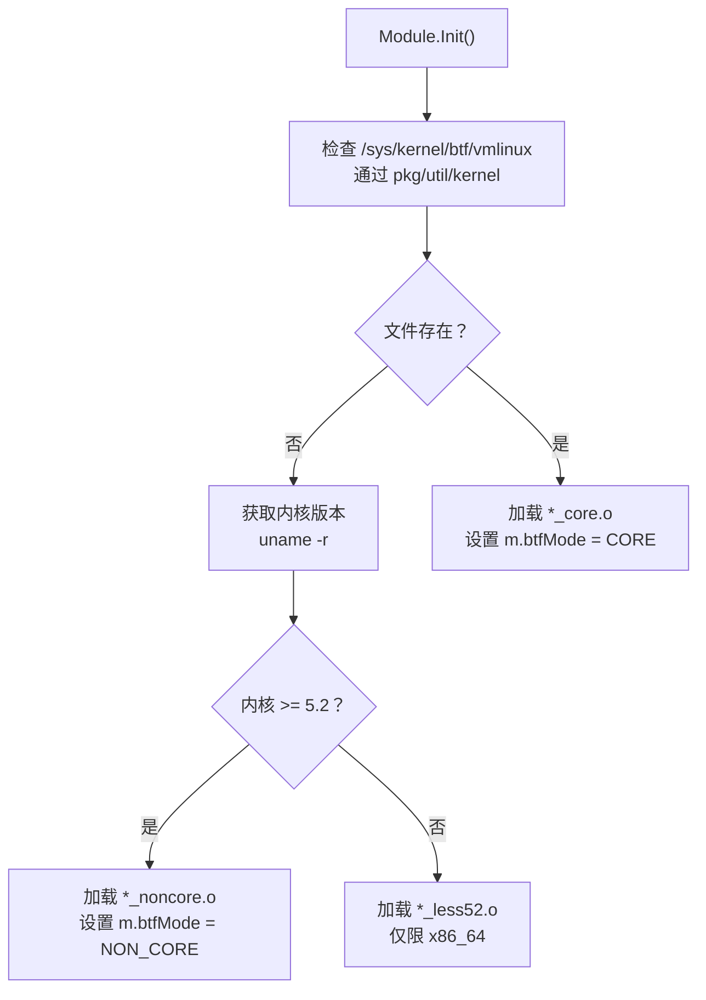
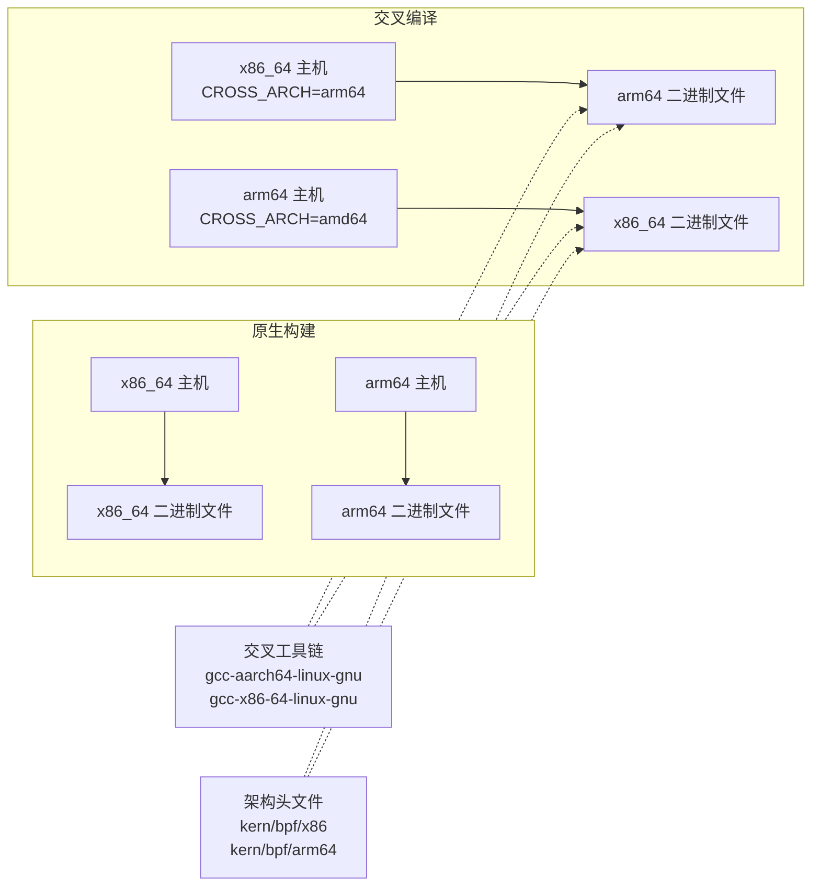
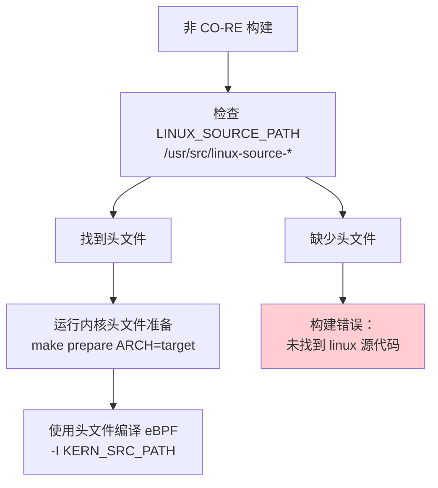
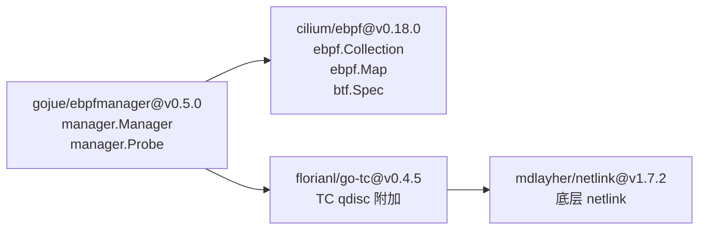
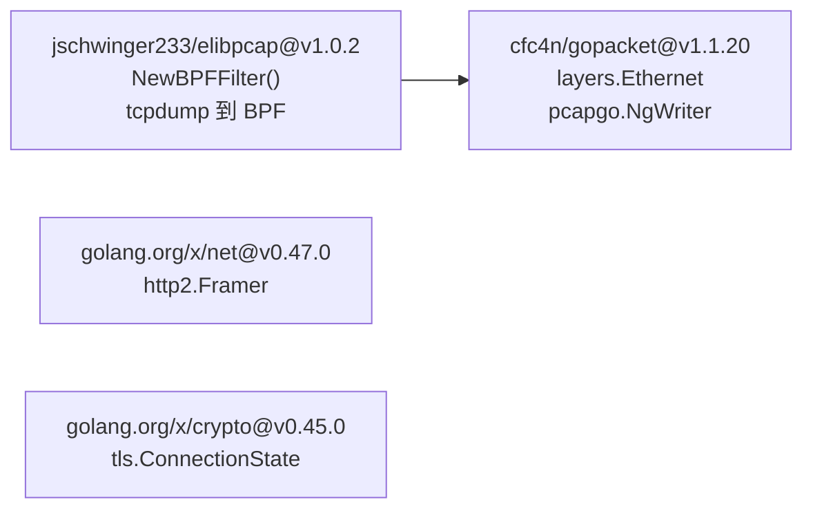
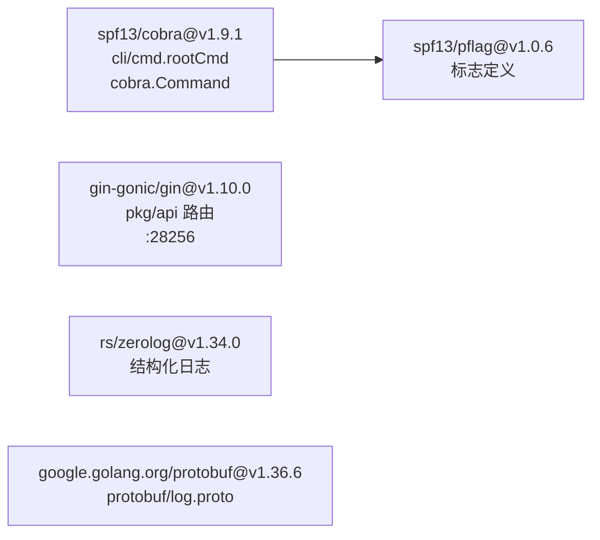
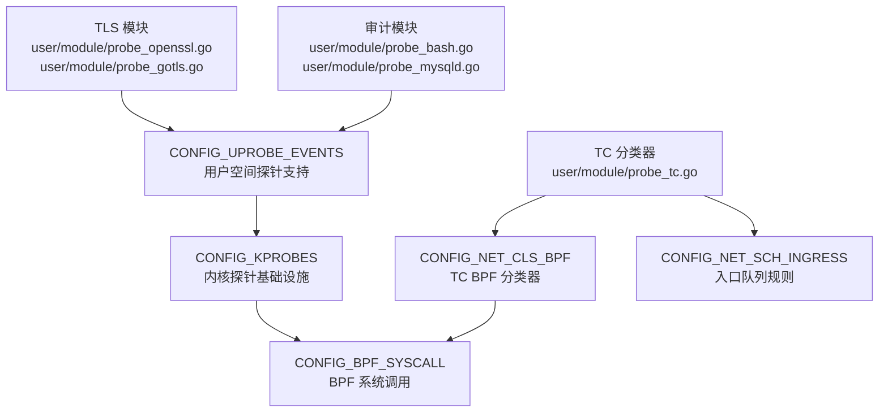
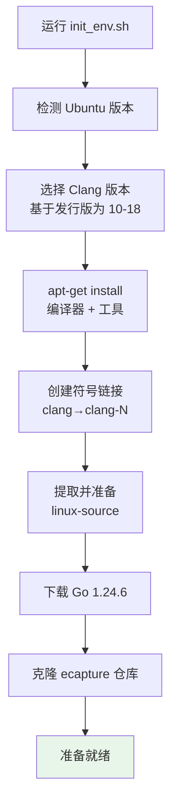
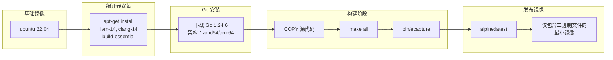

# 依赖与系统要求

本页面记录了构建和运行 eCapture 所需的系统要求、依赖项和工具链前置条件。内容涵盖内核版本要求、支持的架构、构建时工具、运行时依赖以及 Go 包依赖。

有关构建过程本身的信息，请参见[构建系统](../5-development-guide/5.1-build-system.md)。有关安装说明，请参见[安装与快速入门](1.1-installation-and-quick-start.md)。

---

## 概述

eCapture 在构建时（编译 eBPF 程序和 Go 二进制文件）和运行时（执行编译好的二进制文件）有不同的要求。系统支持两种编译模式，各有不同的要求：

- **CO-RE（一次编译 - 到处运行）**：运行时需要启用 BTF 的内核（≥5.2），但可以生成可移植的二进制文件
- **非 CO-RE**：构建时需要内核头文件，为旧系统生成特定内核版本的二进制文件

---

## 内核要求

### 最低内核版本

eCapture 根据 CPU 架构和编译模式需要不同的最低内核版本：

| 架构 | 最低版本 | BTF/CO-RE 支持 | 非 CO-RE 支持 |
|--------------|----------------|-------------------|-------------------|
| x86_64 (amd64) | 4.18+ | ≥5.2 推荐 | ≥4.18 |
| aarch64 (arm64) | 5.5+ | ≥5.5 | ≥5.5 |

**关键约束**：ARM64 支持需要内核 5.5 或更新版本，无论使用哪种编译模式。这在运行时强制执行，并记录在 [README.md:14](https://github.com/gojue/ecapture/blob/ca085d05/README.md#L14)。

### 编译模式要求

| 模式 | 内核要求 | 需要 BTF | 字节码后缀 |
|------|-------------------|--------------|-----------------|
| CO-RE | ≥5.2 (x86_64), ≥5.5 (arm64) | 是 | `_core.o` |
| CO-RE (旧版) | 4.18-5.1 (仅 x86_64) | 否 | `_less52.o` |
| 非 CO-RE | ≥4.18 (x86_64), ≥5.5 (arm64) | 否 | `_noncore.o` |

内核版本检测和处理在 [variables.mk:1-20](https://github.com/gojue/ecapture/blob/ca085d05/variables.mk#L1-L20) 中实现，对于内核 < 5.2 会设置 `KERNEL_LESS_5_2_PREFIX`。运行时选择逻辑位于 [pkg/util/kernel/kernel.go](https://github.com/gojue/ecapture/blob/ca085d05/pkg/util/kernel/kernel.go)。

### BTF（BPF 类型格式）支持

CO-RE 模式需要 BTF。运行时检测决定加载哪个字节码变体：

**运行时字节码选择流程**



**检测实现**：`Module` 基类在初始化序列中实现 BTF 检测。使用标准文件存在性检查来检查文件 `/sys/kernel/btf/vmlinux`。模块结构体中的 `btfMode` 字段存储选定的模式（0=CORE，1=NON_CORE）。

**字节码位置**：所有变体通过 go-bindata 嵌入到二进制文件的 [user/bytecode/](https://github.com/gojue/ecapture/blob/ca085d05/user/bytecode/) 中，并在运行时根据内核能力进行选择。

来源：[pkg/util/kernel/kernel.go](https://github.com/gojue/ecapture/blob/ca085d05/pkg/util/kernel/kernel.go)、[user/module/module.go](https://github.com/gojue/ecapture/blob/ca085d05/user/module/module.go)、[Makefile:122-134](https://github.com/gojue/ecapture/blob/ca085d05/Makefile#L122-L134)

---

## 支持的架构

| 架构 | 状态 | 最低内核版本 | 交叉编译 | 备注 |
|--------------|--------|----------------|-------------------|-------|
| x86_64 (amd64) | ✅ 完全支持 | 4.18+ | 到 arm64 | 主要开发平台 |
| aarch64 (arm64) | ✅ 完全支持 | 5.5+ | 到 x86_64 | 功能完全对等，内核要求更高 |
| Android arm64 | ⚠️ 有限支持 | 5.5+ | 从 x86_64/arm64 | 仅 BoringSSL，需要 Redroid/Docker |

架构检测在 [variables.mk:25-35](https://github.com/gojue/ecapture/blob/ca085d05/variables.mk#L25-L35) 中处理，根据 `uname -m` 或 `CROSS_ARCH` 环境变量设置 `TARGET_ARCH`、`GOARCH`、`LINUX_ARCH` 和 `LIBPCAP_ARCH`。Android 构建目标通过 [Makefile:253-265](https://github.com/gojue/ecapture/blob/ca085d05/Makefile#L253-L265) 指定，专门使用非 CO-RE 字节码。



来源：[.github/workflows/go-c-cpp.yml:59-65](https://github.com/gojue/ecapture/blob/ca085d05/.github/workflows/go-c-cpp.yml#L59-L65)、[.github/workflows/release.yml:93-97](https://github.com/gojue/ecapture/blob/ca085d05/.github/workflows/release.yml#L93-L97)、[builder/init_env.sh:43-61](https://github.com/gojue/ecapture/blob/ca085d05/builder/init_env.sh#L43-L61)

---

## 构建时依赖

### 必需的编译器和工具

下表列出了所有构建时依赖及其最低版本：

| 工具 | 最低版本 | 用途 | 包名（Ubuntu） |
|------|----------------|---------|----------------------|
| **clang** | 9.0+ | 将 eBPF C 编译为字节码 | `clang-14`（推荐） |
| **llc** | 9.0+ | LLVM 编译器后端 | `llvm-14` |
| **llvm-strip** | 9.0+ | 剥离调试符号 | `llvm-14` |
| **gcc** | 系统默认 | C 编译、CGO | `build-essential` |
| **go** | 1.24.3+ | Go 编译 | N/A（从 golang.org 安装） |
| **bpftool** | 任意版本 | 从 BTF 生成 `vmlinux.h` | `linux-tools-generic` |
| **flex** | 任意版本 | 内核构建的词法分析器 | `flex` |
| **bison** | 任意版本 | 内核构建的解析器 | `bison` |
| **elfutils** | 任意版本 | ELF 文件操作 | `libelf-dev` |
| **pkgconf** | 任意版本 | 包配置 | `pkgconf` |
| **libssl-dev** | 任意版本 | 偏移量提取所需的 SSL 头文件 | `libssl-dev` |
| **go-bindata** | 4.0.0+ | 在 `assets/` 中嵌入字节码 | `github.com/shuLhan/go-bindata` |

**版本强制执行：**

构建时版本检查在 [functions.mk:13-35](https://github.com/gojue/ecapture/blob/ca085d05/functions.mk#L13-L35) 中实现：
- **Clang**：`CLANG_VERSION >= 9`（从 `clang --version` 提取）
- **Go**：`GO_VERSION_MAJ=1` 且 `GO_VERSION_MIN >= 24`（从 `go version` 提取）

最低 Go 版本在 [go.mod:3](https://github.com/gojue/ecapture/blob/ca085d05/go.mod#L3) 中声明为 `go 1.24.3`。CI 工作流使用 Go 1.24.6，如 [.github/workflows/go-c-cpp.yml:15](https://github.com/gojue/ecapture/blob/ca085d05/.github/workflows/go-c-cpp.yml#L15) 和 [.github/workflows/release.yml:19](https://github.com/gojue/ecapture/blob/ca085d05/.github/workflows/release.yml#L19) 中所指定。

**工具符号链接：**

构建系统期望工具不带版本后缀可用。[builder/init_env.sh:75-79](https://github.com/gojue/ecapture/blob/ca085d05/builder/init_env.sh#L75-L79) 脚本创建符号链接：
```bash
sudo ln -s /usr/bin/clang-14 /usr/bin/clang
sudo ln -s /usr/bin/llc-14 /usr/bin/llc
sudo ln -s /usr/bin/llvm-strip-14 /usr/bin/llvm-strip
```

来源：[.github/workflows/go-c-cpp.yml:16-24](https://github.com/gojue/ecapture/blob/ca085d05/.github/workflows/go-c-cpp.yml#L16-L24)、[.github/workflows/release.yml:17-19](https://github.com/gojue/ecapture/blob/ca085d05/.github/workflows/release.yml#L17-L19)、[functions.mk:13-35](https://github.com/gojue/ecapture/blob/ca085d05/functions.mk#L13-L35)、[go.mod:3](https://github.com/gojue/ecapture/blob/ca085d05/go.mod#L3)、[builder/init_env.sh:72-79](https://github.com/gojue/ecapture/blob/ca085d05/builder/init_env.sh#L72-L79)

### 内核头文件（仅限非 CO-RE）

对于非 CO-RE 构建，需要与目标内核匹配的内核头文件。构建系统在多个位置搜索头文件：



编译期间使用的头文件路径 [Makefile:154-161](https://github.com/gojue/ecapture/blob/ca085d05/Makefile#L154-L161)：
- `-I $(KERN_SRC_PATH)/arch/$(LINUX_ARCH)/include`
- `-I $(KERN_BUILD_PATH)/arch/$(LINUX_ARCH)/include/generated`
- `-I $(KERN_SRC_PATH)/include`
- `-I $(KERN_BUILD_PATH)/include/generated/uapi`

来源：[Makefile:98-104](https://github.com/gojue/ecapture/blob/ca085d05/Makefile#L98-L104)、[Makefile:146-183](https://github.com/gojue/ecapture/blob/ca085d05/Makefile#L146-L183)、[builder/init_env.sh:81-89](https://github.com/gojue/ecapture/blob/ca085d05/builder/init_env.sh#L81-L89)

### 交叉编译依赖

交叉编译需要特定架构的工具链：

| 主机 → 目标 | 必需的包 | 备注 |
|---------------|-----------------|-------|
| x86_64 → arm64 | `gcc-aarch64-linux-gnu` | 设置 `CC=aarch64-linux-gnu-gcc` |
| arm64 → x86_64 | `gcc-x86-64-linux-gnu` | Ubuntu 24.04+ 包名 |
| 任意 → Android | 不需要 NDK | 使用标准交叉编译器 |

来源：[.github/workflows/go-c-cpp.yml:19](https://github.com/gojue/ecapture/blob/ca085d05/.github/workflows/go-c-cpp.yml#L19)、[builder/init_env.sh:46-58](https://github.com/gojue/ecapture/blob/ca085d05/builder/init_env.sh#L46-L58)

---

## Go 依赖

### 核心依赖

项目需要 Go **1.24.3 或更新版本**，如 [go.mod:3](https://github.com/gojue/ecapture/blob/ca085d05/go.mod#L3) 中声明。主要依赖按功能组织：

**eBPF 和程序管理**



**网络和协议处理**



**CLI 和 API 框架**



**依赖详情：**

以下依赖构成了 eCapture 的核心基础设施：

1. **cilium/ebpf v0.18.0** [go.mod:6](https://github.com/gojue/ecapture/blob/ca085d05/go.mod#L6)
   - 核心 eBPF 库提供：
     - `ebpf.CollectionSpec`：加载 eBPF 程序字节码
     - `ebpf.Map`：BPF 映射操作（读/写/更新）
     - `btf.Spec`：内核结构兼容性的 CO-RE 重定位处理
   - 在所有模块中用于底层 eBPF 交互

2. **gojue/ebpfmanager v0.5.0** [go.mod:8](https://github.com/gojue/ecapture/blob/ca085d05/go.mod#L8)
   - 生命周期管理包装器实现：
     - `manager.Manager`：协调多个探针和映射
     - `manager.Probe`：Uprobe/kprobe 附加元数据
     - `manager.InitWithOptions()`：eBPF 程序加载和验证
   - 在 [user/module/module.go](https://github.com/gojue/ecapture/blob/ca085d05/user/module/module.go) 中抽象 cilium/ebpf 的复杂性

3. **cfc4n/gopacket v1.1.20** [go.mod:60](https://github.com/gojue/ecapture/blob/ca085d05/go.mod#L60)
   - `google/gopacket` 的分支，支持 PCAP-NG DSB
   - 关键类型：
     - `layers.Ethernet`、`layers.IPv4`：数据包构造
     - `pcapgo.NgWriter`：带解密密钥的 PCAP-NG 文件写入
   - 在 [user/module/probe_openssl.go](https://github.com/gojue/ecapture/blob/ca085d05/user/module/probe_openssl.go) 和 [user/module/probe_gotls.go](https://github.com/gojue/ecapture/blob/ca085d05/user/module/probe_gotls.go) 的 pcap 模式中使用

4. **jschwinger233/elibpcap v1.0.2** [go.mod:10](https://github.com/gojue/ecapture/blob/ca085d05/go.mod#L10)
   - BPF 过滤器编译器，包装 libpcap 的 `pcap_compile()`
   - 函数：`NewBPFFilter(expr string) ([]bpf.RawInstruction, error)`
   - 将 tcpdump 风格的表达式（如 `"tcp port 443"`）转换为 BPF 字节码
   - 在 [user/module/probe_tc.go](https://github.com/gojue/ecapture/blob/ca085d05/user/module/probe_tc.go) 中用于数据包过滤

5. **shuLhan/go-bindata v4.0.0** [go.mod:12](https://github.com/gojue/ecapture/blob/ca085d05/go.mod#L12)
   - 构建时工具，将 eBPF `.o` 文件嵌入为 Go 字节数组
   - 生成 [assets/ebpf_probe.go](https://github.com/gojue/ecapture/blob/ca085d05/assets/ebpf_probe.go)，包含 `Asset(name string) ([]byte, error)`
   - 由 [Makefile:164-171](https://github.com/gojue/ecapture/blob/ca085d05/Makefile#L164-L171) 的 `assets` 和 `assets_noncore` 目标调用

6. **spf13/cobra v1.9.1** [go.mod:13](https://github.com/gojue/ecapture/blob/ca085d05/go.mod#L13)
   - CLI 框架定义命令树：
     - [cli/cmd/root.go](https://github.com/gojue/ecapture/blob/ca085d05/cli/cmd/root.go) 中的 `rootCmd`
     - 模块子命令：[cli/cmd/](https://github.com/gojue/ecapture/blob/ca085d05/cli/cmd/) 中的 `tlsCmd`、`gotlsCmd`、`bashCmd`
   - 提供标志解析和帮助生成

7. **gin-gonic/gin v1.10.0** [go.mod:7](https://github.com/gojue/ecapture/blob/ca085d05/go.mod#L7)
   - 用于远程配置 API 的 HTTP 服务器框架
   - 路由在 [cli/cmd/root.go](https://github.com/gojue/ecapture/blob/ca085d05/cli/cmd/root.go) 中定义
   - 默认监听地址：`localhost:28256`
   - API 端点记录在 [docs/remote-config-update-api.md](https://github.com/gojue/ecapture/blob/ca085d05/docs/remote-config-update-api.md)

8. **google.golang.org/protobuf v1.36.6** [go.mod:19](https://github.com/gojue/ecapture/blob/ca085d05/go.mod#L19)
   - 用于事件序列化的 Protocol buffer 运行时
   - 模式：[protobuf/log.proto](https://github.com/gojue/ecapture/blob/ca085d05/protobuf/log.proto) 定义 `LogEntry`、`Event` 消息
   - 在 WebSocket 事件转发到 eCaptureQ GUI 中使用

9. **golang.org/x/crypto v0.45.0** [go.mod:16](https://github.com/gojue/ecapture/blob/ca085d05/go.mod#L16)
   - TLS 结构定义（`tls.ConnectionState`、`tls.Config`）
   - 在 [user/config/config_gotls.go](https://github.com/gojue/ecapture/blob/ca085d05/user/config/config_gotls.go) 中用于 Go 二进制符号解析

10. **golang.org/x/net v0.47.0** [go.mod:17](https://github.com/gojue/ecapture/blob/ca085d05/go.mod#L17)
    - HTTP/2 帧处理：`http2.Framer`、`http2.Frame`
    - 在 [pkg/event_processor/](https://github.com/gojue/ecapture/blob/ca085d05/pkg/event_processor/) 中用于 HTTP/2 请求/响应解析

来源：[go.mod:3-20](https://github.com/gojue/ecapture/blob/ca085d05/go.mod#L3-L20)、[go.sum:1-200](https://github.com/gojue/ecapture/blob/ca085d05/go.sum#L1-L200)

### 间接依赖

关键的间接依赖包括：

| 包 | 版本 | 用途 |
|---------|---------|---------|
| `florianl/go-tc` | v0.4.5 | Linux 流量控制 netlink 接口 |
| `vishvananda/netlink` | v1.3.1 | 通用 netlink 操作 |
| `mdlayher/netlink` | v1.7.2 | 底层 netlink 套接字库 |
| `hashicorp/go-multierror` | v1.1.1 | 错误聚合 |

来源：[go.mod:22-58](https://github.com/gojue/ecapture/blob/ca085d05/go.mod#L22-L58)

---

## 运行时依赖

### 最小运行时要求

编译后的 `ecapture` 二进制文件除了内核特性外没有运行时依赖：

| 要求 | 描述 |
|-------------|-------------|
| Linux 内核 | x86_64: 4.18+, arm64: 5.5+ |
| BTF 支持 | CO-RE 模式需要 `/sys/kernel/btf/vmlinux` |
| `CAP_SYS_ADMIN` | 加载 eBPF 程序需要 root 权限 |
| `CAP_BPF` + `CAP_PERFMON` | 在内核 5.8+ 上作为 `CAP_SYS_ADMIN` 的替代 |

**静态链接**：二进制文件通过 [functions.mk:48-53](https://github.com/gojue/ecapture/blob/ca085d05/functions.mk#L48-L53) 中的 CGO 标志与 libpcap 静态链接：
```
CGO_CFLAGS='-I$(CURDIR)/lib/libpcap/'
CGO_LDFLAGS='-L$(CURDIR)/lib/libpcap/ -lpcap -static'
LDFLAGS='-linkmode=external -extldflags -static'
```

这会生成一个没有共享库依赖的独立二进制文件。验证：`ldd ecapture` 应该显示 "not a dynamic executable"。

**能力检查**：能力检查在 [cli/cmd/root.go](https://github.com/gojue/ecapture/blob/ca085d05/cli/cmd/root.go) 中使用 Linux 能力系统调用实现。检查区分 `CAP_BPF`（5.8+ 上首选）和 `CAP_SYS_ADMIN`（旧内核上需要）。

### 各模块的内核特性要求

特定模块的内核配置要求：

**必需的内核配置符号**



**模块要求表：**

| 模块 | eBPF 程序类型 | 内核配置 | 附加函数 |
|--------|------------------|---------------|---------------------|
| `probe_openssl.go` | Uprobe | `CONFIG_UPROBE_EVENTS` | `SSL_read`、`SSL_write` |
| `probe_gotls.go` | Uprobe | `CONFIG_UPROBE_EVENTS` | `crypto/tls.(*Conn).Read` |
| `probe_bash.go` | Uprobe | `CONFIG_UPROBE_EVENTS` | `readline` |
| `probe_tc.go` | TC 分类器 | `CONFIG_NET_CLS_BPF` | `tc_ingress`、`tc_egress` |
| `probe_mysqld.go` | Uprobe | `CONFIG_UPROBE_EVENTS` | `dispatch_command` |

**配置验证**：使用以下命令检查当前内核配置：
```bash
grep -E "CONFIG_(UPROBE|KPROBES|BPF|NET_CLS_BPF)" /boot/config-$(uname -r)
```

所有模块都需要 `CONFIG_BPF_SYSCALL=y` 作为基本要求。

来源：[user/module/probe_openssl.go:1-50](https://github.com/gojue/ecapture/blob/ca085d05/user/module/probe_openssl.go#L1-L50)、[user/module/probe_tc.go:1-50](https://github.com/gojue/ecapture/blob/ca085d05/user/module/probe_tc.go#L1-L50)、[kern/tc_kern.c:1-30](https://github.com/gojue/ecapture/blob/ca085d05/kern/tc_kern.c#L1-L30)

---

## 编译模式比较

### CO-RE vs 非 CO-RE

| 方面 | CO-RE 模式 | 非 CO-RE 模式 |
|--------|-----------|----------------|
| **构建要求** | clang、llc、vmlinux.h（BTF） | clang、llc、完整的内核头文件 |
| **运行时要求** | 启用 BTF 的内核：x86_64 ≥5.2，arm64 ≥5.5 | x86_64 ≥4.18，arm64 ≥5.5 |
| **可移植性** | 单个二进制文件适用于所有兼容内核 | 二进制文件绑定到特定内核版本 |
| **字节码大小** | 更大（包含 BTF 重定位元数据） | 更小（硬编码偏移量） |
| **构建时间** | 快速（无需提取内核源代码） | 慢（需要在内核源代码中执行 `make prepare`） |
| **使用场景** | 分发二进制文件、现代系统 | 旧版 x86_64 系统（4.18-5.1）、Android |

**编译标志差异：**

CO-RE [Makefile:122-134](https://github.com/gojue/ecapture/blob/ca085d05/Makefile#L122-L134)：
```bash
clang -target bpfel -D__TARGET_ARCH_$(LINUX_ARCH) \
  -D__BPF_TRACING__ -DCORE \
  -I/usr/include/$(LINUX_ARCH)-linux-gnu \
  -g -O2 -c kern/openssl_kern.c -o openssl_kern_core.o
```

非 CO-RE [Makefile:146-166](https://github.com/gojue/ecapture/blob/ca085d05/Makefile#L146-L166)：
```bash
clang -D__KERNEL__ -D__ASM_SYSREG_H \
  -I $(KERN_SRC_PATH)/arch/$(LINUX_ARCH)/include \
  -I $(KERN_BUILD_PATH)/include/generated \
  -I $(KERN_SRC_PATH)/include \
  -I $(KERN_BUILD_PATH)/include/generated/uapi \
  -g -O2 -emit-llvm -c kern/openssl_kern.c -o - | \
llc -march=bpf -filetype=obj -o openssl_kern_noncore.o
```

主要区别：CO-RE 使用 `-target bpfel` 直接输出 BPF，而非 CO-RE 使用 LLVM IR（`-emit-llvm`）然后用 `llc` 编译。非 CO-RE 包含显式的内核头文件路径。

**字节码嵌入**：两种变体都通过 [Makefile:243-249](https://github.com/gojue/ecapture/blob/ca085d05/Makefile#L243-L249) 中的 go-bindata 嵌入，并存储在 [assets/ebpf_probe.go](https://github.com/gojue/ecapture/blob/ca085d05/assets/ebpf_probe.go)。运行时选择发生在模块初始化期间。

来源：[Makefile:122-183](https://github.com/gojue/ecapture/blob/ca085d05/Makefile#L122-L183)、[variables.mk:1-50](https://github.com/gojue/ecapture/blob/ca085d05/variables.mk#L1-L50)

---

## 开发环境设置

### 自动化设置（Ubuntu）

项目提供 [builder/init_env.sh](https://github.com/gojue/ecapture/blob/ca085d05/builder/init_env.sh) 用于自动化环境设置：



[builder/init_env.sh:16-39](https://github.com/gojue/ecapture/blob/ca085d05/builder/init_env.sh#L16-L39) 中特定版本的 clang 选择：
- Ubuntu 20.04（Focal）：clang-10、llvm-10
- Ubuntu 22.04（Jammy）：clang-12、llvm-12
- Ubuntu 23.04（Lunar）：clang-15、llvm-15
- Ubuntu 23.10（Mantic）：clang-15、llvm-15
- Ubuntu 24.04（Noble）：clang-18、llvm-18

脚本创建符号链接 `/usr/bin/clang` → `/usr/bin/clang-N` 以确保命名一致。

**Go 安装**：脚本从 `https://golang.google.cn/dl/go1.24.6.linux-{amd64,arm64}.tar.gz`（使用中国镜像）下载 Go 1.24.6，如 [builder/init_env.sh:63-64](https://github.com/gojue/ecapture/blob/ca085d05/builder/init_env.sh#L63-L64) 和 [builder/init_env.sh:94-97](https://github.com/gojue/ecapture/blob/ca085d05/builder/init_env.sh#L94-L97) 所示，然后解压到 `/usr/local/go`。

来源：[builder/init_env.sh:1-106](https://github.com/gojue/ecapture/blob/ca085d05/builder/init_env.sh#L1-L106)

### 手动设置

对于手动设置，安装这些包组：

**基本工具：**
```bash
sudo apt-get install build-essential pkgconf libelf-dev libssl-dev
```

**LLVM 工具链（特定版本）：**
```bash
# Ubuntu 22.04 及更高版本
sudo apt-get install llvm-14 clang-14

# 创建版本无关的符号链接（Makefile 要求）
sudo ln -sf /usr/bin/clang-14 /usr/bin/clang
sudo ln -sf /usr/bin/llc-14 /usr/bin/llc
sudo ln -sf /usr/bin/llvm-strip-14 /usr/bin/llvm-strip
```

**内核工具：**
```bash
sudo apt-get install linux-tools-common linux-tools-generic flex bison
```

**交叉编译（可选）：**
```bash
# 在 x86_64 主机上针对 arm64 目标
sudo apt-get install gcc-aarch64-linux-gnu

# 在 arm64 主机上针对 x86_64 目标（Ubuntu 24.04+）
sudo apt-get install gcc-x86-64-linux-gnu
```

**内核头文件（仅限非 CO-RE 模式）：**
```bash
sudo apt-get install linux-source
cd /usr/src
sudo tar -xf linux-source-*.tar.bz2
cd linux-source-*/

# 为本机架构准备头文件
sudo make oldconfig
sudo make prepare

# 对于交叉编译，准备目标架构头文件
sudo make ARCH=arm64 CROSS_COMPILE=aarch64-linux-gnu- prepare
```

**Go 安装：**
```bash
# 下载并安装 Go 1.24.3 或更新版本
wget https://go.dev/dl/go1.24.6.linux-amd64.tar.gz
sudo rm -rf /usr/local/go
sudo tar -C /usr/local -xzf go1.24.6.linux-amd64.tar.gz

# 添加到 PATH
export PATH=$PATH:/usr/local/go/bin
```

来源：[.github/workflows/go-c-cpp.yml:16-33](https://github.com/gojue/ecapture/blob/ca085d05/.github/workflows/go-c-cpp.yml#L16-L33)、[builder/init_env.sh:72-106](https://github.com/gojue/ecapture/blob/ca085d05/builder/init_env.sh#L72-L106)

---

## Docker 构建环境

项目提供 Dockerfile 用于容器化构建：



[builder/Dockerfile:1-39](https://github.com/gojue/ecapture/blob/ca085d05/builder/Dockerfile#L1-L39) 中的多阶段构建：
1. **构建器阶段**：Ubuntu 22.04 上的完整工具链
2. **发布阶段**：带有静态二进制文件的最小 Alpine 镜像

为多个架构构建：
```bash
docker buildx build --platform linux/amd64,linux/arm64 -t ecapture:latest .
```

来源：[builder/Dockerfile:1-39](https://github.com/gojue/ecapture/blob/ca085d05/builder/Dockerfile#L1-L39)、[.github/workflows/release.yml:101-129](https://github.com/gojue/ecapture/blob/ca085d05/.github/workflows/release.yml#L101-L129)

---

## 验证命令

设置后，验证依赖项：

```bash
# 检查工具版本（由 functions.mk:13-35 强制执行）
clang --version          # 应为 >= 9.0
go version               # 应为 >= 1.24.3（go.mod:3）
llc --version            # 应与 clang 版本匹配
llvm-strip --version     # 应与 clang 版本匹配
bpftool version          # 任意版本

# 检查 BTF 支持（运行时，CO-RE 模式需要）
ls -l /sys/kernel/btf/vmlinux  # CO-RE 模式应存在
file /sys/kernel/btf/vmlinux   # 应显示 "BTF data"

# 检查 eBPF 内核配置（从 /boot/config-$(uname -r)）
grep CONFIG_BPF_SYSCALL /boot/config-$(uname -r)     # 必须为 =y（所有模块）
grep CONFIG_UPROBE_EVENTS /boot/config-$(uname -r)   # =y（TLS/审计模块）
grep CONFIG_KPROBES /boot/config-$(uname -r)         # =y（连接跟踪）
grep CONFIG_NET_CLS_BPF /boot/config-$(uname -r)     # =y（TC 数据包捕获）
grep CONFIG_NET_SCH_INGRESS /boot/config-$(uname -r) # =y（TC 入口队列规则）

# 验证静态链接（应显示 "not a dynamic executable"）
ldd ./bin/ecapture
# 预期输出："not a dynamic executable" 或 "statically linked"

# 检查 libpcap 静态库是否存在（仅限构建时）
ls -l ./lib/libpcap/libpcap.a

# 验证 Go 依赖
go mod verify  # 应显示 "all modules verified"
```

**运行时能力验证：**
```bash
# 检查进程能力（需要 root 或 CAP_SYS_ADMIN）
sudo ./bin/ecapture --help
# 不应显示能力错误

# 对于内核 5.8+，检查 CAP_BPF 和 CAP_PERFMON
sudo setcap cap_sys_admin,cap_bpf,cap_perfmon=eip ./bin/ecapture
getcap ./bin/ecapture
```

**构建系统验证：**
```bash
# 从 Makefile 运行环境检查
make env
# 应显示所有变量（CLANG_VERSION、GO_VERSION、KERN_RELEASE 等）

# 测试 CO-RE 构建
make clean
make all

# 测试非 CO-RE 构建
make clean
make nocore
```

来源：[functions.mk:2-39](https://github.com/gojue/ecapture/blob/ca085d05/functions.mk#L2-L39)、[go.mod:3](https://github.com/gojue/ecapture/blob/ca085d05/go.mod#L3)、[Makefile:19-64](https://github.com/gojue/ecapture/blob/ca085d05/Makefile#L19-L64)、[README.md:14-16](https://github.com/gojue/ecapture/blob/ca085d05/README.md#L14-L16)

---

## 常见问题

### Clang 版本过旧

**问题**：构建失败，显示 "you MUST use clang 9 or newer"

**解决方案**：安装更新的 clang 版本并创建符号链接 [builder/init_env.sh:75-79](https://github.com/gojue/ecapture/blob/ca085d05/builder/init_env.sh#L75-L79)：
```bash
sudo apt-get install clang-14 llc-14 llvm-strip-14
sudo ln -sf /usr/bin/clang-14 /usr/bin/clang
```

### 缺少内核头文件

**问题**：非 CO-RE 构建失败，显示 "linux source not found"

**解决方案**：安装并准备内核头文件 [Makefile:98-104](https://github.com/gojue/ecapture/blob/ca085d05/Makefile#L98-L104)：
```bash
sudo apt-get install linux-source
cd /usr/src && sudo tar -xf linux-source-*.tar.bz2
cd linux-source-*/ && sudo make prepare
```

### Go 版本过旧

**问题**：构建失败，显示 "you MUST use golang 1.24 or newer"

**解决方案**：从 [golang.org/dl](https://golang.org/dl/) 下载 Go 1.24.6+ 并更新 PATH。

来源：[functions.mk:13-35](https://github.com/gojue/ecapture/blob/ca085d05/functions.mk#L13-L35)、[Makefile:98-104](https://github.com/gojue/ecapture/blob/ca085d05/Makefile#L98-L104)、[builder/init_env.sh:72-89](https://github.com/gojue/ecapture/blob/ca085d05/builder/init_env.sh#L72-L89)