# eBPF 引擎

eBPF 引擎是核心组件，负责在 ecapture 系统中加载、验证和管理 eBPF 字节码程序。它处理内核兼容性检测、在 CO-RE（一次编译，到处运行）和非 CO-RE 模式之间进行动态字节码选择、程序生命周期管理以及探针附加。该引擎充当用户空间捕获模块和内核空间插桩之间的桥梁。

有关使用此引擎的特定捕获模块的信息，请参见[捕获模块](../3-capture-modules/index.md)。有关 eBPF 程序开发和结构的详细信息，请参见 [eBPF 程序开发](../5-development-guide/5.2-ebpf-program-development.md)。

## 架构概述

eBPF 引擎作为一个多层系统运行，将捕获需求转换为主动的内核插桩：

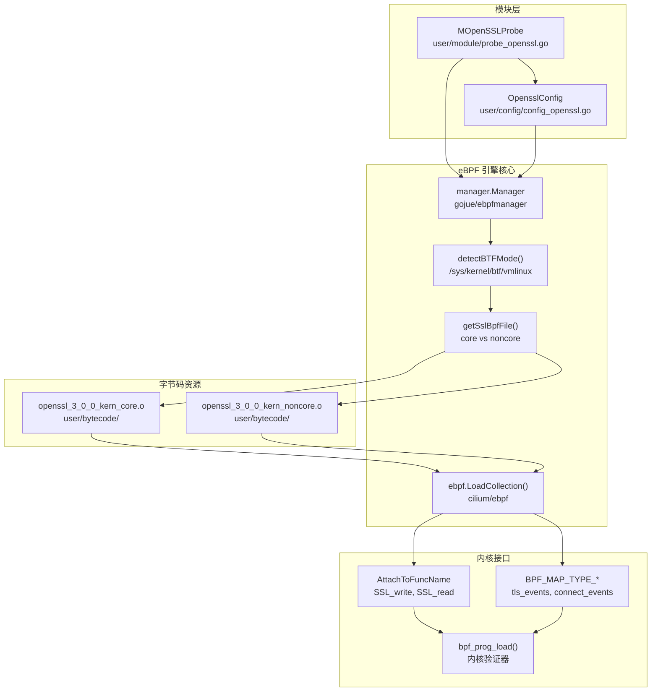

**架构流程**：像 `MOpenSSLProbe` 这样的捕获模块通过来自 `ebpfmanager` 库的 `manager.Manager` 实例化 eBPF 引擎。`setupManagersText()` 函数执行 BTF 检测以确定内核兼容性。基于 BTF 可用性和容器状态，引擎从嵌入的 `user/bytecode/` 目录中选择 CO-RE 或非 CO-RE 字节码文件。`cilium/ebpf` 加载器解析 ELF 目标文件并通过 `bpf()` 系统调用加载它们，内核验证器在允许执行之前确保安全性。

来源：[user/module/probe_openssl_text.go:18-188](https://github.com/gojue/ecapture/blob/ca085d05/user/module/probe_openssl_text.go#L18-L188)、[kern/ecapture.h:1-130](https://github.com/gojue/ecapture/blob/ca085d05/kern/ecapture.h#L1-L130)、[kern/openssl.h:1-544](https://github.com/gojue/ecapture/blob/ca085d05/kern/openssl.h#L1-L544)

## CO-RE vs 非 CO-RE 模式

eBPF 引擎支持两种不同的编译和运行时模式，以最大化内核兼容性：

### 构建时编译

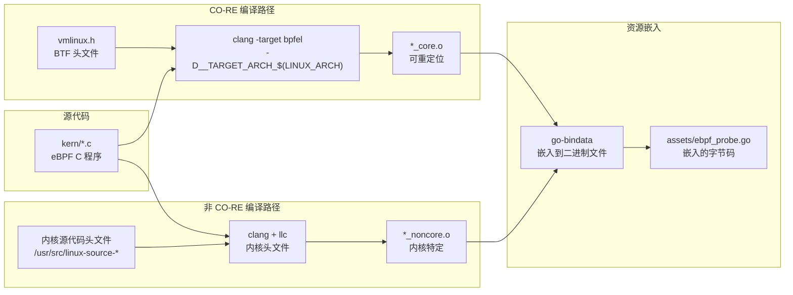

构建系统同时生成两种字节码变体，并通过 `go-bindata` 将它们嵌入到最终的二进制文件中。

**CO-RE 编译** ([Makefile:118-135](https://github.com/gojue/ecapture/blob/ca085d05/Makefile#L118-L135))：
- 使用 `clang -target bpfel` 和来自 `vmlinux.h` 的 BTF 类型信息
- 通过 `#ifndef NOCORE` 预处理器指令进行条件编译 ([kern/ecapture.h:18-27](https://github.com/gojue/ecapture/blob/ca085d05/kern/ecapture.h#L18-L27))
- 包含 `bpf/bpf_core_read.h` 以获得像 `bpf_core_read()` 这样的 CO-RE 辅助宏
- 生成位置无关的字节码，CO-RE 重定位嵌入在 ELF 节中
- 单个字节码可以在多个内核版本上工作（4.18+ / arm64 的 5.5+）
- 由于单一版本，构建产物更小

**非 CO-RE 编译** ([Makefile:146-183](https://github.com/gojue/ecapture/blob/ca085d05/Makefile#L146-L183))：
- 在构建时需要来自 `/usr/src/linux-source-*` 的完整内核源代码头文件
- 通过 `NOCORE` 预处理器指令的 `#else` 分支进行条件编译 ([kern/ecapture.h:28-88](https://github.com/gojue/ecapture/blob/ca085d05/kern/ecapture.h#L28-L88))
- 使用 `clang` → `llc` 管道，带有 `-march=bpf`
- 字节码包含在编译时解析的硬编码内核结构偏移量
- 必须包含特定的内核头文件，如 `<linux/bpf.h>`、`<net/sock.h>`
- 内核特定：必须完全匹配构建的内核版本

来源：[Makefile:118-183](https://github.com/gojue/ecapture/blob/ca085d05/Makefile#L118-L183)、[kern/ecapture.h:18-88](https://github.com/gojue/ecapture/blob/ca085d05/kern/ecapture.h#L18-L88)、[.github/workflows/go-c-cpp.yml:16-33](https://github.com/gojue/ecapture/blob/ca085d05/.github/workflows/go-c-cpp.yml#L16-L33)

### 运行时检测与选择

引擎在启动时执行环境检测以选择合适的字节码：

| 检测因素 | 方法 | 影响 |
|---------|------|------|
| **BTF 可用性** | 检查 `/sys/kernel/btf/vmlinux` 是否存在 | 启用 CO-RE 模式 |
| **容器环境** | 检查 `/proc/1/cgroup`、`/.dockerenv` | 强制使用 CO-RE 以避免主机内核依赖 |
| **内核版本** | `uname -r` 解析 | 验证最低版本要求 |
| **架构** | `runtime.GOARCH` | 选择特定架构的字节码 |

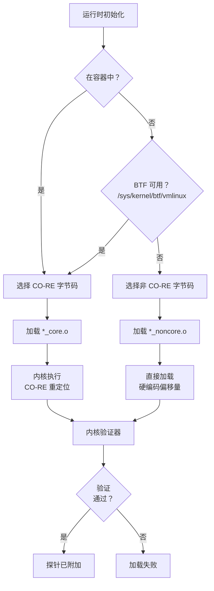

检测逻辑在可用时优先选择 CO-RE，仅当 BTF 不可用且未在容器中运行时才回退到非 CO-RE。这确保了最大的可移植性，同时保持内核特定的优化能力。

来源：[README.md:82-102](https://github.com/gojue/ecapture/blob/ca085d05/README.md#L82-L102)、[CHANGELOG.md:228-230](https://github.com/gojue/ecapture/blob/ca085d05/CHANGELOG.md#L228-L230)、[Makefile:38-63](https://github.com/gojue/ecapture/blob/ca085d05/Makefile#L38-L63)

## BTF 检测

BTF（BPF 类型格式）是一种元数据格式，描述 BPF 程序和内核中使用的类型。eBPF 引擎使用 BTF 来启用 CO-RE 功能：

### BTF 检测过程

引擎通过多个指标检查 BTF 支持：

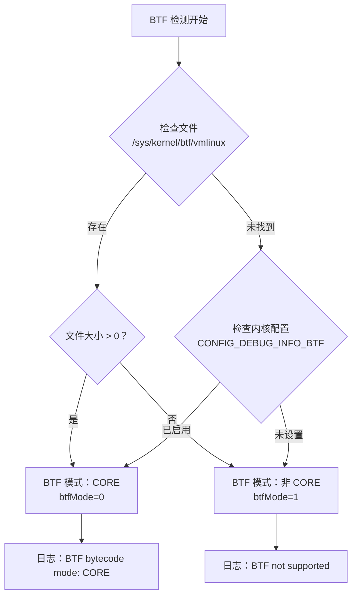

**检测实现**：
1. 主要检查：`/sys/kernel/btf/vmlinux` 文件存在性和大小
2. 回退：解析 `/boot/config-$(uname -r)` 查找 `CONFIG_DEBUG_INFO_BTF=y`
3. 运行时日志指示检测到的模式（请参见示例中的日志输出）

### BTF 对 CO-RE 的好处

BTF 启用了几个关键功能：

| 功能 | 无 BTF（非 CO-RE） | 有 BTF（CO-RE） |
|------|-------------------|-----------------|
| **结构访问** | 字节码中的硬编码偏移量 | 内核运行时重定位 |
| **内核可移植性** | 单一目标内核版本 | 所有带 BTF 的内核 |
| **构建要求** | 需要完整的内核头文件 | 仅需要 vmlinux.h |
| **容器支持** | 需要主机内核匹配 | 自动适应主机内核 |
| **二进制大小** | 每个内核版本的字节码 | 所有版本使用单一字节码 |

CO-RE 重定位在 eBPF 程序加载期间发生，此时内核的 BTF 信息用于解析字段偏移量、类型大小和存在性检查。

来源：[README.md:89](https://github.com/gojue/ecapture/blob/ca085d05/README.md#L89)、[README_CN.md:90](https://github.com/gojue/ecapture/blob/ca085d05/README_CN.md#L90)、[CHANGELOG.md:249-250](https://github.com/gojue/ecapture/blob/ca085d05/CHANGELOG.md#L249-L250)

## 字节码加载

eBPF 引擎使用 `cilium/ebpf` 库将字节码加载到内核中。加载过程涉及字节码选择、资源提取和内核验证：

### 字节码资源管理

所有 eBPF 字节码在构建时使用 `go-bindata` 嵌入到二进制文件中：

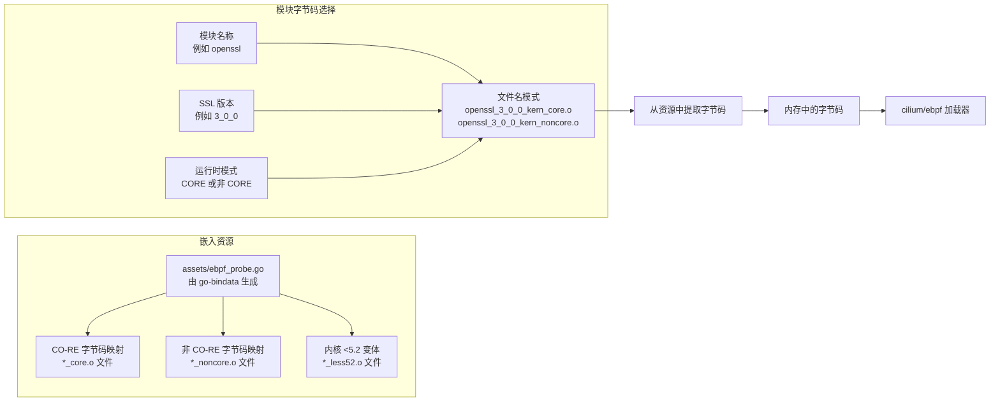

资源生成发生在构建过程中 ([Makefile:186-195](https://github.com/gojue/ecapture/blob/ca085d05/Makefile#L186-L195))：
- `go-bindata` 扫描 `user/bytecode/*.o` 文件
- 生成带有嵌入字节数组的 `assets/ebpf_probe.go`
- 每个字节码文件可通过其原始文件名访问

### 加载序列

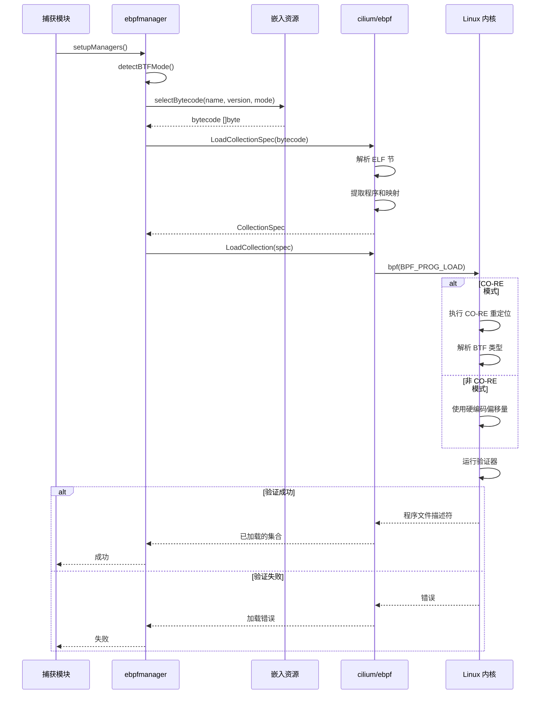

加载过程包括：
1. **字节码选择**：基于模块名称、版本和检测到的模式
2. **ELF 解析**：提取程序定义、映射定义和 BTF 信息
3. **内核加载**：通过 `bpf()` 系统调用提交字节码
4. **验证**：内核验证器检查安全约束
5. **重定位**（仅 CO-RE）：使用 BTF 解析结构字段偏移量

来源：[Makefile:186-195](https://github.com/gojue/ecapture/blob/ca085d05/Makefile#L186-L195)、[README.md:89-102](https://github.com/gojue/ecapture/blob/ca085d05/README.md#L89-L102)

## 探针附加机制

eBPF 引擎支持三种主要的探针附加类型，每种类型服务于不同的插桩需求：

### 探针类型

```mermaid
graph TB
    subgraph "用户空间探针"
        UprobeSSLWrite["SEC('uprobe/SSL_write')<br/>probe_entry_SSL_write"]
        UretprobeSSLWrite["SEC('uretprobe/SSL_write')<br/>probe_ret_SSL_write"]
        UprobeSSLRead["SEC('uprobe/SSL_read')<br/>probe_entry_SSL_read"]
        UprobeSSLSetFd["SEC('uprobe/SSL_set_fd')<br/>probe_SSL_set_fd"]
        
        UprobeTarget["目标二进制文件<br/>libssl.so.3<br/>SSL_write, SSL_read"]
        
        UprobeSSLWrite --> UprobeTarget
        UretprobeSSLWrite --> UprobeTarget
        UprobeSSLRead --> UprobeTarget
        UprobeSSLSetFd --> UprobeTarget
    end
    
    subgraph "内核空间探针"
        KprobeSysConnect["SEC('kprobe/sys_connect')<br/>probe_connect"]
        KretprobeSysConnect["SEC('kretprobe/sys_connect')<br/>retprobe_connect"]
        KprobeInetAccept["SEC('kprobe/inet_accept')<br/>probe_inet_accept"]
        KprobeTcpSendmsg["SEC('kprobe/tcp_sendmsg')<br/>tcp_sendmsg"]
        
        KprobeTarget["内核函数<br/>__sys_connect<br/>inet_accept<br/>tcp_sendmsg"]
        
        KprobeSysConnect --> KprobeTarget
        KretprobeSysConnect --> KprobeTarget
        KprobeInetAccept --> KprobeTarget
        KprobeTcpSendmsg --> KprobeTarget
    end
    
    subgraph "流量控制"
        TCIngress["SEC('classifier')<br/>ingress_cls_func"]
        TCEgress["SEC('classifier')<br/>egress_cls_func"]
        
        TCTarget["网络接口<br/>capture_packets(__sk_buff)"]
        
        TCIngress --> TCTarget
        TCEgress --> TCTarget
    end
    
    subgraph "eBPF 映射"
        TlsEvents["tls_events<br/>BPF_MAP_TYPE_PERF_EVENT_ARRAY"]
        ConnEvents["connect_events<br/>BPF_MAP_TYPE_PERF_EVENT_ARRAY"]
        SkbEvents["skb_events<br/>BPF_MAP_TYPE_PERF_EVENT_ARRAY"]
        NetworkMap["network_map<br/>BPF_MAP_TYPE_LRU_HASH"]
    end
    
    UprobeSSLWrite --> TlsEvents
    UretprobeSSLWrite --> TlsEvents
    KprobeSysConnect --> ConnEvents
    KretprobeSysConnect --> ConnEvents
    TCIngress --> SkbEvents
    TCEgress --> SkbEvents
    
    KprobeTcpSendmsg --> NetworkMap
    TCTarget --> NetworkMap
```

### Uprobe 附加

Uprobe 通过在函数入口和返回点放置断点来插桩用户空间函数：

| 方面 | 实现 |
|------|------|
| **目标发现** | ELF 符号表解析，通过 `/etc/ld.so.conf` 进行动态库路径解析 |
| **偏移量计算** | 在目标二进制文件中查找函数地址的符号表 |
| **附加方法** | 使用 `AttachToFuncName` 字段的 `manager.Probe` ([user/module/probe_openssl_text.go:50-72](https://github.com/gojue/ecapture/blob/ca085d05/user/module/probe_openssl_text.go#L50-L72)) |
| **常见目标** | `SSL_read`、`SSL_write`、`SSL_set_fd`、`SSL_do_handshake`（用于主密钥） |
| **事件上下文** | 在 `struct ssl_data_event_t` 中捕获 ([kern/openssl.h:28-39](https://github.com/gojue/ecapture/blob/ca085d05/kern/openssl.h#L28-L39))：PID、TID、fd、数据缓冲区、版本 |
| **数据流** | 入口探针在 `active_ssl_write_args_map` 中存储参数，返回探针读取数据并发送到 `tls_events` |

**示例**：OpenSSL 模块使用 `probe_entry_SSL_write()` 在入口处和 `probe_ret_SSL_write()` 在返回处附加到 `SSL_write` ([kern/openssl.h:331-339](https://github.com/gojue/ecapture/blob/ca085d05/kern/openssl.h#L331-L339))。入口探针捕获函数参数，包括 SSL 上下文指针和缓冲区地址，将它们存储在每线程哈希映射中。返回探针检索存储的上下文，使用 `bpf_probe_read_user()` 从缓冲区读取实际数据，并通过 `bpf_perf_event_output()` 发送完整事件。

### Kprobe 附加

Kprobe 插桩内核函数以进行网络连接跟踪：

| 方面 | 实现 |
|------|------|
| **目标发现** | `/proc/kallsyms` 内核符号表解析 |
| **偏移量计算** | 直接从 kallsyms 获取符号地址 |
| **附加方法** | 使用 `AttachToFuncName` 字段的 `manager.Probe` ([user/module/probe_openssl_text.go:76-116](https://github.com/gojue/ecapture/blob/ca085d05/user/module/probe_openssl_text.go#L76-L116)) |
| **常见目标** | `__sys_connect`、`inet_stream_connect`、`__sys_accept4`、`tcp_sendmsg`、`tcp_v4_destroy_sock` |
| **事件上下文** | 在 `struct connect_event_t` 中捕获 ([kern/openssl.h:41-55](https://github.com/gojue/ecapture/blob/ca085d05/kern/openssl.h#L41-L55))：套接字地址、PID、TID、fd、IP 族、端口 |
| **数据结构** | 使用 `struct sock` 内核结构提取网络元组（源/目标 IP:端口） |

**目的**：将用户空间捕获的数据与网络连接元数据相关联。`tcp_sendmsg()` kprobe ([kern/tc.h:285-333](https://github.com/gojue/ecapture/blob/ca085d05/kern/tc.h#L285-L333)) 从 `struct sock` 参数中提取 PID、UID 和网络元组，将此映射存储在 `network_map` 哈希映射中。然后 TC 分类器查找此映射，将捕获的数据包与发起进程关联，即使 TC 钩子在网络接口级别执行，也能实现按进程过滤数据包。

### TC（流量控制）附加

TC 分类器在数据链路层捕获原始网络数据包：

| 方面 | 实现 |
|------|------|
| **目标** | 通过 `-i` 标志指定的网络接口（eth0、wlan0 等） |
| **钩子点** | `SEC("classifier")` 节：`ingress_cls_func`、`egress_cls_func` ([kern/tc.h:274-283](https://github.com/gojue/ecapture/blob/ca085d05/kern/tc.h#L274-L283)) |
| **附加方法** | 通过 `tc qdisc add` 和 `tc filter add` 命令使用 `netlink` |
| **过滤器支持** | `filter_pcap_ebpf_l2()` 桩函数 ([kern/tc.h:122-132](https://github.com/gojue/ecapture/blob/ca085d05/kern/tc.h#L122-L132)) 用于注入 pcap-filter BPF 字节码 |
| **事件上下文** | 在 `struct skb_data_event_t` 中捕获 ([kern/tc.h:30-37](https://github.com/gojue/ecapture/blob/ca085d05/kern/tc.h#L30-L37))：时间戳、PID、comm、数据包长度、ifindex |
| **数据结构** | 解析 `struct __sk_buff`、`struct ethhdr`、`struct iphdr`、`struct tcphdr` |

**TC 集成流程**：
1. 使用 netlink 将 TC 分类器附加到网络接口
2. `capture_packets()` 函数 ([kern/tc.h:135-271](https://github.com/gojue/ecapture/blob/ca085d05/kern/tc.h#L135-L271)) 在每个数据包上执行
3. 从 `__sk_buff->data` 解析以太网/IP/TCP 头
4. 提取网络元组（协议、源/目标 IP、源/目标端口）
5. 查找 `network_map` 以找到此连接的 PID/UID ([kern/tc.h:224-234](https://github.com/gojue/ecapture/blob/ca085d05/kern/tc.h#L224-L234))
6. 应用用户空间和内核空间过滤器（`filter_rejects()`、`filter_pcap_l2()`）
7. 使用 `bpf_perf_event_output()` 将匹配的数据包写入 `skb_events` perf 数组 ([kern/tc.h:266](https://github.com/gojue/ecapture/blob/ca085d05/kern/tc.h#L266))

TC 钩子提供完整的数据包可见性，包括非 SSL 流量，使得可以在同一 PCAP 输出文件中捕获加密和明文数据。

来源：[kern/tc.h:1-384](https://github.com/gojue/ecapture/blob/ca085d05/kern/tc.h#L1-L384)、[README.md:183-184](https://github.com/gojue/ecapture/blob/ca085d05/README.md#L183-L184)

## 映射类型和使用

eBPF 映射提供内核 eBPF 程序和用户空间应用程序之间的共享内存。引擎使用多种映射类型：

### 映射类型概述

```mermaid
graph TB
    subgraph "事件分发映射"
        TlsEvents["tls_events<br/>BPF_MAP_TYPE_PERF_EVENT_ARRAY<br/>max_entries: 1024"]
        ConnEvents["connect_events<br/>BPF_MAP_TYPE_PERF_EVENT_ARRAY<br/>max_entries: 1024"]
        SkbEvents["skb_events<br/>BPF_MAP_TYPE_PERF_EVENT_ARRAY<br/>max_entries: 10240"]
        MasterkeyEvents["mastersecret_events<br/>BPF_MAP_TYPE_PERF_EVENT_ARRAY<br/>max_entries: 1024"]
    end
    
    subgraph "数据存储映射"
        ActiveSSLReadMap["active_ssl_read_args_map<br/>BPF_MAP_TYPE_HASH<br/>max_entries: 1024"]
        ActiveSSLWriteMap["active_ssl_write_args_map<br/>BPF_MAP_TYPE_HASH<br/>max_entries: 1024"]
        NetworkMap["network_map<br/>BPF_MAP_TYPE_LRU_HASH<br/>max_entries: 10240"]
        DataBufferHeap["data_buffer_heap<br/>BPF_MAP_TYPE_PERCPU_ARRAY<br/>max_entries: 1"]
        SslStFd["ssl_st_fd<br/>BPF_MAP_TYPE_HASH<br/>max_entries: 10240"]
    end
    
    subgraph "用户空间读取器"
        PerfReader["perfEventReader<br/>initDecodeFunText()"]
    end
    
    subgraph "eBPF 程序"
        ProbeEntrySSL["probe_entry_SSL_write()<br/>probe_entry_SSL_read()"]
        ProbeRetSSL["probe_ret_SSL_write()<br/>probe_ret_SSL_read()"]
        TcpSendmsg["tcp_sendmsg()<br/>udp_sendmsg()"]
        CapturePackets["capture_packets()"]
    end
    
    ProbeEntrySSL --> ActiveSSLReadMap
    ProbeEntrySSL --> ActiveSSLWriteMap
    ProbeRetSSL --> ActiveSSLReadMap
    ProbeRetSSL --> ActiveSSLWriteMap
    ProbeRetSSL --> DataBufferHeap
    ProbeRetSSL --> TlsEvents
    
    TcpSendmsg --> NetworkMap
    CapturePackets --> NetworkMap
    CapturePackets --> SkbEvents
    
    TlsEvents --> PerfReader
    ConnEvents --> PerfReader
    SkbEvents --> PerfReader
    MasterkeyEvents --> PerfReader
```

### Perf 事件数组

用于从内核到用户空间的高吞吐量事件流：

**配置** ([README.md:99-100](https://github.com/gojue/ecapture/blob/ca085d05/README.md#L99-L100))：
```
INF perfEventReader created mapSize(MB)=4
```

**映射定义** ([kern/openssl.h:79-92](https://github.com/gojue/ecapture/blob/ca085d05/kern/openssl.h#L79-L92))：
```c
struct {
    __uint(type, BPF_MAP_TYPE_PERF_EVENT_ARRAY);
    __uint(key_size, sizeof(u32));
    __uint(value_size, sizeof(u32));
    __uint(max_entries, 1024);
} tls_events SEC(".maps");

struct {
    __uint(type, BPF_MAP_TYPE_PERF_EVENT_ARRAY);
    __uint(key_size, sizeof(u32));
    __uint(value_size, sizeof(u32));
    __uint(max_entries, 1024);
} connect_events SEC(".maps");
```

**特性**：
- 每 CPU 缓冲区以避免竞争
- 通过 `--mapsize` 标志可配置大小（默认 5120 KB 总计，分布在各 CPU 上）
- 用于：`tls_events`（SSL 数据）、`connect_events`（连接生命周期）、`mastersecret_events`（TLS 密钥）
- 通过 `perf_event_open()` 系统调用进行用户空间轮询
- 通过 `bpf_perf_event_output()` 辅助函数写入事件 ([kern/openssl.h:188-189](https://github.com/gojue/ecapture/blob/ca085d05/kern/openssl.h#L188-L189))

### 用于状态跟踪的哈希映射

存储入口和返回探针之间关联的瞬态连接元数据：

**活跃 SSL 参数映射** ([kern/openssl.h:97-109](https://github.com/gojue/ecapture/blob/ca085d05/kern/openssl.h#L97-L109))：
```c
// 键是线程 ID（来自 bpf_get_current_pid_tgid）。
// 值是指向 SSL_write/SSL_read 的数据缓冲区参数的指针。
struct {
    __uint(type, BPF_MAP_TYPE_HASH);
    __type(key, u64);
    __type(value, struct active_ssl_buf);
    __uint(max_entries, 1024);
} active_ssl_read_args_map SEC(".maps");

struct {
    __uint(type, BPF_MAP_TYPE_HASH);
    __type(key, u64);
    __type(value, struct active_ssl_buf);
    __uint(max_entries, 1024);
} active_ssl_write_args_map SEC(".maps");
```

**目的**：弥合 uprobe 入口（捕获函数参数）和 uretprobe 返回（捕获返回值和数据）之间的差距。入口探针将 SSL 上下文、缓冲区指针和 fd 存储在以线程 ID 为键的映射中。返回探针查找此上下文，从缓冲区读取实际数据，并发送完整事件。

**网络映射** ([kern/tc.h:72-77](https://github.com/gojue/ecapture/blob/ca085d05/kern/tc.h#L72-L77))：
```c
struct {
    __uint(type, BPF_MAP_TYPE_LRU_HASH);
    __type(key, struct net_id_t);
    __type(value, struct net_ctx_t);
    __uint(max_entries, 10240);
} network_map SEC(".maps");
```

**目的**：将网络元组（协议、源/目标 IP:端口）映射到进程上下文（PID、UID、comm）。由 `tcp_sendmsg`/`udp_sendmsg` kprobe 填充，由 TC 分类器消费，以用进程信息丰富数据包数据。

### 用于大型结构的每 CPU 数组

通过在堆上分配事件结构来解决 eBPF 的 512 字节栈限制：

**数据缓冲区堆** ([kern/openssl.h:113-118](https://github.com/gojue/ecapture/blob/ca085d05/kern/openssl.h#L113-L118))：
```c
// BPF 程序的栈限制为 512 字节。我们在每个 CPU 上存储这个值
// 并将其用作堆分配的值。
struct {
    __uint(type, BPF_MAP_TYPE_PERCPU_ARRAY);
    __type(key, u32);
    __type(value, struct ssl_data_event_t);
    __uint(max_entries, 1);
} data_buffer_heap SEC(".maps");
```

**用法**：`create_ssl_data_event()` 辅助函数 ([kern/openssl.h:141-158](https://github.com/gojue/ecapture/blob/ca085d05/kern/openssl.h#L141-L158)) 从此每 CPU 数组中检索预分配的 `ssl_data_event_t` 结构，避免大型（16KB+ 负载）事件结构的栈分配。

来源：[kern/openssl.h:79-134](https://github.com/gojue/ecapture/blob/ca085d05/kern/openssl.h#L79-L134)、[kern/tc.h:72-77](https://github.com/gojue/ecapture/blob/ca085d05/kern/tc.h#L72-L77)、[README.md:99-101](https://github.com/gojue/ecapture/blob/ca085d05/README.md#L99-L101)

## 错误处理和诊断

eBPF 引擎实现了全面的错误处理和诊断日志记录：

### 常见错误场景

| 错误类型 | 原因 | 解决方案 |
|---------|------|---------|
| **BTF 检测失败** | 内核缺少 BTF 支持，文件缺失 | 使用非 CO-RE 构建或升级内核 |
| **验证器拒绝** | 不安全的内存访问，无效的辅助函数 | 查看 eBPF 程序代码，检查内核版本 |
| **未找到符号** | 目标函数在二进制文件中缺失 | 检查库版本，可能需要不同的字节码 |
| **映射创建失败** | 内存不足，权限错误 | 调整 `--mapsize`，验证 `CAP_BPF` 能力 |
| **探针附加失败** | 无效偏移量，缺失符号 | 验证 ELF 符号表，检查架构匹配 |

### 诊断日志

引擎在不同级别输出结构化日志（来自 README 中的示例）：

```
2024-09-15T11:51:31Z INF Kernel Info=5.15.152 Pid=233698
2024-09-15T11:51:31Z INF BTF bytecode mode: CORE. btfMode=0
2024-09-15T11:51:31Z WRN OpenSSL/BoringSSL version not found from shared library file, used default version OpenSSL Version=linux_default_3_0
2024-09-15T11:51:31Z INF BPF bytecode file is matched. bpfFileName=user/bytecode/openssl_3_0_0_kern_core.o
2024-09-15T11:51:32Z INF perfEventReader created mapSize(MB)=4
```

**日志解释**：
- `BTF bytecode mode: CORE` - 选择了 CO-RE 模式
- `BPF bytecode file is matched` - 字节码加载成功
- `perfEventReader created` - 映射已初始化

### 内核兼容性检查

引擎在启动时验证内核要求：

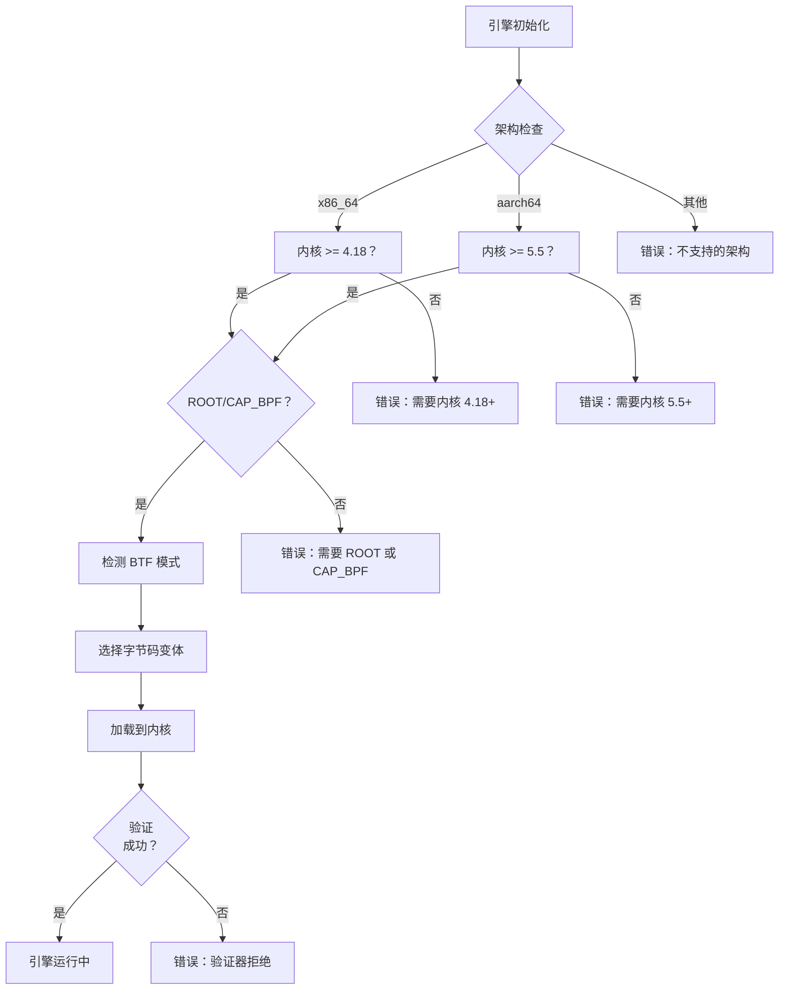

版本要求反映了 eBPF 功能的可用性：
- **4.18+**（x86_64）：BTF 支持，有界循环
- **5.5+**（aarch64）：ARM64 eBPF JIT 改进
- **5.8+**：环形缓冲区支持（自动检测，回退到 perf 数组）

来源：[README.md:14-16](https://github.com/gojue/ecapture/blob/ca085d05/README.md#L14-L16)、[README_CN.md:14-17](https://github.com/gojue/ecapture/blob/ca085d05/README_CN.md#L14-L17)、[CHANGELOG.md:41](https://github.com/gojue/ecapture/blob/ca085d05/CHANGELOG.md#L41)

## 与 ebpfmanager 的集成

虽然原始 eBPF 加载由 `cilium/ebpf` 处理，但引擎与更高级别的管理器集成以进行生命周期控制：

### 管理器职责

`ebpfmanager` 组件（在图表和日志中引用）提供：

1. **程序生命周期**：Init → Load → Attach → Run → Detach → Close
2. **多程序协调**：每个模块管理多个 eBPF 程序
3. **映射管理**：创建、填充和清理 eBPF 映射
4. **资源清理**：确保模块关闭时的正确拆卸

### 模块集成模式

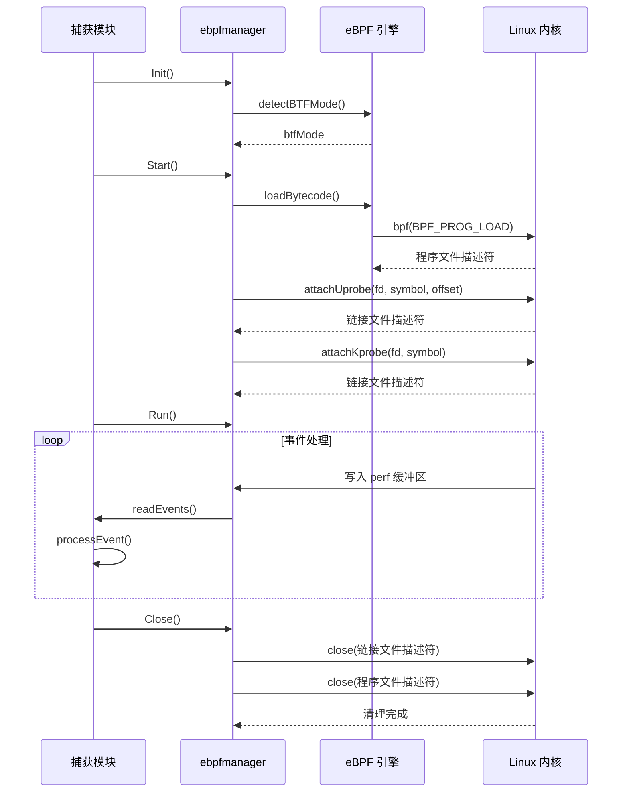

管理器抽象了低级 eBPF 操作，允许捕获模块专注于数据处理而不是内核交互细节。

来源：[README.md:91-102](https://github.com/gojue/ecapture/blob/ca085d05/README.md#L91-L102)、[CHANGELOG.md:462](https://github.com/gojue/ecapture/blob/ca085d05/CHANGELOG.md#L462)

## 性能考虑

eBPF 引擎设计用于高性能事件捕获，开销最小：

### 内存配置

**映射大小调优** ([CHANGELOG.md:709](https://github.com/gojue/ecapture/blob/ca085d05/CHANGELOG.md#L709))：
- 默认：5120 KB 总计（分布在每 CPU 缓冲区上）
- 通过 `--mapsize` 标志可配置
- 计算：`mapsize * PAGE_SIZE * num_CPUs`
- 影响：更大的映射减少事件丢失但增加内存使用

### 防止事件丢失

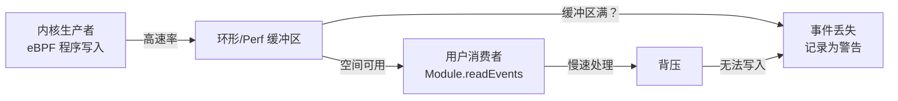

**缓解策略**：
1. 增加 `--mapsize` 以应对高吞吐量场景
2. 使用多个事件工作器进行并行处理
3. 在 eBPF 级别启用过滤（例如，PID 过滤器、pcap 过滤器）
4. 在用户空间批量处理事件

### eBPF 程序优化

**验证器友好的模式**：
- 有界循环（内核 5.3+）或展开的循环
- 栈大小 ≤ 512 字节
- 辅助函数调用限制
- 避免动态跳转

CO-RE 模式还受益于内核优化的重定位，避免了 eBPF 程序本身的手动偏移量计算。

来源：[CHANGELOG.md:709](https://github.com/gojue/ecapture/blob/ca085d05/CHANGELOG.md#L709)、[CHANGELOG.md:674](https://github.com/gojue/ecapture/blob/ca085d05/CHANGELOG.md#L674)、[Makefile:23-24](https://github.com/gojue/ecapture/blob/ca085d05/Makefile#L23-L24)