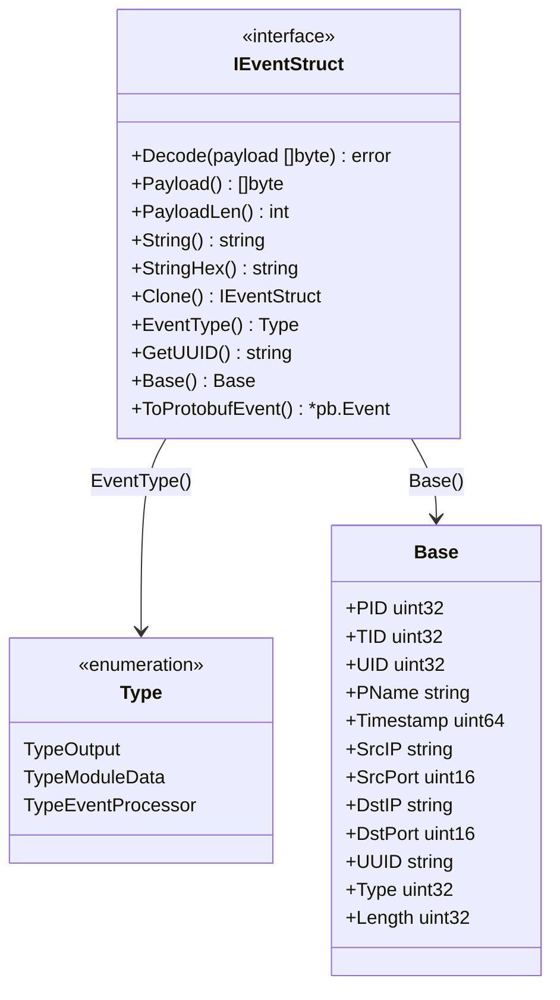
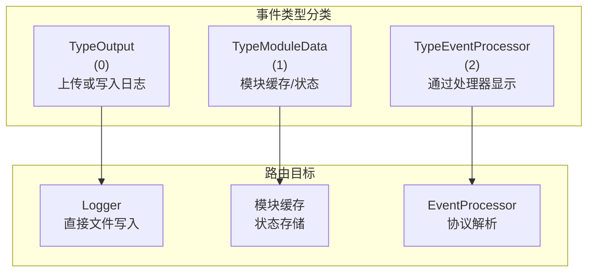
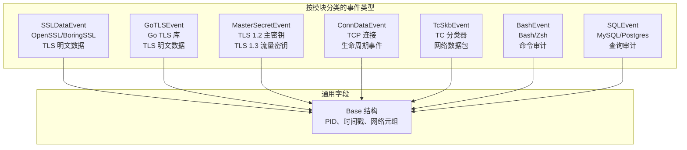
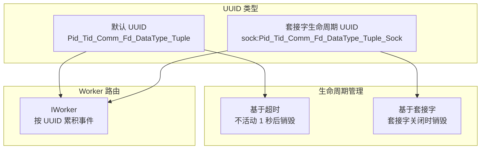
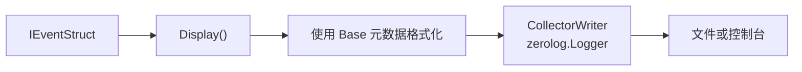
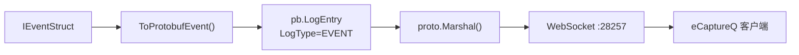
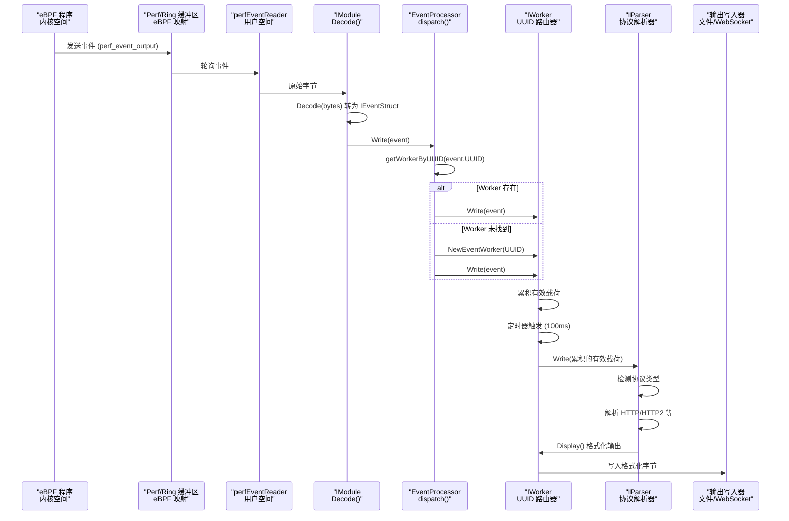
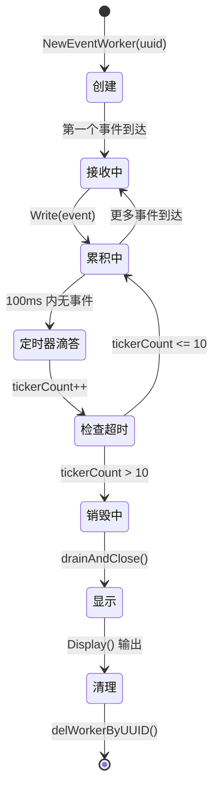
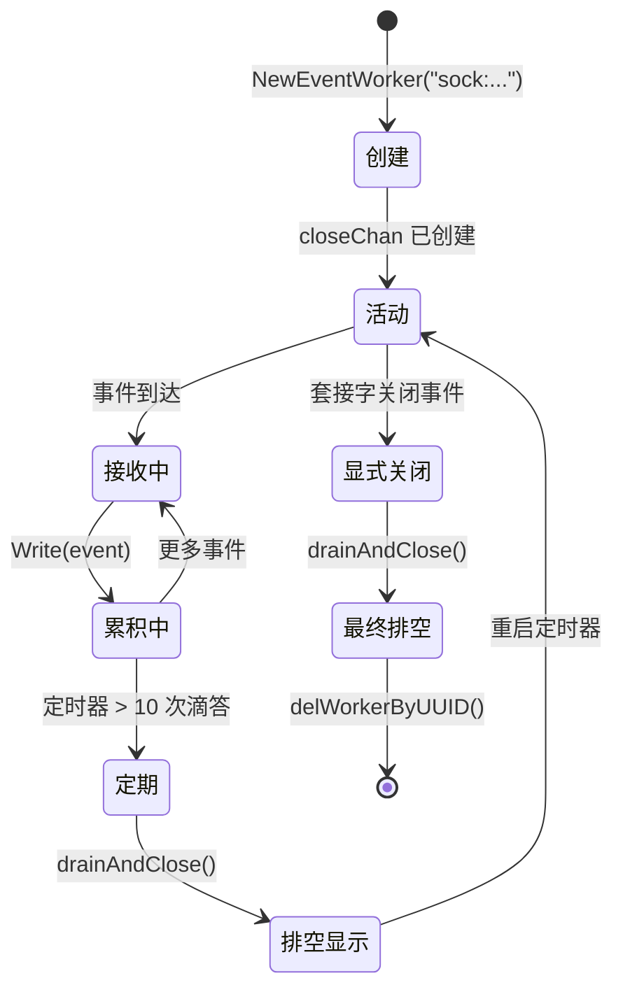

# 事件结构与类型

本页面文档化了 eCapture 中用于表示从 eBPF 程序捕获的数据的事件结构和类型。事件是从内核空间流经用户空间处理直到最终输出的基本数据单元。

有关事件创建后如何处理的信息，请参阅[事件处理流程](2.2-event-processing-pipeline.md)。有关特定输出格式的信息，请参阅[输出格式](../4-output-formats/index.md)。

---

## 概述

eCapture 使用统一的事件接口（`IEventStruct`）来表示所有捕获的数据，无论是 TLS 明文、连接元数据、主密钥还是网络数据包。每种事件类型都实现此接口，并携带特定领域的有效载荷数据以及通用元数据字段。

**核心概念：**

- **IEventStruct 接口**：所有事件类型的通用契约
- **Base 结构**：共享的元数据字段（PID、时间戳、网络元组）
- **事件类型**：用于路由和处理的分类
- **UUID 系统**：用于事件关联和 worker 路由的唯一标识符
- **序列化**：支持文本（zerolog）和二进制（protobuf）格式

来源：[user/event/ievent.go:1-71](https://github.com/gojue/ecapture/blob/ca085d05/user/event/ievent.go#L1-L71)

---

## IEventStruct 接口

eCapture 中的所有事件都实现了 `IEventStruct` 接口，该接口定义了事件处理、序列化和标识的契约。

### 接口定义



**IEventStruct 方法**

| 方法 | 用途 |
|--------|---------|
| `Decode(payload []byte)` | 将来自 eBPF 的原始字节解码为结构化事件 |
| `Payload()` | 返回实际数据有效载荷（例如，TLS 明文数据） |
| `PayloadLen()` | 有效载荷的字节长度 |
| `String()` | 人类可读的表示形式 |
| `StringHex()` | 十六进制转储表示形式 |
| `Clone()` | 创建事件的深拷贝 |
| `EventType()` | 返回路由类型（Output/ModuleData/EventProcessor） |
| `GetUUID()` | 返回用于事件关联的唯一标识符 |
| `Base()` | 返回通用元数据结构 |
| `ToProtobufEvent()` | 转换为 protobuf 用于 WebSocket 传输 |

来源：[user/event/ievent.go:41-52](https://github.com/gojue/ecapture/blob/ca085d05/user/event/ievent.go#L41-L52)

---

## 事件类型分类

事件根据其 `EventType()` 值进行分类，这决定了它们如何在系统中路由。



**类型常量：**

- **TypeOutput (0)**：用于立即输出到日志或服务器上传的事件
- **TypeModuleData (1)**：包含用于缓存的模块特定状态数据的事件
- **TypeEventProcessor (2)**：需要协议解析和格式化后再输出的事件

来源：[user/event/ievent.go:26-37](https://github.com/gojue/ecapture/blob/ca085d05/user/event/ievent.go#L26-L37)

---

## Base 事件结构

`Base` 结构包含所有事件共有的元数据，包括进程上下文、网络元组和时间信息。

### Base 字段

| 字段 | 类型 | 描述 |
|-------|------|-------------|
| `PID` | uint32 | 生成事件的进程 ID |
| `TID` | uint32 | 进程内的线程 ID |
| `UID` | uint32 | 进程的用户 ID |
| `PName` | string | 进程名称/命令 |
| `Timestamp` | uint64 | 事件时间戳（自启动以来的纳秒数） |
| `SrcIP` | string | 源 IP 地址 |
| `SrcPort` | uint16 | 源端口号 |
| `DstIP` | string | 目标 IP 地址 |
| `DstPort` | uint16 | 目标端口号 |
| `UUID` | string | 用于路由的唯一事件标识符 |
| `Type` | uint32 | 解析器类型（例如，HTTP 请求/响应） |
| `Length` | uint32 | 有效载荷字节长度 |

**网络元组：** `(SrcIP, SrcPort, DstIP, DstPort)` 的组合标识连接。结合 `PID` 和 `TID`，这为事件关联创建了唯一的上下文。

来源：[user/event/ievent.go:41-52](https://github.com/gojue/ecapture/blob/ca085d05/user/event/ievent.go#L41-L52), [pkg/event_processor/iworker.go:201-206](https://github.com/gojue/ecapture/blob/ca085d05/pkg/event_processor/iworker.go#L201-L206)

---

## 主要事件类型

eCapture 为不同的捕获场景使用多种具体的事件类型。每种类型都用特定领域的字段扩展基础结构。



### SSLDataEvent

从 OpenSSL/BoringSSL 的 `SSL_read()` 和 `SSL_write()` 函数捕获明文数据。

**关键字段：**
- Base 元数据（PID、时间戳、网络元组）
- `DataType`：读取（0）或写入（1）
- `Data`：明文有效载荷（每个事件最多 4KB）
- `Fd`：文件描述符编号
- `Version`：TLS 版本（1.2、1.3 等）

**使用上下文：** 由 OpenSSL 模块在钩住 `SSL_read`/`SSL_write` 返回探针时生成。具有相同 UUID 的事件由 worker 累积以进行协议解析。

来源：[pkg/event_processor/iworker.go:230-245](https://github.com/gojue/ecapture/blob/ca085d05/pkg/event_processor/iworker.go#L230-L245), [README.md:72-149](https://github.com/gojue/ecapture/blob/ca085d05/README.md#L72-L149)

### MasterSecretEvent

捕获用于离线解密的 TLS 加密密钥。

**TLS 1.2 字段：**
- `ClientRandom`：来自 ClientHello 的 32 字节随机值
- `MasterSecret`：48 字节主密钥

**TLS 1.3 字段：**
- `ClientRandom`：32 字节随机值
- 多个流量密钥（CLIENT_HANDSHAKE_TRAFFIC_SECRET、SERVER_HANDSHAKE_TRAFFIC_SECRET 等）

**使用上下文：** 在钩住 `SSL_do_handshake()` 时在 TLS 握手期间生成。以 SSLKEYLOGFILE 格式写入 keylog 文件，供 Wireshark/tshark 使用。

来源：[README.md:234-252](https://github.com/gojue/ecapture/blob/ca085d05/README.md#L234-L252), [CHANGELOG.md:135-137](https://github.com/gojue/ecapture/blob/ca085d05/CHANGELOG.md#L135-L137)

### ConnDataEvent

跟踪 TCP 连接生命周期（连接、接受、关闭）。

**关键字段：**
- Base 元数据
- `EventType`：连接/接受/关闭
- `Sock`：内核套接字指针
- 连接元组（源/目标 IP:端口）

**使用上下文：** 由 `tcp_connect()`、`tcp_sendmsg()` 和套接字销毁函数上的 kprobe 生成。用于构建 PID 到套接字的映射，以丰富 TC 数据包事件。

来源：高级架构图 3

### TcSkbEvent

从流量控制（TC）钩子捕获原始网络数据包。

**关键字段：**
- Base 元数据
- `Data`：原始数据包字节（以太网帧）
- 方向：出口或入口
- 来自连接跟踪的关联 PID

**使用上下文：** 由出口/入口路径上的 TC 分类器 eBPF 程序生成。需要通过 kprobe 进行连接跟踪以将数据包与进程关联。

来源：高级架构图 3

### BashEvent

审计 shell 命令输入/输出。

**关键字段：**
- Base 元数据（bash/zsh 进程的 PID）
- `Line`：命令行文本
- `RetVal`：命令退出代码

**使用上下文：** 由 bash/zsh 中 `readline()` 函数上的 uprobe 生成。用于主机安全审计。

来源：[README.md:40-41](https://github.com/gojue/ecapture/blob/ca085d05/README.md#L40-L41), [README.md:153-154](https://github.com/gojue/ecapture/blob/ca085d05/README.md#L153-L154)

### SQLEvent（MySQL/Postgres）

审计数据库查询。

**关键字段：**
- Base 元数据（mysqld/postgres 的 PID）
- `Query`：SQL 查询文本
- `QueryLen`：查询长度
- 数据库上下文（用户、数据库名称）

**使用上下文：** 由查询调度函数上的 uprobe 生成（MySQL 的 `dispatch_command()`，Postgres 的 `exec_simple_query()`）。

来源：[README.md:42](https://github.com/gojue/ecapture/blob/ca085d05/README.md#L42), [README.md:157-160](https://github.com/gojue/ecapture/blob/ca085d05/README.md#L157-L160)

---

## 事件 UUID 系统

每个事件都有一个 UUID 字符串，用于唯一标识其上下文并确定路由到事件 worker。UUID 格式因生命周期模型而异。

### UUID 格式



### 默认 UUID 格式

格式：`{PID}_{TID}_{ProcessName}_{Fd}_{DataType}_{Tuple}`

**示例：** `12345_12346_curl_5_1_192.168.1.100:443`

**组成部分：**
- PID：进程 ID
- TID：线程 ID
- ProcessName：命令名称
- Fd：文件描述符
- DataType：0（读取）或 1（写入）
- Tuple：目标 IP:端口

**生命周期：** 具有默认 UUID 的 worker 在 `MaxTickerCount * 100ms`（1 秒）不活动后自我销毁。

来源：[pkg/event_processor/iworker.go:100-123](https://github.com/gojue/ecapture/blob/ca085d05/pkg/event_processor/iworker.go#L100-L123)

### 套接字生命周期 UUID 格式

格式：`sock:{PID}_{TID}_{ProcessName}_{Fd}_{DataType}_{Tuple}_{Sock}`

**示例：** `sock:12345_12346_curl_5_1_192.168.1.100:443_0xffff888012340000`

**组成部分：**
- 前缀：`sock:`（常量 `SocketLifecycleUUIDPrefix`）
- 标准 UUID 字段
- Sock：内核套接字指针（uint64）

**生命周期：** 具有套接字 UUID 的 worker 持续存在，直到具有匹配 `Sock` 值的显式关闭事件到达。这可防止长连接过早销毁。

**UUID 解析逻辑：**
```
uuidOutput = 核心部分，不包含 "sock:" 前缀和尾随的 "_Sock"
DestroyUUID = 用于显式生命周期管理的 Sock 值
```

来源：[user/event/ievent.go:39](https://github.com/gojue/ecapture/blob/ca085d05/user/event/ievent.go#L39), [pkg/event_processor/iworker.go:100-123](https://github.com/gojue/ecapture/blob/ca085d05/pkg/event_processor/iworker.go#L100-L123)

---

## 事件序列化

事件支持两种序列化格式，具体取决于输出目标。

### 文本格式（CollectorWriter）

用于通过 zerolog 进行文件日志记录和控制台输出。



**格式：**
```
PID:{PID}, Comm:{ProcessName}, Src:{SrcIP}:{SrcPort}, Dest:{DstIP}:{DstPort},
{格式化的有效载荷}
```

**实现：** `CollectorWriter` 包装 `zerolog.Logger` 并将事件格式化为结构化日志条目。

来源：[user/event/ievent.go:54-71](https://github.com/gojue/ecapture/blob/ca085d05/user/event/ievent.go#L54-L71), [pkg/event_processor/iworker.go:198-212](https://github.com/gojue/ecapture/blob/ca085d05/pkg/event_processor/iworker.go#L198-L212)

### Protobuf 格式（ProtobufWriter）

用于 WebSocket 传输到 eCaptureQ 和其他消费者。



**结构：**
```protobuf
message LogEntry {
  LogType log_type = 1;  // LOG_TYPE_EVENT
  oneof payload {
    Event event_payload = 2;
  }
}

message Event {
  uint32 pid = 1;
  uint32 tid = 2;
  uint32 uid = 3;
  string comm = 4;
  uint64 timestamp = 5;
  string src_ip = 6;
  uint32 src_port = 7;
  string dst_ip = 8;
  uint32 dst_port = 9;
  string uuid = 10;
  uint32 type = 11;
  bytes payload = 12;
  uint32 length = 13;
}
```

**实现：** 每个 `IEventStruct` 实现 `ToProtobufEvent()` 以将其字段转换为 protobuf 模式。

来源：[pkg/event_processor/iworker.go:214-227](https://github.com/gojue/ecapture/blob/ca085d05/pkg/event_processor/iworker.go#L214-L227), [README.md:307-312](https://github.com/gojue/ecapture/blob/ca085d05/README.md#L307-L312)

---

## 事件在系统中的流动

事件从内核空间到最终输出经历多个处理阶段。



**关键阶段：**

1. **eBPF 发射**：eBPF 程序使用 `bpf_perf_event_output()` 或 ringbuf API 发送事件字节
2. **用户空间读取**：`perfEventReader`/`ringbufEventReader` 轮询并读取原始字节
3. **解码**：模块的 `Decode()` 方法将字节解组为 `IEventStruct`
4. **分发**：`EventProcessor.dispatch()` 按 UUID 路由到 worker
5. **累积**：Worker 缓冲多个事件片段
6. **解析**：超时或显式关闭后，worker 触发协议解析
7. **输出**：格式化数据写入日志或 WebSocket

来源：[pkg/event_processor/processor.go:65-109](https://github.com/gojue/ecapture/blob/ca085d05/pkg/event_processor/processor.go#L65-L109), [pkg/event_processor/iworker.go:262-306](https://github.com/gojue/ecapture/blob/ca085d05/pkg/event_processor/iworker.go#L262-L306), 高级架构图 5

---

## 事件 Worker 生命周期

Worker 根据其 UUID 前缀有两种不同的生命周期模型。

### 默认生命周期（基于超时）



**特征：**
- `closeChan` 为 nil
- 不活动 1 秒（10 * 100ms）后自我销毁
- 适用于短期连接或请求/响应对

来源：[pkg/event_processor/iworker.go:51-63](https://github.com/gojue/ecapture/blob/ca085d05/pkg/event_processor/iworker.go#L51-L63), [pkg/event_processor/iworker.go:262-306](https://github.com/gojue/ecapture/blob/ca085d05/pkg/event_processor/iworker.go#L262-L306)

### 套接字生命周期（显式关闭）



**特征：**
- 创建 `closeChan`，`DestroyUUID` 保存套接字指针
- 在空闲期间持续存在，仅通过显式关闭销毁
- 每 1 秒定期排空以输出累积的数据
- 适用于长连接（HTTP/2、WebSocket、流式传输）

**关闭触发：** 当 eBPF kprobe 检测到套接字关闭时，`EventProcessor.WriteDestroyConn(sock_addr)` 发送销毁信号。

来源：[pkg/event_processor/iworker.go:57-63](https://github.com/gojue/ecapture/blob/ca085d05/pkg/event_processor/iworker.go#L57-L63), [pkg/event_processor/iworker.go:100-123](https://github.com/gojue/ecapture/blob/ca085d05/pkg/event_processor/iworker.go#L100-L123), [pkg/event_processor/processor.go:115-128](https://github.com/gojue/ecapture/blob/ca085d05/pkg/event_processor/processor.go#L115-L128)

---

## 事件处理配置

事件处理行为可以通过 `EventProcessor` 参数进行配置。

### 配置选项

| 参数 | 类型 | 用途 |
|-----------|------|---------|
| `logger` | io.Writer | 输出目标（CollectorWriter 或 ProtobufWriter） |
| `isHex` | bool | 如果为 true，则以十六进制转储而非文本输出有效载荷 |
| `truncateSize` | uint64 | 每个 worker 的最大有效载荷大小（0 = 无限制） |

**截断行为：** 当 `truncateSize > 0` 时，worker 在达到限制后停止累积有效载荷，防止大型传输时的内存耗尽。

**十六进制模式：** 当 `isHex = true` 时，所有有效载荷数据在输出前转换为十六进制转储格式，对二进制协议很有用。

来源：[pkg/event_processor/processor.go:206-215](https://github.com/gojue/ecapture/blob/ca085d05/pkg/event_processor/processor.go#L206-L215), [pkg/event_processor/iworker.go:236-242](https://github.com/gojue/ecapture/blob/ca085d05/pkg/event_processor/iworker.go#L236-L242)

---

## 汇总表：事件类型与用途

| 事件类型 | 模块 | 有效载荷内容 | UUID 类型 | 主要用途 |
|------------|-----------|-----------------|-----------|------------------|
| SSLDataEvent | OpenSSL、BoringSSL | TLS 明文 | 两者 | 捕获 HTTPS 流量 |
| GoTLSEvent | GoTLS | TLS 明文 | 默认 | 捕获 Go TLS 流量 |
| MasterSecretEvent | 所有 TLS 模块 | TLS 密钥 | N/A（直接输出） | Keylog 模式、离线解密 |
| ConnDataEvent | 所有 TLS 模块 | 连接元数据 | 套接字 | 跟踪连接生命周期 |
| TcSkbEvent | TC 模块 | 原始数据包 | 默认 | 数据包捕获模式 |
| BashEvent | Bash、Zsh | 命令文本 | 默认 | 命令审计 |
| SQLEvent | MySQL、Postgres | SQL 查询 | 默认 | 数据库审计 |

---

本页面记录了 eCapture 中的事件结构、类型和生命周期管理。有关如何解析和格式化这些事件的详细信息，请参阅[协议解析](2.8-protocol-parsing.md)。有关输出格式规范，请参阅[输出格式](../4-output-formats/index.md)。