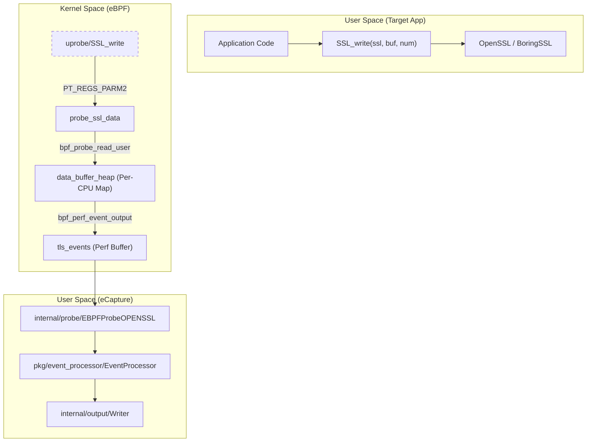
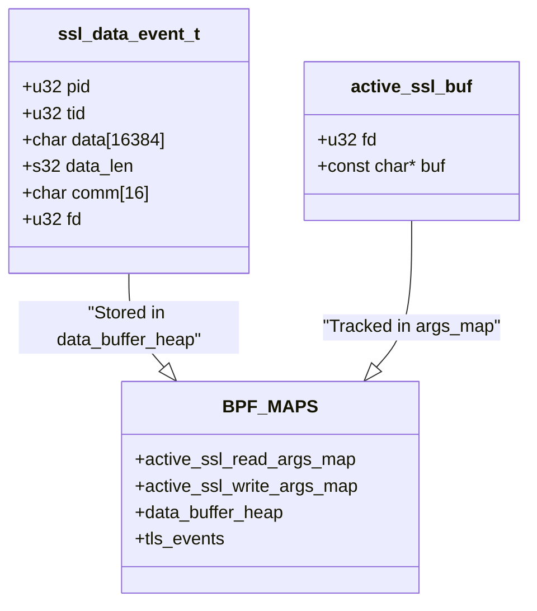

# Introduction and Core Capabilities

Relevant source files

The following files were used as context for generating this wiki page:

- [CHANGELOG.md](https://github.com/gojue/ecapture/blob/943a19fe/CHANGELOG.md)
- [README.md](https://github.com/gojue/ecapture/blob/943a19fe/README.md)
- [kern/boringssl_masterkey.h](https://github.com/gojue/ecapture/blob/943a19fe/kern/boringssl_masterkey.h)
- [kern/common.h](https://github.com/gojue/ecapture/blob/943a19fe/kern/common.h)
- [kern/ecapture.h](https://github.com/gojue/ecapture/blob/943a19fe/kern/ecapture.h)
- [kern/openssl.h](https://github.com/gojue/ecapture/blob/943a19fe/kern/openssl.h)
- [kern/openssl_masterkey.h](https://github.com/gojue/ecapture/blob/943a19fe/kern/openssl_masterkey.h)
- [kern/openssl_masterkey_3.0.h](https://github.com/gojue/ecapture/blob/943a19fe/kern/openssl_masterkey_3.0.h)
- [kern/tc.h](https://github.com/gojue/ecapture/blob/943a19fe/kern/tc.h)
- [main.go](https://github.com/gojue/ecapture/blob/943a19fe/main.go)

eCapture (旁观者) is a multi-purpose observability tool powered by eBPF that captures plaintext traffic and system events without requiring SSL/TLS CA certificates or proxy configuration [README.md:10-10](https://github.com/gojue/ecapture/blob/943a19fe/README.md#L10-L10). By hooking directly into user-space libraries and kernel functions, eCapture provides deep visibility into encrypted communications, database queries, and administrative shell activity with minimal overhead.

## Core Capabilities

eCapture is built around three primary functional pillars, implemented as specialized modules that leverage `uprobes` (user-space probes) and `TC` (Traffic Control) classifiers [README.md:95-103](https://github.com/gojue/ecapture/blob/943a19fe/README.md#L95-L103).

### 1. TLS/SSL Plaintext Capture
The flagship capability of eCapture is the ability to intercept plaintext data from encrypted streams. Unlike traditional tools (e.g., mitmproxy) that require installing a Root CA certificate to perform a Man-in-the-Middle (MitM) attack, eCapture hooks the encryption libraries directly [README.md:38-39](https://github.com/gojue/ecapture/blob/943a19fe/README.md#L38-L39).

*   **Library Support**: Supports OpenSSL (1.0.x, 1.1.x, 3.0.x), BoringSSL, LibreSSL, GnuTLS, NSPR (NSS), and Go's native `crypto/tls` [README.md:95-103](https://github.com/gojue/ecapture/blob/943a19fe/README.md#L95-L103).
*   **Mechanism**: It attaches `uprobes` to functions like `SSL_read` and `SSL_write` [kern/openssl.h:163-165](https://github.com/gojue/ecapture/blob/943a19fe/kern/openssl.h#L163-L165). It captures the data buffer before encryption (on write) or after decryption (on read).
*   **Traffic Types**: Supports HTTP/1.1, HTTP/2 (HPACK), and even HTTP/3 (QUIC) via BoringSSL hooks [README.md:122-123](https://github.com/gojue/ecapture/blob/943a19fe/README.md#L122-L123).

### 2. Database SQL Auditing
eCapture provides transparent auditing of database queries by hooking the client-side or server-side dispatch functions. This allows security teams to monitor database activity without enabling heavy logging on the database server itself.

*   **MySQL**: Hooks `dispatch_command` to capture `COM_QUERY` (0x03) packets [kern/common.h:47-47](https://github.com/gojue/ecapture/blob/943a19fe/kern/common.h#L47-L47). Supports MySQL 5.6, 5.7, 8.0, and MariaDB [README.md:42-42](https://github.com/gojue/ecapture/blob/943a19fe/README.md#L42-L42).
*   **PostgreSQL**: Hooks `exec_simple_query` to capture SQL statements in Postgres 10+ [README.md:102-102](https://github.com/gojue/ecapture/blob/943a19fe/README.md#L102-L102).

### 3. Shell Command Auditing
For host security and compliance, eCapture monitors interactive shell sessions.
*   **Bash & Zsh**: Hooks the `readline` function to capture commands as they are entered by the user [README.md:96-97](https://github.com/gojue/ecapture/blob/943a19fe/README.md#L96-L97).
*   **Metadata**: Captures the command string along with the PID, UID, and timestamp [kern/common.h:53-56](https://github.com/gojue/ecapture/blob/943a19fe/kern/common.h#L53-L56).

---

## Comparison with Traditional Tools

| Feature | tcpdump / Wireshark | mitmproxy / Fiddler | eCapture |
| :--- | :--- | :--- | :--- |
| **Encryption** | Sees only encrypted blobs | Requires CA Cert / MitM | **Sees Plaintext** |
| **CA Certificate** | Not required | **Required** | **Not Required** |
| **Protocol Support** | Any (but encrypted) | HTTP/HTTPS only | HTTP, SQL, Shell |
| **Deployment** | Passive | Active Proxy | **Passive (eBPF)** |
| **Performance** | High | Low (Proxy Latency) | **High (Kernel-level)** |

---

## Technical Architecture & Data Flow

The following diagram illustrates how eCapture bridges the gap between the application's user-space memory and the userspace control plane using eBPF maps.

### Data Path: From Hook to Output
Title: eCapture TLS Data Extraction Flow

**Sources:** [kern/openssl.h:84-84](https://github.com/gojue/ecapture/blob/943a19fe/kern/openssl.h#L84-L84), [kern/openssl.h:113-118](https://github.com/gojue/ecapture/blob/943a19fe/kern/openssl.h#L113-L118), [kern/openssl.h:163-190](https://github.com/gojue/ecapture/blob/943a19fe/kern/openssl.h#L163-L190), [README.md:106-113](https://github.com/gojue/ecapture/blob/943a19fe/README.md#L106-L113)

---

## Implementation Detail: The OpenSSL Probe

The OpenSSL probe is a representative example of eCapture's core capability. It uses a `perf_event_array` called `tls_events` to stream data to userspace [kern/openssl.h:79-84](https://github.com/gojue/ecapture/blob/943a19fe/kern/openssl.h#L79-L84).

Title: OpenSSL Probe Code Entities

**Sources:** [kern/openssl.h:28-39](https://github.com/gojue/ecapture/blob/943a19fe/kern/openssl.h#L28-L39), [kern/openssl.h:57-67](https://github.com/gojue/ecapture/blob/943a19fe/kern/openssl.h#L57-L67), [kern/openssl.h:97-118](https://github.com/gojue/ecapture/blob/943a19fe/kern/openssl.h#L97-L118)

### Key Functions
*   **`probe_ssl_master_key`**: Extracts TLS session keys for the `keylog` output mode, allowing Wireshark to decrypt standard PCAPs [kern/openssl_masterkey.h:25-35](https://github.com/gojue/ecapture/blob/943a19fe/kern/openssl_masterkey.h#L25-L35).
*   **`process_SSL_data`**: The core logic that reads user-space buffers into the `ssl_data_event_t` struct and sends them to the perf buffer [kern/openssl.h:163-190](https://github.com/gojue/ecapture/blob/943a19fe/kern/openssl.h#L163-L190).
*   **`passes_filter`**: Implements global filtering by PID, UID, and CGroup ID to reduce noise [kern/ecapture.h:127-146](https://github.com/gojue/ecapture/blob/943a19fe/kern/ecapture.h#L127-L146).

---

## Typical Use Cases

1.  **Security Auditing & Incident Response**:
    *   Monitor suspicious outbound HTTPS traffic without breaking end-to-end encryption.
    *   Audit administrative shell commands in real-time for compliance [README.md:40-41](https://github.com/gojue/ecapture/blob/943a19fe/README.md#L40-L41).
2.  **Traffic Analysis & Debugging**:
    *   Debug microservices communication where certificates are managed by a service mesh (e.g., Istio, Linkerd).
    *   Analyze HTTP/2 or HTTP/3 traffic in environments where proxying is difficult [README.md:122-123](https://github.com/gojue/ecapture/blob/943a19fe/README.md#L122-L123).
3.  **Database Monitoring**:
    *   Capture SQL queries for performance tuning or data leak prevention without modifying application code or database configuration [README.md:42-42](https://github.com/gojue/ecapture/blob/943a19fe/README.md#L42-L42).
4.  **Malware Analysis**:
    *   Observe the plaintext C2 (Command & Control) communications of malware that uses hardcoded OpenSSL or BoringSSL libraries.

**Sources:**
*   [README.md:36-43](https://github.com/gojue/ecapture/blob/943a19fe/README.md#L36-L43)
*   [README.md:94-103](https://github.com/gojue/ecapture/blob/943a19fe/README.md#L94-L103)
*   [kern/openssl.h:28-39](https://github.com/gojue/ecapture/blob/943a19fe/kern/openssl.h#L28-L39)
*   [kern/openssl.h:163-190](https://github.com/gojue/ecapture/blob/943a19fe/kern/openssl.h#L163-L190)
*   [kern/ecapture.h:127-146](https://github.com/gojue/ecapture/blob/943a19fe/kern/ecapture.h#L127-L146)
*   [kern/common.h:47-47](https://github.com/gojue/ecapture/blob/943a19fe/kern/common.h#L47-L47)