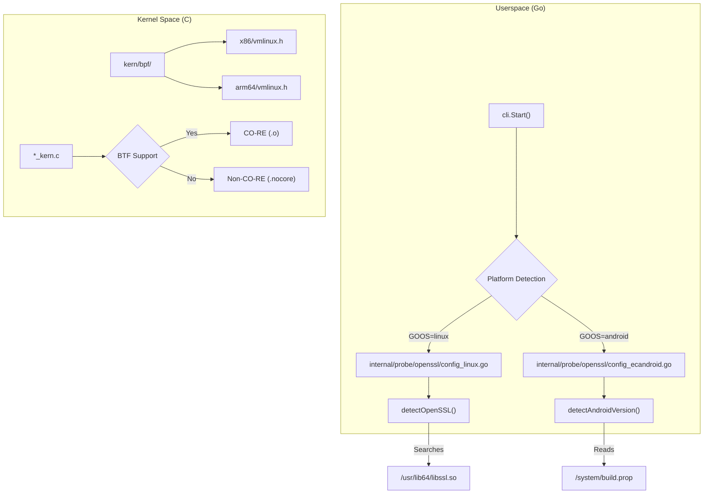
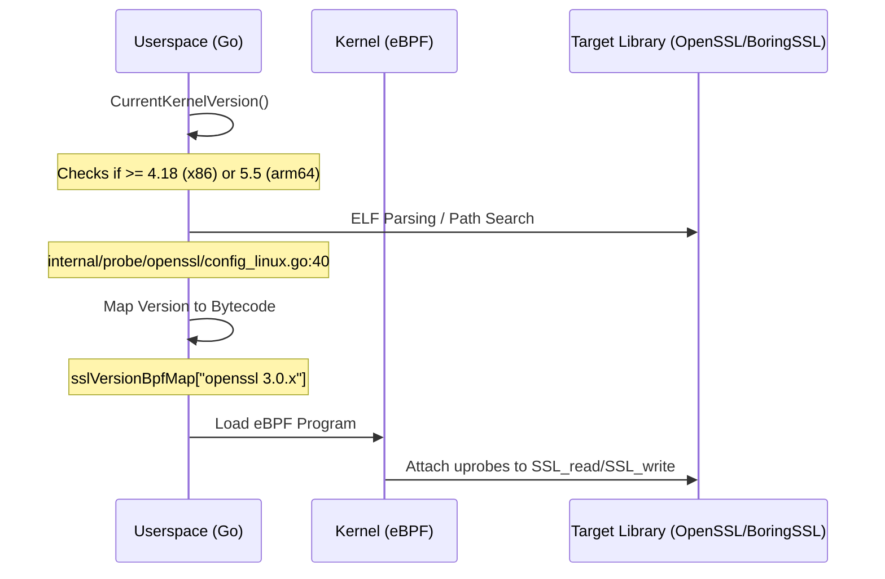

# Supported Platforms and Versions

Relevant source files

The following files were used as context for generating this wiki page:

- [.github/agents/pr-agent.md](https://github.com/gojue/ecapture/blob/943a19fe/.github/agents/pr-agent.md)
- [CHANGELOG.md](https://github.com/gojue/ecapture/blob/943a19fe/CHANGELOG.md)
- [README.md](https://github.com/gojue/ecapture/blob/943a19fe/README.md)
- [builder/Dockerfile](https://github.com/gojue/ecapture/blob/943a19fe/builder/Dockerfile)
- [builder/init_env.sh](https://github.com/gojue/ecapture/blob/943a19fe/builder/init_env.sh)
- [functions.mk](https://github.com/gojue/ecapture/blob/943a19fe/functions.mk)
- [internal/probe/gotls/config_iface.go](https://github.com/gojue/ecapture/blob/943a19fe/internal/probe/gotls/config_iface.go)
- [internal/probe/gotls/config_iface_test.go](https://github.com/gojue/ecapture/blob/943a19fe/internal/probe/gotls/config_iface_test.go)
- [internal/probe/openssl/config_ecandroid.go](https://github.com/gojue/ecapture/blob/943a19fe/internal/probe/openssl/config_ecandroid.go)
- [internal/probe/openssl/config_iface.go](https://github.com/gojue/ecapture/blob/943a19fe/internal/probe/openssl/config_iface.go)
- [internal/probe/openssl/config_iface_test.go](https://github.com/gojue/ecapture/blob/943a19fe/internal/probe/openssl/config_iface_test.go)
- [internal/probe/openssl/config_linux.go](https://github.com/gojue/ecapture/blob/943a19fe/internal/probe/openssl/config_linux.go)
- [main.go](https://github.com/gojue/ecapture/blob/943a19fe/main.go)
- [pkg/util/kernel/kernel_version.go](https://github.com/gojue/ecapture/blob/943a19fe/pkg/util/kernel/kernel_version.go)
- [pkg/util/kernel/kernel_version_unsupport.go](https://github.com/gojue/ecapture/blob/943a19fe/pkg/util/kernel/kernel_version_unsupport.go)
- [pkg/util/kernel/version.go](https://github.com/gojue/ecapture/blob/943a19fe/pkg/util/kernel/version.go)
- [test/e2e/android/android_tls_e2e_test.sh](https://github.com/gojue/ecapture/blob/943a19fe/test/e2e/android/android_tls_e2e_test.sh)
- [variables.mk](https://github.com/gojue/ecapture/blob/943a19fe/variables.mk)

eCapture is designed for modern Linux environments, leveraging eBPF (Extended Berkeley Packet Filter) to intercept plaintext traffic. Because eBPF features are tightly coupled with the Linux kernel, support is determined primarily by kernel version and architecture rather than specific distribution names.

## OS and Architecture Support

eCapture supports the following operating systems and CPU architectures. It specifically does **not** support Windows or macOS, as these systems lack the standard Linux eBPF subsystem.

| Operating System | Architecture | Minimum Kernel Version | Notes |
| :--- | :--- | :--- | :--- |
| **Linux** | x86_64 (amd64) | 4.18+ | Standard server/desktop environments. |
| **Linux** | aarch64 (arm64) | 5.5+ | AWS Graviton, Raspberry Pi, etc. |
| **Android** | aarch64 (GKI) | 5.5+ | Requires GKI (Generic Kernel Image). |

### Platform Verification List
The following distributions are regularly verified via CI or manual testing:
* **Ubuntu**: 20.04, 22.04, 24.04 [builder/init_env.sh:18-35](https://github.com/gojue/ecapture/blob/943a19fe/builder/init_env.sh#L18-L35)
* **CentOS / RHEL**: 8.x and above (Kernels 4.18+)
* **Debian**: 10 and above
* **Android**: Android 13, 14, 15, and 16 (BoringSSL specific hooks) [variables.mk:190-193](https://github.com/gojue/ecapture/blob/943a19fe/variables.mk#L190-L193)

## Architecture and Code Mapping

The following diagram illustrates how platform-specific logic is branched within the Go userspace and the eBPF kernel space.

### Platform Logic Dispatch
Title: Platform-Specific Entity Mapping

Sources: [internal/probe/openssl/config_linux.go:40-75](https://github.com/gojue/ecapture/blob/943a19fe/internal/probe/openssl/config_linux.go#L40-L75), [internal/probe/openssl/config_ecandroid.go:89-105](https://github.com/gojue/ecapture/blob/943a19fe/internal/probe/openssl/config_ecandroid.go#L89-L105), [variables.mk:147-166](https://github.com/gojue/ecapture/blob/943a19fe/variables.mk#L147-L166)

## CO-RE vs. Non-CO-RE Modes

eCapture provides two runtime modes to handle kernel compatibility:

1.  **CO-RE (Compile Once – Run Everywhere)**:
    *   **Requirement**: Kernel must be compiled with `CONFIG_DEBUG_INFO_BTF=y`.
    *   **Mechanism**: Uses BPF Type Format (BTF) to relocate struct offsets at load time.
    *   **Binary**: Uses the standard `.o` files embedded in the binary.
2.  **Non-CO-RE**:
    *   **Requirement**: Used when BTF is unavailable (common in older 4.18+ kernels).
    *   **Mechanism**: Compiles/links specifically for the target kernel's headers.
    *   **Binary**: Uses `.nocore` variants generated during the build process [variables.mk:233](https://github.com/gojue/ecapture/blob/943a19fe/variables.mk#L233).

## Feature Differences by Platform

While core TLS capture works across all supported platforms, certain advanced features are restricted by kernel version or OS variant.

### Kernel Feature Gates
* **PID/UID Filtering**: Requires Kernel >= 5.2. On older kernels, these filters are silently ignored with a warning [CHANGELOG.md:7](https://github.com/gojue/ecapture/blob/943a19fe/CHANGELOG.md#L7).
* **Cgroup Filtering**: Supported on Linux for `tls` and `gotls` probes but explicitly disabled/unsupported on Android [internal/probe/openssl/config_ecandroid.go:133-136](https://github.com/gojue/ecapture/blob/943a19fe/internal/probe/openssl/config_ecandroid.go#L133-L136).
* **Network Interfaces**: On Linux, interface detection is often automatic. On Android, eCapture specifically probes `wlan0` or searches for active non-loopback interfaces like `eth0` [internal/probe/openssl/config_ecandroid.go:107-131](https://github.com/gojue/ecapture/blob/943a19fe/internal/probe/openssl/config_ecandroid.go#L107-L131).

### Probe Availability
| Probe | Linux x86_64 | Linux arm64 | Android arm64 |
| :--- | :---: | :---: | :---: |
| TLS (OpenSSL/BoringSSL) | Yes | Yes | Yes |
| GoTLS | Yes | Yes | Yes |
| Bash/Zsh Audit | Yes | Yes | Bash Only |
| MySQL / Postgres | Yes | Yes | No |
| GnuTLS / NSPR | Yes | Yes | No |

Sources: [variables.mk:215-227](https://github.com/gojue/ecapture/blob/943a19fe/variables.mk#L215-L227), [README.md:12-16](https://github.com/gojue/ecapture/blob/943a19fe/README.md#L12-L16), [CHANGELOG.md:20](https://github.com/gojue/ecapture/blob/943a19fe/CHANGELOG.md#L20)

## Implementation Details: Version Detection

eCapture performs runtime environment checks to select the correct eBPF bytecode.

### Kernel Version Check
The `pkg/util/kernel` package parses `/proc/version_signature` (Ubuntu), `/proc/version` (Debian), or `uname` to determine the `LINUX_VERSION_CODE` [pkg/util/kernel/kernel_version.go:113-131](https://github.com/gojue/ecapture/blob/943a19fe/pkg/util/kernel/kernel_version.go#L113-L131).

### Android BoringSSL Detection
On Android, eCapture reads `/system/build.prop` to identify the OS version (e.g., `ro.build.version.release=13`) and maps it to a specific BoringSSL hook implementation like `boringssl_a_13` [internal/probe/openssl/config_ecandroid.go:77-80](https://github.com/gojue/ecapture/blob/943a19fe/internal/probe/openssl/config_ecandroid.go#L77-L80).

### Code Entity Flow
Title: Kernel and Library Version Mapping

Sources: [pkg/util/kernel/kernel_version.go:113-131](https://github.com/gojue/ecapture/blob/943a19fe/pkg/util/kernel/kernel_version.go#L113-L131), [internal/probe/openssl/config_linux.go:40-75](https://github.com/gojue/ecapture/blob/943a19fe/internal/probe/openssl/config_linux.go#L40-L75), [.github/agents/pr-agent.md:115-118](https://github.com/gojue/ecapture/blob/943a19fe/.github/agents/pr-agent.md#L115-L118)