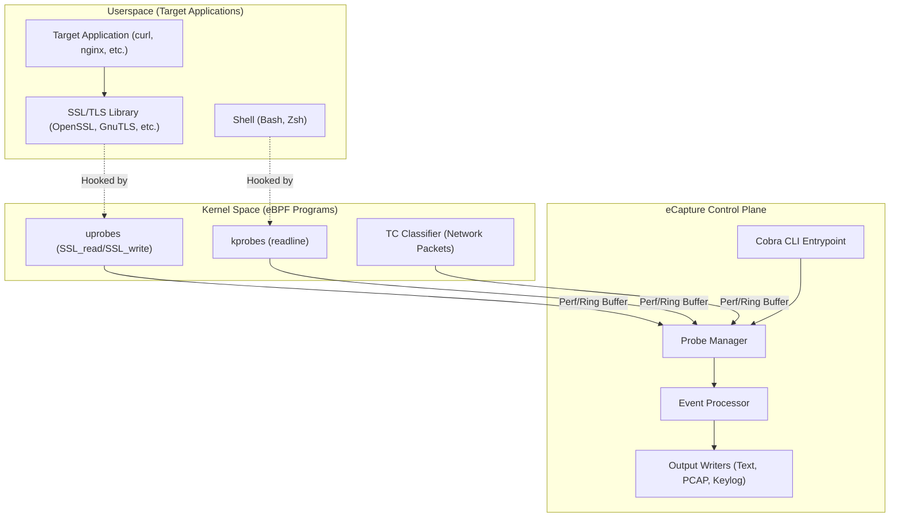
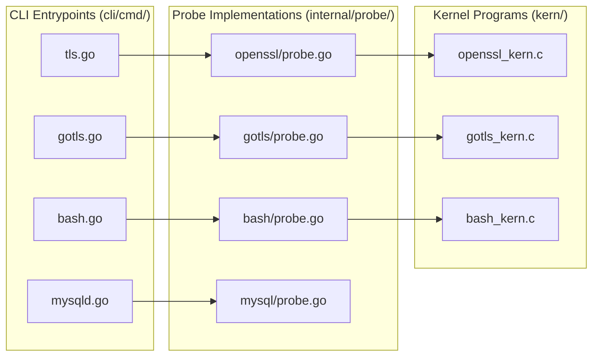

# Introducing eCapture

Relevant source files

The following files were used as context for generating this wiki page:

- [CHANGELOG.md](https://github.com/gojue/ecapture/blob/943a19fe/CHANGELOG.md)
- [README.md](https://github.com/gojue/ecapture/blob/943a19fe/README.md)
- [images/ecapture-architecture.png](images/ecapture-architecture.png)
- [images/ecapture-logo-400x400.png](images/ecapture-logo-400x400.png)
- [images/ecapture-user-manual.png](images/ecapture-user-manual.png)
- [images/how-ecapture-works.png](images/how-ecapture-works.png)
- [main.go](https://github.com/gojue/ecapture/blob/943a19fe/main.go)

eCapture (旁观者) is a powerful, eBPF-based tool designed to capture plaintext content from SSL/TLS-encrypted traffic, audit shell commands, and monitor database queries without requiring CA certificates or invasive traffic interception. 

By leveraging the Linux kernel's eBPF (Extended Berkeley Packet Filter) technology, eCapture hooks directly into userspace libraries and kernel functions to extract data before encryption or after decryption. This makes it an invaluable tool for security audits, troubleshooting, and compliance monitoring in environments where traditional MITM (Man-in-the-Middle) proxies are impractical.

### High-Level Workflow
eCapture operates by attaching `uprobes` to specific function symbols in common libraries (like OpenSSL or BoringSSL) and `kprobes` or `TC` (Traffic Control) classifiers for network-level events.

**Sources:** [main.go:1-12](https://github.com/gojue/ecapture/blob/943a19fe/main.go#L1-L12), [README.md:36-45](https://github.com/gojue/ecapture/blob/943a19fe/README.md#L36-L45), [README.md:95-104](https://github.com/gojue/ecapture/blob/943a19fe/README.md#L95-L104)

---

### Navigation Index

#### [Introduction and Core Capabilities](1.1-introduction-and-core-capabilities.md)
Learn about the technical foundations of eCapture. This section covers the primary use cases:
*   **TLS Plaintext Capture:** Extracting traffic from OpenSSL, BoringSSL, GnuTLS, and NSPR without CA certificates.
*   **GoTLS Support:** Specialized support for Go's native `crypto/tls` implementation.
*   **Software Auditing:** Capturing Bash/Zsh commands and MySQL/PostgreSQL queries.
*   **Comparison:** How eCapture differs from `tcpdump` and `mitmproxy`.

For details, see [Introduction and Core Capabilities](1.1-introduction-and-core-capabilities.md).

#### [Supported Platforms and Versions](1.2-supported-platforms-and-versions.md)
Check if your environment is compatible with eCapture. This section details:
*   **OS Support:** Linux x86_64 (Kernel >= 4.18) and aarch64 (Kernel >= 5.5).
*   **Android Support:** Compatibility with Android GKI (Generic Kernel Image) kernels.
*   **Runtime Modes:** The difference between **CO-RE** (Compile Once – Run Everywhere) using BTF and non-CO-RE legacy modes.

For details, see [Supported Platforms and Versions](1.2-supported-platforms-and-versions.md).

---

### Core Components Mapping

The following diagram bridges the high-level capabilities to the specific code entities that implement them.

| Capability | CLI Command | Probe Logic | eBPF Source |
| :--- | :--- | :--- | :--- |
| **OpenSSL/TLS** | `ecapture tls` | `internal/probe/openssl` | `kern/openssl_kern.c` |
| **Go TLS** | `ecapture gotls` | `internal/probe/gotls` | `kern/gotls_kern.c` |
| **Bash Audit** | `ecapture bash` | `internal/probe/bash` | `kern/bash_kern.c` |
| **MySQL Audit** | `ecapture mysqld` | `internal/probe/mysql` | `kern/mysql_kern.c` |

**Sources:** [README.md:95-104](https://github.com/gojue/ecapture/blob/943a19fe/README.md#L95-L104), [CHANGELOG.md:97-113](https://github.com/gojue/ecapture/blob/943a19fe/CHANGELOG.md#L97-L113), [main.go:1-12](https://github.com/gojue/ecapture/blob/943a19fe/main.go#L1-L12)

---

### Quick Summary of Output Modes
eCapture provides three primary ways to consume captured data:
1.  **Text Mode:** Plaintext printed to `stdout` or saved to a file.
2.  **Pcap/Pcapng Mode:** Generates Wireshark-compatible files containing decrypted traffic.
3.  **Keylog Mode:** Saves TLS Master Secrets in NSS Key Log format for use with external packet captures.

**Sources:** [README.md:114-153](https://github.com/gojue/ecapture/blob/943a19fe/README.md#L114-L153)