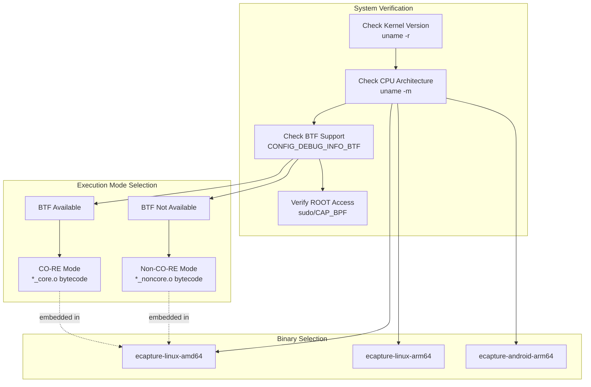
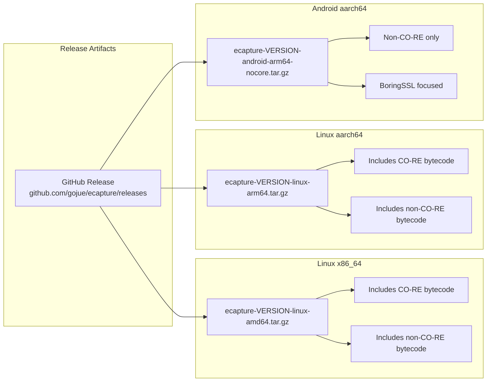
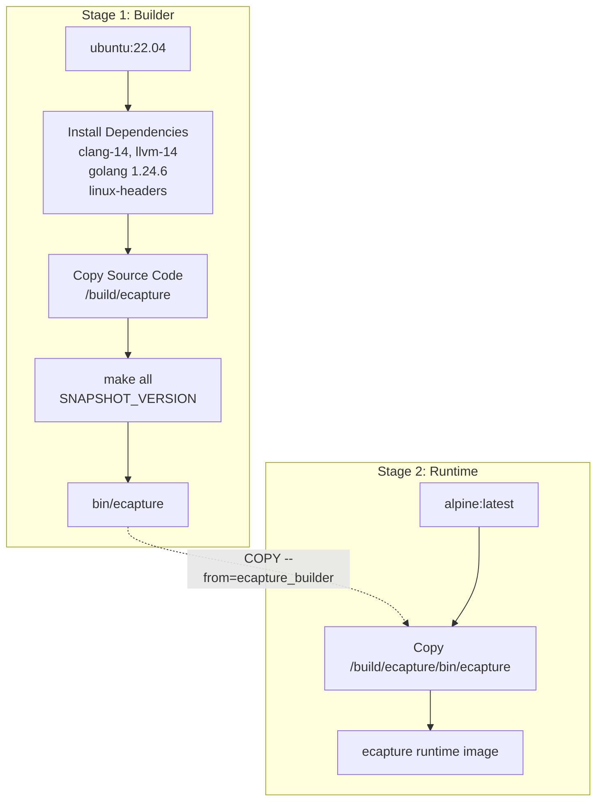
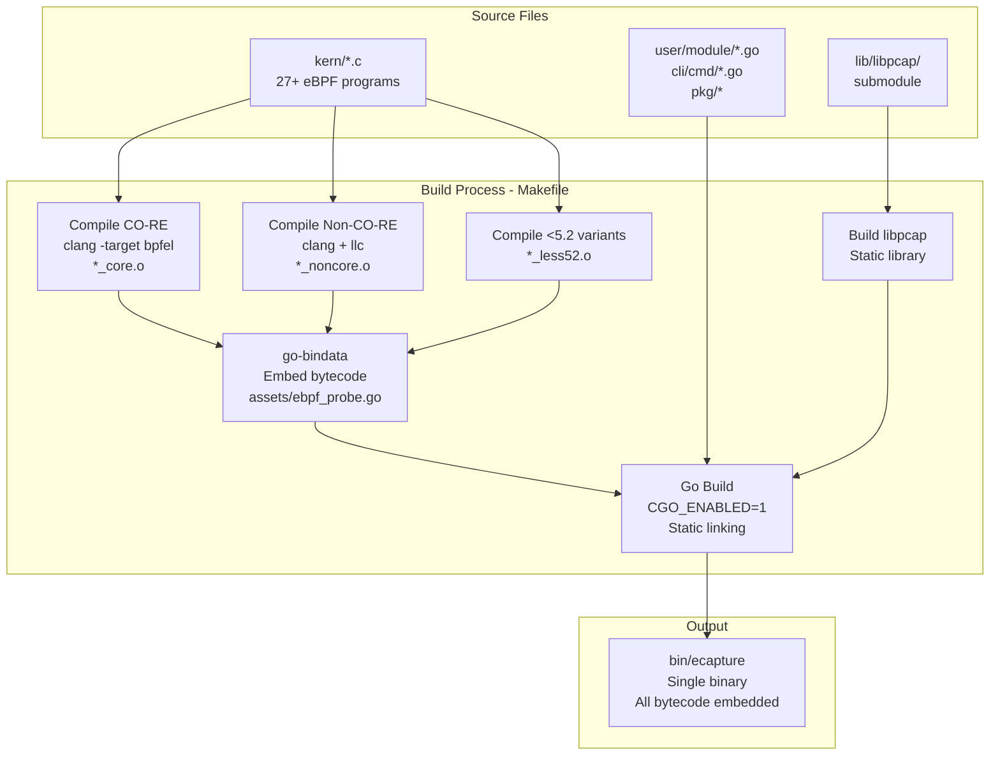
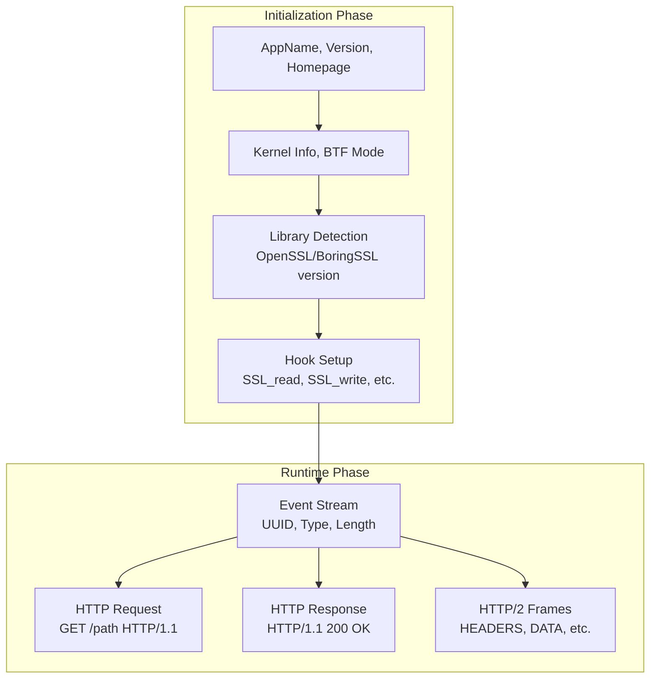
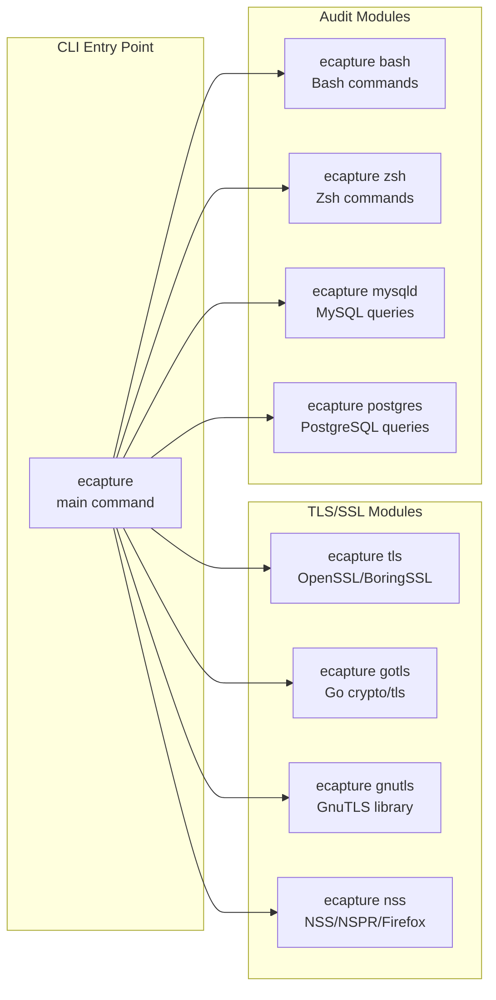
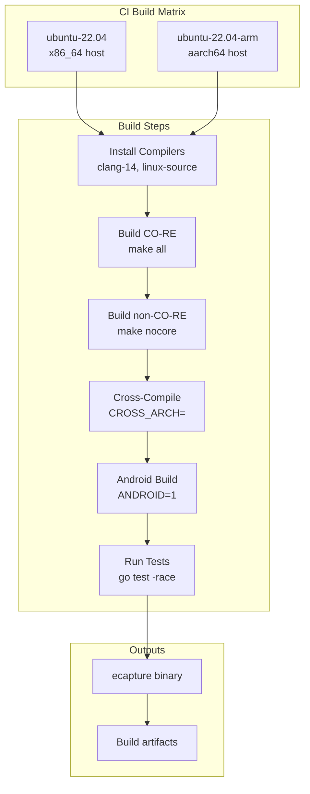

# Installation and Quick Start

<details>
<summary>Relevant source files</summary>

The following files were used as context for generating this wiki page:

- [.github/workflows/codeql-analysis.yml](https://github.com/gojue/ecapture/blob/0766a93b/.github/workflows/codeql-analysis.yml)
- [.github/workflows/go-c-cpp.yml](https://github.com/gojue/ecapture/blob/0766a93b/.github/workflows/go-c-cpp.yml)
- [.github/workflows/release.yml](https://github.com/gojue/ecapture/blob/0766a93b/.github/workflows/release.yml)
- [CHANGELOG.md](https://github.com/gojue/ecapture/blob/0766a93b/CHANGELOG.md)
- [Makefile](https://github.com/gojue/ecapture/blob/0766a93b/Makefile)
- [README.md](https://github.com/gojue/ecapture/blob/0766a93b/README.md)
- [README_CN.md](https://github.com/gojue/ecapture/blob/0766a93b/README_CN.md)
- [builder/Dockerfile](https://github.com/gojue/ecapture/blob/0766a93b/builder/Dockerfile)
- [builder/Makefile.release](https://github.com/gojue/ecapture/blob/0766a93b/builder/Makefile.release)
- [builder/init_env.sh](https://github.com/gojue/ecapture/blob/0766a93b/builder/init_env.sh)
- [functions.mk](https://github.com/gojue/ecapture/blob/0766a93b/functions.mk)
- [images/ecapture-help-v0.8.9.svg](https://github.com/gojue/ecapture/blob/0766a93b/images/ecapture-help-v0.8.9.svg)
- [main.go](https://github.com/gojue/ecapture/blob/0766a93b/main.go)

</details>


This page provides instructions for installing eCapture and running your first capture. It covers system requirements, installation methods (binary download, Docker, source compilation), and basic usage examples to get started capturing SSL/TLS plaintext traffic.

For detailed information about compilation options and customization, see [Compilation](../5-development-guide/5.1-build-system.md). For comprehensive CLI documentation, see [Command Line Interface](1.2-command-line-interface.md). For understanding the underlying architecture, see [Architecture](../2-architecture/index.md).

---

## System Requirements

eCapture has specific kernel and architecture requirements due to its eBPF-based implementation:

### Kernel Version Requirements

| Architecture | Minimum Kernel Version | Notes |
|-------------|------------------------|-------|
| x86_64 (amd64) | 4.18 | Full feature support |
| aarch64 (arm64) | 5.5 | Full feature support |

### Additional Requirements

- **Privileges**: ROOT (superuser) permissions required
- **BTF Support**: Optional but recommended for CO-RE mode (better portability)
- **Supported Platforms**: Linux, Android
- **Unsupported Platforms**: Windows, macOS

BTF (BPF Type Format) support can be verified with:

```bash
# Check if kernel has BTF support
cat /boot/config-$(uname -r) | grep CONFIG_DEBUG_INFO_BTF
# Should output: CONFIG_DEBUG_INFO_BTF=y
```

### System Architecture Detection Diagram



**Sources**: [README.md:13-16](https://github.com/gojue/ecapture/blob/0766a93b/README.md#L13-L16), [README_CN.md:14-17](https://github.com/gojue/ecapture/blob/0766a93b/README_CN.md#L14-L17), [.github/workflows/go-c-cpp.yml:10-127](https://github.com/gojue/ecapture/blob/0766a93b/.github/workflows/go-c-cpp.yml#L10-L127)

---

## Installation Methods

eCapture provides three primary installation methods: pre-built binary downloads, Docker containers, and source compilation.

### Method 1: Binary Release Download

The simplest installation method is downloading pre-compiled binaries from GitHub releases.

#### Download and Extract

```bash
# Download latest release (replace VERSION with actual version, e.g., v0.8.6)
VERSION=v1.5.1
ARCH=amd64  # or arm64

# Download archive
wget https://github.com/gojue/ecapture/releases/download/${VERSION}/ecapture-${VERSION}-linux-${ARCH}.tar.gz

# Extract
tar -xzf ecapture-${VERSION}-linux-${ARCH}.tar.gz
cd ecapture-${VERSION}-linux-${ARCH}

# Verify
sudo ./ecapture --help
```

#### Binary Package Contents

Each release archive contains:

| File | Description |
|------|-------------|
| `ecapture` | Main executable binary |
| `LICENSE` | Project license |
| `CHANGELOG.md` | Release notes and version history |
| `README.md` | English documentation |
| `README_CN.md` | Chinese documentation |

#### Architecture-Specific Binaries



**Sources**: [README.md:48-56](https://github.com/gojue/ecapture/blob/0766a93b/README.md#L48-L56), [README_CN.md:48-55](https://github.com/gojue/ecapture/blob/0766a93b/README_CN.md#L48-L55), [.github/workflows/release.yml:88-100](https://github.com/gojue/ecapture/blob/0766a93b/.github/workflows/release.yml#L88-L100)

### Method 2: Docker Container

Docker provides an isolated environment for running eCapture without installing dependencies on the host system.

#### Pull and Run Docker Image

```bash
# Pull latest image
docker pull gojue/ecapture:latest

# Run with required privileges
docker run --rm \
  --privileged=true \
  --net=host \
  -v /path/on/host:/path/in/container \
  gojue/ecapture:latest tls

# Example: Save output to host directory
docker run --rm \
  --privileged=true \
  --net=host \
  -v $(pwd)/captures:/captures \
  gojue/ecapture:latest tls --pcapfile=/captures/output.pcapng
```

#### Docker Build Process

The Docker image is built using a multi-stage process:



**Docker Configuration Details**:

- **Base Image**: Ubuntu 22.04 for building, Alpine for runtime
- **Required Flags**: `--privileged=true` (eBPF requires kernel access), `--net=host` (network monitoring)
- **Volume Mounts**: Use `-v` to save output files to host
- **Multi-Architecture**: Supports linux/amd64 and linux/arm64

**Sources**: [README.md:58-70](https://github.com/gojue/ecapture/blob/0766a93b/README.md#L58-L70), [README_CN.md:57-67](https://github.com/gojue/ecapture/blob/0766a93b/README_CN.md#L57-L67), [builder/Dockerfile:1-39](https://github.com/gojue/ecapture/blob/0766a93b/builder/Dockerfile#L1-L39)

### Method 3: Build from Source

Building from source allows customization and provides the latest development features.

#### Quick Build

```bash
# Clone repository
git clone https://github.com/gojue/ecapture.git
cd ecapture
git submodule update --init

# Install dependencies (Ubuntu/Debian)
sudo apt-get update
sudo apt-get install -y \
  build-essential \
  pkgconf \
  libelf-dev \
  llvm-14 \
  clang-14 \
  linux-tools-common \
  linux-tools-generic \
  linux-source

# Set up environment
make env

# Build (includes both CO-RE and non-CO-RE)
make all

# Binary output location
./bin/ecapture --help
```

#### Build System Overview



**Build Targets**:

| Target | Description | Command |
|--------|-------------|---------|
| `all` | Full build with CO-RE and non-CO-RE | `make all` |
| `nocore` | Non-CO-RE only (older kernels) | `make nocore` |
| `env` | Display build environment | `make env` |
| `clean` | Clean build artifacts | `make clean` |

**Cross-Compilation**:

```bash
# Build for ARM64 on x86_64 host
CROSS_ARCH=arm64 make env
CROSS_ARCH=arm64 make all

# Build for Android
ANDROID=1 CROSS_ARCH=arm64 make nocore
```

**Sources**: [Makefile:1-269](https://github.com/gojue/ecapture/blob/0766a93b/Makefile#L1-L269), [README.md:316-319](https://github.com/gojue/ecapture/blob/0766a93b/README.md#L316-L319), [CHANGELOG.md:553-562](https://github.com/gojue/ecapture/blob/0766a93b/CHANGELOG.md#L553-L562), [builder/init_env.sh:1-106](https://github.com/gojue/ecapture/blob/0766a93b/builder/init_env.sh#L1-L106)

---

## First Capture: TLS Module

After installation, verify eCapture is working by capturing SSL/TLS traffic.

### Basic TLS Capture

The simplest capture command monitors all OpenSSL/BoringSSL encrypted traffic:

```bash
sudo ecapture tls
```

**Expected Output Structure**:



### Example Output Walkthrough

```
2024-09-15T11:51:31Z INF AppName="eCapture(旁观者)"
2024-09-15T11:51:31Z INF Version=linux_arm64:0.8.6-20240915-d87ae48:5.15.0-113-generic
2024-09-15T11:51:31Z INF Listen=localhost:28256
2024-09-15T11:51:31Z WRN ========== module starting. ==========
2024-09-15T11:51:31Z INF Kernel Info=5.15.152 Pid=233698
2024-09-15T11:51:31Z INF BTF bytecode mode: CORE. btfMode=0
2024-09-15T11:51:31Z INF Hook masterKey function Functions=["SSL_get_wbio","SSL_in_before","SSL_do_handshake"]
2024-09-15T11:51:31Z INF target all process.
```

**Output Field Explanations**:

| Field | Description | Example Value |
|-------|-------------|---------------|
| `Version` | Build info: OS_ARCH:VERSION:KERNEL | `linux_arm64:0.8.6:5.15.0-113` |
| `Listen` | HTTP API endpoint for remote config | `localhost:28256` |
| `BTF bytecode mode` | CO-RE (0) or Non-CO-RE (1) | `CORE. btfMode=0` |
| `Hook masterKey function` | eBPF probe attachment points | `["SSL_get_wbio",...]` |

### Understanding Captured Events

When traffic is captured, events appear with this structure:

```
2024-09-15T11:51:53Z ??? UUID:233851_233851_curl_5_1_172.16.71.1:51837, Name:HTTP2Request, Type:2, Length:304

Frame Type	=>	HEADERS
header field ":method" = "GET"
header field ":path" = "/"
header field ":authority" = "google.com"
```

**Event UUID Format**: `{pid}_{pid}_{comm}_{fd}_{direction}_{remote_addr}:{remote_port}`

| Component | Meaning |
|-----------|---------|
| `233851` | Process ID |
| `curl` | Process name (truncated to 16 chars) |
| `5` | File descriptor |
| `1` | Direction (0=read/response, 1=write/request) |
| `172.16.71.1:51837` | Remote endpoint |

**Sources**: [README.md:72-149](https://github.com/gojue/ecapture/blob/0766a93b/README.md#L72-L149), [README_CN.md:73-126](https://github.com/gojue/ecapture/blob/0766a93b/README_CN.md#L73-L126)

---

## Common Usage Patterns

### Capture Modes

eCapture TLS module supports three output modes:

#### Text Mode (Default)

Direct plaintext output to console or file:

```bash
# Output to console
sudo ecapture tls

# Output to file
sudo ecapture tls > capture_output.txt

# With specific PID filter
sudo ecapture tls --pid=1234
```

#### PCAP Mode

Save as packet capture file for Wireshark analysis:

```bash
# Basic pcap capture
sudo ecapture tls -m pcap -i eth0 --pcapfile=capture.pcapng

# With network filter
sudo ecapture tls -m pcap -i eth0 --pcapfile=https.pcapng tcp port 443

# Multiple interfaces
sudo ecapture tls -m pcap -i eth0,wlan0 --pcapfile=multi.pcapng
```

**PCAP Filter Syntax**: Supports tcpdump/BPF filter expressions (e.g., `host 192.168.1.1 and tcp port 443`)

#### Keylog Mode

Export TLS master secrets for offline decryption:

```bash
# Generate keylog file
sudo ecapture tls -m keylog --keylogfile=tls_keys.log

# Use with tshark for real-time decryption
sudo ecapture tls -m keylog --keylogfile=keys.log &
tshark -o tls.keylog_file:keys.log -Y http -T fields -e http.file_data -f "port 443" -i eth0
```

**Sources**: [README.md:172-253](https://github.com/gojue/ecapture/blob/0766a93b/README.md#L172-L253), [README_CN.md:150-219](https://github.com/gojue/ecapture/blob/0766a93b/README_CN.md#L150-L219), [CHANGELOG.md:688-757](https://github.com/gojue/ecapture/blob/0766a93b/CHANGELOG.md#L688-L757)

### Module Selection

eCapture provides specialized modules for different targets:



**Quick Module Examples**:

```bash
# Capture bash commands
sudo ecapture bash

# Capture MySQL queries
sudo ecapture mysqld

# Capture Go TLS traffic
sudo ecapture gotls --elfpath=/path/to/go/binary
```

**Sources**: [README.md:151-161](https://github.com/gojue/ecapture/blob/0766a93b/README.md#L151-L161), [README_CN.md:128-139](https://github.com/gojue/ecapture/blob/0766a93b/README_CN.md#L128-L139), [main.go:1-11](https://github.com/gojue/ecapture/blob/0766a93b/main.go#L1-L11)

---

## Verification and Troubleshooting

### Verify Installation

```bash
# Check version
sudo ecapture --version

# Display help
sudo ecapture --help

# Test module availability
sudo ecapture tls --help
```

### Common Issues

#### Issue: "Kernel version too low"

**Solution**: Verify kernel version meets minimum requirements:

```bash
uname -r
# Should be >= 4.18 for x86_64, >= 5.5 for aarch64
```

#### Issue: "Permission denied"

**Solution**: eCapture requires ROOT privileges:

```bash
# Use sudo
sudo ecapture tls

# Or check capabilities
sudo setcap cap_sys_admin,cap_bpf+ep ./ecapture
./ecapture tls
```

#### Issue: "OpenSSL version not found"

**Solution**: eCapture will use default version. You can specify library path:

```bash
# Auto-detect from ld.so.conf
sudo ecapture tls

# Manually specify library
sudo ecapture tls --libssl=/usr/lib/x86_64-linux-gnu/libssl.so.3

# For static binaries
sudo ecapture tls --libssl=/path/to/static/binary
```

#### Issue: "BTF not available"

**Solution**: Non-CO-RE mode automatically selected. For better compatibility:

```bash
# Install linux-headers
sudo apt-get install linux-headers-$(uname -r)

# Or use non-CO-RE build explicitly
# (Binary includes both modes, selects automatically)
```

**Sources**: [README.md:163-170](https://github.com/gojue/ecapture/blob/0766a93b/README.md#L163-L170), [.github/workflows/go-c-cpp.yml:16-33](https://github.com/gojue/ecapture/blob/0766a93b/.github/workflows/go-c-cpp.yml#L16-L33)

---

## Environment Setup Script

For development environments, eCapture provides an automated setup script:

```bash
# Run initialization script (Ubuntu only)
/bin/bash -c "$(curl -fsSL https://raw.githubusercontent.com/gojue/ecapture/master/builder/init_env.sh)"
```

**Script Actions**:

1. Detects Ubuntu version and sets appropriate clang version
2. Installs build dependencies (clang, llvm, linux-source, gcc cross-compilers)
3. Extracts and prepares kernel headers
4. Installs Go 1.24.6
5. Clones eCapture repository
6. Configures cross-compilation support

**Supported Ubuntu Versions**:

| Version | Clang Version |
|---------|---------------|
| 20.04, 20.10 | clang-10 |
| 21.04 | clang-11 |
| 21.10, 22.04, 22.10 | clang-12 |
| 23.04, 23.10 | clang-15 |
| 24.04 | clang-18 |

**Sources**: [builder/init_env.sh:1-106](https://github.com/gojue/ecapture/blob/0766a93b/builder/init_env.sh#L1-L106)

---

## CI/CD Build Verification

eCapture uses GitHub Actions for continuous integration. The build process validates:



**Build Validation**:

- **Native Compilation**: Both x86_64 and aarch64 runners
- **Cross-Compilation**: Bidirectional (x86_64 ↔ aarch64)
- **Multiple Modes**: CO-RE and non-CO-RE on both architectures
- **Android Support**: Non-CO-RE for Android with BoringSSL focus
- **Code Quality**: golangci-lint and race detector tests

**Sources**: [.github/workflows/go-c-cpp.yml:1-128](https://github.com/gojue/ecapture/blob/0766a93b/.github/workflows/go-c-cpp.yml#L1-L128), [.github/workflows/release.yml:1-129](https://github.com/gojue/ecapture/blob/0766a93b/.github/workflows/release.yml#L1-L129)

---

## Next Steps

After completing installation and running your first capture:

- **Explore CLI Options**: See [Command Line Interface](1.2-command-line-interface.md) for detailed flag documentation
- **Understand Architecture**: Learn how eCapture works in [Architecture](../2-architecture/index.md)
- **Module Deep Dives**: 
  - [OpenSSL Module](../3-capture-modules/3.1.1-openssl-module.md) for TLS/SSL capture details
  - [GoTLS Module](../3-capture-modules/3.1.2-go-tls-module.md) for Go-specific captures
  - [System Audit Modules](../3-capture-modules/3.2-system-audit-modules.md) for bash/database auditing
- **Output Formats**: See [Output Formats](../4-output-formats/index.md) for PCAP, keylog, and text mode details
- **Custom Builds**: Refer to [Build System](../5-development-guide/5.1-build-system.md) for compilation customization
- **Dependencies**: Check [Dependencies and System Requirements](1.3-dependencies-and-system-requirements.md) for detailed prerequisites

**Sources**: [README.md:1-335](https://github.com/gojue/ecapture/blob/0766a93b/README.md#L1-L335), [README_CN.md:1-315](https://github.com/gojue/ecapture/blob/0766a93b/README_CN.md#L1-L315), [CHANGELOG.md:1-100](https://github.com/gojue/ecapture/blob/0766a93b/CHANGELOG.md#L1-L100)