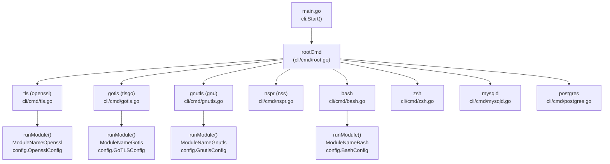
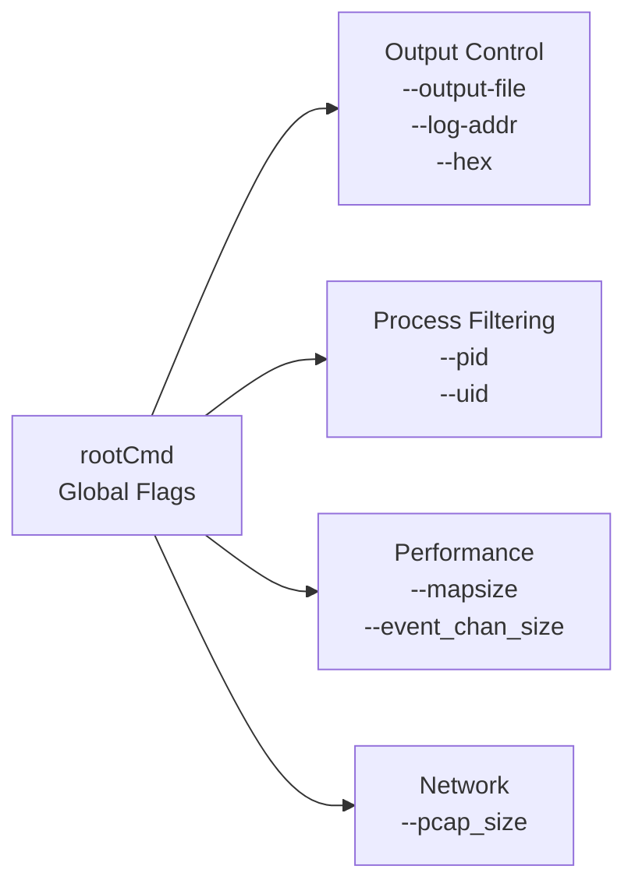
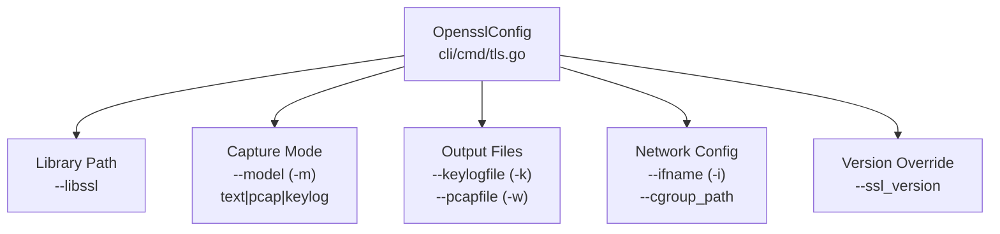
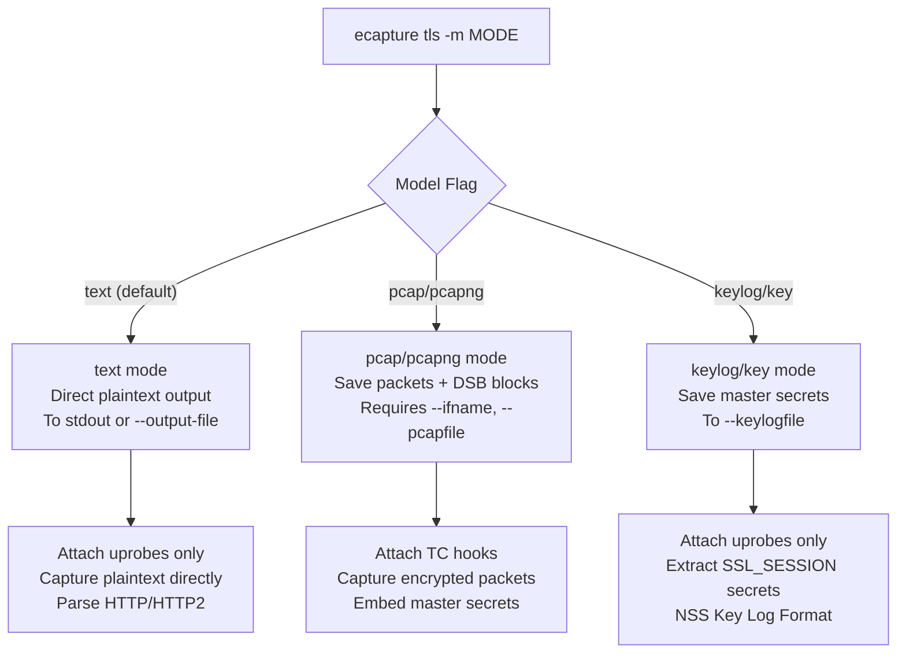
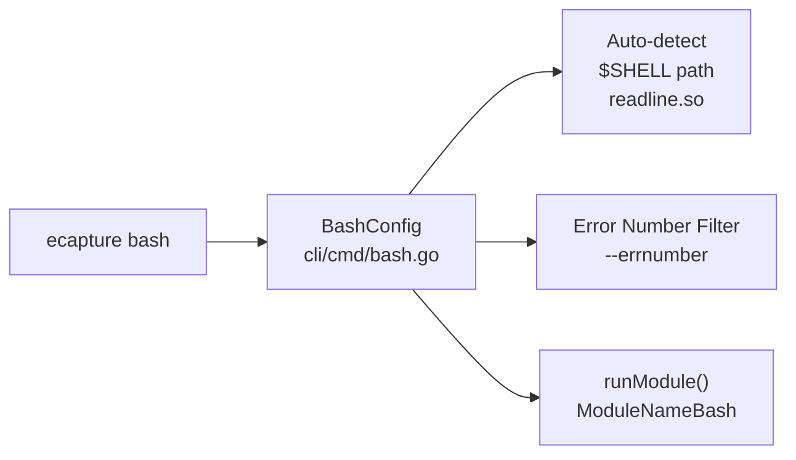
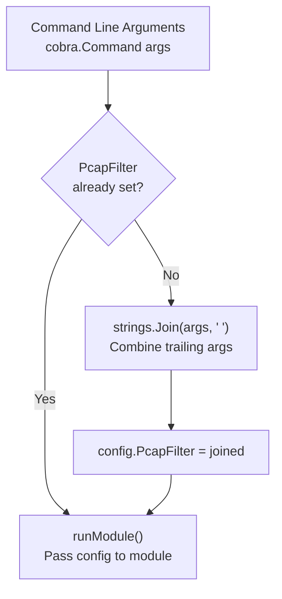
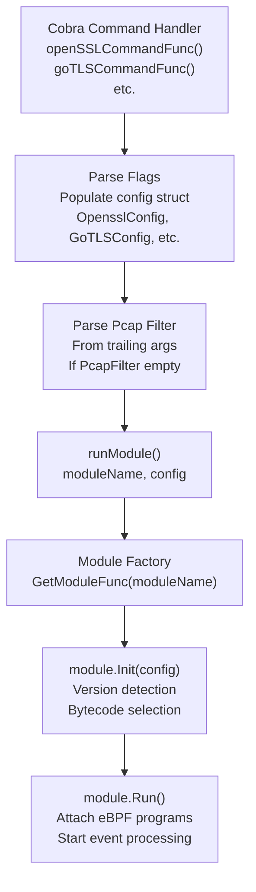

# Command Line Interface

<details>
<summary>Relevant source files</summary>

The following files were used as context for generating this wiki page:

- [CHANGELOG.md](https://github.com/gojue/ecapture/blob/0766a93b/CHANGELOG.md)
- [README.md](https://github.com/gojue/ecapture/blob/0766a93b/README.md)
- [README_CN.md](https://github.com/gojue/ecapture/blob/0766a93b/README_CN.md)
- [cli/cmd/bash.go](https://github.com/gojue/ecapture/blob/0766a93b/cli/cmd/bash.go)
- [cli/cmd/gnutls.go](https://github.com/gojue/ecapture/blob/0766a93b/cli/cmd/gnutls.go)
- [cli/cmd/gotls.go](https://github.com/gojue/ecapture/blob/0766a93b/cli/cmd/gotls.go)
- [cli/cmd/mysqld.go](https://github.com/gojue/ecapture/blob/0766a93b/cli/cmd/mysqld.go)
- [cli/cmd/nspr.go](https://github.com/gojue/ecapture/blob/0766a93b/cli/cmd/nspr.go)
- [cli/cmd/postgres.go](https://github.com/gojue/ecapture/blob/0766a93b/cli/cmd/postgres.go)
- [cli/cmd/tls.go](https://github.com/gojue/ecapture/blob/0766a93b/cli/cmd/tls.go)
- [cli/cmd/zsh.go](https://github.com/gojue/ecapture/blob/0766a93b/cli/cmd/zsh.go)
- [images/ecapture-help-v0.8.9.svg](https://github.com/gojue/ecapture/blob/0766a93b/images/ecapture-help-v0.8.9.svg)
- [main.go](https://github.com/gojue/ecapture/blob/0766a93b/main.go)
- [pkg/util/ws/client.go](https://github.com/gojue/ecapture/blob/0766a93b/pkg/util/ws/client.go)
- [pkg/util/ws/client_test.go](https://github.com/gojue/ecapture/blob/0766a93b/pkg/util/ws/client_test.go)

</details>


## Purpose and Scope

This document describes the command-line interface (CLI) for eCapture, which provides the primary user interaction mechanism for controlling capture modules, configuring output formats, and filtering target processes. The CLI is built using the Cobra library and organizes functionality into module-specific subcommands.

For information about module lifecycle and initialization, see [Module System and Lifecycle](../2-architecture/2.4-module-system-and-lifecycle.md). For configuration options beyond CLI flags, see [Configuration System](../2-architecture/2.3-configuration-system.md).

---

## Command Structure Overview

eCapture uses a module-based command architecture where each subcommand corresponds to a specific capture module. The entry point invokes the Cobra command framework, which routes to module initialization functions.

**CLI Command Hierarchy**



Sources: [main.go:1-11](https://github.com/gojue/ecapture/blob/0766a93b/main.go#L1-L11), [cli/cmd/tls.go:15-68](https://github.com/gojue/ecapture/blob/0766a93b/cli/cmd/tls.go#L15-L68), [cli/cmd/gotls.go:15-59](https://github.com/gojue/ecapture/blob/0766a93b/cli/cmd/gotls.go#L15-L59), [cli/cmd/gnutls.go:18-65](https://github.com/gojue/ecapture/blob/0766a93b/cli/cmd/gnutls.go#L18-L65), [cli/cmd/bash.go:15-56](https://github.com/gojue/ecapture/blob/0766a93b/cli/cmd/bash.go#L15-L56)

**Command to Module Mapping**

Each subcommand creates a module-specific configuration object and invokes `runModule()` with the appropriate module name constant.

| Command | Aliases | Module Name | Config Type | Command Function |
|---------|---------|-------------|-------------|------------------|
| `tls` | `openssl` | `ModuleNameOpenssl` | `OpensslConfig` | `openSSLCommandFunc` |
| `gotls` | `tlsgo` | `ModuleNameGotls` | `GoTLSConfig` | `goTLSCommandFunc` |
| `gnutls` | `gnu` | `ModuleNameGnutls` | `GnutlsConfig` | `gnuTlsCommandFunc` |
| `nspr` | `nss` | `ModuleNameNspr` | `NsprConfig` | `nssCommandFunc` |
| `bash` | - | `ModuleNameBash` | `BashConfig` | `bashCommandFunc` |
| `zsh` | - | `ModuleNameZsh` | `ZshConfig` | `zshCommandFunc` |
| `mysqld` | - | `ModuleNameMysqld` | `MysqldConfig` | `mysqldCommandFunc` |
| `postgres` | - | `ModuleNamePostgres` | `PostgresConfig` | `postgresCommandFunc` |

Sources: [cli/cmd/tls.go:26-67](https://github.com/gojue/ecapture/blob/0766a93b/cli/cmd/tls.go#L26-L67), [cli/cmd/gotls.go:26-58](https://github.com/gojue/ecapture/blob/0766a93b/cli/cmd/gotls.go#L26-L58), [cli/cmd/gnutls.go:29-64](https://github.com/gojue/ecapture/blob/0766a93b/cli/cmd/gnutls.go#L29-L64), [cli/cmd/nspr.go:27-51](https://github.com/gojue/ecapture/blob/0766a93b/cli/cmd/nspr.go#L27-L51), [cli/cmd/bash.go:24-55](https://github.com/gojue/ecapture/blob/0766a93b/cli/cmd/bash.go#L24-L55), [cli/cmd/zsh.go:27-57](https://github.com/gojue/ecapture/blob/0766a93b/cli/cmd/zsh.go#L27-L57), [cli/cmd/mysqld.go:27-49](https://github.com/gojue/ecapture/blob/0766a93b/cli/cmd/mysqld.go#L27-L49), [cli/cmd/postgres.go:27-45](https://github.com/gojue/ecapture/blob/0766a93b/cli/cmd/postgres.go#L27-L45)

---

## Global Flags

Global flags are defined at the root command level and apply to all subcommands. These are inherited by module-specific commands through Cobra's persistent flag mechanism.

**Common Global Flags Hierarchy**



### Output Control Flags

| Flag | Short | Type | Default | Description |
|------|-------|------|---------|-------------|
| `--output-file` | `-l` | string | - | File path for event output (text mode) |
| `--logaddr` | - | string | `localhost:28256` | HTTP server address for config updates |
| `--hex` | - | bool | `false` | Display data in hexadecimal format |
| `--event_rotate_size` | - | uint64 | `0` | File rotation size (0=disabled) |
| `--event_rotate_time` | - | uint64 | `0` | File rotation interval in seconds (0=disabled) |

### Process Filtering Flags

| Flag | Short | Type | Default | Description |
|------|-------|------|---------|-------------|
| `--pid` | `-p` | uint64 | `0` | Target process ID (0=all processes) |
| `--uid` | `-u` | uint64 | `0` | Target user ID (0=all users) |

### Performance Tuning Flags

| Flag | Type | Default | Description |
|------|------|---------|-------------|
| `--mapsize` | uint64 | `5120` | eBPF map size in KB |
| `--event_chan_size` | uint32 | `100` | Event channel buffer size |
| `--pcap_size` | uint64 | `4096` | Network packet capture buffer size |

Sources: Based on common patterns in [cli/cmd/tls.go:50-57](https://github.com/gojue/ecapture/blob/0766a93b/cli/cmd/tls.go#L50-L57), [cli/cmd/gotls.go:42-48](https://github.com/gojue/ecapture/blob/0766a93b/cli/cmd/gotls.go#L42-L48), [README.md:44](https://github.com/gojue/ecapture/blob/0766a93b/README.md#L44)

---

## TLS Module (`tls`/`openssl`)

The TLS module captures plaintext from OpenSSL/BoringSSL libraries, supporting versions 1.0.x through 3.5.x and BoringSSL on Android 12-16.

### TLS-Specific Flags



| Flag | Short | Type | Default | Description |
|------|-------|------|---------|-------------|
| `--libssl` | - | string | (auto-detected) | Path to `libssl.so` or statically-linked binary |
| `--model` | `-m` | string | `text` | Capture mode: `text`, `pcap`/`pcapng`, `key`/`keylog` |
| `--keylogfile` | `-k` | string | `ecapture_openssl_key.log` | Output file for TLS master secrets |
| `--pcapfile` | `-w` | string | `save.pcapng` | Output file for PCAP-NG format packets |
| `--ifname` | `-i` | string | - | Network interface for TC classifier hooks |
| `--cgroup_path` | - | string | `/sys/fs/cgroup` | CGroup mount path for process filtering |
| `--ssl_version` | - | string | (auto-detected) | Manual version override (e.g., `"openssl 3.0.5"`) |

**Pcap Filter Expression**: The TLS command accepts a trailing pcap filter expression (tcpdump syntax) when in `pcap` mode. This is parsed from remaining command-line arguments.

Sources: [cli/cmd/tls.go:26-67](https://github.com/gojue/ecapture/blob/0766a93b/cli/cmd/tls.go#L26-L67)

### TLS Capture Modes

The `--model`/`-m` flag controls the capture and output behavior:

**Mode Decision Flow**



Sources: [cli/cmd/tls.go:32-47](https://github.com/gojue/ecapture/blob/0766a93b/cli/cmd/tls.go#L32-L47), [README.md:171-253](https://github.com/gojue/ecapture/blob/0766a93b/README.md#L171-L253)

### TLS Command Examples

**Text Mode (Default)**
```shell
sudo ecapture tls --pid=1234 --hex
sudo ecapture tls -l output.log --libssl=/lib/x86_64-linux-gnu/libssl.so.3
```

**Keylog Mode**
```shell
sudo ecapture tls -m keylog -k ecapture_key.log
sudo ecapture tls -m key --keylogfile=/tmp/keys.log --pid=5678
```

**Pcap Mode**
```shell
sudo ecapture tls -m pcap -i eth0 -w capture.pcapng tcp port 443
sudo ecapture tls -m pcapng -i wlan0 --pcapfile=save.pcapng host 192.168.1.1 and tcp port 443
```

**Android BoringSSL**
```shell
sudo ecapture tls -m pcap --pcapfile=android.pcapng -i wlan0 \
  --libssl=/apex/com.android.conscrypt/lib64/libssl.so \
  --ssl_version="boringssl 1.1.1" tcp port 443
```

Sources: [cli/cmd/tls.go:32-47](https://github.com/gojue/ecapture/blob/0766a93b/cli/cmd/tls.go#L32-L47), [README.md:74-253](https://github.com/gojue/ecapture/blob/0766a93b/README.md#L74-L253)

---

## GoTLS Module (`gotls`)

The GoTLS module captures plaintext from Go programs using the `crypto/tls` standard library, supporting both register-based and stack-based ABIs (Go 1.17+ PIE mode).

### GoTLS-Specific Flags

| Flag | Short | Type | Default | Description |
|------|-------|------|---------|-------------|
| `--elfpath` | `-e` | string | (required) | Path to Go binary (required for offset calculation) |
| `--model` | `-m` | string | `text` | Capture mode: `text`, `pcap`/`pcapng`, `key`/`keylog` |
| `--pcapfile` | `-w` | string | `ecapture_gotls.pcapng` | PCAP-NG output file path |
| `--keylogfile` | `-k` | string | `ecapture_gotls_key.log` | Master secret keylog output file |
| `--ifname` | `-i` | string | - | Network interface for TC hooks (pcap mode only) |

**Pcap Filter Expression**: Similar to TLS module, trailing arguments are parsed as pcap filter expressions in `pcap` mode.

Sources: [cli/cmd/gotls.go:26-58](https://github.com/gojue/ecapture/blob/0766a93b/cli/cmd/gotls.go#L26-L58)

### GoTLS Command Examples

**Text Mode**
```shell
sudo ecapture gotls --elfpath=/usr/local/bin/go_app --hex
sudo ecapture gotls -e /home/user/myapp --pid=9876 -l output.log
```

**Keylog Mode**
```shell
sudo ecapture gotls -m keylog -k gotls_keys.log --elfpath=/usr/bin/go_https_server
sudo ecapture gotls -m key --keylogfile=/tmp/gotls.log -e /app/binary --pid=4321
```

**Pcap Mode**
```shell
sudo ecapture gotls -m pcap --pcapfile=go_capture.pcapng -i eth0 \
  --elfpath=/usr/bin/go_client tcp port 443
sudo ecapture gotls -m pcapng -w output.pcapng -i wlan0 -e /app/server
```

Sources: [cli/cmd/gotls.go:33-38](https://github.com/gojue/ecapture/blob/0766a93b/cli/cmd/gotls.go#L33-L38), [README.md:257-280](https://github.com/gojue/ecapture/blob/0766a93b/README.md#L257-L280)

---

## Other SSL/TLS Modules

### GnuTLS Module (`gnutls`)

Captures plaintext from GnuTLS library, supporting keylog and pcap modes.

| Flag | Short | Type | Default | Description |
|------|-------|------|---------|-------------|
| `--gnutls` | - | string | (auto-detected) | Path to `libgnutls.so` |
| `--model` | `-m` | string | `text` | Capture mode: `text`, `pcap`, `keylog` |
| `--keylogfile` | `-k` | string | `ecapture_gnutls_key.log` | Keylog output file |
| `--pcapfile` | `-w` | string | `save.pcapng` | PCAP output file |
| `--ifname` | `-i` | string | - | Network interface |
| `--ssl_version` | - | string | - | GnuTLS version (e.g., `"3.7.9"`) |

**Example**:
```shell
sudo ecapture gnutls -m keylog -k gnutls_keys.log --ssl_version=3.7.9
sudo ecapture gnutls -m pcap -i eth0 -w gnutls.pcapng tcp port 443
```

Sources: [cli/cmd/gnutls.go:29-64](https://github.com/gojue/ecapture/blob/0766a93b/cli/cmd/gnutls.go#L29-L64), [README.md:155-161](https://github.com/gojue/ecapture/blob/0766a93b/README.md#L155-L161), [CHANGELOG.md:126](https://github.com/gojue/ecapture/blob/0766a93b/CHANGELOG.md#L126)

### NSS/NSPR Module (`nspr`/`nss`)

Captures plaintext from NSS/NSPR libraries (used by Firefox, Thunderbird).

| Flag | Short | Type | Default | Description |
|------|-------|------|---------|-------------|
| `--nspr` | - | string | (auto-detected) | Path to `libnspr44.so` |

**Example**:
```shell
sudo ecapture nspr --hex --pid=3423
sudo ecapture nss -l firefox_capture.log --pid=5678
```

Sources: [cli/cmd/nspr.go:27-51](https://github.com/gojue/ecapture/blob/0766a93b/cli/cmd/nspr.go#L27-L51), [README.md:158](https://github.com/gojue/ecapture/blob/0766a93b/README.md#L158)

---

## System Audit Modules

### Bash Module (`bash`)

Captures bash command input/output for security auditing.

**Bash Command Flow**



| Flag | Short | Type | Default | Description |
|------|-------|------|---------|-------------|
| `--bash` | - | string | (auto-detected) | Path to bash binary |
| `--readlineso` | - | string | (auto-detected) | Path to `readline.so` |
| `--errnumber` | `-e` | int | `BashErrnoDefault` | Filter commands by exit code |

**Example**:
```shell
sudo ecapture bash
sudo ecapture bash --bash=/bin/bash -l bash_audit.log
sudo ecapture bash -e 0  # Only show successful commands
```

Sources: [cli/cmd/bash.go:24-55](https://github.com/gojue/ecapture/blob/0766a93b/cli/cmd/bash.go#L24-L55), [README.md:153-154](https://github.com/gojue/ecapture/blob/0766a93b/README.md#L153-L154)

### Zsh Module (`zsh`)

Similar to bash module, captures zsh command activity.

| Flag | Short | Type | Default | Description |
|------|-------|------|---------|-------------|
| `--zsh` | - | string | (auto-detected) | Path to zsh binary |
| `--errnumber` | `-e` | int | `ZshErrnoDefault` | Filter commands by exit code |

**Example**:
```shell
sudo ecapture zsh
sudo ecapture zsh --zsh=/usr/bin/zsh -l zsh_audit.log
```

Sources: [cli/cmd/zsh.go:27-57](https://github.com/gojue/ecapture/blob/0766a93b/cli/cmd/zsh.go#L27-L57), [README.md:154](https://github.com/gojue/ecapture/blob/0766a93b/README.md#L154)

### MySQL Module (`mysqld`)

Captures SQL queries from MySQL/MariaDB server processes, supporting versions 5.6, 5.7, 8.0, and MariaDB 10.5+.

| Flag | Short | Type | Default | Description |
|------|-------|------|---------|-------------|
| `--mysqld` | `-m` | string | `/usr/sbin/mariadbd` | Path to mysqld binary |
| `--offset` | - | uint64 | `0` | Manual offset for `dispatch_command` function |
| `--funcname` | `-f` | string | - | Function name to hook (overrides auto-detection) |

**Example**:
```shell
sudo ecapture mysqld -m /usr/sbin/mysqld -l mysql_queries.log
sudo ecapture mysqld --mysqld=/usr/local/mysql/bin/mysqld --pid=1234
```

Sources: [cli/cmd/mysqld.go:27-49](https://github.com/gojue/ecapture/blob/0766a93b/cli/cmd/mysqld.go#L27-L49), [README.md:157](https://github.com/gojue/ecapture/blob/0766a93b/README.md#L157)

### PostgreSQL Module (`postgres`)

Captures SQL queries from PostgreSQL server processes (version 10+).

| Flag | Short | Type | Default | Description |
|------|-------|------|---------|-------------|
| `--postgres` | `-m` | string | `/usr/bin/postgres` | Path to postgres binary |
| `--funcname` | `-f` | string | - | Function name to hook |

**Example**:
```shell
sudo ecapture postgres -m /usr/lib/postgresql/14/bin/postgres
sudo ecapture postgres --postgres=/opt/pgsql/bin/postgres -l pg_queries.log
```

Sources: [cli/cmd/postgres.go:27-45](https://github.com/gojue/ecapture/blob/0766a93b/cli/cmd/postgres.go#L27-L45), [README.md:159](https://github.com/gojue/ecapture/blob/0766a93b/README.md#L159)

---

## Flag Processing and Pcap Filters

The TLS, GoTLS, and GnuTLS modules support pcap filter expressions in `pcap` mode. These are processed from trailing command-line arguments and stored in the `PcapFilter` field of the config struct.

**Pcap Filter Processing Flow**



**Filter Examples**:
```shell
# Single host filter
sudo ecapture tls -m pcap -i eth0 -w out.pcapng host 192.168.1.1

# Port and protocol filter
sudo ecapture tls -m pcap -i wlan0 tcp port 443

# Complex filter expression
sudo ecapture gotls -m pcap -i eth0 -w output.pcapng \
  host 192.168.1.1 and tcp port 443 and not port 22
```

Sources: [cli/cmd/tls.go:62-66](https://github.com/gojue/ecapture/blob/0766a93b/cli/cmd/tls.go#L62-L66), [cli/cmd/gotls.go:52-56](https://github.com/gojue/ecapture/blob/0766a93b/cli/cmd/gotls.go#L52-L56), [cli/cmd/gnutls.go:59-64](https://github.com/gojue/ecapture/blob/0766a93b/cli/cmd/gnutls.go#L59-L64)

---

## Command Execution Pattern

All module commands follow a consistent execution pattern through the `runModule()` function.

**Module Execution Flow**



Each command function:
1. Creates a module-specific config object (e.g., `OpensslConfig`)
2. Parses pcap filter from trailing arguments if applicable
3. Calls `runModule()` with the module name constant and config
4. The factory creates and initializes the appropriate module
5. Module performs version detection and bytecode selection
6. Module runs until interrupted

Sources: [cli/cmd/tls.go:62-67](https://github.com/gojue/ecapture/blob/0766a93b/cli/cmd/tls.go#L62-L67), [cli/cmd/gotls.go:52-58](https://github.com/gojue/ecapture/blob/0766a93b/cli/cmd/gotls.go#L52-L58), [cli/cmd/bash.go:53-55](https://github.com/gojue/ecapture/blob/0766a93b/cli/cmd/bash.go#L53-L55)

---

## Docker Usage

The TLS module documentation includes Docker-specific usage patterns for containerized deployments.

**Docker Volume Mounting Requirements**:
```shell
docker run --rm --privileged=true --net=host \
  -v /etc:/etc \
  -v /usr:/usr \
  -v ${PWD}:/output \
  gojue/ecapture tls -m pcap -i eth0 \
    --pcapfile=/output/capture.pcapng tcp port 443
```

The container requires:
- `--privileged=true` for eBPF capabilities
- `--net=host` to access host network interfaces
- Mount `/etc` for `ld.so.conf` library path discovery
- Mount `/usr` for accessing system libraries
- Mount output directory for saving capture files

Sources: [cli/cmd/tls.go:42-44](https://github.com/gojue/ecapture/blob/0766a93b/cli/cmd/tls.go#L42-L44), [README.md:59-68](https://github.com/gojue/ecapture/blob/0766a93b/README.md#L59-L68)

---

## Help Text and Documentation

Each command provides detailed help text accessible via the `-h` or `--help` flag:

```shell
# View all available commands
sudo ecapture -h

# View TLS module help
sudo ecapture tls -h

# View GoTLS module help
sudo ecapture gotls -h
```

The help system is built into Cobra's command structure, automatically generating usage information from flag definitions and command descriptions.

Sources: [cli/cmd/tls.go:29-47](https://github.com/gojue/ecapture/blob/0766a93b/cli/cmd/tls.go#L29-L47), [cli/cmd/gotls.go:29-39](https://github.com/gojue/ecapture/blob/0766a93b/cli/cmd/gotls.go#L29-L39), [README.md:44](https://github.com/gojue/ecapture/blob/0766a93b/README.md#L44)