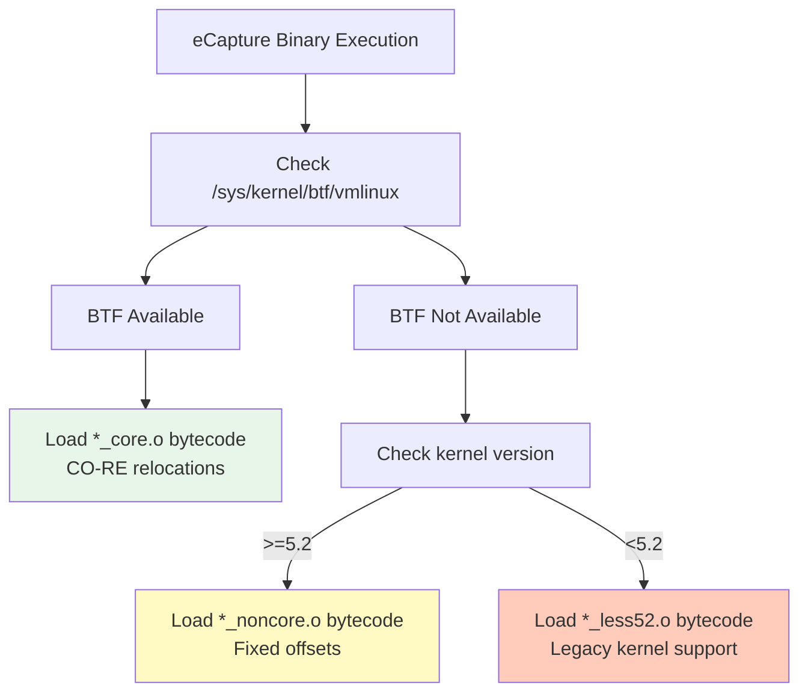
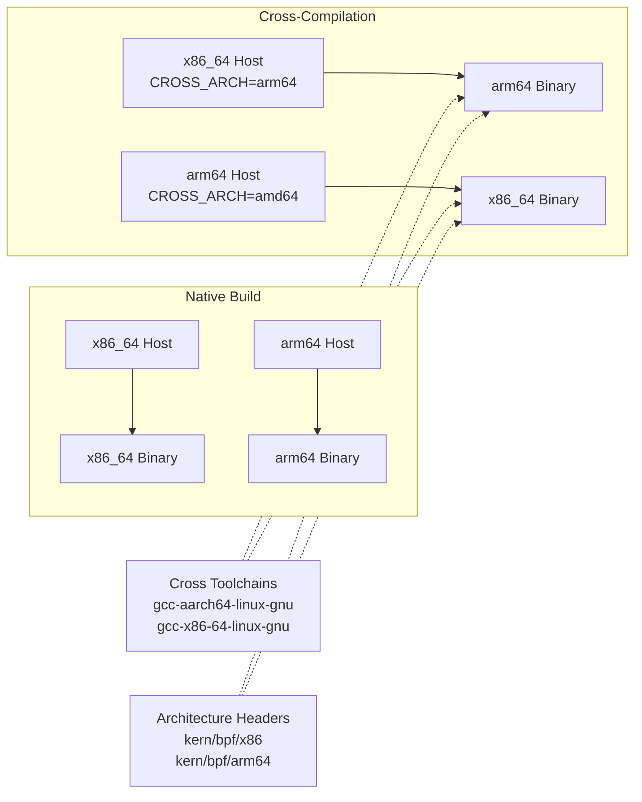
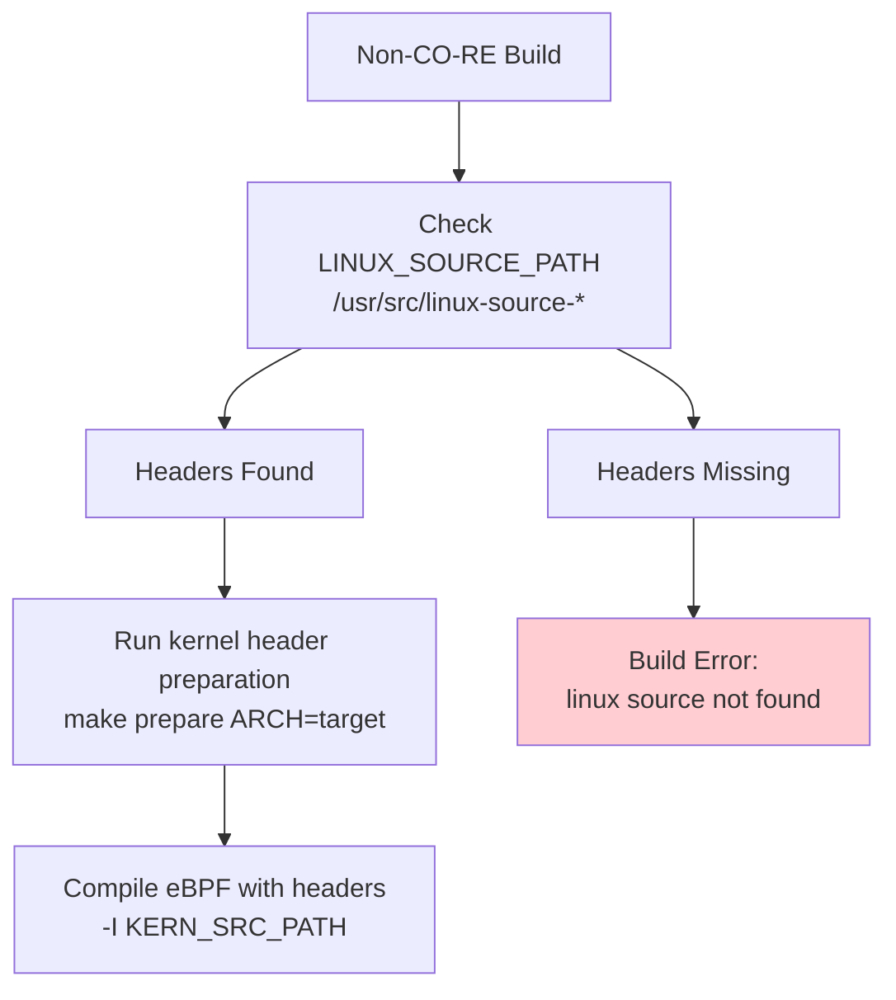
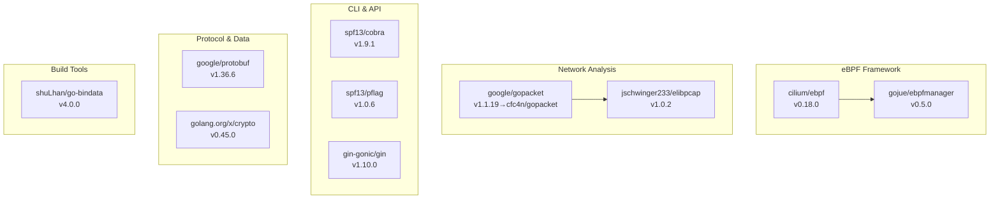
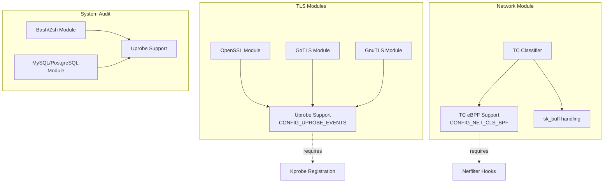
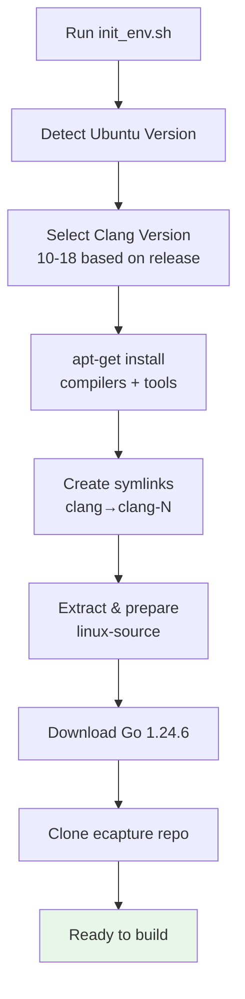
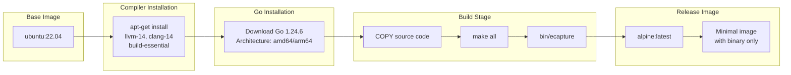

# Dependencies and System Requirements

<details>
<summary>Relevant source files</summary>

The following files were used as context for generating this wiki page:

- [.github/workflows/codeql-analysis.yml](https://github.com/gojue/ecapture/blob/0766a93b/.github/workflows/codeql-analysis.yml)
- [.github/workflows/go-c-cpp.yml](https://github.com/gojue/ecapture/blob/0766a93b/.github/workflows/go-c-cpp.yml)
- [.github/workflows/release.yml](https://github.com/gojue/ecapture/blob/0766a93b/.github/workflows/release.yml)
- [Makefile](https://github.com/gojue/ecapture/blob/0766a93b/Makefile)
- [builder/Dockerfile](https://github.com/gojue/ecapture/blob/0766a93b/builder/Dockerfile)
- [builder/Makefile.release](https://github.com/gojue/ecapture/blob/0766a93b/builder/Makefile.release)
- [builder/init_env.sh](https://github.com/gojue/ecapture/blob/0766a93b/builder/init_env.sh)
- [functions.mk](https://github.com/gojue/ecapture/blob/0766a93b/functions.mk)
- [go.mod](https://github.com/gojue/ecapture/blob/0766a93b/go.mod)
- [go.sum](https://github.com/gojue/ecapture/blob/0766a93b/go.sum)

</details>


This page documents the system requirements, dependencies, and toolchain prerequisites for building and running eCapture. It covers kernel version requirements, supported architectures, build-time tooling, runtime dependencies, and Go package dependencies.

For information about the build process itself, see [Build System](../5-development-guide/5.1-build-system.md). For installation instructions, see [Installation and Quick Start](1.1-installation-and-quick-start.md).

---

## Overview

eCapture has distinct requirements for build-time (compiling eBPF programs and Go binary) and runtime (executing the compiled binary). The system supports two compilation modes with different requirements:

- **CO-RE (Compile Once - Run Everywhere)**: Requires BTF-enabled kernels (≥5.2) at runtime, but produces portable binaries
- **Non-CO-RE**: Requires kernel headers at build-time, produces kernel-specific binaries for older systems

---

## Kernel Requirements

### Minimum Kernel Versions

| Mode | Minimum Version | BTF Required | Notes |
|------|----------------|--------------|-------|
| CO-RE | 5.2+ | Yes | Recommended for portability |
| CO-RE (legacy) | 4.18-5.1 | No | Special `_less52.o` bytecode variants |
| Non-CO-RE | 4.18+ | No | Requires exact kernel headers |

The kernel version detection and handling is implemented in [variables.mk](https://github.com/gojue/ecapture/blob/0766a93b/variables.mk) which sets `KERNEL_LESS_5_2_PREFIX` for kernels < 5.2.

### BTF (BPF Type Format) Support

BTF is a critical feature for CO-RE mode. The build system checks for BTF availability:



**BTF Detection**: The system checks for `/sys/kernel/btf/vmlinux` at runtime. If present, CO-RE bytecode is used; otherwise, non-CO-RE fallback is employed.

Sources: [Makefile:122-134](https://github.com/gojue/ecapture/blob/0766a93b/Makefile#L122-L134), [functions.mk:13-22](https://github.com/gojue/ecapture/blob/0766a93b/functions.mk#L13-L22)

---

## Supported Architectures

| Architecture | Status | Cross-Compilation | Notes |
|--------------|--------|-------------------|-------|
| x86_64 (amd64) | ✅ Full | To arm64 | Primary development platform |
| aarch64 (arm64) | ✅ Full | To x86_64 | Full feature parity |
| Android arm64 | ⚠️ Limited | From x86_64/arm64 | Non-CO-RE only, BoringSSL focus |

Architecture detection is handled in [variables.mk](https://github.com/gojue/ecapture/blob/0766a93b/variables.mk) which sets `TARGET_ARCH`, `GOARCH`, `LINUX_ARCH`, and `LIBPCAP_ARCH` based on `uname -m` or `CROSS_ARCH` environment variable.



Sources: [.github/workflows/go-c-cpp.yml:59-65](https://github.com/gojue/ecapture/blob/0766a93b/.github/workflows/go-c-cpp.yml#L59-L65), [.github/workflows/release.yml:93-97](https://github.com/gojue/ecapture/blob/0766a93b/.github/workflows/release.yml#L93-L97), [builder/init_env.sh:43-61](https://github.com/gojue/ecapture/blob/0766a93b/builder/init_env.sh#L43-L61)

---

## Build-Time Dependencies

### Required Compilers and Tools

The following table lists all build-time dependencies with minimum versions:

| Tool | Minimum Version | Purpose | Package Name (Ubuntu) |
|------|----------------|---------|----------------------|
| **clang** | 9.0+ | Compile eBPF C to bytecode | `clang-14` (recommended) |
| **llc** | 9.0+ | LLVM compiler backend | `llvm-14` |
| **llvm-strip** | 9.0+ | Strip debug symbols | `llvm-14` |
| **gcc** | System default | C compilation | `build-essential` |
| **go** | 1.24+ | Go compilation | N/A (install from golang.org) |
| **bpftool** | Any | Generate vmlinux.h | `linux-tools-generic` |
| **flex** | Any | Lexer for kernel builds | `flex` |
| **bison** | Any | Parser for kernel builds | `bison` |
| **elfutils** | Any | ELF file manipulation | `libelf-dev` |
| **pkgconf** | Any | Package configuration | `pkgconf` |

Version checking is enforced at build time:

[functions.mk:13-35](https://github.com/gojue/ecapture/blob/0766a93b/functions.mk#L13-L35):
```
Clang version check: CLANG_VERSION must be >= 9
Go version check: GO_VERSION_MAJ=1, GO_VERSION_MIN >= 24
```

Sources: [.github/workflows/go-c-cpp.yml:16-24](https://github.com/gojue/ecapture/blob/0766a93b/.github/workflows/go-c-cpp.yml#L16-L24), [functions.mk:13-35](https://github.com/gojue/ecapture/blob/0766a93b/functions.mk#L13-L35), [builder/init_env.sh:72-79](https://github.com/gojue/ecapture/blob/0766a93b/builder/init_env.sh#L72-L79)

### Kernel Headers (Non-CO-RE Only)

For non-CO-RE builds, kernel headers matching the target kernel are required. The build system searches for headers in multiple locations:



Header paths used during compilation [Makefile:154-161](https://github.com/gojue/ecapture/blob/0766a93b/Makefile#L154-L161):
- `-I $(KERN_SRC_PATH)/arch/$(LINUX_ARCH)/include`
- `-I $(KERN_BUILD_PATH)/arch/$(LINUX_ARCH)/include/generated`
- `-I $(KERN_SRC_PATH)/include`
- `-I $(KERN_BUILD_PATH)/include/generated/uapi`

Sources: [Makefile:98-104](https://github.com/gojue/ecapture/blob/0766a93b/Makefile#L98-L104), [Makefile:146-183](https://github.com/gojue/ecapture/blob/0766a93b/Makefile#L146-L183), [builder/init_env.sh:81-89](https://github.com/gojue/ecapture/blob/0766a93b/builder/init_env.sh#L81-L89)

### Cross-Compilation Dependencies

Cross-compilation requires architecture-specific toolchains:

| Host → Target | Required Package | Notes |
|---------------|-----------------|-------|
| x86_64 → arm64 | `gcc-aarch64-linux-gnu` | Sets `CC=aarch64-linux-gnu-gcc` |
| arm64 → x86_64 | `gcc-x86-64-linux-gnu` | Ubuntu 24.04+ package name |
| Any → Android | NDK not required | Uses standard cross-compiler |

Sources: [.github/workflows/go-c-cpp.yml:19](https://github.com/gojue/ecapture/blob/0766a93b/.github/workflows/go-c-cpp.yml#L19), [builder/init_env.sh:46-58](https://github.com/gojue/ecapture/blob/0766a93b/builder/init_env.sh#L46-L58)

---

## Go Dependencies

### Core Dependencies

The project uses Go 1.24.3+ with the following major dependencies:



**Key Dependencies:**

1. **cilium/ebpf v0.18.0**: Core eBPF library for loading programs, managing maps, and handling CO-RE relocations. Provides `ebpf.CollectionSpec` and map management.

2. **gojue/ebpfmanager v0.5.0**: Higher-level eBPF lifecycle management. Wraps cilium/ebpf with probe attachment, TC hook management, and cleanup orchestration.

3. **cfc4n/gopacket v1.1.20**: Forked version of `google/gopacket` with improvements for PCAP-NG format. Used for packet serialization and PCAP file generation.

4. **jschwinger233/elibpcap v1.0.2**: BPF filter compiler for TC programs. Translates Berkeley Packet Filter (BPF) syntax to eBPF bytecode.

5. **go-bindata**: Embeds compiled eBPF bytecode (`.o` files) into the Go binary as byte arrays in [assets/ebpf_probe.go](https://github.com/gojue/ecapture/blob/0766a93b/assets/ebpf_probe.go).

Sources: [go.mod:5-19](https://github.com/gojue/ecapture/blob/0766a93b/go.mod#L5-L19), [go.sum:8-14](https://github.com/gojue/ecapture/blob/0766a93b/go.sum#L8-L14)

### Indirect Dependencies

Critical indirect dependencies include:

| Package | Version | Purpose |
|---------|---------|---------|
| `florianl/go-tc` | v0.4.5 | Linux Traffic Control netlink interface |
| `vishvananda/netlink` | v1.3.1 | Generic netlink operations |
| `mdlayher/netlink` | v1.7.2 | Low-level netlink socket library |
| `hashicorp/go-multierror` | v1.1.1 | Error aggregation |

Sources: [go.mod:22-58](https://github.com/gojue/ecapture/blob/0766a93b/go.mod#L22-L58)

---

## Runtime Dependencies

### Minimal Runtime Requirements

The compiled `ecapture` binary has **no runtime dependencies** beyond kernel features:

| Requirement | Description |
|-------------|-------------|
| Linux kernel | 4.18+ (non-CO-RE) or 5.2+ (CO-RE) |
| BTF support | For CO-RE mode only |
| `CAP_SYS_ADMIN` | Or root privileges to load eBPF programs |
| `CAP_BPF` + `CAP_PERFMON` | On kernels 5.8+ as alternative to `CAP_SYS_ADMIN` |

**Static Linking**: The binary is statically linked with libpcap [functions.mk:48-53](https://github.com/gojue/ecapture/blob/0766a93b/functions.mk#L48-L53):
```
CGO_LDFLAGS='-O2 -g -L$(CURDIR)/lib/libpcap/ -lpcap -static'
-ldflags "... -linkmode=external -extldflags -static"
```

This eliminates the need for libpcap at runtime.

### Kernel Feature Requirements by Module

Different capture modules require different kernel features:



Sources: [variables.mk](https://github.com/gojue/ecapture/blob/0766a93b/variables.mk), [Makefile:122-134](https://github.com/gojue/ecapture/blob/0766a93b/Makefile#L122-L134)

---

## Compilation Modes Comparison

### CO-RE vs Non-CO-RE

| Aspect | CO-RE Mode | Non-CO-RE Mode |
|--------|-----------|----------------|
| **Build Requirements** | clang, llc, BTF headers | clang, llc, full kernel headers |
| **Runtime Requirements** | BTF-enabled kernel (5.2+) | Any kernel 4.18+ |
| **Portability** | One binary for all kernels | Kernel-specific binary |
| **Bytecode Size** | Larger (includes relocation info) | Smaller (fixed offsets) |
| **Build Time** | Faster (no kernel prepare) | Slower (kernel header preparation) |
| **Use Case** | General distribution | Legacy systems, Android |

**Compilation Flags Comparison:**

CO-RE [Makefile:122-134](https://github.com/gojue/ecapture/blob/0766a93b/Makefile#L122-L134):
```
-target bpfel -g -D__BPF_TARGET_MISSING="..."
# Uses BTF information for relocations
```

Non-CO-RE [Makefile:151-166](https://github.com/gojue/ecapture/blob/0766a93b/Makefile#L151-L166):
```
-I $(KERN_SRC_PATH)/arch/$(LINUX_ARCH)/include
-I $(KERN_BUILD_PATH)/include/generated/uapi
# Requires all kernel header paths
```

Sources: [Makefile:122-183](https://github.com/gojue/ecapture/blob/0766a93b/Makefile#L122-L183), [variables.mk](https://github.com/gojue/ecapture/blob/0766a93b/variables.mk)

---

## Development Environment Setup

### Automated Setup (Ubuntu)

The project provides [builder/init_env.sh](https://github.com/gojue/ecapture/blob/0766a93b/builder/init_env.sh) for automated environment setup:



Version-specific clang selection [builder/init_env.sh:16-39](https://github.com/gojue/ecapture/blob/0766a93b/builder/init_env.sh#L16-L39):
- Ubuntu 20.04: clang-10
- Ubuntu 22.04: clang-12
- Ubuntu 23.04+: clang-15
- Ubuntu 24.04: clang-18

Sources: [builder/init_env.sh:1-106](https://github.com/gojue/ecapture/blob/0766a93b/builder/init_env.sh#L1-L106)

### Manual Setup

For manual setup, install these package groups:

**Essential Tools:**
```bash
sudo apt-get install build-essential pkgconf libelf-dev
```

**LLVM Toolchain:**
```bash
sudo apt-get install llvm-14 clang-14
sudo ln -sf /usr/bin/clang-14 /usr/bin/clang
sudo ln -sf /usr/bin/llc-14 /usr/bin/llc
sudo ln -sf /usr/bin/llvm-strip-14 /usr/bin/llvm-strip
```

**Kernel Tools:**
```bash
sudo apt-get install linux-tools-common linux-tools-generic flex bison
```

**Cross-Compilation (optional):**
```bash
# For arm64 on x86_64
sudo apt-get install gcc-aarch64-linux-gnu

# For x86_64 on arm64  
sudo apt-get install gcc-x86-64-linux-gnu
```

**Kernel Headers (for non-CO-RE):**
```bash
sudo apt-get install linux-source
cd /usr/src
sudo tar -xf linux-source-*.tar.bz2
cd linux-source-*/
sudo make oldconfig
sudo make prepare
```

Sources: [.github/workflows/go-c-cpp.yml:16-33](https://github.com/gojue/ecapture/blob/0766a93b/.github/workflows/go-c-cpp.yml#L16-L33), [builder/init_env.sh:72-89](https://github.com/gojue/ecapture/blob/0766a93b/builder/init_env.sh#L72-L89)

---

## Docker Build Environment

The project provides a Dockerfile for containerized builds:



The multi-stage build [builder/Dockerfile:1-39](https://github.com/gojue/ecapture/blob/0766a93b/builder/Dockerfile#L1-L39):
1. **Builder stage**: Full toolchain on Ubuntu 22.04
2. **Release stage**: Minimal Alpine image with static binary

Build for multiple architectures:
```bash
docker buildx build --platform linux/amd64,linux/arm64 -t ecapture:latest .
```

Sources: [builder/Dockerfile:1-39](https://github.com/gojue/ecapture/blob/0766a93b/builder/Dockerfile#L1-L39), [.github/workflows/release.yml:101-129](https://github.com/gojue/ecapture/blob/0766a93b/.github/workflows/release.yml#L101-L129)

---

## Verification Commands

After setup, verify dependencies:

```bash
# Check tool versions
clang --version          # Should be >= 9.0
go version               # Should be >= 1.24.0
llc --version            # Should match clang version
bpftool version          # Any version

# Check BTF support (runtime)
ls -l /sys/kernel/btf/vmlinux  # Should exist for CO-RE

# Check eBPF kernel configs
grep CONFIG_BPF /boot/config-$(uname -r)
# Should show:
# CONFIG_BPF=y
# CONFIG_BPF_SYSCALL=y
# CONFIG_HAVE_EBPF_JIT=y
```

Sources: [functions.mk:2-39](https://github.com/gojue/ecapture/blob/0766a93b/functions.mk#L2-L39), [variables.mk](https://github.com/gojue/ecapture/blob/0766a93b/variables.mk)

---

## Common Issues

### Clang Version Too Old

**Problem**: Build fails with "you MUST use clang 9 or newer"

**Solution**: Install a newer clang version and create symlinks [builder/init_env.sh:75-79](https://github.com/gojue/ecapture/blob/0766a93b/builder/init_env.sh#L75-L79):
```bash
sudo apt-get install clang-14 llc-14 llvm-strip-14
sudo ln -sf /usr/bin/clang-14 /usr/bin/clang
```

### Missing Kernel Headers

**Problem**: Non-CO-RE build fails with "linux source not found"

**Solution**: Install and prepare kernel headers [Makefile:98-104](https://github.com/gojue/ecapture/blob/0766a93b/Makefile#L98-L104):
```bash
sudo apt-get install linux-source
cd /usr/src && sudo tar -xf linux-source-*.tar.bz2
cd linux-source-*/ && sudo make prepare
```

### Go Version Too Old

**Problem**: Build fails with "you MUST use golang 1.24 or newer"

**Solution**: Download Go 1.24.6+ from [golang.org/dl](https://golang.org/dl/) and update PATH.

Sources: [functions.mk:13-35](https://github.com/gojue/ecapture/blob/0766a93b/functions.mk#L13-L35), [Makefile:98-104](https://github.com/gojue/ecapture/blob/0766a93b/Makefile#L98-L104), [builder/init_env.sh:72-89](https://github.com/gojue/ecapture/blob/0766a93b/builder/init_env.sh#L72-L89)