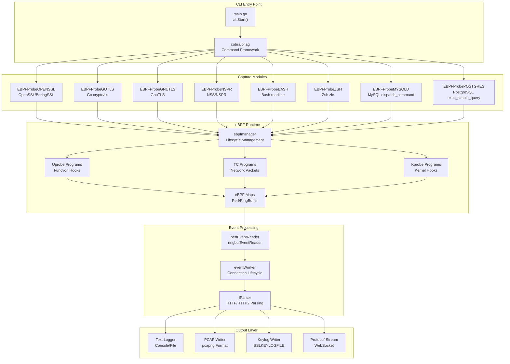
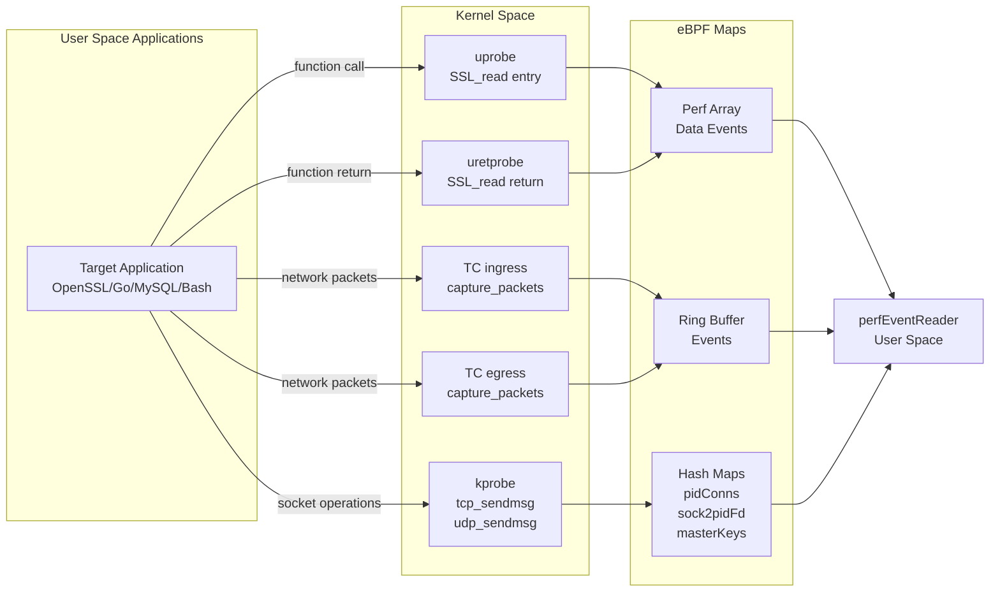
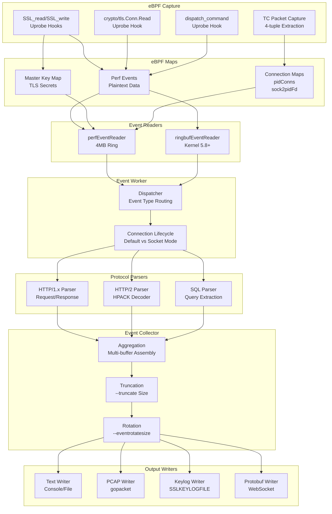

# Overview

<details>
<summary>Relevant source files</summary>

The following files were used as context for generating this wiki page:

- [CHANGELOG.md](https://github.com/gojue/ecapture/blob/0766a93b/CHANGELOG.md)
- [README.md](https://github.com/gojue/ecapture/blob/0766a93b/README.md)
- [README_CN.md](https://github.com/gojue/ecapture/blob/0766a93b/README_CN.md)
- [go.mod](https://github.com/gojue/ecapture/blob/0766a93b/go.mod)
- [go.sum](https://github.com/gojue/ecapture/blob/0766a93b/go.sum)
- [images/ecapture-help-v0.8.9.svg](https://github.com/gojue/ecapture/blob/0766a93b/images/ecapture-help-v0.8.9.svg)
- [main.go](https://github.com/gojue/ecapture/blob/0766a93b/main.go)

</details>


This document introduces eCapture (旁观者), an eBPF-based network traffic capture and system auditing tool. eCapture intercepts SSL/TLS encrypted communications and extracts plaintext data without requiring CA certificates or application modifications. It also provides system auditing capabilities for shell commands and database queries.

For installation and usage instructions, see [Installation and Quick Start](1.1-installation-and-quick-start.md). For detailed module documentation, see [Capture Modules](../3-capture-modules/index.md). For build and development information, see [Development Guide](../5-development-guide/index.md).

## System Purpose and Capabilities

eCapture captures encrypted network traffic at the user-space and kernel-space boundaries using eBPF (Extended Berkeley Packet Filter) technology. The system attaches probes to SSL/TLS library functions and network stack entry points, enabling plaintext capture of encrypted communications and runtime auditing of system activities.

**Core Capabilities:**
- **SSL/TLS Plaintext Capture**: Intercepts encrypted data from OpenSSL, BoringSSL, GnuTLS, NSS/NSPR libraries
- **Go TLS Capture**: Supports native Go `crypto/tls` library encryption
- **System Auditing**: Captures Bash/Zsh commands and MySQL/PostgreSQL SQL queries
- **No CA Certificates Required**: Works transparently without certificate installation
- **Multiple Output Formats**: Text, PCAP-NG, keylog (SSLKEYLOGFILE), Protobuf streams

Sources: [README.md:1-43](https://github.com/gojue/ecapture/blob/0766a93b/README.md#L1-L43), [README_CN.md:40-43](https://github.com/gojue/ecapture/blob/0766a93b/README_CN.md#L40-L43), [CHANGELOG.md:188-273](https://github.com/gojue/ecapture/blob/0766a93b/CHANGELOG.md#L188-L273)

## Platform Support

eCapture supports Linux and Android operating systems with specific kernel version requirements:

| Architecture | Minimum Kernel Version | Notes |
|--------------|------------------------|-------|
| x86_64 | 4.18 | Full feature support |
| aarch64 | 5.5 | Full feature support |

**Requirements:**
- ROOT permissions for eBPF operations
- BTF (BPF Type Format) support preferred but not required
- Kernel headers for non-CO-RE compilation mode

**Unsupported Platforms:**
- Windows (no eBPF support)
- macOS (no eBPF support)

The system automatically detects kernel capabilities and selects between CO-RE (Compile Once - Run Everywhere) and non-CO-RE bytecode at runtime.

Sources: [README.md:14-16](https://github.com/gojue/ecapture/blob/0766a93b/README.md#L14-L16), [README_CN.md:15-17](https://github.com/gojue/ecapture/blob/0766a93b/README_CN.md#L15-L17), [go.mod:1-60](https://github.com/gojue/ecapture/blob/0766a93b/go.mod#L1-L60)

## System Architecture



**System Layers:**

1. **CLI Entry Point**: Command-line interface using Cobra framework for subcommand routing
2. **Capture Modules**: Eight specialized modules implementing `IModule` interface for different protocols
3. **eBPF Runtime**: Probe management, bytecode loading, and eBPF program lifecycle
4. **Event Processing**: Event reading, connection tracking, and protocol parsing
5. **Output Layer**: Multiple output formats for different consumption scenarios

Each module operates independently with its own eBPF programs and event handlers, coordinated through the `IModule` interface.

Sources: [main.go:1-12](https://github.com/gojue/ecapture/blob/0766a93b/main.go#L1-L12), [README.md:152-161](https://github.com/gojue/ecapture/blob/0766a93b/README.md#L152-L161), [README_CN.md:129-140](https://github.com/gojue/ecapture/blob/0766a93b/README_CN.md#L129-L140)

## Capture Modules

eCapture provides eight modules for capturing different protocols and applications:

| Module | Target | Description | Command |
|--------|--------|-------------|---------|
| `tls` | OpenSSL/BoringSSL | Captures SSL/TLS plaintext from OpenSSL 1.0.x-3.5.x and BoringSSL (Android 12-16) | `ecapture tls` |
| `gotls` | Go crypto/tls | Captures TLS traffic from Go applications using native crypto/tls library | `ecapture gotls` |
| `gnutls` | GnuTLS | Captures TLS traffic from GnuTLS library applications | `ecapture gnutls` |
| `nss` | NSS/NSPR | Captures traffic from Firefox and other NSS/NSPR-based applications | `ecapture nss` |
| `bash` | Bash | Audits bash command execution via readline library hooks | `ecapture bash` |
| `zsh` | Zsh | Audits zsh command execution via zle (Z-Shell Line Editor) hooks | `ecapture zsh` |
| `mysqld` | MySQL/MariaDB | Captures SQL queries from MySQL 5.6/5.7/8.0 and MariaDB | `ecapture mysqld` |
| `postgres` | PostgreSQL | Captures SQL queries from PostgreSQL 10+ | `ecapture postgres` |

Each module implements the `IModule` interface and can run independently or be combined with others.

Sources: [README.md:152-161](https://github.com/gojue/ecapture/blob/0766a93b/README.md#L152-L161), [README_CN.md:129-140](https://github.com/gojue/ecapture/blob/0766a93b/README_CN.md#L129-L140), [CHANGELOG.md:38-42](https://github.com/gojue/ecapture/blob/0766a93b/CHANGELOG.md#L38-L42)

## eBPF Technology Usage



**eBPF Probe Types:**

1. **Uprobe/Uretprobe**: Attaches to user-space library functions
   - Entry probes capture function arguments (e.g., `SSL_read(ssl, buf, len)`)
   - Return probes capture return values and output buffers
   - Used for: SSL/TLS functions, database queries, shell commands

2. **TC (Traffic Control)**: Attaches to network interface ingress/egress
   - Captures network packets at kernel level
   - Extracts 4-tuple (src/dst IP:port) for connection tracking
   - Used for: PCAP mode packet capture with process attribution

3. **Kprobe**: Attaches to kernel functions
   - Hooks socket operations (`tcp_sendmsg`, `udp_sendmsg`)
   - Maps socket file descriptors to processes
   - Used for: Connection tracking and process identification

**CO-RE vs Non-CO-RE:**
- **CO-RE (BTF-enabled)**: Single bytecode works across kernel versions
- **Non-CO-RE**: Requires kernel-specific bytecode with header files
- eCapture detects BTF availability and loads appropriate bytecode automatically

Sources: [README.md:38-43](https://github.com/gojue/ecapture/blob/0766a93b/README.md#L38-L43), [CHANGELOG.md:249-251](https://github.com/gojue/ecapture/blob/0766a93b/CHANGELOG.md#L249-L251), [CHANGELOG.md:552-556](https://github.com/gojue/ecapture/blob/0766a93b/CHANGELOG.md#L552-L556)

## Output Modes and Formats

eCapture supports four primary output modes, configurable per module:

### Text Mode

**Command**: `ecapture tls -m text` (default mode)

Outputs plaintext data directly to console or file. Includes HTTP/1.x and HTTP/2 protocol parsing with automatic decoding of compressed responses.

**Features:**
- Real-time output to stdout
- File output with `-w <filename>`
- HTTP/HTTP2 request/response parsing
- Color-coded output for readability
- Hex dump mode with `--hex` flag

### PCAP Mode

**Command**: `ecapture tls -m pcap --pcapfile=output.pcapng -i eth0`

Generates PCAP-NG files compatible with Wireshark, combining captured plaintext with reconstructed network packets.

**Features:**
- Standard pcapng format with EPB (Enhanced Packet Block)
- DSB (Decryption Secrets Block) for TLS master keys
- IPv4/IPv6 support with 4-tuple tracking
- TCP and UDP protocol support (including QUIC)
- PID/UID filtering via eBPF

### Keylog Mode

**Command**: `ecapture tls -m keylog --keylogfile=keys.log`

Exports TLS master secrets in `SSLKEYLOGFILE` format for use with Wireshark or tshark.

**Format:**
```
CLIENT_RANDOM <client_random_hex> <master_secret_hex>
CLIENT_HANDSHAKE_TRAFFIC_SECRET <client_random_hex> <secret_hex>
SERVER_HANDSHAKE_TRAFFIC_SECRET <client_random_hex> <secret_hex>
```

**Use Case:**
```shell
# Capture keys
ecapture tls -m keylog --keylogfile=keys.log

# Decrypt with tshark
tshark -o tls.keylog_file:keys.log -Y http -T fields -e http.file_data -f "port 443" -i eth0
```

### Protobuf Mode

**Command**: `ecapture tls` with WebSocket server enabled (default: `localhost:28256`)

Streams events in Protocol Buffer format to connected clients (e.g., eCaptureQ GUI application).

**Event Types:**
- `SSLDataEvent`: Plaintext SSL/TLS data
- `MasterSecretEvent`: TLS master secrets
- `BashEvent`: Shell commands
- `MysqldEvent`: SQL queries

Sources: [README.md:172-253](https://github.com/gojue/ecapture/blob/0766a93b/README.md#L172-L253), [README_CN.md:150-220](https://github.com/gojue/ecapture/blob/0766a93b/README_CN.md#L150-L220), [CHANGELOG.md:715-747](https://github.com/gojue/ecapture/blob/0766a93b/CHANGELOG.md#L715-L747)

## Data Flow Pipeline



**Pipeline Stages:**

1. **Capture**: eBPF probes intercept function calls and network packets
2. **Maps**: Kernel-space storage for events and connection state
3. **Readers**: User-space consumers of eBPF map data (perf array or ring buffer)
4. **Worker**: Event type dispatch and connection lifecycle management
5. **Parser**: Protocol-specific parsing (HTTP, HTTP/2, SQL)
6. **Collector**: Event aggregation, truncation, and rotation
7. **Writers**: Format-specific output generation

The pipeline supports configurable event truncation (`--truncate`), file rotation (`--eventrotatesize`, `--eventrotatetime`), and selective filtering by PID (`--pid`) or UID (`--uid`).

Sources: [CHANGELOG.md:137-163](https://github.com/gojue/ecapture/blob/0766a93b/CHANGELOG.md#L137-L163), [CHANGELOG.md:647-653](https://github.com/gojue/ecapture/blob/0766a93b/CHANGELOG.md#L647-L653), [CHANGELOG.md:491-493](https://github.com/gojue/ecapture/blob/0766a93b/CHANGELOG.md#L491-L493)

## Version Detection and Bytecode Selection

```mermaid
graph TD
    start["Module Init<br/>e.g., MOpenSSLProbe.Init()"]
    detect["Version Detection<br/>ELF Parsing"]
    check_ver{{"Version<br/>Found?"}}
    map["Bytecode Mapping<br/>OpenSSL 1.0.2-3.5.x<br/>BoringSSL A12-A16"}
    check_btf{{"BTF<br/>Enabled?"}}
    core["Load CO-RE Bytecode<br/>*_core.o"}
    noncore["Load Non-CO-RE<br/>*_noncore.o"]
    fallback["Use Default<br/>linux_default_3_0"}
    attach["Attach Probes<br/>ebpfmanager"]
    
    start --> detect
    detect --> check_ver
    check_ver -->|"Yes"| map
    check_ver -->|"No"| fallback
    map --> check_btf
    fallback --> check_btf
    check_btf -->|"Yes"| core
    check_btf -->|"No"| noncore
    core --> attach
    noncore --> attach
```

**Version Detection Process:**

1. **ELF Parsing**: Reads shared library file (e.g., `libssl.so.3`) to extract version strings
2. **Version Mapping**: Maps detected version to specific structure offsets
3. **Bytecode Selection**: Chooses appropriate eBPF bytecode based on version and BTF availability
4. **Fallback Strategy**: Uses default version offsets if detection fails

**Supported OpenSSL Versions:**
- 1.0.2 series: 1.0.2a-1.0.2zg
- 1.1.0 series: 1.1.0-1.1.0l
- 1.1.1 series: 1.1.1-1.1.1w
- 3.0 series: 3.0.0-3.0.15
- 3.1 series: 3.1.0-3.1.7
- 3.2 series: 3.2.0-3.2.3
- 3.3 series: 3.3.0-3.3.3
- 3.4 series: 3.4.0-3.4.1
- 3.5 series: 3.5.0-3.5.4

**Supported BoringSSL Versions:**
- Android 12 (API 31, A12)
- Android 13 (API 33, A13)
- Android 14 (API 34, A14)
- Android 15 (API 35, A15)
- Android 16 (API 36, A16)

The system warns when version detection fails but continues with default offsets.

Sources: [CHANGELOG.md:14-35](https://github.com/gojue/ecapture/blob/0766a93b/CHANGELOG.md#L14-L35), [CHANGELOG.md:98-99](https://github.com/gojue/ecapture/blob/0766a93b/CHANGELOG.md#L98-L99), [CHANGELOG.md:305-308](https://github.com/gojue/ecapture/blob/0766a93b/CHANGELOG.md#L305-L308), [CHANGELOG.md:540-541](https://github.com/gojue/ecapture/blob/0766a93b/CHANGELOG.md#L540-L541), [CHANGELOG.md:651-654](https://github.com/gojue/ecapture/blob/0766a93b/CHANGELOG.md#L651-L654), [CHANGELOG.md:779-781](https://github.com/gojue/ecapture/blob/0766a93b/CHANGELOG.md#L779-L781)

## Use Cases

### Network Debugging and Development

**Scenario**: Debugging HTTPS API calls without modifying application code

```shell
# Capture plaintext for specific process
ecapture tls --pid=12345

# Capture with HTTP/2 parsing
ecapture tls -m text

# Generate PCAP for Wireshark analysis
ecapture tls -m pcap -i eth0 --pcapfile=debug.pcapng
```

### Security Analysis and Monitoring

**Scenario**: Real-time monitoring of encrypted communications for security audit

```shell
# Capture all HTTPS traffic on system
ecapture tls

# Monitor specific user's connections
ecapture tls --uid=1000

# Export keys for offline analysis
ecapture tls -m keylog --keylogfile=audit_keys.log
```

### Database Activity Auditing

**Scenario**: Monitor SQL queries for compliance and performance analysis

```shell
# Capture MySQL queries
ecapture mysqld --pid=$(pidof mysqld)

# Capture PostgreSQL queries
ecapture postgres --pid=$(pidof postgres)
```

### Shell Command Auditing

**Scenario**: Track shell commands for security auditing and incident response

```shell
# Audit all bash sessions
ecapture bash

# Audit zsh sessions
ecapture zsh
```

### Go Application TLS Capture

**Scenario**: Debug Go applications using native crypto/tls library

```shell
# Specify Go binary path
ecapture gotls --elfpath=/path/to/go_binary

# Capture with keylog mode
ecapture gotls --elfpath=/path/to/go_binary -m keylog
```

Sources: [README.md:72-280](https://github.com/gojue/ecapture/blob/0766a93b/README.md#L72-L280), [README_CN.md:69-251](https://github.com/gojue/ecapture/blob/0766a93b/README_CN.md#L69-L251), [CHANGELOG.md:260-273](https://github.com/gojue/ecapture/blob/0766a93b/CHANGELOG.md#L260-L273)

## Remote Configuration and Integration

eCapture provides HTTP API for runtime configuration updates and event forwarding:

**HTTP Configuration API**: Accessible at `localhost:28256` (configurable with `--listen` flag)

**Event Forwarding**: 
- WebSocket streaming to external clients
- Protocol Buffer serialization for structured data
- Integration with eCaptureQ GUI application
- Support for Burp Suite and other analysis tools

For detailed API documentation, see:
- Remote configuration: [docs/remote-config-update-api.md](https://github.com/gojue/ecapture/blob/0766a93b/docs/remote-config-update-api.md)
- Event forwarding: [docs/event-forward-api.md](https://github.com/gojue/ecapture/blob/0766a93b/docs/event-forward-api.md)
- Protobuf protocol: [protobuf/PROTOCOLS.md](https://github.com/gojue/ecapture/blob/0766a93b/protobuf/PROTOCOLS.md)

Sources: [CHANGELOG.md:16-17](https://github.com/gojue/ecapture/blob/0766a93b/CHANGELOG.md#L16-L17), [CHANGELOG.md:27-28](https://github.com/gojue/ecapture/blob/0766a93b/CHANGELOG.md#L27-L28), [CHANGELOG.md:43-45](https://github.com/gojue/ecapture/blob/0766a93b/CHANGELOG.md#L43-L45), [CHANGELOG.md:82-89](https://github.com/gojue/ecapture/blob/0766a93b/CHANGELOG.md#L82-L89), [README.md:288-327](https://github.com/gojue/ecapture/blob/0766a93b/README.md#L288-L327), [README_CN.md:268-307](https://github.com/gojue/ecapture/blob/0766a93b/README_CN.md#L268-L307)

## Build and Deployment

eCapture uses a sophisticated build system that produces self-contained binaries:

**Build Artifacts:**
- **Linux ELF binaries**: Static binaries with embedded eBPF bytecode
- **Docker images**: Multi-arch images (linux/amd64, linux/arm64)
- **Debian packages**: `.deb` format for package management
- **Android releases**: Non-CO-RE only with BoringSSL support

**Binary Embedding**: All eBPF bytecode variants are embedded using `go-bindata`, eliminating runtime dependencies on external bytecode files.

**Cross-Compilation**: Supports building x86_64 binaries on aarch64 hosts and vice versa.

For build instructions and development setup, see [Build System](../5-development-guide/5.1-build-system.md).

Sources: [CHANGELOG.md:537-538](https://github.com/gojue/ecapture/blob/0766a93b/CHANGELOG.md#L537-L538), [README.md:316-319](https://github.com/gojue/ecapture/blob/0766a93b/README.md#L316-L319), [README_CN.md:297-300](https://github.com/gojue/ecapture/blob/0766a93b/README_CN.md#L297-L300)