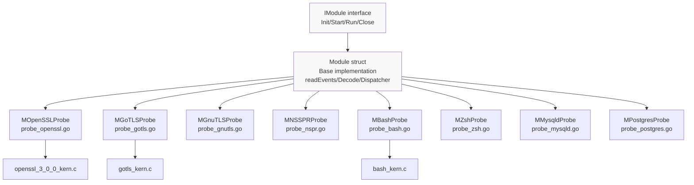
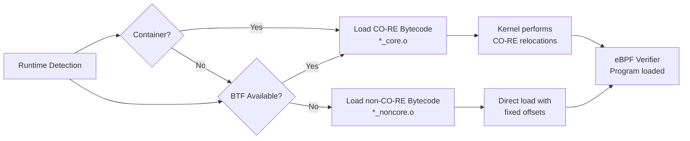
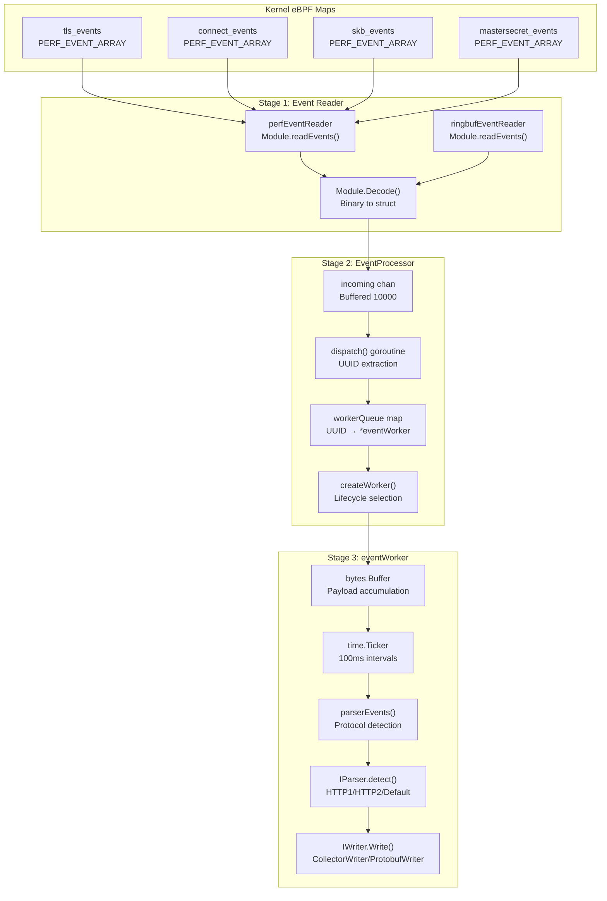
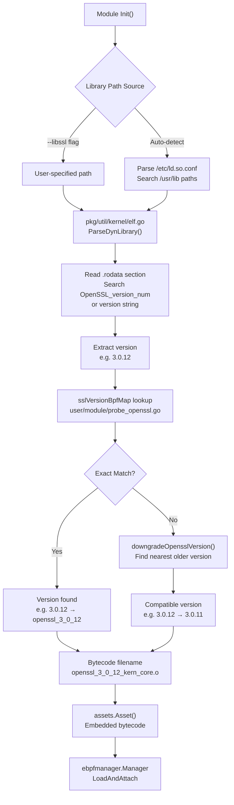

# Overview

<details>
<summary>Relevant source files</summary>

The following files were used as context for generating this wiki page:

- [CHANGELOG.md](https://github.com/gojue/ecapture/blob/ca085d05/CHANGELOG.md)
- [README.md](https://github.com/gojue/ecapture/blob/ca085d05/README.md)
- [README_CN.md](https://github.com/gojue/ecapture/blob/ca085d05/README_CN.md)
- [README_JA.md](https://github.com/gojue/ecapture/blob/ca085d05/README_JA.md)
- [images/ecapture-help-v0.8.9.svg](https://github.com/gojue/ecapture/blob/ca085d05/images/ecapture-help-v0.8.9.svg)
- [images/ecapture-logo.png](images/ecapture-logo.png)
- [main.go](https://github.com/gojue/ecapture/blob/ca085d05/main.go)
- [protobuf/PROTOCOLS.md](https://github.com/gojue/ecapture/blob/ca085d05/protobuf/PROTOCOLS.md)
- [protobuf/PROTOCOLS_CN.md](https://github.com/gojue/ecapture/blob/ca085d05/protobuf/PROTOCOLS_CN.md)
- [protobuf/README.md](https://github.com/gojue/ecapture/blob/ca085d05/protobuf/README.md)
- [protobuf/README_CN.md](https://github.com/gojue/ecapture/blob/ca085d05/protobuf/README_CN.md)
- [utils/protobuf_visualizer/README.md](https://github.com/gojue/ecapture/blob/ca085d05/utils/protobuf_visualizer/README.md)
- [utils/protobuf_visualizer/README_CN.md](https://github.com/gojue/ecapture/blob/ca085d05/utils/protobuf_visualizer/README_CN.md)

</details>


**eCapture (旁观者)** is an eBPF-based network traffic capture and system auditing tool that intercepts SSL/TLS encrypted communications in plaintext without requiring CA certificates or application modifications. The tool uses kernel-level uprobe, kprobe, and Traffic Control (TC) hooks to capture data at encryption boundaries, supporting multiple SSL/TLS library implementations and providing comprehensive system auditing capabilities.

This page provides a high-level overview of eCapture's purpose, architecture, and capabilities. For installation instructions, see [Installation and Quick Start](1.1-installation-and-quick-start.md). For detailed architectural information, see [Architecture](../2-architecture/index.md). For module-specific documentation, see [Capture Modules](../3-capture-modules/index.md).

---

## Purpose and Scope

eCapture solves the problem of inspecting encrypted network traffic and auditing system activities without:

- Installing CA certificates in target applications
- Modifying application source code or configuration
- Performing man-in-the-middle attacks at the network layer
- Requiring application restarts or environment variable injection

The tool operates entirely through eBPF programs loaded into the Linux kernel, intercepting function calls at the user-space/kernel-space boundary to capture plaintext data before encryption or after decryption.

**Sources:** [README.md:1-44](https://github.com/gojue/ecapture/blob/ca085d05/README.md#L1-L44), [README_CN.md:1-43](https://github.com/gojue/ecapture/blob/ca085d05/README_CN.md#L1-L43), [CHANGELOG.md:188-282](https://github.com/gojue/ecapture/blob/ca085d05/CHANGELOG.md#L188-L282)

---

## Core Capabilities

eCapture provides eight distinct capture modules organized by function:

| Module | Purpose | Primary Hook Points | Supported Versions |
|--------|---------|-------------------|-------------------|
| `tls` | OpenSSL/BoringSSL TLS capture | `SSL_read`, `SSL_write`, `SSL_do_handshake` | OpenSSL 1.0.2-3.5.x, BoringSSL Android 12-16 |
| `gotls` | Go crypto/tls capture | `crypto/tls.(*Conn).Write`, `crypto/tls.(*Conn).Read` | Go 1.x with register/stack ABI |
| `gnutls` | GnuTLS library capture | `gnutls_record_recv`, `gnutls_record_send` | GnuTLS 3.x |
| `nss` | NSS/NSPR library capture | `PR_Write`, `PR_Read`, `PR_Send`, `PR_Recv` | Firefox, Thunderbird |
| `bash` | Bash command auditing | `readline` library functions | Bash 4.x-5.x |
| `zsh` | Zsh command auditing | `zle_line_finish` function | Zsh 5.x |
| `mysqld` | MySQL query auditing | `dispatch_command` function | MySQL 5.6/5.7/8.0, MariaDB |
| `postgres` | PostgreSQL query auditing | `exec_simple_query` function | PostgreSQL 10+ |

Each module operates independently and can be enabled through the CLI command structure defined in [cli/cmd/root.go](https://github.com/gojue/ecapture/blob/ca085d05/cli/cmd/root.go).

**Sources:** [README.md:152-161](https://github.com/gojue/ecapture/blob/ca085d05/README.md#L152-L161), [README_CN.md:129-137](https://github.com/gojue/ecapture/blob/ca085d05/README_CN.md#L129-L137), [CHANGELOG.md:188-282](https://github.com/gojue/ecapture/blob/ca085d05/CHANGELOG.md#L188-L282)

---

## System Architecture Overview

The following diagram shows the complete eCapture system architecture from CLI invocation to event output:

**Diagram: Five-Layer eCapture Architecture**

```mermaid
graph TB
    subgraph CLI["1. CLI Layer"]
        Main["main.go<br/>cli.Start()"]
        RootCmd["cli/cmd/root.go<br/>rootCmd Execute()"]
        TLSCmd["cli/cmd/tls.go<br/>tlsCommand"]
        GoTLSCmd["cli/cmd/gotls.go<br/>gotlsCommand"]
        BashCmd["cli/cmd/bash.go<br/>bashCommand"]
    end
    
    subgraph ModOrch["2. Module Orchestration"]
        IModule["IModule Interface<br/>Init/Start/Run/Close"]
        BaseModule["Module struct<br/>Base implementation"]
        OpenSSLProbe["MOpenSSLProbe"]
        GoTLSProbe["MGoTLSProbe"]
        BashProbe["MBashProbe"]
        MysqldProbe["MMysqldProbe"]
        PostgresProbe["MPostgresProbe"]
        GnuTLSProbe["MGnuTLSProbe"]
        NSSProbe["MNSSPRProbe"]
        ZshProbe["MZshProbe"]
    end
    
    subgraph eBPFExec["3. eBPF Execution"]
        Manager["ebpfmanager.Manager<br/>Program loading"]
        BytecodeAssets["assets/ebpf_probe.go<br/>Asset() function"]
        CoreBC["*_kern_core.o<br/>BTF-enabled"]
        NonCoreBC["*_kern_noncore.o<br/>Fixed offsets"]
        Uprobes["Uprobe attachment<br/>SSL_read/write"]
        Kprobes["Kprobe attachment<br/>tcp_sendmsg"]
        TC["TC attachment<br/>egress/ingress"]
    end
    
    subgraph EventProc["4. Event Processing"]
        PerfReader["perfEventReader<br/>Module.readEvents()"]
        EventProc["EventProcessor<br/>Dispatch goroutine"]
        WorkerQueue["workerQueue map<br/>UUID to eventWorker"]
        EventWorker["eventWorker<br/>Per-connection state"]
        Parsers["IParser<br/>HTTP1/HTTP2/Default"]
    end
    
    subgraph Output["5. Output Layer"]
        CollectorWriter["CollectorWriter<br/>zerolog format"]
        ProtobufWriter["ProtobufWriter<br/>pb.LogEntry"]
        PcapngWriter["PcapngWriter<br/>DSB blocks"]
        KeylogWriter["KeylogWriter<br/>CLIENT_RANDOM"]
        WebSocket["WebSocket Server<br/>:28256/:28257"]
    end
    
    Main --> RootCmd
    RootCmd --> TLSCmd
    RootCmd --> GoTLSCmd
    RootCmd --> BashCmd
    
    TLSCmd --> OpenSSLProbe
    GoTLSCmd --> GoTLSProbe
    BashCmd --> BashProbe
    
    OpenSSLProbe --> IModule
    GoTLSProbe --> IModule
    BashProbe --> IModule
    MysqldProbe --> IModule
    PostgresProbe --> IModule
    GnuTLSProbe --> IModule
    NSSProbe --> IModule
    ZshProbe --> IModule
    
    IModule --> BaseModule
    
    BaseModule --> Manager
    Manager --> BytecodeAssets
    BytecodeAssets --> CoreBC
    BytecodeAssets --> NonCoreBC
    
    Manager --> Uprobes
    Manager --> Kprobes
    Manager --> TC
    
    Uprobes --> PerfReader
    Kprobes --> PerfReader
    TC --> PerfReader
    
    PerfReader --> EventProc
    EventProc --> WorkerQueue
    WorkerQueue --> EventWorker
    EventWorker --> Parsers
    
    Parsers --> CollectorWriter
    Parsers --> ProtobufWriter
    Parsers --> PcapngWriter
    Parsers --> KeylogWriter
    
    ProtobufWriter --> WebSocket
```

**Architecture Description:**

The system follows a five-layer design:

1. **CLI Layer**: Entry point via `main.go` calling `cli.Start()`, which executes `rootCmd` from [cli/cmd/root.go](https://github.com/gojue/ecapture/blob/ca085d05/cli/cmd/root.go) using the cobra framework. Each subcommand (tls, gotls, bash, etc.) is defined in [cli/cmd/](https://github.com/gojue/ecapture/blob/ca085d05/cli/cmd/).

2. **Module Orchestration**: All capture modules implement the `IModule` interface [user/module/imodule.go](https://github.com/gojue/ecapture/blob/ca085d05/user/module/imodule.go) with lifecycle methods `Init()`, `Start()`, `Run()`, and `Close()`. The `Module` base struct [user/module/module.go](https://github.com/gojue/ecapture/blob/ca085d05/user/module/module.go) provides common functionality including event reading and configuration management. Eight probe implementations extend this base.

3. **eBPF Execution**: The `ebpfmanager.Manager` [pkg/util/ebpf/manager.go](https://github.com/gojue/ecapture/blob/ca085d05/pkg/util/ebpf/manager.go) loads bytecode from [assets/ebpf_probe.go](https://github.com/gojue/ecapture/blob/ca085d05/assets/ebpf_probe.go) using the `Asset()` function. Bytecode comes in two variants: CO-RE (requires BTF) and non-CO-RE. Programs attach as uprobes (SSL_read/SSL_write), kprobes (tcp_sendmsg), or TC classifiers (network packets).

4. **Event Processing**: The `perfEventReader` in each module's `readEvents()` method polls perf/ring buffers. Events are dispatched to `EventProcessor` [pkg/event_processor/processor.go](https://github.com/gojue/ecapture/blob/ca085d05/pkg/event_processor/processor.go), which routes them via UUID to dedicated `eventWorker` goroutines. Workers invoke `IParser` implementations for protocol detection.

5. **Output Layer**: Four writer types format events: `CollectorWriter` (zerolog), `ProtobufWriter` (pb.LogEntry), `PcapngWriter` (PCAP-NG with DSB), and `KeylogWriter` (SSLKEYLOGFILE). The `ProtobufWriter` feeds WebSocket servers on ports 28256/28257.

**Sources:** [main.go:1-11](https://github.com/gojue/ecapture/blob/ca085d05/main.go#L1-L11), [cli/cmd/root.go](https://github.com/gojue/ecapture/blob/ca085d05/cli/cmd/root.go), [user/module/imodule.go](https://github.com/gojue/ecapture/blob/ca085d05/user/module/imodule.go), [user/module/module.go](https://github.com/gojue/ecapture/blob/ca085d05/user/module/module.go), [pkg/util/ebpf/manager.go](https://github.com/gojue/ecapture/blob/ca085d05/pkg/util/ebpf/manager.go), [pkg/event_processor/processor.go](https://github.com/gojue/ecapture/blob/ca085d05/pkg/event_processor/processor.go), [assets/ebpf_probe.go](https://github.com/gojue/ecapture/blob/ca085d05/assets/ebpf_probe.go)

---

## Key Components and Code Structure

### Module System

All capture modules implement the `IModule` interface defined in [user/module/imodule.go](https://github.com/gojue/ecapture/blob/ca085d05/user/module/imodule.go), which provides a common lifecycle:

```
Init(ctx, logger, conf) → Start() → Run() → Close()
```

The base implementation is provided by the `Module` struct [user/module/module.go](https://github.com/gojue/ecapture/blob/ca085d05/user/module/module.go), which each probe extends. Each module has a corresponding CLI command in [cli/cmd/](https://github.com/gojue/ecapture/blob/ca085d05/cli/cmd/) and eBPF bytecode in [kern/](https://github.com/gojue/ecapture/blob/ca085d05/kern/).

**Diagram: Module Implementation Hierarchy**


```mermaid
graph TB
    IModule["IModule interface<br/>Init/Start/Run/Close"]
    Module["Module struct<br/>Base implementation<br/>readEvents/Decode/Dispatcher"]
    
    OpenSSL["MOpenSSLProbe<br/>probe_openssl.go"]
    GoTLS["MGoTLSProbe<br/>probe_gotls.go"]
    GnuTLS["MGnuTLSProbe<br/>probe_gnutls.go"]
    NSS["MNSSPRProbe<br/>probe_nspr.go"]
    Bash["MBashProbe<br/>probe_bash.go"]
    Zsh["MZshProbe<br/>probe_zsh.go"]
    Mysqld["MMysqldProbe<br/>probe_mysqld.go"]
    Postgres["MPostgresProbe<br/>probe_postgres.go"]
    
    IModule --> Module
    Module --> OpenSSL
    Module --> GoTLS
    Module --> GnuTLS
    Module --> NSS
    Module --> Bash
    Module --> Zsh
    Module --> Mysqld
    Module --> Postgres
    
    OpenSSL --> ByteOpenSSL["openssl_3_0_0_kern.c"]
    GoTLS --> ByteGoTLS["gotls_kern.c"]
    Bash --> ByteBash["bash_kern.c"]
    
    style IModule fill:#f9f9f9
    style Module fill:#f9f9f9
```

| Probe Struct | Source File | eBPF Bytecode | Primary Hooks | Supported Versions |
|--------------|------------|---------------|---------------|-------------------|
| `MOpenSSLProbe` | [user/module/probe_openssl.go](https://github.com/gojue/ecapture/blob/ca085d05/user/module/probe_openssl.go) | [kern/openssl_*_kern.c]() | SSL_read, SSL_write, SSL_do_handshake, SSL_get_wbio, SSL_in_before | OpenSSL 1.0.2-3.5.x, BoringSSL Android 12-16 |
| `MGoTLSProbe` | [user/module/probe_gotls.go](https://github.com/gojue/ecapture/blob/ca085d05/user/module/probe_gotls.go) | [kern/gotls_kern.c](https://github.com/gojue/ecapture/blob/ca085d05/kern/gotls_kern.c) | crypto/tls.(*Conn).writeRecordLocked, crypto/tls.(*Conn).Read, crypto/tls.(*Conn).writeKeyLog | Go 1.x (register/stack ABI) |
| `MGnuTLSProbe` | [user/module/probe_gnutls.go](https://github.com/gojue/ecapture/blob/ca085d05/user/module/probe_gnutls.go) | [kern/gnutls_kern.c](https://github.com/gojue/ecapture/blob/ca085d05/kern/gnutls_kern.c) | gnutls_record_recv, gnutls_record_send | GnuTLS 3.x |
| `MNSSPRProbe` | [user/module/probe_nspr.go](https://github.com/gojue/ecapture/blob/ca085d05/user/module/probe_nspr.go) | [kern/nspr_kern.c](https://github.com/gojue/ecapture/blob/ca085d05/kern/nspr_kern.c) | PR_Write, PR_Read, PR_Send, PR_Recv | Firefox, Thunderbird |
| `MBashProbe` | [user/module/probe_bash.go](https://github.com/gojue/ecapture/blob/ca085d05/user/module/probe_bash.go) | [kern/bash_kern.c](https://github.com/gojue/ecapture/blob/ca085d05/kern/bash_kern.c) | readline() | Bash 4.x-5.x |
| `MZshProbe` | [user/module/probe_zsh.go](https://github.com/gojue/ecapture/blob/ca085d05/user/module/probe_zsh.go) | [kern/zsh_kern.c](https://github.com/gojue/ecapture/blob/ca085d05/kern/zsh_kern.c) | zle_line_finish() | Zsh 5.x |
| `MMysqldProbe` | [user/module/probe_mysqld.go](https://github.com/gojue/ecapture/blob/ca085d05/user/module/probe_mysqld.go) | [kern/mysqld_kern.c](https://github.com/gojue/ecapture/blob/ca085d05/kern/mysqld_kern.c) | dispatch_command() | MySQL 5.6/5.7/8.0, MariaDB |
| `MPostgresProbe` | [user/module/probe_postgres.go](https://github.com/gojue/ecapture/blob/ca085d05/user/module/probe_postgres.go) | [kern/postgres_kern.c](https://github.com/gojue/ecapture/blob/ca085d05/kern/postgres_kern.c) | exec_simple_query() | PostgreSQL 10+ |

**Sources:** [user/module/imodule.go](https://github.com/gojue/ecapture/blob/ca085d05/user/module/imodule.go), [user/module/module.go](https://github.com/gojue/ecapture/blob/ca085d05/user/module/module.go), [user/module/probe_openssl.go](https://github.com/gojue/ecapture/blob/ca085d05/user/module/probe_openssl.go), [user/module/probe_gotls.go](https://github.com/gojue/ecapture/blob/ca085d05/user/module/probe_gotls.go), [kern/openssl_3_0_0_kern.c](https://github.com/gojue/ecapture/blob/ca085d05/kern/openssl_3_0_0_kern.c), [kern/gotls_kern.c](https://github.com/gojue/ecapture/blob/ca085d05/kern/gotls_kern.c)

### eBPF Bytecode Management

eCapture compiles eBPF programs at build time into two variants:

- **CO-RE (Compile Once, Run Everywhere)**: Uses BTF for kernel structure relocations, files named `*_core.o`
- **Non-CO-RE**: Compiled against specific kernel headers, files named `*_noncore.o`

At runtime, the system detects kernel BTF support [pkg/util/kernel/btf.go](https://github.com/gojue/ecapture/blob/ca085d05/pkg/util/kernel/btf.go) and selects the appropriate bytecode from embedded assets [assets/ebpf_probe.go](https://github.com/gojue/ecapture/blob/ca085d05/assets/ebpf_probe.go):


```mermaid
flowchart LR
    Runtime["Runtime Detection"] --> Container{Container?}
    Runtime --> BTFCheck{BTF Available?}
    
    Container -->|Yes| CoreMode["Load CO-RE Bytecode<br/>*_core.o"]
    Container -->|No| BTFCheck
    
    BTFCheck -->|Yes| CoreMode
    BTFCheck -->|No| NonCoreMode["Load non-CO-RE Bytecode<br/>*_noncore.o"]
    
    CoreMode --> Relocate["Kernel performs<br/>CO-RE relocations"]
    NonCoreMode --> DirectLoad["Direct load with<br/>fixed offsets"]
    
    Relocate --> KernelLoad["eBPF Verifier<br/>Program loaded"]
    DirectLoad --> KernelLoad
```

The bytecode files are embedded during the build process via `go-bindata` [Makefile](https://github.com/gojue/ecapture/blob/ca085d05/Makefile) and accessed through [assets/ebpf_probe.go](https://github.com/gojue/ecapture/blob/ca085d05/assets/ebpf_probe.go).

**Sources:** [assets/ebpf_probe.go](https://github.com/gojue/ecapture/blob/ca085d05/assets/ebpf_probe.go), [pkg/util/kernel/btf.go](https://github.com/gojue/ecapture/blob/ca085d05/pkg/util/kernel/btf.go), [Makefile](https://github.com/gojue/ecapture/blob/ca085d05/Makefile)

### Event Processing Pipeline

The event processing architecture uses a three-stage pipeline with UUID-based routing to ensure ordered processing of events from the same connection.

**Diagram: Event Flow from Kernel to Output**


```mermaid
graph TB
    subgraph KernelMaps["Kernel eBPF Maps"]
        TLSEvents["tls_events<br/>PERF_EVENT_ARRAY"]
        ConnEvents["connect_events<br/>PERF_EVENT_ARRAY"]
        SkbEvents["skb_events<br/>PERF_EVENT_ARRAY"]
        MasterSecretEvents["mastersecret_events<br/>PERF_EVENT_ARRAY"]
    end
    
    subgraph ReaderStage["Stage 1: Event Reader"]
        PerfReader["perfEventReader<br/>Module.readEvents()"]
        RingReader["ringbufEventReader<br/>Module.readEvents()"]
        Decode["Module.Decode()<br/>Binary to struct"]
    end
    
    subgraph ProcessorStage["Stage 2: EventProcessor"]
        Incoming["incoming chan<br/>Buffered 10000"]
        Dispatch["dispatch() goroutine<br/>UUID extraction"]
        WorkerQueue["workerQueue map<br/>UUID → *eventWorker"]
        WorkerCreate["createWorker()<br/>Lifecycle selection"]
    end
    
    subgraph WorkerStage["Stage 3: eventWorker"]
        Buffer["bytes.Buffer<br/>Payload accumulation"]
        Ticker["time.Ticker<br/>100ms intervals"]
        ParserEvents["parserEvents()<br/>Protocol detection"]
        IParser["IParser.detect()<br/>HTTP1/HTTP2/Default"]
        IWriter["IWriter.Write()<br/>CollectorWriter/ProtobufWriter"]
    end
    
    TLSEvents --> PerfReader
    ConnEvents --> PerfReader
    SkbEvents --> PerfReader
    MasterSecretEvents --> PerfReader
    
    PerfReader --> Decode
    RingReader --> Decode
    
    Decode --> Incoming
    Incoming --> Dispatch
    Dispatch --> WorkerQueue
    WorkerQueue --> WorkerCreate
    
    WorkerCreate --> Buffer
    Buffer --> Ticker
    Ticker --> ParserEvents
    ParserEvents --> IParser
    IParser --> IWriter
```

**Pipeline Stages:**

1. **Event Reader**: Module's `readEvents()` method polls perf/ring buffers using `perfEventReader` or `ringbufEventReader`. Raw events are decoded via `Module.Decode()` into typed structs (`SSLDataEvent`, `ConnDataEvent`, etc.) defined in [user/module/event_type.go](https://github.com/gojue/ecapture/blob/ca085d05/user/module/event_type.go).

2. **EventProcessor**: The `incoming` channel buffers up to 10,000 events. The `dispatch()` goroutine extracts UUIDs from events and routes them to the `workerQueue` map. If no worker exists for a UUID, `createWorker()` instantiates one with either socket-bound or default lifecycle.

3. **eventWorker**: Each worker accumulates payloads in a `bytes.Buffer` and triggers parsing every 100ms via a `time.Ticker`. The `parserEvents()` method invokes `IParser.detect()` for protocol identification, then writes formatted output via `IWriter.Write()`.

**Worker Lifecycle Models:**

- **Socket-bound workers**: Created for TCP connections with explicit open/close events. Workers persist until receiving a close event.
- **Default workers**: Created for connectionless protocols or single-shot events. Workers self-destruct after 1 second of inactivity.

**Sources:** [pkg/event_processor/processor.go](https://github.com/gojue/ecapture/blob/ca085d05/pkg/event_processor/processor.go), [pkg/event_processor/iworker.go](https://github.com/gojue/ecapture/blob/ca085d05/pkg/event_processor/iworker.go), [user/module/event_type.go](https://github.com/gojue/ecapture/blob/ca085d05/user/module/event_type.go), [user/module/module.go](https://github.com/gojue/ecapture/blob/ca085d05/user/module/module.go)

---

## Version Detection and Bytecode Selection

eCapture automatically detects SSL library versions through ELF parsing and selects compatible bytecode at runtime.

**Diagram: Version Detection and Bytecode Mapping**


```mermaid
flowchart TB
    Init["Module Init()"] --> LibPath{Library Path Source}
    
    LibPath -->|--libssl flag| UserPath["User-specified path"]
    LibPath -->|Auto-detect| LdConf["Parse /etc/ld.so.conf<br/>Search /usr/lib paths"]
    
    UserPath --> ElfParse["pkg/util/kernel/elf.go<br/>ParseDynLibrary()"]
    LdConf --> ElfParse
    
    ElfParse --> ReadSection["Read .rodata section<br/>Search OpenSSL_version_num<br/>or version string"]
    
    ReadSection --> VersionString["Extract version<br/>e.g. 3.0.12"]
    
    VersionString --> MapLookup["sslVersionBpfMap lookup<br/>user/module/probe_openssl.go"]
    
    MapLookup --> Exact{Exact Match?}
    
    Exact -->|Yes| Found["Version found<br/>e.g. 3.0.12 → openssl_3_0_12"]
    Exact -->|No| Downgrade["downgradeOpensslVersion()<br/>Find nearest older version"]
    
    Downgrade --> Compatible["Compatible version<br/>e.g. 3.0.12 → 3.0.11"]
    
    Found --> BytecodeFile["Bytecode filename<br/>openssl_3_0_12_kern_core.o"]
    Compatible --> BytecodeFile
    
    BytecodeFile --> Asset["assets.Asset()<br/>Embedded bytecode"]
    
    Asset --> Manager["ebpfmanager.Manager<br/>LoadAndAttach"]
```

**Version Mapping Strategy:**

The `sslVersionBpfMap` in [user/module/probe_openssl.go](https://github.com/gojue/ecapture/blob/ca085d05/user/module/probe_openssl.go) groups library versions by internal structure compatibility:

- **OpenSSL 1.0.2**: All 1.0.2a-u variants use `openssl_1_0_2a_kern.o` (26 versions → 1 file)
- **OpenSSL 1.1.0**: All 1.1.0a-l variants use `openssl_1_1_0a_kern.o` (12 versions → 1 file)
- **OpenSSL 1.1.1**: Subdivided into groups (1.1.1d-j, 1.1.1k-w) based on structure offsets
- **OpenSSL 3.0-3.5**: Each minor version has dedicated bytecode due to frequent structure changes

**Version Downgrade Logic:**

When an exact version match fails, `downgradeOpensslVersion()` [user/module/probe_openssl.go](https://github.com/gojue/ecapture/blob/ca085d05/user/module/probe_openssl.go) performs backward compatibility search. For example, OpenSSL 3.0.13 (unknown) falls back to 3.0.12 bytecode if structures remain compatible.

**Special Cases:**

- **BoringSSL**: Version detection reads Android system properties or library metadata. Supported versions: Android 12, 13, 14, 15, 16.
- **Go TLS**: No version detection required. ABI detection determines register vs. stack calling convention (Go 1.17+ uses register ABI).
- **Static binaries**: The `--libssl` flag must point directly to the executable, which eCapture treats as if it were a shared library.

**Supported Version Ranges (as of v1.5.2):**

- **OpenSSL**: 1.0.2a-u, 1.1.0a-l, 1.1.1a-w, 3.0.0-3.5.4
- **BoringSSL**: Android 12, 13, 14, 15, 16
- **GnuTLS**: 3.x series
- **NSS/NSPR**: Firefox 60+, Thunderbird
- **Go TLS**: All Go versions with ABI auto-detection

**Sources:** [user/module/probe_openssl.go](https://github.com/gojue/ecapture/blob/ca085d05/user/module/probe_openssl.go), [pkg/util/kernel/elf.go](https://github.com/gojue/ecapture/blob/ca085d05/pkg/util/kernel/elf.go), [assets/ebpf_probe.go](https://github.com/gojue/ecapture/blob/ca085d05/assets/ebpf_probe.go), [CHANGELOG.md:23-32](https://github.com/gojue/ecapture/blob/ca085d05/CHANGELOG.md#L23-L32)

---

## Output Format Overview

eCapture supports four distinct output formats, each designed for different use cases:

### Text Mode

Direct plaintext output to console or file, with optional hex encoding. Default mode for all modules except when explicitly overridden.

**Configuration:** `-m text` (default), `--output_file` for file destination

### PCAP/PCAPNG Mode

Reconstructs network packets with plaintext payload and embeds TLS master secrets in Decryption Secrets Block (DSB). Compatible with Wireshark for protocol analysis.

**Configuration:** `-m pcap` or `-m pcapng`, `--pcapfile` (default: `ecapture_openssl.pcapng`), `-i` interface

**File Structure:**
```
Section Header Block (SHB)
Interface Description Block (IDB)
Decryption Secrets Block (DSB) - TLS keys
Enhanced Packet Block (EPB) - Per packet
```

Implementation in [pkg/util/pcapng/](https://github.com/gojue/ecapture/blob/ca085d05/pkg/util/pcapng/)

### Keylog Mode

Extracts and saves TLS handshake keys in SSLKEYLOGFILE format, enabling offline decryption with Wireshark or tshark.

**Configuration:** `-m keylog`, `--keylogfile` (default: `ecapture_masterkey.log`)

**Format:**
```
CLIENT_RANDOM <32-byte hex> <48-byte hex master secret>
```

### Protobuf Stream Mode

Real-time event streaming using Protocol Buffers over WebSocket or HTTP. Primary format for eCaptureQ GUI integration.

**Configuration:** HTTP API server on `localhost:28256` (default)

**Event Types:** Defined in [protobuf/event.proto](https://github.com/gojue/ecapture/blob/ca085d05/protobuf/event.proto), includes `SSLDataEvent`, `ConnDataEvent`, `MasterSecretEvent`

See [Output Formats](../4-output-formats/index.md) for detailed documentation on each format.

**Sources:** [pkg/util/pcapng/](https://github.com/gojue/ecapture/blob/ca085d05/pkg/util/pcapng/), [protobuf/event.proto](https://github.com/gojue/ecapture/blob/ca085d05/protobuf/event.proto), [pkg/api/server.go](https://github.com/gojue/ecapture/blob/ca085d05/pkg/api/server.go)

---

## Deployment Targets and Requirements

### Linux Systems

| Architecture | Minimum Kernel | BTF Required | Recommended Kernel | Notes |
|-------------|----------------|--------------|-------------------|-------|
| x86_64 | 4.18 | Optional | 5.15+ with BTF | CO-RE mode requires BTF for kernel structure relocations |
| aarch64 | 5.5 | Optional | 5.15+ with BTF | ARM64 support added in v0.8.0, production-ready in v1.0.0 |

**Required Capabilities:**
- **Root access**: Simplest deployment method, provides all necessary capabilities
- **CAP_BPF + CAP_PERFMON + CAP_NET_ADMIN**: For kernel 5.8+, allows non-root operation
- **CAP_SYS_ADMIN**: Legacy capability for kernels < 5.8

**BTF Detection:**

BTF (BPF Type Format) support is detected at runtime via:
1. Check `/sys/kernel/btf/vmlinux` existence [pkg/util/kernel/btf.go](https://github.com/gojue/ecapture/blob/ca085d05/pkg/util/kernel/btf.go)
2. Verify `CONFIG_DEBUG_INFO_BTF=y` in kernel configuration
3. Container environments may require BTF to be bind-mounted from host

If BTF is unavailable, eCapture automatically falls back to non-CO-RE bytecode compiled with fixed kernel structure offsets.

**Sources:** [README.md:14-16](https://github.com/gojue/ecapture/blob/ca085d05/README.md#L14-L16), [pkg/util/kernel/btf.go](https://github.com/gojue/ecapture/blob/ca085d05/pkg/util/kernel/btf.go), [CHANGELOG.md:188-282](https://github.com/gojue/ecapture/blob/ca085d05/CHANGELOG.md#L188-L282)

### Android Systems

| Android Version | BoringSSL Support | Kernel Requirements |
|-----------------|-------------------|---------------------|
| 12-16 | Full support | 4.14+ with BTF |

**Deployment:** Requires rooted device or container environment (e.g., Redroid). See [Installation and Quick Start](1.1-installation-and-quick-start.md) for Android-specific instructions.

### Container Environments

eCapture runs in Docker with `--privileged=true` and `--net=host` flags:

```bash
docker run --rm --privileged=true --net=host \
  -v ${HOST_PATH}:${CONTAINER_PATH} \
  gojue/ecapture:latest tls
```

**Container Requirements:**

- `--privileged=true`: Grants container access to load eBPF programs
- `--net=host`: Allows direct access to host network interfaces for TC classifiers
- Volume mounts: Optional for output file persistence (PCAP, keylog files)

**BTF in Containers:**

Containers inherit kernel BTF from the host. If the host kernel has BTF enabled (`/sys/kernel/btf/vmlinux` exists), the container will use CO-RE bytecode. If BTF is unavailable, non-CO-RE bytecode is automatically selected.

**Image Contents:**

The `gojue/ecapture:latest` image includes:
- Both CO-RE and non-CO-RE bytecode for all modules
- Static libpcap library for PCAP generation
- Pre-compiled binaries for x86_64 and aarch64

See [Docker Hub](https://hub.docker.com/r/gojue/ecapture) for available tags and multi-arch support.

**Sources:** [README.md:63-68](https://github.com/gojue/ecapture/blob/ca085d05/README.md#L63-L68), [README_CN.md:62-67](https://github.com/gojue/ecapture/blob/ca085d05/README_CN.md#L62-L67)

---

## Use Cases and Applications

### Network Traffic Analysis

- **HTTPS decryption**: Inspect encrypted web traffic without CA certificates or browser extensions
- **API monitoring**: Capture REST/GraphQL API calls from applications using OpenSSL/BoringSSL
- **Protocol debugging**: Analyze HTTP/2 and QUIC protocol implementations with built-in parsers

### Security Auditing

- **Command history**: Track bash/zsh commands executed by users (compliance requirements)
- **Database auditing**: Log SQL queries from MySQL/PostgreSQL for security analysis
- **Insider threat detection**: Monitor encrypted communications from internal applications

### Development and Debugging

- **TLS troubleshooting**: Debug TLS handshake failures and cipher suite negotiations
- **Performance analysis**: Measure encryption overhead and data transfer patterns
- **Integration testing**: Verify API client/server communications during CI/CD

### Research and Forensics

- **Protocol analysis**: Study TLS 1.2/1.3 implementation differences across libraries
- **Malware analysis**: Examine C2 communications from compromised systems
- **Incident response**: Capture network activity during security incidents

The tool operates non-invasively, requiring no application restarts or configuration changes, making it suitable for production environments where traditional inspection methods are impractical.

**Sources:** [CHANGELOG.md:188-282](https://github.com/gojue/ecapture/blob/ca085d05/CHANGELOG.md#L188-L282), [README.md:36-44](https://github.com/gojue/ecapture/blob/ca085d05/README.md#L36-L44)

---

## System Limitations and Constraints

### Technical Limitations

- **Kernel Compatibility**: Requires Linux kernel ≥4.18 (x86_64) or ≥5.5 (aarch64)
- **Architecture Support**: Only x86_64 and aarch64; no 32-bit support
- **Privilege Requirements**: Must run as root or with `CAP_BPF`/`CAP_SYS_ADMIN` capabilities
- **Dynamic Linking**: Targets dynamically linked libraries; static binaries require `--libssl` path specification

### Operational Constraints

- **Performance Impact**: eBPF hooks add minimal overhead (<5% typically), but high-throughput scenarios may experience measurable latency
- **Memory Usage**: Perf/ring buffer maps consume kernel memory, configurable via `--mapsize` (default 5120 KB)
- **Event Loss**: If user-space processing cannot keep up with kernel event generation, events may be dropped

### Unsupported Scenarios

- **Windows/macOS**: eBPF is Linux-specific; no support for other operating systems
- **Custom SSL Libraries**: Requires known library versions; exotic or heavily modified SSL implementations may not work
- **Kernel-Mode TLS**: Cannot capture TLS offloaded to kernel (e.g., ktls)

See [Dependencies and System Requirements](1.3-dependencies-and-system-requirements.md) for detailed compatibility information.

**Sources:** [README.md:14-16](https://github.com/gojue/ecapture/blob/ca085d05/README.md#L14-L16), [pkg/util/ebpf/manager.go](https://github.com/gojue/ecapture/blob/ca085d05/pkg/util/ebpf/manager.go)

---

## Project Structure

The codebase is organized into functional directories:

```
ecapture/
├── cli/                    # Command-line interface (cobra framework)
│   └── cmd/               # Subcommands (tls, gotls, etc.)
├── user/                  # User-space capture logic
│   └── module/           # Capture module implementations
├── kern/                  # eBPF C programs (uprobe/kprobe/TC)
├── pkg/                   # Shared utilities
│   ├── event_processor/  # Event routing and parsing
│   ├── util/             # Kernel interaction, ELF parsing
│   └── api/              # HTTP API server
├── assets/               # Embedded eBPF bytecode
├── protobuf/             # Protocol buffer definitions
└── builder/              # Build scripts and Dockerfiles
```

For build system details, see [Build System](../5-development-guide/5.1-build-system.md). For adding new modules, see [Adding New Modules](../5-development-guide/5.3-adding-new-modules.md).

**Sources:** [main.go:1-12](https://github.com/gojue/ecapture/blob/ca085d05/main.go#L1-L12), [cli/cmd/](https://github.com/gojue/ecapture/blob/ca085d05/cli/cmd/), [user/module/](https://github.com/gojue/ecapture/blob/ca085d05/user/module/), [kern/](https://github.com/gojue/ecapture/blob/ca085d05/kern/)

---

This overview establishes the foundational understanding of eCapture's purpose, architecture, and capabilities. Subsequent sections of this documentation provide detailed technical specifications for each component and subsystem.