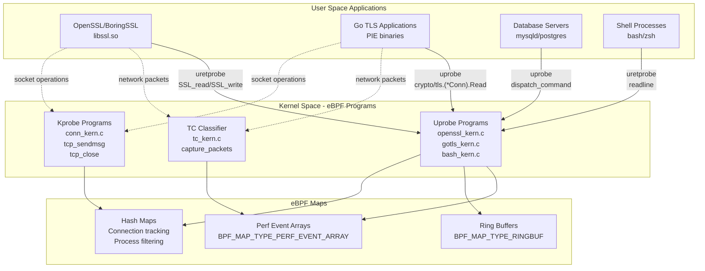
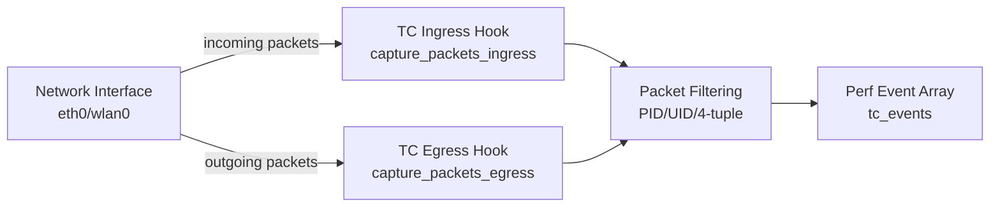
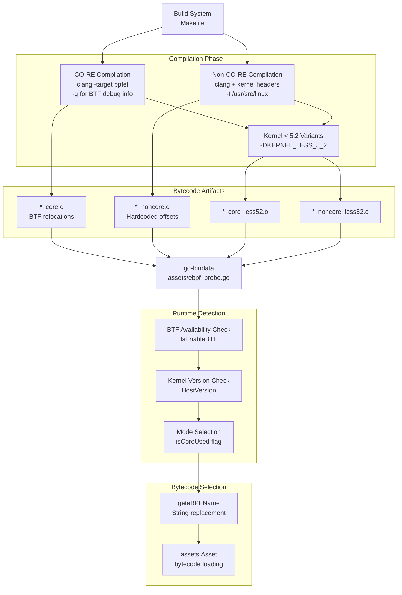
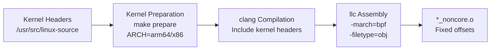
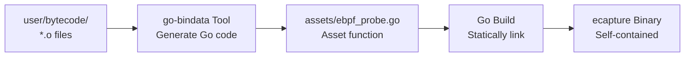
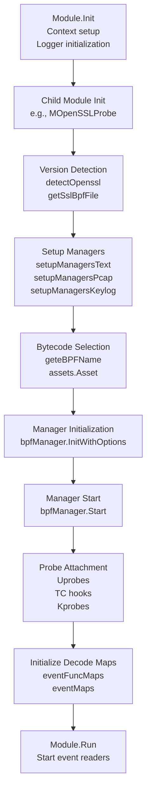
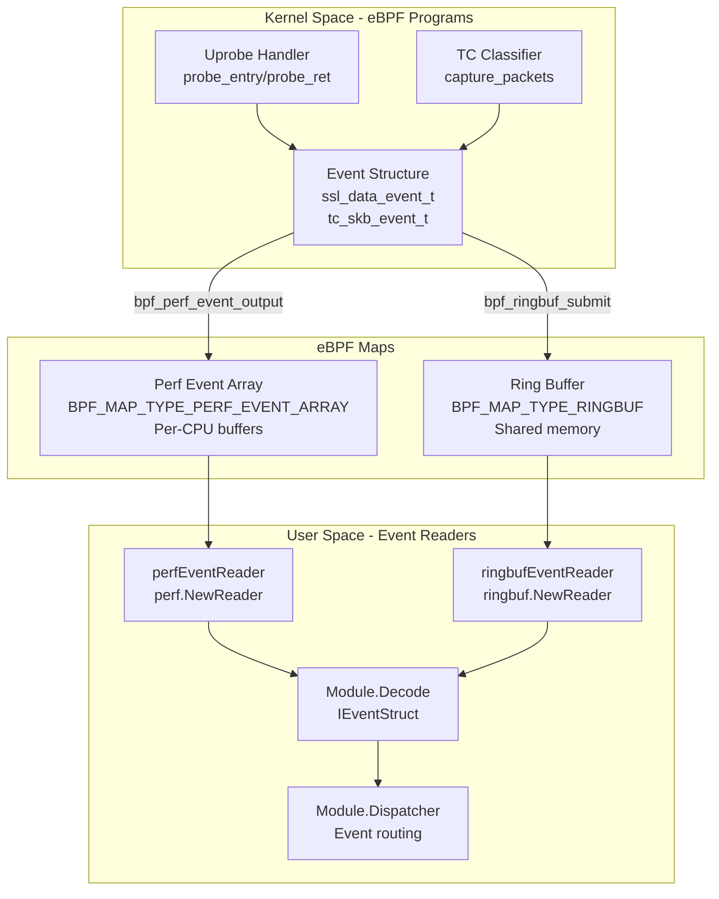
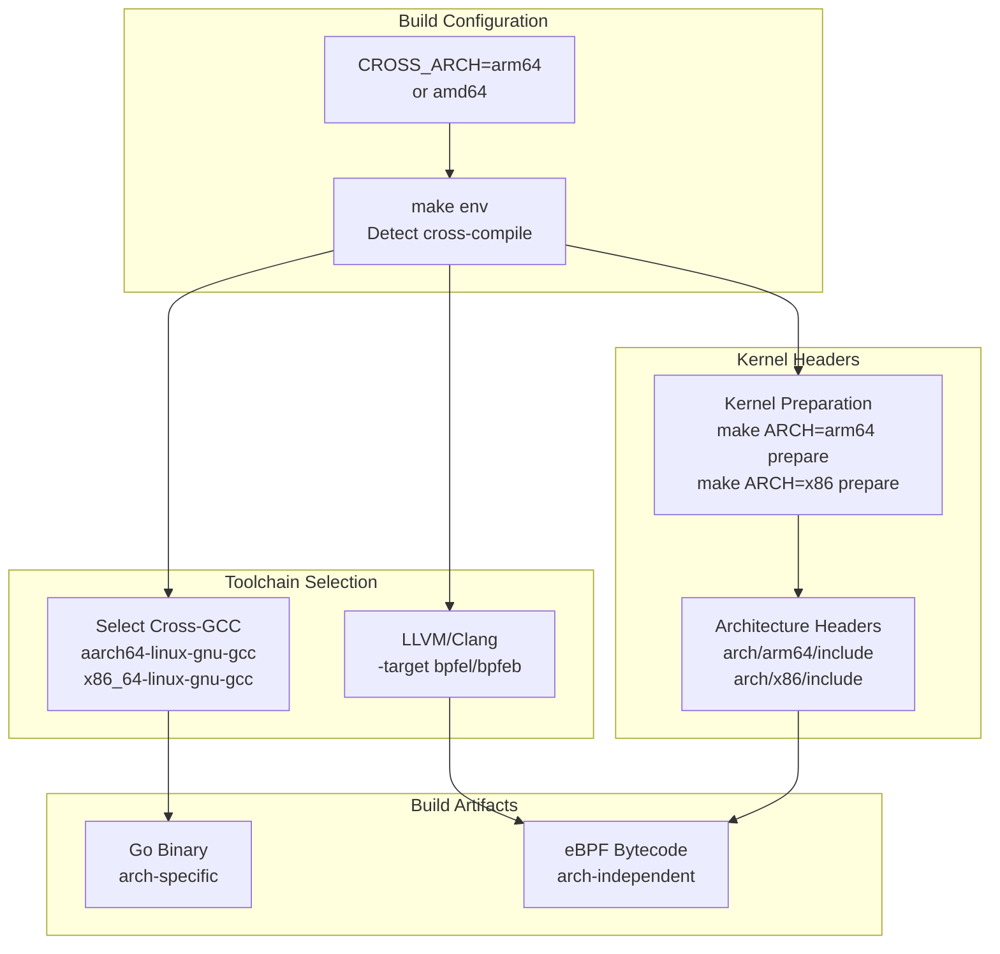

# eBPF Engine

<details>
<summary>Relevant source files</summary>

The following files were used as context for generating this wiki page:

- [.github/workflows/codeql-analysis.yml](https://github.com/gojue/ecapture/blob/0766a93b/.github/workflows/codeql-analysis.yml)
- [.github/workflows/go-c-cpp.yml](https://github.com/gojue/ecapture/blob/0766a93b/.github/workflows/go-c-cpp.yml)
- [.github/workflows/release.yml](https://github.com/gojue/ecapture/blob/0766a93b/.github/workflows/release.yml)
- [Makefile](https://github.com/gojue/ecapture/blob/0766a93b/Makefile)
- [builder/Dockerfile](https://github.com/gojue/ecapture/blob/0766a93b/builder/Dockerfile)
- [builder/Makefile.release](https://github.com/gojue/ecapture/blob/0766a93b/builder/Makefile.release)
- [builder/init_env.sh](https://github.com/gojue/ecapture/blob/0766a93b/builder/init_env.sh)
- [cli/cmd/root.go](https://github.com/gojue/ecapture/blob/0766a93b/cli/cmd/root.go)
- [functions.mk](https://github.com/gojue/ecapture/blob/0766a93b/functions.mk)
- [user/config/iconfig.go](https://github.com/gojue/ecapture/blob/0766a93b/user/config/iconfig.go)
- [user/module/imodule.go](https://github.com/gojue/ecapture/blob/0766a93b/user/module/imodule.go)
- [user/module/probe_openssl.go](https://github.com/gojue/ecapture/blob/0766a93b/user/module/probe_openssl.go)

</details>


The eBPF Engine is the foundational runtime layer of eCapture that manages the lifecycle of eBPF programs, handles kernel compatibility through CO-RE/non-CO-RE modes, and facilitates communication between kernel and user space. This document covers the technical implementation of eBPF program loading, BTF detection, bytecode selection, and event map management.

For information about how individual capture modules use the eBPF engine, see [Module System and Lifecycle](2.4-module-system-and-lifecycle.md). For details on version detection and bytecode mapping strategies, see [Version Detection and Bytecode Selection](2.5-version-detection-and-bytecode-selection.md). For event processing after eBPF maps deliver data to user space, see [Event Processing Pipeline](2.2-event-processing-pipeline.md).

## eBPF Program Types and Attachment

eCapture employs three primary eBPF program types to capture different aspects of system behavior:

**Program Type Architecture**



Sources: [Makefile:118-183](https://github.com/gojue/ecapture/blob/0766a93b/Makefile#L118-L183), [user/module/probe_openssl.go:83-106](https://github.com/gojue/ecapture/blob/0766a93b/user/module/probe_openssl.go#L83-L106)

### Uprobe Programs

Uprobes attach to user-space functions in dynamically linked libraries and executables. The primary use cases are:

| Function Hook | Purpose | eBPF Program |
|--------------|---------|--------------|
| `SSL_read` / `SSL_write` | Capture TLS plaintext | `openssl_kern.c` |
| `SSL_do_handshake` | Extract master secrets | `openssl_kern.c` |
| `crypto/tls.(*Conn).Read` | Go TLS capture | `gotls_kern.c` |
| `dispatch_command` | MySQL query audit | `mysqld_kern.c` |
| `readline` | Bash command audit | `bash_kern.c` |

The module manages uprobe attachment through `github.com/gojue/ebpfmanager`, which handles probe lifecycle, error recovery, and cleanup.

Sources: [user/module/probe_openssl.go:280-350](https://github.com/gojue/ecapture/blob/0766a93b/user/module/probe_openssl.go#L280-L350)

### TC (Traffic Control) Classifiers

TC eBPF programs attach to network interfaces at the Traffic Control layer, enabling packet-level capture with process attribution:



TC programs implement BPF cgroup socket filtering when a cgroup path is specified, and can apply Berkeley Packet Filter expressions for advanced filtering.

Sources: [user/module/probe_openssl.go:302-307](https://github.com/gojue/ecapture/blob/0766a93b/user/module/probe_openssl.go#L302-L307)

### Kprobe Programs

Kprobes attach to kernel functions for connection tracking and socket lifecycle monitoring:

- `tcp_sendmsg`: Correlate TCP connections to process IDs
- `tcp_close`: Detect connection termination
- `udp_sendmsg`: UDP connection tracking

The connection mapping enables TC programs to attribute packets to specific processes, which is critical for the PCAP output mode.

Sources: Architecture diagrams, common pattern in kernel tracing

## CO-RE and BTF Mode

eCapture implements a dual-compilation strategy to maximize kernel compatibility: CO-RE (Compile Once - Run Everywhere) for modern kernels with BTF support, and traditional non-CO-RE for older or custom kernels.

**Compilation and Runtime Mode Selection**



Sources: [Makefile:118-183](https://github.com/gojue/ecapture/blob/0766a93b/Makefile#L118-L183), [user/module/imodule.go:173-214](https://github.com/gojue/ecapture/blob/0766a93b/user/module/imodule.go#L173-L214)

### BTF (BPF Type Format)

BTF is a metadata format that describes the layout of kernel data structures, enabling eBPF programs to be portable across kernel versions. eCapture's BTF detection logic:

**BTF Detection Process**

| Step | Function | Location |
|------|----------|----------|
| 1. Container detection | `ebpfenv.IsContainer()` | [user/module/imodule.go:175-179](https://github.com/gojue/ecapture/blob/0766a93b/user/module/imodule.go#L175-L179) |
| 2. BTF availability check | `ebpfenv.IsEnableBTF()` | [user/module/imodule.go:180-186](https://github.com/gojue/ecapture/blob/0766a93b/user/module/imodule.go#L180-L186) |
| 3. Mode override | `conf.GetBTF()` | [user/module/imodule.go:154-164](https://github.com/gojue/ecapture/blob/0766a93b/user/module/imodule.go#L154-L164) |

BTF modes are defined in the configuration system:

```
BTFModeAutoDetect = 0  // Auto-detect (default)
BTFModeCore       = 1  // Force CO-RE mode
BTFModeNonCore    = 2  // Force non-CO-RE mode
```

Sources: [user/config/iconfig.go:82-86](https://github.com/gojue/ecapture/blob/0766a93b/user/config/iconfig.go#L82-L86), [user/module/imodule.go:154-190](https://github.com/gojue/ecapture/blob/0766a93b/user/module/imodule.go#L154-L190)

### CO-RE Compilation

CO-RE bytecode compilation uses LLVM's BTF generation and relocation capabilities:

**Compilation Flags**

```
clang -D__TARGET_ARCH_x86 \
      -target bpfel \           # Little-endian BPF target
      -fno-ident \              # Omit compiler identification
      -fdebug-compilation-dir . \
      -g \                       # Generate debug info (BTF)
      -D__BPF_TARGET_MISSING="..." \
      -MD -MP                    # Dependency generation
```

The resulting `*_core.o` files contain BTF information that the kernel's BTF loader uses to perform field offset relocations at load time.

Sources: [Makefile:122-134](https://github.com/gojue/ecapture/blob/0766a93b/Makefile#L122-L134), [.github/workflows/go-c-cpp.yml:42](https://github.com/gojue/ecapture/blob/0766a93b/.github/workflows/go-c-cpp.yml#L42)

### Non-CO-RE Compilation

Non-CO-RE mode requires kernel headers at compile time to determine exact structure offsets:

**Non-CO-RE Build Process**



The Makefile explicitly includes architecture-specific header paths:

```
-I $(KERN_SRC_PATH)/arch/$(LINUX_ARCH)/include
-I $(KERN_BUILD_PATH)/arch/$(LINUX_ARCH)/include/generated
-I $(KERN_SRC_PATH)/include
```

Sources: [Makefile:146-183](https://github.com/gojue/ecapture/blob/0766a93b/Makefile#L146-L183), [.github/workflows/go-c-cpp.yml:16-33](https://github.com/gojue/ecapture/blob/0766a93b/.github/workflows/go-c-cpp.yml#L16-L33)

### Kernel < 5.2 Support

Kernels older than 5.2.0 lack certain eBPF features (global variables, bounded loops). eCapture generates separate bytecode variants with the `KERNEL_LESS_5_2` macro defined:

```c
#ifdef KERNEL_LESS_5_2
    // Use alternative implementation without global variables
#else
    // Modern kernel implementation
#endif
```

The runtime detects kernel version and selects the appropriate suffix:

Sources: [Makefile:131-134](https://github.com/gojue/ecapture/blob/0766a93b/Makefile#L131-L134), [user/module/imodule.go:140-149](https://github.com/gojue/ecapture/blob/0766a93b/user/module/imodule.go#L140-L149), [user/module/imodule.go:208-211](https://github.com/gojue/ecapture/blob/0766a93b/user/module/imodule.go#L208-L211)

## Bytecode Asset Embedding

All compiled eBPF bytecode is embedded into the Go binary using `go-bindata`, eliminating runtime dependencies:

**Asset Embedding Pipeline**



The embedded assets are accessed via:

```go
byteBuf, err := assets.Asset("user/bytecode/openssl_3_2_0_kern_core.o")
```

This approach ensures the binary can run on any compatible system without requiring external bytecode files.

Sources: [Makefile:186-195](https://github.com/gojue/ecapture/blob/0766a93b/Makefile#L186-L195), [user/module/probe_openssl.go:310-317](https://github.com/gojue/ecapture/blob/0766a93b/user/module/probe_openssl.go#L310-L317)

## eBPF Program Lifecycle

The eBPF program lifecycle is managed through the `ebpfmanager` library, which provides a structured approach to loading, attaching, and managing multiple eBPF programs and maps.

**Module Initialization and Start Flow**



Sources: [user/module/imodule.go:110-171](https://github.com/gojue/ecapture/blob/0766a93b/user/module/imodule.go#L110-L171), [user/module/probe_openssl.go:109-176](https://github.com/gojue/ecapture/blob/0766a93b/user/module/probe_openssl.go#L109-L176), [user/module/probe_openssl.go:280-350](https://github.com/gojue/ecapture/blob/0766a93b/user/module/probe_openssl.go#L280-L350)

### Manager Initialization

The `ebpfmanager.Manager` structure centralizes eBPF program and map management:

**Manager Configuration**

```go
type MOpenSSLProbe struct {
    bpfManager        *manager.Manager
    bpfManagerOptions manager.Options
    eventFuncMaps     map[*ebpf.Map]event.IEventStruct
    eventMaps         []*ebpf.Map
}
```

The manager options include:

- **ConstantEditors**: Pass user-space values to eBPF (PID/UID filters)
- **Probes**: Define uprobe/kprobe attachment points
- **Maps**: Specify eBPF map configurations
- **ActivatedProbes**: Control which probes are enabled

Sources: [user/module/probe_openssl.go:83-106](https://github.com/gojue/ecapture/blob/0766a93b/user/module/probe_openssl.go#L83-L106), [user/module/probe_openssl.go:361-387](https://github.com/gojue/ecapture/blob/0766a93b/user/module/probe_openssl.go#L361-L387)

### Constant Editors

Constant editors allow passing configuration values from user space to eBPF programs:

```go
func (m *MOpenSSLProbe) constantEditor() []manager.ConstantEditor {
    return []manager.ConstantEditor{
        {
            Name:  "target_pid",
            Value: uint64(m.conf.GetPid()),
        },
        {
            Name:  "target_uid",
            Value: uint64(m.conf.GetUid()),
        },
    }
}
```

The eBPF program checks these constants for filtering:

```c
const volatile u64 target_pid = 0;
const volatile u64 target_uid = 0;

// In probe function:
if (target_pid != 0 && current_pid != target_pid) {
    return 0;  // Filter out
}
```

Sources: [user/module/probe_openssl.go:361-387](https://github.com/gojue/ecapture/blob/0766a93b/user/module/probe_openssl.go#L361-L387)

### Bytecode Loading

The bytecode selection algorithm considers multiple factors:

```go
func (m *Module) geteBPFName(filename string) string {
    var newFilename = filename
    
    // Select CO-RE vs non-CO-RE
    switch m.conf.GetByteCodeFileMode() {
    case config.ByteCodeFileCore:
        newFilename = strings.Replace(newFilename, ".o", "_core.o", 1)
    case config.ByteCodeFileNonCore:
        newFilename = strings.Replace(newFilename, ".o", "_noncore.o", 1)
    default:
        if m.isCoreUsed {
            newFilename = strings.Replace(newFilename, ".o", "_core.o", 1)
        } else {
            newFilename = strings.Replace(newFilename, ".o", "_noncore.o", 1)
        }
    }
    
    // Kernel version suffix
    if m.isKernelLess5_2 {
        newFilename = strings.Replace(newFilename, ".o", "_less52.o", 1)
    }
    
    return newFilename
}
```

This produces filenames like:
- `openssl_3_2_0_kern_core.o` (CO-RE, kernel >= 5.2)
- `openssl_3_2_0_kern_noncore.o` (non-CO-RE, kernel >= 5.2)
- `openssl_3_2_0_kern_core_less52.o` (CO-RE, kernel < 5.2)
- `openssl_3_2_0_kern_noncore_less52.o` (non-CO-RE, kernel < 5.2)

Sources: [user/module/imodule.go:191-214](https://github.com/gojue/ecapture/blob/0766a93b/user/module/imodule.go#L191-L214), [user/module/probe_openssl.go:311-312](https://github.com/gojue/ecapture/blob/0766a93b/user/module/probe_openssl.go#L311-L312)

### Manager Start

The `bpfManager.Start()` call performs:

1. Load eBPF programs into the kernel using the `bpf()` syscall
2. Verify program bytecode against the kernel's eBPF verifier
3. Attach probes to their target functions/tracepoints
4. Create and configure eBPF maps
5. Enable cgroup-based filtering if specified

If verification fails, the error includes verifier logs for debugging.

Sources: [user/module/probe_openssl.go:328-331](https://github.com/gojue/ecapture/blob/0766a93b/user/module/probe_openssl.go#L328-L331)

## eBPF Map Communication

eBPF maps are the primary mechanism for kernel-to-user space data transfer. eCapture uses two map types for events:

**Event Map Architecture**



Sources: [user/module/imodule.go:285-306](https://github.com/gojue/ecapture/blob/0766a93b/user/module/imodule.go#L285-L306), [user/module/imodule.go:308-391](https://github.com/gojue/ecapture/blob/0766a93b/user/module/imodule.go#L308-L391)

### Perf Event Arrays

Perf event arrays provide per-CPU ring buffers for high-throughput event delivery:

**Perf Event Reader Configuration**

| Parameter | Configuration | Location |
|-----------|---------------|----------|
| Map size | `conf.GetPerCpuMapSize()` | [user/module/imodule.go:309](https://github.com/gojue/ecapture/blob/0766a93b/user/module/imodule.go#L309) |
| Default size | 1024 * PAGE_SIZE per CPU | [cli/cmd/root.go:143](https://github.com/gojue/ecapture/blob/0766a93b/cli/cmd/root.go#L143) |
| Reader type | `perf.NewReader(em, size)` | [user/module/imodule.go:310](https://github.com/gojue/ecapture/blob/0766a93b/user/module/imodule.go#L310) |

The reader loop:

```go
func (m *Module) perfEventReader(errChan chan error, em *ebpf.Map) {
    rd, err := perf.NewReader(em, m.conf.GetPerCpuMapSize())
    // ...
    go func() {
        for {
            select {
            case <-m.ctx.Done():
                return
            default:
            }
            
            record, err := rd.Read()
            if record.LostSamples != 0 {
                m.logger.Warn().Uint64("lostSamples", record.LostSamples)
                continue
            }
            
            evt, err := m.child.Decode(em, record.RawSample)
            m.Dispatcher(evt)
        }
    }()
}
```

Sources: [user/module/imodule.go:308-351](https://github.com/gojue/ecapture/blob/0766a93b/user/module/imodule.go#L308-L351)

### Ring Buffers

Ring buffers (kernel >= 5.8) provide a shared memory region with better memory efficiency:

```go
func (m *Module) ringbufEventReader(errChan chan error, em *ebpf.Map) {
    rd, err := ringbuf.NewReader(em)
    // ...
    go func() {
        for {
            select {
            case <-m.ctx.Done():
                return
            default:
            }
            
            record, err := rd.Read()
            e, err := m.child.Decode(em, record.RawSample)
            m.Dispatcher(e)
        }
    }()
}
```

Ring buffers offer advantages:
- Better memory efficiency (single shared buffer vs per-CPU)
- Lower overhead for variable-sized events
- Guaranteed ordering within a single buffer

Sources: [user/module/imodule.go:353-391](https://github.com/gojue/ecapture/blob/0766a93b/user/module/imodule.go#L353-L391)

### Event Decoding

Each module registers decode functions for its maps:

```go
type MOpenSSLProbe struct {
    eventFuncMaps map[*ebpf.Map]event.IEventStruct
    eventMaps     []*ebpf.Map
}

func (m *MOpenSSLProbe) DecodeFun(p *ebpf.Map) (event.IEventStruct, bool) {
    fun, found := m.eventFuncMaps[em]
    return fun, found
}
```

The decode process:
1. Lookup decoder by map pointer
2. Clone the event structure template
3. Call `Decode([]byte)` to unmarshal binary data
4. Return typed event structure

Sources: [user/module/probe_openssl.go:389-396](https://github.com/gojue/ecapture/blob/0766a93b/user/module/probe_openssl.go#L389-L396), [user/module/imodule.go:393-406](https://github.com/gojue/ecapture/blob/0766a93b/user/module/imodule.go#L393-L406)

### Hash Maps for State

Hash maps store state that eBPF programs query or update:

**Common Hash Map Uses**

| Map Purpose | Key | Value | Usage |
|-------------|-----|-------|-------|
| Connection tracking | `(pid, fd)` | `(tuple, sock)` | Map FD to 4-tuple |
| Socket lookup | `sock` | `(pid, fd)` | Reverse mapping |
| PID filtering | `pid` | `1` | Whitelist processes |
| Master key dedup | `client_random` | `1` | Prevent duplicates |

Example from OpenSSL module:

```go
// User space state synchronized with eBPF maps
type MOpenSSLProbe struct {
    pidConns   map[uint32]map[uint32]ConnInfo  // pid -> (fd -> ConnInfo)
    sock2pidFd map[uint64][2]uint32            // sock -> (pid, fd)
}
```

Sources: [user/module/probe_openssl.go:90-94](https://github.com/gojue/ecapture/blob/0766a93b/user/module/probe_openssl.go#L90-L94), [user/module/probe_openssl.go:398-480](https://github.com/gojue/ecapture/blob/0766a93b/user/module/probe_openssl.go#L398-L480)

## Kernel Compatibility Strategy

eCapture's compatibility matrix spans multiple dimensions:

**Compatibility Matrix**

| Dimension | Options | Detection Method |
|-----------|---------|------------------|
| Kernel version | < 5.2, >= 5.2 | `kernel.HostVersion()` |
| BTF support | Enabled, Disabled | `ebpfenv.IsEnableBTF()` |
| Architecture | x86_64, aarch64 | Build-time `GOARCH` |
| SSL library | OpenSSL 1.0.x-3.5.x, BoringSSL | ELF parsing |

### Kernel Version Detection

```go
kv, err := kernel.HostVersion()
if kv < kernel.VersionCode(5, 2, 0) {
    m.isKernelLess5_2 = true
    m.logger.Warn().Str("kernel", kv.String()).
        Msg("Kernel version is less than 5.2, Process filtering parameters do not take effect")
}
```

Kernels < 5.2 limitations:
- No global variables in eBPF (must use maps)
- No bounded loops (must unroll)
- Limited helper functions
- PID/UID filtering less effective

Sources: [user/module/imodule.go:140-149](https://github.com/gojue/ecapture/blob/0766a93b/user/module/imodule.go#L140-L149)

### Build-Time Architecture Handling

The build system generates architecture-specific bytecode:

```makefile
TARGET_ARCH = $(if $(filter $(CROSS_ARCH),arm64),arm64,x86_64)
LINUX_ARCH  = $(if $(filter $(CROSS_ARCH),arm64),arm64,x86)
GOARCH      = $(if $(filter $(CROSS_ARCH),arm64),arm64,amd64)
```

Architecture-specific considerations:
- Different instruction sets (x86 vs ARM)
- Varied structure padding and alignment
- Architecture-specific kernel headers

Sources: [variables.mk (referenced in Makefile)](), [.github/workflows/go-c-cpp.yml:31](https://github.com/gojue/ecapture/blob/0766a93b/.github/workflows/go-c-cpp.yml#L31), [.github/workflows/release.yml:45](https://github.com/gojue/ecapture/blob/0766a93b/.github/workflows/release.yml#L45)

### Container and BTF Detection

Special handling for containerized environments:

```go
isContainer, err := ebpfenv.IsContainer()
if isContainer {
    m.logger.Warn().Msg("Your environment is like a container. " +
        "We won't be able to detect the BTF configuration.")
}
```

Containers may not have:
- `/sys/kernel/btf/vmlinux` file
- Access to host kernel headers
- Proper `/proc/kallsyms` access

The `-b` flag allows manual BTF mode specification to override detection.

Sources: [user/module/imodule.go:174-189](https://github.com/gojue/ecapture/blob/0766a93b/user/module/imodule.go#L174-L189), [cli/cmd/root.go:141](https://github.com/gojue/ecapture/blob/0766a93b/cli/cmd/root.go#L141)

## Cross-Compilation Support

The build system supports bidirectional cross-compilation (x86_64 ↔ aarch64):

**Cross-Compilation Architecture**



Sources: [.github/workflows/go-c-cpp.yml:56-65](https://github.com/gojue/ecapture/blob/0766a93b/.github/workflows/go-c-cpp.yml#L56-L65), [.github/workflows/release.yml:93-97](https://github.com/gojue/ecapture/blob/0766a93b/.github/workflows/release.yml#L93-L97), [Makefile:92-93](https://github.com/gojue/ecapture/blob/0766a93b/Makefile#L92-L93)

### Cross-Compilation Workflow

Building for ARM64 on x86_64:

```bash
# Prepare ARM64 kernel headers
cd /usr/src/linux-source-X.Y.Z
make ARCH=arm64 CROSS_COMPILE=aarch64-linux-gnu- prepare

# Build eCapture
CROSS_ARCH=arm64 make env
CROSS_ARCH=arm64 make
```

The build system:
1. Detects `CROSS_ARCH` environment variable
2. Selects appropriate cross-compiler and libc
3. Configures libpcap for target architecture
4. Compiles eBPF programs (architecture-neutral)
5. Links Go binary with cross-compiled libpcap

Sources: [.github/workflows/go-c-cpp.yml:16-33](https://github.com/gojue/ecapture/blob/0766a93b/.github/workflows/go-c-cpp.yml#L16-L33), [Makefile:98-104](https://github.com/gojue/ecapture/blob/0766a93b/Makefile#L98-L104), [builder/init_env.sh:43-61](https://github.com/gojue/ecapture/blob/0766a93b/builder/init_env.sh#L43-L61)

### Android Support

Android builds use BoringSSL-specific bytecode and require non-CO-RE mode:

```bash
ANDROID=1 CROSS_ARCH=arm64 make nocore
```

Android-specific considerations:
- BoringSSL instead of OpenSSL
- No BTF support (SELinux restrictions)
- Limited kernel headers
- Version-specific BoringSSL offsets (A12-A16)

Sources: [.github/workflows/go-c-cpp.yml:61-65](https://github.com/gojue/ecapture/blob/0766a93b/.github/workflows/go-c-cpp.yml#L61-L65), [user/module/probe_openssl.go:247-262](https://github.com/gojue/ecapture/blob/0766a93b/user/module/probe_openssl.go#L247-L262)

## Error Handling and Verification

eBPF programs undergo strict verification before loading. Common failure modes:

**Verification Errors**

| Error Type | Cause | Resolution |
|------------|-------|------------|
| Invalid memory access | Out-of-bounds read/write | Fix boundary checks |
| Unbounded loop | Loop without guaranteed termination | Unroll or bound iterations |
| Invalid helper call | Helper not allowed in context | Use alternative helper |
| Register spill/fill | Too many variables | Reduce local variables |
| BTF mismatch | Structure layout changed | Update BTF info or offsets |

The module logs detailed verifier errors:

```go
if err = m.bpfManager.InitWithOptions(bytes.NewReader(byteBuf), m.bpfManagerOptions); err != nil {
    var ve *ebpf.VerifierError
    if errors.As(err, &ve) {
        m.logger.Error().Err(ve).Msg("couldn't verify bpf prog")
    }
    return fmt.Errorf("couldn't init manager %w", err)
}
```

Sources: [user/module/probe_openssl.go:320-326](https://github.com/gojue/ecapture/blob/0766a93b/user/module/probe_openssl.go#L320-L326)

## Summary

The eBPF Engine provides a robust foundation for eCapture's capture capabilities through:

1. **Multi-mode Compilation**: CO-RE and non-CO-RE bytecode for broad kernel compatibility
2. **Automatic Detection**: BTF availability, kernel version, and architecture detection
3. **Flexible Attachment**: Uprobe, TC, and kprobe program types for diverse monitoring needs
4. **Efficient Communication**: Perf event arrays and ring buffers for high-throughput data transfer
5. **Cross-Platform Support**: x86_64, aarch64, Linux, and Android builds

The engine abstracts eBPF complexity from higher-level modules through the `IModule` interface, enabling developers to focus on capture logic rather than low-level eBPF details.

Sources: [user/module/imodule.go:47-75](https://github.com/gojue/ecapture/blob/0766a93b/user/module/imodule.go#L47-L75), [user/module/probe_openssl.go:83-106](https://github.com/gojue/ecapture/blob/0766a93b/user/module/probe_openssl.go#L83-L106), [Makefile:1-269](https://github.com/gojue/ecapture/blob/0766a93b/Makefile#L1-L269), [user/config/iconfig.go:24-70](https://github.com/gojue/ecapture/blob/0766a93b/user/config/iconfig.go#L24-L70)