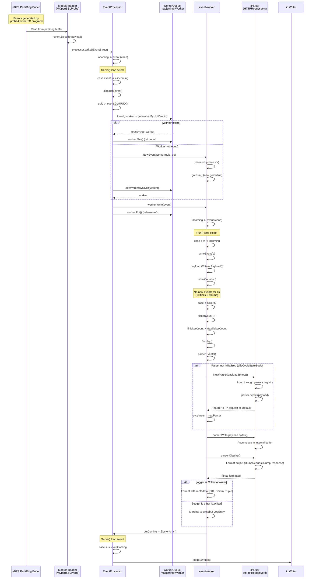
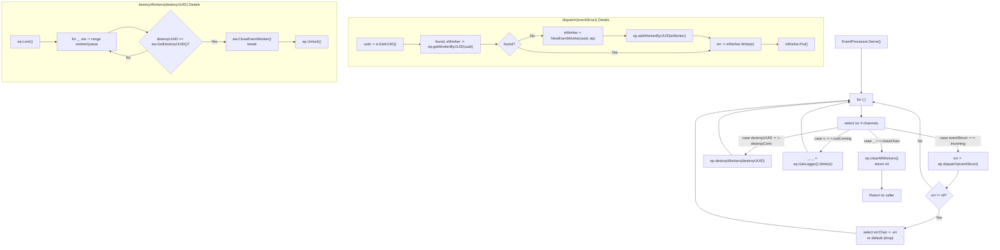
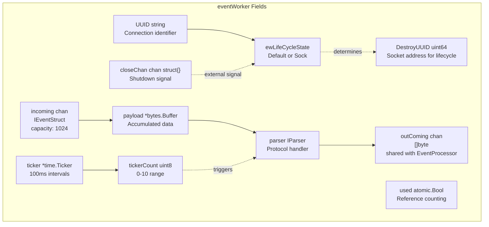
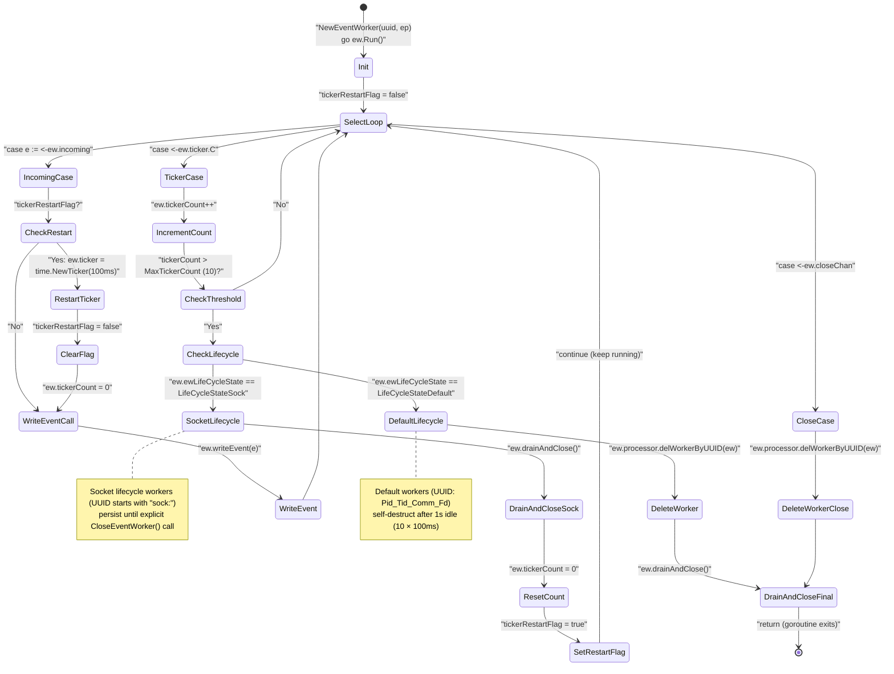
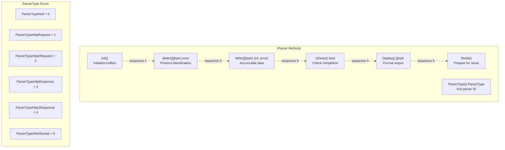
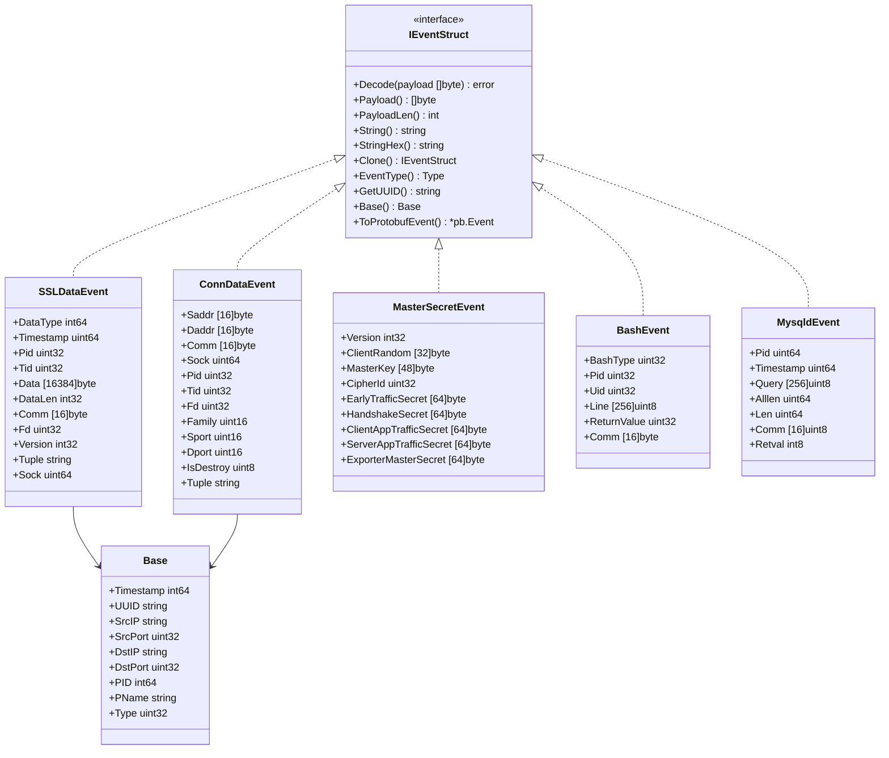
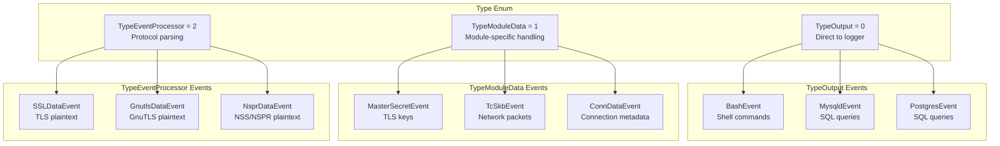
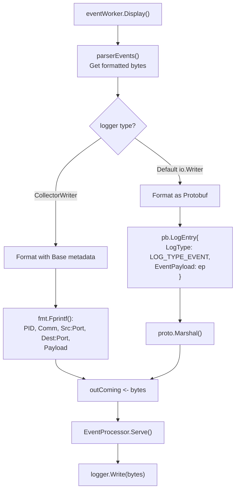
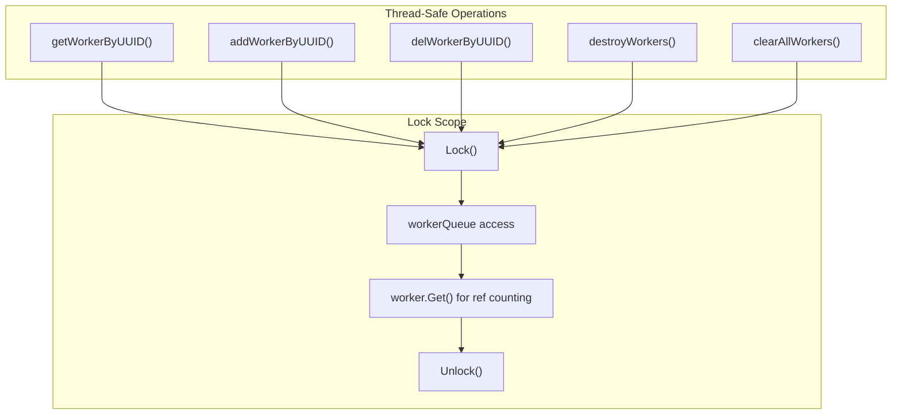

# Event Processing Pipeline

<details>
<summary>Relevant source files</summary>

The following files were used as context for generating this wiki page:

- [pkg/event_processor/base_event.go](https://github.com/gojue/ecapture/blob/0766a93b/pkg/event_processor/base_event.go)
- [pkg/event_processor/http_request.go](https://github.com/gojue/ecapture/blob/0766a93b/pkg/event_processor/http_request.go)
- [pkg/event_processor/http_response.go](https://github.com/gojue/ecapture/blob/0766a93b/pkg/event_processor/http_response.go)
- [pkg/event_processor/iparser.go](https://github.com/gojue/ecapture/blob/0766a93b/pkg/event_processor/iparser.go)
- [pkg/event_processor/iworker.go](https://github.com/gojue/ecapture/blob/0766a93b/pkg/event_processor/iworker.go)
- [pkg/event_processor/processor.go](https://github.com/gojue/ecapture/blob/0766a93b/pkg/event_processor/processor.go)
- [user/event/event_bash.go](https://github.com/gojue/ecapture/blob/0766a93b/user/event/event_bash.go)
- [user/event/event_gnutls.go](https://github.com/gojue/ecapture/blob/0766a93b/user/event/event_gnutls.go)
- [user/event/event_masterkey.go](https://github.com/gojue/ecapture/blob/0766a93b/user/event/event_masterkey.go)
- [user/event/event_mysqld.go](https://github.com/gojue/ecapture/blob/0766a93b/user/event/event_mysqld.go)
- [user/event/event_nspr.go](https://github.com/gojue/ecapture/blob/0766a93b/user/event/event_nspr.go)
- [user/event/event_openssl.go](https://github.com/gojue/ecapture/blob/0766a93b/user/event/event_openssl.go)
- [user/event/event_openssl_tc.go](https://github.com/gojue/ecapture/blob/0766a93b/user/event/event_openssl_tc.go)
- [user/event/event_postgres.go](https://github.com/gojue/ecapture/blob/0766a93b/user/event/event_postgres.go)
- [user/event/ievent.go](https://github.com/gojue/ecapture/blob/0766a93b/user/event/ievent.go)

</details>


## Purpose and Scope

The Event Processing Pipeline transforms raw eBPF events from kernel space into formatted, protocol-aware output. This pipeline sits between the eBPF data collection layer (see [2.1 eBPF Engine](2.1-ebpf-engine.md)) and output systems (see [4 Output Formats](../4-output-formats/index.md)), handling:

- **Event routing**: Dispatch events to per-connection workers via `EventProcessor.dispatch()`
- **Payload aggregation**: Accumulate data chunks in `eventWorker` instances
- **Protocol detection**: Identify HTTP/1.1, HTTP/2, or raw data via `IParser` interface
- **Lifecycle management**: Support both timeout-based and socket-lifecycle-based worker cleanup
- **Output formatting**: Convert binary payloads to text, hex, or Protobuf formats

Events flow from eBPF maps → module decoders → `EventProcessor` → `eventWorker` instances → `IParser` implementations → output writers.

---

## Architecture Overview

The event processing pipeline consists of three primary layers: event reception, worker-based aggregation, and protocol-aware parsing.

**Event Processing Pipeline Architecture**

```mermaid
graph TB
    subgraph "eBPF Maps (Kernel Space)"
        PerfArray["Perf Event Arrays<br/>or Ring Buffers"]
    end
    
    subgraph "Module Layer (User Space)"
        ModuleDecode["Module.Decode()<br/>SSLDataEvent.Decode()<br/>ConnDataEvent.Decode()"]
        ModuleWrite["Module calls<br/>processor.Write(IEventStruct)"]
    end
    
    subgraph "EventProcessor"
        Incoming["incoming chan event.IEventStruct<br/>capacity: 1024"]
        Serve["Serve() loop<br/>select on 4 channels"]
        Dispatch["dispatch(e event.IEventStruct)<br/>UUID routing"]
        WorkerQueue["workerQueue map[string]IWorker<br/>UUID → worker mapping"]
        OutComing["outComing chan []byte<br/>capacity: 1024"]
        DestroyConn["destroyConn chan uint64<br/>socket destruction signals"]
    end
    
    subgraph "eventWorker Goroutines"
        Worker1["eventWorker #1<br/>UUID: 1234_1234_curl_3_0"]
        Worker2["eventWorker #2<br/>UUID: sock:5678_5678_nginx_5_0_..._140234567890"]
        WorkerIncoming["incoming chan event.IEventStruct<br/>capacity: 1024"]
        PayloadBuf["payload *bytes.Buffer<br/>accumulated data"]
        Ticker["ticker *time.Ticker<br/>100ms, tickerCount 0-10"]
        WorkerRun["Run() loop<br/>3 select cases"]
    end
    
    subgraph "Parser Registry"
        NewParser["NewParser(payload []byte)<br/>protocol detection"]
        HTTPRequest["HTTPRequest<br/>http.ReadRequest()"]
        HTTPResponse["HTTPResponse<br/>http.ReadResponse()"]
        HTTP2Request["HTTP2Request<br/>HPACK decode"]
        HTTP2Response["HTTP2Response<br/>HPACK decode"]
        DefaultParser["DefaultParser<br/>hex.Dump() fallback"]
    end
    
    subgraph "Output Writers"
        Logger["io.Writer logger<br/>file or stdout"]
        CollectorWriter["CollectorWriter<br/>zerolog.Logger"]
    end
    
    PerfArray -->|"read events"| ModuleDecode
    ModuleDecode --> ModuleWrite
    ModuleWrite --> Incoming
    
    Incoming --> Serve
    Serve --> Dispatch
    Dispatch -->|"getWorkerByUUID()<br/>or NewEventWorker()"| WorkerQueue
    
    WorkerQueue --> Worker1
    WorkerQueue --> Worker2
    
    Worker1 --> WorkerIncoming
    WorkerIncoming --> PayloadBuf
    Ticker -."|MaxTickerCount<br/>triggers Display()"| PayloadBuf
    
    PayloadBuf --> NewParser
    NewParser -->|"detect() success"| HTTPRequest
    NewParser -->|"detect() success"| HTTPResponse
    NewParser -->|"detect() success"| HTTP2Request
    NewParser -->|"detect() success"| HTTP2Response
    NewParser -->|"no match"| DefaultParser
    
    HTTPRequest --> OutComing
    HTTPResponse --> OutComing
    HTTP2Request --> OutComing
    HTTP2Response --> OutComing
    DefaultParser --> OutComing
    
    OutComing --> Serve
    Serve --> Logger
    Logger -."|type assertion"| CollectorWriter
    
    DestroyConn --> Serve
    Serve -."|destroyWorkers()"| WorkerQueue
```

**Sources:** [pkg/event_processor/processor.go:30-63](https://github.com/gojue/ecapture/blob/0766a93b/pkg/event_processor/processor.go#L30-L63), [pkg/event_processor/processor.go:66-89](https://github.com/gojue/ecapture/blob/0766a93b/pkg/event_processor/processor.go#L66-L89), [pkg/event_processor/iworker.go:70-89](https://github.com/gojue/ecapture/blob/0766a93b/pkg/event_processor/iworker.go#L70-L89), [pkg/event_processor/iworker.go:262-306](https://github.com/gojue/ecapture/blob/0766a93b/pkg/event_processor/iworker.go#L262-L306), [pkg/event_processor/iparser.go:85-115](https://github.com/gojue/ecapture/blob/0766a93b/pkg/event_processor/iparser.go#L85-L115)

---

## Event Flow

Events traverse the pipeline through distinct stages: ingestion, routing, aggregation, parsing, and output.

**Event Flow Through Pipeline**



**Sources:** [pkg/event_processor/processor.go:65-109](https://github.com/gojue/ecapture/blob/0766a93b/pkg/event_processor/processor.go#L65-L109), [pkg/event_processor/iworker.go:91-136](https://github.com/gojue/ecapture/blob/0766a93b/pkg/event_processor/iworker.go#L91-L136), [pkg/event_processor/iworker.go:154-162](https://github.com/gojue/ecapture/blob/0766a93b/pkg/event_processor/iworker.go#L154-L162), [pkg/event_processor/iworker.go:262-306](https://github.com/gojue/ecapture/blob/0766a93b/pkg/event_processor/iworker.go#L262-L306), [pkg/event_processor/iworker.go:175-228](https://github.com/gojue/ecapture/blob/0766a93b/pkg/event_processor/iworker.go#L175-L228), [pkg/event_processor/iparser.go:85-115](https://github.com/gojue/ecapture/blob/0766a93b/pkg/event_processor/iparser.go#L85-L115)

---

## EventProcessor: Central Dispatcher

The `EventProcessor` manages the global event routing system and maintains the lifecycle of all active workers.

### Structure and Channels

| Field | Type | Purpose |
|-------|------|---------|
| `incoming` | `chan event.IEventStruct` | Receives events from modules (capacity: 1024) |
| `outComing` | `chan []byte` | Sends formatted output to logger (capacity: 1024) |
| `destroyConn` | `chan uint64` | Signals connection destruction by socket address |
| `workerQueue` | `map[string]IWorker` | Maps UUIDs to active workers (capacity: 1024) |
| `closeChan` | `chan bool` | Signals shutdown to `Serve()` loop |
| `errChan` | `chan error` | Reports dispatch errors (capacity: 16) |
| `logger` | `io.Writer` | Output destination (console or file) |

**Sources:** [pkg/event_processor/processor.go:30-50](https://github.com/gojue/ecapture/blob/0766a93b/pkg/event_processor/processor.go#L30-L50)

### Core Methods

**`Serve()` Method - Main Event Loop**

The `Serve()` method runs continuously, processing four channel types using a `select` statement:



**Key behaviors:**
- **Non-blocking error reporting**: If `errChan` is full, errors are dropped via `default` case
- **Worker cleanup on socket destroy**: `destroyWorkers()` matches by `DestroyUUID` (socket address)
- **Graceful shutdown**: `closeChan` signal clears all workers and returns from `Serve()`

**Sources:** [pkg/event_processor/processor.go:66-89](https://github.com/gojue/ecapture/blob/0766a93b/pkg/event_processor/processor.go#L66-L89), [pkg/event_processor/processor.go:91-109](https://github.com/gojue/ecapture/blob/0766a93b/pkg/event_processor/processor.go#L91-L109), [pkg/event_processor/processor.go:115-128](https://github.com/gojue/ecapture/blob/0766a93b/pkg/event_processor/processor.go#L115-L128)

**`dispatch(e event.IEventStruct)`** - Routes events to appropriate workers:

1. Extract UUID from event via `e.GetUUID()`
2. Look up existing worker in `workerQueue`
3. If not found, create new `eventWorker` via `NewEventWorker(uuid, ep)`
4. Call `worker.Write(e)` to enqueue event
5. Release worker reference via `worker.Put()`

**Sources:** [pkg/event_processor/processor.go:91-109](https://github.com/gojue/ecapture/blob/0766a93b/pkg/event_processor/processor.go#L91-L109)

**Worker lifecycle methods:**

- `getWorkerByUUID(uuid string)` - Thread-safe lookup with reference counting
- `addWorkerByUUID(worker IWorker)` - Thread-safe insertion
- `delWorkerByUUID(worker IWorker)` - Called by workers to self-destruct
- `destroyWorkers(destroyUUID uint64)` - Signals socket-based workers to close

**Sources:** [pkg/event_processor/processor.go:130-155](https://github.com/gojue/ecapture/blob/0766a93b/pkg/event_processor/processor.go#L130-L155)

---

## eventWorker: Per-Connection Aggregator

Each `eventWorker` aggregates events for a single logical connection or data stream, identified by a unique UUID. Workers operate as independent goroutines with internal state machines.

### UUID Formats and Lifecycle States

Workers support two lifecycle models based on UUID format:

| Lifecycle State | UUID Format | Example | Destruction Trigger |
|----------------|-------------|---------|---------------------|
| `LifeCycleStateDefault` | `{Pid}_{Tid}_{Comm}_{Fd}_{DataType}` | `1234_1234_curl_3_0` | 10 tick timeout (1 second idle) |
| `LifeCycleStateSock` | `sock:{Pid}_{Tid}_{Comm}_{Fd}_{DataType}_{Tuple}_{Sock}` | `sock:1234_1234_curl_3_0_1.2.3.4:80-5.6.7.8:443_140234567890` | External signal via `CloseEventWorker()` |

**Sources:** [pkg/event_processor/iworker.go:57-63](https://github.com/gojue/ecapture/blob/0766a93b/pkg/event_processor/iworker.go#L57-L63), [pkg/event_processor/iworker.go:100-123](https://github.com/gojue/ecapture/blob/0766a93b/pkg/event_processor/iworker.go#L100-L123)

### Structure and State



**Sources:** [pkg/event_processor/iworker.go:70-89](https://github.com/gojue/ecapture/blob/0766a93b/pkg/event_processor/iworker.go#L70-L89)

### Run Loop and Lifecycle

The `Run()` method implements the worker's event loop with three select cases and lifecycle-dependent timeout handling:



**Critical timing details:**
- **Ticker interval**: `100ms` per tick ([pkg/event_processor/iworker.go:126](https://github.com/gojue/ecapture/blob/0766a93b/pkg/event_processor/iworker.go#L126))
- **Timeout threshold**: `MaxTickerCount = 10` ticks = 1 second idle ([pkg/event_processor/iworker.go:52](https://github.com/gojue/ecapture/blob/0766a93b/pkg/event_processor/iworker.go#L52))
- **Ticker restart**: Socket workers recreate ticker after `drainAndClose()` to avoid stale ticker channel ([pkg/event_processor/iworker.go:293-296](https://github.com/gojue/ecapture/blob/0766a93b/pkg/event_processor/iworker.go#L293-L296))

**Lifecycle state determination:**
- UUID format parsed in `uuidParse()` ([pkg/event_processor/iworker.go:100-123](https://github.com/gojue/ecapture/blob/0766a93b/pkg/event_processor/iworker.go#L100-L123))
- If UUID starts with `"sock:"` and ends with valid socket address: `LifeCycleStateSock`
- Otherwise: `LifeCycleStateDefault`

**Sources:** [pkg/event_processor/iworker.go:262-306](https://github.com/gojue/ecapture/blob/0766a93b/pkg/event_processor/iworker.go#L262-L306), [pkg/event_processor/iworker.go:51-63](https://github.com/gojue/ecapture/blob/0766a93b/pkg/event_processor/iworker.go#L51-L63), [pkg/event_processor/iworker.go:100-123](https://github.com/gojue/ecapture/blob/0766a93b/pkg/event_processor/iworker.go#L100-L123)

### Event Aggregation and Display

**`writeEvent(e event.IEventStruct)`** - Accumulates payload data:

1. Check status is `ProcessStateInit` (prevents mid-processing writes)
2. Apply truncation if `truncateSize > 0` and payload exceeds limit
3. Store `originEvent` for metadata
4. Append `e.Payload()` to internal `bytes.Buffer`

**Sources:** [pkg/event_processor/iworker.go:230-245](https://github.com/gojue/ecapture/blob/0766a93b/pkg/event_processor/iworker.go#L230-L245)

**`Display()`** - Triggers parsing and output:

1. Check if payload has data (`payload.Len() > 0`)
2. Call `parserEvents()` to process accumulated buffer
3. Apply hex dump if `processor.isHex` is true
4. Format output with metadata (PID, Comm, Src/Dst IP:Port)
5. Write to `outComing` channel as `[]byte` or `Protobuf`
6. Reset parser, payload buffer, and state

**Sources:** [pkg/event_processor/iworker.go:175-228](https://github.com/gojue/ecapture/blob/0766a93b/pkg/event_processor/iworker.go#L175-L228)

**`drainAndClose()`** - Ensures clean shutdown:

Loops until `incoming` channel is empty AND no external routine holds a reference (`IfUsed() == false`). This prevents data loss when worker is being destroyed while another routine is attempting to write to it.

**Sources:** [pkg/event_processor/iworker.go:308-337](https://github.com/gojue/ecapture/blob/0766a93b/pkg/event_processor/iworker.go#L308-L337)

---

## Protocol Detection and Parsing

The parser subsystem automatically identifies protocols from raw payload bytes and applies appropriate formatting.

### IParser Interface



**Sources:** [pkg/event_processor/iparser.go:49-60](https://github.com/gojue/ecapture/blob/0766a93b/pkg/event_processor/iparser.go#L49-L60)

### Parser Registration and Selection

**Global Parser Registry**

Parsers register themselves during package initialization:

```go
// In pkg/event_processor/iparser.go
var parsers = make(map[string]IParser)

func Register(p IParser) {
    if p == nil {
        panic("Register Parser is nil")
    }
    name := p.Name()
    if _, dup := parsers[name]; dup {
        panic(fmt.Sprintf("Register called twice for Parser %s", name))
    }
    parsers[name] = p
}

// In each parser file's init()
func init() {
    hr := &HTTPRequest{}
    hr.Init()
    Register(hr)
}
```

**Sources:** [pkg/event_processor/iparser.go:62-73](https://github.com/gojue/ecapture/blob/0766a93b/pkg/event_processor/iparser.go#L62-L73), [pkg/event_processor/http_request.go:159-163](https://github.com/gojue/ecapture/blob/0766a93b/pkg/event_processor/http_request.go#L159-L163), [pkg/event_processor/http_response.go:177-181](https://github.com/gojue/ecapture/blob/0766a93b/pkg/event_processor/http_response.go#L177-L181)

**`NewParser(payload []byte)` - Protocol Detection Algorithm**

```mermaid
flowchart TD
    Entry["NewParser(payload []byte)"]
    CheckEmpty{"len(payload) > 0?"}
    
    CheckEmpty -->|No| CreateDefault["newParser = new(DefaultParser)"]
    CreateDefault --> InitDefault["newParser.Init()"]
    InitDefault --> ReturnParser["return newParser"]
    
    CheckEmpty -->|Yes| GetRegistry["parsers := GetAllModules()"]
    GetRegistry --> InitVars["var newParser IParser"]
    InitVars --> LoopStart["for _, parser := range parsers"]
    
    LoopStart --> CallDetect["err := parser.detect(payload)"]
    CallDetect --> CheckError{"err == nil?"}
    
    CheckError -->|No| NextIter["continue to next parser"]
    NextIter --> LoopStart
    
    CheckError -->|Yes| SwitchType["switch parser.ParserType()"]
    
    SwitchType -->|"ParserTypeHttpRequest"| NewHTTPReq["newParser = new(HTTPRequest)"]
    SwitchType -->|"ParserTypeHttpResponse"| NewHTTPResp["newParser = new(HTTPResponse)"]
    SwitchType -->|"ParserTypeHttp2Request"| NewHTTP2Req["newParser = new(HTTP2Request)"]
    SwitchType -->|"ParserTypeHttp2Response"| NewHTTP2Resp["newParser = new(HTTP2Response)"]
    SwitchType -->|"default"| NewDefault["newParser = new(DefaultParser)"]
    
    NewHTTPReq --> Break["break (exit loop)"]
    NewHTTPResp --> Break
    NewHTTP2Req --> Break
    NewHTTP2Resp --> Break
    NewDefault --> Break
    
    Break --> CheckNil{"newParser == nil?"}
    NextIter -."|no match found"| CheckNil
    
    CheckNil -->|Yes| FallbackDefault["newParser = new(DefaultParser)"]
    CheckNil -->|No| InitNew["newParser.Init()"]
    FallbackDefault --> InitNew
    
    InitNew --> ReturnParser
```

**Detection order**: Parsers are tested in map iteration order (non-deterministic). Each parser's `detect()` method is called with the payload. First successful detection wins.

**Example detection methods:**
- `HTTPRequest.detect()`: Calls `http.ReadRequest()` ([pkg/event_processor/http_request.go:83-92](https://github.com/gojue/ecapture/blob/0766a93b/pkg/event_processor/http_request.go#L83-L92))
- `HTTPResponse.detect()`: Calls `http.ReadResponse()` ([pkg/event_processor/http_response.go:94-102](https://github.com/gojue/ecapture/blob/0766a93b/pkg/event_processor/http_response.go#L94-L102))
- `DefaultParser.detect()`: Always returns `nil` (matches everything) ([pkg/event_processor/iparser.go:136-138](https://github.com/gojue/ecapture/blob/0766a93b/pkg/event_processor/iparser.go#L136-L138))

**Sources:** [pkg/event_processor/iparser.go:85-115](https://github.com/gojue/ecapture/blob/0766a93b/pkg/event_processor/iparser.go#L85-L115), [pkg/event_processor/iparser.go:136-138](https://github.com/gojue/ecapture/blob/0766a93b/pkg/event_processor/iparser.go#L136-L138)

### HTTP/1.1 Request Parser

The `HTTPRequest` parser leverages Go's standard `net/http` package:

**Structure:**
```go
type HTTPRequest struct {
    request    *http.Request   // Parsed HTTP request
    packerType PacketType      // PacketTypeNull or PacketTypeGzip
    isDone     bool            // Completion flag (currently unused)
    isInit     bool            // True after first Write() call
    reader     *bytes.Buffer   // Accumulator for raw bytes
    bufReader  *bufio.Reader   // Buffered reader over reader
}
```

**Sources:** [pkg/event_processor/http_request.go:28-35](https://github.com/gojue/ecapture/blob/0766a93b/pkg/event_processor/http_request.go#L28-L35)

**Protocol Detection**

The `detect()` method attempts HTTP parsing:

```go
func (hr *HTTPRequest) detect(payload []byte) error {
    rd := bytes.NewReader(payload)
    buf := bufio.NewReader(rd)
    _, err := http.ReadRequest(buf)
    if err != nil {
        return err
    }
    return nil
}
```

Success indicates valid HTTP/1.1 request format. **Sources:** [pkg/event_processor/http_request.go:83-92](https://github.com/gojue/ecapture/blob/0766a93b/pkg/event_processor/http_request.go#L83-L92)

**Processing Lifecycle**

| Stage | Method | Operation | Key Lines |
|-------|--------|-----------|-----------|
| Initialization | `Init()` | Create `bytes.Buffer` and `bufio.Reader` | [pkg/event_processor/http_request.go:37-40](https://github.com/gojue/ecapture/blob/0766a93b/pkg/event_processor/http_request.go#L37-L40) |
| First Write | `Write(b)` (isInit=false) | Write to buffer, call `http.ReadRequest()`, store result, set `isInit=true` | [pkg/event_processor/http_request.go:56-67](https://github.com/gojue/ecapture/blob/0766a93b/pkg/event_processor/http_request.go#L56-L67) |
| Subsequent Writes | `Write(b)` (isInit=true) | Append additional body data to buffer | [pkg/event_processor/http_request.go:71-78](https://github.com/gojue/ecapture/blob/0766a93b/pkg/event_processor/http_request.go#L71-L78) |
| Output | `Display()` | Read body, decompress gzip if present, call `httputil.DumpRequest(false)` | [pkg/event_processor/http_request.go:105-157](https://github.com/gojue/ecapture/blob/0766a93b/pkg/event_processor/http_request.go#L105-L157) |
| Cleanup | `Reset()` | Set `isDone=false`, `isInit=false`, reset buffers | [pkg/event_processor/http_request.go:98-103](https://github.com/gojue/ecapture/blob/0766a93b/pkg/event_processor/http_request.go#L98-L103) |

**Gzip Decompression**

If `Content-Encoding: gzip` header is present:
1. Read raw body via `io.ReadAll(hr.request.Body)` 
2. Create `gzip.NewReader(bytes.NewReader(rawData))`
3. Decompress: `rawData, err = io.ReadAll(reader)`
4. Set `hr.packerType = PacketTypeGzip`

**Sources:** [pkg/event_processor/http_request.go:123-142](https://github.com/gojue/ecapture/blob/0766a93b/pkg/event_processor/http_request.go#L123-L142)

**HTTP/2.0 Detection**

If `hr.request.Proto == "HTTP/2.0"`, returns raw bytes without processing. HTTP/2 requires specialized frame handling. **Sources:** [pkg/event_processor/http_request.go:106-108](https://github.com/gojue/ecapture/blob/0766a93b/pkg/event_processor/http_request.go#L106-L108)

### HTTP/1.1 Response Parser

Similar to request parser but uses `http.ReadResponse()`:

**Key differences:**
- Handles chunked responses (negative `ContentLength`)
- Logs truncated responses when body is incomplete
- Supports HTTP/2.0 detection (returns raw bytes without processing)

**Sources:** [pkg/event_processor/http_response.go:28-37](https://github.com/gojue/ecapture/blob/0766a93b/pkg/event_processor/http_response.go#L28-L37), [pkg/event_processor/http_response.go:58-92](https://github.com/gojue/ecapture/blob/0766a93b/pkg/event_processor/http_response.go#L58-L92), [pkg/event_processor/http_response.go:115-175](https://github.com/gojue/ecapture/blob/0766a93b/pkg/event_processor/http_response.go#L115-L175)

### HTTP/2 Parsers

HTTP/2 parsers are defined but implementation details are in separate files not provided. They handle:
- HPACK header compression/decompression
- Binary frame format
- Stream multiplexing

**Sources:** Referenced in [pkg/event_processor/iparser.go:96-99](https://github.com/gojue/ecapture/blob/0766a93b/pkg/event_processor/iparser.go#L96-L99)

### DefaultParser

Fallback parser for unrecognized protocols:

- Accumulates all bytes in `bytes.Buffer`
- On `Display()`, checks if first byte is printable ASCII (32-126)
- If non-ASCII, outputs hex dump via `hex.Dump()`
- If ASCII, outputs as string (C-style null termination via `CToGoString()`)

**Sources:** [pkg/event_processor/iparser.go:117-166](https://github.com/gojue/ecapture/blob/0766a93b/pkg/event_processor/iparser.go#L117-L166)

---

## Event Types and Structure

All events implement the `IEventStruct` interface, enabling polymorphic handling in the pipeline.

### IEventStruct Interface



**Sources:** [user/event/ievent.go:26-52](https://github.com/gojue/ecapture/blob/0766a93b/user/event/ievent.go#L26-L52)

### Event Type Classification

Events are classified by their processing destination:



**Sources:** [user/event/ievent.go:26-37](https://github.com/gojue/ecapture/blob/0766a93b/user/event/ievent.go#L26-L37), [user/event/event_openssl.go:77-92](https://github.com/gojue/ecapture/blob/0766a93b/user/event/event_openssl.go#L77-L92), [user/event/event_bash.go:37-47](https://github.com/gojue/ecapture/blob/0766a93b/user/event/event_bash.go#L37-L47), [user/event/event_masterkey.go:37-55](https://github.com/gojue/ecapture/blob/0766a93b/user/event/event_masterkey.go#L37-L55)

### SSLDataEvent Structure

Primary event type for OpenSSL/BoringSSL captures:

**Fields:**
- **DataType**: 0 (ProbeEntry/Received) or 1 (ProbeRet/Sent)
- **Timestamp**: Kernel time decoded to Unix nanoseconds
- **Pid/Tid/Comm**: Process identification
- **Data**: Payload buffer (max 16384 bytes)
- **DataLen**: Actual data length
- **Fd**: File descriptor
- **Version**: TLS version constant (0x0303 = TLS 1.2, etc.)
- **Tuple**: Network 5-tuple string (`srcip:port-dstip:port`)
- **Sock**: Socket pointer address (for lifecycle tracking)

**UUID format:**
- Default: `{Pid}_{Tid}_{Comm}_{Fd}_{DataType}`
- Socket lifecycle: `sock:{Pid}_{Tid}_{Comm}_{Fd}_{DataType}_{Tuple}_{Sock}`

**Sources:** [user/event/event_openssl.go:77-92](https://github.com/gojue/ecapture/blob/0766a93b/user/event/event_openssl.go#L77-L92), [user/event/event_openssl.go:138-141](https://github.com/gojue/ecapture/blob/0766a93b/user/event/event_openssl.go#L138-L141)

### ConnDataEvent Structure

Connection lifecycle event for socket tracking:

**Purpose:** Provides network 5-tuple information when socket is created or destroyed, enabling correlation with `SSLDataEvent` via socket address.

**Fields:**
- **Saddr/Daddr**: Source/destination IP (16 bytes for IPv6)
- **Sport/Dport**: Source/destination port
- **Family**: `AF_INET` (2) or `AF_INET6` (10)
- **Sock**: Socket pointer (matches `SSLDataEvent.Sock`)
- **IsDestroy**: 1 if connection being destroyed, 0 if created

**Tuple generation:** Formats as `ip:port-ip:port` with bracket notation for IPv6.

**Sources:** [user/event/event_openssl.go:272-310](https://github.com/gojue/ecapture/blob/0766a93b/user/event/event_openssl.go#L272-L310)

---

## Output Routing

Events reach different destinations based on their `EventType` and the configured logger type.

### Output Decision Flow



**Sources:** [pkg/event_processor/iworker.go:175-228](https://github.com/gojue/ecapture/blob/0766a93b/pkg/event_processor/iworker.go#L175-L228)

### Output Format Examples

**Text mode (CollectorWriter):**
```
PID:1234, Comm:curl, Src:192.168.1.10:54321, Dest:93.184.216.34:443,
GET / HTTP/1.1
Host: example.com
User-Agent: curl/7.81.0
Accept: */*
```

**Protobuf mode:**
```protobuf
message LogEntry {
  LogType log_type = 1;  // LOG_TYPE_EVENT
  oneof payload {
    Event event_payload = 2;
  }
}

message Event {
  int64 timestamp = 1;
  string uuid = 2;
  int64 pid = 3;
  string pname = 4;
  string src_ip = 5;
  uint32 src_port = 6;
  string dst_ip = 7;
  uint32 dst_port = 8;
  uint32 type = 9;
  uint32 length = 10;
  bytes payload = 11;
}
```

**Sources:** [pkg/event_processor/iworker.go:198-227](https://github.com/gojue/ecapture/blob/0766a93b/pkg/event_processor/iworker.go#L198-L227), [user/event/event_openssl.go:237-266](https://github.com/gojue/ecapture/blob/0766a93b/user/event/event_openssl.go#L237-L266)

### CollectorWriter Integration

The `CollectorWriter` wraps `zerolog.Logger` for structured logging:

```go
type CollectorWriter struct {
    logger *zerolog.Logger
}

func (e CollectorWriter) Write(p []byte) (n int, err error) {
    return e.logger.Write(p)
}
```

Used when output needs JSON formatting or log level filtering. Otherwise, standard `io.Writer` (file, stdout) is used directly.

**Sources:** [user/event/ievent.go:54-70](https://github.com/gojue/ecapture/blob/0766a93b/user/event/ievent.go#L54-L70)

---

## Performance Characteristics

The pipeline is designed for high-throughput event processing with bounded memory usage.

### Buffer Capacities and Limits

| Component | Buffer Type | Capacity | Purpose |
|-----------|-------------|----------|---------|
| EventProcessor.incoming | Buffered channel | 1024 events | Event reception from modules |
| EventProcessor.outComing | Buffered channel | 1024 messages | Formatted output to logger |
| EventProcessor.destroyConn | Buffered channel | 1024 signals | Connection destruction signals |
| EventProcessor.errChan | Buffered channel | 16 errors | Error reporting |
| eventWorker.incoming | Buffered channel | 1024 events | Per-worker event queue |
| eventWorker.payload | bytes.Buffer | Unbounded* | Payload accumulation |

*Bounded by `truncateSize` configuration parameter.

**Sources:** [pkg/event_processor/processor.go:25-28](https://github.com/gojue/ecapture/blob/0766a93b/pkg/event_processor/processor.go#L25-L28), [pkg/event_processor/iworker.go:51-54](https://github.com/gojue/ecapture/blob/0766a93b/pkg/event_processor/iworker.go#L51-L54)

### Backpressure Handling

The pipeline uses non-blocking channel writes with `select` + `default` to prevent stalls:

**EventProcessor.Write() - Module to Processor**

```go
func (ep *EventProcessor) Write(e event.IEventStruct) {
    if ep.isClosed {
        return
    }
    select {
    case ep.incoming <- e:
        return
    default:
        // Queue full: drop event silently
    }
}
```

**Sources:** [pkg/event_processor/processor.go:165-175](https://github.com/gojue/ecapture/blob/0766a93b/pkg/event_processor/processor.go#L165-L175)

**eventWorker.Write() - Processor to Worker**

```go
func (ew *eventWorker) Write(e event.IEventStruct) error {
    var err error
    select {
    case ew.incoming <- e:
    default:
        err = ErrEventWorkerIncomingFull
    }
    return err
}
```

Returns `ErrEventWorkerIncomingFull` when worker queue is full (capacity: 1024). Error is propagated to `EventProcessor.errChan` but does not block. **Sources:** [pkg/event_processor/iworker.go:154-162](https://github.com/gojue/ecapture/blob/0766a93b/pkg/event_processor/iworker.go#L154-L162), [pkg/event_processor/iworker.go:66](https://github.com/gojue/ecapture/blob/0766a93b/pkg/event_processor/iworker.go#L66)

**eventWorker.writeToChan() - Worker to Processor Output**

```go
func (ew *eventWorker) writeToChan(b []byte) error {
    var err error
    select {
    case ew.outComing <- b:
    default:
        err = ErrEventWorkerOutcomingFull
    }
    return err
}
```

Returns `ErrEventWorkerOutcomingFull` when processor output queue is full (capacity: 1024). **Sources:** [pkg/event_processor/iworker.go:164-172](https://github.com/gojue/ecapture/blob/0766a93b/pkg/event_processor/iworker.go#L164-L172), [pkg/event_processor/iworker.go:67](https://github.com/gojue/ecapture/blob/0766a93b/pkg/event_processor/iworker.go#L67)

**Rationale**: Non-blocking operation prevents blocking the eBPF event readers (which would cause kernel-space ring buffer overruns). In monitoring scenarios, dropping a small percentage of events under extreme load is acceptable.

### Truncation Behavior

If `EventProcessor.truncateSize > 0`:
- Workers check payload size before each write
- If `payload.Len() >= truncateSize`, truncate to exact size
- Log message: `"Events truncated, size: %d bytes\n"`
- Prevents unbounded memory growth for long-lived connections with large transfers

**Sources:** [pkg/event_processor/iworker.go:236-242](https://github.com/gojue/ecapture/blob/0766a93b/pkg/event_processor/iworker.go#L236-L242)

---

## Thread Safety and Synchronization

The pipeline employs multiple synchronization mechanisms to ensure correctness under concurrent access.

### EventProcessor Locking

All `workerQueue` operations are protected by `sync.Mutex`:



**Sources:** [pkg/event_processor/processor.go:130-161](https://github.com/gojue/ecapture/blob/0766a93b/pkg/event_processor/processor.go#L130-L161)

### Worker Reference Counting

`eventWorker.used` is an `atomic.Bool` that tracks external references:

**Get/Put pattern:**
```go
// In EventProcessor.dispatch()
worker.Get()      // Atomically set used = true
defer worker.Put() // Atomically set used = false

// In eventWorker.drainAndClose()
for {
    if ew.IfUsed() {
        time.Sleep(10 * time.Millisecond)
        continue  // Wait for Put()
    }
    ew.Close()
    return
}
```

**Purpose:** Prevents worker from being destroyed while `dispatch()` is writing to it. Uses busy-wait with 10ms sleep to ensure reference is released before final cleanup.

**Sources:** [pkg/event_processor/iworker.go:346-360](https://github.com/gojue/ecapture/blob/0766a93b/pkg/event_processor/iworker.go#L346-L360), [pkg/event_processor/iworker.go:308-337](https://github.com/gojue/ecapture/blob/0766a93b/pkg/event_processor/iworker.go#L308-L337)

### Channel-Based Signaling

Socket-lifecycle workers use `closeChan` for clean shutdown:

```go
closeChan chan struct{}  // nil for default lifecycle, initialized for socket lifecycle
closeOnce sync.Once      // Ensures close() called only once

func (ew *eventWorker) CloseEventWorker() {
    if ew.closeChan != nil {
        ew.closeOnce.Do(func() {
            close(ew.closeChan)
        })
    }
}
```

**Pattern:** Closing a channel signals all readers simultaneously. `sync.Once` prevents panic from double-close.

**Sources:** [pkg/event_processor/iworker.go:86-88](https://github.com/gojue/ecapture/blob/0766a93b/pkg/event_processor/iworker.go#L86-L88), [pkg/event_processor/iworker.go:142-148](https://github.com/gojue/ecapture/blob/0766a93b/pkg/event_processor/iworker.go#L142-L148)

---

## Summary

The Event Processing Pipeline transforms raw eBPF events into protocol-aware, formatted output through a three-stage architecture:

1. **EventProcessor** routes incoming events to UUID-keyed workers
2. **eventWorker** instances accumulate payloads and manage connection lifecycles
3. **IParser** implementations detect protocols and format output

Key design principles:
- **Non-blocking operation**: Full channels drop events rather than stalling
- **Automatic lifecycle management**: Workers self-destruct after idle periods or external signals
- **Protocol-agnostic core**: Parser registration system supports arbitrary protocol handlers
- **Thread-safe access**: Mutex-protected maps and atomic reference counting prevent races

The pipeline supports output to console, files, PCAP, keylog, and Protobuf streams, enabling integration with external analysis tools.

**Sources:** [pkg/event_processor/processor.go:1-216](https://github.com/gojue/ecapture/blob/0766a93b/pkg/event_processor/processor.go#L1-L216), [pkg/event_processor/iworker.go:1-366](https://github.com/gojue/ecapture/blob/0766a93b/pkg/event_processor/iworker.go#L1-L366), [pkg/event_processor/iparser.go:1-167](https://github.com/gojue/ecapture/blob/0766a93b/pkg/event_processor/iparser.go#L1-L167)