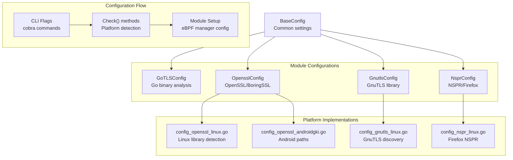
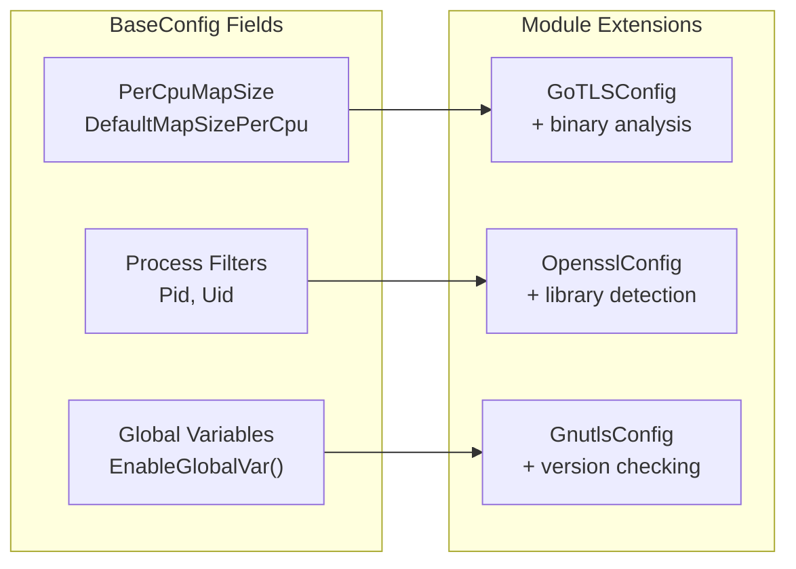
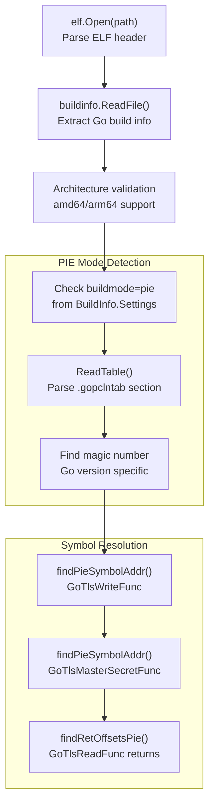
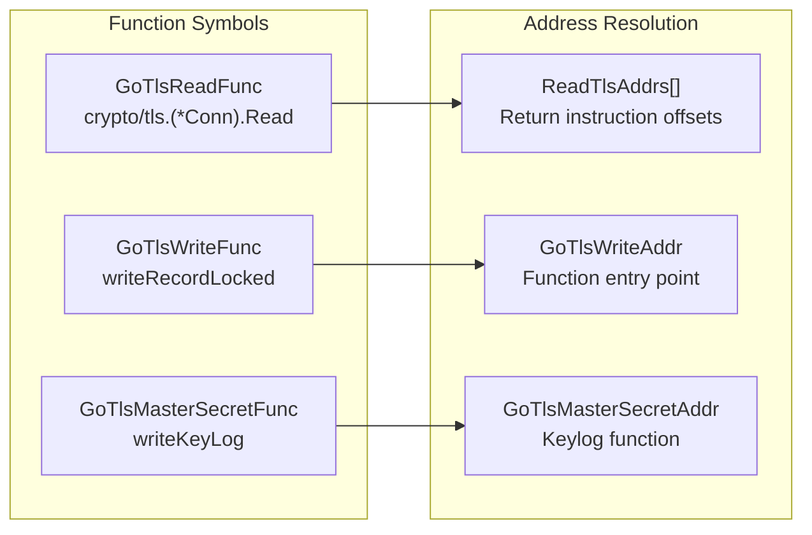
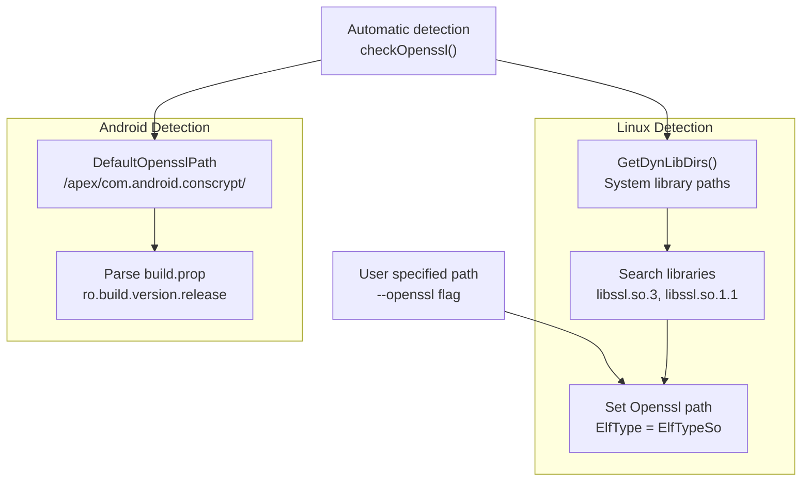
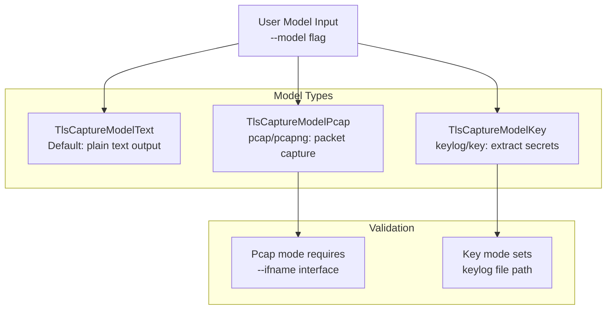
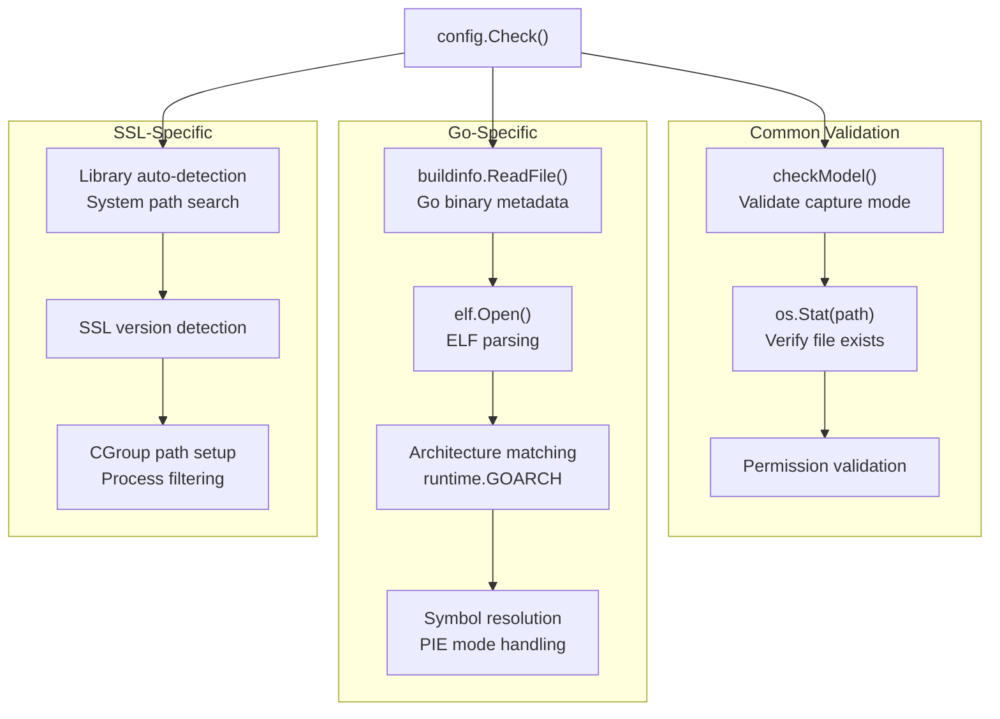
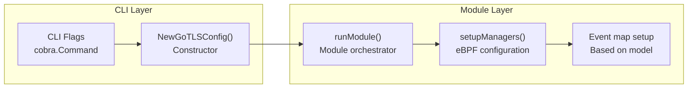

# Configuration System

Relevant source files

The following files were used as context for generating this wiki page:

- [cli/cmd/bash.go](https://github.com/gojue/ecapture/blob/0766a93b/cli/cmd/bash.go)
- [cli/cmd/gnutls.go](https://github.com/gojue/ecapture/blob/0766a93b/cli/cmd/gnutls.go)
- [cli/cmd/gotls.go](https://github.com/gojue/ecapture/blob/0766a93b/cli/cmd/gotls.go)
- [cli/cmd/mysqld.go](https://github.com/gojue/ecapture/blob/0766a93b/cli/cmd/mysqld.go)
- [cli/cmd/nspr.go](https://github.com/gojue/ecapture/blob/0766a93b/cli/cmd/nspr.go)
- [cli/cmd/postgres.go](https://github.com/gojue/ecapture/blob/0766a93b/cli/cmd/postgres.go)
- [cli/cmd/root.go](https://github.com/gojue/ecapture/blob/0766a93b/cli/cmd/root.go)
- [cli/cmd/tls.go](https://github.com/gojue/ecapture/blob/0766a93b/cli/cmd/tls.go)
- [cli/cmd/zsh.go](https://github.com/gojue/ecapture/blob/0766a93b/cli/cmd/zsh.go)
- [pkg/util/ws/client.go](https://github.com/gojue/ecapture/blob/0766a93b/pkg/util/ws/client.go)
- [pkg/util/ws/client_test.go](https://github.com/gojue/ecapture/blob/0766a93b/pkg/util/ws/client_test.go)
- [user/config/iconfig.go](https://github.com/gojue/ecapture/blob/0766a93b/user/config/iconfig.go)
- [user/module/imodule.go](https://github.com/gojue/ecapture/blob/0766a93b/user/module/imodule.go)
- [user/module/probe_openssl.go](https://github.com/gojue/ecapture/blob/0766a93b/user/module/probe_openssl.go)

The Configuration System manages module-specific settings, platform detection, library discovery, and parameter validation for ecapture's various capture modules. This system provides a unified interface for configuring TLS/SSL interception across different libraries (OpenSSL, Go TLS, GnuTLS, NSPR) and platforms (Linux, Android).

For information about how configurations are applied during module execution, see [Capture Modules](../3-capture-modules/index.md). For build-time configuration and compilation settings, see [Build System](../5-development-guide/5.1-build-system.md).

## Architecture Overview

The configuration system follows a hierarchical design with base configuration inherited by module-specific implementations:

**Sources:** [user/config/config_gotls.go:77-93](https://github.com/gojue/ecapture/blob/0766a93b/user/config/config_gotls.go#L77-L93), [user/config/config_openssl.go:39-53](https://github.com/gojue/ecapture/blob/0766a93b/user/config/config_openssl.go#L39-L53), [user/config/config_gnutls.go:20-31](https://github.com/gojue/ecapture/blob/0766a93b/user/config/config_gnutls.go#L20-L31), [user/config/config_nspr.go:20-25](https://github.com/gojue/ecapture/blob/0766a93b/user/config/config_nspr.go#L20-L25)

## Base Configuration Structure

All module configurations inherit from `BaseConfig`, which provides common functionality:

| Field | Type | Purpose |
|-------|------|---------|
| `PerCpuMapSize` | `int` | eBPF map size per CPU core |
| `Pid` | `uint32` | Target process ID filter |
| `Uid` | `uint32` | Target user ID filter |
| `Debug` | `bool` | Enable debug logging |

**Sources:** [user/config/config_gotls.go:96-100](https://github.com/gojue/ecapture/blob/0766a93b/user/config/config_gotls.go#L96-L100), [user/config/config_openssl.go:55-59](https://github.com/gojue/ecapture/blob/0766a93b/user/config/config_openssl.go#L55-L59), [user/config/config_gnutls.go:33-37](https://github.com/gojue/ecapture/blob/0766a93b/user/config/config_gnutls.go#L33-L37)

## Go TLS Configuration

The `GoTLSConfig` provides the most complex configuration logic, performing binary analysis of Go applications to extract symbol addresses and function offsets:

### Binary Analysis Pipeline

**Sources:** [user/config/config_gotls.go:102-190](https://github.com/gojue/ecapture/blob/0766a93b/user/config/config_gotls.go#L102-L190), [user/config/config_gotls.go:281-325](https://github.com/gojue/ecapture/blob/0766a93b/user/config/config_gotls.go#L281-L325), [user/config/config_gotls.go:327-357](https://github.com/gojue/ecapture/blob/0766a93b/user/config/config_gotls.go#L327-L357)

### Symbol Address Resolution

The Go configuration resolves specific function addresses for uprobe attachment:

| Function | Constant | Purpose |
|----------|----------|---------|
| `crypto/tls.(*Conn).Read` | `GoTlsReadFunc` | TLS read interception |
| `crypto/tls.(*Conn).writeRecordLocked` | `GoTlsWriteFunc` | TLS write interception |
| `crypto/tls.(*Config).writeKeyLog` | `GoTlsMasterSecretFunc` | Master secret extraction |

**Sources:** [user/config/config_gotls.go:31-35](https://github.com/gojue/ecapture/blob/0766a93b/user/config/config_gotls.go#L31-L35), [user/config/config_gotls.go:88-91](https://github.com/gojue/ecapture/blob/0766a93b/user/config/config_gotls.go#L88-L91), [user/config/config_gotls.go:168-182](https://github.com/gojue/ecapture/blob/0766a93b/user/config/config_gotls.go#L168-L182)

## OpenSSL Configuration

OpenSSL configuration handles library discovery across different platforms and versions:

### Library Discovery Process

**Sources:** [user/config/config_openssl_linux.go:38-67](https://github.com/gojue/ecapture/blob/0766a93b/user/config/config_openssl_linux.go#L38-L67), [user/config/config_openssl_androidgki.go:34-71](https://github.com/gojue/ecapture/blob/0766a93b/user/config/config_openssl_androidgki.go#L34-L71), [user/config/config_openssl.go:74-111](https://github.com/gojue/ecapture/blob/0766a93b/user/config/config_openssl.go#L74-L111)

### Platform-Specific Paths

| Platform | Default Library Path | Interface |
|----------|---------------------|-----------|
| Linux | `/usr/lib/x86_64-linux-gnu/libssl.so.3` | `eth0` |
| Android | `/apex/com.android.conscrypt/lib64/libssl.so` | `wlan0` |

**Sources:** [user/config/config_openssl_linux.go:28-36](https://github.com/gojue/ecapture/blob/0766a93b/user/config/config_openssl_linux.go#L28-L36), [user/config/config_openssl_androidgki.go:26-32](https://github.com/gojue/ecapture/blob/0766a93b/user/config/config_openssl_androidgki.go#L26-L32)

## Capture Model Selection

All TLS modules support multiple capture models through the `checkModel()` method:

**Sources:** [user/config/config_gotls.go:264-279](https://github.com/gojue/ecapture/blob/0766a93b/user/config/config_gotls.go#L264-L279), [user/config/config_openssl.go:61-72](https://github.com/gojue/ecapture/blob/0766a93b/user/config/config_openssl.go#L61-L72), [user/config/config_gnutls.go:39-50](https://github.com/gojue/ecapture/blob/0766a93b/user/config/config_gnutls.go#L39-L50)

## Configuration Validation

Each module implements a `Check()` method that performs comprehensive validation:

### Validation Flow

**Sources:** [user/config/config_gotls.go:102-190](https://github.com/gojue/ecapture/blob/0766a93b/user/config/config_gotls.go#L102-L190), [user/config/config_openssl_linux.go:69-103](https://github.com/gojue/ecapture/blob/0766a93b/user/config/config_openssl_linux.go#L69-L103), [user/config/config_gnutls_linux.go:27-63](https://github.com/gojue/ecapture/blob/0766a93b/user/config/config_gnutls_linux.go#L27-L63)

## Module Integration

Configuration objects are created and used by CLI commands and passed to modules:

**Sources:** [cli/cmd/gotls.go:26-58](https://github.com/gojue/ecapture/blob/0766a93b/cli/cmd/gotls.go#L26-L58), [user/module/probe_gotls_text.go:31-118](https://github.com/gojue/ecapture/blob/0766a93b/user/module/probe_gotls_text.go#L31-L118), [user/module/probe_gotls_keylog.go:31-104](https://github.com/gojue/ecapture/blob/0766a93b/user/module/probe_gotls_keylog.go#L31-L104)