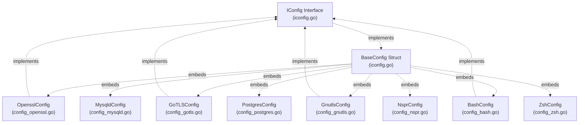
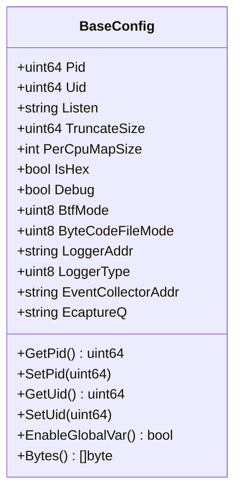
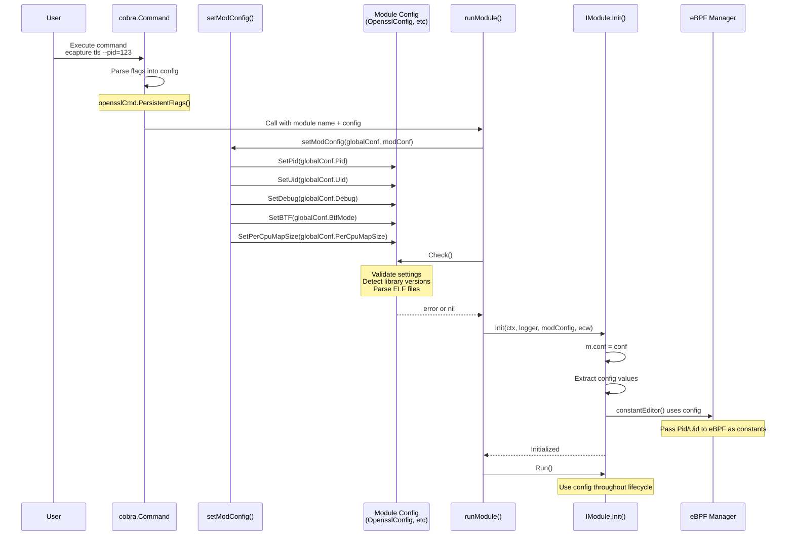
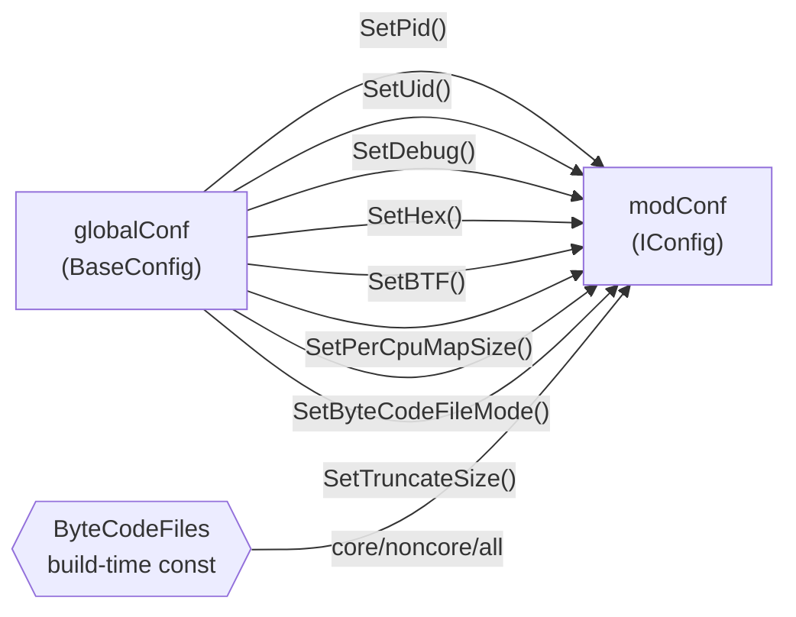
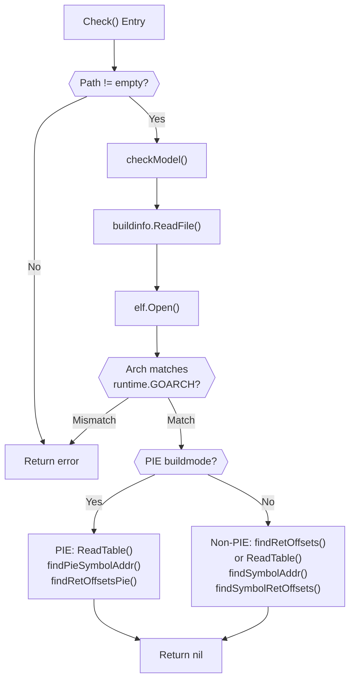
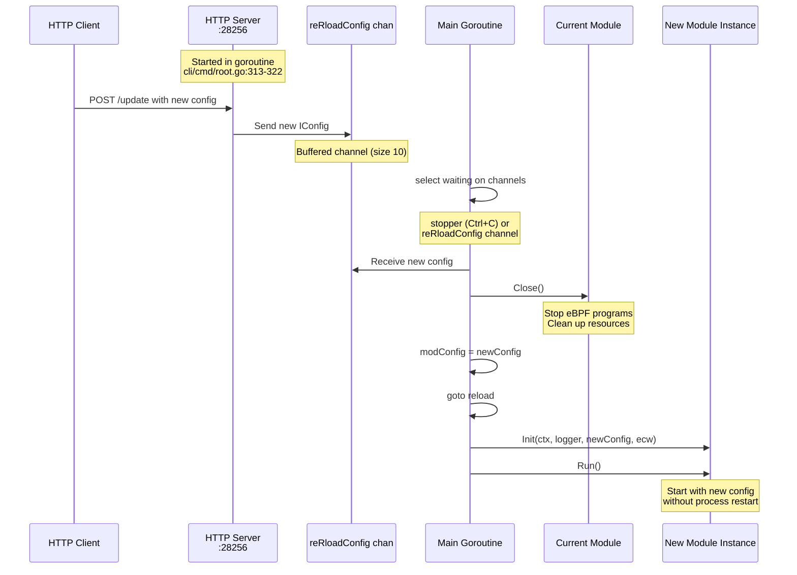
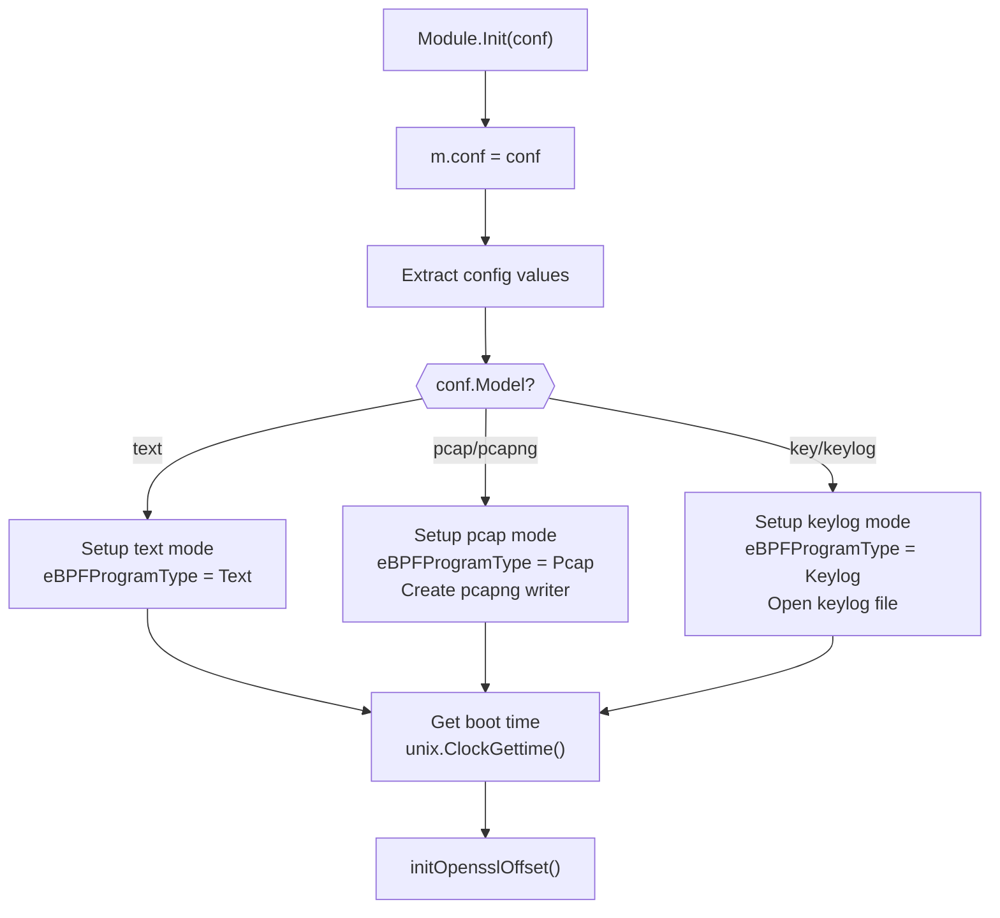

# Configuration System

<details>
<summary>Relevant source files</summary>

The following files were used as context for generating this wiki page:

- [cli/cmd/bash.go](https://github.com/gojue/ecapture/blob/ca085d05/cli/cmd/bash.go)
- [cli/cmd/gnutls.go](https://github.com/gojue/ecapture/blob/ca085d05/cli/cmd/gnutls.go)
- [cli/cmd/gotls.go](https://github.com/gojue/ecapture/blob/ca085d05/cli/cmd/gotls.go)
- [cli/cmd/mysqld.go](https://github.com/gojue/ecapture/blob/ca085d05/cli/cmd/mysqld.go)
- [cli/cmd/nspr.go](https://github.com/gojue/ecapture/blob/ca085d05/cli/cmd/nspr.go)
- [cli/cmd/postgres.go](https://github.com/gojue/ecapture/blob/ca085d05/cli/cmd/postgres.go)
- [cli/cmd/root.go](https://github.com/gojue/ecapture/blob/ca085d05/cli/cmd/root.go)
- [cli/cmd/tls.go](https://github.com/gojue/ecapture/blob/ca085d05/cli/cmd/tls.go)
- [cli/cmd/zsh.go](https://github.com/gojue/ecapture/blob/ca085d05/cli/cmd/zsh.go)
- [go.mod](https://github.com/gojue/ecapture/blob/ca085d05/go.mod)
- [go.sum](https://github.com/gojue/ecapture/blob/ca085d05/go.sum)
- [pkg/util/ws/client.go](https://github.com/gojue/ecapture/blob/ca085d05/pkg/util/ws/client.go)
- [pkg/util/ws/client_test.go](https://github.com/gojue/ecapture/blob/ca085d05/pkg/util/ws/client_test.go)
- [user/config/config_gotls.go](https://github.com/gojue/ecapture/blob/ca085d05/user/config/config_gotls.go)
- [user/config/iconfig.go](https://github.com/gojue/ecapture/blob/ca085d05/user/config/iconfig.go)
- [user/module/imodule.go](https://github.com/gojue/ecapture/blob/ca085d05/user/module/imodule.go)
- [user/module/probe_gotls_keylog.go](https://github.com/gojue/ecapture/blob/ca085d05/user/module/probe_gotls_keylog.go)
- [user/module/probe_gotls_text.go](https://github.com/gojue/ecapture/blob/ca085d05/user/module/probe_gotls_text.go)
- [user/module/probe_openssl.go](https://github.com/gojue/ecapture/blob/ca085d05/user/module/probe_openssl.go)

</details>


The Configuration System in eCapture provides a flexible, hierarchical approach to managing settings for different capture modules. It defines a common interface (`IConfig`) that all module configurations must implement, while allowing module-specific extensions. The system supports both compile-time configuration via CLI flags and runtime updates via HTTP API.

For information about the Module System that consumes these configurations, see [Module System and Lifecycle](2.5-module-system-and-lifecycle.md). For CLI command structure, see [Command Line Interface](../1-overview/1.2-command-line-interface.md).

---

## Configuration Architecture

The configuration system uses an interface-based design with a base implementation and module-specific extensions:



**Sources:** [user/config/iconfig.go:24-70](https://github.com/gojue/ecapture/blob/ca085d05/user/config/iconfig.go#L24-L70), [user/config/iconfig.go:95-112](https://github.com/gojue/ecapture/blob/ca085d05/user/config/iconfig.go#L95-L112), [user/config/config_gotls.go:77-94](https://github.com/gojue/ecapture/blob/ca085d05/user/config/config_gotls.go#L77-L94)

---

## IConfig Interface

The `IConfig` interface defines the contract that all configuration implementations must satisfy:

| Method | Return Type | Purpose |
|--------|-------------|---------|
| `Check()` | `error` | Validates configuration settings before module initialization |
| `GetPid()` / `SetPid(uint64)` | `uint64` / void | Target process ID filter (0 = all processes) |
| `GetUid()` / `SetUid(uint64)` | `uint64` / void | Target user ID filter (0 = all users) |
| `GetHex()` / `SetHex(bool)` | `bool` / void | Enable hexadecimal output format |
| `GetBTF()` / `SetBTF(uint8)` | `uint8` / void | BTF mode selection (0=auto, 1=core, 2=non-core) |
| `GetDebug()` / `SetDebug(bool)` | `bool` / void | Enable debug logging |
| `GetByteCodeFileMode()` / `SetByteCodeFileMode(uint8)` | `uint8` / void | Bytecode file selection (0=all, 1=core, 2=non-core) |
| `GetPerCpuMapSize()` / `SetPerCpuMapSize(int)` | `int` / void | eBPF map size per CPU (default: 1024 * PAGESIZE) |
| `GetAddrType()` / `SetAddrType(uint8)` | `uint8` / void | Logger output type (0=stdout, 1=file, 2=tcp, 3=websocket) |
| `GetEventCollectorAddr()` / `SetEventCollectorAddr(string)` | `string` / void | Event collector server address |
| `GetTruncateSize()` / `SetTruncateSize(uint64)` | `uint64` / void | Maximum data size to capture in text mode |
| `EnableGlobalVar()` | `bool` | Check if global variables are supported (kernel >= 5.2) |
| `Bytes()` | `[]byte` | Serialize configuration to JSON |

**Sources:** [user/config/iconfig.go:24-70](https://github.com/gojue/ecapture/blob/ca085d05/user/config/iconfig.go#L24-L70)

---

## BaseConfig Structure

`BaseConfig` provides the base implementation of `IConfig` with common fields shared across all modules:



**Key Fields:**
- **Pid/Uid**: Process and user filters passed to eBPF programs via constant editors [user/module/probe_openssl.go:366-394](https://github.com/gojue/ecapture/blob/ca085d05/user/module/probe_openssl.go#L366-L394)
- **PerCpuMapSize**: Controls eBPF map buffer size for event data [user/config/iconfig.go:178-184](https://github.com/gojue/ecapture/blob/ca085d05/user/config/iconfig.go#L178-L184)
- **BtfMode**: Determines whether to use CO-RE (BTF-enabled) or non-CO-RE bytecode [user/module/imodule.go:154-169](https://github.com/gojue/ecapture/blob/ca085d05/user/module/imodule.go#L154-L169)
- **LoggerAddr/EventCollectorAddr**: Separate destinations for logs vs captured events [cli/cmd/root.go:146-147](https://github.com/gojue/ecapture/blob/ca085d05/cli/cmd/root.go#L146-L147)
- **EcaptureQ**: Enables local server mode for remote client connections [cli/cmd/root.go:149](https://github.com/gojue/ecapture/blob/ca085d05/cli/cmd/root.go#L149)

**Sources:** [user/config/iconfig.go:95-112](https://github.com/gojue/ecapture/blob/ca085d05/user/config/iconfig.go#L95-L112), [user/config/iconfig.go:114-211](https://github.com/gojue/ecapture/blob/ca085d05/user/config/iconfig.go#L114-L211)

---

## Module-Specific Configurations

Each capture module extends `BaseConfig` with module-specific settings:

### OpensslConfig

Configuration for OpenSSL/BoringSSL TLS capture:

```go
type OpensslConfig struct {
    BaseConfig
    Openssl      string  // libssl.so path
    CGroupPath   string  // cgroup path for filtering
    Model        string  // "text", "pcap", "keylog"
    KeylogFile   string  // Output file for TLS keys
    PcapFile     string  // Output file for packets
    Ifname       string  // Network interface for TC
    SslVersion   string  // OpenSSL version string
    PcapFilter   string  // BPF filter expression
    IsAndroid    bool    // Android detection flag
    AndroidVer   string  // Android version
}
```

**Sources:** [cli/cmd/tls.go:26](https://github.com/gojue/ecapture/blob/ca085d05/cli/cmd/tls.go#L26), [cli/cmd/tls.go:51-58](https://github.com/gojue/ecapture/blob/ca085d05/cli/cmd/tls.go#L51-L58), [user/module/probe_openssl.go:126-174](https://github.com/gojue/ecapture/blob/ca085d05/user/module/probe_openssl.go#L126-L174)

### GoTLSConfig

Configuration for Go TLS capture with ELF analysis:

```go
type GoTLSConfig struct {
    BaseConfig
    Path                  string              // Go binary path
    PcapFile              string
    KeylogFile            string
    Model                 string
    Ifname                string
    PcapFilter            string
    goElf                 *elf.File           // Parsed ELF file
    Buildinfo             *buildinfo.BuildInfo // Go build metadata
    ReadTlsAddrs          []int               // Uprobe addresses for Read
    GoTlsWriteAddr        uint64              // Uprobe address for Write
    GoTlsMasterSecretAddr uint64              // Uprobe address for master secrets
    IsPieBuildMode        bool                // PIE detection
    goSymTab              *gosym.Table        // Go symbol table
}
```

**Key Feature:** `Check()` method performs extensive ELF analysis to locate function addresses [user/config/config_gotls.go:103-213](https://github.com/gojue/ecapture/blob/ca085d05/user/config/config_gotls.go#L103-L213)

**Sources:** [user/config/config_gotls.go:77-94](https://github.com/gojue/ecapture/blob/ca085d05/user/config/config_gotls.go#L77-L94), [cli/cmd/gotls.go:26](https://github.com/gojue/ecapture/blob/ca085d05/cli/cmd/gotls.go#L26), [cli/cmd/gotls.go:43-48](https://github.com/gojue/ecapture/blob/ca085d05/cli/cmd/gotls.go#L43-L48)

### Other Module Configurations

| Module | Config Type | Key Fields | CLI Command |
|--------|-------------|------------|-------------|
| GnuTLS | `GnutlsConfig` | `Gnutls` (lib path), `SslVersion` | [cli/cmd/gnutls.go:29-54](https://github.com/gojue/ecapture/blob/ca085d05/cli/cmd/gnutls.go#L29-L54) |
| Bash | `BashConfig` | `Bashpath`, `Readline` (readline.so path), `ErrNo` | [cli/cmd/bash.go:24-38](https://github.com/gojue/ecapture/blob/ca085d05/cli/cmd/bash.go#L24-L38) |
| MySQL | `MysqldConfig` | `Mysqldpath`, `Offset`, `FuncName` | [cli/cmd/mysqld.go:27-42](https://github.com/gojue/ecapture/blob/ca085d05/cli/cmd/mysqld.go#L27-L42) |
| Postgres | `PostgresConfig` | `PostgresPath`, `FuncName` | [cli/cmd/postgres.go:27-38](https://github.com/gojue/ecapture/blob/ca085d05/cli/cmd/postgres.go#L27-L38) |
| NSPR/NSS | `NsprConfig` | `Nsprpath` (libnspr44.so) | [cli/cmd/nspr.go:27-44](https://github.com/gojue/ecapture/blob/ca085d05/cli/cmd/nspr.go#L27-L44) |
| Zsh | `ZshConfig` | `Zshpath`, `ErrNo` | [cli/cmd/zsh.go:27-40](https://github.com/gojue/ecapture/blob/ca085d05/cli/cmd/zsh.go#L27-L40) |

---

## Configuration Lifecycle

The configuration flows through multiple stages from CLI input to module consumption:



**Sources:** [cli/cmd/root.go:156-175](https://github.com/gojue/ecapture/blob/ca085d05/cli/cmd/root.go#L156-L175), [cli/cmd/root.go:249-403](https://github.com/gojue/ecapture/blob/ca085d05/cli/cmd/root.go#L249-L403), [user/module/probe_openssl.go:109-176](https://github.com/gojue/ecapture/blob/ca085d05/user/module/probe_openssl.go#L109-L176), [user/module/probe_openssl.go:361-395](https://github.com/gojue/ecapture/blob/ca085d05/user/module/probe_openssl.go#L361-L395)

---

## Configuration Transfer to Modules

The `setModConfig` function transfers global settings to module-specific configurations:



**Transfer Logic:**
1. Global command-line flags (pid, uid, debug, etc.) are parsed into `globalConf` [cli/cmd/root.go:134-153](https://github.com/gojue/ecapture/blob/ca085d05/cli/cmd/root.go#L134-L153)
2. Module-specific flags are parsed into module config (e.g., `oc` for OpenSSL) [cli/cmd/tls.go:51-58](https://github.com/gojue/ecapture/blob/ca085d05/cli/cmd/tls.go#L51-L58)
3. `setModConfig()` copies global settings to module config [cli/cmd/root.go:156-175](https://github.com/gojue/ecapture/blob/ca085d05/cli/cmd/root.go#L156-L175)
4. Build-time constant `ByteCodeFiles` determines bytecode file mode [cli/cmd/root.go:167-174](https://github.com/gojue/ecapture/blob/ca085d05/cli/cmd/root.go#L167-L174)

**Sources:** [cli/cmd/root.go:156-175](https://github.com/gojue/ecapture/blob/ca085d05/cli/cmd/root.go#L156-L175), [cli/cmd/root.go:134-153](https://github.com/gojue/ecapture/blob/ca085d05/cli/cmd/root.go#L134-L153)

---

## Configuration Validation

Each module configuration implements a `Check()` method to validate settings before initialization:

### OpensslConfig Validation
- Validates capture model (text/pcap/keylog) [cli/cmd/tls.go:53](https://github.com/gojue/ecapture/blob/ca085d05/cli/cmd/tls.go#L53)
- Checks file paths (keylog file, pcap file) [user/module/probe_openssl.go:130-148](https://github.com/gojue/ecapture/blob/ca085d05/user/module/probe_openssl.go#L130-L148)
- Detects OpenSSL version via ELF analysis [user/module/probe_openssl.go:178-278](https://github.com/gojue/ecapture/blob/ca085d05/user/module/probe_openssl.go#L178-L278)
- Selects appropriate eBPF bytecode file [user/module/probe_openssl.go:179-278](https://github.com/gojue/ecapture/blob/ca085d05/user/module/probe_openssl.go#L179-L278)

### GoTLSConfig Validation
The most complex validation process:



**Key Validation Steps:**
1. **Binary existence**: Check Go binary path exists [user/config/config_gotls.go:105-116](https://github.com/gojue/ecapture/blob/ca085d05/user/config/config_gotls.go#L105-L116)
2. **Build info extraction**: Parse Go build metadata [user/config/config_gotls.go:119-122](https://github.com/gojue/ecapture/blob/ca085d05/user/config/config_gotls.go#L119-L122)
3. **Architecture validation**: Ensure binary matches host architecture [user/config/config_gotls.go:130-150](https://github.com/gojue/ecapture/blob/ca085d05/user/config/config_gotls.go#L130-L150)
4. **PIE detection**: Check for Position Independent Executable mode [user/config/config_gotls.go:155-162](https://github.com/gojue/ecapture/blob/ca085d05/user/config/config_gotls.go#L155-L162)
5. **Symbol resolution**: Locate `crypto/tls` function addresses [user/config/config_gotls.go:169-211](https://github.com/gojue/ecapture/blob/ca085d05/user/config/config_gotls.go#L169-L211)
6. **RET instruction finding**: Identify return addresses for uretprobe hooks [user/config/config_gotls.go:219-285](https://github.com/gojue/ecapture/blob/ca085d05/user/config/config_gotls.go#L219-L285)

**Sources:** [user/config/config_gotls.go:103-213](https://github.com/gojue/ecapture/blob/ca085d05/user/config/config_gotls.go#L103-L213), [user/config/config_gotls.go:219-285](https://github.com/gojue/ecapture/blob/ca085d05/user/config/config_gotls.go#L219-L285), [user/config/config_gotls.go:350-446](https://github.com/gojue/ecapture/blob/ca085d05/user/config/config_gotls.go#L350-L446)

---

## Runtime Configuration Updates

eCapture supports runtime configuration updates via HTTP API without restarting the capture:



**Runtime Update Flow:**
1. HTTP server listens on configured address (default: `127.0.0.1:28256`) [cli/cmd/root.go:77](https://github.com/gojue/ecapture/blob/ca085d05/cli/cmd/root.go#L77)
2. Client sends new configuration via HTTP POST [cli/cmd/root.go:313-322](https://github.com/gojue/ecapture/blob/ca085d05/cli/cmd/root.go#L313-L322)
3. New config is sent to `reRloadConfig` channel [cli/cmd/root.go:310](https://github.com/gojue/ecapture/blob/ca085d05/cli/cmd/root.go#L310)
4. Main loop receives config update signal [cli/cmd/root.go:368-384](https://github.com/gojue/ecapture/blob/ca085d05/cli/cmd/root.go#L368-L384)
5. Current module is closed gracefully [cli/cmd/root.go:387-390](https://github.com/gojue/ecapture/blob/ca085d05/cli/cmd/root.go#L387-L390)
6. Module is reinitialized with new config [cli/cmd/root.go:392-395](https://github.com/gojue/ecapture/blob/ca085d05/cli/cmd/root.go#L392-L395)
7. Module starts with updated settings [cli/cmd/root.go:358-362](https://github.com/gojue/ecapture/blob/ca085d05/cli/cmd/root.go#L358-L362)

**Limitations:**
- Module type cannot be changed (e.g., cannot switch from `tls` to `bash`)
- Requires graceful cleanup of eBPF resources
- Brief capture interruption during reload

**Sources:** [cli/cmd/root.go:309-322](https://github.com/gojue/ecapture/blob/ca085d05/cli/cmd/root.go#L309-L322), [cli/cmd/root.go:349-396](https://github.com/gojue/ecapture/blob/ca085d05/cli/cmd/root.go#L349-L396), [cli/cmd/root.go:77](https://github.com/gojue/ecapture/blob/ca085d05/cli/cmd/root.go#L77)

---

## Configuration Usage in Modules

Modules access configuration throughout their lifecycle:

### During Initialization



**Sources:** [user/module/probe_openssl.go:109-176](https://github.com/gojue/ecapture/blob/ca085d05/user/module/probe_openssl.go#L109-L176), [user/module/probe_openssl.go:126-154](https://github.com/gojue/ecapture/blob/ca085d05/user/module/probe_openssl.go#L126-L154)

### During eBPF Setup

Configurations are passed to eBPF programs via constant editors:

```go
func (m *MOpenSSLProbe) constantEditor() []manager.ConstantEditor {
    return []manager.ConstantEditor{
        {
            Name:  "target_pid",
            Value: uint64(m.conf.GetPid()),
        },
        {
            Name:  "target_uid",
            Value: uint64(m.conf.GetUid()),
        },
        {
            Name:  "less52",
            Value: kernelLess52,  // Based on kernel version check
        },
    }
}
```

**Sources:** [user/module/probe_openssl.go:361-395](https://github.com/gojue/ecapture/blob/ca085d05/user/module/probe_openssl.go#L361-L395)

### During Runtime

Modules continuously reference configuration for:
- **Output formatting**: Check `GetHex()` for hexadecimal output [user/module/imodule.go:416-425](https://github.com/gojue/ecapture/blob/ca085d05/user/module/imodule.go#L416-L425)
- **Capture model**: Determine how to process events (text/pcap/keylog) [user/module/probe_openssl.go:287-296](https://github.com/gojue/ecapture/blob/ca085d05/user/module/probe_openssl.go#L287-L296)
- **File paths**: Write to configured output files [user/module/probe_openssl.go:575-580](https://github.com/gojue/ecapture/blob/ca085d05/user/module/probe_openssl.go#L575-L580)
- **Filter settings**: Respect PID/UID filters [user/module/probe_openssl.go:382-392](https://github.com/gojue/ecapture/blob/ca085d05/user/module/probe_openssl.go#L382-L392)

**Sources:** [user/module/imodule.go:416-425](https://github.com/gojue/ecapture/blob/ca085d05/user/module/imodule.go#L416-L425), [user/module/probe_openssl.go:287-296](https://github.com/gojue/ecapture/blob/ca085d05/user/module/probe_openssl.go#L287-L296)

---

## Configuration Constants and Modes

### TLS Capture Models

| Constant | Value | Description |
|----------|-------|-------------|
| `TlsCaptureModelText` | `"text"` | Output plaintext data to console/log |
| `TlsCaptureModelPcap` | `"pcap"` | Output packets in PCAP format |
| `TlsCaptureModelPcapng` | `"pcapng"` | Output packets in PCAPNG format |
| `TlsCaptureModelKey` | `"key"` | Output TLS keys only |
| `TlsCaptureModelKeylog` | `"keylog"` | Output keys in SSLKEYLOGFILE format |

**Sources:** [user/config/iconfig.go:73-79](https://github.com/gojue/ecapture/blob/ca085d05/user/config/iconfig.go#L73-L79)

### BTF Modes

| Constant | Value | Meaning |
|----------|-------|---------|
| `BTFModeAutoDetect` | `0` | Automatically detect BTF availability |
| `BTFModeCore` | `1` | Force CO-RE (BTF-enabled) bytecode |
| `BTFModeNonCore` | `2` | Force non-CO-RE bytecode |

**BTF Detection Logic:**
1. Check if running in container [user/module/imodule.go:175-178](https://github.com/gojue/ecapture/blob/ca085d05/user/module/imodule.go#L175-L178)
2. Check for `/sys/kernel/btf/vmlinux` existence [user/module/imodule.go:180-186](https://github.com/gojue/ecapture/blob/ca085d05/user/module/imodule.go#L180-L186)
3. Default to CO-RE if BTF found, non-CO-RE otherwise [user/module/imodule.go:154-189](https://github.com/gojue/ecapture/blob/ca085d05/user/module/imodule.go#L154-L189)

**Sources:** [user/config/iconfig.go:82-86](https://github.com/gojue/ecapture/blob/ca085d05/user/config/iconfig.go#L82-L86), [user/module/imodule.go:173-190](https://github.com/gojue/ecapture/blob/ca085d05/user/module/imodule.go#L173-L190)

### Bytecode File Modes

| Constant | Value | Description |
|----------|-------|-------------|
| `ByteCodeFileAll` | `0` | Both CO-RE and non-CO-RE bytecode available |
| `ByteCodeFileCore` | `1` | Only CO-RE bytecode embedded |
| `ByteCodeFileNonCore` | `2` | Only non-CO-RE bytecode embedded |

**Build-Time Selection:**
- Set via `ByteCodeFiles` variable during compilation [cli/cmd/root.go:57](https://github.com/gojue/ecapture/blob/ca085d05/cli/cmd/root.go#L57)
- Determines which bytecode files are embedded by `go-bindata` [cli/cmd/root.go:167-174](https://github.com/gojue/ecapture/blob/ca085d05/cli/cmd/root.go#L167-L174)

**Sources:** [user/config/iconfig.go:89-93](https://github.com/gojue/ecapture/blob/ca085d05/user/config/iconfig.go#L89-L93), [cli/cmd/root.go:57](https://github.com/gojue/ecapture/blob/ca085d05/cli/cmd/root.go#L57), [cli/cmd/root.go:167-174](https://github.com/gojue/ecapture/blob/ca085d05/cli/cmd/root.go#L167-L174)

---

## Configuration Serialization

All configurations implement `Bytes()` for JSON serialization:

```go
func (c *BaseConfig) Bytes() []byte {
    b, e := json.Marshal(c)
    if e != nil {
        return []byte{}
    }
    return b
}
```

**Use Cases:**
- **Logging**: Configuration logged at startup [cli/cmd/root.go:298-307](https://github.com/gojue/ecapture/blob/ca085d05/cli/cmd/root.go#L298-L307)
- **Reloading**: New configuration logged before reload [cli/cmd/root.go:394](https://github.com/gojue/ecapture/blob/ca085d05/cli/cmd/root.go#L394)
- **Debugging**: Configuration can be inspected via JSON output

**Sources:** [user/config/iconfig.go:205-211](https://github.com/gojue/ecapture/blob/ca085d05/user/config/iconfig.go#L205-L211), [user/config/config_gotls.go:448-454](https://github.com/gojue/ecapture/blob/ca085d05/user/config/config_gotls.go#L448-L454)

---

## Configuration Best Practices

1. **Always validate in `Check()`**: Catch configuration errors before eBPF initialization
2. **Use embedded BaseConfig**: Reuse common functionality instead of reimplementing
3. **Respect EnableGlobalVar()**: Check kernel version before using global variables [user/config/iconfig.go:194-203](https://github.com/gojue/ecapture/blob/ca085d05/user/config/iconfig.go#L194-L203)
4. **Handle BTF gracefully**: Support both CO-RE and non-CO-RE modes [user/module/imodule.go:154-169](https://github.com/gojue/ecapture/blob/ca085d05/user/module/imodule.go#L154-L169)
5. **Provide sensible defaults**: Use constants like `DefaultMapSizePerCpu` [user/config/config_gotls.go:99](https://github.com/gojue/ecapture/blob/ca085d05/user/config/config_gotls.go#L99)
6. **Document module-specific fields**: Clear comments help users understand options

**Sources:** [user/config/iconfig.go:194-203](https://github.com/gojue/ecapture/blob/ca085d05/user/config/iconfig.go#L194-L203), [user/module/imodule.go:154-169](https://github.com/gojue/ecapture/blob/ca085d05/user/module/imodule.go#L154-L169), [user/config/config_gotls.go:97-101](https://github.com/gojue/ecapture/blob/ca085d05/user/config/config_gotls.go#L97-L101)