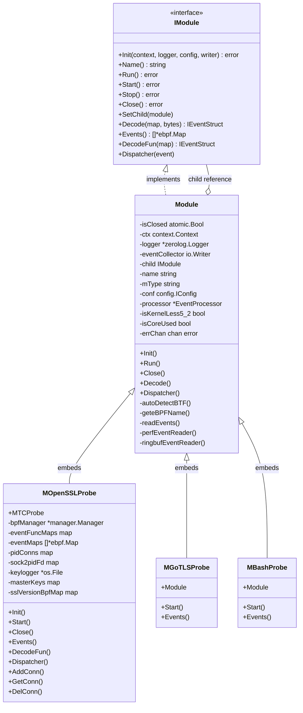
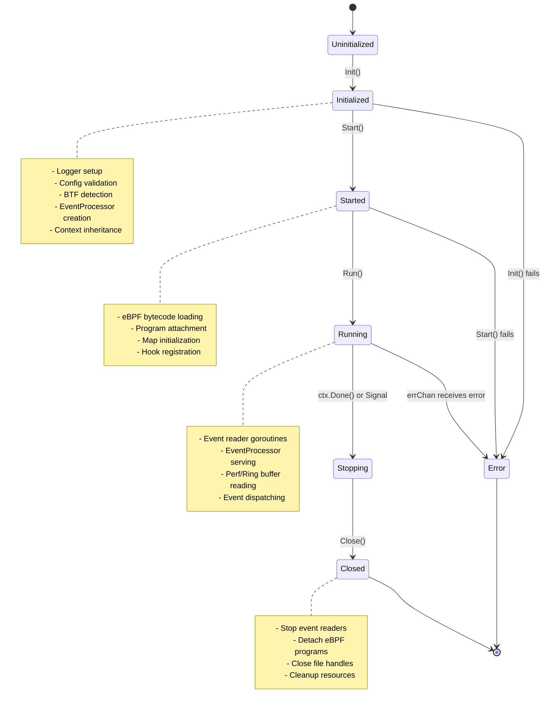
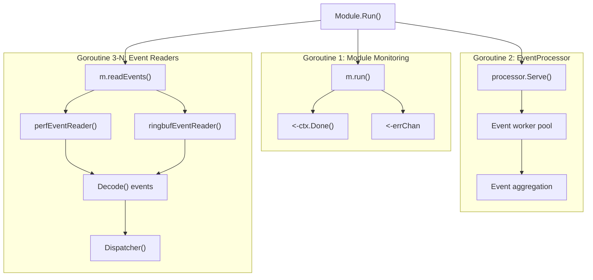
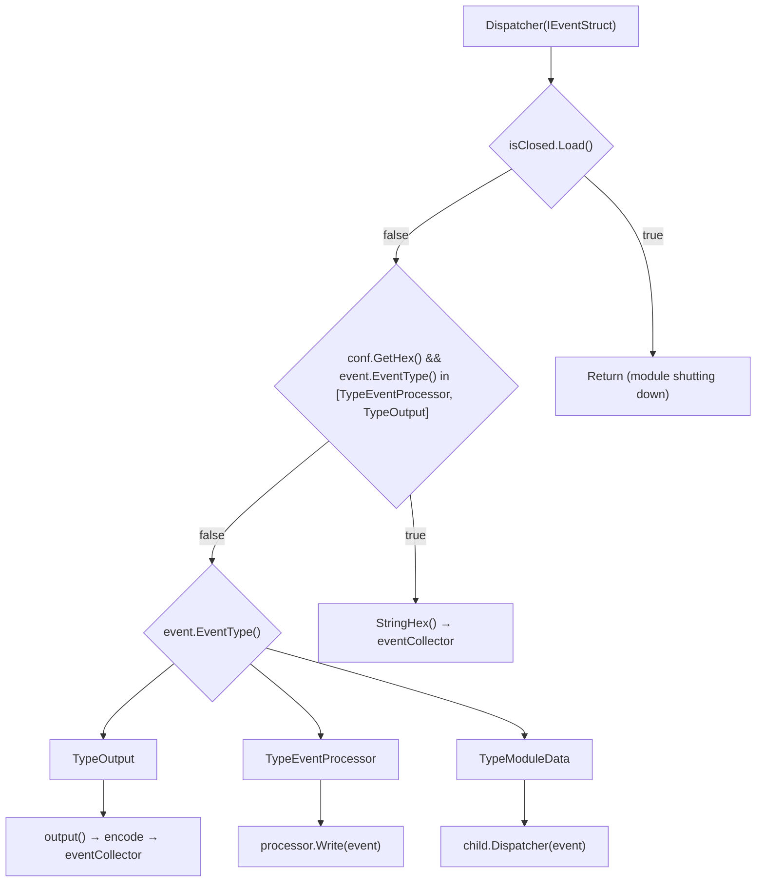
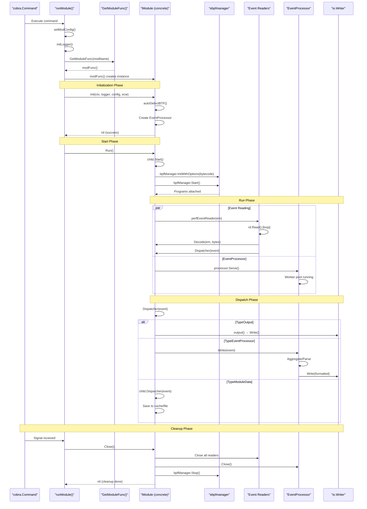

# Module System and Lifecycle

<details>
<summary>Relevant source files</summary>

The following files were used as context for generating this wiki page:

- [CHANGELOG.md](https://github.com/gojue/ecapture/blob/0766a93b/CHANGELOG.md)
- [README.md](https://github.com/gojue/ecapture/blob/0766a93b/README.md)
- [README_CN.md](https://github.com/gojue/ecapture/blob/0766a93b/README_CN.md)
- [cli/cmd/root.go](https://github.com/gojue/ecapture/blob/0766a93b/cli/cmd/root.go)
- [images/ecapture-help-v0.8.9.svg](https://github.com/gojue/ecapture/blob/0766a93b/images/ecapture-help-v0.8.9.svg)
- [main.go](https://github.com/gojue/ecapture/blob/0766a93b/main.go)
- [user/config/iconfig.go](https://github.com/gojue/ecapture/blob/0766a93b/user/config/iconfig.go)
- [user/module/imodule.go](https://github.com/gojue/ecapture/blob/0766a93b/user/module/imodule.go)
- [user/module/probe_openssl.go](https://github.com/gojue/ecapture/blob/0766a93b/user/module/probe_openssl.go)

</details>


This document explains the module system architecture in eCapture, including the `IModule` interface contract, module registration patterns, and the complete lifecycle from initialization through shutdown. For details on how modules configure themselves, see [Configuration System](2.3-configuration-system.md). For information on eBPF program loading within modules, see [eBPF Engine](2.1-ebpf-engine.md).

## IModule Interface Contract

The `IModule` interface defines the standard contract that all capture modules must implement. This interface enables polymorphic module handling throughout the system, allowing the CLI and HTTP API to instantiate and manage different capture types (TLS, Bash, MySQL, etc.) uniformly.

**Core Interface Definition**

| Method | Purpose | Called By |
|--------|---------|-----------|
| `Init(context.Context, *zerolog.Logger, config.IConfig, io.Writer)` | Initialize module with context, logger, config, and event writer | CLI/HTTP handler before starting |
| `Name()` | Return module name (e.g., "openssl", "gotls") | Logging and identification |
| `Run()` | Start event processing pipeline | CLI after initialization completes |
| `Start()` | Load and attach eBPF programs | `Module.Run()` internally |
| `Stop()` | Gracefully stop capture | Signal handlers |
| `Close()` | Release all resources | Shutdown sequence |
| `SetChild(IModule)` | Register concrete implementation for parent-child pattern | `Init()` phase |
| `Events()` | Return list of eBPF maps for event reading | Event reader setup |
| `DecodeFun(*ebpf.Map)` | Get decoder for specific eBPF map | Event decoding |
| `Decode(*ebpf.Map, []byte)` | Decode raw bytes to event struct | Event processing |
| `Dispatcher(event.IEventStruct)` | Handle decoded events | Event routing |

**Sources:** [user/module/imodule.go:47-75](https://github.com/gojue/ecapture/blob/0766a93b/user/module/imodule.go#L47-L75)



**Diagram: IModule Interface Hierarchy**

The parent-child pattern allows the base `Module` struct to provide common functionality (BTF detection, event reading, context management) while delegating module-specific operations (eBPF program setup, event decoding) to concrete implementations via the `child` field.

**Sources:** [user/module/imodule.go:83-108](https://github.com/gojue/ecapture/blob/0766a93b/user/module/imodule.go#L83-L108), [user/module/probe_openssl.go:83-106](https://github.com/gojue/ecapture/blob/0766a93b/user/module/probe_openssl.go#L83-L106)

## Module Registration and Factory Pattern

eCapture uses a factory pattern for module instantiation, enabling dynamic module loading based on CLI commands. Each module registers a factory function during package initialization.

**Registration Mechanism**

```mermaid
graph LR
    subgraph "Package Initialization"
        Init1["module/probe_openssl.go init()"]
        Init2["module/probe_gotls.go init()"]
        Init3["module/probe_bash.go init()"]
    end
    
    subgraph "Registry"
        RegisteFunc["RegisteFunc(GetModuleFunc)"]
        Registry["moduleRegistry map[string]GetModuleFunc"]
    end
    
    subgraph "CLI Invocation"
        CLI["cobra command"]
        RunModule["runModule(modName, config)"]
        GetFunc["GetModuleFunc(modName)"]
    end
    
    subgraph "Module Creation"
        Factory["modFunc() IModule"]
        Instance["module instance"]
    end
    
    Init1 --> RegisteFunc
    Init2 --> RegisteFunc
    Init3 --> RegisteFunc
    RegisteFunc --> Registry
    
    CLI --> RunModule
    RunModule --> GetFunc
    GetFunc --> Registry
    Registry --> Factory
    Factory --> Instance
```

**Diagram: Module Registration and Factory Flow**

**Sources:** [user/module/probe_openssl.go:777-786](https://github.com/gojue/ecapture/blob/0766a93b/user/module/probe_openssl.go#L777-L786)

**Module Name Constants**

Each module is identified by a unique string constant used for registry lookups:

| Module Name | Constant | Target |
|-------------|----------|--------|
| `ModuleNameOpenssl` | "openssl" | OpenSSL/BoringSSL |
| `ModuleNameGotls` | "gotls" | Go crypto/tls |
| `ModuleNameGnutls` | "gnutls" | GnuTLS |
| `ModuleNameNspr` | "nspr" | NSS/NSPR |
| `ModuleNameBash` | "bash" | Bash shell |
| `ModuleNameZsh` | "zsh" | Zsh shell |
| `ModuleNameMysqld` | "mysqld" | MySQL server |
| `ModuleNamePostgres` | "postgres" | PostgreSQL |

**CLI-to-Module Mapping**

The CLI layer maps cobra commands to modules via the `runModule()` function:

- `ecapture tls` → `runModule(ModuleNameOpenssl, oc)` [cli/cmd/tls.go:62-67](https://github.com/gojue/ecapture/blob/0766a93b/cli/cmd/tls.go#L62-L67)
- `ecapture gotls` → `runModule(ModuleNameGotls, goc)` [cli/cmd/gotls.go:52-58](https://github.com/gojue/ecapture/blob/0766a93b/cli/cmd/gotls.go#L52-L58)
- `ecapture bash` → `runModule(ModuleNameBash, bc)` [cli/cmd/bash.go:53-55](https://github.com/gojue/ecapture/blob/0766a93b/cli/cmd/bash.go#L53-L55)
- `ecapture mysqld` → `runModule(ModuleNameMysqld, myc)` [cli/cmd/mysqld.go:47-49](https://github.com/gojue/ecapture/blob/0766a93b/cli/cmd/mysqld.go#L47-L49)

**Sources:** [cli/cmd/tls.go:62-67](https://github.com/gojue/ecapture/blob/0766a93b/cli/cmd/tls.go#L62-L67), [cli/cmd/gotls.go:52-58](https://github.com/gojue/ecapture/blob/0766a93b/cli/cmd/gotls.go#L52-L58), [cli/cmd/bash.go:53-55](https://github.com/gojue/ecapture/blob/0766a93b/cli/cmd/bash.go#L53-L55)

## Module Lifecycle Stages

The module lifecycle consists of five distinct phases, each with specific responsibilities. Modules progress through these stages sequentially, with error handling at each transition point.



**Diagram: Module Lifecycle State Machine**

**Sources:** [cli/cmd/root.go:336-397](https://github.com/gojue/ecapture/blob/0766a93b/cli/cmd/root.go#L336-L397), [user/module/imodule.go:110-171](https://github.com/gojue/ecapture/blob/0766a93b/user/module/imodule.go#L110-L171)

### Initialization Phase (Init)

The `Init()` method prepares the module for execution. This is where the module receives its dependencies and performs environment detection.

**Initialization Responsibilities:**

1. **Context Inheritance**: Store parent context for cancellation propagation
2. **Logger Configuration**: Set up zerolog instance for module-specific logging
3. **Config Storage**: Save `IConfig` reference for runtime parameter access
4. **BTF Mode Detection**: Determine whether to use CO-RE or non-CO-RE bytecode
5. **Kernel Version Check**: Detect if kernel version < 5.2 (affects PID filtering)
6. **EventProcessor Creation**: Initialize event aggregation and formatting pipeline
7. **Output Format Selection**: Choose between text/protobuf based on event collector type

**Base Module Init Implementation:**

[user/module/imodule.go:111-171](https://github.com/gojue/ecapture/blob/0766a93b/user/module/imodule.go#L111-L171) shows the common initialization logic:

```
m.isClosed.Store(false)
m.ctx = ctx
m.logger = logger
m.errChan = make(chan error, 16)

// BTF auto-detection
if conf.GetBTF() == config.BTFModeAutoDetect {
    m.autoDetectBTF()
} else {
    m.isCoreUsed = (conf.GetBTF() == config.BTFModeCore)
}

// Kernel version detection
kv, err := kernel.HostVersion()
if kv < kernel.VersionCode(5, 2, 0) {
    m.isKernelLess5_2 = true
}

// EventProcessor with truncation support
m.processor = event_processor.NewEventProcessor(eventCollector, conf.GetHex(), tsize)
```

**Module-Specific Init Extensions:**

Concrete modules extend initialization with their own setup. For example, `MOpenSSLProbe.Init()`:

[user/module/probe_openssl.go:109-176](https://github.com/gojue/ecapture/blob/0766a93b/user/module/probe_openssl.go#L109-L176) adds:

- Connection tracking map initialization (`pidConns`, `sock2pidFd`)
- Capture mode selection (Text/Pcap/Keylog)
- File handle creation for keylog/pcap files
- Clock synchronization for timestamp conversion
- SSL version offset map initialization

**Sources:** [user/module/imodule.go:110-171](https://github.com/gojue/ecapture/blob/0766a93b/user/module/imodule.go#L110-L171), [user/module/probe_openssl.go:109-176](https://github.com/gojue/ecapture/blob/0766a93b/user/module/probe_openssl.go#L109-L176)

### Start Phase

The `Start()` method loads and attaches eBPF programs. This is where module-specific hooking logic executes.

**Start Phase Operations:**

1. **Manager Setup**: Configure `ebpfmanager.Manager` with probes and maps
2. **Bytecode Selection**: Choose appropriate `.o` file based on version detection
3. **Program Loading**: Parse ELF bytecode and create eBPF programs
4. **Constant Editing**: Inject runtime values (target PID, UID) into eBPF constants
5. **Program Attachment**: Attach uprobes/kprobes/TC hooks to target functions
6. **Map Registration**: Store references to eBPF maps for event reading

**OpenSSL Module Start Example:**

[user/module/probe_openssl.go:280-350](https://github.com/gojue/ecapture/blob/0766a93b/user/module/probe_openssl.go#L280-L350) demonstrates the flow:

```
1. setupManagers() - Configure manager based on capture mode (Text/Pcap/Keylog)
2. geteBPFName() - Select bytecode file (core vs non-core, version-specific)
3. assets.Asset(bpfFileName) - Load embedded bytecode
4. bpfManager.InitWithOptions() - Initialize with bytecode and options
5. bpfManager.Start() - Attach all programs
6. initDecodeFun() - Register event decoders for each eBPF map
```

**Manager Configuration by Mode:**

| Mode | Manager Setup | Maps Used | TC Hooks |
|------|---------------|-----------|----------|
| Text | `setupManagersText()` | `events` | No |
| Pcap | `setupManagersPcap()` | `events`, `mastersecret_events`, `skb_events` | Yes |
| Keylog | `setupManagersKeylog()` | `mastersecret_events` | No |

**Sources:** [user/module/probe_openssl.go:280-350](https://github.com/gojue/ecapture/blob/0766a93b/user/module/probe_openssl.go#L280-L350)

### Run Phase

The `Run()` method starts the event processing pipeline, launching goroutines for event reading and dispatching.

**Run Phase Components:**



**Diagram: Run Phase Goroutine Architecture**

**Event Reading Implementation:**

[user/module/imodule.go:285-306](https://github.com/gojue/ecapture/blob/0766a93b/user/module/imodule.go#L285-L306) iterates over `Events()` maps and creates readers:

- **Perf Event Arrays**: Uses `perf.NewReader()` with configurable buffer size [user/module/imodule.go:308-351](https://github.com/gojue/ecapture/blob/0766a93b/user/module/imodule.go#L308-L351)
- **Ring Buffers**: Uses `ringbuf.NewReader()` for newer kernels [user/module/imodule.go:353-391](https://github.com/gojue/ecapture/blob/0766a93b/user/module/imodule.go#L353-L391)

Each reader runs in a goroutine that:
1. Blocks on `rd.Read()`
2. Decodes raw bytes via `child.Decode(em, record.RawSample)`
3. Dispatches events via `Dispatcher(evt)`
4. Monitors context cancellation

**Error Handling:**

- Lost samples logged with `record.LostSamples` count
- Reader errors sent to `errChan`
- Decode errors logged but don't stop processing
- Context cancellation cleanly exits reader loops

**Sources:** [user/module/imodule.go:236-262](https://github.com/gojue/ecapture/blob/0766a93b/user/module/imodule.go#L236-L262), [user/module/imodule.go:285-391](https://github.com/gojue/ecapture/blob/0766a93b/user/module/imodule.go#L285-L391)

### Stop and Cleanup Phase

The `Close()` method performs graceful shutdown, releasing all acquired resources.

**Cleanup Sequence:**

1. **Set Closed Flag**: `isClosed.Store(true)` prevents new event dispatch [user/module/imodule.go:451](https://github.com/gojue/ecapture/blob/0766a93b/user/module/imodule.go#L451)
2. **Close Event Readers**: Stop perf/ring buffer readers [user/module/imodule.go:453-457](https://github.com/gojue/ecapture/blob/0766a93b/user/module/imodule.go#L453-L457)
3. **Stop EventProcessor**: Flush pending events and close workers [user/module/imodule.go:458-459](https://github.com/gojue/ecapture/blob/0766a93b/user/module/imodule.go#L458-L459)
4. **Detach eBPF Programs**: Unload programs and maps via `bpfManager.Stop()` [user/module/probe_openssl.go:352-358](https://github.com/gojue/ecapture/blob/0766a93b/user/module/probe_openssl.go#L352-L358)
5. **Close File Handles**: Flush and close keylog/pcap files
6. **Cleanup Maps**: Clear connection tracking and master key maps

**Module Close Example (OpenSSL):**

[user/module/probe_openssl.go:352-358](https://github.com/gojue/ecapture/blob/0766a93b/user/module/probe_openssl.go#L352-L358):

```
m.logger.Info().Msg("module close.")
if err := m.bpfManager.Stop(manager.CleanAll); err != nil {
    return fmt.Errorf("couldn't stop manager %w .", err)
}
return m.Module.Close()  // Call parent cleanup
```

**Parent Module Close:**

[user/module/imodule.go:450-460](https://github.com/gojue/ecapture/blob/0766a93b/user/module/imodule.go#L450-L460):

```
m.isClosed.Store(true)  // Prevent new event dispatch
for _, iClose := range m.reader {
    if err := iClose.Close(); err != nil {
        return err
    }
}
err := m.processor.Close()  // Flush remaining events
return err
```

**Sources:** [user/module/imodule.go:450-460](https://github.com/gojue/ecapture/blob/0766a93b/user/module/imodule.go#L450-L460), [user/module/probe_openssl.go:352-358](https://github.com/gojue/ecapture/blob/0766a93b/user/module/probe_openssl.go#L352-L358)

## Base Module Implementation

The `Module` struct provides common functionality shared across all capture modules, implementing the IModule interface partially and delegating specialized operations to child modules.

**Shared Capabilities:**

| Capability | Implementation | Purpose |
|------------|----------------|---------|
| BTF Detection | `autoDetectBTF()` | Determine CO-RE support [user/module/imodule.go:173-190](https://github.com/gojue/ecapture/blob/0766a93b/user/module/imodule.go#L173-L190) |
| Bytecode Selection | `geteBPFName()` | Choose _core.o vs _noncore.o variant [user/module/imodule.go:191-214](https://github.com/gojue/ecapture/blob/0766a93b/user/module/imodule.go#L191-L214) |
| Event Reading | `perfEventReader()`, `ringbufEventReader()` | Read from eBPF maps [user/module/imodule.go:308-391](https://github.com/gojue/ecapture/blob/0766a93b/user/module/imodule.go#L308-L391) |
| Event Decoding | `Decode()` | Deserialize eBPF events [user/module/imodule.go:393-406](https://github.com/gojue/ecapture/blob/0766a93b/user/module/imodule.go#L393-L406) |
| Event Routing | `Dispatcher()` | Route events by type [user/module/imodule.go:408-448](https://github.com/gojue/ecapture/blob/0766a93b/user/module/imodule.go#L408-L448) |
| Output Encoding | `output()` | Format as text or protobuf [user/module/imodule.go:461-479](https://github.com/gojue/ecapture/blob/0766a93b/user/module/imodule.go#L461-L479) |
| Context Management | `run()` | Monitor for shutdown signals [user/module/imodule.go:268-283](https://github.com/gojue/ecapture/blob/0766a93b/user/module/imodule.go#L268-L283) |

**Parent-Child Delegation Pattern:**

The base `Module` stores a reference to the concrete implementation via `child IModule`. Operations that require module-specific logic are delegated:

[user/module/imodule.go:393-406](https://github.com/gojue/ecapture/blob/0766a93b/user/module/imodule.go#L393-L406) shows delegation in `Decode()`:

```
es, found := m.child.DecodeFun(em)  // Get module-specific decoder
if !found {
    return error
}
te := es.Clone()  // Clone event struct
err = te.Decode(b)  // Deserialize
```

**Initialization Flow with Delegation:**

[user/module/probe_openssl.go:109-176](https://github.com/gojue/ecapture/blob/0766a93b/user/module/probe_openssl.go#L109-L176):

```
func (m *MOpenSSLProbe) Init(...) error {
    err = m.Module.Init(ctx, logger, conf, ecw)  // Call parent
    if err != nil {
        return err
    }
    m.Module.SetChild(m)  // Register self as child
    
    // Module-specific initialization
    m.eventMaps = make([]*ebpf.Map, 0, 2)
    m.eventFuncMaps = make(map[*ebpf.Map]event.IEventStruct)
    ...
}
```

**Sources:** [user/module/imodule.go:83-108](https://github.com/gojue/ecapture/blob/0766a93b/user/module/imodule.go#L83-L108), [user/module/imodule.go:110-171](https://github.com/gojue/ecapture/blob/0766a93b/user/module/imodule.go#L110-L171), [user/module/probe_openssl.go:109-176](https://github.com/gojue/ecapture/blob/0766a93b/user/module/probe_openssl.go#L109-L176)

## Module Configuration Integration

Modules receive configuration through the `IConfig` interface, allowing runtime behavior customization. Each module type has a corresponding config struct.

**Config to Module Mapping:**

| Module | Config Type | CLI Command | Key Flags |
|--------|-------------|-------------|-----------|
| MOpenSSLProbe | `OpensslConfig` | `tls` | `--libssl`, `--model`, `--pcapfile` |
| MGoTLSProbe | `GoTLSConfig` | `gotls` | `--elfpath`, `--model` |
| MGnuTLSProbe | `GnutlsConfig` | `gnutls` | `--gnutls`, `--ssl_version` |
| MBashProbe | `BashConfig` | `bash` | `--bash`, `--errnumber` |
| MMysqldProbe | `MysqldConfig` | `mysqld` | `--mysqld`, `--offset` |
| MPostgresProbe | `PostgresConfig` | `postgres` | `--postgres` |

**Global Config Application:**

[cli/cmd/root.go:156-175](https://github.com/gojue/ecapture/blob/0766a93b/cli/cmd/root.go#L156-L175) applies global settings to module configs:

```
func setModConfig(globalConf config.BaseConfig, modConf config.IConfig) {
    modConf.SetPid(globalConf.Pid)
    modConf.SetUid(globalConf.Uid)
    modConf.SetDebug(globalConf.Debug)
    modConf.SetHex(globalConf.IsHex)
    modConf.SetBTF(globalConf.BtfMode)
    modConf.SetPerCpuMapSize(globalConf.PerCpuMapSize)
    modConf.SetTruncateSize(globalConf.TruncateSize)
    ...
}
```

**Runtime Configuration Updates:**

The HTTP server supports runtime config reloads via `POST /config` [cli/cmd/root.go:375-396](https://github.com/gojue/ecapture/blob/0766a93b/cli/cmd/root.go#L375-L396):

1. New config received on `reRloadConfig` channel
2. `mod.Close()` called to stop current module
3. `goto reload` jumps back to initialization
4. New config applied and module restarted

**Sources:** [cli/cmd/root.go:156-175](https://github.com/gojue/ecapture/blob/0766a93b/cli/cmd/root.go#L156-L175), [cli/cmd/root.go:336-397](https://github.com/gojue/ecapture/blob/0766a93b/cli/cmd/root.go#L336-L397), [user/config/iconfig.go:24-70](https://github.com/gojue/ecapture/blob/0766a93b/user/config/iconfig.go#L24-L70)

## Event Dispatch and Processing

The `Dispatcher()` method routes decoded events to appropriate handlers based on event type. This implements a three-way routing strategy.



**Diagram: Event Dispatch Routing Logic**

**Event Type Categories:**

[user/module/imodule.go:408-448](https://github.com/gojue/ecapture/blob/0766a93b/user/module/imodule.go#L408-L448) routes events by type:

- **`TypeOutput`**: Final formatted events ready for display → `eventCollector.Write()`
- **`TypeEventProcessor`**: Events requiring aggregation/parsing → `processor.Write()`
- **`TypeModuleData`**: Module-specific data (connections, master secrets) → `child.Dispatcher()`

**Module-Specific Dispatch Example:**

[user/module/probe_openssl.go:733-754](https://github.com/gojue/ecapture/blob/0766a93b/user/module/probe_openssl.go#L733-L754) handles OpenSSL-specific events:

```
func (m *MOpenSSLProbe) Dispatcher(eventStruct event.IEventStruct) {
    switch ev := eventStruct.(type) {
    case *event.ConnDataEvent:
        if ev.IsDestroy == 0 {
            m.AddConn(ev.Pid, ev.Fd, ev.Tuple, ev.Sock)  // Track connection
        } else {
            m.DelConn(ev.Sock)  // Remove connection
        }
    case *event.MasterSecretEvent:
        m.saveMasterSecret(ev)  // Write to keylog
    case *event.TcSkbEvent:
        m.dumpTcSkb(ev)  // Write to PCAP
    case *event.SSLDataEvent:
        m.dumpSslData(ev)  // Process plaintext data
    }
}
```

**Sources:** [user/module/imodule.go:408-448](https://github.com/gojue/ecapture/blob/0766a93b/user/module/imodule.go#L408-L448), [user/module/probe_openssl.go:733-754](https://github.com/gojue/ecapture/blob/0766a93b/user/module/probe_openssl.go#L733-L754)

## Complete System Integration Flow

This diagram shows how modules integrate with the broader eCapture system from CLI invocation through event output.



**Diagram: Complete Module Integration Sequence**

**Sources:** [cli/cmd/root.go:249-403](https://github.com/gojue/ecapture/blob/0766a93b/cli/cmd/root.go#L249-L403), [user/module/imodule.go:236-262](https://github.com/gojue/ecapture/blob/0766a93b/user/module/imodule.go#L236-L262)

## Module List and Capabilities

The following table summarizes all available modules and their key characteristics:

| Module | Name Constant | Primary Target | eBPF Programs | Event Types | Output Modes |
|--------|---------------|----------------|---------------|-------------|--------------|
| MOpenSSLProbe | `openssl` | libssl.so, libcrypto.so | Uprobes (SSL_read/write), TC | SSLDataEvent, MasterSecretEvent, TcSkbEvent, ConnDataEvent | Text, PCAP, Keylog |
| MGoTLSProbe | `gotls` | Go crypto/tls | Uprobes (crypto/tls funcs), TC | TlsDataEvent, MasterSecretEvent, TcSkbEvent | Text, PCAP, Keylog |
| MGnuTLSProbe | `gnutls` | libgnutls.so | Uprobes (gnutls_record funcs), TC | SSLDataEvent, MasterSecretEvent | Text, PCAP, Keylog |
| MNSSProbe | `nspr` | libnspr4.so | Uprobes (PR_Read/Write) | NsprDataEvent | Text |
| MBashProbe | `bash` | /bin/bash | Uprobes (readline funcs) | BashEvent | Text |
| MZshProbe | `zsh` | /bin/zsh | Uprobes (readline funcs) | ZshEvent | Text |
| MMysqldProbe | `mysqld` | mysqld binary | Uprobes (dispatch_command) | MysqldEvent | Text |
| MPostgresProbe | `postgres` | postgres binary | Uprobes (PostgresMain) | PostgresEvent | Text |

**Sources:** Module files across [user/module/](https://github.com/gojue/ecapture/blob/0766a93b/user/module/) directory