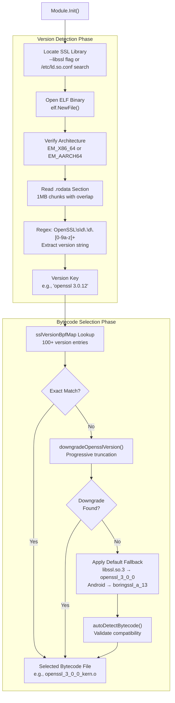
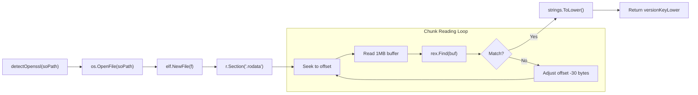
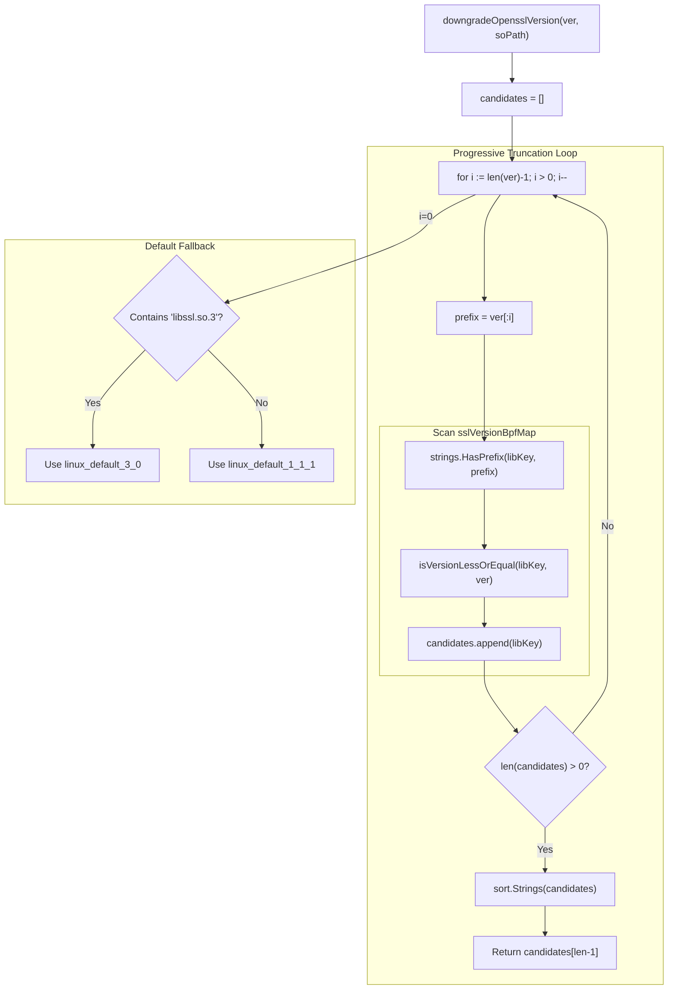
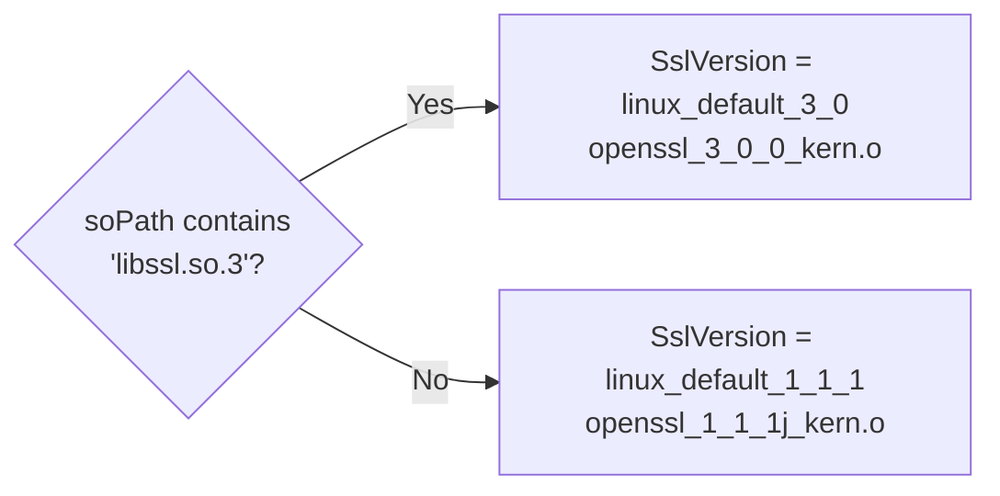
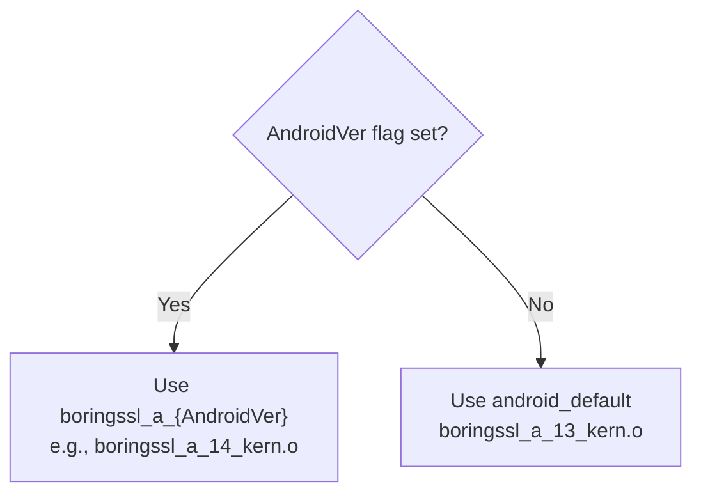
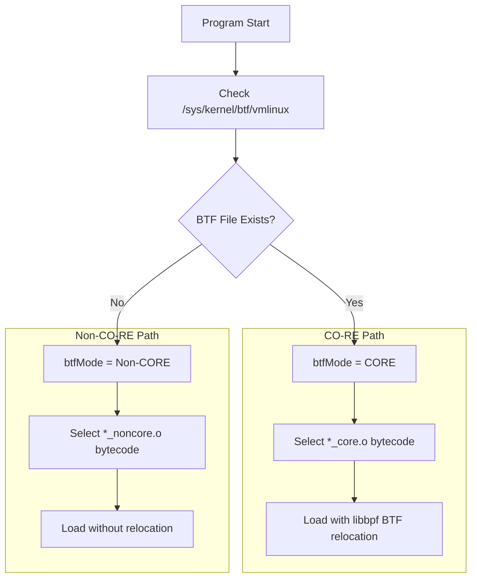
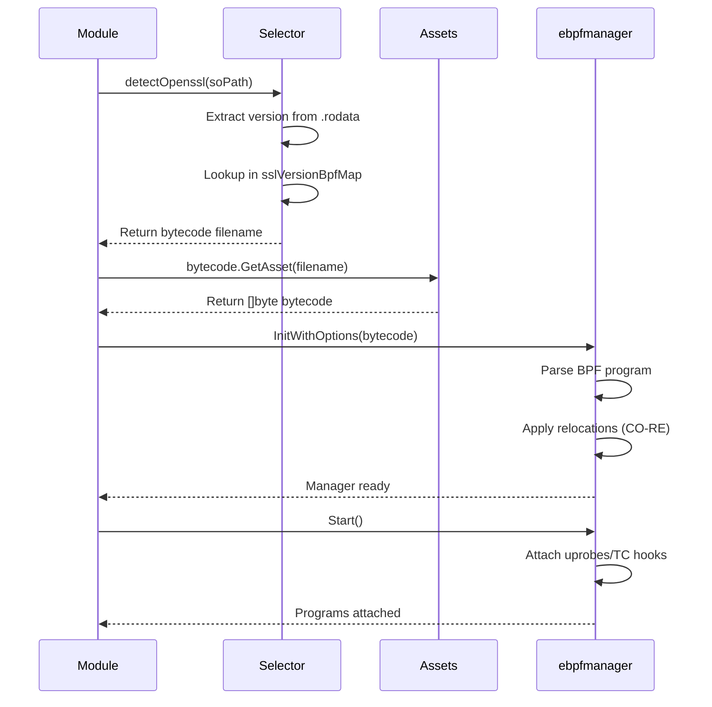

# Version Detection and Bytecode Selection

<details>
<summary>Relevant source files</summary>

The following files were used as context for generating this wiki page:

- [cli/cmd/root.go](https://github.com/gojue/ecapture/blob/0766a93b/cli/cmd/root.go)
- [user/config/iconfig.go](https://github.com/gojue/ecapture/blob/0766a93b/user/config/iconfig.go)
- [user/module/imodule.go](https://github.com/gojue/ecapture/blob/0766a93b/user/module/imodule.go)
- [user/module/probe_openssl.go](https://github.com/gojue/ecapture/blob/0766a93b/user/module/probe_openssl.go)
- [user/module/probe_openssl_lib.go](https://github.com/gojue/ecapture/blob/0766a93b/user/module/probe_openssl_lib.go)
- [variables.mk](https://github.com/gojue/ecapture/blob/0766a93b/variables.mk)

</details>


## Purpose and Scope

This page documents eCapture's sophisticated version detection and bytecode selection system, which enables the tool to work across multiple SSL/TLS library versions and kernel configurations without requiring manual version specification. The system automatically identifies the target library version, selects compatible eBPF bytecode, and falls back to safe defaults when exact matches are unavailable.

For information about the eBPF compilation process that produces these bytecode variants, see [Build System](../5-development-guide/5.1-build-system.md). For details on module initialization and lifecycle, see [Module System and Lifecycle](2.4-module-system-and-lifecycle.md).

## System Overview

eCapture compiles over 130 different eBPF bytecode variants to support:
- **OpenSSL**: versions 1.0.2a through 3.5.4
- **BoringSSL**: Android 12-16 variants and non-Android versions
- **GnuTLS**: versions 3.6.12 through 3.8.7
- **Go TLS**: built-in crypto/tls library
- **System utilities**: bash, zsh, mysqld, postgres

Each SSL/TLS library version has different internal structure layouts (offsets), requiring version-specific bytecode. The system performs runtime detection to select the correct variant.

**Sources:** [variables.mk:189-228](https://github.com/gojue/ecapture/blob/0766a93b/variables.mk#L189-L228), [user/module/probe_openssl_lib.go:30-42](https://github.com/gojue/ecapture/blob/0766a93b/user/module/probe_openssl_lib.go#L30-L42), [CHANGELOG.md:14-23](https://github.com/gojue/ecapture/blob/0766a93b/CHANGELOG.md#L14-L23)

## Version Detection Architecture



**Sources:** [user/module/probe_openssl_lib.go:189-282](https://github.com/gojue/ecapture/blob/0766a93b/user/module/probe_openssl_lib.go#L189-L282), [user/module/probe_openssl_lib.go:284-317](https://github.com/gojue/ecapture/blob/0766a93b/user/module/probe_openssl_lib.go#L284-L317), [user/module/probe_openssl_lib.go:341-369](https://github.com/gojue/ecapture/blob/0766a93b/user/module/probe_openssl_lib.go#L341-L369)

## ELF Parsing and Version Extraction

The `detectOpenssl()` function implements a robust version string extraction mechanism:

### Process Steps

1. **ELF File Opening**: Opens the target shared library using `os.OpenFile()` and `elf.NewFile()`
2. **Architecture Validation**: Ensures the binary is `EM_X86_64` or `EM_AARCH64`
3. **Section Location**: Finds the `.rodata` section containing read-only data (version strings)
4. **Chunk Reading**: Reads in 1MB chunks with 30-byte overlap to handle edge cases
5. **Regex Matching**: Applies pattern `OpenSSL\s\d\.\d\.[0-9a-z]+` to extract version

### Edge Case Handling

| Scenario | Solution |
|----------|----------|
| Version string spans buffer boundary | 30-byte overlap (`OpenSslVersionLen`) ensures capture |
| `.rodata` section not found | Returns `ErrProbeOpensslVerNotFound` |
| Multiple version strings in binary | Uses first match found |
| BoringSSL without version string | Falls back to Android detection or default |

**Example version strings extracted:**
- `"OpenSSL 1.1.1j  16 Feb 2021"` → `"openssl 1.1.1j"`
- `"OpenSSL 3.2.0 23 Nov 2023"` → `"openssl 3.2.0"`

**Sources:** [user/module/probe_openssl_lib.go:189-282](https://github.com/gojue/ecapture/blob/0766a93b/user/module/probe_openssl_lib.go#L189-L282), [user/module/probe_openssl_lib.go:41-42](https://github.com/gojue/ecapture/blob/0766a93b/user/module/probe_openssl_lib.go#L41-L42)

### Detection Flow Diagram



**Sources:** [user/module/probe_openssl_lib.go:206-282](https://github.com/gojue/ecapture/blob/0766a93b/user/module/probe_openssl_lib.go#L206-L282)

## Version-to-Bytecode Mapping System

The `initOpensslOffset()` function initializes the `sslVersionBpfMap` with 100+ version mappings. This map serves as the authoritative source for version-to-bytecode associations.

### Mapping Table Structure

| Version Family | Version Range | Bytecode File | Notes |
|----------------|---------------|---------------|-------|
| OpenSSL 1.0.2 | 1.0.2a - 1.0.2u | `openssl_1_0_2a_kern.o` | All 1.0.2 versions share offsets |
| OpenSSL 1.1.0 | 1.1.0a - 1.1.0l | `openssl_1_1_0a_kern.o` | All 1.1.0 versions share offsets |
| OpenSSL 1.1.1a | 1.1.1a only | `openssl_1_1_1a_kern.o` | Unique offset group |
| OpenSSL 1.1.1b-c | 1.1.1b - 1.1.1c | `openssl_1_1_1b_kern.o` | Second offset group |
| OpenSSL 1.1.1d-i | 1.1.1d - 1.1.1i | `openssl_1_1_1d_kern.o` | Third offset group |
| OpenSSL 1.1.1j+ | 1.1.1j - 1.1.1w | `openssl_1_1_1j_kern.o` | Most common 1.1.1 variant |
| OpenSSL 3.0.x | 3.0.0 - 3.0.11, 3.0.13+ | `openssl_3_0_0_kern.o` | Default for 3.0 series |
| OpenSSL 3.0.12 | 3.0.12 only | `openssl_3_0_12_kern.o` | Special case with unique offsets |
| OpenSSL 3.1.x | 3.1.0 - 3.1.8 | `openssl_3_1_0_kern.o` | Shares base with 3.0 series |
| OpenSSL 3.2.0-2 | 3.2.0 - 3.2.2 | `openssl_3_2_0_kern.o` | Early 3.2 series |
| OpenSSL 3.2.3 | 3.2.3 only | `openssl_3_2_3_kern.o` | Structure changes |
| OpenSSL 3.2.5 | 3.2.5 only | `openssl_3_2_4_kern.o` | Additional changes |
| OpenSSL 3.3.0-1 | 3.3.0 - 3.3.1 | `openssl_3_3_0_kern.o` | Early 3.3 series |
| OpenSSL 3.3.2 | 3.3.2 only | `openssl_3_3_2_kern.o` | Mid-series changes |
| OpenSSL 3.3.3-4 | 3.3.3 - 3.3.4 | `openssl_3_3_3_kern.o` | Latest 3.3 series |
| OpenSSL 3.4.0 | 3.4.0 only | `openssl_3_4_0_kern.o` | Initial 3.4 release |
| OpenSSL 3.4.1+ | 3.4.1 - 3.4.2 | `openssl_3_4_1_kern.o` | Updated 3.4 series |
| OpenSSL 3.5.x | 3.5.0 - 3.5.4 | `openssl_3_5_0_kern.o` | Latest supported |
| BoringSSL A12-13 | Android 12-13 | `boringssl_a_13_kern.o` | Google's fork |
| BoringSSL A14 | Android 14 | `boringssl_a_14_kern.o` | Updated structures |
| BoringSSL A15 | Android 15 | `boringssl_a_15_kern.o` | Latest Android |
| BoringSSL A16 | Android 16 | `boringssl_a_16_kern.o` | Upcoming Android |
| BoringSSL NA | Non-Android | `boringssl_na_kern.o` | Generic BoringSSL |

### Mapping Code Structure

```mermaid
graph TB
    subgraph Initialization["initOpensslOffset()"]
        CreateMap["Create sslVersionBpfMap<br/>map[string]string"]
        
        subgraph DefaultMappings["Default Mappings"]
            D102["linux_default_1_0_2<br/>→ openssl_1_0_2a_kern.o"]
            D110["linux_default_1_1_0<br/>→ openssl_1_1_0a_kern.o"]
            D111["linux_default_1_1_1<br/>→ openssl_1_1_1j_kern.o"]
            D30["linux_default_3_0<br/>→ openssl_3_0_0_kern.o"]
            DAndroid["android_default<br/>→ boringssl_a_13_kern.o"]
        end
        
        subgraph LoopMappings["Loop-Generated Mappings"]
            L111["for ch := 'j'; ch <= 'w'<br/>openssl 1.1.1{ch}"]
            L30["for ch := 0; ch <= 17<br/>openssl 3.0.{ch}"]
            L31["for ch := 0; ch <= 8<br/>openssl 3.1.{ch}"]
            L32["for ch := 0; ch <= 5<br/>openssl 3.2.{ch}"]
            L33["for ch := 0; ch <= 4<br/>openssl 3.3.{ch}"]
            L34["for ch := 0; ch <= 2<br/>openssl 3.4.{ch}"]
            L35["for ch := 0; ch <= 4<br/>openssl 3.5.{ch}"]
        end
        
        subgraph SpecialCases["Special Case Mappings"]
            S3012["openssl 3.0.12<br/>→ openssl_3_0_12_kern.o"]
            S323["openssl 3.2.3<br/>→ openssl_3_2_3_kern.o"]
            S325["openssl 3.2.5<br/>→ openssl_3_2_4_kern.o"]
        end
    end
    
    CreateMap --> DefaultMappings
    DefaultMappings --> LoopMappings
    LoopMappings --> SpecialCases
```



**Sources:** [user/module/probe_openssl_lib.go:73-187](https://github.com/gojue/ecapture/blob/0766a93b/user/module/probe_openssl_lib.go#L73-L187), [user/module/probe_openssl_lib.go:44-62](https://github.com/gojue/ecapture/blob/0766a93b/user/module/probe_openssl_lib.go#L44-L62)

## Downgrade Version Selection Algorithm

When an exact version match is not found in `sslVersionBpfMap`, the `downgradeOpensslVersion()` function implements a progressive truncation algorithm to find the closest compatible older version.

### Algorithm Steps



**Sources:** [user/module/probe_openssl_lib.go:341-369](https://github.com/gojue/ecapture/blob/0766a93b/user/module/probe_openssl_lib.go#L341-L369)

### Version Comparison Logic

The `isVersionLessOrEqual()` function performs lexicographic version comparison:

1. **Extract version parts**: Split by dots (`"3.0.12"` → `["3", "0", "12"]`)
2. **Parse numeric and suffix**: `"1a"` → `num=1, suffix="a"`
3. **Compare iteratively**: Compare numbers first, then suffixes

**Example comparisons:**
- `isVersionLessOrEqual("openssl 3.0.11", "openssl 3.0.12")` → `true`
- `isVersionLessOrEqual("openssl 3.0.12", "openssl 3.0.11")` → `false`
- `isVersionLessOrEqual("openssl 1.1.1j", "openssl 1.1.1k")` → `true`

**Sources:** [user/module/probe_openssl_lib.go:371-448](https://github.com/gojue/ecapture/blob/0766a93b/user/module/probe_openssl_lib.go#L371-L448)

## Default Fallback Behavior

When all detection and downgrade attempts fail, the system applies platform-specific defaults:

### Linux Platform Defaults



**Rationale:**
- `libssl.so.3` indicates OpenSSL 3.x series (most likely 3.0.x)
- Older library names default to 1.1.1j (most stable/common 1.1.1 variant)

### Android Platform Defaults



**Android version mapping:**
- `--android_ver=13` → `boringssl_a_13_kern.o`
- `--android_ver=14` → `boringssl_a_14_kern.o`
- `--android_ver=15` → `boringssl_a_15_kern.o`
- `--android_ver=16` → `boringssl_a_16_kern.o`

**Sources:** [user/module/probe_openssl_lib.go:284-317](https://github.com/gojue/ecapture/blob/0766a93b/user/module/probe_openssl_lib.go#L284-L317), [user/module/probe_openssl_lib.go:361-368](https://github.com/gojue/ecapture/blob/0766a93b/user/module/probe_openssl_lib.go#L361-L368)

## CO-RE vs Non-CO-RE Bytecode Selection

eCapture maintains two bytecode variants for each version: CO-RE (Compile Once, Run Everywhere) and non-CO-RE (kernel-specific). The selection happens automatically based on kernel BTF support.

### Selection Criteria

| Criterion | CO-RE Mode | Non-CO-RE Mode |
|-----------|------------|----------------|
| Kernel BTF Support | `CONFIG_DEBUG_INFO_BTF=y` | Not required |
| Minimum Kernel Version | 5.2+ (x86_64), 5.5+ (aarch64) | 4.18+ (x86_64), 5.5+ (aarch64) |
| Bytecode Suffix | `_core.o` | `_noncore.o` |
| Relocation | Runtime via libbpf | Compile-time via kernel headers |
| Portability | Works across kernel versions | Tied to specific kernel |

### BTF Detection Flow



### Compilation Targets

The build system generates both variants simultaneously:

**CO-RE compilation (x86_64 example):**
```
clang -target bpfel -D__TARGET_ARCH_x86 -I./kern/bpf/x86 \
      -O2 -g -c -o openssl_3_0_0_kern_core.o openssl_3_0_0_kern.c
```

**Non-CO-RE compilation (x86_64 example):**
```
clang -D__TARGET_ARCH_x86 -I/lib/modules/$(uname -r)/build/include \
      -DNOCORE -emit-llvm -S -o openssl_3_0_0_kern.ll openssl_3_0_0_kern.c
llc -march=bpf -filetype=obj -o openssl_3_0_0_kern_noncore.o openssl_3_0_0_kern.ll
```

**Sources:** [variables.mk:236-268](https://github.com/gojue/ecapture/blob/0766a93b/variables.mk#L236-L268), [README.md:86-101](https://github.com/gojue/ecapture/blob/0766a93b/README.md#L86-L101)

## Bytecode Loading and Validation

After bytecode selection, the module performs validation before attachment:

### Loading Process



### Error Handling Strategy

| Error Condition | Recovery Action | Log Message |
|-----------------|-----------------|-------------|
| Version not found in `.rodata` | Use default based on library name | `"OpenSSL/BoringSSL version not found, used default version"` |
| Bytecode file not found | Fatal error, exit | `"BPF bytecode file is not matched"` |
| Uprobe attachment failed | Log warning, continue | `"attach uprobe failed"` |
| Symbol not found | Skip that hook | `"symbol not found, ignored"` |

**Sources:** [user/module/probe_openssl_lib.go:189-282](https://github.com/gojue/ecapture/blob/0766a93b/user/module/probe_openssl_lib.go#L189-L282), [user/module/probe_openssl_lib.go:284-317](https://github.com/gojue/ecapture/blob/0766a93b/user/module/probe_openssl_lib.go#L284-L317)

## Version Support Matrix

This table summarizes the complete version support landscape:

| Library | Minimum Version | Maximum Version | Total Variants | Notes |
|---------|----------------|-----------------|----------------|-------|
| OpenSSL 1.0.2 | 1.0.2a | 1.0.2u | 1 | Legacy support |
| OpenSSL 1.1.0 | 1.1.0a | 1.1.0l | 1 | Legacy support |
| OpenSSL 1.1.1 | 1.1.1a | 1.1.1w | 4 | Most common in production |
| OpenSSL 3.0 | 3.0.0 | 3.0.17 | 2 | Default for Ubuntu 22.04+ |
| OpenSSL 3.1 | 3.1.0 | 3.1.8 | 1 | Shares base with 3.0 |
| OpenSSL 3.2 | 3.2.0 | 3.2.5 | 3 | Multiple structure changes |
| OpenSSL 3.3 | 3.3.0 | 3.3.4 | 3 | Latest stable |
| OpenSSL 3.4 | 3.4.0 | 3.4.2 | 2 | Recent release |
| OpenSSL 3.5 | 3.5.0 | 3.5.4 | 1 | Newest supported |
| BoringSSL Android | 12 | 16 | 4 | Per-Android-version |
| BoringSSL | Non-Android | N/A | 1 | Generic variant |

**Total bytecode files:** 22 SSL/TLS variants × 2 modes (CO-RE + non-CO-RE) = **44 bytecode files** just for OpenSSL/BoringSSL

**Sources:** [user/module/probe_openssl_lib.go:44-62](https://github.com/gojue/ecapture/blob/0766a93b/user/module/probe_openssl_lib.go#L44-L62), [variables.mk:189-228](https://github.com/gojue/ecapture/blob/0766a93b/variables.mk#L189-L228), [CHANGELOG.md:14-23](https://github.com/gojue/ecapture/blob/0766a93b/CHANGELOG.md#L14-L23)

## Configuration Options

Users can override automatic detection using CLI flags:

### Command-Line Overrides

| Flag | Purpose | Example | Use Case |
|------|---------|---------|----------|
| `--ssl_version` | Force specific version | `--ssl_version="openssl 3.0.12"` | Known version, skip detection |
| `--libssl` | Specify library path | `--libssl=/opt/openssl/lib/libssl.so` | Non-standard installation |
| `--android_ver` | Set Android version | `--android_ver=14` | Android BoringSSL detection |
| `--nocore` | Disable CO-RE mode | `--nocore` | Force non-CO-RE bytecode |

### Example Usage

**Manual version specification:**
```bash
sudo ecapture tls --ssl_version="openssl 3.2.3" --libssl=/usr/local/lib/libssl.so.3
```

**Android device:**
```bash
adb shell "ecapture tls --android_ver=14"
```

**Force non-CO-RE mode (older kernels):**
```bash
sudo ecapture tls --nocore
```

**Sources:** [README.md:165-169](https://github.com/gojue/ecapture/blob/0766a93b/README.md#L165-L169), [README_CN.md:144-149](https://github.com/gojue/ecapture/blob/0766a93b/README_CN.md#L144-L149)

## Logging and Diagnostics

The version detection system provides detailed logging at multiple stages:

### Log Message Categories

| Stage | Log Level | Example Message | Interpretation |
|-------|-----------|----------------|----------------|
| Detection Success | INFO | `"Openssl Version=openssl 3.0.12"` | Exact version found |
| Default Fallback | WARN | `"OpenSSL/BoringSSL version not found, used default version OpenSSL Version=linux_default_3_0"` | Using generic default |
| Downgrade Applied | ERROR | `"OpenSSL Version=openssl 3.6.0, used downgrade version openssl 3.5.4"` | Newer version, using closest older |
| Bytecode Match | INFO | `"BPF bytecode file is matched. bpfFileName=openssl_3_0_0_kern_core.o"` | Bytecode selection complete |
| BTF Mode | INFO | `"BTF bytecode mode: CORE. btfMode=0"` | CO-RE enabled |

### Troubleshooting Guide

**Problem:** `"OpenSSL/BoringSSL version not found"`

**Solutions:**
1. Check if `.rodata` section exists: `readelf -S /path/to/libssl.so | grep rodata`
2. Manually specify version: `--ssl_version="openssl x.x.x"`
3. For BoringSSL, use: `--ssl_version="boringssl_a_13"`

**Problem:** `"BPF bytecode file is not matched"`

**Solutions:**
1. Verify bytecode files exist: `ls user/bytecode/*.o`
2. Check build completed: `make`
3. Try forcing version: `--ssl_version`

**Problem:** Capture works but data is garbled

**Cause:** Incorrect version/offset mismatch

**Solutions:**
1. Enable debug mode: `ecapture tls --debug`
2. Try adjacent versions: `--ssl_version="openssl 3.0.11"` vs `"openssl 3.0.13"`
3. Check library version: `openssl version` or `strings /lib/libssl.so.3 | grep "OpenSSL"`

**Sources:** [user/module/probe_openssl_lib.go:300-316](https://github.com/gojue/ecapture/blob/0766a93b/user/module/probe_openssl_lib.go#L300-L316), [README.md:89-101](https://github.com/gojue/ecapture/blob/0766a93b/README.md#L89-L101)