# Network Connection Tracking

<details>
<summary>Relevant source files</summary>

The following files were used as context for generating this wiki page:

- [cli/cmd/root.go](https://github.com/gojue/ecapture/blob/0766a93b/cli/cmd/root.go)
- [kern/common.h](https://github.com/gojue/ecapture/blob/0766a93b/kern/common.h)
- [kern/ecapture.h](https://github.com/gojue/ecapture/blob/0766a93b/kern/ecapture.h)
- [kern/tc.h](https://github.com/gojue/ecapture/blob/0766a93b/kern/tc.h)
- [user/config/iconfig.go](https://github.com/gojue/ecapture/blob/0766a93b/user/config/iconfig.go)
- [user/module/imodule.go](https://github.com/gojue/ecapture/blob/0766a93b/user/module/imodule.go)
- [user/module/probe_openssl.go](https://github.com/gojue/ecapture/blob/0766a93b/user/module/probe_openssl.go)

</details>


## Purpose and Scope

This document explains eCapture's network connection tracking system, which associates captured network packets with the processes that generated them. The system enables packet-level capture (via TC eBPF programs) to be correlated with SSL/TLS plaintext data (via uprobe hooks) by maintaining bidirectional mappings between network 4-tuples (protocol, source/destination IP/port) and process identifiers (PID, UID, file descriptors).

For information about the overall eBPF architecture, see [eBPF Engine](2.1-ebpf-engine.md). For details on SSL/TLS capture and master secret extraction, see [TLS/SSL Modules](../3-capture-modules/3.1-tlsssl-modules.md). For PCAP output integration, see [PCAP Integration](../4-output-formats/4.2-pcap-integration.md).

---

## Overview

Network connection tracking in eCapture serves two primary functions:

1. **Process Attribution for Network Packets**: When TC (Traffic Control) programs capture packets at the network layer, they need to determine which process sent/received the packet to apply filters and enrich metadata.

2. **Connection Context for Plaintext Data**: When uprobe hooks capture SSL/TLS plaintext data, they need to associate the data with network connection tuples for PCAP reconstruction and protocol parsing.

The tracking system uses a combination of:
- **Kernel-space**: Kprobes on `tcp_sendmsg`/`udp_sendmsg` populate a shared eBPF map
- **Kernel-space**: TC classifiers query the map to attribute packets to processes
- **User-space**: Connection state tracking for SSL/TLS file descriptor to socket mapping

Sources: [kern/tc.h:1-398](https://github.com/gojue/ecapture/blob/0766a93b/kern/tc.h#L1-L398), [user/module/probe_openssl.go:78-481](https://github.com/gojue/ecapture/blob/0766a93b/user/module/probe_openssl.go#L78-L481)

---

## Architecture Overview

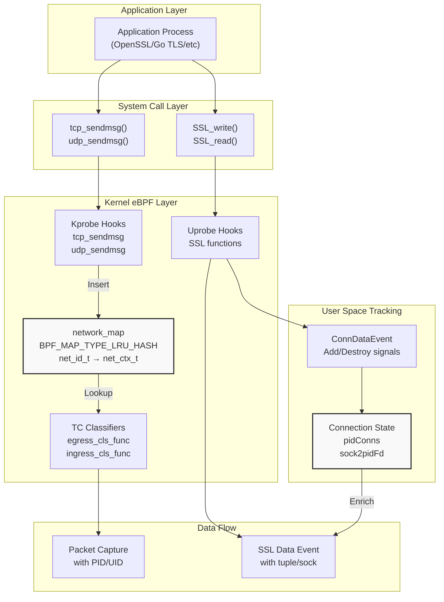

**Diagram**: Network Connection Tracking Architecture

The diagram shows the dual-layer tracking system. Kprobes populate the kernel `network_map` when connections are established, allowing TC programs to attribute packets. Separately, user-space maintains connection state to enrich SSL/TLS data events with network tuples.

Sources: [kern/tc.h:57-77](https://github.com/gojue/ecapture/blob/0766a93b/kern/tc.h#L57-L77), [kern/tc.h:290-397](https://github.com/gojue/ecapture/blob/0766a93b/kern/tc.h#L290-L397), [user/module/probe_openssl.go:78-106](https://github.com/gojue/ecapture/blob/0766a93b/user/module/probe_openssl.go#L78-L106)

---

## Kernel-Space Connection Tracking

### Network Identity Structure

The kernel tracks connections using a 4-tuple identifier that supports both IPv4 and IPv6:

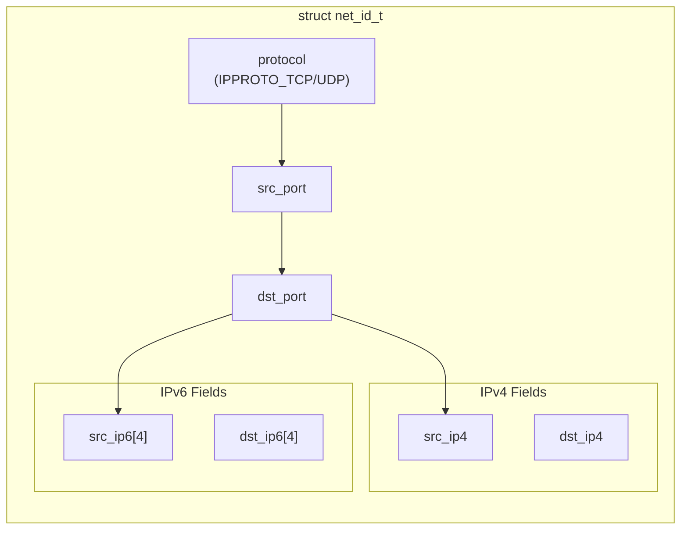

**Diagram**: Network Identity Structure (4-tuple)

The `net_id_t` structure [kern/tc.h:39-47](https://github.com/gojue/ecapture/blob/0766a93b/kern/tc.h#L39-L47) serves as the key in the eBPF map. It contains fields for both IPv4 and IPv6 addresses, with only the relevant fields populated based on the address family.

| Field | Type | Description |
|-------|------|-------------|
| `protocol` | `u32` | IPPROTO_TCP (6) or IPPROTO_UDP (17) |
| `src_port` | `u32` | Source port number (host byte order) |
| `dst_port` | `u32` | Destination port number (host byte order) |
| `src_ip4` | `u32` | Source IPv4 address |
| `dst_ip4` | `u32` | Destination IPv4 address |
| `src_ip6[4]` | `u32[4]` | Source IPv6 address (128 bits) |
| `dst_ip6[4]` | `u32[4]` | Destination IPv6 address (128 bits) |

Sources: [kern/tc.h:39-47](https://github.com/gojue/ecapture/blob/0766a93b/kern/tc.h#L39-L47)

### Process Context Structure

Each connection is associated with process context information:

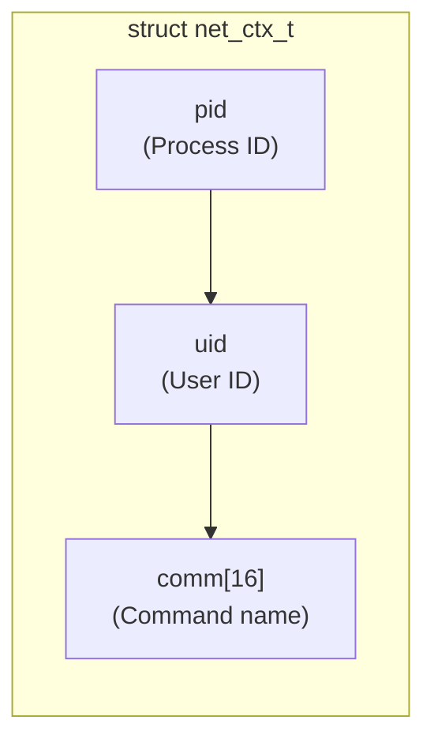

**Diagram**: Process Context Structure

The `net_ctx_t` structure [kern/tc.h:49-54](https://github.com/gojue/ecapture/blob/0766a93b/kern/tc.h#L49-L54) stores the process information that is later used by TC programs for filtering and attribution.

Sources: [kern/tc.h:49-54](https://github.com/gojue/ecapture/blob/0766a93b/kern/tc.h#L49-L54)

### Kprobe-Based Connection Registration

The system hooks `tcp_sendmsg` and `udp_sendmsg` kernel functions to capture connection establishment:

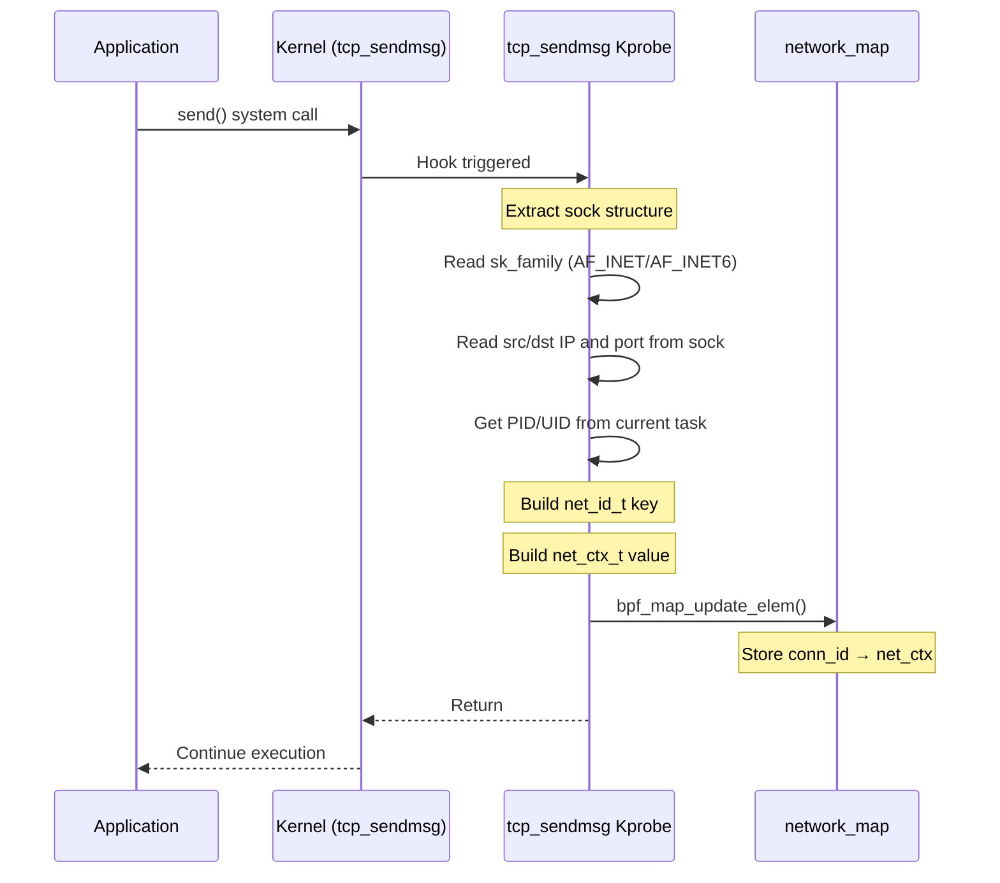

**Diagram**: Kprobe Connection Registration Sequence

The kprobe implementation [kern/tc.h:290-347](https://github.com/gojue/ecapture/blob/0766a93b/kern/tc.h#L290-L347) performs the following steps:

1. **Extract Process Context**: Get PID from `bpf_get_current_pid_tgid()` and UID from `bpf_get_current_uid_gid()`
2. **Read Socket Structure**: Extract the `struct sock *` parameter and read network fields using `bpf_probe_read()`
3. **Determine Address Family**: Check `sk->__sk_common.skc_family` for AF_INET (2) or AF_INET6 (10)
4. **Extract Connection Tuple**:
   - Local port: `sk->__sk_common.skc_num` (already in host byte order)
   - Remote port: `sk->__sk_common.skc_dport` (needs `bpf_ntohs()`)
   - Local IP: `skc_rcv_saddr` (IPv4) or `skc_v6_rcv_saddr` (IPv6)
   - Remote IP: `skc_daddr` (IPv4) or `skc_v6_daddr` (IPv6)
5. **Update eBPF Map**: Insert the mapping into `network_map` with BPF_ANY flag

Important implementation details:

- **No PID/UID filtering in kprobes**: Unlike other eBPF programs, the kprobes do NOT filter by target_pid/target_uid [kern/tc.h:296-302](https://github.com/gojue/ecapture/blob/0766a93b/kern/tc.h#L296-L302). This ensures all connections are tracked, allowing TC programs to perform filtering later.
- **LRU eviction**: The map type `BPF_MAP_TYPE_LRU_HASH` [kern/tc.h:73](https://github.com/gojue/ecapture/blob/0766a93b/kern/tc.h#L73) automatically evicts least-recently-used entries when full (10240 max entries).
- **Separate UDP handler**: The `udp_sendmsg` kprobe [kern/tc.h:349-397](https://github.com/gojue/ecapture/blob/0766a93b/kern/tc.h#L349-L397) uses identical logic but sets `protocol = IPPROTO_UDP`.

Sources: [kern/tc.h:290-347](https://github.com/gojue/ecapture/blob/0766a93b/kern/tc.h#L290-L347), [kern/tc.h:349-397](https://github.com/gojue/ecapture/blob/0766a93b/kern/tc.h#L349-L397)

### TC-Based Packet Capture and Attribution

Traffic Control (TC) eBPF classifiers capture packets at ingress and egress points:

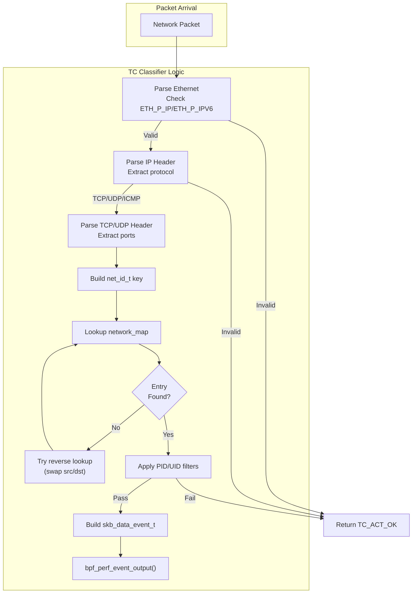

**Diagram**: TC Packet Capture and Attribution Flow

The `capture_packets()` function [kern/tc.h:135-276](https://github.com/gojue/ecapture/blob/0766a93b/kern/tc.h#L135-L276) implements the packet capture logic:

**Step 1: Packet Parsing**
- Validate packet length: Must be at least `sizeof(ethhdr) + sizeof(iphdr)` [kern/tc.h:141-144](https://github.com/gojue/ecapture/blob/0766a93b/kern/tc.h#L141-L144)
- Parse Ethernet header to determine IPv4 vs IPv6 [kern/tc.h:156-236](https://github.com/gojue/ecapture/blob/0766a93b/kern/tc.h#L156-L236)
- Use `skb_revalidate_data()` [kern/tc.h:102-119](https://github.com/gojue/ecapture/blob/0766a93b/kern/tc.h#L102-L119) to ensure sufficient data is available before accessing headers
- Extract protocol (TCP/UDP/ICMP) and connection tuple

**Step 2: Connection Lookup**
- Build `net_id_t` key from packet headers
- Call `bpf_map_lookup_elem(&network_map, &conn_id)` [kern/tc.h:188-198](https://github.com/gojue/ecapture/blob/0766a93b/kern/tc.h#L188-L198) 
- If not found, swap source/destination fields and retry (handles bidirectional traffic)

**Step 3: Process Filtering**
- If connection found, check against `target_pid` and `target_uid` constants [kern/tc.h:243-250](https://github.com/gojue/ecapture/blob/0766a93b/kern/tc.h#L243-L250)
- These filters are only effective on kernels >= 5.2 (KERNEL_LESS_5_2 check)

**Step 4: Event Generation**
- Create `skb_data_event_t` with timestamp, PID, command, packet length, interface index [kern/tc.h:30-37](https://github.com/gojue/ecapture/blob/0766a93b/kern/tc.h#L30-L37)
- Use `bpf_perf_event_output()` [kern/tc.h:271](https://github.com/gojue/ecapture/blob/0766a93b/kern/tc.h#L271) to send minimal event data (36 bytes) plus packet data to user space

**Optional: PCAP Filtering**
The TC programs support runtime PCAP filter injection via the `filter_pcap_l2()` function [kern/tc.h:128-132](https://github.com/gojue/ecapture/blob/0766a93b/kern/tc.h#L128-L132). This is implemented as a stub function `filter_pcap_ebpf_l2()` [kern/tc.h:122-126](https://github.com/gojue/ecapture/blob/0766a93b/kern/tc.h#L122-L126) that gets replaced at load time by the instruction patcher [user/module/probe_openssl.go:303-306](https://github.com/gojue/ecapture/blob/0766a93b/user/module/probe_openssl.go#L303-L306).

Sources: [kern/tc.h:135-276](https://github.com/gojue/ecapture/blob/0766a93b/kern/tc.h#L135-L276), [kern/tc.h:279-288](https://github.com/gojue/ecapture/blob/0766a93b/kern/tc.h#L279-L288)

### Map Configuration

The network tracking map is defined as:

```c
struct {
    __uint(type, BPF_MAP_TYPE_LRU_HASH);
    __type(key, struct net_id_t);
    __type(value, struct net_ctx_t);
    __uint(max_entries, 10240);
} network_map SEC(".maps");
```

| Parameter | Value | Rationale |
|-----------|-------|-----------|
| Type | `BPF_MAP_TYPE_LRU_HASH` | Automatic eviction of old entries prevents memory exhaustion |
| Max Entries | 10,240 | Balances memory usage with capacity for concurrent connections |
| Key Size | 56 bytes | `net_id_t` structure (protocol + ports + IPs) |
| Value Size | 20 bytes | `net_ctx_t` structure (pid + uid + comm) |

Sources: [kern/tc.h:72-77](https://github.com/gojue/ecapture/blob/0766a93b/kern/tc.h#L72-L77)

---

## User-Space Connection Tracking

### Connection State Management

The OpenSSL probe maintains additional connection state in user space to correlate SSL/TLS operations with network connections:

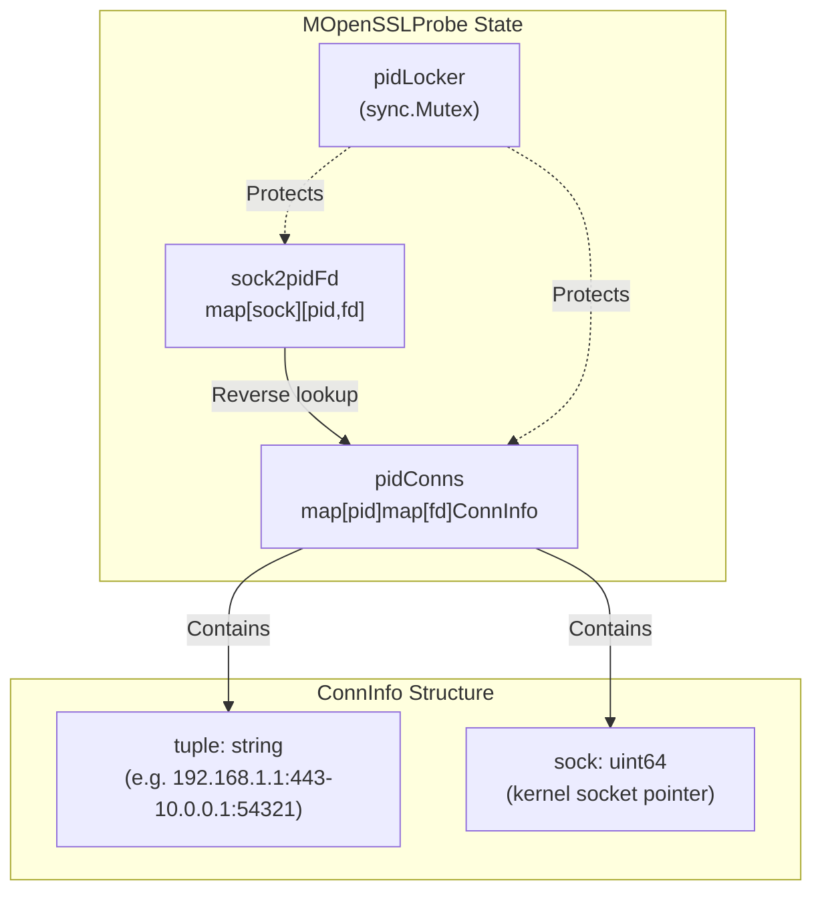

**Diagram**: User-Space Connection State Structures

The user-space tracking system [user/module/probe_openssl.go:78-106](https://github.com/gojue/ecapture/blob/0766a93b/user/module/probe_openssl.go#L78-L106) maintains two synchronized maps:

**1. Primary Map: `pidConns`**
- Type: `map[uint32]map[uint32]ConnInfo`
- Structure: PID → File Descriptor → Connection Info
- Purpose: Fast lookup by process and file descriptor for SSL operations

**2. Reverse Map: `sock2pidFd`**
- Type: `map[uint64][2]uint32`
- Structure: Socket Pointer → [PID, FD]
- Purpose: Enables connection cleanup when kernel notifies socket destruction

**Connection Info Fields:**
- `tuple`: Human-readable connection string (format: "src_ip:src_port-dst_ip:dst_port")
- `sock`: Kernel socket pointer (used for consistency checking)

Sources: [user/module/probe_openssl.go:78-106](https://github.com/gojue/ecapture/blob/0766a93b/user/module/probe_openssl.go#L78-L106)

### Connection Lifecycle Operations

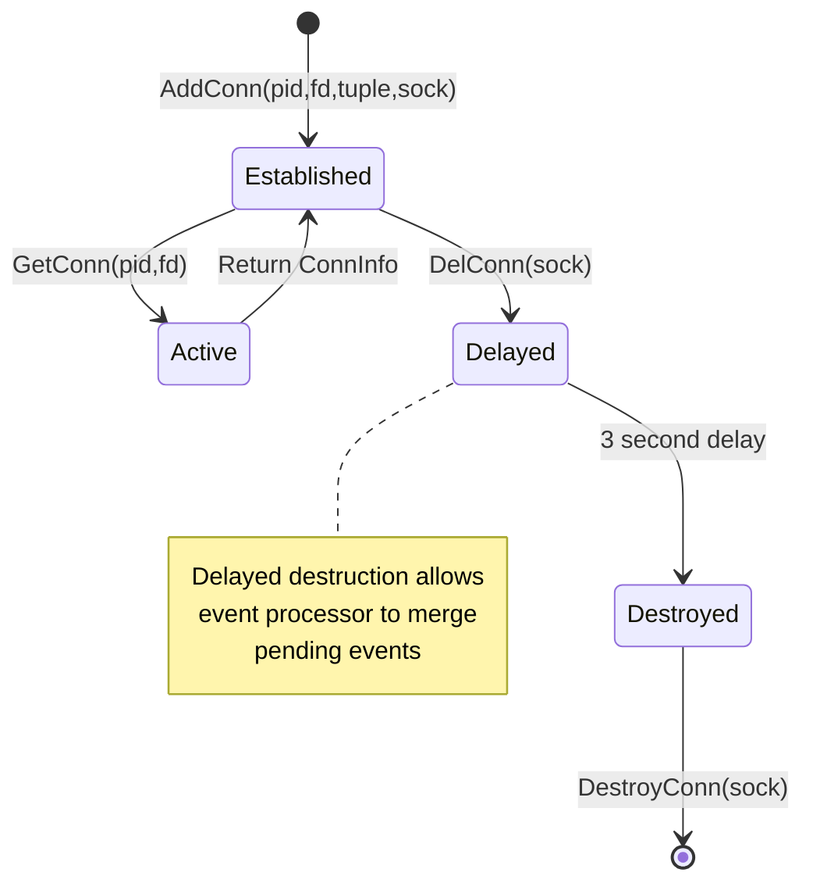

**Diagram**: Connection Lifecycle State Machine

#### AddConn: Connection Registration

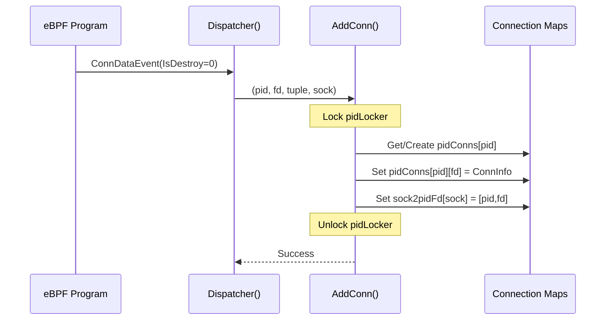

**Diagram**: AddConn Sequence

The `AddConn()` method [user/module/probe_openssl.go:398-416](https://github.com/gojue/ecapture/blob/0766a93b/user/module/probe_openssl.go#L398-L416) is called when a new connection is detected:

1. **Validation**: Reject if `fd <= 0` [user/module/probe_openssl.go:399-402](https://github.com/gojue/ecapture/blob/0766a93b/user/module/probe_openssl.go#L399-L402)
2. **Lock Acquisition**: Use mutex to prevent concurrent modification [user/module/probe_openssl.go:404](https://github.com/gojue/ecapture/blob/0766a93b/user/module/probe_openssl.go#L404)
3. **Map Initialization**: Create nested map for PID if it doesn't exist [user/module/probe_openssl.go:406-409](https://github.com/gojue/ecapture/blob/0766a93b/user/module/probe_openssl.go#L406-L409)
4. **Store Connection**: Add `ConnInfo` with tuple and socket pointer [user/module/probe_openssl.go:410-411](https://github.com/gojue/ecapture/blob/0766a93b/user/module/probe_openssl.go#L410-L411)
5. **Reverse Mapping**: Store socket → [pid, fd] for cleanup [user/module/probe_openssl.go:413]()

Sources: [user/module/probe_openssl.go:398-416](https://github.com/gojue/ecapture/blob/0766a93b/user/module/probe_openssl.go#L398-L416)

#### GetConn: Connection Retrieval

The `GetConn()` method [user/module/probe_openssl.go:464-480](https://github.com/gojue/ecapture/blob/0766a93b/user/module/probe_openssl.go#L464-L480) retrieves connection information for SSL/TLS data events:

1. **Fast Validation**: Return nil if `fd <= 0` [user/module/probe_openssl.go:465-467](https://github.com/gojue/ecapture/blob/0766a93b/user/module/probe_openssl.go#L465-L467)
2. **Locked Lookup**: Access maps under mutex protection [user/module/probe_openssl.go:469-470](https://github.com/gojue/ecapture/blob/0766a93b/user/module/probe_openssl.go#L469-L470)
3. **Two-Level Lookup**: First find PID's map, then find FD's connection [user/module/probe_openssl.go:471-479](https://github.com/gojue/ecapture/blob/0766a93b/user/module/probe_openssl.go#L471-L479)

This method is called by `dumpSslData()` [user/module/probe_openssl.go:762](https://github.com/gojue/ecapture/blob/0766a93b/user/module/probe_openssl.go#L762) to enrich SSL data events with network tuple information.

Sources: [user/module/probe_openssl.go:464-480](https://github.com/gojue/ecapture/blob/0766a93b/user/module/probe_openssl.go#L464-L480), [user/module/probe_openssl.go:756-775](https://github.com/gojue/ecapture/blob/0766a93b/user/module/probe_openssl.go#L756-L775)

#### DelConn: Delayed Destruction

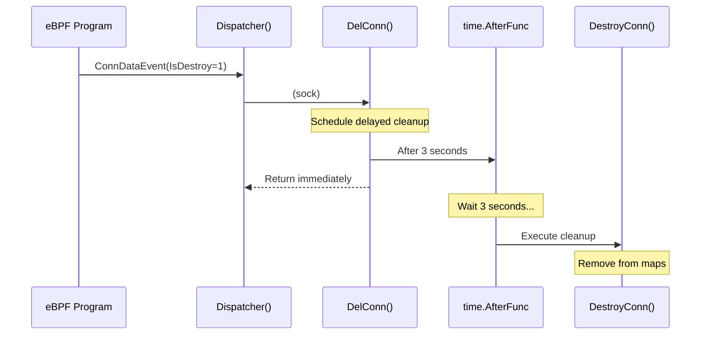

**Diagram**: Delayed Connection Destruction

The `DelConn()` method [user/module/probe_openssl.go:455-462](https://github.com/gojue/ecapture/blob/0766a93b/user/module/probe_openssl.go#L455-L462) implements delayed cleanup:

- **3-Second Delay**: Uses `time.AfterFunc()` to defer actual destruction [user/module/probe_openssl.go:459](https://github.com/gojue/ecapture/blob/0766a93b/user/module/probe_openssl.go#L459)
- **Rationale**: The delay must exceed the event processor's merge interval [user/module/probe_openssl.go:456-458](https://github.com/gojue/ecapture/blob/0766a93b/user/module/probe_openssl.go#L456-L458). This ensures all pending events are processed before connection state is removed.

Sources: [user/module/probe_openssl.go:455-462](https://github.com/gojue/ecapture/blob/0766a93b/user/module/probe_openssl.go#L455-L462)

#### DestroyConn: Actual Cleanup

The `DestroyConn()` method [user/module/probe_openssl.go:418-452](https://github.com/gojue/ecapture/blob/0766a93b/user/module/probe_openssl.go#L418-L452) performs the actual cleanup:

1. **Notify Processor**: Signal the event processor to flush connection data [user/module/probe_openssl.go:423-424](https://github.com/gojue/ecapture/blob/0766a93b/user/module/probe_openssl.go#L423-L424)
2. **Reverse Lookup**: Use `sock2pidFd` to find [pid, fd] [user/module/probe_openssl.go:426-429]()
3. **Consistency Check**: Verify socket pointer matches before deletion [user/module/probe_openssl.go:441-445](https://github.com/gojue/ecapture/blob/0766a93b/user/module/probe_openssl.go#L441-L445) (prevents race conditions)
4. **Cleanup Maps**: Remove from `pidConns` and potentially entire PID map if empty [user/module/probe_openssl.go:446-449](https://github.com/gojue/ecapture/blob/0766a93b/user/module/probe_openssl.go#L446-L449)

Sources: [user/module/probe_openssl.go:418-452](https://github.com/gojue/ecapture/blob/0766a93b/user/module/probe_openssl.go#L418-L452)

---

## Integration with SSL/TLS Data Capture

### Enriching SSL Data Events

When uprobe hooks capture SSL/TLS plaintext data, the connection tracking system enriches the event with network context:

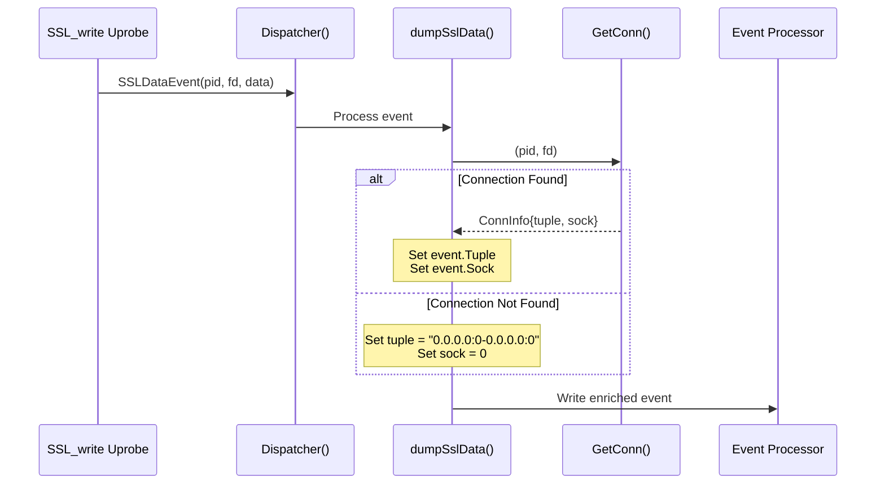

**Diagram**: SSL Data Event Enrichment Flow

The `dumpSslData()` method [user/module/probe_openssl.go:756-775](https://github.com/gojue/ecapture/blob/0766a93b/user/module/probe_openssl.go#L756-L775) performs the enrichment:

1. **Validation**: Check if FD is valid and BIO type is appropriate [user/module/probe_openssl.go:758-761](https://github.com/gojue/ecapture/blob/0766a93b/user/module/probe_openssl.go#L758-L761)
2. **Connection Lookup**: Call `GetConn(pid, fd)` [user/module/probe_openssl.go:762](https://github.com/gojue/ecapture/blob/0766a93b/user/module/probe_openssl.go#L762)
3. **Fallback Handling**: If no connection found, use default tuple `"0.0.0.0:0-0.0.0.0:0"` [user/module/probe_openssl.go:763-766](https://github.com/gojue/ecapture/blob/0766a93b/user/module/probe_openssl.go#L763-L766)
4. **Event Enrichment**: Set `tuple` and `sock` fields on the event [user/module/probe_openssl.go:769-770](https://github.com/gojue/ecapture/blob/0766a93b/user/module/probe_openssl.go#L769-L770)
5. **Forward to Processor**: Send enriched event to the event processor [user/module/probe_openssl.go:774](https://github.com/gojue/ecapture/blob/0766a93b/user/module/probe_openssl.go#L774)

**Default Tuple Constant:**
The constant `DefaultTuple = "0.0.0.0:0-0.0.0.0:0"` [user/module/probe_openssl.go:43](https://github.com/gojue/ecapture/blob/0766a93b/user/module/probe_openssl.go#L43) is used when connection information is unavailable, typically for:
- Memory BIO operations (no network socket)
- Connections established before eCapture started
- File descriptor mismatches

Sources: [user/module/probe_openssl.go:756-775](https://github.com/gojue/ecapture/blob/0766a93b/user/module/probe_openssl.go#L756-L775), [user/module/probe_openssl.go:42-43](https://github.com/gojue/ecapture/blob/0766a93b/user/module/probe_openssl.go#L42-L43)

### Connection Event Dispatching

The dispatcher routes connection-related events to appropriate handlers:

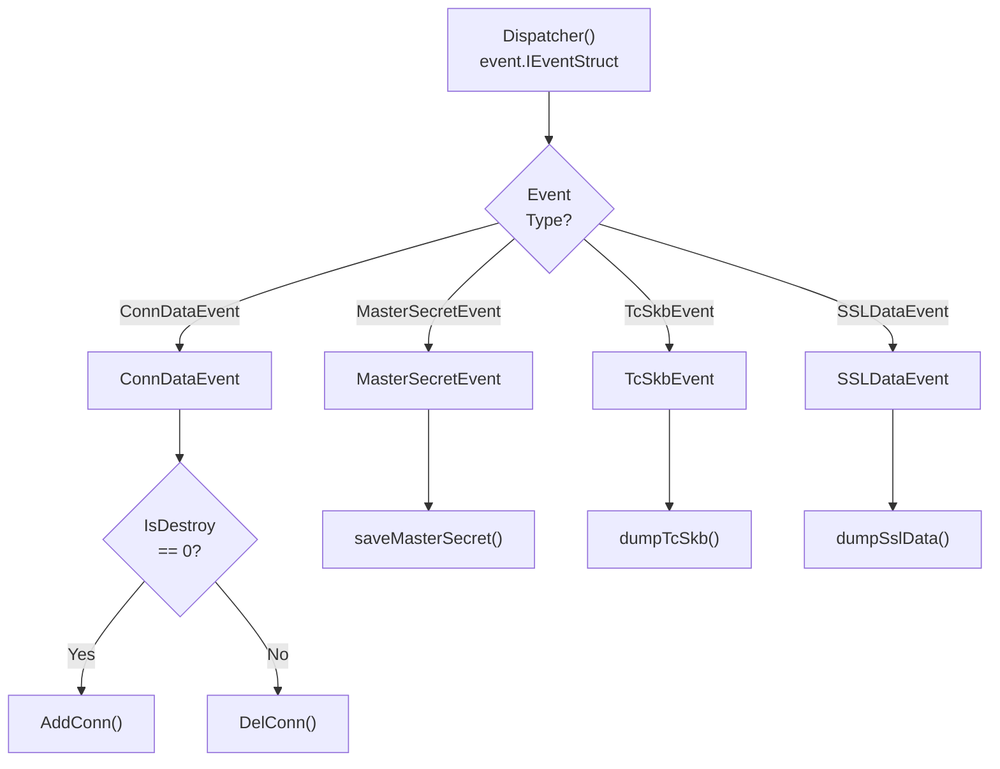

**Diagram**: Event Dispatcher Routing

The `Dispatcher()` method [user/module/probe_openssl.go:733-754](https://github.com/gojue/ecapture/blob/0766a93b/user/module/probe_openssl.go#L733-L754) uses type switches to route events:

- **ConnDataEvent**: Connection lifecycle events from TC or socket operations
  - `IsDestroy == 0`: New connection → `AddConn()` [user/module/probe_openssl.go:738](https://github.com/gojue/ecapture/blob/0766a93b/user/module/probe_openssl.go#L738)
  - `IsDestroy != 0`: Closing connection → `DelConn()` [user/module/probe_openssl.go:740](https://github.com/gojue/ecapture/blob/0766a93b/user/module/probe_openssl.go#L740)
- **MasterSecretEvent**: TLS master secrets → `saveMasterSecret()` [user/module/probe_openssl.go:743](https://github.com/gojue/ecapture/blob/0766a93b/user/module/probe_openssl.go#L743)
- **TcSkbEvent**: TC packet captures → `dumpTcSkb()` [user/module/probe_openssl.go:747](https://github.com/gojue/ecapture/blob/0766a93b/user/module/probe_openssl.go#L747)
- **SSLDataEvent**: SSL/TLS plaintext data → `dumpSslData()` [user/module/probe_openssl.go:752](https://github.com/gojue/ecapture/blob/0766a93b/user/module/probe_openssl.go#L752)

Sources: [user/module/probe_openssl.go:733-754](https://github.com/gojue/ecapture/blob/0766a93b/user/module/probe_openssl.go#L733-L754)

---

## PCAP Mode Integration

In PCAP mode, the connection tracking system enables packet-level reconstruction:

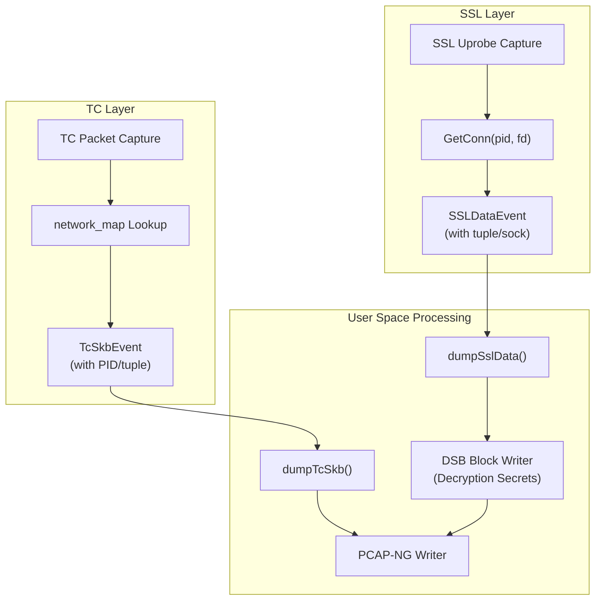

**Diagram**: PCAP Mode Connection Tracking Integration

In PCAP mode (`TlsCaptureModelTypePcap`), the system:

1. **Captures Network Packets**: TC programs capture raw packets with process attribution
2. **Captures TLS Secrets**: Uprobe hooks extract master secrets with connection tuples
3. **Correlates by Tuple**: Both data streams are written to the same PCAP-NG file, allowing Wireshark to decrypt TLS traffic by matching tuples in packet headers with keys in DSB (Decryption Secrets Block) records

The connection tuple serves as the correlation key between:
- Encrypted network packets (from TC layer)
- TLS master secrets (from SSL/TLS layer)

For detailed PCAP output format, see [PCAP Integration](../4-output-formats/4.2-pcap-integration.md).

Sources: [user/module/probe_openssl.go:137-154](https://github.com/gojue/ecapture/blob/0766a93b/user/module/probe_openssl.go#L137-L154)

---

## Performance Considerations

### Map Size and Eviction

The `network_map` uses LRU (Least Recently Used) eviction with a maximum of 10,240 entries:

| Scenario | Map Behavior | Impact |
|----------|-------------|--------|
| Low connection count | All connections tracked | Full attribution for all packets |
| High connection churn | Older connections evicted | Recent connections prioritized |
| Map full | LRU entry replaced | May lose attribution for idle connections |

**Mitigation**: The LRU strategy ensures active connections remain in the map, while idle connections that haven't sent packets recently are candidates for eviction.

Sources: [kern/tc.h:72-77](https://github.com/gojue/ecapture/blob/0766a93b/kern/tc.h#L72-L77)

### Lock Contention

The user-space connection state uses a single mutex (`pidLocker`) to protect both maps [user/module/probe_openssl.go:94](https://github.com/gojue/ecapture/blob/0766a93b/user/module/probe_openssl.go#L94):

**Lock Points:**
- `AddConn()`: Held during map insertion [user/module/probe_openssl.go:404](https://github.com/gojue/ecapture/blob/0766a93b/user/module/probe_openssl.go#L404)
- `GetConn()`: Held during map lookup [user/module/probe_openssl.go:469](https://github.com/gojue/ecapture/blob/0766a93b/user/module/probe_openssl.go#L469)
- `DestroyConn()`: Held during map cleanup [user/module/probe_openssl.go:419](https://github.com/gojue/ecapture/blob/0766a93b/user/module/probe_openssl.go#L419)

**Optimization Opportunity**: The current implementation uses a global lock. High-concurrency scenarios could benefit from:
- Per-PID locks (sharding)
- Read-write locks (many lookups, few modifications)
- Lock-free concurrent maps

However, for typical workloads, contention is minimal since most operations complete quickly (simple map operations).

Sources: [user/module/probe_openssl.go:404](https://github.com/gojue/ecapture/blob/0766a93b/user/module/probe_openssl.go#L404), [user/module/probe_openssl.go:419](https://github.com/gojue/ecapture/blob/0766a93b/user/module/probe_openssl.go#L419), [user/module/probe_openssl.go:469](https://github.com/gojue/ecapture/blob/0766a93b/user/module/probe_openssl.go#L469)

### Delayed Destruction Rationale

The 3-second delay in `DelConn()` [user/module/probe_openssl.go:459](https://github.com/gojue/ecapture/blob/0766a93b/user/module/probe_openssl.go#L459) serves a specific purpose:

**Problem**: Events may arrive out of order or be buffered in the eBPF perf/ring buffer
**Solution**: Keep connection state alive briefly after closure to ensure all events are enriched
**Trade-off**: Increased memory usage (short-lived) vs. data completeness

The delay is chosen to exceed the event processor's merge interval, ensuring connection state is available for all events that reference it.

Sources: [user/module/probe_openssl.go:455-462](https://github.com/gojue/ecapture/blob/0766a93b/user/module/probe_openssl.go#L455-L462)

---

## Limitations and Edge Cases

### Kernel Version Constraints

Process filtering in TC programs only works on kernels >= 5.2:

```c
#ifndef KERNEL_LESS_5_2
    if (target_pid != 0 && target_pid != net_ctx->pid) {
        return TC_ACT_OK;
    }
    if (target_uid != 0 && target_uid != net_ctx->uid) {
        return TC_ACT_OK;
    }
#endif
```

On older kernels, TC programs capture all packets regardless of PID/UID filters [kern/tc.h:147-150](https://github.com/gojue/ecapture/blob/0766a93b/kern/tc.h#L147-L150), [kern/tc.h:243-250](https://github.com/gojue/ecapture/blob/0766a93b/kern/tc.h#L243-L250).

Sources: [kern/tc.h:243-250](https://github.com/gojue/ecapture/blob/0766a93b/kern/tc.h#L243-L250)

### Connection Tuple Matching

The bidirectional lookup [kern/tc.h:188-198](https://github.com/gojue/ecapture/blob/0766a93b/kern/tc.h#L188-L198) handles packets in both directions:

1. First lookup with packet's (src, dst)
2. If not found, swap and lookup with (dst, src)

**Edge Case**: ICMP packets don't have port numbers, so the tuple may be ambiguous for multi-connection scenarios.

Sources: [kern/tc.h:188-198](https://github.com/gojue/ecapture/blob/0766a93b/kern/tc.h#L188-L198), [kern/tc.h:226-235](https://github.com/gojue/ecapture/blob/0766a93b/kern/tc.h#L226-L235)

### Race Conditions

**Socket Reuse**: If a socket pointer is reused by the kernel between close and new allocation, the consistency check in `DestroyConn()` [user/module/probe_openssl.go:441-445](https://github.com/gojue/ecapture/blob/0766a93b/user/module/probe_openssl.go#L441-L445) prevents incorrect deletion:

```go
if connInfo.sock != sock {
    m.logger.Debug().Msg("DestroyConn skip")
    return
}
```

This ensures that only the exact connection instance is destroyed, not a new connection that happens to use the same socket pointer.

Sources: [user/module/probe_openssl.go:441-445](https://github.com/gojue/ecapture/blob/0766a93b/user/module/probe_openssl.go#L441-L445)

### Missing Connection State

When `GetConn()` returns nil, `dumpSslData()` uses a default tuple [user/module/probe_openssl.go:763-766](https://github.com/gojue/ecapture/blob/0766a93b/user/module/probe_openssl.go#L763-L766):

**Causes:**
- BIO operations without network sockets (memory BIO, file BIO)
- Connections established before eCapture attached
- File descriptor closed/reused between events

**Impact:**
- PCAP reconstruction impossible (no tuple for correlation)
- Text mode output still works (shows default tuple)
- Event processor can still merge events by sock field

Sources: [user/module/probe_openssl.go:763-766](https://github.com/gojue/ecapture/blob/0766a93b/user/module/probe_openssl.go#L763-L766)

---

## Summary

The network connection tracking system in eCapture implements a sophisticated multi-layer correlation mechanism:

**Kernel Space:**
- Kprobes on `tcp_sendmsg`/`udp_sendmsg` populate connection map
- TC classifiers query the map for packet attribution
- LRU eviction manages memory with 10K connection limit

**User Space:**
- Bidirectional maps (pid/fd → conn, sock → pid/fd) enable fast lookups
- Delayed cleanup (3 seconds) prevents premature state removal
- Connection enrichment correlates SSL/TLS data with network tuples

**Key Design Principles:**
1. **Separation of Concerns**: Kernel tracks network, user space tracks SSL/TLS
2. **Bidirectional Lookup**: Support both packet→process and fd→connection flows
3. **Graceful Degradation**: Missing connections use default tuples
4. **Performance Optimization**: LRU eviction, minimal locking, targeted filtering

This architecture enables eCapture to provide complete visibility into TLS traffic by correlating encrypted network packets with plaintext application data and decryption keys.

Sources: [kern/tc.h:1-398](https://github.com/gojue/ecapture/blob/0766a93b/kern/tc.h#L1-L398), [user/module/probe_openssl.go:1-787](https://github.com/gojue/ecapture/blob/0766a93b/user/module/probe_openssl.go#L1-L787)