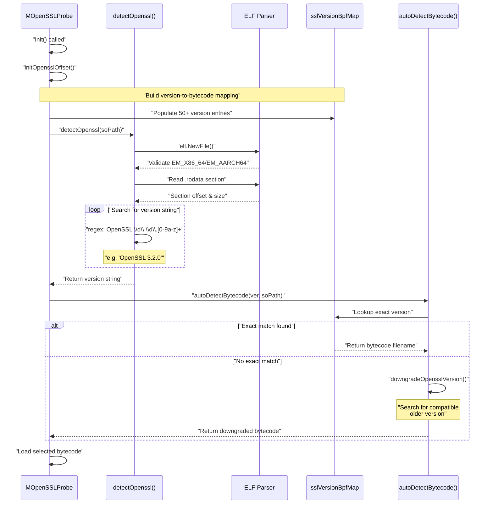
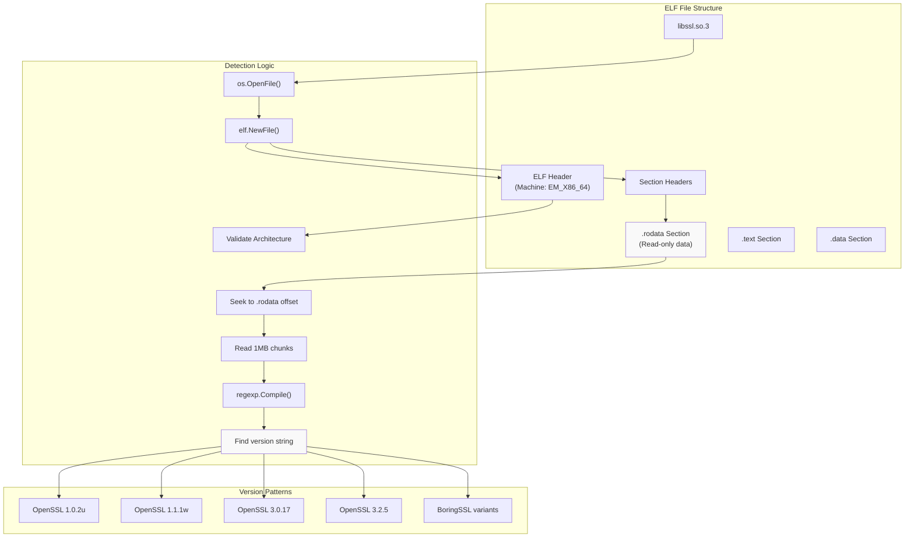
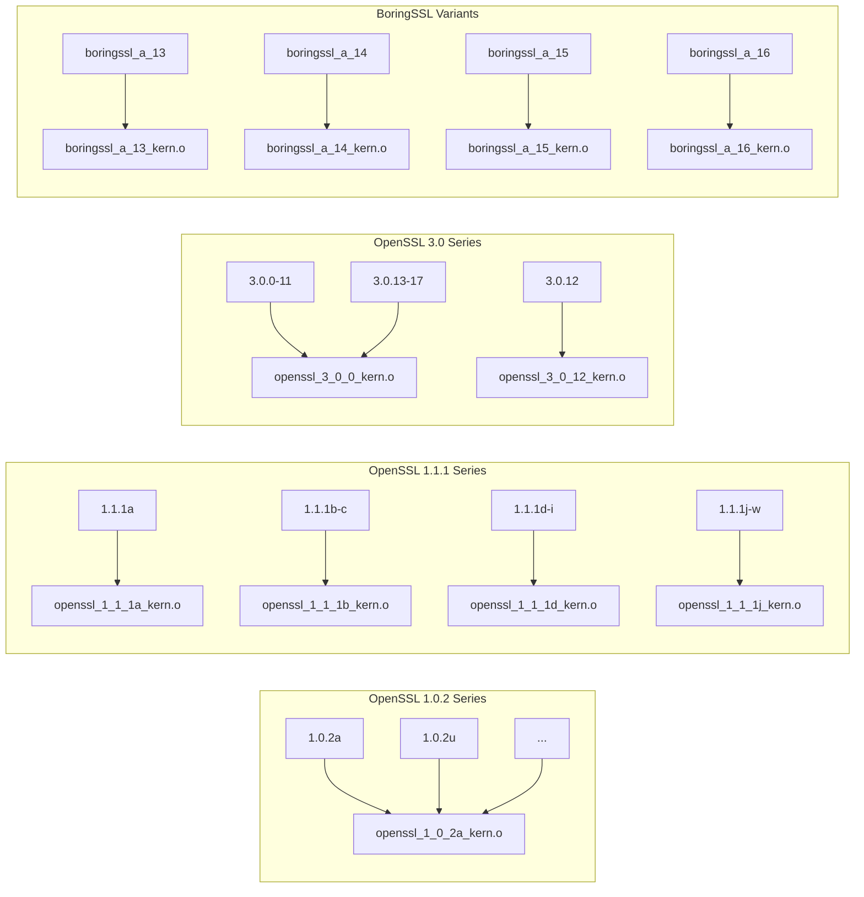
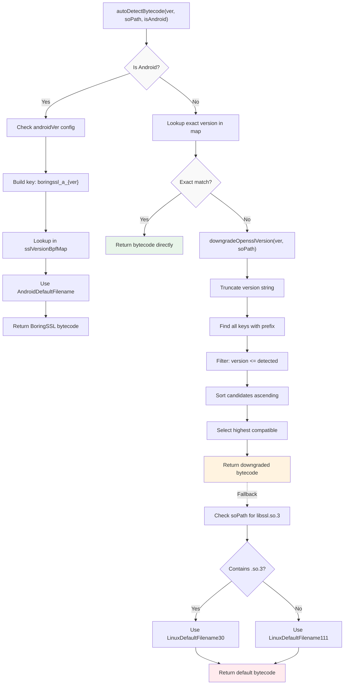
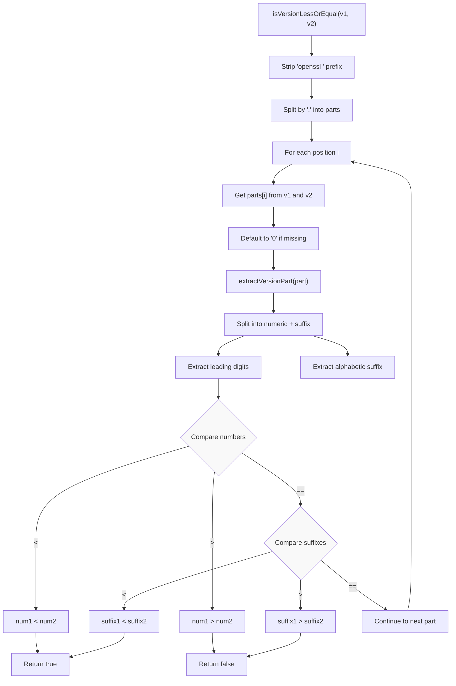
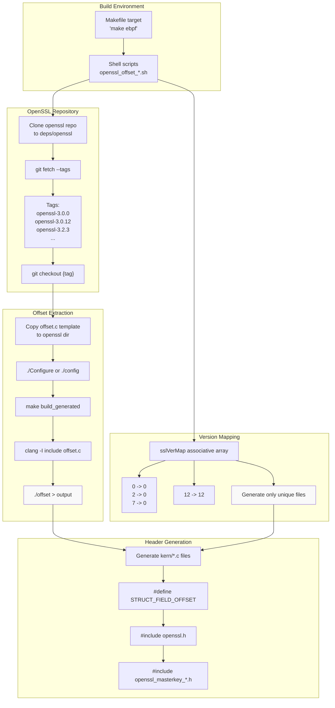

# Version Detection and Bytecode Selection

<details>
<summary>Relevant source files</summary>

The following files were used as context for generating this wiki page:

- [user/module/probe_openssl_lib.go](https://github.com/gojue/ecapture/blob/ca085d05/user/module/probe_openssl_lib.go)
- [utils/openssl_offset_3.0.sh](https://github.com/gojue/ecapture/blob/ca085d05/utils/openssl_offset_3.0.sh)
- [utils/openssl_offset_3.1.sh](https://github.com/gojue/ecapture/blob/ca085d05/utils/openssl_offset_3.1.sh)
- [utils/openssl_offset_3.2.sh](https://github.com/gojue/ecapture/blob/ca085d05/utils/openssl_offset_3.2.sh)
- [utils/openssl_offset_3.3.sh](https://github.com/gojue/ecapture/blob/ca085d05/utils/openssl_offset_3.3.sh)
- [utils/openssl_offset_3.4.sh](https://github.com/gojue/ecapture/blob/ca085d05/utils/openssl_offset_3.4.sh)
- [utils/openssl_offset_3.5.sh](https://github.com/gojue/ecapture/blob/ca085d05/utils/openssl_offset_3.5.sh)

</details>


This page documents how eCapture detects target library versions (OpenSSL, BoringSSL, Go TLS), selects compatible eBPF bytecode, and handles version compatibility through intelligent downgrade logic. The detection and selection system ensures that the correct structure offsets are used when accessing internal library data structures from eBPF programs.

**Scope**: This page covers the runtime version detection mechanism and bytecode selection logic. For information about implementing new capture modules, see [Adding New Modules](../5-development-guide/5.3-adding-new-modules.md). For details on the eBPF compilation process itself, see [eBPF Engine](2.1-ebpf-engine.md).

---

## Detection Architecture

The version detection system operates in three phases: library discovery, version extraction, and bytecode mapping. The system must handle diverse library implementations (OpenSSL 1.0.x through 3.5.x, BoringSSL variants, Go TLS) where internal data structure layouts differ significantly between versions.



**Sources**: [user/module/probe_openssl_lib.go:189-282](https://github.com/gojue/ecapture/blob/ca085d05/user/module/probe_openssl_lib.go#L189-L282)

---

## Version String Extraction

The `detectOpenssl()` function parses the target library's ELF file to extract the version string embedded in the `.rodata` section. This approach avoids relying on file names or symlinks, which may not reflect the actual library version.

### ELF Parsing Process

| Step | Operation | Purpose |
|------|-----------|---------|
| 1 | Open target `.so` file | Access shared library binary |
| 2 | Parse ELF headers | Validate architecture (x86_64/aarch64) |
| 3 | Locate `.rodata` section | Find read-only data containing version strings |
| 4 | Stream section contents | Efficiently search large sections (up to 1MB chunks) |
| 5 | Apply regex pattern | Match `OpenSSL \d\.\d\.[0-9a-z]+` |
| 6 | Normalize to lowercase | Standardize for mapping lookup |



The detection handles edge cases where version strings may span buffer boundaries by maintaining a 30-byte overlap (`OpenSslVersionLen`) between consecutive reads.

**Sources**: [user/module/probe_openssl_lib.go:189-282](https://github.com/gojue/ecapture/blob/ca085d05/user/module/probe_openssl_lib.go#L189-L282)

---

## Version-to-Bytecode Mapping

The `initOpensslOffset()` method builds `sslVersionBpfMap`, a comprehensive mapping from version strings to eBPF bytecode filenames. This mapping encodes knowledge about which versions share identical structure offsets.

### Version Grouping Strategy

Multiple library versions often share the same internal structure layouts, allowing bytecode reuse:

| Version Range | Bytecode File | Versions Sharing Offsets |
|---------------|---------------|--------------------------|
| OpenSSL 1.0.2a-u | `openssl_1_0_2a_kern.o` | 21 versions (a through u) |
| OpenSSL 1.1.0a-l | `openssl_1_1_0a_kern.o` | 12 versions (a through l) |
| OpenSSL 1.1.1a | `openssl_1_1_1a_kern.o` | 1 version (unique offsets) |
| OpenSSL 1.1.1b-c | `openssl_1_1_1b_kern.o` | 2 versions |
| OpenSSL 1.1.1d-i | `openssl_1_1_1d_kern.o` | 6 versions |
| OpenSSL 1.1.1j-w | `openssl_1_1_1j_kern.o` | 14 versions |
| OpenSSL 3.0.0-11, 13-17 | `openssl_3_0_0_kern.o` | 16 versions |
| OpenSSL 3.0.12 | `openssl_3_0_12_kern.o` | 1 version (special case) |
| OpenSSL 3.1.0-8 | `openssl_3_1_0_kern.o` | 9 versions |
| OpenSSL 3.2.0-2 | `openssl_3_2_0_kern.o` | 3 versions |
| OpenSSL 3.2.3 | `openssl_3_2_3_kern.o` | 1 version |
| OpenSSL 3.2.4-5 | `openssl_3_2_4_kern.o` | 2 versions |



### Special Case: OpenSSL 3.0.12

OpenSSL 3.0.12 requires dedicated bytecode because its internal structure offsets differ from both earlier (3.0.0-3.0.11) and later (3.0.13-3.0.17) versions in the 3.0 series. This anomaly is explicitly documented in the code.

**Sources**: [user/module/probe_openssl_lib.go:73-187](https://github.com/gojue/ecapture/blob/ca085d05/user/module/probe_openssl_lib.go#L73-L187), [user/module/probe_openssl_lib.go:128-130](https://github.com/gojue/ecapture/blob/ca085d05/user/module/probe_openssl_lib.go#L128-L130)

---

## Bytecode Selection Algorithm

When a version string is detected, the `autoDetectBytecode()` function determines which bytecode to load. The selection process follows a fallback hierarchy to maximize compatibility.



### Downgrade Logic

The `downgradeOpensslVersion()` function implements version compatibility matching when an exact version is not found. It iteratively truncates the version string to find compatible older versions:

1. **Prefix Matching**: For detected version "openssl 3.2.7", try prefixes "openssl 3.2.", "openssl 3.", "openssl "
2. **Candidate Collection**: Find all map keys matching each prefix
3. **Version Filtering**: Use `isVersionLessOrEqual()` to keep only versions ≤ detected version
4. **Sorting**: Sort candidates by version number (numeric and alpha components)
5. **Selection**: Choose the highest compatible version

Example: If OpenSSL 3.2.7 is detected but not in the map, the algorithm finds "openssl 3.2.5" (highest available version ≤ 3.2.7) and uses its bytecode.

**Sources**: [user/module/probe_openssl_lib.go:284-317](https://github.com/gojue/ecapture/blob/ca085d05/user/module/probe_openssl_lib.go#L284-L317), [user/module/probe_openssl_lib.go:341-448](https://github.com/gojue/ecapture/blob/ca085d05/user/module/probe_openssl_lib.go#L341-L448)

---

## Version Comparison Algorithm

The `isVersionLessOrEqual()` function implements a sophisticated version comparison that handles both numeric and alphabetic version components (e.g., "1.1.1a" vs "1.1.1b").



**Example Comparisons**:
- `isVersionLessOrEqual("openssl 1.1.1a", "openssl 1.1.1b")` → `true`
- `isVersionLessOrEqual("openssl 3.0.11", "openssl 3.0.12")` → `true`
- `isVersionLessOrEqual("openssl 3.2.5", "openssl 3.2.3")` → `false`

**Sources**: [user/module/probe_openssl_lib.go:371-448](https://github.com/gojue/ecapture/blob/ca085d05/user/module/probe_openssl_lib.go#L371-L448)

---

## Structure Offset Generation

The offset generation system produces version-specific C header files containing structure field offsets. These offsets are critical for eBPF programs to correctly read internal library data structures.

### Generation Pipeline



### Offset Script Structure

Each version series (3.0, 3.1, 3.2, 3.3, 3.4, 3.5) has a dedicated shell script:

| Script | Version Range | Template File | Output Pattern |
|--------|---------------|---------------|----------------|
| `openssl_offset_3.0.sh` | 3.0.0-3.0.17 | `openssl_3_0_offset.c` | `openssl_3_0_{0,12}_kern.c` |
| `openssl_offset_3.1.sh` | 3.1.0-3.1.8 | `openssl_3_0_offset.c` | `openssl_3_1_0_kern.c` |
| `openssl_offset_3.2.sh` | 3.2.0-3.2.5 | `openssl_3_2_0_offset.c` | `openssl_3_2_{0,3,4}_kern.c` |
| `openssl_offset_3.3.sh` | 3.3.0-3.3.4 | `openssl_3_2_0_offset.c` | `openssl_3_3_{0,2,3}_kern.c` |
| `openssl_offset_3.4.sh` | 3.4.0-3.4.2 | `openssl_3_2_0_offset.c` | `openssl_3_4_{0,1}_kern.c` |
| `openssl_offset_3.5.sh` | 3.5.0-3.5.4 | `openssl_3_5_0_offset.c` | `openssl_3_5_{0-4}_kern.c` |

### Version Mapping in Scripts

The scripts use associative arrays (`sslVerMap`) to map minor version numbers to the version whose offsets should be extracted:

```bash
# From openssl_offset_3.0.sh
sslVerMap["0"]="0"    # 3.0.0 -> use 3.0.0 offsets
sslVerMap["11"]="0"   # 3.0.11 -> use 3.0.0 offsets
sslVerMap["12"]="12"  # 3.0.12 -> use 3.0.12 offsets (special)
sslVerMap["13"]="0"   # 3.0.13 -> use 3.0.0 offsets
```

This mapping ensures that only unique offset files are generated, reducing build time and binary size.

**Sources**: [utils/openssl_offset_3.0.sh:24-88](https://github.com/gojue/ecapture/blob/ca085d05/utils/openssl_offset_3.0.sh#L24-L88), [utils/openssl_offset_3.2.sh:24-75](https://github.com/gojue/ecapture/blob/ca085d05/utils/openssl_offset_3.2.sh#L24-L75), [utils/openssl_offset_3.3.sh:24-75](https://github.com/gojue/ecapture/blob/ca085d05/utils/openssl_offset_3.3.sh#L24-L75), [utils/openssl_offset_3.4.sh:24-73](https://github.com/gojue/ecapture/blob/ca085d05/utils/openssl_offset_3.4.sh#L24-L73), [utils/openssl_offset_3.5.sh:24-74](https://github.com/gojue/ecapture/blob/ca085d05/utils/openssl_offset_3.5.sh#L24-L74)

---

## Generated Header File Format

Each generated header file contains preprocessor definitions for structure field offsets:

```c
#ifndef ECAPTURE_OPENSSL_3_0_0_KERN_H
#define ECAPTURE_OPENSSL_3_0_0_KERN_H

// Generated offset definitions
#define SSL_ST_VERSION 0x68
#define SSL_ST_WBIO 0x20
#define SSL_ST_RBIO 0x28
// ... many more offsets

#include "openssl.h"
#include "openssl_masterkey_3.0.h"
#endif
```

These offsets are used by eBPF programs to navigate memory layouts:

```c
// In eBPF code
void *ssl_st = ...; // SSL* pointer
void *wbio = (void *)((u64)ssl_st + SSL_ST_WBIO);
```

The offset extraction process compiles the offset template against the specific OpenSSL version's headers, ensuring accuracy.

**Sources**: [utils/openssl_offset_3.0.sh:75-80](https://github.com/gojue/ecapture/blob/ca085d05/utils/openssl_offset_3.0.sh#L75-L80), [utils/openssl_offset_3.2.sh:59-67](https://github.com/gojue/ecapture/blob/ca085d05/utils/openssl_offset_3.2.sh#L59-L67)

---

## Default Version Selection

When no version can be detected or matched, the system provides sensible defaults based on context:

### Android Default

For Android systems (`isAndroid=true`), the default is `AndroidDefaultFilename` which maps to `boringssl_a_13_kern.o` (Android 13 BoringSSL). Users can override with `--android_ver` flag.

### Linux Default

For Linux systems, the default is determined by examining the shared library filename:
- If filename contains `libssl.so.3` → use `LinuxDefaultFilename30` (OpenSSL 3.0)
- Otherwise → use `LinuxDefaultFilename111` (OpenSSL 1.1.1)

This heuristic leverages the standard library versioning convention where major version numbers appear in the `.so` filename.

**Sources**: [user/module/probe_openssl_lib.go:284-317](https://github.com/gojue/ecapture/blob/ca085d05/user/module/probe_openssl_lib.go#L284-L317), [user/module/probe_openssl_lib.go:361-368](https://github.com/gojue/ecapture/blob/ca085d05/user/module/probe_openssl_lib.go#L361-L368)

---

## Constants and Version Limits

The system defines maximum supported version bounds to ensure only tested versions are used:

```go
MaxSupportedOpenSSL102Version = 'u'  // 1.0.2u
MaxSupportedOpenSSL110Version = 'l'  // 1.1.0l
MaxSupportedOpenSSL111Version = 'w'  // 1.1.1w
MaxSupportedOpenSSL30Version  = 17   // 3.0.17
MaxSupportedOpenSSL31Version  = 8    // 3.1.8
MaxSupportedOpenSSL32Version  = 3    // 3.2.3
MaxSupportedOpenSSL33Version  = 4    // 3.3.4
MaxSupportedOpenSSL34Version  = 2    // 3.4.2
MaxSupportedOpenSSL35Version  = 4    // 3.5.4
```

These constants are used in loops that populate `sslVersionBpfMap` entries, ensuring coverage of all tested versions within each series.

**Sources**: [user/module/probe_openssl_lib.go:44-62](https://github.com/gojue/ecapture/blob/ca085d05/user/module/probe_openssl_lib.go#L44-L62)

---

## Error Handling and User Guidance

The system provides informative error messages when version detection fails:

```go
ErrProbeOpensslVerNotFound = errors.New("OpenSSL/BoringSSL version not found")
ErrProbeOpensslVerBytecodeNotFound = errors.New("OpenSSL/BoringSSL version bytecode not found")
```

User guidance messages suggest manual version specification:

- **Android**: `"--ssl_version='boringssl_a_13'", "--ssl_version='boringssl_a_14'"`
- **Linux**: `"--ssl_version='openssl x.x.x'", support openssl 1.0.x, 1.1.x, 3.x or newer`

When automatic selection occurs (downgrade or default), warning messages inform users:
- "OpenSSL/BoringSSL version not found, used downgrade version."
- "OpenSSL/BoringSSL version not found, used default version."

**Sources**: [user/module/probe_openssl_lib.go:64-70](https://github.com/gojue/ecapture/blob/ca085d05/user/module/probe_openssl_lib.go#L64-L70), [user/module/probe_openssl_lib.go:303-314](https://github.com/gojue/ecapture/blob/ca085d05/user/module/probe_openssl_lib.go#L303-L314)

---

## Integration with Module Initialization

The version detection and bytecode selection integrate into the module initialization sequence:

1. **Module Init**: `MOpenSSLProbe.Init()` is called
2. **Offset Map Initialization**: `initOpensslOffset()` populates `sslVersionBpfMap`
3. **Library Detection**: `detectOpenssl(soPath)` extracts version string
4. **Bytecode Selection**: `autoDetectBytecode(ver, soPath, isAndroid)` chooses bytecode
5. **eBPF Loading**: Selected bytecode file is loaded into kernel

This sequence ensures that the correct structure offsets are available before any eBPF programs attempt to access target library internals.

**Sources**: [user/module/probe_openssl_lib.go:73-187](https://github.com/gojue/ecapture/blob/ca085d05/user/module/probe_openssl_lib.go#L73-L187), [user/module/probe_openssl_lib.go:189-282](https://github.com/gojue/ecapture/blob/ca085d05/user/module/probe_openssl_lib.go#L189-L282), [user/module/probe_openssl_lib.go:284-317](https://github.com/gojue/ecapture/blob/ca085d05/user/module/probe_openssl_lib.go#L284-L317)