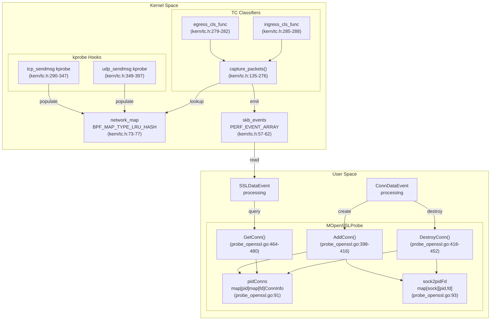
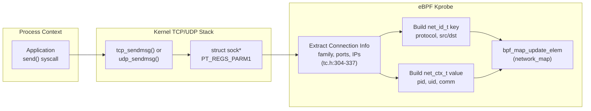
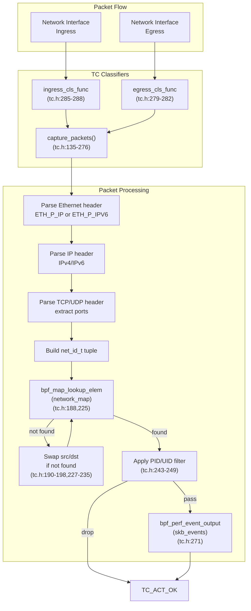
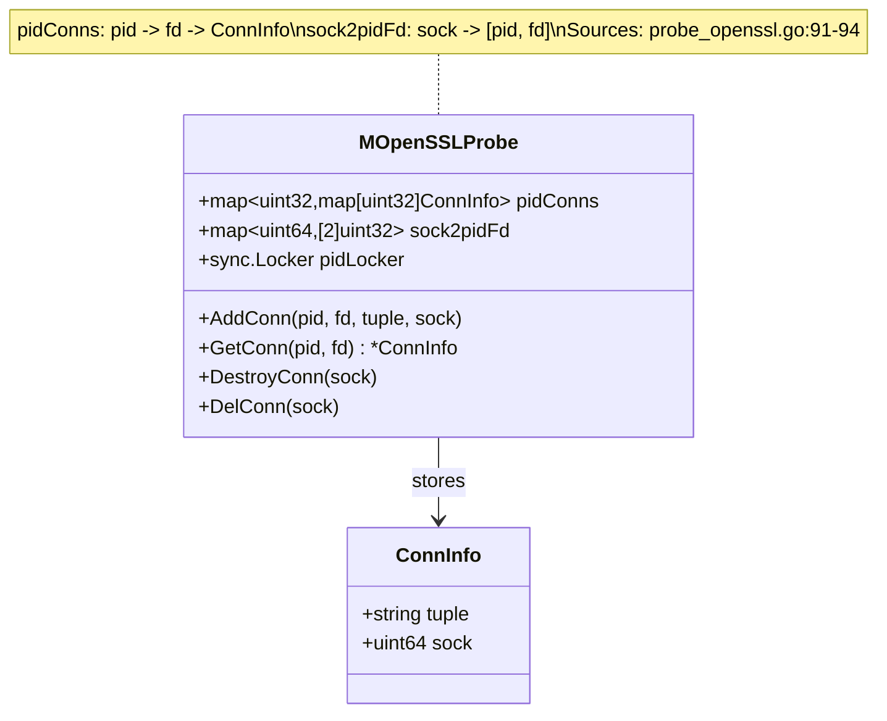
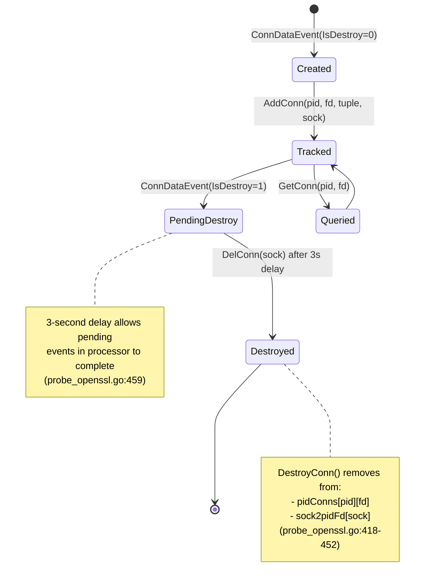
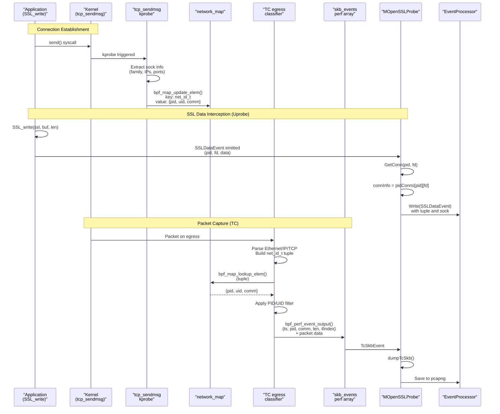

# Network Connection Tracking

<details>
<summary>Relevant source files</summary>

The following files were used as context for generating this wiki page:

- [kern/common.h](https://github.com/gojue/ecapture/blob/ca085d05/kern/common.h)
- [kern/ecapture.h](https://github.com/gojue/ecapture/blob/ca085d05/kern/ecapture.h)
- [kern/openssl.h](https://github.com/gojue/ecapture/blob/ca085d05/kern/openssl.h)
- [kern/openssl_masterkey.h](https://github.com/gojue/ecapture/blob/ca085d05/kern/openssl_masterkey.h)
- [kern/openssl_masterkey_3.0.h](https://github.com/gojue/ecapture/blob/ca085d05/kern/openssl_masterkey_3.0.h)
- [kern/tc.h](https://github.com/gojue/ecapture/blob/ca085d05/kern/tc.h)
- [user/module/probe_openssl_keylog.go](https://github.com/gojue/ecapture/blob/ca085d05/user/module/probe_openssl_keylog.go)
- [user/module/probe_openssl_text.go](https://github.com/gojue/ecapture/blob/ca085d05/user/module/probe_openssl_text.go)

</details>


## Purpose and Scope

Network Connection Tracking is the subsystem responsible for correlating network packets with the processes that generate or consume them. This enables ecapture to attribute captured TLS/SSL traffic and network packets to specific processes (PID), users (UID), and connection tuples (IP addresses and ports). The system operates at two levels: kernel-space tracking via eBPF maps and Traffic Control (TC) classifiers, and user-space tracking for socket file descriptors.

For information about the TC packet capture mechanism itself, see [Network Packet Capture with TC](../3-capture-modules/3.3-network-packet-capture-with-tc.md). For details on the event processing pipeline that consumes connection events, see [Event Processing Pipeline](2.2-event-processing-pipeline.md).

## Architecture Overview

The network connection tracking system consists of three primary components:

1. **Kernel-space kprobe hooks** (`tcp_sendmsg`, `udp_sendmsg`) that capture connection metadata when processes send data
2. **The `network_map` eBPF hash map** that stores the PID/UID/comm for each active connection
3. **TC classifiers** (ingress/egress) that intercept packets and look up process information
4. **User-space tracking** in the OpenSSL module that maps file descriptors to socket addresses



**Sources:** [kern/tc.h:1-398](https://github.com/gojue/ecapture/blob/ca085d05/kern/tc.h#L1-L398), [user/module/probe_openssl.go:78-106](https://github.com/gojue/ecapture/blob/ca085d05/user/module/probe_openssl.go#L78-L106), [user/module/probe_openssl.go:398-480](https://github.com/gojue/ecapture/blob/ca085d05/user/module/probe_openssl.go#L398-L480)

## Kernel-Space Connection Tracking

### The network_map Structure

The `network_map` is an LRU (Least Recently Used) hash map that stores process context information indexed by network connection identifiers. It enables the TC classifiers to determine which process owns a particular packet.

**Map Definition:**
```c
struct {
    __uint(type, BPF_MAP_TYPE_LRU_HASH);
    __type(key, struct net_id_t);
    __type(value, struct net_ctx_t);
    __uint(max_entries, 10240);
} network_map SEC(".maps");
```

**Key Structure (`net_id_t`):**
| Field | Type | Description |
|-------|------|-------------|
| `protocol` | `u32` | IP protocol (IPPROTO_TCP=6, IPPROTO_UDP=17) |
| `src_port` | `u32` | Source port number |
| `src_ip4` | `u32` | Source IPv4 address |
| `dst_port` | `u32` | Destination port number |
| `dst_ip4` | `u32` | Destination IPv4 address |
| `src_ip6[4]` | `u32[4]` | Source IPv6 address |
| `dst_ip6[4]` | `u32[4]` | Destination IPv6 address |

**Value Structure (`net_ctx_t`):**
| Field | Type | Description |
|-------|------|-------------|
| `pid` | `u32` | Process ID |
| `uid` | `u32` | User ID |
| `comm[16]` | `char[]` | Process command name (TASK_COMM_LEN) |

**Sources:** [kern/tc.h:39-54](https://github.com/gojue/ecapture/blob/ca085d05/kern/tc.h#L39-L54), [kern/tc.h:73-77](https://github.com/gojue/ecapture/blob/ca085d05/kern/tc.h#L73-L77)

### Kprobe Hooks for Connection Population

The system hooks `tcp_sendmsg` and `udp_sendmsg` kernel functions to capture connection metadata as soon as a process attempts to send data over the network. These hooks extract socket information from the `struct sock` parameter and populate the `network_map`.



**TCP Hook Implementation:**
- Entry point: `tcp_sendmsg` kprobe at [kern/tc.h:290-347](https://github.com/gojue/ecapture/blob/ca085d05/kern/tc.h#L290-L347)
- Reads `struct sock` fields using `bpf_probe_read()` for both IPv4 and IPv6
- Handles AF_INET (IPv4) and AF_INET6 (IPv6) socket families
- Extracts: `skc_num` (local port), `skc_dport` (remote port, network byte order), IP addresses
- Updates `network_map` with connection tuple and process context

**UDP Hook Implementation:**
- Entry point: `udp_sendmsg` kprobe at [kern/tc.h:349-397](https://github.com/gojue/ecapture/blob/ca085d05/kern/tc.h#L349-L397)
- Nearly identical to TCP hook, but sets `protocol` to `IPPROTO_UDP`
- Reuses the same `struct tcphdr` layout for port extraction (UDP header has same initial layout)

**Note:** These kprobes intentionally do NOT filter by `target_pid` or `target_uid` because the TC classifiers need comprehensive connection information for all processes to perform packet attribution.

**Sources:** [kern/tc.h:290-347](https://github.com/gojue/ecapture/blob/ca085d05/kern/tc.h#L290-L347), [kern/tc.h:349-397](https://github.com/gojue/ecapture/blob/ca085d05/kern/tc.h#L349-L397)

### TC Classifier Packet Correlation

The TC (Traffic Control) classifiers intercept packets at the data link layer (Layer 2) on both ingress and egress paths. For each packet, they extract the connection tuple (protocol, IPs, ports) and look it up in the `network_map` to attribute the packet to a process.



**Bidirectional Lookup Logic:**

The TC classifier first attempts to look up the packet's source-to-destination tuple in `network_map`. If not found, it swaps source and destination (both IPs and ports) and retries the lookup. This handles packets in both directions:

- **Outbound packets:** The tuple matches the entry created by `tcp_sendmsg`/`udp_sendmsg` (process is sender)
- **Inbound packets:** The swapped tuple matches the entry (process is receiver)

**Filter Application:**

After successful lookup, the TC classifier applies PID and UID filters (if `target_pid` or `target_uid` are set) to decide whether to capture the packet. Only packets matching the filter criteria are emitted to the `skb_events` perf array.

**Sources:** [kern/tc.h:135-276](https://github.com/gojue/ecapture/blob/ca085d05/kern/tc.h#L135-L276), [kern/tc.h:279-288](https://github.com/gojue/ecapture/blob/ca085d05/kern/tc.h#L279-L288)

## User-Space Connection Tracking

### Purpose and Integration with OpenSSL Module

The user-space connection tracking in `MOpenSSLProbe` maintains a mapping between process file descriptors (FDs) and their corresponding socket addresses (tuples). This is necessary because:

1. SSL/TLS functions (e.g., `SSL_read`, `SSL_write`) operate on file descriptors, not socket structures
2. The eBPF probes on SSL functions cannot directly access socket metadata
3. User-space needs to correlate SSL data events with network packets captured by TC

The tracking is populated by `ConnDataEvent` structures emitted from eBPF when connections are established or destroyed.

### Data Structures



**pidConns Structure:**
- Type: `map[uint32]map[uint32]ConnInfo`
- Outer key: Process ID (PID)
- Inner key: File descriptor (FD)
- Value: `ConnInfo` containing tuple string and socket pointer

**sock2pidFd Structure:**
- Type: `map[uint64][2]uint32`
- Key: Socket pointer (from kernel)
- Value: Array of [PID, FD] for reverse lookup

**ConnInfo Structure:**
- `tuple` (string): Connection tuple in format "src_ip:src_port-dst_ip:dst_port"
- `sock` (uint64): Kernel socket structure pointer for consistency checking

**Sources:** [user/module/probe_openssl.go:78-82](https://github.com/gojue/ecapture/blob/ca085d05/user/module/probe_openssl.go#L78-L82), [user/module/probe_openssl.go:90-94](https://github.com/gojue/ecapture/blob/ca085d05/user/module/probe_openssl.go#L90-L94)

### Connection Lifecycle Management



**Connection Creation (AddConn):**

When a `ConnDataEvent` with `IsDestroy=0` is dispatched, `AddConn` is called:

1. Validates FD is non-zero [probe_openssl.go:399-402](https://github.com/gojue/ecapture/blob/ca085d05/probe_openssl.go#L399-L402)
2. Acquires `pidLocker` mutex for thread-safe access [probe_openssl.go:404](https://github.com/gojue/ecapture/blob/ca085d05/probe_openssl.go#L404)
3. Creates nested map for PID if it doesn't exist [probe_openssl.go:406-409](https://github.com/gojue/ecapture/blob/ca085d05/probe_openssl.go#L406-L409)
4. Stores `ConnInfo{tuple, sock}` in `pidConns[pid][fd]` [probe_openssl.go:410]()
5. Creates reverse mapping in `sock2pidFd[sock] = [pid, fd]` [probe_openssl.go:413]()
6. Logs debug message [probe_openssl.go:415](https://github.com/gojue/ecapture/blob/ca085d05/probe_openssl.go#L415)

**Connection Destruction (DelConn → DestroyConn):**

When a `ConnDataEvent` with `IsDestroy=1` is dispatched:

1. `DelConn` schedules `DestroyConn` with 3-second delay using `time.AfterFunc` [probe_openssl.go:455-462](https://github.com/gojue/ecapture/blob/ca085d05/probe_openssl.go#L455-L462)
2. The delay allows the event processor to finish merging events for this connection
3. `DestroyConn` signals the processor to cleanup via `processor.WriteDestroyConn(sock)` [probe_openssl.go:423](https://github.com/gojue/ecapture/blob/ca085d05/probe_openssl.go#L423)
4. Performs reverse lookup in `sock2pidFd` to find [pid, fd] [probe_openssl.go:426-433]()
5. Validates socket consistency (stored sock == provided sock) [probe_openssl.go:441-445](https://github.com/gojue/ecapture/blob/ca085d05/probe_openssl.go#L441-L445)
6. Removes entry from `pidConns[pid][fd]` and deletes PID map if empty [probe_openssl.go:446-449]()
7. Removes reverse mapping from `sock2pidFd` [probe_openssl.go:431](https://github.com/gojue/ecapture/blob/ca085d05/probe_openssl.go#L431)

**Connection Lookup (GetConn):**

Called by `dumpSslData` when processing `SSLDataEvent` structures:

1. Validates FD is non-zero [probe_openssl.go:465-467](https://github.com/gojue/ecapture/blob/ca085d05/probe_openssl.go#L465-L467)
2. Acquires `pidLocker` mutex [probe_openssl.go:469](https://github.com/gojue/ecapture/blob/ca085d05/probe_openssl.go#L469)
3. Performs two-level lookup: `pidConns[pid][fd]` [probe_openssl.go:471-478]()
4. Returns pointer to `ConnInfo` or `nil` if not found [probe_openssl.go:479](https://github.com/gojue/ecapture/blob/ca085d05/probe_openssl.go#L479)

**Sources:** [user/module/probe_openssl.go:398-416](https://github.com/gojue/ecapture/blob/ca085d05/user/module/probe_openssl.go#L398-L416), [user/module/probe_openssl.go:418-462](https://github.com/gojue/ecapture/blob/ca085d05/user/module/probe_openssl.go#L418-L462), [user/module/probe_openssl.go:464-480](https://github.com/gojue/ecapture/blob/ca085d05/user/module/probe_openssl.go#L464-L480)

## Packet-to-Process Correlation Flow

This section describes the complete flow from a process sending data to the attribution of captured packets.



**Step-by-Step Correlation:**

1. **Connection Registration (Kprobe):**
   - Process calls `send()` or similar syscall
   - Kernel invokes `tcp_sendmsg` or `udp_sendmsg`
   - Kprobe extracts connection tuple and process context
   - Populates `network_map[tuple] = {pid, uid, comm}`

2. **SSL Data Capture (Uprobe):**
   - Process calls SSL function (e.g., `SSL_write`)
   - Uprobe captures `SSLDataEvent` with {pid, fd, data}
   - User-space calls `GetConn(pid, fd)` to retrieve tuple
   - Event is enriched with tuple and socket pointer
   - Sent to `EventProcessor` for protocol parsing

3. **Packet Capture (TC):**
   - Packet arrives at network interface (egress or ingress)
   - TC classifier parses headers to extract connection tuple
   - Looks up tuple in `network_map` (tries both directions)
   - If found, checks PID/UID filters
   - Emits `TcSkbEvent` with packet data and process metadata
   - User-space writes to pcapng file with DSB (Decryption Secrets Block)

**Sources:** [kern/tc.h:290-347](https://github.com/gojue/ecapture/blob/ca085d05/kern/tc.h#L290-L347), [kern/tc.h:135-276](https://github.com/gojue/ecapture/blob/ca085d05/kern/tc.h#L135-L276), [user/module/probe_openssl.go:756-775](https://github.com/gojue/ecapture/blob/ca085d05/user/module/probe_openssl.go#L756-L775)

## Integration with Module Dispatcher

The `MOpenSSLProbe.Dispatcher` method routes connection-related events to the appropriate handler:

```go
func (m *MOpenSSLProbe) Dispatcher(eventStruct event.IEventStruct) {
    switch ev := eventStruct.(type) {
    case *event.ConnDataEvent:
        if ev.IsDestroy == 0 {
            m.AddConn(ev.Pid, ev.Fd, ev.Tuple, ev.Sock)
        } else {
            m.DelConn(ev.Sock)
        }
    case *event.TcSkbEvent:
        err := m.dumpTcSkb(ev)
    case *event.SSLDataEvent:
        m.dumpSslData(ev)
    // ... other event types
    }
}
```

**Event Flow:**

| Event Type | Source | Handler | Purpose |
|------------|--------|---------|---------|
| `ConnDataEvent` | eBPF uprobe (SSL_new, accept, connect) | `AddConn`/`DelConn` | Maintain fd→tuple mapping |
| `TcSkbEvent` | TC classifier (egress/ingress) | `dumpTcSkb` | Write packets to pcapng |
| `SSLDataEvent` | eBPF uprobe (SSL_read/write) | `dumpSslData` | Enrich with tuple, send to processor |

The dispatcher is called by `Module.Dispatcher` [user/module/imodule.go:409-448](https://github.com/gojue/ecapture/blob/ca085d05/user/module/imodule.go#L409-L448) after event decoding from perf/ring buffers.

**Sources:** [user/module/probe_openssl.go:733-754](https://github.com/gojue/ecapture/blob/ca085d05/user/module/probe_openssl.go#L733-L754), [user/module/probe_openssl.go:756-775](https://github.com/gojue/ecapture/blob/ca085d05/user/module/probe_openssl.go#L756-L775)

## Configuration and Filtering

The connection tracking system respects process and user filtering configured via command-line flags:

**Kernel-Space Filtering:**
- Constants `target_pid` and `target_uid` defined at [kern/common.h:67-68](https://github.com/gojue/ecapture/blob/ca085d05/kern/common.h#L67-L68)
- Set via constant editors in [user/module/probe_openssl.go:361-387](https://github.com/gojue/ecapture/blob/ca085d05/user/module/probe_openssl.go#L361-L387)
- Applied in TC classifier at [kern/tc.h:243-249](https://github.com/gojue/ecapture/blob/ca085d05/kern/tc.h#L243-L249)
- Note: Kprobes do NOT filter to ensure comprehensive `network_map` population

**User-Space Filtering:**
- Enforced in `dumpSslData` when processing `SSLDataEvent`
- Only connections matching filter criteria are tracked in `pidConns`
- Filter check happens before calling `AddConn`

**Default Tuple Handling:**

When `GetConn` returns `nil` (connection not tracked), `SSLDataEvent` uses default values:
- `Tuple = DefaultTuple` ("0.0.0.0:0-0.0.0.0:0") at [user/module/probe_openssl.go:43](https://github.com/gojue/ecapture/blob/ca085d05/user/module/probe_openssl.go#L43)
- `Sock = 0`

This occurs when:
- FD is invalid (≤0)
- Connection was not captured (filtered out, or BIO type is non-socket)
- Connection already destroyed

**Sources:** [kern/common.h:67-68](https://github.com/gojue/ecapture/blob/ca085d05/kern/common.h#L67-L68), [kern/tc.h:243-249](https://github.com/gojue/ecapture/blob/ca085d05/kern/tc.h#L243-L249), [user/module/probe_openssl.go:361-387](https://github.com/gojue/ecapture/blob/ca085d05/user/module/probe_openssl.go#L361-L387), [user/module/probe_openssl.go:756-775](https://github.com/gojue/ecapture/blob/ca085d05/user/module/probe_openssl.go#L756-L775)