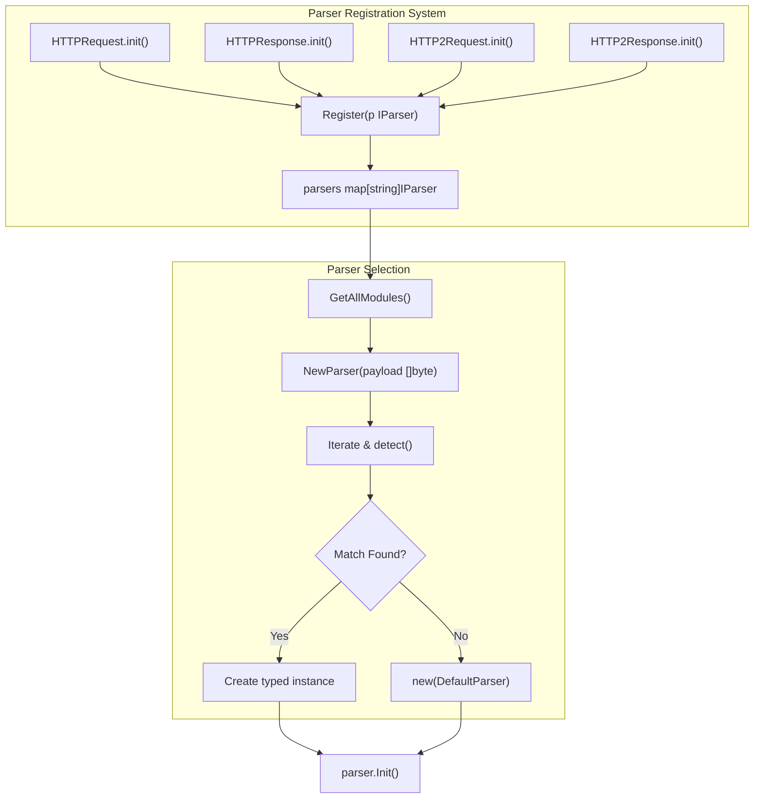
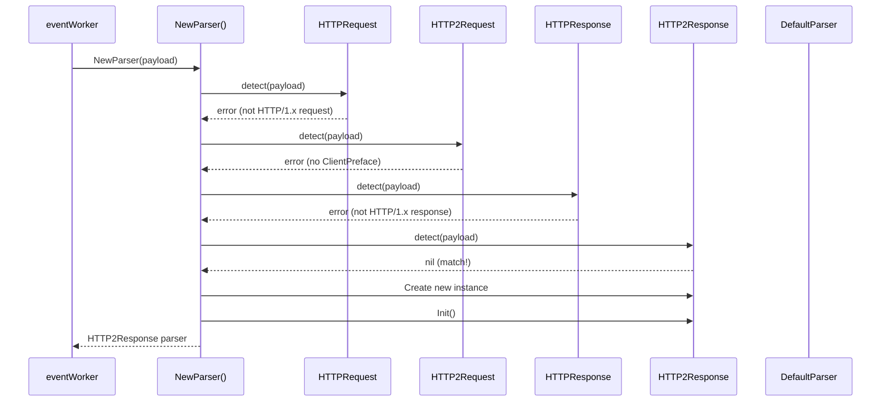
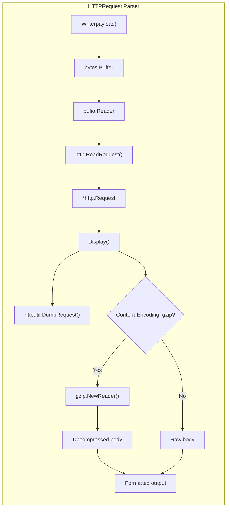
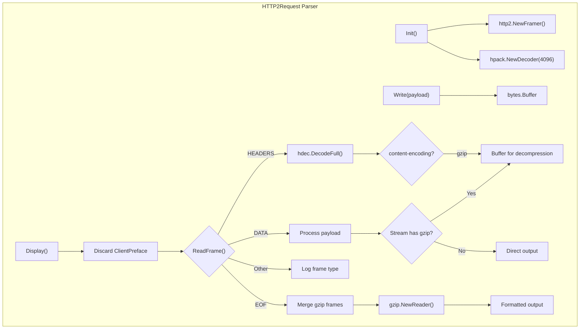
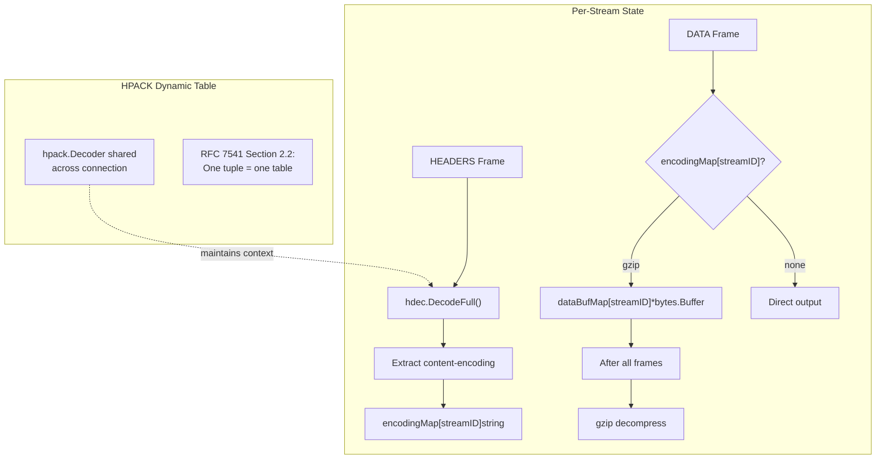
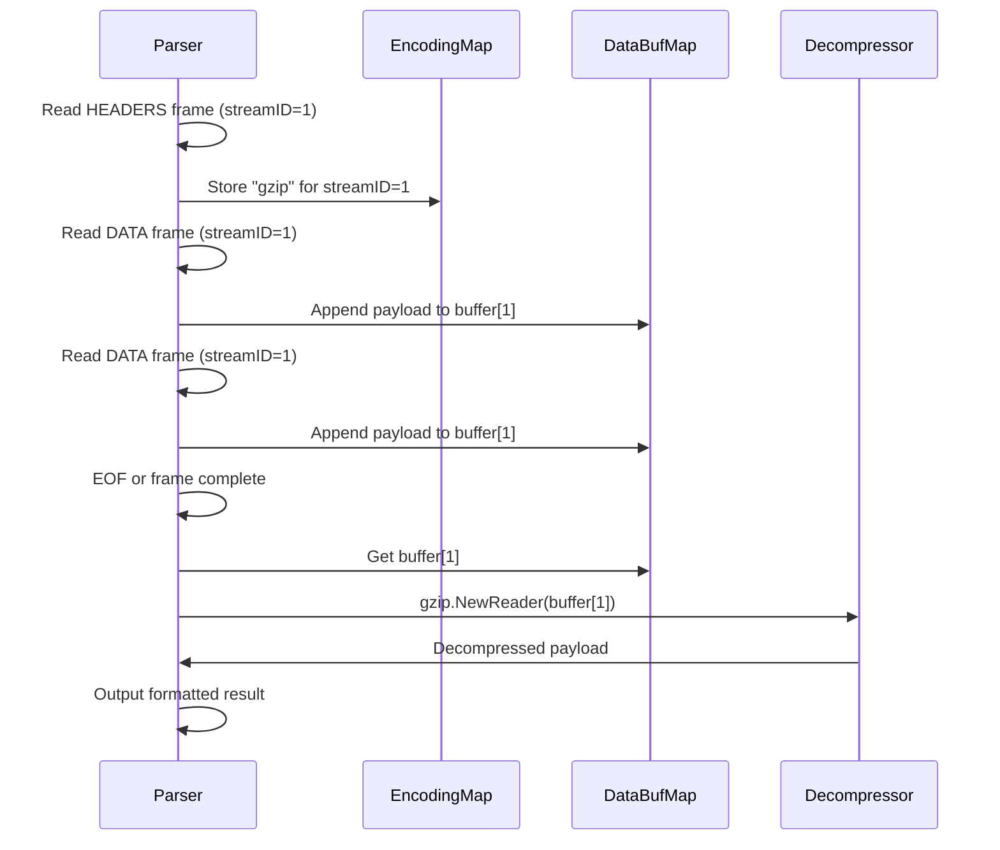
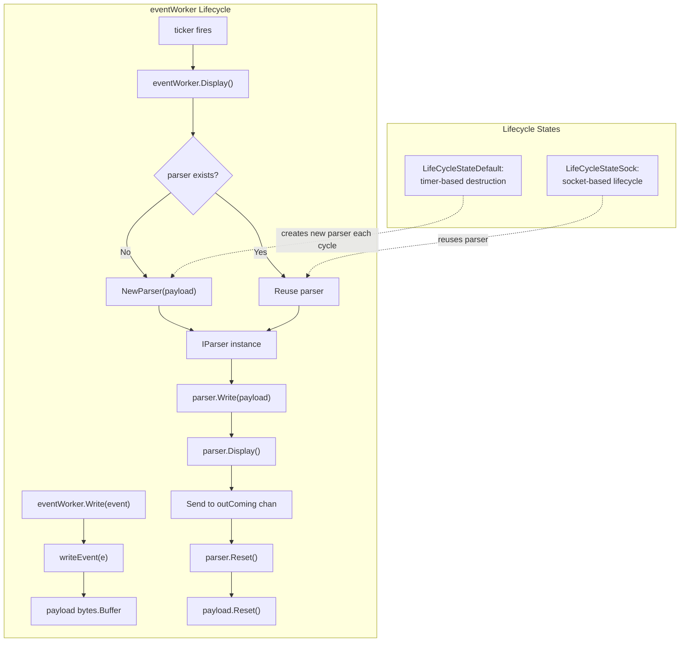

# Protocol Parsing

<details>
<summary>Relevant source files</summary>

The following files were used as context for generating this wiki page:

- [pkg/event_processor/http_request.go](https://github.com/gojue/ecapture/blob/ca085d05/pkg/event_processor/http_request.go)
- [pkg/event_processor/http_response.go](https://github.com/gojue/ecapture/blob/ca085d05/pkg/event_processor/http_response.go)
- [pkg/event_processor/iparser.go](https://github.com/gojue/ecapture/blob/ca085d05/pkg/event_processor/iparser.go)
- [pkg/event_processor/iworker.go](https://github.com/gojue/ecapture/blob/ca085d05/pkg/event_processor/iworker.go)
- [pkg/event_processor/processor.go](https://github.com/gojue/ecapture/blob/ca085d05/pkg/event_processor/processor.go)
- [user/event/ievent.go](https://github.com/gojue/ecapture/blob/ca085d05/user/event/ievent.go)

</details>


## Purpose and Scope

This document explains the protocol parsing subsystem in ecapture, which interprets captured payload data from SSL/TLS connections. The parsing system provides automatic detection and structured output for HTTP/1.x and HTTP/2 protocols, including HPACK header decompression and gzip content decompression. Parsers operate within the event processing pipeline described in [Event Processing Pipeline](2.2-event-processing-pipeline.md) and are invoked by event workers to transform raw binary data into human-readable protocol messages.

For information about event structures that feed into parsers, see [Event Structures and Types](2.3-event-structures-and-types.md). For output formatting after parsing, see [Output Formats](../4-output-formats/index.md).

---

## Parser Architecture

### IParser Interface

The core abstraction for all protocol parsers is the `IParser` interface defined in [pkg/event_processor/iparser.go:49-60](https://github.com/gojue/ecapture/blob/ca085d05/pkg/event_processor/iparser.go#L49-L60). Every parser implementation must satisfy this interface:

| Method | Purpose |
|--------|---------|
| `detect(b []byte) error` | Identifies if payload matches this protocol |
| `Write(b []byte) (int, error)` | Accumulates payload data for parsing |
| `ParserType() ParserType` | Returns the parser type identifier |
| `PacketType() PacketType` | Returns encoding/compression type detected |
| `Name() string` | Returns human-readable parser name |
| `IsDone() bool` | Indicates if parsing is complete |
| `Init()` | Initializes parser state |
| `Display() []byte` | Returns formatted output |
| `Reset()` | Clears state for reuse |

**Sources:** [pkg/event_processor/iparser.go:49-60](https://github.com/gojue/ecapture/blob/ca085d05/pkg/event_processor/iparser.go#L49-L60)

### Parser and Packet Types

The system defines enumerations for parser identification and content encoding:

```go
// ParserType identifies the protocol parser
const (
    ParserTypeNull ParserType = iota
    ParserTypeHttpRequest
    ParserTypeHttp2Request
    ParserTypeHttpResponse
    ParserTypeHttp2Response
    ParserTypeWebSocket
)

// PacketType identifies content encoding
const (
    PacketTypeNull PacketType = iota
    PacketTypeUnknow
    PacketTypeGzip
    PacketTypeWebSocket
)
```

The `ParserType` is used by the event processing system to route events, while `PacketType` indicates whether content was compressed and has been decompressed during parsing.

**Sources:** [pkg/event_processor/iparser.go:23-47](https://github.com/gojue/ecapture/blob/ca085d05/pkg/event_processor/iparser.go#L23-L47)

### Parser Registration System

Parsers self-register using an `init()` function pattern. The registration system maintains a global map of available parsers:



The `Register()` function [pkg/event_processor/iparser.go:64-73](https://github.com/gojue/ecapture/blob/ca085d05/pkg/event_processor/iparser.go#L64-L73) adds parsers to the global map, ensuring no duplicate names. When new payload data arrives, `NewParser()` [pkg/event_processor/iparser.go:85-115](https://github.com/gojue/ecapture/blob/ca085d05/pkg/event_processor/iparser.go#L85-L115) iterates through registered parsers, calling each `detect()` method until a match is found or falling back to `DefaultParser`.

**Sources:** [pkg/event_processor/iparser.go:62-115](https://github.com/gojue/ecapture/blob/ca085d05/pkg/event_processor/iparser.go#L62-L115)

---

## Parser Detection and Selection

The parser selection process uses a try-all-parsers approach with early termination on first match:



Each parser's `detect()` method examines protocol-specific markers:
- **HTTP/1.x Request**: Standard HTTP methods (GET, POST, etc.) via `http.ReadRequest()` [pkg/event_processor/http_request.go:83-91](https://github.com/gojue/ecapture/blob/ca085d05/pkg/event_processor/http_request.go#L83-L91)
- **HTTP/1.x Response**: HTTP version line via `http.ReadResponse()` [pkg/event_processor/http_response.go:94-102](https://github.com/gojue/ecapture/blob/ca085d05/pkg/event_processor/http_response.go#L94-L102)
- **HTTP/2 Request**: ClientPreface magic string "PRI * HTTP/2.0\r\n\r\nSM\r\n\r\n" [pkg/event_processor/http2_request.go:42-58](https://github.com/gojue/ecapture/blob/ca085d05/pkg/event_processor/http2_request.go#L42-L58)
- **HTTP/2 Response**: Valid frame header structure [pkg/event_processor/http2_response.go:56-88](https://github.com/gojue/ecapture/blob/ca085d05/pkg/event_processor/http2_response.go#L56-L88)

**Sources:** [pkg/event_processor/iparser.go:85-115](https://github.com/gojue/ecapture/blob/ca085d05/pkg/event_processor/iparser.go#L85-L115), [pkg/event_processor/http_request.go:83-91](https://github.com/gojue/ecapture/blob/ca085d05/pkg/event_processor/http_request.go#L83-L91), [pkg/event_processor/http_response.go:94-102](https://github.com/gojue/ecapture/blob/ca085d05/pkg/event_processor/http_response.go#L94-L102), [pkg/event_processor/http2_request.go:42-58](https://github.com/gojue/ecapture/blob/ca085d05/pkg/event_processor/http2_request.go#L42-L58), [pkg/event_processor/http2_response.go:56-88](https://github.com/gojue/ecapture/blob/ca085d05/pkg/event_processor/http2_response.go#L56-L88)

---

## HTTP/1.x Parsing

### Request Parsing

The `HTTPRequest` parser uses Go's standard `net/http` package to parse HTTP/1.x requests:



The parser accumulates data in a buffer [pkg/event_processor/http_request.go:54-80](https://github.com/gojue/ecapture/blob/ca085d05/pkg/event_processor/http_request.go#L54-L80), then uses `http.ReadRequest()` to parse headers and body. On first write, it initializes the request structure; subsequent writes accumulate body data.

**Gzip Detection and Decompression:** The parser checks the `Content-Encoding` header [pkg/event_processor/http_request.go:123-142](https://github.com/gojue/ecapture/blob/ca085d05/pkg/event_processor/http_request.go#L123-L142). If set to "gzip", it:
1. Creates a `gzip.NewReader()` from the body bytes
2. Decompresses via `io.ReadAll()`
3. Sets `PacketType` to `PacketTypeGzip`
4. Returns decompressed content in the output

**Sources:** [pkg/event_processor/http_request.go:28-163](https://github.com/gojue/ecapture/blob/ca085d05/pkg/event_processor/http_request.go#L28-L163)

### Response Parsing

The `HTTPResponse` parser follows a similar structure but uses `http.ReadResponse()`:

| Field | Purpose |
|-------|---------|
| `response *http.Response` | Parsed HTTP response structure |
| `reader *bytes.Buffer` | Accumulates raw bytes |
| `bufReader *bufio.Reader` | Buffers for http.ReadResponse |
| `packerType PacketType` | Tracks gzip compression |
| `isInit bool` | Indicates if response headers parsed |

The parser handles chunked transfer encoding automatically through Go's HTTP library. When `Display()` is called [pkg/event_processor/http_response.go:115-175](https://github.com/gojue/ecapture/blob/ca085d05/pkg/event_processor/http_response.go#L115-L175), it:
1. Reads the full response body via `io.ReadAll()`
2. Detects gzip via `Content-Encoding` header
3. Decompresses if necessary
4. Uses `httputil.DumpResponse()` for formatted output

**Truncated Body Handling:** The parser gracefully handles `io.ErrUnexpectedEOF` [pkg/event_processor/http_response.go:121-128](https://github.com/gojue/ecapture/blob/ca085d05/pkg/event_processor/http_response.go#L121-L128), which occurs when SSL/TLS data is captured incrementally and the declared `Content-Length` exceeds received data.

**Sources:** [pkg/event_processor/http_response.go:28-182](https://github.com/gojue/ecapture/blob/ca085d05/pkg/event_processor/http_response.go#L28-L182)

---

## HTTP/2 Parsing

HTTP/2 parsing is significantly more complex due to binary framing and HPACK header compression.

### HTTP/2 Frame Structure

All HTTP/2 communication uses frames with a 9-byte header [pkg/event_processor/http2_response.go:56-88](https://github.com/gojue/ecapture/blob/ca085d05/pkg/event_processor/http2_response.go#L56-L88):

```
+-----------------------------------------------+
|                 Length (24)                   |
+---------------+---------------+---------------+
|   Type (8)    |   Flags (8)   |
+-+-------------+---------------+-------------------------------+
|R|                 Stream Identifier (31)                      |
+=+=============================================================+
|                   Frame Payload (0...)                      ...
+---------------------------------------------------------------+
```

Frame types include: `DATA`, `HEADERS`, `PRIORITY`, `RST_STREAM`, `SETTINGS`, `PUSH_PROMISE`, `PING`, `GOAWAY`, `WINDOW_UPDATE`, `CONTINUATION`.

### HTTP/2 Request Parsing



**ClientPreface Detection:** HTTP/2 requests begin with the magic string "PRI * HTTP/2.0\r\n\r\nSM\r\n\r\n" [pkg/event_processor/http2_request.go:42-58](https://github.com/gojue/ecapture/blob/ca085d05/pkg/event_processor/http2_request.go#L42-L58). The `detect()` method verifies this 24-byte sequence. During `Display()`, the parser discards this preface before processing frames [pkg/event_processor/http2_request.go:103-112](https://github.com/gojue/ecapture/blob/ca085d05/pkg/event_processor/http2_request.go#L103-L112).

**Frame Processing:** The parser uses `http2.Framer` from `golang.org/x/net/http2` [pkg/event_processor/http2_request.go:61-71](https://github.com/gojue/ecapture/blob/ca085d05/pkg/event_processor/http2_request.go#L61-L71) to read frames sequentially. For each frame:
- **HEADERS Frame**: Uses `hpack.Decoder` to decompress header fields [pkg/event_processor/http2_request.go:129-145](https://github.com/gojue/ecapture/blob/ca085d05/pkg/event_processor/http2_request.go#L129-L145)
- **DATA Frame**: Collects payload bytes, tracking compression per stream ID [pkg/event_processor/http2_request.go:146-165](https://github.com/gojue/ecapture/blob/ca085d05/pkg/event_processor/http2_request.go#L146-L165)
- **Other Frames**: Logs frame type and stream ID

**Sources:** [pkg/event_processor/http2_request.go:32-206](https://github.com/gojue/ecapture/blob/ca085d05/pkg/event_processor/http2_request.go#L32-L206)

### HTTP/2 Response Parsing

The `HTTP2Response` parser shares similar structure but handles responses:



**HPACK Dynamic Table:** The HTTP/2 specification requires maintaining a shared dynamic table across the entire connection [pkg/event_processor/http2_response.go:94-100](https://github.com/gojue/ecapture/blob/ca085d05/pkg/event_processor/http2_response.go#L94-L100). The parser creates one `hpack.Decoder` per connection lifecycle, not per frame. This preserves header compression context across multiple request/response pairs.

**Incomplete Frame Handling:** During incremental SSL/TLS capture, frames may be truncated. The parser gracefully handles `io.ErrUnexpectedEOF` [pkg/event_processor/http2_response.go:137-144](https://github.com/gojue/ecapture/blob/ca085d05/pkg/event_processor/http2_response.go#L137-L144) by:
1. Checking if error is EOF or `ErrUnexpectedEOF`
2. Logging other errors only
3. Continuing with successfully parsed frames

This prevents spurious errors during streaming capture.

**Sources:** [pkg/event_processor/http2_response.go:46-224](https://github.com/gojue/ecapture/blob/ca085d05/pkg/event_processor/http2_response.go#L46-L224)

### HPACK Header Compression

HPACK (HTTP/2 Header Compression) reduces header redundancy through:

| Mechanism | Description |
|-----------|-------------|
| Static Table | Predefined common headers (e.g., `:method: GET`) |
| Dynamic Table | Connection-specific header cache (4096 bytes default) |
| Huffman Encoding | Compresses header string values |

The parser uses `hpack.DecodeFull()` to decode the complete header block fragment [pkg/event_processor/http2_request.go:133-141](https://github.com/gojue/ecapture/blob/ca085d05/pkg/event_processor/http2_request.go#L133-L141), [pkg/event_processor/http2_response.go:151-160](https://github.com/gojue/ecapture/blob/ca085d05/pkg/event_processor/http2_response.go#L151-L160). Each decoded header field contains a name-value pair. The parser specifically watches for `content-encoding` headers to track compression per stream.

**CONTINUATION Frame Limitation:** The current implementation does not support `HEADERS` frames split across `CONTINUATION` frames [pkg/event_processor/http2_request.go:143-144](https://github.com/gojue/ecapture/blob/ca085d05/pkg/event_processor/http2_request.go#L143-L144), [pkg/event_processor/http2_response.go:162-163](https://github.com/gojue/ecapture/blob/ca085d05/pkg/event_processor/http2_response.go#L162-L163). It logs a warning if `HeadersEnded()` returns false, indicating incomplete headers.

**Sources:** [pkg/event_processor/http2_request.go:129-145](https://github.com/gojue/ecapture/blob/ca085d05/pkg/event_processor/http2_request.go#L129-L145), [pkg/event_processor/http2_response.go:146-163](https://github.com/gojue/ecapture/blob/ca085d05/pkg/event_processor/http2_response.go#L146-L163)

### HTTP/2 Gzip Decompression

HTTP/2 gzip handling differs from HTTP/1.x due to frame-based streaming:



The parser maintains two maps keyed by stream ID [pkg/event_processor/http2_request.go:114-115](https://github.com/gojue/ecapture/blob/ca085d05/pkg/event_processor/http2_request.go#L114-L115), [pkg/event_processor/http2_response.go:132-133](https://github.com/gojue/ecapture/blob/ca085d05/pkg/event_processor/http2_response.go#L132-L133):
1. `encodingMap[streamID]` - Tracks content encoding per stream
2. `dataBufMap[streamID]` - Accumulates gzipped payloads per stream

After reading all frames, it decompresses accumulated buffers [pkg/event_processor/http2_request.go:172-189](https://github.com/gojue/ecapture/blob/ca085d05/pkg/event_processor/http2_request.go#L172-L189), [pkg/event_processor/http2_response.go:190-207](https://github.com/gojue/ecapture/blob/ca085d05/pkg/event_processor/http2_response.go#L190-L207):
1. Checks if stream has gzip encoding
2. Creates `gzip.NewReader()` from accumulated buffer
3. Reads decompressed data via `io.ReadAll()`
4. Appends to output with stream ID annotation

**Sources:** [pkg/event_processor/http2_request.go:114-189](https://github.com/gojue/ecapture/blob/ca085d05/pkg/event_processor/http2_request.go#L114-L189), [pkg/event_processor/http2_response.go:132-207](https://github.com/gojue/ecapture/blob/ca085d05/pkg/event_processor/http2_response.go#L132-L207)

---

## Default Parser

The `DefaultParser` serves as a fallback when no specific protocol is detected:

```go
type DefaultParser struct {
    reader *bytes.Buffer
    isdone bool
}
```

It provides minimal processing [pkg/event_processor/iparser.go:117-166](https://github.com/gojue/ecapture/blob/ca085d05/pkg/event_processor/iparser.go#L117-L166):
1. Accumulates all bytes in a buffer
2. On `Display()`, checks first byte for printability
3. If byte < 32 or > 126 (non-printable), outputs hex dump
4. Otherwise, converts C-style null-terminated string to Go string

This ensures all captured data can be viewed, even if protocol-specific parsing fails.

**Sources:** [pkg/event_processor/iparser.go:117-166](https://github.com/gojue/ecapture/blob/ca085d05/pkg/event_processor/iparser.go#L117-L166)

---

## Integration with Event Workers

Parsers operate within the context of event workers in the event processing pipeline:



**Parser Instantiation:** Workers create parsers on-demand during the first `Display()` call [pkg/event_processor/iworker.go:248-259](https://github.com/gojue/ecapture/blob/ca085d05/pkg/event_processor/iworker.go#L248-L259):
- For `LifeCycleStateDefault` workers (short-lived streams), parser is nil initially
- For `LifeCycleStateSock` workers (persistent connections), parser persists across multiple events
- `NewParser()` examines the accumulated payload and selects appropriate parser

**Parser Lifecycle:** 
1. **Write Phase**: Event payload bytes accumulate in `eventWorker.payload` buffer [pkg/event_processor/iworker.go:236-245](https://github.com/gojue/ecapture/blob/ca085d05/pkg/event_processor/iworker.go#L236-L245)
2. **Parse Phase**: When ticker fires or close signal received, `parser.Write()` receives accumulated bytes [pkg/event_processor/iworker.go:254](https://github.com/gojue/ecapture/blob/ca085d05/pkg/event_processor/iworker.go#L254)
3. **Display Phase**: `parser.Display()` returns formatted output [pkg/event_processor/iworker.go:259](https://github.com/gojue/ecapture/blob/ca085d05/pkg/event_processor/iworker.go#L259)
4. **Reset Phase**: Parser state clears for reuse [pkg/event_processor/iworker.go:183](https://github.com/gojue/ecapture/blob/ca085d05/pkg/event_processor/iworker.go#L183)

**Truncation Support:** Workers respect the `truncateSize` configuration [pkg/event_processor/iworker.go:236-242](https://github.com/gojue/ecapture/blob/ca085d05/pkg/event_processor/iworker.go#L236-L242), limiting accumulated payload before parsing. This prevents memory exhaustion on large responses.

**Sources:** [pkg/event_processor/iworker.go:174-260](https://github.com/gojue/ecapture/blob/ca085d05/pkg/event_processor/iworker.go#L174-L260)

---

## Key Design Decisions

| Decision | Rationale |
|----------|-----------|
| Self-registering parsers via `init()` | Enables modular addition of new protocol parsers without modifying core code |
| Detection by trial-and-error | Simpler than magic byte inspection; leverages stdlib protocol parsers |
| Parser reuse in socket lifecycle | Maintains HTTP/2 HPACK dynamic table across connection |
| Graceful handling of `io.ErrUnexpectedEOF` | Normal condition during incremental TLS capture; not an error |
| Per-stream gzip tracking in HTTP/2 | HTTP/2 multiplexes streams; compression is per-stream, not per-connection |
| Hex dump fallback | Ensures all data viewable even if protocol unknown |

**Sources:** [pkg/event_processor/iparser.go](https://github.com/gojue/ecapture/blob/ca085d05/pkg/event_processor/iparser.go), [pkg/event_processor/iworker.go](https://github.com/gojue/ecapture/blob/ca085d05/pkg/event_processor/iworker.go), [pkg/event_processor/http2_request.go](https://github.com/gojue/ecapture/blob/ca085d05/pkg/event_processor/http2_request.go), [pkg/event_processor/http2_response.go](https://github.com/gojue/ecapture/blob/ca085d05/pkg/event_processor/http2_response.go)