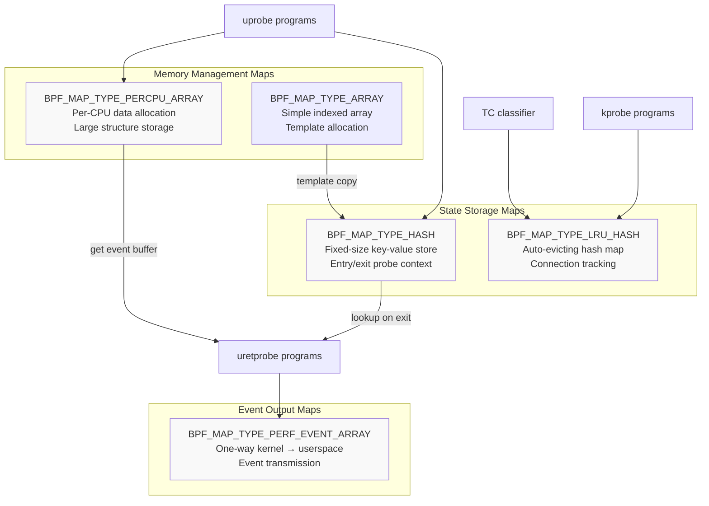
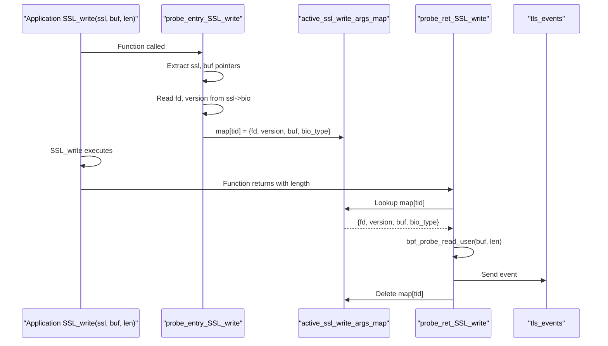
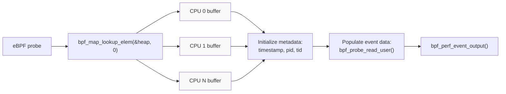
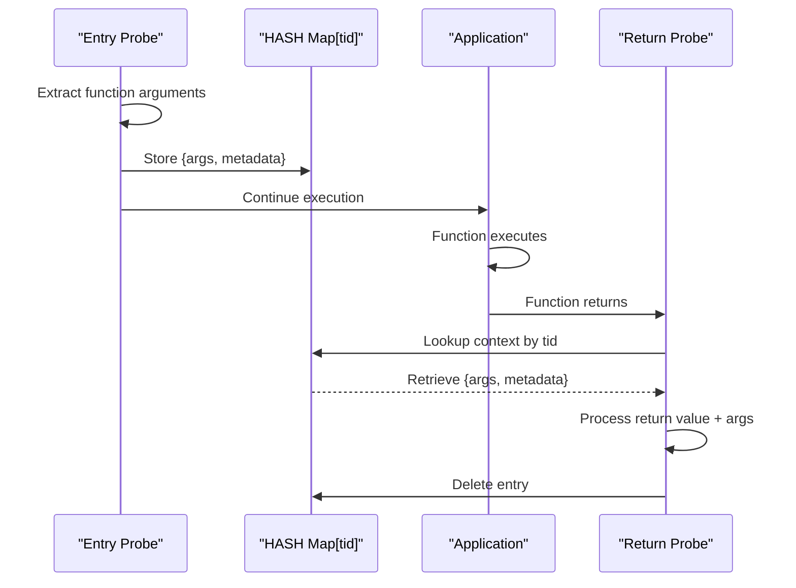

# eBPF Maps and Data Structures

<details>
<summary>Relevant source files</summary>

The following files were used as context for generating this wiki page:

- [kern/common.h](https://github.com/gojue/ecapture/blob/ca085d05/kern/common.h)
- [kern/ecapture.h](https://github.com/gojue/ecapture/blob/ca085d05/kern/ecapture.h)
- [kern/go_argument.h](https://github.com/gojue/ecapture/blob/ca085d05/kern/go_argument.h)
- [kern/gotls_kern.c](https://github.com/gojue/ecapture/blob/ca085d05/kern/gotls_kern.c)
- [kern/openssl.h](https://github.com/gojue/ecapture/blob/ca085d05/kern/openssl.h)
- [kern/openssl_masterkey.h](https://github.com/gojue/ecapture/blob/ca085d05/kern/openssl_masterkey.h)
- [kern/openssl_masterkey_3.0.h](https://github.com/gojue/ecapture/blob/ca085d05/kern/openssl_masterkey_3.0.h)
- [kern/tc.h](https://github.com/gojue/ecapture/blob/ca085d05/kern/tc.h)
- [user/module/probe_gotls.go](https://github.com/gojue/ecapture/blob/ca085d05/user/module/probe_gotls.go)
- [user/module/probe_openssl_keylog.go](https://github.com/gojue/ecapture/blob/ca085d05/user/module/probe_openssl_keylog.go)
- [user/module/probe_openssl_text.go](https://github.com/gojue/ecapture/blob/ca085d05/user/module/probe_openssl_text.go)

</details>


This page documents all BPF maps and data structures used across eCapture modules for storing state, passing events, and managing memory within the constraints of the eBPF execution environment. These maps form the bridge between kernel-space eBPF programs and user-space event processing.

For information about how events are processed after being read from these maps, see [Event Processing Pipeline](2.2-event-processing-pipeline.md). For details on event structure definitions and types, see [Event Structures and Types](2.3-event-structures-and-types.md).

## Overview

eCapture uses BPF maps for three primary purposes:

1. **Event Output** - Transmitting captured data from kernel to userspace via PERF_EVENT_ARRAY or RINGBUF
2. **State Storage** - Maintaining context between function entry/exit probes using HASH and LRU_HASH maps
3. **Memory Management** - Circumventing eBPF's 512-byte stack limit using PERCPU_ARRAY for heap allocation

All maps follow consistent naming conventions and are shared across eBPF programs within a module. Map definitions use the BTF-based declaration syntax with `SEC(".maps")` annotation.

Sources: [kern/openssl.h:74-135](https://github.com/gojue/ecapture/blob/ca085d05/kern/openssl.h#L74-L135), [kern/tc.h:56-78](https://github.com/gojue/ecapture/blob/ca085d05/kern/tc.h#L56-L78), [kern/gotls_kern.c:50-72](https://github.com/gojue/ecapture/blob/ca085d05/kern/gotls_kern.c#L50-L72), [kern/openssl_masterkey.h:45-68](https://github.com/gojue/ecapture/blob/ca085d05/kern/openssl_masterkey.h#L45-L68)

## Map Type Overview



**Map Type Selection Rationale:**

| Map Type | Use Case | Why Used |
|----------|----------|----------|
| `PERF_EVENT_ARRAY` | Event output | Efficient bulk data transfer to userspace with minimal overhead |
| `HASH` | Short-lived context | Fast lookup for entry/exit probe correlation (PID/TID key) |
| `LRU_HASH` | Connection tracking | Auto-eviction prevents memory exhaustion for long-running processes |
| `PERCPU_ARRAY` | Large structures | Bypasses 512-byte stack limit; no CPU contention |
| `ARRAY` | Template storage | Single-entry arrays used as heap allocation templates |

Sources: [kern/openssl.h:79-135](https://github.com/gojue/ecapture/blob/ca085d05/kern/openssl.h#L79-L135), [kern/tc.h:57-78](https://github.com/gojue/ecapture/blob/ca085d05/kern/tc.h#L57-L78)

## OpenSSL/BoringSSL Module Maps

### Event Output Maps

#### tls_events

**Type:** `BPF_MAP_TYPE_PERF_EVENT_ARRAY`  
**Purpose:** Transmit captured SSL/TLS plaintext data from kernel to userspace  
**Key:** CPU ID (u32)  
**Value:** Reference to perf ring buffer (u32)  
**Max Entries:** 1024

This map outputs `ssl_data_event_t` structures containing decrypted TLS data captured via uprobe hooks on `SSL_read` and `SSL_write`. Each event includes the plaintext payload (up to 16KB), process metadata, file descriptor, TLS version, and BIO type.

```mermaid
graph LR
    WRITE["probe_entry_SSL_write<br/>kern/openssl.h:332"] --> STORE["Store args in<br/>active_ssl_write_args_map"]
    STORE --> RET["probe_ret_SSL_write<br/>kern/openssl.h:337"]
    RET --> LOOKUP["Lookup saved args"]
    LOOKUP --> CREATE["create_ssl_data_event()<br/>kern/openssl.h:141"]
    CREATE --> HEAP["Get buffer from<br/>data_buffer_heap"]
    HEAP --> READ["bpf_probe_read_user()<br/>Read plaintext"]
    READ --> OUTPUT["bpf_perf_event_output()<br/>kern/openssl.h:188"]
    OUTPUT --> TLS_EVENTS["tls_events map"]
    TLS_EVENTS --> USERSPACE["User-space<br/>perfEventReader"]
```



**Event Structure:** `ssl_data_event_t`
- `type` - kSSLRead (0) or kSSLWrite (1)
- `timestamp_ns` - Capture timestamp
- `pid`, `tid` - Process/thread identifiers
- `data[MAX_DATA_SIZE_OPENSSL]` - Plaintext payload (16KB max)
- `data_len` - Actual payload length
- `comm[TASK_COMM_LEN]` - Process name
- `fd` - File descriptor
- `version` - TLS protocol version
- `bio_type` - OpenSSL BIO type (socket, file, etc.)

Sources: [kern/openssl.h:79-84](https://github.com/gojue/ecapture/blob/ca085d05/kern/openssl.h#L79-L84), [kern/openssl.h:28-39](https://github.com/gojue/ecapture/blob/ca085d05/kern/openssl.h#L28-L39), [kern/openssl.h:164-191](https://github.com/gojue/ecapture/blob/ca085d05/kern/openssl.h#L164-L191)

#### connect_events

**Type:** `BPF_MAP_TYPE_PERF_EVENT_ARRAY`  
**Purpose:** Track TCP connection lifecycle (connect, accept, destroy)  
**Key:** CPU ID (u32)  
**Value:** Reference to perf ring buffer (u32)  
**Max Entries:** 1024

Outputs `connect_event_t` structures from kprobes on `__sys_connect`, `__sys_accept4`, and `tcp_v4_destroy_sock`. Used to associate file descriptors with network socket addresses.

**Event Structure:** `connect_event_t`
- `saddr`, `daddr` - Source/destination IPv4/IPv6 addresses (128-bit)
- `sport`, `dport` - Source/destination ports
- `sock` - Kernel socket structure address
- `fd` - File descriptor
- `family` - AF_INET or AF_INET6
- `is_destroy` - Connection teardown flag
- Packed attribute to avoid padding holes

Sources: [kern/openssl.h:87-92](https://github.com/gojue/ecapture/blob/ca085d05/kern/openssl.h#L87-L92), [kern/openssl.h:41-55](https://github.com/gojue/ecapture/blob/ca085d05/kern/openssl.h#L41-L55), [kern/openssl.h:395-454](https://github.com/gojue/ecapture/blob/ca085d05/kern/openssl.h#L395-L454)

### State Storage Maps

#### active_ssl_read_args_map and active_ssl_write_args_map

**Type:** `BPF_MAP_TYPE_HASH`  
**Purpose:** Store SSL function arguments between entry and exit probes  
**Key:** Thread ID from `bpf_get_current_pid_tgid()` (u64)  
**Value:** `active_ssl_buf` structure  
**Max Entries:** 1024

These maps implement the **two-stage probe pattern**: entry probe stores function arguments (SSL pointer, buffer pointer), then the return probe retrieves them to read the actual data after the function completes.



**Value Structure:** `active_ssl_buf`
- `version` - SSL protocol version
- `fd` - File descriptor
- `bio_type` - OpenSSL BIO type
- `buf` - Pointer to data buffer

Sources: [kern/openssl.h:97-109](https://github.com/gojue/ecapture/blob/ca085d05/kern/openssl.h#L97-L109), [kern/openssl.h:57-67](https://github.com/gojue/ecapture/blob/ca085d05/kern/openssl.h#L57-L67), [kern/openssl.h:268-323](https://github.com/gojue/ecapture/blob/ca085d05/kern/openssl.h#L268-L323)

#### tcp_fd_infos

**Type:** `BPF_MAP_TYPE_HASH`  
**Purpose:** Associate file descriptors with kernel socket structures during connect/accept  
**Key:** PID/TID (u64)  
**Value:** `tcp_fd_info` structure  
**Max Entries:** 10240

Used in a multi-stage kprobe sequence:
1. `probe_connect` stores `fd` from syscall arguments
2. `probe_inet_stream_connect` adds `sock` pointer
3. `retprobe_connect` retrieves both to emit connection event

**Value Structure:** `tcp_fd_info`
- `sock` - Kernel socket structure address
- `fd` - File descriptor

Sources: [kern/openssl.h:129-134](https://github.com/gojue/ecapture/blob/ca085d05/kern/openssl.h#L129-L134), [kern/openssl.h:69-72](https://github.com/gojue/ecapture/blob/ca085d05/kern/openssl.h#L69-L72), [kern/openssl.h:354-393](https://github.com/gojue/ecapture/blob/ca085d05/kern/openssl.h#L354-L393)

#### ssl_st_fd

**Type:** `BPF_MAP_TYPE_HASH`  
**Purpose:** Store SSL structure to file descriptor mappings from SSL_set_fd()  
**Key:** SSL structure address (u64)  
**Value:** File descriptor (u64)  
**Max Entries:** 10240

Handles cases where `ssl->bio->num` is zero by providing a fallback FD lookup when hooking `SSL_set_fd`, `SSL_set_rfd`, `SSL_set_wfd` functions.

Sources: [kern/openssl.h:121-126](https://github.com/gojue/ecapture/blob/ca085d05/kern/openssl.h#L121-L126), [kern/openssl.h:528-543](https://github.com/gojue/ecapture/blob/ca085d05/kern/openssl.h#L528-L543)

### Memory Management Maps

#### data_buffer_heap

**Type:** `BPF_MAP_TYPE_PERCPU_ARRAY`  
**Purpose:** Heap allocation for large event structures (circumvents 512-byte stack limit)  
**Key:** Always 0 (u32)  
**Value:** `ssl_data_event_t` structure  
**Max Entries:** 1

Per-CPU design eliminates locking overhead and prevents data races. The `create_ssl_data_event()` helper function retrieves the buffer, initializes metadata, and returns a pointer for the probe to populate.

```c
// Memory allocation pattern used throughout eCapture eBPF programs
static __inline struct ssl_data_event_t* create_ssl_data_event(u64 current_pid_tgid) {
    u32 kZero = 0;
    // Lookup returns per-CPU instance, no contention
    struct ssl_data_event_t* event = bpf_map_lookup_elem(&data_buffer_heap, &kZero);
    if (event == NULL) return NULL;
    
    // Initialize common fields
    event->timestamp_ns = bpf_ktime_get_ns();
    event->pid = current_pid_tgid >> 32;
    event->tid = current_pid_tgid & 0xffffffff;
    return event;
}
```

**Why PERCPU_ARRAY:**
- eBPF stack limited to 512 bytes, but `ssl_data_event_t` is ~16KB
- Per-CPU design: no locking needed, no contention
- Single-entry array (key always 0) acts as a scratchpad
- Cheaper than dynamic heap allocation

Sources: [kern/openssl.h:113-118](https://github.com/gojue/ecapture/blob/ca085d05/kern/openssl.h#L113-L118), [kern/openssl.h:141-158](https://github.com/gojue/ecapture/blob/ca085d05/kern/openssl.h#L141-L158)

## Traffic Control (TC) Module Maps

### Event Output Maps

#### skb_events

**Type:** `BPF_MAP_TYPE_PERF_EVENT_ARRAY`  
**Purpose:** Output raw network packet metadata and payload  
**Key:** CPU ID (u32)  
**Value:** Reference to perf ring buffer (u32)  
**Max Entries:** 10240

Outputs `skb_data_event_t` structures from TC classifier programs (`egress_cls_func`, `ingress_cls_func`). Each event includes packet metadata enriched with process context from `network_map`.

**Event Structure:** `skb_data_event_t`
- `ts` - Timestamp
- `pid` - Process ID (from network_map lookup)
- `comm[TASK_COMM_LEN]` - Process name
- `len` - Packet length
- `ifindex` - Network interface index

Sources: [kern/tc.h:57-62](https://github.com/gojue/ecapture/blob/ca085d05/kern/tc.h#L57-L62), [kern/tc.h:30-37](https://github.com/gojue/ecapture/blob/ca085d05/kern/tc.h#L30-L37)

#### skb_data_buffer_heap

**Type:** `BPF_MAP_TYPE_PERCPU_ARRAY`  
**Purpose:** Per-CPU allocation for SKB event structures  
**Key:** Always 0 (u32)  
**Value:** `skb_data_event_t` structure  
**Max Entries:** 1

Follows the same heap allocation pattern as `data_buffer_heap` for OpenSSL events. Used by `make_skb_data_event()` helper function.

Sources: [kern/tc.h:64-69](https://github.com/gojue/ecapture/blob/ca085d05/kern/tc.h#L64-L69), [kern/tc.h:92-100](https://github.com/gojue/ecapture/blob/ca085d05/kern/tc.h#L92-L100)

### State Storage Maps

#### network_map

**Type:** `BPF_MAP_TYPE_LRU_HASH`  
**Purpose:** Map network 5-tuple (protocol, IPs, ports) to process context  
**Key:** `net_id_t` structure (5-tuple)  
**Value:** `net_ctx_t` structure (PID, UID, comm)  
**Max Entries:** 10240

Populated by kprobes on `tcp_sendmsg` and `udp_sendmsg`, then queried by TC classifiers to associate packets with processes. LRU eviction prevents memory exhaustion for servers handling many connections.

```mermaid
graph TB
    subgraph "Population Phase"
        SENDMSG["kprobe/tcp_sendmsg<br/>kprobe/udp_sendmsg"] --> EXTRACT["Extract from sock*:<br/>- family (AF_INET/AF_INET6)<br/>- src_ip, dst_ip<br/>- src_port, dst_port"]
        EXTRACT --> BUILD["Build net_id_t key"]
        BUILD --> STORE["network_map[net_id] =<br/>{pid, uid, comm}"]
    end
    
    subgraph "Lookup Phase"
        TC["TC classifier<br/>egress_cls_func/ingress_cls_func"] --> PARSE["Parse packet headers:<br/>- ethhdr<br/>- iphdr/ipv6hdr<br/>- tcphdr/udphdr"]
        PARSE --> BUILDKEY["Build net_id_t from packet"]
        BUILDKEY --> LOOKUP["network_map[net_id]"]
        LOOKUP --> FOUND["Found: Enrich event with<br/>pid, uid, comm"]
        LOOKUP --> NOTFOUND["Not found: Try reversed<br/>src/dst (for ingress)"]
        NOTFOUND --> LOOKUP2["network_map[reversed_net_id]"]
        FOUND --> OUTPUT["Output event"]
        LOOKUP2 --> OUTPUT
    end
```



**Key Structure:** `net_id_t`
- `protocol` - IPPROTO_TCP, IPPROTO_UDP, IPPROTO_ICMP
- `src_ip4`, `dst_ip4` - IPv4 addresses (u32)
- `src_ip6[4]`, `dst_ip6[4]` - IPv6 addresses (u32 array)
- `src_port`, `dst_port` - Port numbers

**Value Structure:** `net_ctx_t`
- `pid` - Process ID
- `uid` - User ID
- `comm[TASK_COMM_LEN]` - Process name

Sources: [kern/tc.h:72-77](https://github.com/gojue/ecapture/blob/ca085d05/kern/tc.h#L72-L77), [kern/tc.h:39-54](https://github.com/gojue/ecapture/blob/ca085d05/kern/tc.h#L39-L54), [kern/tc.h:285-333](https://github.com/gojue/ecapture/blob/ca085d05/kern/tc.h#L285-L333), [kern/tc.h:135-271](https://github.com/gojue/ecapture/blob/ca085d05/kern/tc.h#L135-L271)

## Go TLS Module Maps

### Event Output Maps

#### events (Go TLS data)

**Type:** `BPF_MAP_TYPE_PERF_EVENT_ARRAY`  
**Purpose:** Output captured Go TLS plaintext data  
**Key:** CPU ID (u32)  
**Value:** Reference to perf ring buffer (u32)  
**Max Entries:** 1024

Outputs `go_tls_event` structures from uprobes on Go's `crypto/tls.(*Conn).writeRecordLocked` and `crypto/tls.(*Conn).Read` functions. Separate probes exist for register-based ABI (Go ≥1.17) and stack-based ABI (Go <1.17).

**Event Structure:** `go_tls_event`
- `ts_ns` - Timestamp
- `pid`, `tid` - Process/thread identifiers
- `data_len` - Payload length
- `event_type` - GOTLS_EVENT_TYPE_WRITE (0) or GOTLS_EVENT_TYPE_READ (1)
- `comm[TASK_COMM_LEN]` - Process name
- `data[MAX_DATA_SIZE_OPENSSL]` - Plaintext payload (16KB)

Sources: [kern/gotls_kern.c:60-65](https://github.com/gojue/ecapture/blob/ca085d05/kern/gotls_kern.c#L60-L65), [kern/gotls_kern.c:31-39](https://github.com/gojue/ecapture/blob/ca085d05/kern/gotls_kern.c#L31-L39)

#### mastersecret_go_events

**Type:** `BPF_MAP_TYPE_PERF_EVENT_ARRAY`  
**Purpose:** Capture TLS master secrets for keylog generation  
**Key:** CPU ID (u32)  
**Value:** Reference to perf ring buffer (u32)  
**Max Entries:** 1024

Hooks `crypto/tls.(*Config).writeKeyLog` to extract TLS 1.3 traffic secrets and TLS 1.2 master keys. Each event contains the label string, client random, and secret bytes.

**Event Structure:** `mastersecret_gotls_t`
- `label[MASTER_SECRET_KEY_LEN]` - Key label (e.g., "CLIENT_HANDSHAKE_TRAFFIC_SECRET")
- `labellen` - Label string length
- `client_random[EVP_MAX_MD_SIZE]` - Client random bytes
- `client_random_len` - Client random length
- `secret_[EVP_MAX_MD_SIZE]` - Secret key material
- `secret_len` - Secret length

Sources: [kern/gotls_kern.c:53-58](https://github.com/gojue/ecapture/blob/ca085d05/kern/gotls_kern.c#L53-L58), [kern/gotls_kern.c:41-48](https://github.com/gojue/ecapture/blob/ca085d05/kern/gotls_kern.c#L41-L48), [kern/gotls_kern.c:194-267](https://github.com/gojue/ecapture/blob/ca085d05/kern/gotls_kern.c#L194-L267)

### Memory Management Maps

#### gte_context_gen

**Type:** `BPF_MAP_TYPE_PERCPU_ARRAY`  
**Purpose:** Per-CPU allocation for Go TLS event structures  
**Key:** Always 0 (u32)  
**Value:** `go_tls_event` structure  
**Max Entries:** 1

Similar to `data_buffer_heap` for OpenSSL, provides heap allocation for large event structures. Accessed via `get_gotls_event()` helper.

Sources: [kern/gotls_kern.c:67-72](https://github.com/gojue/ecapture/blob/ca085d05/kern/gotls_kern.c#L67-L72), [kern/gotls_kern.c:74-87](https://github.com/gojue/ecapture/blob/ca085d05/kern/gotls_kern.c#L74-L87)

## OpenSSL Master Secret Maps

### Event Output Maps

#### mastersecret_events

**Type:** `BPF_MAP_TYPE_PERF_EVENT_ARRAY`  
**Purpose:** Capture OpenSSL/BoringSSL TLS master secrets  
**Key:** CPU ID (u32)  
**Value:** Reference to perf ring buffer (u32)  
**Max Entries:** 1024

Outputs `mastersecret_t` structures from uprobe on `SSL_write` or configured master key extraction functions. Contains both TLS 1.2 master keys and TLS 1.3 traffic secrets.

**Event Structure:** `mastersecret_t`
- **TLS 1.2 fields:**
  - `version` - SSL/TLS version constant
  - `client_random[SSL3_RANDOM_SIZE]` - 32-byte client random
  - `master_key[MASTER_SECRET_MAX_LEN]` - 48-byte master secret
- **TLS 1.3 fields:**
  - `cipher_id` - Cipher suite identifier
  - `early_secret[EVP_MAX_MD_SIZE]` - Early traffic secret
  - `handshake_secret[EVP_MAX_MD_SIZE]` - Handshake traffic secret
  - `handshake_traffic_hash[EVP_MAX_MD_SIZE]` - Handshake hash
  - `client_app_traffic_secret[EVP_MAX_MD_SIZE]` - Client application traffic secret
  - `server_app_traffic_secret[EVP_MAX_MD_SIZE]` - Server application traffic secret
  - `exporter_master_secret[EVP_MAX_MD_SIZE]` - Exporter master secret

Sources: [kern/openssl_masterkey.h:48-53](https://github.com/gojue/ecapture/blob/ca085d05/kern/openssl_masterkey.h#L48-L53), [kern/openssl_masterkey.h:25-39](https://github.com/gojue/ecapture/blob/ca085d05/kern/openssl_masterkey.h#L25-L39), [kern/openssl_masterkey.h:82-251](https://github.com/gojue/ecapture/blob/ca085d05/kern/openssl_masterkey.h#L82-L251)

### State Storage Maps

#### bpf_context

**Type:** `BPF_MAP_TYPE_LRU_HASH`  
**Purpose:** Temporary storage for master secret structures during extraction  
**Key:** PID/TID (u64)  
**Value:** `mastersecret_t` structure  
**Max Entries:** 2048

Used as an intermediate storage during the `make_event()` allocation pattern. The LRU eviction policy prevents memory leaks for processes that crash before cleaning up.

Sources: [kern/openssl_masterkey.h:55-60](https://github.com/gojue/ecapture/blob/ca085d05/kern/openssl_masterkey.h#L55-L60)

#### bpf_context_gen

**Type:** `BPF_MAP_TYPE_ARRAY`  
**Purpose:** Template for master secret structure allocation  
**Key:** Always 0 (u32)  
**Value:** `mastersecret_t` structure  
**Max Entries:** 1

Single-entry array serves as a template that is copied into `bpf_context` map. This two-stage allocation pattern circumvents the eBPF stack size limit.

```c
// Pattern used for large structure allocation
static __always_inline struct mastersecret_t *make_event() {
    u32 key_gen = 0;
    // Get template from single-entry array
    struct mastersecret_t *bpf_ctx = bpf_map_lookup_elem(&bpf_context_gen, &key_gen);
    if (!bpf_ctx) return 0;
    
    // Copy to per-thread entry in hash map
    u64 id = bpf_get_current_pid_tgid();
    bpf_map_update_elem(&bpf_context, &id, bpf_ctx, BPF_ANY);
    
    // Return pointer to hash map entry for modification
    return bpf_map_lookup_elem(&bpf_context, &id);
}
```

Sources: [kern/openssl_masterkey.h:62-68](https://github.com/gojue/ecapture/blob/ca085d05/kern/openssl_masterkey.h#L62-L68), [kern/openssl_masterkey.h:71-78](https://github.com/gojue/ecapture/blob/ca085d05/kern/openssl_masterkey.h#L71-L78)

## Map Size Configuration

Map sizes are chosen based on expected workload:

| Map | Max Entries | Rationale |
|-----|-------------|-----------|
| `tls_events` | 1024 | One per CPU core for event output |
| `connect_events` | 1024 | One per CPU core for event output |
| `active_ssl_*_args_map` | 1024 | Supports ~1024 concurrent SSL operations |
| `ssl_st_fd` | 10240 | Many persistent SSL connections |
| `tcp_fd_infos` | 10240 | High connection churn during accept/connect |
| `network_map` | 10240 | LRU handles long-lived server connections |
| `bpf_context` | 2048 | Concurrent master secret extractions |
| `data_buffer_heap` | 1 | Single per-CPU scratchpad |

Larger values increase memory usage but prevent event loss under heavy load. PERF_EVENT_ARRAY maps (1024 entries) match typical server CPU counts. LRU_HASH maps auto-evict entries to prevent unbounded growth.

Sources: [kern/openssl.h:79-134](https://github.com/gojue/ecapture/blob/ca085d05/kern/openssl.h#L79-L134), [kern/tc.h:57-77](https://github.com/gojue/ecapture/blob/ca085d05/kern/tc.h#L57-L77)

## Memory Management Strategies

### Per-CPU Heap Allocation Pattern

eBPF programs have a 512-byte stack limit, but many event structures exceed this (e.g., `ssl_data_event_t` is ~16KB with its data payload). eCapture uses PERCPU_ARRAY maps as per-CPU heaps:



**Benefits:**
- No contention: each CPU has its own buffer instance
- No locking overhead
- Exceeds stack size limitations
- Reusable across multiple events on same CPU

**Usage Pattern:**
1. Lookup key `0` from PERCPU_ARRAY map
2. BPF verifier returns per-CPU instance automatically
3. Initialize common fields (timestamp, PID)
4. Populate event-specific data
5. Send to output map
6. Buffer can be reused immediately by next event on same CPU

Sources: [kern/openssl.h:113-118](https://github.com/gojue/ecapture/blob/ca085d05/kern/openssl.h#L113-L118), [kern/openssl.h:141-158](https://github.com/gojue/ecapture/blob/ca085d05/kern/openssl.h#L141-L158), [kern/tc.h:64-69](https://github.com/gojue/ecapture/blob/ca085d05/kern/tc.h#L64-L69), [kern/gotls_kern.c:67-72](https://github.com/gojue/ecapture/blob/ca085d05/kern/gotls_kern.c#L67-L72)

### Entry/Exit Probe Context Storage

For two-stage probes (entry + return), HASH maps store context:



**Key Design Points:**
- Key is always `bpf_get_current_pid_tgid()` for thread-local storage
- Entry probe stores, return probe consumes
- Automatic cleanup via `bpf_map_delete_elem()` prevents leaks
- Max entries sized for concurrent operations

Examples: `active_ssl_read_args_map`, `active_ssl_write_args_map`, `tcp_fd_infos`

Sources: [kern/openssl.h:97-109](https://github.com/gojue/ecapture/blob/ca085d05/kern/openssl.h#L97-L109), [kern/openssl.h:268-323](https://github.com/gojue/ecapture/blob/ca085d05/kern/openssl.h#L268-L323), [kern/openssl.h:354-393](https://github.com/gojue/ecapture/blob/ca085d05/kern/openssl.h#L354-L393)

### LRU-Based Connection Tracking

`network_map` uses LRU_HASH to prevent unbounded growth:

**Scenario:** A web server handling millions of connections would exhaust memory with a regular HASH map. LRU_HASH automatically evicts least-recently-used entries when the map fills.

**Trade-off:** Evicted connections lose process context enrichment, but packets are still captured. Acceptable for long-running captures where recent connections matter most.

Sources: [kern/tc.h:72-77](https://github.com/gojue/ecapture/blob/ca085d05/kern/tc.h#L72-L77), [kern/tc.h:285-333](https://github.com/gojue/ecapture/blob/ca085d05/kern/tc.h#L285-L333)

## Global Variable Configuration

Starting from Linux kernel 5.2, eBPF supports global variables that can be set from userspace before program load. eCapture uses these for filtering:

**Constants defined in [kern/common.h:64-70](https://github.com/gojue/ecapture/blob/ca085d05/kern/common.h#L64-L70):**
- `less52` - Kernel version flag (1 = <5.2, disables filtering)
- `target_pid` - Filter by process ID (0 = all processes)
- `target_uid` - Filter by user ID (0 = all users)
- `target_errno` - Bash module error code filter

These are set via `ConstantEditor` in userspace before loading eBPF bytecode:

```go
// Example from user/module/probe_gotls.go:193-228
editor := []manager.ConstantEditor{
    {Name: "target_pid", Value: g.conf.GetPid()},
    {Name: "target_uid", Value: g.conf.GetUid()},
    {Name: "less52", Value: kernelLess52},
}
```

**Filtering Functions:**
- `passes_filter(ctx)` - Checks PID/UID for uprobes/kprobes [kern/ecapture.h:108-127](https://github.com/gojue/ecapture/blob/ca085d05/kern/ecapture.h#L108-L127)
- `filter_rejects(pid, uid)` - Checks PID/UID for TC classifiers [kern/ecapture.h:93-105](https://github.com/gojue/ecapture/blob/ca085d05/kern/ecapture.h#L93-L105)

For kernels <5.2, global variables are not supported, so filtering is disabled (`less52 = 1`).

Sources: [kern/common.h:64-70](https://github.com/gojue/ecapture/blob/ca085d05/kern/common.h#L64-L70), [kern/ecapture.h:93-127](https://github.com/gojue/ecapture/blob/ca085d05/kern/ecapture.h#L93-L127), [user/module/probe_gotls.go:193-228](https://github.com/gojue/ecapture/blob/ca085d05/user/module/probe_gotls.go#L193-L228)

## Userspace Map Access

User-space modules read from event output maps via:

1. **Perf Event Arrays** (kernel <5.8) - Uses `cilium/ebpf` library's `perfEventReader`
2. **Ring Buffers** (kernel ≥5.8) - Uses `ringbufEventReader` for better performance

Map registration in userspace:

```go
// From user/module/probe_openssl_text.go:190-212
func (m *MOpenSSLProbe) initDecodeFunText() error {
    // Get map handle
    SSLDumpEventsMap, found, err := m.bpfManager.GetMap("tls_events")
    if err != nil { return err }
    
    // Register map with corresponding event decoder
    m.eventMaps = append(m.eventMaps, SSLDumpEventsMap)
    sslEvent := &event.SSLDataEvent{}
    m.eventFuncMaps[SSLDumpEventsMap] = sslEvent
    
    // Repeat for other maps (connect_events, etc.)
}
```

Each module maintains:
- `eventMaps [](*ebpf.Map)` - List of maps to poll
- `eventFuncMaps map[*ebpf.Map]event.IEventStruct` - Map decoder functions

The event processing loop reads from all registered maps concurrently.

Sources: [user/module/probe_openssl_text.go:190-234](https://github.com/gojue/ecapture/blob/ca085d05/user/module/probe_openssl_text.go#L190-L234), [user/module/probe_gotls.go:231-234](https://github.com/gojue/ecapture/blob/ca085d05/user/module/probe_gotls.go#L231-L234)

## Summary Table: All Maps by Module

| Module | Map Name | Type | Key | Value | Purpose |
|--------|----------|------|-----|-------|---------|
| **OpenSSL/BoringSSL** | `tls_events` | PERF_EVENT_ARRAY | CPU ID | - | SSL/TLS plaintext output |
| | `connect_events` | PERF_EVENT_ARRAY | CPU ID | - | Connection lifecycle events |
| | `active_ssl_read_args_map` | HASH | TID | `active_ssl_buf` | SSL_read context storage |
| | `active_ssl_write_args_map` | HASH | TID | `active_ssl_buf` | SSL_write context storage |
| | `data_buffer_heap` | PERCPU_ARRAY | 0 | `ssl_data_event_t` | Large event allocation |
| | `ssl_st_fd` | HASH | SSL ptr | FD | SSL structure to FD mapping |
| | `tcp_fd_infos` | HASH | PID/TID | `tcp_fd_info` | Connect/accept FD tracking |
| | `mastersecret_events` | PERF_EVENT_ARRAY | CPU ID | - | Master secret output |
| | `bpf_context` | LRU_HASH | PID/TID | `mastersecret_t` | Master secret temp storage |
| | `bpf_context_gen` | ARRAY | 0 | `mastersecret_t` | Master secret template |
| **Traffic Control** | `skb_events` | PERF_EVENT_ARRAY | CPU ID | - | Packet metadata output |
| | `skb_data_buffer_heap` | PERCPU_ARRAY | 0 | `skb_data_event_t` | SKB event allocation |
| | `network_map` | LRU_HASH | `net_id_t` | `net_ctx_t` | 5-tuple to process mapping |
| **Go TLS** | `events` | PERF_EVENT_ARRAY | CPU ID | - | Go TLS plaintext output |
| | `mastersecret_go_events` | PERF_EVENT_ARRAY | CPU ID | - | Go master secret output |
| | `gte_context_gen` | PERCPU_ARRAY | 0 | `go_tls_event` | Go TLS event allocation |

Sources: All files referenced throughout this document