# Architecture

<details>
<summary>Relevant source files</summary>

The following files were used as context for generating this wiki page:

- [CHANGELOG.md](https://github.com/gojue/ecapture/blob/0766a93b/CHANGELOG.md)
- [README.md](https://github.com/gojue/ecapture/blob/0766a93b/README.md)
- [README_CN.md](https://github.com/gojue/ecapture/blob/0766a93b/README_CN.md)
- [cli/cmd/root.go](https://github.com/gojue/ecapture/blob/0766a93b/cli/cmd/root.go)
- [images/ecapture-help-v0.8.9.svg](https://github.com/gojue/ecapture/blob/0766a93b/images/ecapture-help-v0.8.9.svg)
- [main.go](https://github.com/gojue/ecapture/blob/0766a93b/main.go)
- [user/config/iconfig.go](https://github.com/gojue/ecapture/blob/0766a93b/user/config/iconfig.go)
- [user/module/imodule.go](https://github.com/gojue/ecapture/blob/0766a93b/user/module/imodule.go)
- [user/module/probe_openssl.go](https://github.com/gojue/ecapture/blob/0766a93b/user/module/probe_openssl.go)

</details>


This document describes the overall system architecture of eCapture, explaining how different layers and components interact to capture and decrypt SSL/TLS traffic without requiring CA certificates. The architecture follows a clear separation of concerns across six major layers, from user interface through eBPF execution to formatted output.

For information about specific capture modules and their implementation details, see [Capture Modules](../3-capture-modules/index.md). For eBPF program development details, see [eBPF Program Development](../5-development-guide/5.2-ebpf-program-development.md). For build system details, see [Build System](../5-development-guide/5.1-build-system.md).

## Layered Architecture Overview

eCapture implements a layered architecture where each layer has distinct responsibilities. The system processes data from user commands through kernel-space eBPF programs to formatted output files or real-time streams.

**Diagram: eCapture Layered Architecture**

## System Architecture Overview

eCapture implements a five-layer architecture with clear separation of concerns. Data flows from monitored applications through kernel-space eBPF hooks to userspace event processing, ultimately producing formatted output in multiple formats (text, PCAP-NG, keylog files, or protobuf streams).

**Diagram: Five-Layer Architecture**

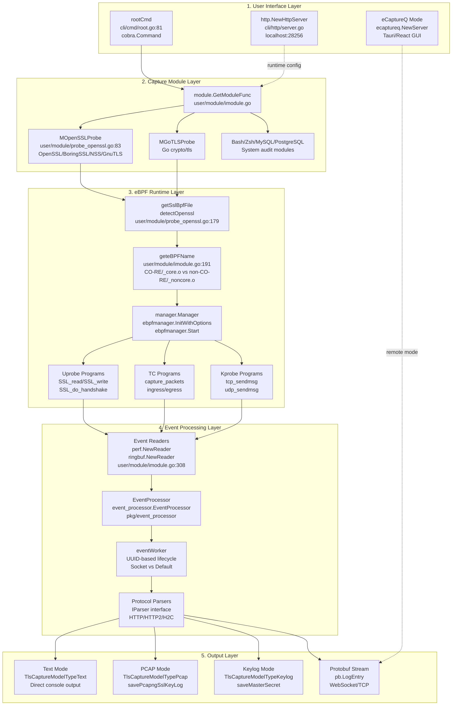

The architecture makes several critical design decisions that enable its functionality:

Sources: [cli/cmd/root.go:80-153](https://github.com/gojue/ecapture/blob/0766a93b/cli/cmd/root.go#L80-L153), [user/module/probe_openssl.go:83-106](https://github.com/gojue/ecapture/blob/0766a93b/user/module/probe_openssl.go#L83-L106), [user/module/imodule.go:47-75](https://github.com/gojue/ecapture/blob/0766a93b/user/module/imodule.go#L47-L75), [user/module/probe_openssl.go:178-278](https://github.com/gojue/ecapture/blob/0766a93b/user/module/probe_openssl.go#L178-L278), [user/module/imodule.go:191-214](https://github.com/gojue/ecapture/blob/0766a93b/user/module/imodule.go#L191-L214)

### Architectural Layers Explained

Each layer has specific responsibilities:

| Layer | Responsibilities | Key Components |
|-------|------------------|----------------|
| **1. User Interface** | Command parsing, configuration input, runtime updates | `rootCmd` (Cobra CLI), HTTP config server, eCaptureQ integration |
| **2. Capture Modules** | Protocol-specific logic, bytecode selection, probe attachment | `IModule` interface, `MOpenSSLProbe`, `MGoTLSProbe`, etc. |
| **3. eBPF Runtime** | Version detection, CO-RE/non-CO-RE selection, eBPF program lifecycle | `manager.Manager`, uprobe/TC/kprobe programs, BTF detection |
| **4. Event Processing** | Event reading, aggregation, protocol parsing, connection tracking | `EventProcessor`, `eventWorker`, `IParser` implementations |
| **5. Output** | Format conversion, file writing, network streaming | Text/PCAP/Keylog/Protobuf writers, PCAP-NG DSB blocks |

See [Module System and Lifecycle](2.4-module-system-and-lifecycle.md) for details on the IModule interface and [Event Processing Pipeline](2.2-event-processing-pipeline.md) for event flow details.

### Key Architectural Decisions

| Decision | Rationale | Implementation |
|----------|-----------|----------------|
| **Factory Pattern for Modules** | Enables dynamic module loading based on CLI command | `IModule` interface [user/module/imodule.go:47-75](https://github.com/gojue/ecapture/blob/0766a93b/user/module/imodule.go#L47-L75); modules register via `RegisteFunc` at package init |
| **Dual Bytecode Compilation** | Supports both BTF-enabled (CO-RE) and non-BTF kernels | Build system produces `*_core.o` and `*_noncore.o` variants; runtime selection via `geteBPFName` [user/module/imodule.go:191-214](https://github.com/gojue/ecapture/blob/0766a93b/user/module/imodule.go#L191-L214) |
| **Version Detection Layer** | Handles 20+ OpenSSL/BoringSSL versions with different struct layouts | `detectOpenssl` [user/module/probe_openssl.go:178-278](https://github.com/gojue/ecapture/blob/0766a93b/user/module/probe_openssl.go#L178-L278) parses ELF `.rodata`, maps version to bytecode via `sslVersionBpfMap` |
| **Event Processing Pipeline** | Decouples capture from output formatting, enables protocol parsing | `EventProcessor` [user/module/imodule.go:104](https://github.com/gojue/ecapture/blob/0766a93b/user/module/imodule.go#L104) aggregates events by UUID, applies HTTP/HTTP2 parsers |
| **Multiple Output Formats** | Supports live analysis (text), forensics (PCAP), decryption (keylog) | `TlsCaptureModelType` enum [user/module/probe_openssl.go:58-76](https://github.com/gojue/ecapture/blob/0766a93b/user/module/probe_openssl.go#L58-L76) controls capture mode |
| **Connection Tracking** | Maps network packets to processes without userspace cooperation | Kprobes populate `network_map` LRU hash; TC hooks lookup PID/UID. See [Network Connection Tracking](2.6-network-connection-tracking.md) |
| **Dual Worker Lifecycle** | Optimizes resource usage for different connection patterns | Socket-based lifecycle for persistent connections, default (10-tick timeout) for short-lived. See [Event Processing Pipeline](2.2-event-processing-pipeline.md) |

Sources: [user/module/imodule.go:47-75](https://github.com/gojue/ecapture/blob/0766a93b/user/module/imodule.go#L47-L75), [user/module/probe_openssl.go:58-76](https://github.com/gojue/ecapture/blob/0766a93b/user/module/probe_openssl.go#L58-L76), [user/module/probe_openssl.go:178-278](https://github.com/gojue/ecapture/blob/0766a93b/user/module/probe_openssl.go#L178-L278), [user/module/imodule.go:191-214](https://github.com/gojue/ecapture/blob/0766a93b/user/module/imodule.go#L191-L214)

## Data Flow Pipeline

The following diagram shows how data flows through the system from application to output:

**Diagram: Complete Data Flow**

```mermaid
graph LR
    App["Monitored Application<br/>curl, browser, etc.<br/>Uses OpenSSL/Go TLS"] --> LibraryCall["Library Call<br/>SSL_write/SSL_read<br/>tls.Conn.Write/Read"]
    
    LibraryCall --> UprobeHook["Uprobe Hook<br/>kernel intercepts<br/>function entry/return"]
    
    UprobeHook --> PlaintextCapture["Plaintext Capture<br/>Before encryption<br/>After decryption"]
    
    PlaintextCapture --> eBPFMap["eBPF Map<br/>perf_event_array<br/>or ring_buffer"]
    
    eBPFMap --> UserSpaceRead["perf.NewReader.Read<br/>user/module/imodule.go:308<br/>goroutine per map"]
    
    UserSpaceRead --> DecodeEvent["Decode Event<br/>child.Decode(map, bytes)<br/>→ IEventStruct"]
    
    DecodeEvent --> Dispatcher["Module.Dispatcher<br/>user/module/imodule.go:409<br/>Route by EventType"]
    
    Dispatcher --> ProcessorQueue{"EventType?"}
    ProcessorQueue -->|TypeEventProcessor| EventProcessor["EventProcessor.Write<br/>Aggregate by UUID"]
    ProcessorQueue -->|TypeOutput| DirectOutput["Direct Output"]
    ProcessorQueue -->|TypeModuleData| ModuleCache["Module Cache<br/>master secrets, tuples"]
    
    EventProcessor --> WorkerPool["eventWorker pool<br/>Parse HTTP/HTTP2<br/>Format output"]
    
    WorkerPool --> FinalOutput["Final Output"]
    DirectOutput --> FinalOutput
    
    FinalOutput --> OutputFormat{"Output Mode"}
    OutputFormat -->|Text| Console["Console/File<br/>zerolog.Logger"]
    OutputFormat -->|PCAP| PcapFile["PCAP-NG File<br/>+ DSB keylog blocks"]
    OutputFormat -->|Keylog| KeylogFile["Keylog File<br/>CLIENT_RANDOM format"]
    OutputFormat -->|Protobuf| WebSocket["WebSocket/TCP<br/>pb.LogEntry messages"]
```

Sources: [user/module/imodule.go:285-391](https://github.com/gojue/ecapture/blob/0766a93b/user/module/imodule.go#L285-L391), [user/module/imodule.go:409-448](https://github.com/gojue/ecapture/blob/0766a93b/user/module/imodule.go#L409-L448), [cli/cmd/root.go:250-403](https://github.com/gojue/ecapture/blob/0766a93b/cli/cmd/root.go#L250-L403)

## User Interface Layer

eCapture provides three interfaces for user interaction: CLI commands, HTTP configuration API, and eCaptureQ GUI integration.

### CLI Entry Point

The CLI uses Cobra command framework. Each subcommand corresponds to a capture module.

**Diagram: CLI Command Structure**

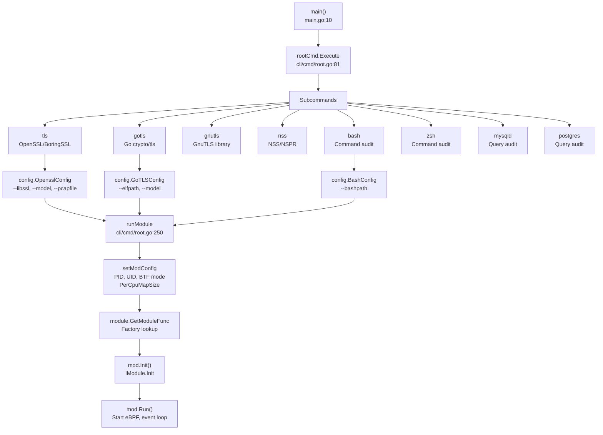

Sources: [main.go:9-11](https://github.com/gojue/ecapture/blob/0766a93b/main.go#L9-L11), [cli/cmd/root.go:80-153](https://github.com/gojue/ecapture/blob/0766a93b/cli/cmd/root.go#L80-L153), [cli/cmd/root.go:250-403](https://github.com/gojue/ecapture/blob/0766a93b/cli/cmd/root.go#L250-L403), [cli/cmd/root.go:156-175](https://github.com/gojue/ecapture/blob/0766a93b/cli/cmd/root.go#L156-L175)

**Persistent Flags** (apply to all modules) [cli/cmd/root.go:140-153](https://github.com/gojue/ecapture/blob/0766a93b/cli/cmd/root.go#L140-L153):

| Flag | Type | Default | Purpose |
|------|------|---------|---------|
| `--pid` / `-p` | uint64 | 0 (all) | Target specific process ID |
| `--uid` / `-u` | uint64 | 0 (all) | Target specific user ID |
| `--btf` / `-b` | uint8 | 0 (auto) | BTF mode: 0=auto, 1=core, 2=non-core |
| `--mapsize` | int | 1024 | eBPF map size per CPU (KB) |
| `--logaddr` / `-l` | string | "" | Log destination: file path, `tcp://host:port`, or `ws://host:port/path` |
| `--eventaddr` | string | "" | Event destination (separate from logs) |
| `--listen` | string | `localhost:28256` | HTTP config server listen address |
| `--tsize` / `-t` | uint64 | 0 | Truncate size in text mode (bytes, 0=no truncate) |
| `--ecaptureq` | string | "" | Listen for eCaptureQ client connections |

### HTTP Configuration Server

An HTTP server runs concurrently to accept runtime configuration updates without restarting.

**Diagram: Runtime Configuration Update**

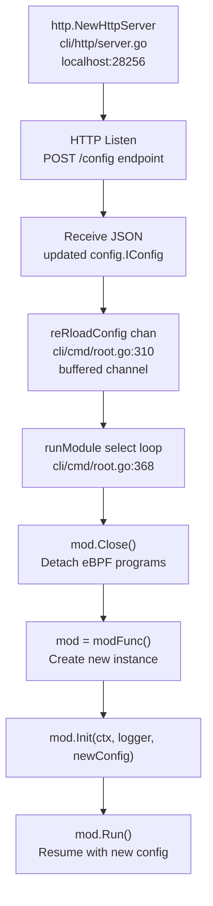

Sources: [cli/cmd/root.go:313-322](https://github.com/gojue/ecapture/blob/0766a93b/cli/cmd/root.go#L313-L322), [cli/cmd/root.go:368-396](https://github.com/gojue/ecapture/blob/0766a93b/cli/cmd/root.go#L368-L396)

The HTTP server enables dynamic reconfiguration. When a POST request with updated configuration JSON arrives, the system:
1. Closes the current module (detaches eBPF programs)
2. Creates a new module instance
3. Initializes with updated configuration
4. Restarts event capture with new settings

See [Configuration System](2.3-configuration-system.md) for configuration structure details and [HTTP API Documentation](https://github.com/gojue/ecapture/blob/0766a93b/docs/remote-config-update-api.md) for API details.

### Output Destinations

eCapture supports multiple output destinations for logs and events:

**Diagram: Output Routing**

```mermaid
graph TB
    initLogger["initLogger()<br/>cli/cmd/root.go:178"] --> CheckAddr{"logaddr flag?"}
    
    CheckAddr -->|""| StdoutOnly["zerolog.ConsoleWriter<br/>os.Stdout only"]
    CheckAddr -->|file path| FileWriter["os.Create(addr)<br/>MultiLevelWriter"]
    CheckAddr -->|tcp://| TCPWriter["net.Dial('tcp', addr)<br/>TCP connection"]
    CheckAddr -->|ws://| WSWriter["ws.NewClient<br/>WebSocket connection"]
    
    FileWriter --> MultiWriter["zerolog.MultiLevelWriter<br/>Console + File/TCP/WS"]
    TCPWriter --> MultiWriter
    WSWriter --> MultiWriter
    
    MultiWriter --> LoggerInstance["zerolog.Logger<br/>Used by modules"]
    StdoutOnly --> LoggerInstance
    
    LoggerInstance --> EventCollector["eventCollector io.Writer<br/>event.CollectorWriter or ecaptureQEventWriter"]
    
    EventCollector --> ModuleInit["mod.Init(ctx, logger, conf, eventCollector)<br/>user/module/imodule.go:111"]
```

Sources: [cli/cmd/root.go:178-247](https://github.com/gojue/ecapture/blob/0766a93b/cli/cmd/root.go#L178-L247), [cli/cmd/root.go:255-295](https://github.com/gojue/ecapture/blob/0766a93b/cli/cmd/root.go#L255-L295)

Output types [cli/cmd/root.go:69-73](https://github.com/gojue/ecapture/blob/0766a93b/cli/cmd/root.go#L69-L73):
- **Stdout** (type 0): Console output only
- **File** (type 1): Write to local file, optionally with rotation via `--eventroratesize` and `--eventroratetime`
- **TCP** (type 2): Stream to `tcp://host:port`
- **WebSocket** (type 3): Stream to `ws://host:port/path` or `wss://` (TLS)

The `eventCollector` receives captured events while the `logger` receives operational logs. They can use the same or different destinations via `--logaddr` and `--eventaddr` flags.

## Capture Module Layer

The module system uses a factory pattern for dynamic module instantiation. Each module implements the `IModule` interface and embeds the base `Module` struct for common functionality.

### Module Factory and Registration

Modules self-register at package initialization time.

**Diagram: Module Factory Pattern**

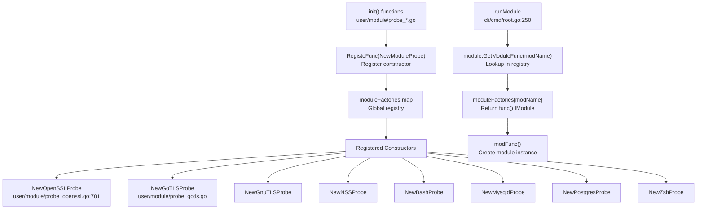

Sources: [user/module/probe_openssl.go:777-786](https://github.com/gojue/ecapture/blob/0766a93b/user/module/probe_openssl.go#L777-L786), [cli/cmd/root.go:344-347](https://github.com/gojue/ecapture/blob/0766a93b/cli/cmd/root.go#L344-L347)

Example registration from OpenSSL module [user/module/probe_openssl.go:777-786](https://github.com/gojue/ecapture/blob/0766a93b/user/module/probe_openssl.go#L777-L786):
```go
func init() {
    RegisteFunc(NewOpenSSLProbe)
}

func NewOpenSSLProbe() IModule {
    mod := &MOpenSSLProbe{}
    mod.name = ModuleNameOpenssl
    mod.mType = ProbeTypeUprobe
    return mod
}
```

The CLI retrieves the constructor via `module.GetModuleFunc(modName)` [cli/cmd/root.go:344](https://github.com/gojue/ecapture/blob/0766a93b/cli/cmd/root.go#L344) and invokes it to create an instance.

### IModule Interface

All modules implement the `IModule` interface [user/module/imodule.go:47-75](https://github.com/gojue/ecapture/blob/0766a93b/user/module/imodule.go#L47-L75), which defines lifecycle and event processing methods.

**IModule Interface Methods**

| Method | Purpose | Phase | Responsibility |
|--------|---------|-------|----------------|
| `Init(context.Context, *zerolog.Logger, config.IConfig, io.Writer)` | Initialize module, setup EventProcessor, BTF detection | Initialization | Base `Module` + child overrides |
| `Start()` | Load eBPF bytecode, attach probes/hooks | Start | Child implements |
| `Run()` | Start event readers, begin processing loop | Run | Base `Module` (calls child.Start) |
| `Events() []*ebpf.Map` | Return eBPF maps to read events from | Run | Child implements |
| `Decode(*ebpf.Map, []byte) (event.IEventStruct, error)` | Parse raw event bytes into struct | Event Processing | Base delegates to child.DecodeFun |
| `DecodeFun(*ebpf.Map) (event.IEventStruct, bool)` | Return decoder for specific map | Event Processing | Child implements |
| `Dispatcher(event.IEventStruct)` | Route events (cache, process, output) | Event Processing | Base + child both implement |
| `Close()` | Stop eBPF programs, cleanup resources | Shutdown | Base + child both implement |

See [Module System and Lifecycle](2.4-module-system-and-lifecycle.md) for detailed lifecycle information.

Sources: [user/module/imodule.go:47-75](https://github.com/gojue/ecapture/blob/0766a93b/user/module/imodule.go#L47-L75), [user/module/imodule.go:110-171](https://github.com/gojue/ecapture/blob/0766a93b/user/module/imodule.go#L110-L171)

### Base Module Implementation

The `Module` struct [user/module/imodule.go:83-108](https://github.com/gojue/ecapture/blob/0766a93b/user/module/imodule.go#L83-L108) provides common functionality that all probes inherit through embedding.

**Diagram: Module Struct Composition**

```mermaid
graph TB
    BaseModule["Module struct<br/>user/module/imodule.go:83<br/>Embedded by all probes"] --> CoreFields["Core Fields"]
    BaseModule --> CoreMethods["Core Methods"]
    
    CoreFields --> ctx["ctx context.Context<br/>Cancellation signal"]
    CoreFields --> logger["logger *zerolog.Logger<br/>Logging interface"]
    CoreFields --> conf["conf config.IConfig<br/>Module configuration"]
    CoreFields --> processor["processor *EventProcessor<br/>pkg/event_processor"]
    CoreFields --> reader["reader []IClose<br/>perf/ringbuf readers"]
    CoreFields --> child["child IModule<br/>Actual probe (e.g., MOpenSSLProbe)"]
    CoreFields --> eventCollector["eventCollector io.Writer<br/>Output destination"]
    CoreFields --> flags["isCoreUsed bool<br/>isKernelLess5_2 bool"]
    
    CoreMethods --> InitMethod["Init()<br/>BTF detection<br/>EventProcessor setup<br/>user/module/imodule.go:111"]
    CoreMethods --> RunMethod["Run()<br/>Start child.Start()<br/>readEvents()<br/>user/module/imodule.go:236"]
    CoreMethods --> readEvents["readEvents()<br/>perfEventReader<br/>ringbufEventReader<br/>user/module/imodule.go:285"]
    CoreMethods --> DecodeMethod["Decode()<br/>Delegates to child.DecodeFun<br/>user/module/imodule.go:393"]
    CoreMethods --> DispatcherMethod["Dispatcher()<br/>Routes events<br/>user/module/imodule.go:409"]
    CoreMethods --> CloseMethod["Close()<br/>Cleanup readers<br/>user/module/imodule.go:450"]
    
    ProbeModules["Probe Modules"] --> MOpenSSL["MOpenSSLProbe<br/>user/module/probe_openssl.go:83<br/>embeds Module"]
    ProbeModules --> MGoTLS["MGoTLSProbe<br/>embeds Module"]
    ProbeModules --> MGnuTLS["MGnuTLSProbe<br/>embeds Module"]
    ProbeModules --> MBash["MBashProbe<br/>embeds Module"]
    
    MOpenSSL --> ImplStart["Implements Start()<br/>setupManagers*<br/>Load eBPF bytecode"]
    MOpenSSL --> ImplEvents["Implements Events()<br/>Returns event maps"]
    MOpenSSL --> ImplDecodeFun["Implements DecodeFun()<br/>Map → event struct type"]
    MOpenSSL --> ImplDispatcher["Implements Dispatcher()<br/>saveMasterSecret<br/>AddConn/DelConn"]
```

Sources: [user/module/imodule.go:83-108](https://github.com/gojue/ecapture/blob/0766a93b/user/module/imodule.go#L83-L108), [user/module/probe_openssl.go:83-106](https://github.com/gojue/ecapture/blob/0766a93b/user/module/probe_openssl.go#L83-L106)

**Base Module Responsibilities** [user/module/imodule.go:83-460](https://github.com/gojue/ecapture/blob/0766a93b/user/module/imodule.go#L83-L460):

1. **BTF Detection**: `autoDetectBTF()` checks `/sys/kernel/btf/vmlinux` and container environment [user/module/imodule.go:173-190](https://github.com/gojue/ecapture/blob/0766a93b/user/module/imodule.go#L173-L190)
2. **Bytecode Selection**: `geteBPFName()` appends `_core.o`/`_noncore.o` and `_less52.o` suffixes [user/module/imodule.go:191-214](https://github.com/gojue/ecapture/blob/0766a93b/user/module/imodule.go#L191-L214)
3. **Event Readers**: `perfEventReader()` and `ringbufEventReader()` setup goroutines per eBPF map [user/module/imodule.go:308-391](https://github.com/gojue/ecapture/blob/0766a93b/user/module/imodule.go#L308-L391)
4. **EventProcessor**: Initialized with truncate size and hex mode [user/module/imodule.go:127](https://github.com/gojue/ecapture/blob/0766a93b/user/module/imodule.go#L127)
5. **Output Routing**: Detects `eventCollector` type to select text vs protobuf encoding [user/module/imodule.go:122-126](https://github.com/gojue/ecapture/blob/0766a93b/user/module/imodule.go#L122-L126), [user/module/imodule.go:461-479](https://github.com/gojue/ecapture/blob/0766a93b/user/module/imodule.go#L461-L479)
6. **Lifecycle Management**: Coordinates child module's lifecycle through `Start()`, `Run()`, `Close()` [user/module/imodule.go:236-262](https://github.com/gojue/ecapture/blob/0766a93b/user/module/imodule.go#L236-L262)

### Module-Specific Implementations

Each probe module embeds `Module` and adds module-specific state and logic. See [Capture Modules](../3-capture-modules/index.md) for detailed implementation information.

**Key Module Types**

| Module | Purpose | Target Libraries/Binaries | Key State | See Also |
|--------|---------|---------------------------|-----------|----------|
| `MOpenSSLProbe` | TLS plaintext capture | libssl.so, libcrypto.so, BoringSSL | `sslVersionBpfMap`, `pidConns`, `masterKeys`, `eBPFProgramType` | [OpenSSL Module](../3-capture-modules/3.1.1-openssl-module.md) |
| `MGoTLSProbe` | Go TLS plaintext capture | Go binaries (crypto/tls) | `isRegisterABI`, `tcPacketsChan`, `keylogger` | [Go TLS Module](../3-capture-modules/3.1.2-go-tls-module.md) |
| `MGnuTLSProbe` | GnuTLS plaintext capture | libgnutls.so | `keylogger`, `masterKeys` | [GnuTLS and NSS Modules](../3-capture-modules/3.1.3-gnutls-and-nss-modules.md) |
| `MNSSProbe` | NSS/NSPR plaintext capture | libnss3.so, libnspr4.so | Master secret extraction | [GnuTLS and NSS Modules](../3-capture-modules/3.1.3-gnutls-and-nss-modules.md) |
| `MBashProbe` | Bash command audit | bash binary | Command filtering via readline hooks | [Shell Command Auditing](../3-capture-modules/3.2.1-shell-command-auditing.md) |
| `MZshProbe` | Zsh command audit | zsh binary | Command filtering via zle hooks | [Shell Command Auditing](../3-capture-modules/3.2.1-shell-command-auditing.md) |
| `MMysqldProbe` | MySQL query audit | mysqld binary | `funcName`, SQL extraction from dispatch_command | [Database Query Auditing](../3-capture-modules/3.2.2-database-query-auditing.md) |
| `MPostgresProbe` | PostgreSQL query audit | postgres binary | Query extraction from exec_simple_query | [Database Query Auditing](../3-capture-modules/3.2.2-database-query-auditing.md) |

Sources: [user/module/probe_openssl.go:83-106](https://github.com/gojue/ecapture/blob/0766a93b/user/module/probe_openssl.go#L83-L106)

**Example: MOpenSSLProbe State** [user/module/probe_openssl.go:83-106](https://github.com/gojue/ecapture/blob/0766a93b/user/module/probe_openssl.go#L83-L106):

| Field | Type | Purpose |
|-------|------|---------|
| `pidConns` | `map[uint32]map[uint32]ConnInfo` | Maps PID → FD → connection tuple and socket [user/module/probe_openssl.go:91]() |
| `sock2pidFd` | `map[uint64][2]uint32` | Reverse map: socket → [PID, FD] for connection cleanup [user/module/probe_openssl.go:93]() |
| `masterKeys` | `map[string]bool` | Deduplicates TLS master secrets by client random [user/module/probe_openssl.go:98]() |
| `sslVersionBpfMap` | `map[string]string` | Maps SSL version string to bytecode filename [user/module/probe_openssl.go:101]() |
| `eBPFProgramType` | `TlsCaptureModelType` | Determines capture mode (Text/Pcap/Keylog) [user/module/probe_openssl.go:99](https://github.com/gojue/ecapture/blob/0766a93b/user/module/probe_openssl.go#L99) |
| `keylogger` | `*os.File` | File handle for keylog mode output [user/module/probe_openssl.go:96](https://github.com/gojue/ecapture/blob/0766a93b/user/module/probe_openssl.go#L96) |
| `bpfManager` | `*manager.Manager` | eBPF program lifecycle manager [user/module/probe_openssl.go:85](https://github.com/gojue/ecapture/blob/0766a93b/user/module/probe_openssl.go#L85) |

These maps enable correlation between SSL data events (identified by PID/FD) and network tuples captured by TC hooks. See [Version Detection and Bytecode Selection](2.5-version-detection-and-bytecode-selection.md) for `sslVersionBpfMap` usage and [Network Connection Tracking](2.6-network-connection-tracking.md) for connection mapping details.

## eBPF Runtime Layer

The eBPF runtime layer bridges userspace modules with kernel-space instrumentation. It handles version detection, bytecode selection, and eBPF program lifecycle through the `ebpfmanager` library.

For comprehensive details on eBPF programs and hooks, see [eBPF Engine](2.1-ebpf-engine.md). For version detection algorithms, see [Version Detection and Bytecode Selection](2.5-version-detection-and-bytecode-selection.md).

### Overview of eBPF Runtime Components

**Diagram: eBPF Runtime Components**

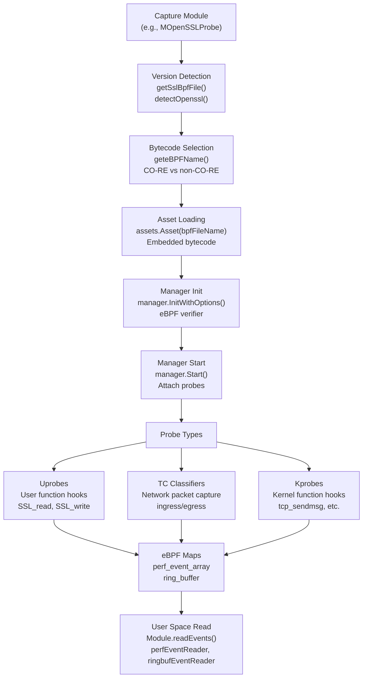

Sources: [user/module/probe_openssl.go:178-278](https://github.com/gojue/ecapture/blob/0766a93b/user/module/probe_openssl.go#L178-L278), [user/module/imodule.go:191-214](https://github.com/gojue/ecapture/blob/0766a93b/user/module/imodule.go#L191-L214), [user/module/probe_openssl.go:312-331](https://github.com/gojue/ecapture/blob/0766a93b/user/module/probe_openssl.go#L312-L331), [user/module/imodule.go:285-391](https://github.com/gojue/ecapture/blob/0766a93b/user/module/imodule.go#L285-L391)

The runtime layer performs these operations:

1. **Version Detection**: Determine target library version (see [Version Detection and Bytecode Selection](2.5-version-detection-and-bytecode-selection.md))
2. **Bytecode Selection**: Choose CO-RE or non-CO-RE bytecode based on BTF availability
3. **Asset Loading**: Load embedded bytecode from `assets` package
4. **eBPF Verification**: Kernel verifies program safety
5. **Probe Attachment**: Attach uprobes, TC classifiers, kprobes
6. **Event Reading**: Setup readers for eBPF maps

### BTF Detection and Bytecode Selection

eCapture compiles two variants of each eBPF program: **CO-RE** (BTF-enabled, kernel >= 5.2) and **non-CO-RE** (traditional, all kernels). Runtime selection is based on kernel BTF support.

**Diagram: BTF Detection and Bytecode Mode Selection**

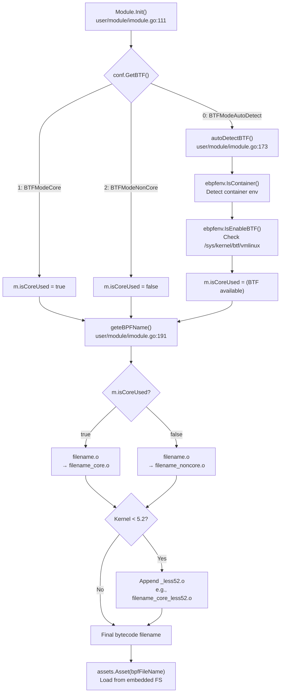

Sources: [user/module/imodule.go:154-170](https://github.com/gojue/ecapture/blob/0766a93b/user/module/imodule.go#L154-L170), [user/module/imodule.go:173-190](https://github.com/gojue/ecapture/blob/0766a93b/user/module/imodule.go#L173-L190), [user/module/imodule.go:191-214](https://github.com/gojue/ecapture/blob/0766a93b/user/module/imodule.go#L191-L214)

**BTF Detection Logic** [user/module/imodule.go:173-190](https://github.com/gojue/ecapture/blob/0766a93b/user/module/imodule.go#L173-L190):
1. Check if running in container (BTF detection may be unreliable in containers)
2. Look for `/sys/kernel/btf/vmlinux` file to confirm BTF support
3. Set `m.isCoreUsed` flag based on detection result

**Filename Transformation Examples** [user/module/imodule.go:191-214](https://github.com/gojue/ecapture/blob/0766a93b/user/module/imodule.go#L191-L214):
- `openssl_3_0_0_kern.o` → `openssl_3_0_0_kern_core.o` (BTF kernel >= 5.2)
- `openssl_3_0_0_kern.o` → `openssl_3_0_0_kern_noncore.o` (non-BTF kernel >= 5.2)
- `openssl_3_0_0_kern.o` → `openssl_3_0_0_kern_core_less52.o` (BTF kernel < 5.2)
- `openssl_3_0_0_kern.o` → `openssl_3_0_0_kern_noncore_less52.o` (non-BTF kernel < 5.2)

CO-RE bytecode uses BTF type information for structure layout resolution at load time, enabling **Compile Once - Run Everywhere**. Non-CO-RE bytecode has hardcoded offsets for specific kernel versions. See [Build System](../5-development-guide/5.1-build-system.md) for compilation details.

### eBPF Program Lifecycle

The `ebpfmanager.Manager` [user/module/probe_openssl.go:85](https://github.com/gojue/ecapture/blob/0766a93b/user/module/probe_openssl.go#L85) manages eBPF program loading, verification, attachment, and cleanup.

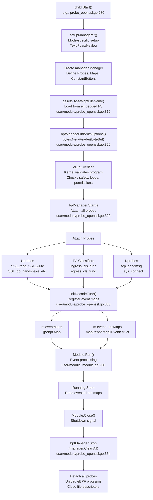

Sources: [user/module/probe_openssl.go:280-357](https://github.com/gojue/ecapture/blob/0766a93b/user/module/probe_openssl.go#L280-L357), [user/module/imodule.go:236-262](https://github.com/gojue/ecapture/blob/0766a93b/user/module/imodule.go#L236-L262)

**Lifecycle Phases**:

1. **Setup**: `Start()` calls mode-specific setup (`setupManagersText`, `setupManagersPcap`, `setupManagersKeylog`)
2. **Bytecode Load**: `assets.Asset(bpfFileName)` retrieves embedded bytecode [user/module/probe_openssl.go:312-317](https://github.com/gojue/ecapture/blob/0766a93b/user/module/probe_openssl.go#L312-L317)
3. **Initialization**: `bpfManager.InitWithOptions()` loads bytecode, kernel verifies program [user/module/probe_openssl.go:320-326](https://github.com/gojue/ecapture/blob/0766a93b/user/module/probe_openssl.go#L320-L326)
4. **Attachment**: `bpfManager.Start()` attaches uprobes/TC/kprobes [user/module/probe_openssl.go:329-331](https://github.com/gojue/ecapture/blob/0766a93b/user/module/probe_openssl.go#L329-L331)
5. **Map Registration**: `initDecodeFun*()` populates `eventMaps` and `eventFuncMaps` [user/module/probe_openssl.go:333-348](https://github.com/gojue/ecapture/blob/0766a93b/user/module/probe_openssl.go#L333-L348)
6. **Running**: Base `Module.Run()` spawns event readers and EventProcessor [user/module/imodule.go:236-262](https://github.com/gojue/ecapture/blob/0766a93b/user/module/imodule.go#L236-L262)
7. **Shutdown**: `bpfManager.Stop(manager.CleanAll)` detaches and cleans up [user/module/probe_openssl.go:352-357](https://github.com/gojue/ecapture/blob/0766a93b/user/module/probe_openssl.go#L352-L357)

### Configuration Injection via Constant Editors

eBPF programs define constant variables that are rewritten at load time to inject runtime configuration (PID, UID filters).

**Constant Editor Mechanism**

| Constant Name | Purpose | Type | Value Source | Effect |
|---------------|---------|------|--------------|--------|
| `target_pid` | Filter by process ID | `uint64` | `conf.GetPid()` | 0 = capture all PIDs, non-zero = specific PID only |
| `target_uid` | Filter by user ID | `uint64` | `conf.GetUid()` | 0 = capture all UIDs, non-zero = specific UID only |

Sources: [user/module/probe_openssl.go:361-387](https://github.com/gojue/ecapture/blob/0766a93b/user/module/probe_openssl.go#L361-L387)

The `constantEditor()` method [user/module/probe_openssl.go:361-387](https://github.com/gojue/ecapture/blob/0766a93b/user/module/probe_openssl.go#L361-L387) returns a slice of `manager.ConstantEditor` structs. The eBPF manager rewrites these constants in the bytecode **before** loading into the kernel. This enables parameterized filtering without recompiling eBPF programs.

For kernels < 5.2, global variable support is limited. The `EnableGlobalVar()` check [user/config/iconfig.go:194-203](https://github.com/gojue/ecapture/blob/0766a93b/user/config/iconfig.go#L194-L203) returns false, disabling certain features.

### Uprobe Attachments

Uprobes instrument user-space library functions to capture plaintext data before/after encryption.

**Diagram: Uprobe Hook Points**

```mermaid
graph TB
    subgraph "OpenSSL/BoringSSL Uprobes"
        SSLRead["uprobe/SSL_read<br/>uprobe/SSL_read_ex<br/>capture received plaintext"]
        SSLWrite["uprobe/SSL_write<br/>uprobe/SSL_write_ex<br/>capture sent plaintext"]
        SSLHandshake["uprobe/SSL_do_handshake<br/>capture TLS handshake"]
        SSLGetWbio["uprobe/SSL_get_wbio<br/>extract BIO file descriptor"]
    end
    
    subgraph "Go TLS Uprobes"
        GoTLSWrite["uprobe/crypto/tls.(*Conn).Write<br/>capture sent plaintext"]
        GoTLSRead["uprobe/crypto/tls.(*Conn).Read<br/>capture received plaintext"]
    end
    
    subgraph "Bash Uprobes"
        Readline["uprobe/readline<br/>capture shell commands"]
    end
    
    subgraph "MySQL Uprobes"
        DispatchCommand["uprobe/dispatch_command<br/>capture SQL queries"]
    end
    
    SSLRead --> SSLDataEvent["SSLDataEvent<br/>events map"]
    SSLWrite --> SSLDataEvent
    SSLHandshake --> MasterSecretEvent["MasterSecretEvent<br/>mastersecret_events map"]
    SSLGetWbio --> ConnDataEvent["ConnDataEvent<br/>connection tracking"]
    
    GoTLSWrite --> GoTLSDataEvent["TLS event struct"]
    GoTLSRead --> GoTLSDataEvent
    
    Readline --> BashEvent["Bash command event"]
    DispatchCommand --> MySQLEvent["MySQL query event"]
```

Sources: [user/module/probe_openssl.go:85-96](https://github.com/gojue/ecapture/blob/0766a93b/user/module/probe_openssl.go#L85-L96)

Each uprobe captures function arguments and return values from target library functions. For OpenSSL, key hooks include:
- `SSL_read` / `SSL_read_ex`: Intercepts plaintext after decryption
- `SSL_write` / `SSL_write_ex`: Intercepts plaintext before encryption  
- `SSL_do_handshake`: Captures TLS handshake for master secret extraction
- `SSL_get_wbio`: Extracts BIO structure to get socket file descriptor

### TC (Traffic Control) Hooks

TC classifier programs attach to network interfaces to capture encrypted packets with network metadata.

**Diagram: TC Hook Architecture**

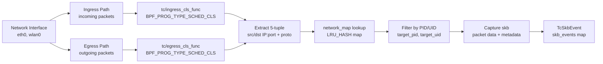

Sources: TC hooks capture complete packets including:
- Ethernet, IP, and TCP/UDP headers
- Encrypted TLS payload
- 5-tuple (source IP:port, dest IP:port, protocol)
- Timestamp and packet length

The TC programs lookup the network tuple in `network_map` to determine which process owns the connection, enabling process-level filtering even for encrypted traffic.

### Kprobe Attachments

Kprobes hook kernel functions to build network context mappings that correlate packets with processes.

**Diagram: Kprobe Context Tracking**

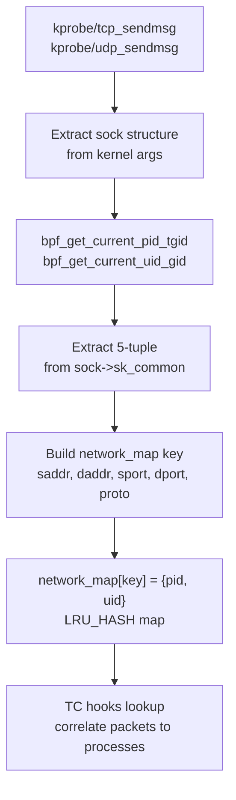

Sources: Kprobes populate the `network_map` LRU hash map with entries mapping network 5-tuples to process identifiers. This enables TC hooks to:
1. Capture encrypted packets at the network layer
2. Look up which process owns the connection
3. Filter packets based on target PID/UID
4. Associate captured packets with the correct capture session

### eBPF Map Types

Different map types serve different purposes in the data pipeline.

**Map Type Summary**

| Map Type | Purpose | Examples |
|----------|---------|----------|
| `BPF_MAP_TYPE_PERF_EVENT_ARRAY` | Stream events to userspace | `events`, `mastersecret_events`, `skb_events` |
| `BPF_MAP_TYPE_RINGBUF` | High-performance event streaming (kernel >= 5.8) | Alternative to perf arrays |
| `BPF_MAP_TYPE_LRU_HASH` | Connection tracking with automatic eviction | `network_map`, `pidConns`, `sock2pidFd` |
| `BPF_MAP_TYPE_ARRAY` | Configuration and constants | `target_pid`, `target_uid` |
| `BPF_MAP_TYPE_HASH` | General key-value storage | Various module-specific maps |

Sources: [user/module/imodule.go:294-306](https://github.com/gojue/ecapture/blob/0766a93b/user/module/imodule.go#L294-L306)

## Event Processing Pipeline

Once events are captured in kernel space, they flow through userspace processing to produce formatted output.

### Event Reading from eBPF Maps

The base `Module` struct sets up readers for each eBPF map based on its type.

**Diagram: Event Reader Setup**

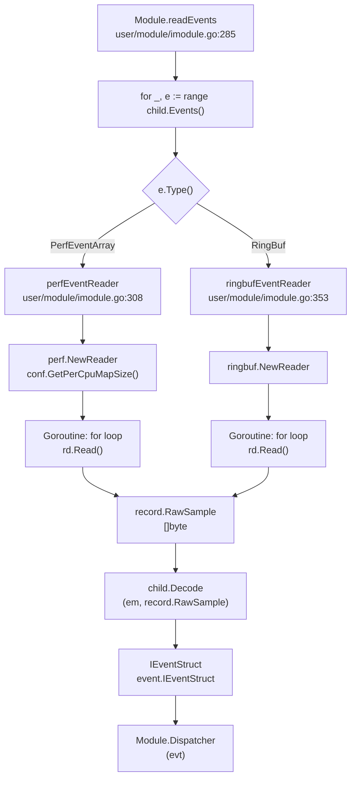

Sources: [user/module/imodule.go:285-391](https://github.com/gojue/ecapture/blob/0766a93b/user/module/imodule.go#L285-L391)

The event reading process [user/module/imodule.go:285-391](https://github.com/gojue/ecapture/blob/0766a93b/user/module/imodule.go#L285-L391):

1. **Map Iteration**: Call `child.Events()` to get list of eBPF maps to read
2. **Reader Creation**: Create appropriate reader (perf or ringbuf) based on map type
3. **Goroutine Per Map**: Spawn goroutine for each map to read events concurrently
4. **Read Loop**: Continuously call `rd.Read()` to fetch raw event bytes
5. **Decode**: Call `child.Decode(em, rawBytes)` to parse into `IEventStruct`
6. **Dispatch**: Route event via `Module.Dispatcher(evt)`

The perf event reader [user/module/imodule.go:308-351](https://github.com/gojue/ecapture/blob/0766a93b/user/module/imodule.go#L308-L351) creates a buffer of configurable size (via `--mapsize` flag) per CPU core. Lost samples are logged when the buffer fills.

### Event Decoding

Each module implements its own `Decode` method that parses raw bytes into structured events.

**Diagram: Decode Function Dispatch**

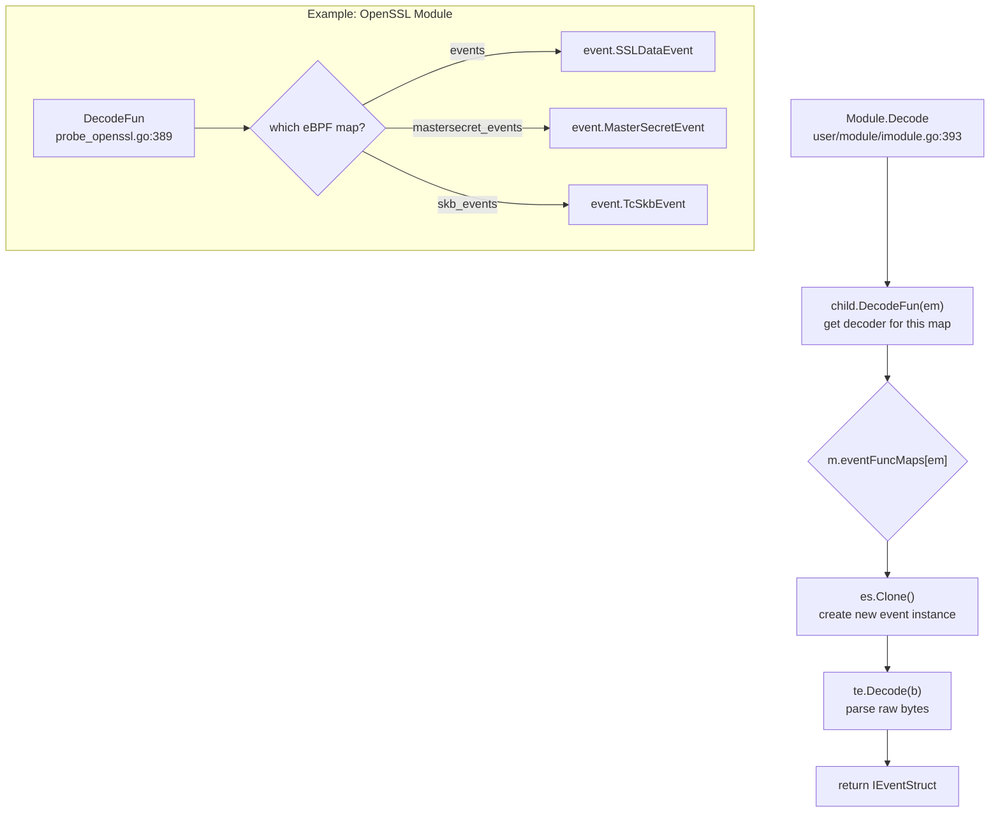

Sources: [user/module/imodule.go:393-406](https://github.com/gojue/ecapture/blob/0766a93b/user/module/imodule.go#L393-L406), [user/module/probe_openssl.go:389-392](https://github.com/gojue/ecapture/blob/0766a93b/user/module/probe_openssl.go#L389-L392)

The decode process:
1. Module's `DecodeFun` returns the appropriate event struct type for a given eBPF map
2. Call `es.Clone()` to create a new instance of the event struct
3. Call `te.Decode(b)` which uses `encoding/binary` to parse the raw bytes
4. Return the populated `IEventStruct`

Each event type implements the `IEventStruct` interface which defines `Decode([]byte) error`, `Clone() IEventStruct`, `EventType()`, and output methods.

### Event Dispatcher and Routing

The `Dispatcher` method routes decoded events to appropriate handlers based on event type.

**Diagram: Event Routing Logic**

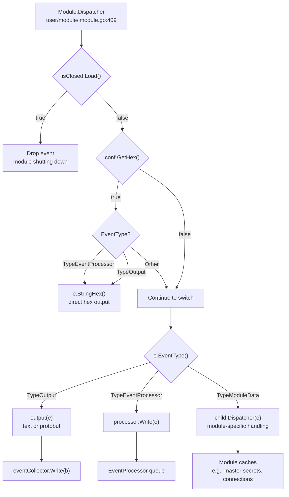

Sources: [user/module/imodule.go:409-448](https://github.com/gojue/ecapture/blob/0766a93b/user/module/imodule.go#L409-L448)

The dispatcher [user/module/imodule.go:409-448](https://github.com/gojue/ecapture/blob/0766a93b/user/module/imodule.go#L409-L448) implements three routing paths:

1. **TypeOutput**: Events ready for direct output (e.g., parsed HTTP requests/responses)
   - Encoded as text or protobuf based on `eventOutputType` [user/module/imodule.go:461-479](https://github.com/gojue/ecapture/blob/0766a93b/user/module/imodule.go#L461-L479)
   - Written directly to `eventCollector` (logger or WebSocket)

2. **TypeEventProcessor**: Events needing further processing (e.g., SSL data fragments)
   - Sent to `EventProcessor` for aggregation and protocol parsing
   - `processor.Write(e)` queues event for worker processing

3. **TypeModuleData**: Events containing metadata (e.g., master secrets, connections)
   - Routed to child module's `Dispatcher` for module-specific handling
   - OpenSSL module saves master secrets [user/module/probe_openssl.go:733-754](https://github.com/gojue/ecapture/blob/0766a93b/user/module/probe_openssl.go#L733-L754)
   - Connection info cached for tuple resolution [user/module/probe_openssl.go:398-416](https://github.com/gojue/ecapture/blob/0766a93b/user/module/probe_openssl.go#L398-L416)

### EventProcessor and Worker Lifecycle

The `EventProcessor` aggregates fragmented events by connection and applies protocol-aware parsing.

**Diagram: EventProcessor Architecture**

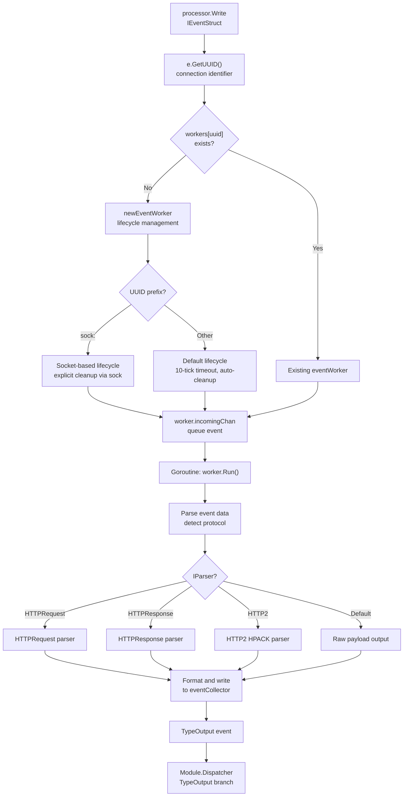

Sources: The `EventProcessor` manages a pool of `eventWorker` goroutines, each responsible for a specific connection UUID. Workers implement two lifecycle models:

1. **Default Lifecycle**: Auto-cleanup after 10 idle ticks (no events received)
2. **Socket Lifecycle**: Persists until explicit cleanup via socket destruction

Each worker maintains a queue and processes events sequentially to preserve ordering. Protocol parsers detect HTTP/1.1, HTTP/2, and other protocols, applying format-specific decoding (e.g., HPACK decompression for HTTP/2).

## Configuration and Capture Modes

eCapture supports multiple capture modes that determine how data is processed and output.

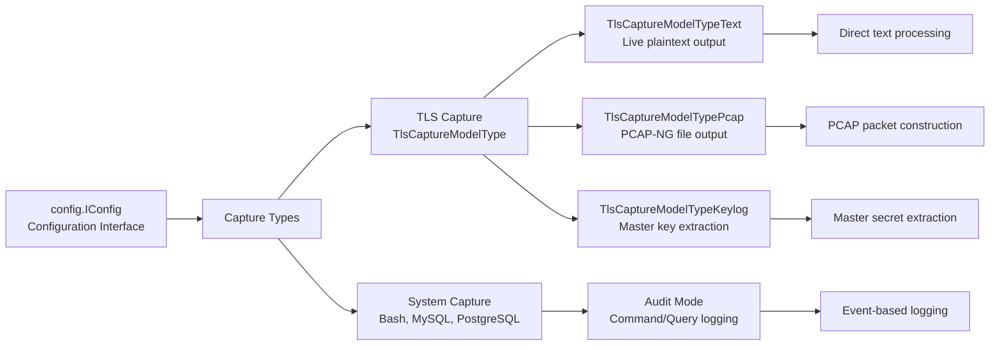

Sources: [user/module/probe_openssl.go:58-76](https://github.com/gojue/ecapture/blob/0766a93b/user/module/probe_openssl.go#L58-L76), [user/module/probe_openssl.go:127-154](https://github.com/gojue/ecapture/blob/0766a93b/user/module/probe_openssl.go#L127-L154)

## Module Lifecycle

Each module follows a standardized lifecycle managed by the base `Module` struct and implemented by specific probes.

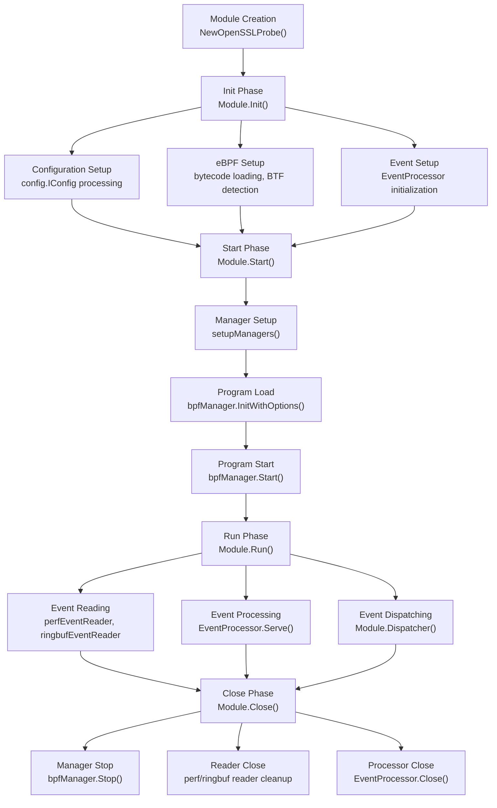

Sources: [user/module/imodule.go:99-152](https://github.com/gojue/ecapture/blob/0766a93b/user/module/imodule.go#L99-L152), [user/module/imodule.go:218-244](https://github.com/gojue/ecapture/blob/0766a93b/user/module/imodule.go#L218-L244), [user/module/probe_openssl.go:285-355](https://github.com/gojue/ecapture/blob/0766a93b/user/module/probe_openssl.go#L285-L355), [user/module/imodule.go:430-440](https://github.com/gojue/ecapture/blob/0766a93b/user/module/imodule.go#L430-L440)