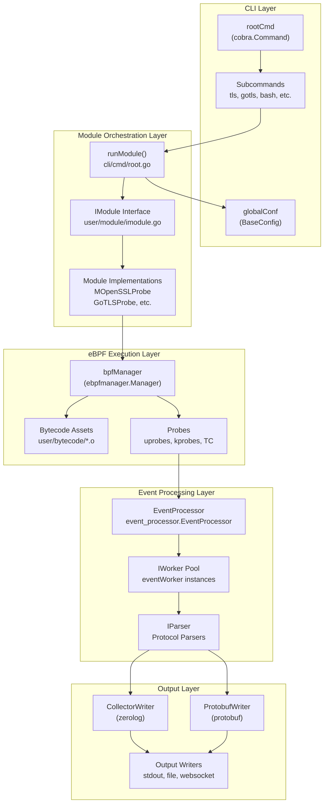
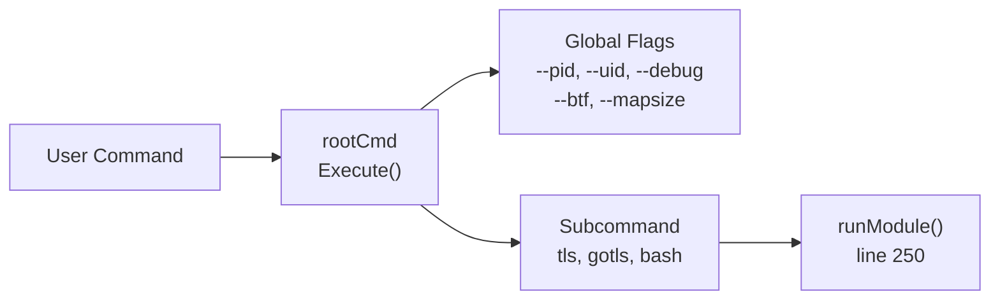
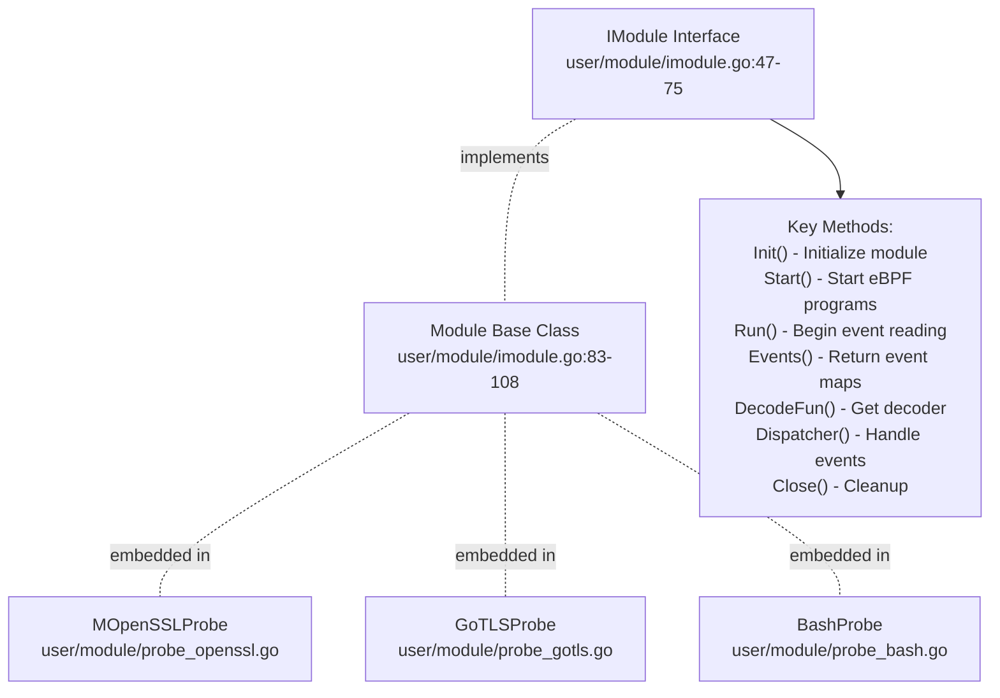
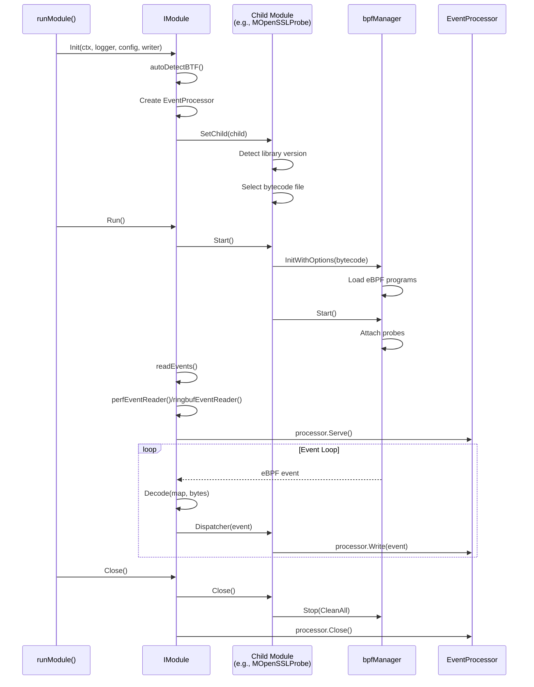
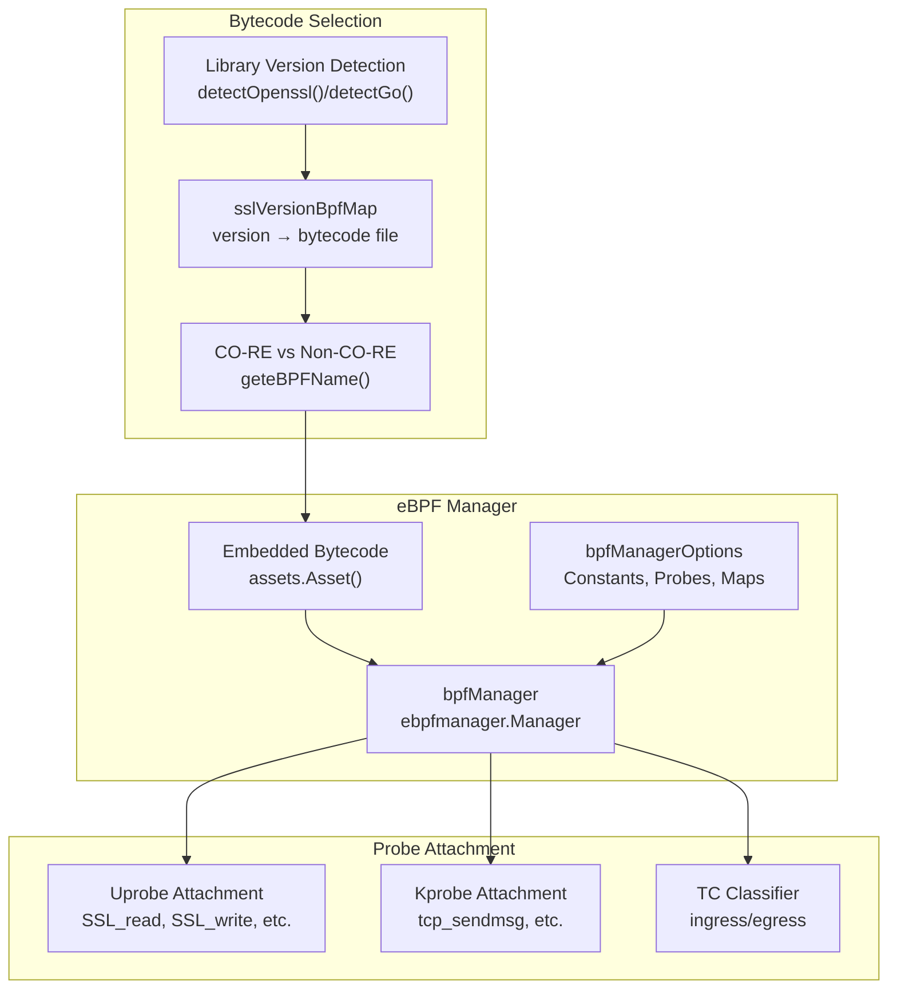
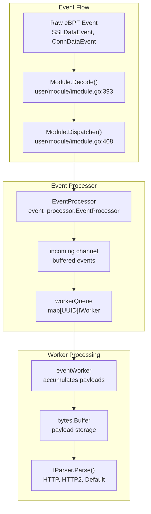
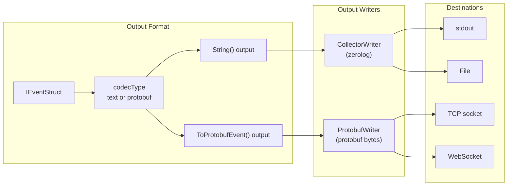

# Architecture

<details>
<summary>Relevant source files</summary>

The following files were used as context for generating this wiki page:

- [CHANGELOG.md](https://github.com/gojue/ecapture/blob/ca085d05/CHANGELOG.md)
- [README.md](https://github.com/gojue/ecapture/blob/ca085d05/README.md)
- [README_CN.md](https://github.com/gojue/ecapture/blob/ca085d05/README_CN.md)
- [cli/cmd/root.go](https://github.com/gojue/ecapture/blob/ca085d05/cli/cmd/root.go)
- [images/ecapture-help-v0.8.9.svg](https://github.com/gojue/ecapture/blob/ca085d05/images/ecapture-help-v0.8.9.svg)
- [main.go](https://github.com/gojue/ecapture/blob/ca085d05/main.go)
- [user/config/iconfig.go](https://github.com/gojue/ecapture/blob/ca085d05/user/config/iconfig.go)
- [user/module/imodule.go](https://github.com/gojue/ecapture/blob/ca085d05/user/module/imodule.go)
- [user/module/probe_openssl.go](https://github.com/gojue/ecapture/blob/ca085d05/user/module/probe_openssl.go)

</details>


This document describes the overall architecture of eCapture, explaining how the system is structured into layers and how data flows from the command-line interface through eBPF probes to final output. The architecture follows a five-layer design: **CLI Layer → Module Orchestration → eBPF Execution → Event Processing → Output**.

For details on specific capture modules (OpenSSL, GoTLS, etc.), see [Capture Modules](../3-capture-modules/index.md). For information about the eBPF implementation, see [eBPF Engine](2.1-ebpf-engine.md). For event processing internals, see [Event Processing Pipeline](2.2-event-processing-pipeline.md).

---

## System Overview

eCapture is organized as a modular eBPF-based capture system. The architecture separates concerns into distinct layers, allowing new capture modules to be added without modifying core infrastructure. Each module implements the `IModule` interface and manages its own eBPF programs, while sharing common event processing and output mechanisms.

**Sources:** [README.md:36-44](https://github.com/gojue/ecapture/blob/ca085d05/README.md#L36-L44), [cli/cmd/root.go:44-51](https://github.com/gojue/ecapture/blob/ca085d05/cli/cmd/root.go#L44-L51), [user/module/imodule.go:47-75](https://github.com/gojue/ecapture/blob/ca085d05/user/module/imodule.go#L47-L75)

---

## Five-Layer Architecture


```mermaid
graph TB
    subgraph CLI["CLI Layer"]
        RootCmd["rootCmd<br/>(cobra.Command)"]
        SubCommands["Subcommands<br/>tls, gotls, bash, etc."]
        GlobalConf["globalConf<br/>(BaseConfig)"]
    end
    
    subgraph ModuleOrch["Module Orchestration Layer"]
        RunModule["runModule()<br/>cli/cmd/root.go"]
        IModule["IModule Interface<br/>user/module/imodule.go"]
        ModuleImpl["Module Implementations<br/>MOpenSSLProbe<br/>GoTLSProbe, etc."]
    end
    
    subgraph eBPFExec["eBPF Execution Layer"]
        BPFManager["bpfManager<br/>(ebpfmanager.Manager)"]
        BytecodeAssets["Bytecode Assets<br/>user/bytecode/*.o"]
        Probes["Probes<br/>uprobes, kprobes, TC"]
    end
    
    subgraph EventProc["Event Processing Layer"]
        EventProcessor["EventProcessor<br/>event_processor.EventProcessor"]
        IWorker["IWorker Pool<br/>eventWorker instances"]
        IParser["IParser<br/>Protocol Parsers"]
    end
    
    subgraph Output["Output Layer"]
        CollectorWriter["CollectorWriter<br/>(zerolog)"]
        ProtobufWriter["ProtobufWriter<br/>(protobuf)"]
        Writers["Output Writers<br/>stdout, file, websocket"]
    end
    
    RootCmd --> SubCommands
    SubCommands --> RunModule
    RunModule --> GlobalConf
    RunModule --> IModule
    IModule --> ModuleImpl
    
    ModuleImpl --> BPFManager
    BPFManager --> BytecodeAssets
    BPFManager --> Probes
    
    Probes --> EventProcessor
    EventProcessor --> IWorker
    IWorker --> IParser
    
    IParser --> CollectorWriter
    IParser --> ProtobufWriter
    CollectorWriter --> Writers
    ProtobufWriter --> Writers
```

**Architecture Overview: Five distinct layers with clear separation of concerns**

The architecture consists of five primary layers:

1. **CLI Layer**: Parses commands and flags, manages configuration
2. **Module Orchestration Layer**: Implements the `IModule` interface pattern, coordinates module lifecycle
3. **eBPF Execution Layer**: Loads and manages eBPF programs, attaches probes to target functions
4. **Event Processing Layer**: Aggregates and parses raw eBPF events into structured data
5. **Output Layer**: Formats and writes processed events to various destinations

**Sources:** [cli/cmd/root.go:80-133](https://github.com/gojue/ecapture/blob/ca085d05/cli/cmd/root.go#L80-L133), [user/module/imodule.go:47-75](https://github.com/gojue/ecapture/blob/ca085d05/user/module/imodule.go#L47-L75), [user/module/probe_openssl.go:83-106](https://github.com/gojue/ecapture/blob/ca085d05/user/module/probe_openssl.go#L83-L106)

---

## CLI Layer

The CLI layer is implemented using the Cobra framework and provides the entry point for all eCapture operations.


```mermaid
graph LR
    User["User Command"]
    RootCmd["rootCmd<br/>Execute()"]
    GlobalFlags["Global Flags<br/>--pid, --uid, --debug<br/>--btf, --mapsize"]
    SubCmd["Subcommand<br/>tls, gotls, bash"]
    RunModule["runModule()<br/>line 250"]
    
    User --> RootCmd
    RootCmd --> GlobalFlags
    RootCmd --> SubCmd
    SubCmd --> RunModule
```

**CLI Command Flow: From user input to module execution**

The `rootCmd` in [cli/cmd/root.go:81-113](https://github.com/gojue/ecapture/blob/ca085d05/cli/cmd/root.go#L81-L113) is the root Cobra command. It defines global flags that apply to all subcommands:

| Flag | Type | Purpose | Default |
|------|------|---------|---------|
| `--pid` / `-p` | uint64 | Target process ID (0 = all processes) | 0 |
| `--uid` / `-u` | uint64 | Target user ID (0 = all users) | 0 |
| `--debug` / `-d` | bool | Enable debug logging | false |
| `--btf` / `-b` | uint8 | BTF mode (0=auto, 1=core, 2=non-core) | 0 |
| `--mapsize` | int | eBPF map size per CPU (KB) | 1024 |
| `--logaddr` / `-l` | string | Logger output address | "" |
| `--listen` | string | HTTP API listen address | "localhost:28256" |

Each subcommand (e.g., `tls`, `gotls`, `bash`) eventually calls `runModule()` at [cli/cmd/root.go:250-403](https://github.com/gojue/ecapture/blob/ca085d05/cli/cmd/root.go#L250-L403), which:

1. Creates module-specific configuration from global configuration using `setModConfig()` [cli/cmd/root.go:157-175](https://github.com/gojue/ecapture/blob/ca085d05/cli/cmd/root.go#L157-L175)
2. Initializes loggers and event collectors [cli/cmd/root.go:282-295](https://github.com/gojue/ecapture/blob/ca085d05/cli/cmd/root.go#L282-L295)
3. Starts an HTTP server for runtime configuration updates [cli/cmd/root.go:313-322](https://github.com/gojue/ecapture/blob/ca085d05/cli/cmd/root.go#L313-L322)
4. Initializes the module via `IModule.Init()` [cli/cmd/root.go:352-356](https://github.com/gojue/ecapture/blob/ca085d05/cli/cmd/root.go#L352-L356)
5. Runs the module via `IModule.Run()` [cli/cmd/root.go:358-362](https://github.com/gojue/ecapture/blob/ca085d05/cli/cmd/root.go#L358-L362)
6. Handles signals for reload or shutdown [cli/cmd/root.go:367-396](https://github.com/gojue/ecapture/blob/ca085d05/cli/cmd/root.go#L367-L396)

**Sources:** [cli/cmd/root.go:80-154](https://github.com/gojue/ecapture/blob/ca085d05/cli/cmd/root.go#L80-L154), [cli/cmd/root.go:157-175](https://github.com/gojue/ecapture/blob/ca085d05/cli/cmd/root.go#L157-L175), [cli/cmd/root.go:250-403](https://github.com/gojue/ecapture/blob/ca085d05/cli/cmd/root.go#L250-L403)

---

## Module Orchestration Layer

The module orchestration layer is centered around the `IModule` interface, which all capture modules implement.


```mermaid
graph TB
    IModule["IModule Interface<br/>user/module/imodule.go:47-75"]
    Module["Module Base Class<br/>user/module/imodule.go:83-108"]
    
    OpenSSL["MOpenSSLProbe<br/>user/module/probe_openssl.go"]
    GoTLS["GoTLSProbe<br/>user/module/probe_gotls.go"]
    Bash["BashProbe<br/>user/module/probe_bash.go"]
    
    IModule -.implements.- Module
    Module -.embedded in.- OpenSSL
    Module -.embedded in.- GoTLS
    Module -.embedded in.- Bash
    
    Methods["Key Methods:<br/>Init() - Initialize module<br/>Start() - Start eBPF programs<br/>Run() - Begin event reading<br/>Events() - Return event maps<br/>DecodeFun() - Get decoder<br/>Dispatcher() - Handle events<br/>Close() - Cleanup"]
    
    IModule --> Methods
```

**IModule Interface and Implementations**

The `IModule` interface at [user/module/imodule.go:47-75](https://github.com/gojue/ecapture/blob/ca085d05/user/module/imodule.go#L47-L75) defines the contract for all capture modules:

- **`Init(context.Context, *zerolog.Logger, config.IConfig, io.Writer) error`**: Initialize the module with context, logger, configuration, and event writer
- **`Name() string`**: Return the module name
- **`Start() error`**: Start the eBPF programs and attach probes
- **`Run() error`**: Begin reading events from eBPF maps
- **`Events() []*ebpf.Map`**: Return the eBPF maps that contain events
- **`DecodeFun(*ebpf.Map) (event.IEventStruct, bool)`**: Return the decoder function for a specific map
- **`Dispatcher(event.IEventStruct)`**: Process and route decoded events
- **`Close() error`**: Clean up resources

The `Module` base class at [user/module/imodule.go:83-108](https://github.com/gojue/ecapture/blob/ca085d05/user/module/imodule.go#L83-L108) provides common functionality:

- Event reading from perf buffers and ring buffers [user/module/imodule.go:285-391](https://github.com/gojue/ecapture/blob/ca085d05/user/module/imodule.go#L285-L391)
- Event decoding [user/module/imodule.go:393-406](https://github.com/gojue/ecapture/blob/ca085d05/user/module/imodule.go#L393-L406)
- Event dispatching to the event processor [user/module/imodule.go:408-448](https://github.com/gojue/ecapture/blob/ca085d05/user/module/imodule.go#L408-L448)
- BTF (BPF Type Format) detection [user/module/imodule.go:173-190](https://github.com/gojue/ecapture/blob/ca085d05/user/module/imodule.go#L173-L190)
- Bytecode file selection (CO-RE vs non-CO-RE) [user/module/imodule.go:191-214](https://github.com/gojue/ecapture/blob/ca085d05/user/module/imodule.go#L191-L214)

**Sources:** [user/module/imodule.go:47-108](https://github.com/gojue/ecapture/blob/ca085d05/user/module/imodule.go#L47-L108), [user/module/imodule.go:236-262](https://github.com/gojue/ecapture/blob/ca085d05/user/module/imodule.go#L236-L262), [user/module/imodule.go:285-391](https://github.com/gojue/ecapture/blob/ca085d05/user/module/imodule.go#L285-L391)

---

## Module Lifecycle

The module lifecycle follows a three-phase pattern: **Init → Run → Close**.


```mermaid
sequenceDiagram
    participant CLI as runModule()
    participant Mod as IModule
    participant Child as Child Module<br/>(e.g., MOpenSSLProbe)
    participant BPF as bpfManager
    participant EP as EventProcessor
    
    CLI->>Mod: Init(ctx, logger, config, writer)
    Mod->>Mod: autoDetectBTF()
    Mod->>Mod: Create EventProcessor
    Mod->>Child: SetChild(child)
    Child->>Child: Detect library version
    Child->>Child: Select bytecode file
    
    CLI->>Mod: Run()
    Mod->>Child: Start()
    Child->>BPF: InitWithOptions(bytecode)
    BPF->>BPF: Load eBPF programs
    Child->>BPF: Start()
    BPF->>BPF: Attach probes
    
    Mod->>Mod: readEvents()
    Mod->>Mod: perfEventReader()/ringbufEventReader()
    Mod->>EP: processor.Serve()
    
    loop Event Loop
        BPF-->>Mod: eBPF event
        Mod->>Mod: Decode(map, bytes)
        Mod->>Child: Dispatcher(event)
        Child->>EP: processor.Write(event)
    end
    
    CLI->>Mod: Close()
    Mod->>Child: Close()
    Child->>BPF: Stop(CleanAll)
    Mod->>EP: processor.Close()
```

**Module Lifecycle: Three-phase initialization, execution, and cleanup**

### Init Phase

The `Init()` method performs module initialization:

1. **Context and logger setup** at [user/module/imodule.go:111-127](https://github.com/gojue/ecapture/blob/ca085d05/user/module/imodule.go#L111-L127)
2. **BTF detection** using `autoDetectBTF()` at [user/module/imodule.go:173-190](https://github.com/gojue/ecapture/blob/ca085d05/user/module/imodule.go#L173-L190)
3. **Kernel version check** at [user/module/imodule.go:140-149](https://github.com/gojue/ecapture/blob/ca085d05/user/module/imodule.go#L140-L149)
4. **EventProcessor creation** at [user/module/imodule.go:127](https://github.com/gojue/ecapture/blob/ca085d05/user/module/imodule.go#L127)
5. **Child-specific initialization** (e.g., OpenSSL version detection at [user/module/probe_openssl.go:109-176](https://github.com/gojue/ecapture/blob/ca085d05/user/module/probe_openssl.go#L109-L176))

### Run Phase

The `Run()` method orchestrates execution:

1. **Call `Start()`** on the child module at [user/module/imodule.go:239-242](https://github.com/gojue/ecapture/blob/ca085d05/user/module/imodule.go#L239-L242)
2. **Start event reading goroutines** at [user/module/imodule.go:256-259](https://github.com/gojue/ecapture/blob/ca085d05/user/module/imodule.go#L256-L259)
3. **Start EventProcessor** at [user/module/imodule.go:249-254](https://github.com/gojue/ecapture/blob/ca085d05/user/module/imodule.go#L249-L254)
4. **Read events** from eBPF maps at [user/module/imodule.go:285-305](https://github.com/gojue/ecapture/blob/ca085d05/user/module/imodule.go#L285-L305)

The `Start()` method (implemented by child modules) loads and attaches eBPF programs:

1. **Setup managers** based on capture mode at [user/module/probe_openssl.go:284-300](https://github.com/gojue/ecapture/blob/ca085d05/user/module/probe_openssl.go#L284-L300)
2. **Load bytecode** from embedded assets at [user/module/probe_openssl.go:310-326](https://github.com/gojue/ecapture/blob/ca085d05/user/module/probe_openssl.go#L310-L326)
3. **Initialize bpfManager** at [user/module/probe_openssl.go:320-326](https://github.com/gojue/ecapture/blob/ca085d05/user/module/probe_openssl.go#L320-L326)
4. **Start bpfManager** (attach probes) at [user/module/probe_openssl.go:328-331](https://github.com/gojue/ecapture/blob/ca085d05/user/module/probe_openssl.go#L328-L331)
5. **Initialize decode functions** at [user/module/probe_openssl.go:333-347](https://github.com/gojue/ecapture/blob/ca085d05/user/module/probe_openssl.go#L333-L347)

### Close Phase

The `Close()` method performs cleanup:

1. **Stop bpfManager** and detach probes at [user/module/probe_openssl.go:352-357](https://github.com/gojue/ecapture/blob/ca085d05/user/module/probe_openssl.go#L352-L357)
2. **Close EventProcessor** at [user/module/imodule.go:458-459](https://github.com/gojue/ecapture/blob/ca085d05/user/module/imodule.go#L458-L459)
3. **Close event readers** at [user/module/imodule.go:453-457](https://github.com/gojue/ecapture/blob/ca085d05/user/module/imodule.go#L453-L457)

**Sources:** [user/module/imodule.go:111-171](https://github.com/gojue/ecapture/blob/ca085d05/user/module/imodule.go#L111-L171), [user/module/imodule.go:236-262](https://github.com/gojue/ecapture/blob/ca085d05/user/module/imodule.go#L236-L262), [user/module/probe_openssl.go:109-176](https://github.com/gojue/ecapture/blob/ca085d05/user/module/probe_openssl.go#L109-L176), [user/module/probe_openssl.go:280-350](https://github.com/gojue/ecapture/blob/ca085d05/user/module/probe_openssl.go#L280-L350)

---

## eBPF Execution Layer

The eBPF execution layer manages the loading, initialization, and lifecycle of eBPF programs.


```mermaid
graph TB
    subgraph "Bytecode Selection"
        VersionDetect["Library Version Detection<br/>detectOpenssl()/detectGo()"]
        BytecodeMap["sslVersionBpfMap<br/>version → bytecode file"]
        CoreNonCore["CO-RE vs Non-CO-RE<br/>geteBPFName()"]
    end
    
    subgraph "eBPF Manager"
        Assets["Embedded Bytecode<br/>assets.Asset()"]
        BPFMgr["bpfManager<br/>ebpfmanager.Manager"]
        BPFOpts["bpfManagerOptions<br/>Constants, Probes, Maps"]
    end
    
    subgraph "Probe Attachment"
        Uprobe["Uprobe Attachment<br/>SSL_read, SSL_write, etc."]
        Kprobe["Kprobe Attachment<br/>tcp_sendmsg, etc."]
        TC["TC Classifier<br/>ingress/egress"]
    end
    
    VersionDetect --> BytecodeMap
    BytecodeMap --> CoreNonCore
    CoreNonCore --> Assets
    Assets --> BPFMgr
    BPFOpts --> BPFMgr
    
    BPFMgr --> Uprobe
    BPFMgr --> Kprobe
    BPFMgr --> TC
```

**eBPF Program Loading and Attachment**

### Bytecode Selection

eCapture uses different eBPF bytecode files depending on:

1. **Target library version**: OpenSSL 1.0.x, 1.1.x, 3.0.x, 3.x, BoringSSL variants [user/module/probe_openssl.go:178-278](https://github.com/gojue/ecapture/blob/ca085d05/user/module/probe_openssl.go#L178-L278)
2. **CO-RE support**: Kernel BTF availability determines CO-RE vs non-CO-RE bytecode [user/module/imodule.go:173-190](https://github.com/gojue/ecapture/blob/ca085d05/user/module/imodule.go#L173-L190)
3. **Kernel version**: Kernels < 5.2 have different limitations [user/module/imodule.go:140-149](https://github.com/gojue/ecapture/blob/ca085d05/user/module/imodule.go#L140-L149)

The `geteBPFName()` method at [user/module/imodule.go:191-214](https://github.com/gojue/ecapture/blob/ca085d05/user/module/imodule.go#L191-L214) selects the appropriate bytecode file by appending `_core.o` or `_noncore.o` to the base filename.

### Manager Initialization

The `bpfManager` from the `ebpfmanager` library manages eBPF program lifecycle:

1. **Load bytecode** from embedded assets via `assets.Asset()` [user/module/probe_openssl.go:312-317](https://github.com/gojue/ecapture/blob/ca085d05/user/module/probe_openssl.go#L312-L317)
2. **Initialize manager** with `InitWithOptions()` [user/module/probe_openssl.go:320-326](https://github.com/gojue/ecapture/blob/ca085d05/user/module/probe_openssl.go#L320-L326)
3. **Start manager** to attach probes with `Start()` [user/module/probe_openssl.go:328-331](https://github.com/gojue/ecapture/blob/ca085d05/user/module/probe_openssl.go#L328-L331)

The `bpfManagerOptions` struct contains:

- **Constants**: Target PID, UID, kernel version flags [user/module/probe_openssl.go:361-395](https://github.com/gojue/ecapture/blob/ca085d05/user/module/probe_openssl.go#L361-L395)
- **Probes**: List of uprobe/kprobe/TC programs to attach
- **Maps**: References to eBPF maps for event reading

### Event Maps

Each module defines eBPF maps for event collection:

- **PerfEventArray** or **RingBuf** maps for event streaming
- Managed by the eBPF manager and accessed via the `Events()` method [user/module/imodule.go:224-226](https://github.com/gojue/ecapture/blob/ca085d05/user/module/imodule.go#L224-L226)
- Event reading handled by `perfEventReader()` or `ringbufEventReader()` [user/module/imodule.go:308-391](https://github.com/gojue/ecapture/blob/ca085d05/user/module/imodule.go#L308-L391)

**Sources:** [user/module/probe_openssl.go:178-278](https://github.com/gojue/ecapture/blob/ca085d05/user/module/probe_openssl.go#L178-L278), [user/module/probe_openssl.go:280-350](https://github.com/gojue/ecapture/blob/ca085d05/user/module/probe_openssl.go#L280-L350), [user/module/imodule.go:173-214](https://github.com/gojue/ecapture/blob/ca085d05/user/module/imodule.go#L173-L214), [user/module/imodule.go:308-391](https://github.com/gojue/ecapture/blob/ca085d05/user/module/imodule.go#L308-L391)

---

## Event Processing Layer

The event processing layer aggregates raw eBPF events, buffers payloads, and parses protocol data. For detailed information, see [Event Processing Pipeline](2.2-event-processing-pipeline.md).


```mermaid
graph TB
    subgraph "Event Flow"
        RawEvent["Raw eBPF Event<br/>SSLDataEvent, ConnDataEvent"]
        Decoder["Module.Decode()<br/>user/module/imodule.go:393"]
        Dispatcher["Module.Dispatcher()<br/>user/module/imodule.go:408"]
    end
    
    subgraph "Event Processor"
        EP["EventProcessor<br/>event_processor.EventProcessor"]
        IncomingChan["incoming channel<br/>buffered events"]
        WorkerQueue["workerQueue<br/>map[UUID]IWorker"]
    end
    
    subgraph "Worker Processing"
        Worker["eventWorker<br/>accumulates payloads"]
        Buffer["bytes.Buffer<br/>payload storage"]
        Parser["IParser.Parse()<br/>HTTP, HTTP2, Default"]
    end
    
    RawEvent --> Decoder
    Decoder --> Dispatcher
    Dispatcher --> EP
    EP --> IncomingChan
    IncomingChan --> WorkerQueue
    WorkerQueue --> Worker
    Worker --> Buffer
    Buffer --> Parser
```

**Event Processing: Aggregation, buffering, and parsing**

### Event Decoding

Raw bytes from eBPF maps are decoded into event structures:

1. **Get decoder function** via `DecodeFun()` [user/module/imodule.go:228-230](https://github.com/gojue/ecapture/blob/ca085d05/user/module/imodule.go#L228-L230)
2. **Decode bytes** into event struct via `Decode()` [user/module/imodule.go:393-406](https://github.com/gojue/ecapture/blob/ca085d05/user/module/imodule.go#L393-L406)
3. **Dispatch event** via `Dispatcher()` [user/module/imodule.go:408-448](https://github.com/gojue/ecapture/blob/ca085d05/user/module/imodule.go#L408-L448)

### Event Processor

The `EventProcessor` at [user/module/imodule.go:127](https://github.com/gojue/ecapture/blob/ca085d05/user/module/imodule.go#L127) manages worker pools:

- **UUID-based routing**: Events with the same UUID (connection ID) go to the same worker
- **Worker lifecycle**: Workers are created on-demand and destroyed after inactivity
- **Buffered accumulation**: Workers accumulate event fragments before parsing

See [Event Processing Pipeline](2.2-event-processing-pipeline.md) for implementation details.

**Sources:** [user/module/imodule.go:285-448](https://github.com/gojue/ecapture/blob/ca085d05/user/module/imodule.go#L285-L448), [user/module/probe_openssl.go:741-783](https://github.com/gojue/ecapture/blob/ca085d05/user/module/probe_openssl.go#L741-L783)

---

## Output Layer

The output layer formats processed events and writes them to configured destinations.


```mermaid
graph LR
    subgraph "Output Format"
        Event["IEventStruct"]
        CodecType["codecType<br/>text or protobuf"]
        TextOutput["String() output"]
        ProtobufOutput["ToProtobufEvent() output"]
    end
    
    subgraph "Output Writers"
        CollectorWriter["CollectorWriter<br/>(zerolog)"]
        ProtobufWriter["ProtobufWriter<br/>(protobuf bytes)"]
    end
    
    subgraph "Destinations"
        Stdout["stdout"]
        File["File"]
        TCP["TCP socket"]
        WebSocket["WebSocket"]
    end
    
    Event --> CodecType
    CodecType --> TextOutput
    CodecType --> ProtobufOutput
    
    TextOutput --> CollectorWriter
    ProtobufOutput --> ProtobufWriter
    
    CollectorWriter --> Stdout
    CollectorWriter --> File
    ProtobufWriter --> TCP
    ProtobufWriter --> WebSocket
```

**Output Formatting and Destinations**

### Output Format Selection

The output format is determined by the `eventCollector` writer type:

- **Text mode**: When `eventCollector` is `CollectorWriter` [user/module/imodule.go:122-126](https://github.com/gojue/ecapture/blob/ca085d05/user/module/imodule.go#L122-L126)
- **Protobuf mode**: When `eventCollector` is `ecaptureQEventWriter` [user/module/imodule.go:122-126](https://github.com/gojue/ecapture/blob/ca085d05/user/module/imodule.go#L122-L126)

The format is applied in `Module.output()` at [user/module/imodule.go:461-479](https://github.com/gojue/ecapture/blob/ca085d05/user/module/imodule.go#L461-L479):

```
if m.eventOutputType == codecTypeProtobuf {
    // Marshal to protobuf
    le := new(pb.LogEntry)
    le.LogType = pb.LogType_LOG_TYPE_EVENT
    ep := e.ToProtobufEvent()
    ...
} else {
    // Convert to string
    s := e.String()
    ...
}
```

### Output Destinations

Output destinations are configured via the `--logaddr` and `--eventaddr` flags:

| Destination Type | Flag Format | Implementation |
|-----------------|-------------|----------------|
| Stdout (default) | (none) | `zerolog.ConsoleWriter` to `os.Stdout` |
| File | `/path/to/file.log` | `os.Create()` file handle |
| TCP | `tcp://host:port` | `net.Dial("tcp", addr)` |
| WebSocket | `ws://host:port/path` | `ws.NewClient().Dial()` |

Logger initialization at [cli/cmd/root.go:178-247](https://github.com/gojue/ecapture/blob/ca085d05/cli/cmd/root.go#L178-L247) creates appropriate writers based on the address format.

### Module-Specific Output

Some modules have specialized output modes:

- **PCAP mode**: Writes pcapng format with DSB (Decryption Secrets Block) for Wireshark [user/config/iconfig.go:73-79](https://github.com/gojue/ecapture/blob/ca085d05/user/config/iconfig.go#L73-L79)
- **Keylog mode**: Writes TLS master secrets in SSLKEYLOGFILE format [user/config/iconfig.go:73-79](https://github.com/gojue/ecapture/blob/ca085d05/user/config/iconfig.go#L73-L79)
- **Text mode**: Direct plaintext output with protocol parsing [user/config/iconfig.go:73-79](https://github.com/gojue/ecapture/blob/ca085d05/user/config/iconfig.go#L73-L79)

See [Output Formats](../4-output-formats/index.md) for details on each format.

**Sources:** [user/module/imodule.go:111-127](https://github.com/gojue/ecapture/blob/ca085d05/user/module/imodule.go#L111-L127), [user/module/imodule.go:461-479](https://github.com/gojue/ecapture/blob/ca085d05/user/module/imodule.go#L461-L479), [cli/cmd/root.go:178-247](https://github.com/gojue/ecapture/blob/ca085d05/cli/cmd/root.go#L178-L247), [user/config/iconfig.go:73-79](https://github.com/gojue/ecapture/blob/ca085d05/user/config/iconfig.go#L73-L79)

---

## Data Flow Summary

The complete data flow through the architecture:

1. **User executes CLI command** → `rootCmd.Execute()` parses flags
2. **Subcommand handler** calls `runModule()` with module name and config
3. **Module initialization** → `IModule.Init()` detects libraries, selects bytecode
4. **Module start** → `IModule.Run()` loads eBPF, attaches probes, starts event processor
5. **eBPF probes** capture data in kernel, write to maps
6. **Event readers** poll maps, decode bytes into event structs
7. **Dispatcher** routes events to event processor or module-specific handlers
8. **Event processor** aggregates fragments, buffers payloads, parses protocols
9. **Output formatters** convert to text or protobuf
10. **Writers** send to stdout, file, TCP, or WebSocket

This architecture provides:
- **Modularity**: New modules implement `IModule` without changing core code
- **Flexibility**: Multiple output formats and destinations
- **Performance**: Asynchronous event processing with worker pools
- **Extensibility**: Protocol parsers and output writers are pluggable

**Sources:** [cli/cmd/root.go:250-403](https://github.com/gojue/ecapture/blob/ca085d05/cli/cmd/root.go#L250-L403), [user/module/imodule.go:236-262](https://github.com/gojue/ecapture/blob/ca085d05/user/module/imodule.go#L236-L262), [user/module/imodule.go:285-448](https://github.com/gojue/ecapture/blob/ca085d05/user/module/imodule.go#L285-L448)