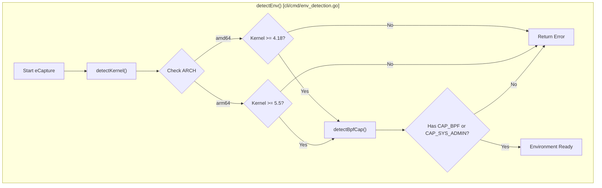
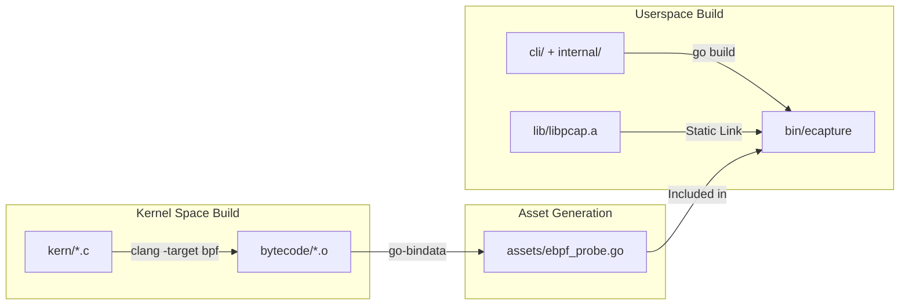

# Installation and Prerequisites

<details>
<summary>Relevant source files</summary>

The following files were used as context for generating this wiki page:

- [.github/ISSUE_TEMPLATE/bug_report.md](https://github.com/gojue/ecapture/blob/943a19fe/.github/ISSUE_TEMPLATE/bug_report.md)
- [.github/workflows/go-c-cpp.yml](https://github.com/gojue/ecapture/blob/943a19fe/.github/workflows/go-c-cpp.yml)
- [.github/workflows/release.yml](https://github.com/gojue/ecapture/blob/943a19fe/.github/workflows/release.yml)
- [.golangci.yml](https://github.com/gojue/ecapture/blob/943a19fe/.golangci.yml)
- [Makefile](https://github.com/gojue/ecapture/blob/943a19fe/Makefile)
- [builder/Dockerfile](https://github.com/gojue/ecapture/blob/943a19fe/builder/Dockerfile)
- [builder/Makefile.release](https://github.com/gojue/ecapture/blob/943a19fe/builder/Makefile.release)
- [builder/init_env.sh](https://github.com/gojue/ecapture/blob/943a19fe/builder/init_env.sh)
- [builder/rpmBuild.spec](https://github.com/gojue/ecapture/blob/943a19fe/builder/rpmBuild.spec)
- [cli/cmd/env_detection.go](https://github.com/gojue/ecapture/blob/943a19fe/cli/cmd/env_detection.go)
- [functions.mk](https://github.com/gojue/ecapture/blob/943a19fe/functions.mk)
- [variables.mk](https://github.com/gojue/ecapture/blob/943a19fe/variables.mk)

</details>


This page provides a comprehensive guide to installing eCapture and ensuring your environment meets the necessary requirements for eBPF-based traffic capture. eCapture supports multiple installation paths, ranging from prebuilt binaries and package managers to Docker images and building from source for custom environments.

## Prerequisites and System Requirements

eCapture relies on specific Linux kernel features (eBPF, uprobes) and requires sufficient privileges to load and attach eBPF programs.

### Hardware Architectures
*   **x86_64 (amd64)**
*   **aarch64 (arm64)**

### Kernel Version Requirements
The minimum kernel version depends on the CPU architecture due to the availability of specific eBPF helpers and features.

| Architecture | Minimum Kernel Version | Reason |
| :--- | :--- | :--- |
| x86_64 | 4.18 | Initial stable support for necessary eBPF features. |
| aarch64 | 5.5 | `bpf_probe_read_user` support on ARM64 requires >= 5.5. |

Sources: [cli/cmd/env_detection.go:32-43](https://github.com/gojue/ecapture/blob/943a19fe/cli/cmd/env_detection.go#L32-L43), [variables.mk:154-157](https://github.com/gojue/ecapture/blob/943a19fe/variables.mk#L154-L157)

### Environment Detection Logic
eCapture performs automated checks at startup to ensure the host environment is compatible.


Sources: [cli/cmd/env_detection.go:26-78](https://github.com/gojue/ecapture/blob/943a19fe/cli/cmd/env_detection.go#L26-L78)

---

## Installation Methods

### 1. Prebuilt Binaries (GitHub Releases)
The most common way to install eCapture is by downloading the prebuilt tarballs from the [GitHub Releases](https://github.com/gojue/ecapture/releases) page. These are available for Linux and Android.

*   **Linux**: Distributed as `ecapture-vX.Y.Z-linux-amd64.tar.gz`.
*   **Android**: Distributed as `ecapture-vX.Y.Z-android-arm64.tar.gz`.

Sources: [builder/Makefile.release:94-113](https://github.com/gojue/ecapture/blob/943a19fe/builder/Makefile.release#L94-L113), [.github/workflows/release.yml:100-109](https://github.com/gojue/ecapture/blob/943a19fe/.github/workflows/release.yml#L100-L109)

### 2. Package Managers (RPM/DEB)
For standard Linux distributions, eCapture provides native packages.

*   **DEB (Debian/Ubuntu)**: Generated via `dpkg-deb`.
*   **RPM (CentOS/Fedora/RHEL)**: Generated via `rpmbuild` using a spec file.

| Feature | RPM Details | DEB Details |
| :--- | :--- | :--- |
| **Tool** | `rpmbuild` | `dpkg-deb` |
| **Location** | `/usr/local/bin/ecapture` | `/usr/local/bin/ecapture` |
| **Spec/Control** | `builder/rpmBuild.spec` | `builder/Makefile.release` (inline) |

Sources: [builder/rpmBuild.spec:39-50](https://github.com/gojue/ecapture/blob/943a19fe/builder/rpmBuild.spec#L39-L50), [builder/Makefile.release:141-157](https://github.com/gojue/ecapture/blob/943a19fe/builder/Makefile.release#L141-L157), [Makefile:65-71](https://github.com/gojue/ecapture/blob/943a19fe/Makefile#L65-L71)

### 3. Docker Image
eCapture can be run inside a container to inspect the host's traffic. Images are hosted on Docker Hub as `gojue/ecapture`.

**Note:** The container must be run with `--privileged` or specific capabilities to interact with the host kernel.

```bash
docker run --rm --privileged=true --net=host -v /sys/kernel/debug:/sys/kernel/debug gojue/ecapture tls
```
Sources: [builder/Dockerfile:35-39](https://github.com/gojue/ecapture/blob/943a19fe/builder/Dockerfile#L35-L39), [.github/workflows/release.yml:115-167](https://github.com/gojue/ecapture/blob/943a19fe/.github/workflows/release.yml#L115-L167)

---

## Building from Source

Building from source is required if you are developing new probes or need a version tailored to a specific kernel (non-CO-RE).

### Build Toolchain Requirements
| Component | Requirement | Purpose |
| :--- | :--- | :--- |
| **Go** | >= 1.24 | Userspace control plane. |
| **Clang/LLVM** | >= 14 | eBPF C program compilation. |
| **libelf-dev** | Required | eBPF object loading. |
| **linux-source** | Required | Headers for non-CO-RE builds. |

Sources: [functions.mk:26-34](https://github.com/gojue/ecapture/blob/943a19fe/functions.mk#L26-L34), [.github/workflows/go-c-cpp.yml:22-30](https://github.com/gojue/ecapture/blob/943a19fe/.github/workflows/go-c-cpp.yml#L22-L30), [builder/init_env.sh:72-79](https://github.com/gojue/ecapture/blob/943a19fe/builder/init_env.sh#L72-L79)

### Build Process Flow
The Makefile manages a complex multi-stage build involving C compilation (Clang), asset embedding (`go-bindata`), and Go linking.


Sources: [Makefile:117-128](https://github.com/gojue/ecapture/blob/943a19fe/Makefile#L117-L128), [Makefile:162-166](https://github.com/gojue/ecapture/blob/943a19fe/Makefile#L162-L166), [functions.mk:47-54](https://github.com/gojue/ecapture/blob/943a19fe/functions.mk#L47-L54)

### Build Commands
*   **Standard Build (CO-RE)**: `make all` (Requires BTF support in kernel).
*   **Non-CO-RE Build**: `make nocore` (For older kernels without BTF).
*   **Android Build**: `ANDROID=1 make nocore` (Targets Android GKI).
*   **Cross-Compilation**: `CROSS_ARCH=arm64 make all` (Build arm64 on x86_64).

Sources: [Makefile:4-15](https://github.com/gojue/ecapture/blob/943a19fe/Makefile#L4-L15), [Makefile:92-95](https://github.com/gojue/ecapture/blob/943a19fe/Makefile#L92-L95), [builder/Makefile.release:10-11](https://github.com/gojue/ecapture/blob/943a19fe/builder/Makefile.release#L10-L11)

---

## Troubleshooting Installation

### 1. Missing BTF (vmlinux)
If eCapture fails to start in CO-RE mode, the kernel may lack BTF information.
*   **Symptom**: Error loading eBPF objects or "vmlinux.h" missing during build.
*   **Solution**: Use the `nocore` build or ensure `CONFIG_DEBUG_INFO_BTF=y` is set in your kernel config.

### 2. Permission Denied
*   **Symptom**: `failed to get the capabilities of the current process`.
*   **Solution**: eCapture requires `CAP_SYS_ADMIN` (on older kernels) or `CAP_BPF` + `CAP_PERFMON` + `CAP_SYS_PTRACE` (on newer kernels). Run with `sudo`.

### 3. Missing Symbols
*   **Symptom**: `uprobe attach failed`.
*   **Solution**: Ensure the target binary (e.g., `/usr/lib/x86_64-linux-gnu/libssl.so.3`) has symbols. For Go binaries, they must not be fully stripped.

Sources: [cli/cmd/env_detection.go:58-61](https://github.com/gojue/ecapture/blob/943a19fe/cli/cmd/env_detection.go#L58-L61), [Makefile:163](https://github.com/gojue/ecapture/blob/943a19fe/Makefile#L163)