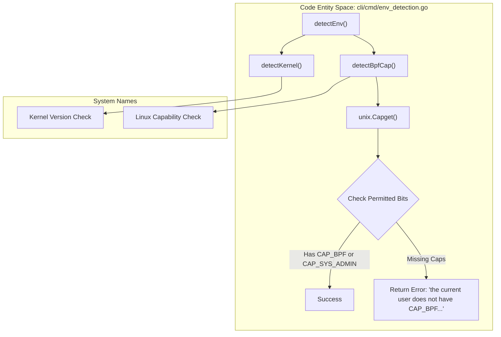
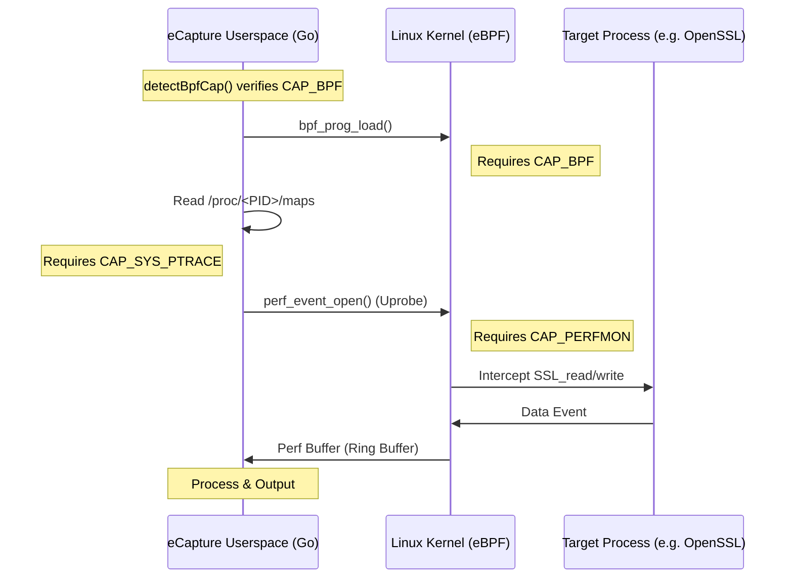

# Minimum Privileges

<details>
<summary>Relevant source files</summary>

The following files were used as context for generating this wiki page:

- [.github/ISSUE_TEMPLATE/bug_report.md](https://github.com/gojue/ecapture/blob/943a19fe/.github/ISSUE_TEMPLATE/bug_report.md)
- [.golangci.yml](https://github.com/gojue/ecapture/blob/943a19fe/.golangci.yml)
- [README-zh_Hans.md](https://github.com/gojue/ecapture/blob/943a19fe/README-zh_Hans.md)
- [SECURITY.md](https://github.com/gojue/ecapture/blob/943a19fe/SECURITY.md)
- [cli/cmd/env_detection.go](https://github.com/gojue/ecapture/blob/943a19fe/cli/cmd/env_detection.go)
- [docs/README.md](https://github.com/gojue/ecapture/blob/943a19fe/docs/README.md)
- [docs/defense-detection.md](https://github.com/gojue/ecapture/blob/943a19fe/docs/defense-detection.md)
- [docs/example-outputs.md](https://github.com/gojue/ecapture/blob/943a19fe/docs/example-outputs.md)
- [docs/minimum-privileges.md](https://github.com/gojue/ecapture/blob/943a19fe/docs/minimum-privileges.md)
- [docs/performance-benchmarks.md](https://github.com/gojue/ecapture/blob/943a19fe/docs/performance-benchmarks.md)
- [docs/release-verification.md](https://github.com/gojue/ecapture/blob/943a19fe/docs/release-verification.md)
- [pkg/util/kernel/kernel_version.go](https://github.com/gojue/ecapture/blob/943a19fe/pkg/util/kernel/kernel_version.go)
- [pkg/util/kernel/kernel_version_unsupport.go](https://github.com/gojue/ecapture/blob/943a19fe/pkg/util/kernel/kernel_version_unsupport.go)
- [pkg/util/kernel/version.go](https://github.com/gojue/ecapture/blob/943a19fe/pkg/util/kernel/version.go)

</details>


eCapture is a powerful security auditing tool that leverages eBPF to intercept function calls in userspace libraries. Because it interacts directly with the Linux kernel's BPF subsystem and attaches uprobes to other processes, it requires elevated privileges. This page details the specific Linux Capabilities required under different kernel versions and provides configuration examples for secure deployments.

## Privilege Requirements by Kernel Version

The Linux kernel has evolved to provide more granular control over BPF and performance monitoring. eCapture implements runtime detection to verify these requirements.

### Kernel >= 5.8 (Fine-Grained Capabilities)
In Linux 5.8 and later, BPF-related privileges were split from the monolithic `CAP_SYS_ADMIN` into specific capabilities [docs/minimum-privileges.md:7-17](https://github.com/gojue/ecapture/blob/943a19fe/docs/minimum-privileges.md#L7-L17).

| Capability | Purpose | Required for eCapture |
| :--- | :--- | :--- |
| `CAP_BPF` | Allows loading and managing eBPF programs. | All modes |
| `CAP_PERFMON` | Allows creating perf events and reading perf buffers (used for data output). | All modes |
| `CAP_SYS_PTRACE` | Allows reading `/proc/<pid>/maps` to locate library offsets. | All modes |
| `CAP_NET_ADMIN` | Required for Traffic Control (TC) attachment. | `pcapng` mode only |

### Kernel < 5.8 (Legacy Mode)
On older kernels, the specialized `CAP_BPF` and `CAP_PERFMON` capabilities do not exist. Users must provide broader permissions [docs/minimum-privileges.md:18-26](https://github.com/gojue/ecapture/blob/943a19fe/docs/minimum-privileges.md#L18-L26).

| Capability | Purpose | Required for eCapture |
| :--- | :--- | :--- |
| `CAP_SYS_ADMIN` | Encompasses BPF and performance monitoring capabilities. | All modes |
| `CAP_SYS_PTRACE` | Allows memory map inspection for uprobes. | All modes |
| `CAP_NET_ADMIN` | Required for TC attachment. | `pcapng` mode only |

---

## Runtime Privilege Detection

eCapture performs environment checks during the command execution phase. The function `detectEnv` calls `detectKernel` and `detectBpfCap` to ensure the environment is suitable [cli/cmd/env_detection.go:66-78](https://github.com/gojue/ecapture/blob/943a19fe/cli/cmd/env_detection.go#L66-L78).

### Capability Validation Logic
The `detectBpfCap` function uses the `unix.Capget` system call to inspect the process's permitted capabilities [cli/cmd/env_detection.go:47-64](https://github.com/gojue/ecapture/blob/943a19fe/cli/cmd/env_detection.go#L47-L64).


Sources: [cli/cmd/env_detection.go:26-78](https://github.com/gojue/ecapture/blob/943a19fe/cli/cmd/env_detection.go#L26-L78), [pkg/util/kernel/version.go:22-32](https://github.com/gojue/ecapture/blob/943a19fe/pkg/util/kernel/version.go#L22-L32)

---

## Configuration Examples

### 1. Host Binary (setcap)
Using `setcap` is the recommended way to follow the **Principle of Least Privilege** for local execution without using `sudo` [docs/minimum-privileges.md:45-67](https://github.com/gojue/ecapture/blob/943a19fe/docs/minimum-privileges.md#L45-L67).

**For Kernel >= 5.8:**
```bash
# Text or Keylog mode
sudo setcap 'cap_bpf,cap_perfmon,cap_sys_ptrace=eip' /usr/local/bin/ecapture

# Pcapng mode (requires networking caps)
sudo setcap 'cap_bpf,cap_perfmon,cap_net_admin,cap_sys_ptrace=eip' /usr/local/bin/ecapture
```

### 2. Docker Deployment
Avoid using `--privileged=true` in production as it grants the container full host access [docs/minimum-privileges.md:104-105](https://github.com/gojue/ecapture/blob/943a19fe/docs/minimum-privileges.md#L104-L105). Instead, use specific `--cap-add` flags and volume mounts [docs/minimum-privileges.md:75-102](https://github.com/gojue/ecapture/blob/943a19fe/docs/minimum-privileges.md#L75-L102).

```bash
docker run --rm \
  --cap-add=BPF \
  --cap-add=PERFMON \
  --cap-add=NET_ADMIN \
  --cap-add=SYS_PTRACE \
  --pid=host \
  --net=host \
  -v /sys/kernel/debug:/sys/kernel/debug:ro \
  -v /sys/fs/bpf:/sys/fs/bpf \
  gojue/ecapture:latest tls
```

**Required Mounts and Flags:**
*   `/sys/kernel/debug`: Required for uprobe attachment via debugfs [docs/minimum-privileges.md:110](https://github.com/gojue/ecapture/blob/943a19fe/docs/minimum-privileges.md#L110).
*   `/sys/fs/bpf`: Required for pinning BPF maps [docs/minimum-privileges.md:111](https://github.com/gojue/ecapture/blob/943a19fe/docs/minimum-privileges.md#L111).
*   `--pid=host`: Necessary to trace processes in the host namespace [docs/minimum-privileges.md:117](https://github.com/gojue/ecapture/blob/943a19fe/docs/minimum-privileges.md#L117).

### 3. Kubernetes securityContext
For Kubernetes deployments, configure the `securityContext` of the container spec:

```yaml
securityContext:
  capabilities:
    add:
      - BPF
      - PERFMON
      - NET_ADMIN
      - SYS_PTRACE
readinessProbe:
  # ...
volumeMounts:
  - name: sys-kernel-debug
    mountPath: /sys/kernel/debug
    readOnly: true
```

---

## Data Flow and Permission Boundary

The following diagram illustrates how eCapture uses these privileges to bridge the gap between the userspace binary and the kernel's eBPF subsystem.


Sources: [docs/minimum-privileges.md:5-34](https://github.com/gojue/ecapture/blob/943a19fe/docs/minimum-privileges.md#L5-L34), [docs/performance-benchmarks.md:7-12](https://github.com/gojue/ecapture/blob/943a19fe/docs/performance-benchmarks.md#L7-L12), [cli/cmd/env_detection.go:47-64](https://github.com/gojue/ecapture/blob/943a19fe/cli/cmd/env_detection.go#L47-L64)

---

## Security Best Practices
1.  **Restrict Binary Access**: Use group permissions to limit who can execute the eCapture binary with set capabilities [docs/minimum-privileges.md:142-146](https://github.com/gojue/ecapture/blob/943a19fe/docs/minimum-privileges.md#L142-L146).
2.  **Scope Capture**: Always use the `--pid` flag to limit capture to specific target processes rather than system-wide auditing [docs/minimum-privileges.md:137](https://github.com/gojue/ecapture/blob/943a19fe/docs/minimum-privileges.md#L137).
3.  **Cleanup**: Remove the binary or clear capabilities (`setcap -r`) once the troubleshooting or auditing session is complete [docs/minimum-privileges.md:139](https://github.com/gojue/ecapture/blob/943a19fe/docs/minimum-privileges.md#L139).

Sources:
* [cli/cmd/env_detection.go:26-78](https://github.com/gojue/ecapture/blob/943a19fe/cli/cmd/env_detection.go#L26-L78)
* [docs/minimum-privileges.md:1-154](https://github.com/gojue/ecapture/blob/943a19fe/docs/minimum-privileges.md#L1-L154)
* [pkg/util/kernel/version.go:1-50](https://github.com/gojue/ecapture/blob/943a19fe/pkg/util/kernel/version.go#L1-L50)
* [docs/defense-detection.md:117-138](https://github.com/gojue/ecapture/blob/943a19fe/docs/defense-detection.md#L117-L138)