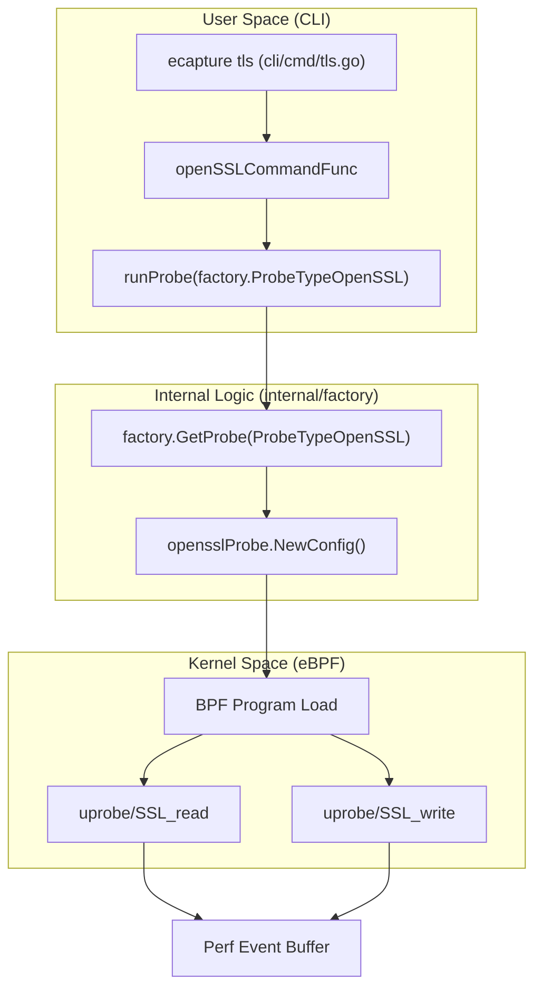
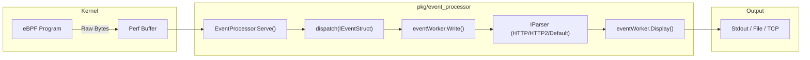

# Quick Start (Run the First Example in 5 Minutes)

<details>
<summary>Relevant source files</summary>

The following files were used as context for generating this wiki page:

- [README-zh_Hans.md](https://github.com/gojue/ecapture/blob/943a19fe/README-zh_Hans.md)
- [SECURITY.md](https://github.com/gojue/ecapture/blob/943a19fe/SECURITY.md)
- [cli/cmd/gnutls.go](https://github.com/gojue/ecapture/blob/943a19fe/cli/cmd/gnutls.go)
- [cli/cmd/gotls.go](https://github.com/gojue/ecapture/blob/943a19fe/cli/cmd/gotls.go)
- [cli/cmd/nss.go](https://github.com/gojue/ecapture/blob/943a19fe/cli/cmd/nss.go)
- [cli/cmd/root.go](https://github.com/gojue/ecapture/blob/943a19fe/cli/cmd/root.go)
- [cli/cmd/tls.go](https://github.com/gojue/ecapture/blob/943a19fe/cli/cmd/tls.go)
- [docs/README.md](https://github.com/gojue/ecapture/blob/943a19fe/docs/README.md)
- [docs/defense-detection.md](https://github.com/gojue/ecapture/blob/943a19fe/docs/defense-detection.md)
- [docs/example-outputs.md](https://github.com/gojue/ecapture/blob/943a19fe/docs/example-outputs.md)
- [docs/minimum-privileges.md](https://github.com/gojue/ecapture/blob/943a19fe/docs/minimum-privileges.md)
- [docs/performance-benchmarks.md](https://github.com/gojue/ecapture/blob/943a19fe/docs/performance-benchmarks.md)
- [docs/release-verification.md](https://github.com/gojue/ecapture/blob/943a19fe/docs/release-verification.md)
- [pkg/event_processor/http_request.go](https://github.com/gojue/ecapture/blob/943a19fe/pkg/event_processor/http_request.go)
- [pkg/event_processor/http_response.go](https://github.com/gojue/ecapture/blob/943a19fe/pkg/event_processor/http_response.go)
- [pkg/event_processor/iparser.go](https://github.com/gojue/ecapture/blob/943a19fe/pkg/event_processor/iparser.go)
- [pkg/event_processor/iworker.go](https://github.com/gojue/ecapture/blob/943a19fe/pkg/event_processor/iworker.go)
- [pkg/event_processor/processor.go](https://github.com/gojue/ecapture/blob/943a19fe/pkg/event_processor/processor.go)

</details>


This guide provides a hands-on walkthrough for running your first capture with eCapture. We will focus on the most common use case: capturing plaintext TLS traffic from `curl` using the `tls` probe.

## 1. Preparation

Ensure you have the eCapture binary installed and have the necessary privileges (root or specific capabilities). eCapture supports Linux x86_64 (kernel >= 4.18) and aarch64 (kernel >= 5.5) [cli/cmd/root.go:114-115](https://github.com/gojue/ecapture/blob/943a19fe/cli/cmd/root.go#L114-L115).

### Verify Installation
```bash
ecapture version
```

## 2. Launch Your First Capture

The `tls` command is the primary tool for capturing SSL/TLS plaintext. It works by attaching eBPF uprobes to functions like `SSL_read` and `SSL_write` in shared libraries [cli/cmd/tls.go:32-33](https://github.com/gojue/ecapture/blob/943a19fe/cli/cmd/tls.go#L32-L33).

### Step 1: Start eCapture
Open a terminal and run eCapture in `text` mode (default). We will filter by the `curl` process once we start it, but for now, let's watch all OpenSSL traffic:

```bash
sudo ecapture tls -m text
```

### Step 2: Trigger Traffic
In a second terminal, perform an HTTPS request using `curl`:

```bash
curl https://www.google.com
```

### Step 3: Observe Output
Back in the first terminal, you will see the decrypted plaintext. The output format typically includes the PID, Process Name, and the Hex/String content of the request and response [pkg/event_processor/iworker.go:205-206](https://github.com/gojue/ecapture/blob/943a19fe/pkg/event_processor/iworker.go#L205-L206).

## 3. Practical Examples

### Filtering by PID
To avoid noise from other processes, use the `--pid` (or `-p`) flag [cli/cmd/root.go:166](https://github.com/gojue/ecapture/blob/943a19fe/cli/cmd/root.go#L166).

```bash
# 1. Find the PID of a running process (e.g., nginx)
pidof nginx

# 2. Capture only that process
sudo ecapture tls --pid 1234
```

### Capturing from Specific Libraries
If your binary uses a non-standard OpenSSL path, use `--libssl` [cli/cmd/tls.go:51](https://github.com/gojue/ecapture/blob/943a19fe/cli/cmd/tls.go#L51).

```bash
sudo ecapture tls --libssl /usr/lib/x86_64-linux-gnu/libssl.so.1.1
```

### Go Binaries (gotls)
For binaries compiled with Go's standard library (`crypto/tls`), use the `gotls` probe and specify the ELF path [cli/cmd/gotls.go:32-35](https://github.com/gojue/ecapture/blob/943a19fe/cli/cmd/gotls.go#L32-L35).

```bash
sudo ecapture gotls --elfpath /path/to/your/go_binary
```

## 4. Data Flow Architecture

The following diagram illustrates how a user command triggers the eBPF instrumentation and how data flows back to your terminal.

### From CLI to Kernel Hook
"This diagram maps the CLI entry points to the internal factory and probe initialization."


Sources: [cli/cmd/tls.go:47-80](https://github.com/gojue/ecapture/blob/943a19fe/cli/cmd/tls.go#L47-L80), [cli/cmd/root.go:158-176](https://github.com/gojue/ecapture/blob/943a19fe/cli/cmd/root.go#L158-L176), [cli/cmd/gotls.go:58-72](https://github.com/gojue/ecapture/blob/943a19fe/cli/cmd/gotls.go#L58-L72)

### Event Processing Pipeline
"This diagram shows how raw bytes from the kernel are processed into readable text."


Sources: [pkg/event_processor/processor.go:64-87](https://github.com/gojue/ecapture/blob/943a19fe/pkg/event_processor/processor.go#L64-L87), [pkg/event_processor/iworker.go:153-161](https://github.com/gojue/ecapture/blob/943a19fe/pkg/event_processor/iworker.go#L153-L161), [pkg/event_processor/iworker.go:174-227](https://github.com/gojue/ecapture/blob/943a19fe/pkg/event_processor/iworker.go#L174-L227), [pkg/event_processor/iparser.go:85-115](https://github.com/gojue/ecapture/blob/943a19fe/pkg/event_processor/iparser.go#L85-L115)

## 5. Expected Output Formats

| Mode | Flag | Description |
| :--- | :--- | :--- |
| **Text** | `-m text` | Direct plaintext output to terminal. Best for quick debugging [cli/cmd/tls.go:53](https://github.com/gojue/ecapture/blob/943a19fe/cli/cmd/tls.go#L53). |
| **Pcap** | `-m pcap` | Saves to a `.pcapng` file. Use `-w` to specify filename [cli/cmd/tls.go:55](https://github.com/gojue/ecapture/blob/943a19fe/cli/cmd/tls.go#L55). |
| **Keylog** | `-m keylog`| Saves TLS secrets to a file for Wireshark. Use `-k` to specify [cli/cmd/tls.go:54](https://github.com/gojue/ecapture/blob/943a19fe/cli/cmd/tls.go#L54). |

### Text Mode Example Output
When running `ecapture tls`, the `eventWorker` formats the output as follows:
```text
PID:1234, Comm:curl, Src:192.168.1.5:44332, Dest:93.184.216.34:443,
GET / HTTP/1.1
Host: example.com
User-Agent: curl/7.74.0
```
Sources: [pkg/event_processor/iworker.go:205-206](https://github.com/gojue/ecapture/blob/943a19fe/pkg/event_processor/iworker.go#L205-L206)

## 6. Troubleshooting Quick-Check

*   **Permission Denied**: Ensure you are running with `sudo`. eCapture requires `CAP_SYS_ADMIN` or `CAP_BPF` [cli/cmd/root.go:130-136](https://github.com/gojue/ecapture/blob/943a19fe/cli/cmd/root.go#L130-L136).
*   **Empty Output**: 
    *   Verify the process is actually using the library you think it is (e.g., check if it's using GnuTLS instead of OpenSSL).
    *   Check if the kernel version meets the minimum requirements [cli/cmd/root.go:114-115](https://github.com/gojue/ecapture/blob/943a19fe/cli/cmd/root.go#L114-L115).
*   **BTF Errors**: If your kernel doesn't support BTF, try forcing non-CORE mode with `-b 2` [cli/cmd/root.go:163](https://github.com/gojue/ecapture/blob/943a19fe/cli/cmd/root.go#L163).

Sources: [cli/cmd/tls.go:1-80](https://github.com/gojue/ecapture/blob/943a19fe/cli/cmd/tls.go#L1-L80), [cli/cmd/root.go:1-180](https://github.com/gojue/ecapture/blob/943a19fe/cli/cmd/root.go#L1-L180), [pkg/event_processor/processor.go:1-214](https://github.com/gojue/ecapture/blob/943a19fe/pkg/event_processor/processor.go#L1-L214), [pkg/event_processor/iworker.go:1-265](https://github.com/gojue/ecapture/blob/943a19fe/pkg/event_processor/iworker.go#L1-L265), [pkg/event_processor/iparser.go:1-167](https://github.com/gojue/ecapture/blob/943a19fe/pkg/event_processor/iparser.go#L1-L167)