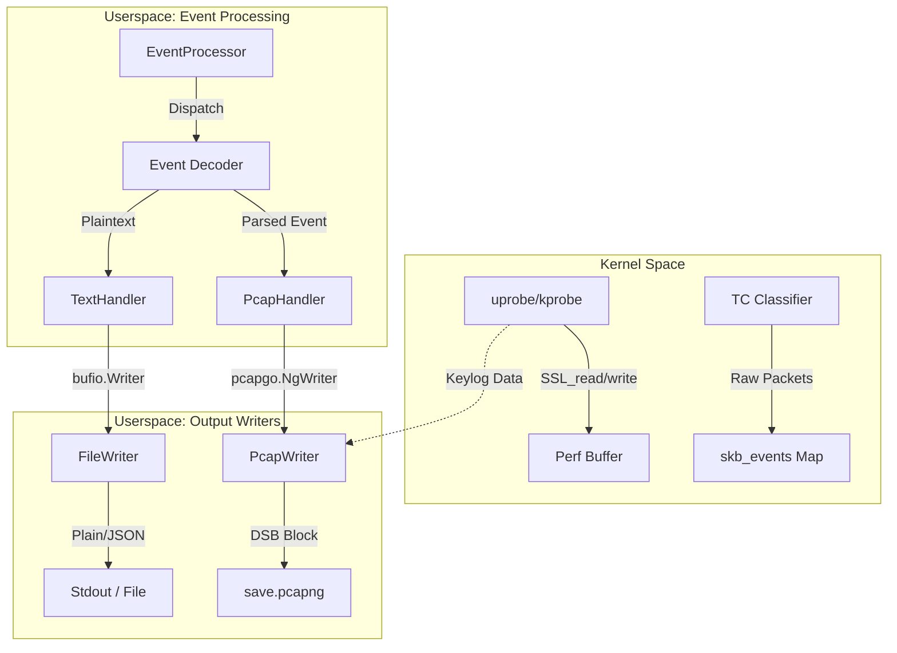
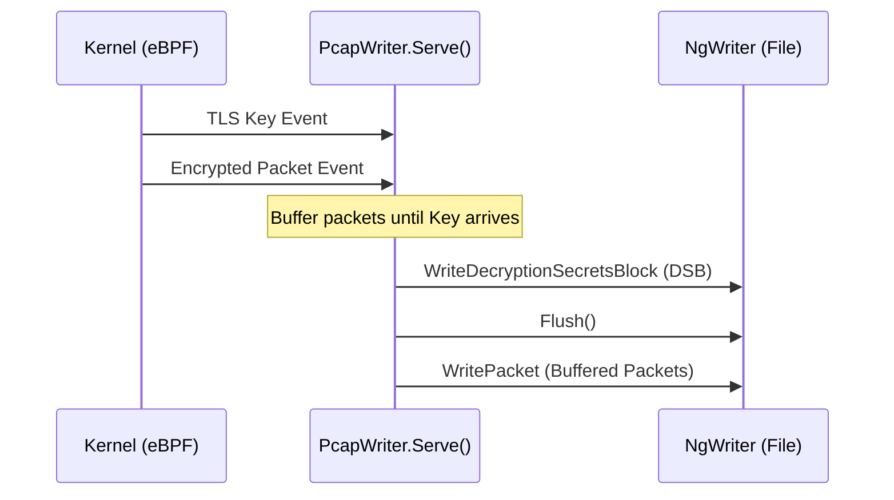

# Output Formats (text / pcap / keylog)

<details>
<summary>Relevant source files</summary>

The following files were used as context for generating this wiki page:

- [cli/cmd/gnutls.go](https://github.com/gojue/ecapture/blob/943a19fe/cli/cmd/gnutls.go)
- [cli/cmd/gotls.go](https://github.com/gojue/ecapture/blob/943a19fe/cli/cmd/gotls.go)
- [cli/cmd/nss.go](https://github.com/gojue/ecapture/blob/943a19fe/cli/cmd/nss.go)
- [cli/cmd/tls.go](https://github.com/gojue/ecapture/blob/943a19fe/cli/cmd/tls.go)
- [internal/output/writers/file_writer.go](https://github.com/gojue/ecapture/blob/943a19fe/internal/output/writers/file_writer.go)
- [internal/output/writers/pcap_writer.go](https://github.com/gojue/ecapture/blob/943a19fe/internal/output/writers/pcap_writer.go)
- [internal/probe/base/handlers/pcap_handler.go](https://github.com/gojue/ecapture/blob/943a19fe/internal/probe/base/handlers/pcap_handler.go)
- [kern/common.h](https://github.com/gojue/ecapture/blob/943a19fe/kern/common.h)
- [kern/ecapture.h](https://github.com/gojue/ecapture/blob/943a19fe/kern/ecapture.h)
- [kern/tc.h](https://github.com/gojue/ecapture/blob/943a19fe/kern/tc.h)
- [pkg/util/hkdf/hkdf.go](https://github.com/gojue/ecapture/blob/943a19fe/pkg/util/hkdf/hkdf.go)
- [pkg/util/hkdf/hkdf_test.go](https://github.com/gojue/ecapture/blob/943a19fe/pkg/util/hkdf/hkdf_test.go)

</details>


eCapture supports three primary output modes for capturing and analyzing data: **Text**, **Pcap/Pcapng**, and **Keylog**. These modes allow users to choose between immediate human-readable terminal output, professional network analysis via Wireshark, or cryptographic secret extraction for post-capture decryption.

## 1. Output Mode Overview

The output mode is controlled via the `-m` or `--model` flag available in most probes (e.g., `tls`, `gotls`, `gnutls`).

| Mode | Flag | Purpose | Requirements |
| :--- | :--- | :--- | :--- |
| **Text** | `-m text` | Direct plaintext output to stdout or file. | Default |
| **Pcapng** | `-m pcap` | Captures raw network packets via TC (Traffic Control) eBPF programs. | `CAP_NET_ADMIN` |
| **Keylog** | `-m keylog` | Captures TLS Master Secrets in NSS Key Log format. | Supported TLS probes |

### Data Flow Architecture

The following diagram illustrates how eBPF events from the kernel are transformed into different output formats through the userspace pipeline.

**Figure 1: Event to Output Pipeline**

**Sources:** [cli/cmd/tls.go:53-55](https://github.com/gojue/ecapture/blob/943a19fe/cli/cmd/tls.go#L53-L55), [internal/probe/base/handlers/pcap_handler.go:126-159](https://github.com/gojue/ecapture/blob/943a19fe/internal/probe/base/handlers/pcap_handler.go#L126-L159), [internal/output/writers/pcap_writer.go:161-226](https://github.com/gojue/ecapture/blob/943a19fe/internal/output/writers/pcap_writer.go#L161-L226)

---

## 2. Text Mode (`-m text`)

Text mode is the default behavior. It captures the plaintext arguments of functions like `SSL_read` and `SSL_write` and prints them directly.

*   **Implementation**: Data is read from the eBPF perf buffer, decoded into a string or hex format, and sent to the `FileWriter` or `Stdout`.
*   **Formatting**: Supports `--hex` for hexadecimal dumps and `--json` for structured logging.
*   **Example**:
    ```bash
    ecapture tls -m text --pid 1234
    ```

**Sources:** [cli/cmd/tls.go:53](https://github.com/gojue/ecapture/blob/943a19fe/cli/cmd/tls.go#L53), [internal/output/writers/file_writer.go:27-33](https://github.com/gojue/ecapture/blob/943a19fe/internal/output/writers/file_writer.go#L27-L33)

---

## 3. Pcap/Pcapng Mode (`-m pcap`)

In this mode, eCapture attaches eBPF programs to the **TC (Traffic Control)** subsystem to capture raw network packets. It uses the `PCAPNG` format, which is more extensible than legacy PCAP.

### Implementation Details
1.  **TC Attachment**: The probe attaches to a network interface (specified by `-i`). [cli/cmd/tls.go:56](https://github.com/gojue/ecapture/blob/943a19fe/cli/cmd/tls.go#L56)
2.  **Packet Capture**: Raw packets are sent to userspace via the `skb_events` perf map. [kern/tc.h:58-63](https://github.com/gojue/ecapture/blob/943a19fe/kern/tc.h#L58-L63)
3.  **Metadata Injection**: eCapture uses `pcapgo.NgWriter` to create a `PCAPNG` file. It includes interface descriptions and comments identifying eCapture as the source. [internal/output/writers/pcap_writer.go:64-80](https://github.com/gojue/ecapture/blob/943a19fe/internal/output/writers/pcap_writer.go#L64-L80)
4.  **Interface Indexing**: By default, the monitored interface is set to index `0` in the pcapng header to ensure compatibility with Wireshark. [internal/output/writers/pcap_writer.go:142-147](https://github.com/gojue/ecapture/blob/943a19fe/internal/output/writers/pcap_writer.go#L142-L147)

### CLI Example
```bash
# Capture TLS traffic on eth0 and save to pcapng
ecapture tls -m pcap -i eth0 -w capture.pcapng tcp port 443
```

**Sources:** [internal/probe/base/handlers/pcap_handler.go:106-123](https://github.com/gojue/ecapture/blob/943a19fe/internal/probe/base/handlers/pcap_handler.go#L106-L123), [internal/output/writers/pcap_writer.go:39-53](https://github.com/gojue/ecapture/blob/943a19fe/internal/output/writers/pcap_writer.go#L39-L53)

---

## 4. Keylog Mode (`-m keylog`)

Keylog mode extracts TLS secrets (Master Secrets, Client Randoms) directly from the memory of the target process. These secrets are formatted as **NSS Key Log** entries.

### Why use Keylog?
While `text` mode shows you the data eCapture saw, `keylog` mode allows you to use a standard tool like **tcpdump** to capture traffic and **Wireshark** to decrypt it later using the generated key file.

### Secret Labels Supported
eCapture supports both TLS 1.2 and TLS 1.3 secret labels:
*   `CLIENT_RANDOM` (TLS 1.2)
*   `CLIENT_HANDSHAKE_TRAFFIC_SECRET` (TLS 1.3)
*   `SERVER_HANDSHAKE_TRAFFIC_SECRET` (TLS 1.3)
*   `EXPORTER_SECRET`

### Integration with Pcapng (DSB)
When using `-m pcap`, eCapture automatically embeds these keys into the `PCAPNG` file using **Decryption Secrets Blocks (DSB)**. This means the resulting file can be opened in Wireshark and decrypted **without** providing an external key file.

**Figure 2: DSB Serialization Logic**

*Logic note: eCapture delays flushing packets for up to 3 seconds to ensure the DSB (key) appears before the encrypted packets in the file stream.* [internal/output/writers/pcap_writer.go:171-184](https://github.com/gojue/ecapture/blob/943a19fe/internal/output/writers/pcap_writer.go#L171-L184)

### CLI Example
```bash
# Save keys to a separate file
ecapture tls -m keylog -k my_keys.log
```

**Sources:** [pkg/util/hkdf/hkdf.go:49-57](https://github.com/gojue/ecapture/blob/943a19fe/pkg/util/hkdf/hkdf.go#L49-L57), [internal/output/writers/pcap_writer.go:210-226](https://github.com/gojue/ecapture/blob/943a19fe/internal/output/writers/pcap_writer.go#L210-L226)

---

## 5. Output Configuration Flags

Users can combine encoders and targets using the following flags:

| Flag | Type | Description |
| :--- | :--- | :--- |
| `-l`, `--logaddr` | String | Path to a file or a TCP address (e.g., `127.0.0.1:8080`) to send logs. |
| `-w`, `--pcapfile` | String | The output path for PCAPNG files. Default: `save.pcapng`. |
| `--hex` | Boolean | Print text output in hex format. |
| `--perf-reorder` | Boolean | Reorder perf events by kernel timestamp before output to ensure chronological order. |

### Advanced: Log Rotation
The `FileWriter` supports log rotation via the `roratelog` package, allowing for production-grade auditing without filling up disk space. [internal/output/writers/file_writer.go:56-65](https://github.com/gojue/ecapture/blob/943a19fe/internal/output/writers/file_writer.go#L56-L65)

**Sources:** [cli/cmd/tls.go:51-61](https://github.com/gojue/ecapture/blob/943a19fe/cli/cmd/tls.go#L51-L61), [internal/output/writers/file_writer.go:36-43](https://github.com/gojue/ecapture/blob/943a19fe/internal/output/writers/file_writer.go#L36-L43)