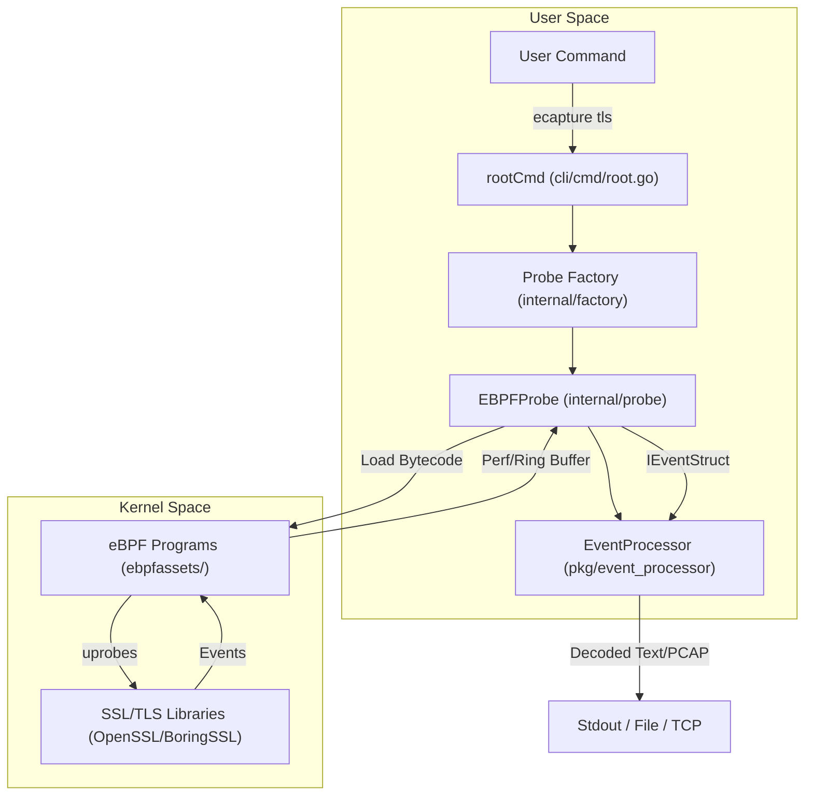
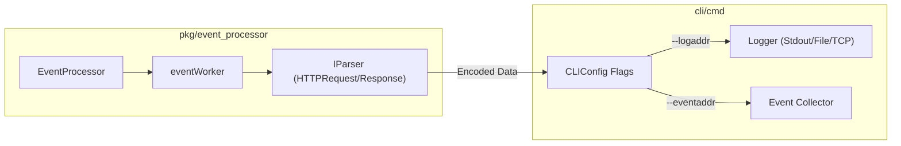

# Getting Started

<details>
<summary>Relevant source files</summary>

The following files were used as context for generating this wiki page:

- [CHANGELOG.md](https://github.com/gojue/ecapture/blob/943a19fe/CHANGELOG.md)
- [README.md](https://github.com/gojue/ecapture/blob/943a19fe/README.md)
- [cli/cmd/root.go](https://github.com/gojue/ecapture/blob/943a19fe/cli/cmd/root.go)
- [main.go](https://github.com/gojue/ecapture/blob/943a19fe/main.go)
- [pkg/event_processor/http_request.go](https://github.com/gojue/ecapture/blob/943a19fe/pkg/event_processor/http_request.go)
- [pkg/event_processor/http_response.go](https://github.com/gojue/ecapture/blob/943a19fe/pkg/event_processor/http_response.go)
- [pkg/event_processor/iparser.go](https://github.com/gojue/ecapture/blob/943a19fe/pkg/event_processor/iparser.go)
- [pkg/event_processor/iworker.go](https://github.com/gojue/ecapture/blob/943a19fe/pkg/event_processor/iworker.go)
- [pkg/event_processor/processor.go](https://github.com/gojue/ecapture/blob/943a19fe/pkg/event_processor/processor.go)

</details>


This page serves as the primary entry point for new users of eCapture. It provides a high-level overview of the setup process, from environment verification to running your first plaintext capture. By following the sub-pages linked here, you can move from a fresh installation to viewing decrypted TLS traffic in under five minutes.

### Overview of the Setup Process

The journey to using eCapture involves four main stages: preparing your environment, obtaining the binary, ensuring correct permissions, and executing a capture module.

1.  **Installation**: Choose between prebuilt binaries, Docker images, or building from source.
2.  **Environment Check**: Verify your Linux kernel version and CPU architecture (x86_64 or aarch64).
3.  **Permissions**: Configure necessary Linux Capabilities or use root access.
4.  **First Capture**: Run a simple `tls` probe to intercept plaintext data from tools like `curl` or `wget`.

### High-Level Component Interaction

The following diagram illustrates how a user interacts with the eCapture CLI to initiate a capture session, and how the internal components facilitate the flow from the kernel to the final output.

**CLI to Kernel Data Path**

Sources: [cli/cmd/root.go:105-137](https://github.com/gojue/ecapture/blob/943a19fe/cli/cmd/root.go#L105-L137), [internal/factory/factory.go:1-50](https://github.com/gojue/ecapture/blob/943a19fe/internal/factory/factory.go#L1-L50), [pkg/event_processor/processor.go:89-107](https://github.com/gojue/ecapture/blob/943a19fe/pkg/event_processor/processor.go#L89-L107), [README.md:106-119](https://github.com/gojue/ecapture/blob/943a19fe/README.md#L106-L119)

---

### 2.1 Installation and Prerequisites
eCapture supports multiple installation methods to suit different environments. The most common method is downloading the ELF binary directly from GitHub Releases. For containerized environments, a Docker image is provided, though it requires specific privileges to interact with the host kernel.

**Supported Platforms:**
*   **Linux x86_64**: Kernel >= 4.18
*   **Linux aarch64**: Kernel >= 5.5
*   **Android**: GKI kernels (arm64)

For detailed installation steps and system requirements, see [Installation and Prerequisites](2.1-installation-and-prerequisites.md).

Sources: [README.md:12-15](https://github.com/gojue/ecapture/blob/943a19fe/README.md#L12-L15), [README.md:48-72](https://github.com/gojue/ecapture/blob/943a19fe/README.md#L48-L72)

### 2.2 Minimum Privileges
Because eCapture utilizes eBPF to hook into system libraries, it requires elevated privileges. While running as `root` is the simplest method, production environments often require restricted permissions. eCapture can run with a subset of Linux Capabilities, such as `CAP_BPF`, `CAP_PERFMON`, and `CAP_SYS_PTRACE`.

For instructions on configuring specific capabilities and Kubernetes security contexts, see [Minimum Privileges](2.2-minimum-privileges.md).

Sources: [README.md:14-14](https://github.com/gojue/ecapture/blob/943a19fe/README.md#L14-L14), [cli/cmd/root.go:124-124](https://github.com/gojue/ecapture/blob/943a19fe/cli/cmd/root.go#L124-L124)

### 2.3 Quick Start (Run the First Example)
The fastest way to verify your setup is by running the `tls` module. By default, eCapture will search for OpenSSL or BoringSSL libraries on your system and begin capturing plaintext.

**Example Command:**
```shell
sudo ecapture tls
```
Once running, executing a command like `curl https://google.com` in another terminal will trigger the capture, displaying the HTTP/1.1 or HTTP/2 headers and body in your console.

For a full walkthrough including PID filtering and specific application examples, see [Quick Start (Run the First Example in 5 Minutes)](2.3-quick-start-run-the-first-example-in-5-minutes.md).

Sources: [README.md:74-90](https://github.com/gojue/ecapture/blob/943a19fe/README.md#L74-L90), [cli/cmd/root.go:118-121](https://github.com/gojue/ecapture/blob/943a19fe/cli/cmd/root.go#L118-L121)

### 2.4 Output Formats (Text / Pcap / Keylog)
eCapture provides flexible output options depending on your analysis needs:
*   **Text Mode**: Direct human-readable output to the console.
*   **Pcap/Pcapng Mode**: Generates files compatible with Wireshark for deep packet analysis.
*   **Keylog Mode**: Exports TLS Master Secrets (NSS Key Log format) to decrypt traffic captured by other tools like `tcpdump`.

The underlying `EventProcessor` handles the conversion of raw eBPF events into these formats using specialized parsers like `HTTPRequest` and `HTTPResponse`.

For details on choosing and configuring output modes, see [Output Formats (text / pcap / keylog)](2.4-output-formats-text--pcap--keylog.md).

**Internal Output Flow**

Sources: [pkg/event_processor/processor.go:28-48](https://github.com/gojue/ecapture/blob/943a19fe/pkg/event_processor/processor.go#L28-L48), [pkg/event_processor/iworker.go:174-227](https://github.com/gojue/ecapture/blob/943a19fe/pkg/event_processor/iworker.go#L174-L227), [cli/cmd/root.go:78-86](https://github.com/gojue/ecapture/blob/943a19fe/cli/cmd/root.go#L78-L86), [cli/cmd/root.go:168-171](https://github.com/gojue/ecapture/blob/943a19fe/cli/cmd/root.go#L168-L171)