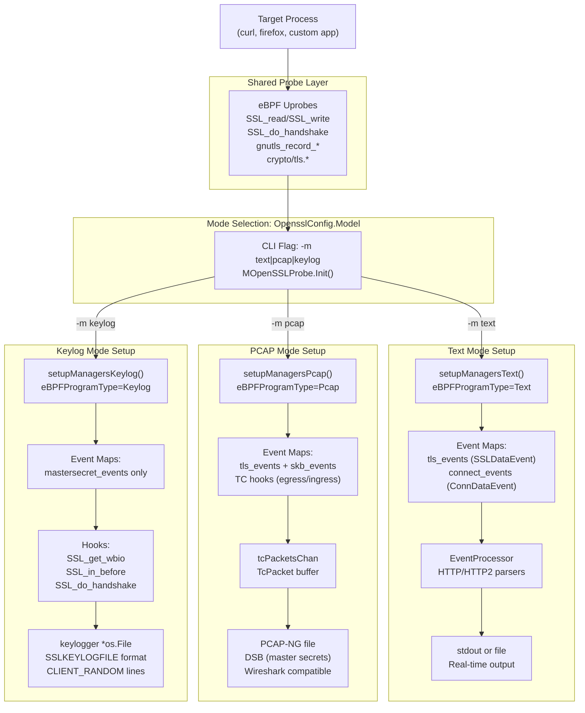
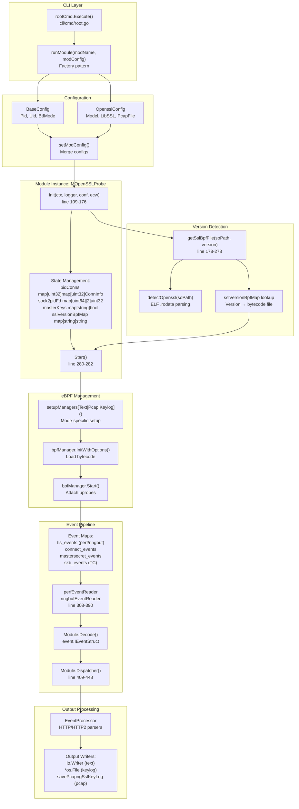
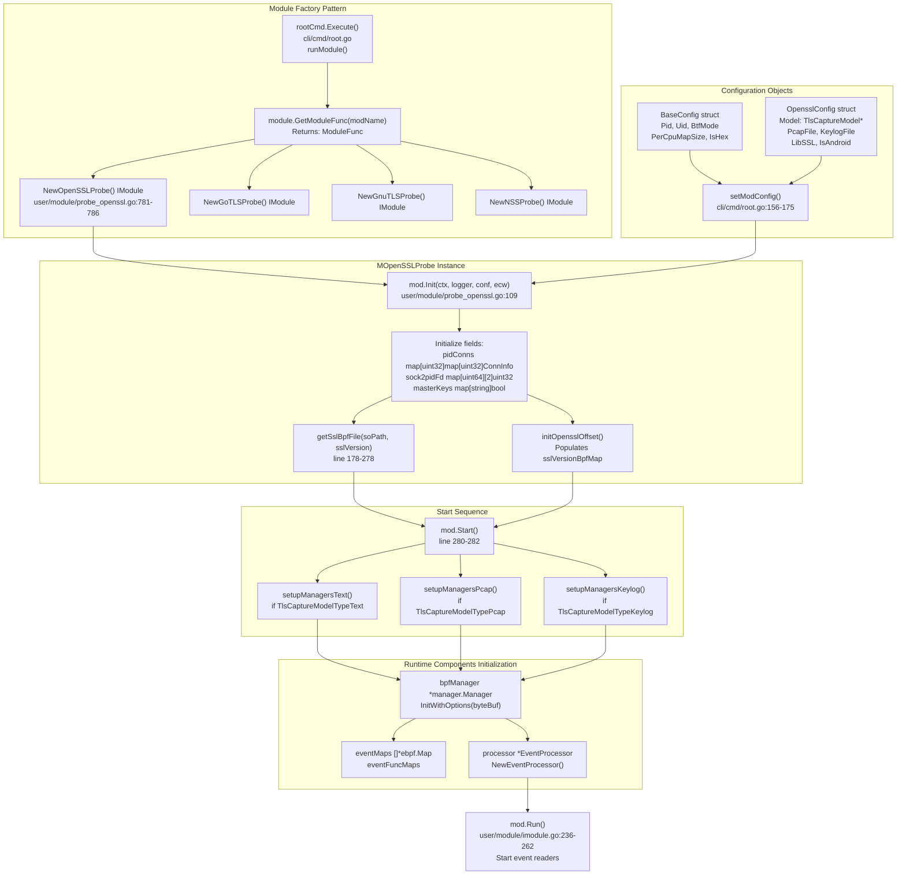

# TLS/SSL Capture Modules

<details>
<summary>Relevant source files</summary>

The following files were used as context for generating this wiki page:

- [CHANGELOG.md](https://github.com/gojue/ecapture/blob/ca085d05/CHANGELOG.md)
- [README.md](https://github.com/gojue/ecapture/blob/ca085d05/README.md)
- [README_CN.md](https://github.com/gojue/ecapture/blob/ca085d05/README_CN.md)
- [cli/cmd/root.go](https://github.com/gojue/ecapture/blob/ca085d05/cli/cmd/root.go)
- [images/ecapture-help-v0.8.9.svg](https://github.com/gojue/ecapture/blob/ca085d05/images/ecapture-help-v0.8.9.svg)
- [main.go](https://github.com/gojue/ecapture/blob/ca085d05/main.go)
- [user/config/iconfig.go](https://github.com/gojue/ecapture/blob/ca085d05/user/config/iconfig.go)
- [user/module/imodule.go](https://github.com/gojue/ecapture/blob/ca085d05/user/module/imodule.go)
- [user/module/probe_openssl.go](https://github.com/gojue/ecapture/blob/ca085d05/user/module/probe_openssl.go)

</details>


## Purpose and Scope

This page provides an overview of eCapture's TLS/SSL capture capabilities across multiple encryption libraries. TLS/SSL capture modules use eBPF uprobes to intercept encryption library functions and extract plaintext data or TLS handshake secrets without requiring CA certificates, application modifications, or library recompilation.

eCapture supports four major TLS/SSL library families through dedicated modules:

| Module | CLI Command | Supported Libraries | Version Coverage |
|--------|-------------|-------------------|------------------|
| OpenSSL | `ecapture tls` | OpenSSL, LibreSSL, BoringSSL | OpenSSL 1.0.2-3.5.x, BoringSSL Android 12-16 |
| Go TLS | `ecapture gotls` | Go crypto/tls | Go 1.8+ (all versions) |
| GnuTLS | `ecapture gnutls` | GnuTLS | 3.x series |
| NSS/NSPR | `ecapture nss` | Mozilla NSS | NSS 3.x series |

All modules share the `IModule` interface [user/module/imodule.go:47-75](https://github.com/gojue/ecapture/blob/ca085d05/user/module/imodule.go#L47-L75) and implement three capture modes:
- **Text Mode**: Real-time plaintext output with HTTP/HTTP2 parsing
- **PCAP Mode**: Network packets saved to PCAP-NG files with embedded secrets
- **Keylog Mode**: TLS master secrets in SSLKEYLOGFILE format

**Sub-Section Navigation:**
- OpenSSL/BoringSSL implementation details: See page **3.1.1**
- Go TLS implementation and ABI handling: See page **3.1.3**
- GnuTLS and NSS implementations: See page **3.1.4**
- TLS 1.2/1.3 master secret extraction: See page **3.1.5**

**Sources:** [user/module/imodule.go:47-75](https://github.com/gojue/ecapture/blob/ca085d05/user/module/imodule.go#L47-L75), [README.md:36-43](https://github.com/gojue/ecapture/blob/ca085d05/README.md#L36-L43), [cli/cmd/root.go:80-113](https://github.com/gojue/ecapture/blob/ca085d05/cli/cmd/root.go#L80-L113)
</old_str>

<old_str>
### Three Capture Modes Overview

Diagram: TLS Module Capture Pipeline by Mode



**Sources:** [user/module/probe_openssl.go:58-76](https://github.com/gojue/ecapture/blob/ca085d05/user/module/probe_openssl.go#L58-L76), [user/module/probe_openssl.go:128-154](https://github.com/gojue/ecapture/blob/ca085d05/user/module/probe_openssl.go#L128-L154), [user/module/probe_openssl.go:280-350](https://github.com/gojue/ecapture/blob/ca085d05/user/module/probe_openssl.go#L280-L350), [user/config/iconfig.go:73-79](https://github.com/gojue/ecapture/blob/ca085d05/user/config/iconfig.go#L73-L79)
</old_str>

<new_str>
---

## Supported Libraries and Versions

eCapture provides comprehensive TLS/SSL capture across multiple library implementations. Each module automatically detects library versions and selects appropriate eBPF bytecode with version-specific structure offsets.

### Version Coverage by Library

**OpenSSL Module (`ecapture tls`):**
- **OpenSSL 1.0.2a-u**: 26 versions grouped into shared bytecode
- **OpenSSL 1.1.0a-l**: 12 versions with standard hooks
- **OpenSSL 1.1.1a-w**: Common bytecode across patch versions
- **OpenSSL 3.0.0-3.0.15**: Support for `ssl_connection_st` structure
- **OpenSSL 3.1.0-3.5.4**: Latest stable releases
- **LibreSSL**: Uses OpenSSL 1.1.1 compatible bytecode
- **BoringSSL Android 12-16**: Version-specific offsets per Android release

**Go TLS Module (`ecapture gotls`):**
- **Go 1.8-1.16**: Stack-based ABI calling convention
- **Go 1.17+**: Register-based ABI calling convention
- Auto-detects Go version from binary metadata

**GnuTLS Module (`ecapture gnutls`):**
- **GnuTLS 3.x series**: Full data and keylog support

**NSS/NSPR Module (`ecapture nss`):**
- **NSS 3.x series**: Used by Firefox and NSS-based applications

### Platform Support Matrix

| Architecture | Kernel Requirement | Supported Modules |
|--------------|-------------------|-------------------|
| Linux x86_64 | 4.18+ | All modules |
| Linux aarch64 | 5.5+ | All modules |
| Android x86_64 | Android 12+ | OpenSSL (BoringSSL) |
| Android aarch64 | Android 12+ | OpenSSL (BoringSSL) |

**Sources:** [README.md:14-16](https://github.com/gojue/ecapture/blob/ca085d05/README.md#L14-L16), [CHANGELOG.md:1-45](https://github.com/gojue/ecapture/blob/ca085d05/CHANGELOG.md#L1-L45), [user/module/probe_openssl.go:178-278](https://github.com/gojue/ecapture/blob/ca085d05/user/module/probe_openssl.go#L178-L278)

---

## Supported TLS/SSL Libraries

eCapture supports multiple TLS/SSL library implementations through dedicated modules. Each module uses eBPF uprobes to intercept encryption library functions and extract plaintext data or master secrets.

| Module Name | Supported Libraries | Version Coverage | Platform Support |
|-------------|-------------------|------------------|------------------|
| `tls` | OpenSSL, LibreSSL, BoringSSL | OpenSSL 1.0.2 - 3.5.x<br/>BoringSSL Android 12-16 | Linux x86_64/aarch64<br/>Android |
| `gotls` | Go crypto/tls | Go 1.8+ (all versions) | Linux x86_64/aarch64 |
| `gnutls` | GnuTLS | 3.x series | Linux x86_64/aarch64 |
| `nss` | NSS/NSPR (Firefox, Chrome) | NSS 3.x series | Linux x86_64/aarch64 |

**Sources:** [README.md:38-42](https://github.com/gojue/ecapture/blob/ca085d05/README.md#L38-L42), [CHANGELOG.md:202-204](https://github.com/gojue/ecapture/blob/ca085d05/CHANGELOG.md#L202-L204), [cli/cmd/root.go:152-161](https://github.com/gojue/ecapture/blob/ca085d05/cli/cmd/root.go#L152-L161)

---

## Capture Modes

All TLS/SSL modules support three operational modes that determine how captured data is processed and output. The mode is selected via the `-m` command-line flag.

### Mode Configuration and Behavior

The capture mode is controlled by the `TlsCaptureModelType` enumeration [user/module/probe_openssl.go:58-64](https://github.com/gojue/ecapture/blob/ca085d05/user/module/probe_openssl.go#L58-L64) and configured via the `-m` CLI flag:

| Mode | CLI Flag | eBPF Program Type | Primary Use Case |
|------|----------|------------------|------------------|
| **Text** | `-m text` (default) | `TlsCaptureModelTypeText` | Real-time monitoring and debugging |
| **PCAP** | `-m pcap` or `-m pcapng` | `TlsCaptureModelTypePcap` | Network analysis in Wireshark |
| **Keylog** | `-m keylog` or `-m key` | `TlsCaptureModelTypeKeylog` | TLS key extraction for external tools |

**Text Mode Characteristics:**
- Captures plaintext data from `SSL_read`/`SSL_write` calls
- Events flow through `EventProcessor` with HTTP/HTTP2 parsing
- Output format: Structured text with parsed protocol headers
- Real-time console output or file logging
- Command: `sudo ecapture tls -m text`

**PCAP Mode Characteristics:**
- Combines uprobe data capture with TC (Traffic Control) packet capture
- Generates PCAP-NG files with Decryption Secrets Block (DSB)
- Supports PCAP filter expressions for packet filtering
- Requires network interface specification via `-i` flag
- Output compatible with Wireshark, tshark, tcpdump
- Command: `sudo ecapture tls -m pcap -i eth0 --pcapfile=capture.pcapng`

**Keylog Mode Characteristics:**
- Extracts TLS handshake secrets only (no data capture)
- Outputs SSLKEYLOGFILE format compatible with Wireshark
- Supports both TLS 1.2 (single master secret) and TLS 1.3 (multiple derived secrets)
- Can be used with live `tshark` for real-time decryption
- Command: `sudo ecapture tls -m keylog --keylogfile=keys.log`

**Mode Selection Implementation:**

The mode is set during `MOpenSSLProbe.Init()` [user/module/probe_openssl.go:128-154](https://github.com/gojue/ecapture/blob/ca085d05/user/module/probe_openssl.go#L128-L154):

```
switch modConfig.Model {
case config.TlsCaptureModelKeylog, config.TlsCaptureModelKey:
    m.eBPFProgramType = TlsCaptureModelTypeKeylog
    m.keylogger = os.OpenFile(keylogFile, ...)
case config.TlsCaptureModelPcap, config.TlsCaptureModelPcapng:
    m.eBPFProgramType = TlsCaptureModelTypePcap
    m.tcPacketsChan = make(chan *TcPacket, 2048)
default:
    m.eBPFProgramType = TlsCaptureModelTypeText
}
```

The selected mode determines which `setupManagers*()` function is called in `Start()` [user/module/probe_openssl.go:284-299](https://github.com/gojue/ecapture/blob/ca085d05/user/module/probe_openssl.go#L284-L299).

**Sources:** [user/module/probe_openssl.go:58-76](https://github.com/gojue/ecapture/blob/ca085d05/user/module/probe_openssl.go#L58-L76), [user/module/probe_openssl.go:128-154](https://github.com/gojue/ecapture/blob/ca085d05/user/module/probe_openssl.go#L128-L154), [user/module/probe_openssl.go:284-299](https://github.com/gojue/ecapture/blob/ca085d05/user/module/probe_openssl.go#L284-L299), [user/config/iconfig.go:73-79](https://github.com/gojue/ecapture/blob/ca085d05/user/config/iconfig.go#L73-L79)

---

## Module Architecture

### High-Level Component Interaction

Diagram: TLS Module Architecture with Code Entities



**Sources:** [cli/cmd/root.go:249-403](https://github.com/gojue/ecapture/blob/ca085d05/cli/cmd/root.go#L249-L403), [user/module/probe_openssl.go:83-106](https://github.com/gojue/ecapture/blob/ca085d05/user/module/probe_openssl.go#L83-L106), [user/module/probe_openssl.go:109-176](https://github.com/gojue/ecapture/blob/ca085d05/user/module/probe_openssl.go#L109-L176), [user/module/probe_openssl.go:280-350](https://github.com/gojue/ecapture/blob/ca085d05/user/module/probe_openssl.go#L280-L350)

### Connection Tracking System

The TLS modules maintain connection state through two synchronized maps in `MOpenSSLProbe`:

**Primary Data Structures:**

```
pidConns: map[PID]map[FD]ConnInfo
  ├─ Purpose: Forward lookup PID+FD → network tuple
  └─ Used by: dumpSslData() to correlate SSL events with connections

sock2pidFd: map[socket_address][PID, FD]
  ├─ Purpose: Reverse lookup for cleanup operations
  └─ Used by: DestroyConn() when socket closes

masterKeys: map[hex_client_random]bool
  ├─ Purpose: Deduplicate TLS master secrets
  └─ Used by: saveMasterSecret() to prevent redundant keylog entries
```

**Connection Lifecycle Operations:**

| Operation | Trigger Event | Function | Behavior |
|-----------|--------------|----------|----------|
| **Create** | `ConnDataEvent` (IsDestroy=0) | `AddConn()` line 398 | Populates both maps with tuple, socket info |
| **Lookup** | `SSLDataEvent` | `GetConn()` line 464 | Returns ConnInfo for tuple association |
| **Schedule Destroy** | `ConnDataEvent` (IsDestroy=1) | `DelConn()` line 455 | Sets 3-second timer for cleanup |
| **Execute Destroy** | Timer expiration | `DestroyConn()` line 418 | Removes from both maps, notifies EventProcessor |

**Thread Safety:** All operations acquire `pidLocker` mutex [user/module/probe_openssl.go:94](https://github.com/gojue/ecapture/blob/ca085d05/user/module/probe_openssl.go#L94) before map access.

**Sources:** [user/module/probe_openssl.go:83-106](https://github.com/gojue/ecapture/blob/ca085d05/user/module/probe_openssl.go#L83-L106), [user/module/probe_openssl.go:398-481](https://github.com/gojue/ecapture/blob/ca085d05/user/module/probe_openssl.go#L398-L481)

---

## Architecture Overview

### Module Initialization and Configuration Flow

Diagram: TLS Module Initialization with Code Entity Details



**Sources:** [cli/cmd/root.go:249-403](https://github.com/gojue/ecapture/blob/ca085d05/cli/cmd/root.go#L249-L403), [user/module/probe_openssl.go:109-176](https://github.com/gojue/ecapture/blob/ca085d05/user/module/probe_openssl.go#L109-L176), [user/module/probe_openssl.go:280-350](https://github.com/gojue/ecapture/blob/ca085d05/user/module/probe_openssl.go#L280-L350), [user/module/imodule.go:47-75](https://github.com/gojue/ecapture/blob/ca085d05/user/module/imodule.go#L47-L75), [user/module/imodule.go:236-262](https://github.com/gojue/ecapture/blob/ca085d05/user/module/imodule.go#L236-L262)

---

## Automatic Version Detection

TLS modules automatically detect the target library version and select compatible eBPF bytecode with correct structure offsets. This enables support for multiple OpenSSL, BoringSSL, GnuTLS, and Go versions without user intervention.

### Version Detection and Bytecode Selection Flow

Diagram: Library Version Detection Pipeline

**Detection Methods:**

1. **ELF Parsing:** `detectOpenssl()` [user/module/probe_openssl.go:207](https://github.com/gojue/ecapture/blob/ca085d05/user/module/probe_openssl.go#L207) reads the `.rodata` section and searches for version strings using regex `OpenSSL\s\d\.\d\.[0-9a-z]+`

2. **Fallback to libcrypto:** If `libssl.so.3` lacks version info, checks imported `libcrypto.so` via `getImpNeeded()` [user/module/probe_openssl.go:221-235](https://github.com/gojue/ecapture/blob/ca085d05/user/module/probe_openssl.go#L221-L235)

3. **Android Detection:** Uses `--androidver` flag to select BoringSSL bytecode: `boringssl_a_12` through `boringssl_a_16` [user/module/probe_openssl.go:247-262](https://github.com/gojue/ecapture/blob/ca085d05/user/module/probe_openssl.go#L247-L262)

4. **Version Downgrade:** `autoDetectBytecode()` [user/module/probe_openssl.go:273](https://github.com/gojue/ecapture/blob/ca085d05/user/module/probe_openssl.go#L273) iteratively truncates version (e.g., `3.0.12` → `3.0.0` → `3.0`) to find closest compatible bytecode

**Version-to-Bytecode Mapping:**

The `sslVersionBpfMap` populated by `initOpensslOffset()` maps detected versions to bytecode filenames:

```
"openssl 1.1.1a"   → "openssl_1_1_1_kern.o"
"openssl 3.0.0"    → "openssl_3_0_0_kern.o"
"boringssl_a_14"   → "boringssl_a_14_kern.o"
```

**Bytecode File Naming:**

Pattern: `<library>_<major>_<minor>_<patch>_kern[_core|_noncore].o`

Examples:
- `openssl_3_0_0_kern_core.o` - OpenSSL 3.0.x with BTF CO-RE support
- `boringssl_a_14_kern_noncore.o` - BoringSSL Android 14 without BTF

The suffix is determined by `geteBPFName()` [user/module/imodule.go:191-214](https://github.com/gojue/ecapture/blob/ca085d05/user/module/imodule.go#L191-L214) based on kernel BTF availability.

**Sources:** [user/module/probe_openssl.go:178-278](https://github.com/gojue/ecapture/blob/ca085d05/user/module/probe_openssl.go#L178-L278), [user/module/imodule.go:191-214](https://github.com/gojue/ecapture/blob/ca085d05/user/module/imodule.go#L191-L214)

```mermaid
flowchart TD
    START["MOpenSSLProbe.start()<br/>line 284-299"]
    
    DETECT_LIB["Detect Library Path<br/>1. --libssl CLI flag<br/>2. /etc/ld.so.conf search<br/>3. Common paths: /usr/lib*/libssl.so*"]
    
    GET_SSL_BPF["getSslBpfFile(soPath, sslVersion)<br/>user/module/probe_openssl.go:178"]
    
    PARSE_ELF["detectOpenssl(soPath)<br/>line 207<br/>1. Open ELF file<br/>2. Read .rodata section<br/>3. Regex: 'OpenSSL\s\d\.\d\.[0-9a-z]+'"]
    
    CHECK_VER{"Version String<br/>verString != ''?"}
    
    TRY_CRYPTO["Fallback: libcrypto.so<br/>1. getImpNeeded(libssl.so.3)<br/>2. Find imported libcrypto<br/>3. detectOpenssl(libcrypto.so)"]
    
    ANDROID_CHECK{"isAndroid<br/>&& androidVer?"}
    
    BORING_KEY["bpfFileKey = 'boringssl_a_' + androidVer<br/>Example: 'boringssl_a_14'"]
    
    MAP_LOOKUP["sslVersionBpfMap[bpfFileKey]<br/>Lookup bytecode filename"]
    
    FOUND{"Bytecode<br/>filename found?"}
    
    AUTO_DETECT["autoDetectBytecode(bpfFileKey, soPath)<br/>user/module/probe_openssl.go:273<br/>Iterative downgrade:<br/>3.0.12 → 3.0.0 → 3.0<br/>Set sslBpfFile"]
    
    DEFAULT["Default bytecode<br/>linux_default_3_0"]
    
    GET_EBPF_NAME["geteBPFName(sslBpfFile)<br/>user/module/imodule.go:191<br/>Suffix: _core.o or _noncore.o<br/>Suffix: _less52.o if kernel < 5.2"]
    
    LOAD_BPF["assets.Asset(bpfFileName)<br/>Load embedded bytecode<br/>line 313"]
    
    INIT_MANAGER["bpfManager.InitWithOptions(byteBuf)<br/>line 320-325"]
    
    ATTACH["bpfManager.Start()<br/>Attach uprobes to library<br/>line 329-331"]
    
    START --> DETECT_LIB
    DETECT_LIB --> GET_SSL_BPF
    GET_SSL_BPF --> PARSE_ELF
    PARSE_ELF --> CHECK_VER
    
    CHECK_VER -->|"No (ErrProbeOpensslVerNotFound)"| TRY_CRYPTO
    CHECK_VER -->|Yes| ANDROID_CHECK
    TRY_CRYPTO --> ANDROID_CHECK
    
    ANDROID_CHECK -->|Yes| BORING_KEY
    ANDROID_CHECK -->|No| MAP_LOOKUP
    BORING_KEY --> MAP_LOOKUP
    
    MAP_LOOKUP --> FOUND
    FOUND -->|Yes| GET_EBPF_NAME
    FOUND -->|"No (ErrProbeOpensslVerBytecodeNotFound)"| AUTO_DETECT
    AUTO_DETECT --> DEFAULT
    DEFAULT --> GET_EBPF_NAME
    
    GET_EBPF_NAME --> LOAD_BPF
    LOAD_BPF --> INIT_MANAGER
    INIT_MANAGER --> ATTACH
```



---

## Quick Start Examples

### Text Mode - Real-Time Monitoring

Captures and displays plaintext TLS traffic with HTTP parsing:

```bash
sudo ecapture tls
# Output: Real-time HTTP requests/responses to console
```

**Output Example:**
```
UUID:233479_233479_curl_5_1_39.156.66.10:443, Name:HTTPRequest, Type:1, Length:73
GET / HTTP/1.1
Host: baidu.com
User-Agent: curl/7.81.0
```

**Sources:** [README_CN.md:76-126](https://github.com/gojue/ecapture/blob/ca085d05/README_CN.md#L76-L126), [README.md:72-149](https://github.com/gojue/ecapture/blob/ca085d05/README.md#L72-L149)

### PCAP Mode - Network Analysis

Saves encrypted traffic with embedded decryption keys:

```bash
sudo ecapture tls -m pcap -i eth0 --pcapfile=capture.pcapng tcp port 443
# Opens in Wireshark with automatic decryption
```

The PCAP-NG file includes a DSB (Decryption Secrets Block) containing master secrets, enabling Wireshark to decrypt TLS traffic automatically.

**Sources:** [README_CN.md:156-201](https://github.com/gojue/ecapture/blob/ca085d05/README_CN.md#L156-L201), [README.md:177-232](https://github.com/gojue/ecapture/blob/ca085d05/README.md#L177-L232)

### Keylog Mode - External Tool Integration

Extracts TLS master secrets for use with tshark or other tools:

```bash
# Terminal 1: Start key extraction
sudo ecapture tls -m keylog --keylogfile=keys.log

# Terminal 2: Live decryption with tshark
tshark -o tls.keylog_file:keys.log -Y http -T fields -e http.file_data -f "port 443" -i eth0
```

**Keylog Format:**
```
CLIENT_RANDOM 5a6f2b3c1d8e9f0a... 1d8e9f0a2b3c4d5e...
CLIENT_HANDSHAKE_TRAFFIC_SECRET 5a6f2b3c... 8c7d6e5f...
SERVER_HANDSHAKE_TRAFFIC_SECRET 5a6f2b3c... 3b2a1c0d...
```

**Sources:** [README_CN.md:205-220](https://github.com/gojue/ecapture/blob/ca085d05/README_CN.md#L205-L220), [README.md:234-253](https://github.com/gojue/ecapture/blob/ca085d05/README.md#L234-L253)

---

## Module-Specific Implementations

eCapture provides four specialized TLS/SSL modules, each tailored to a specific library family. Implementation details, hook strategies, and advanced configuration for each module are covered in dedicated sub-sections:

### OpenSSL and BoringSSL (page 3.1.1)

**Module:** `ecapture tls`
**Implementation:** `MOpenSSLProbe` [user/module/probe_openssl.go:83-106](https://github.com/gojue/ecapture/blob/ca085d05/user/module/probe_openssl.go#L83-L106)

Comprehensive support for OpenSSL 1.0.2 through 3.5.x and BoringSSL for Android 12-16. Features automatic version detection, structure offset management, and BoringSSL-specific master secret extraction.

**Key Topics in 3.1.1:**
- Version-specific structure offsets (ssl_st vs ssl_connection_st)
- BoringSSL Android detection and bytecode selection
- Uprobe hook point differences across versions
- OpenSSL 1.0.x compatibility (SSL_state vs SSL_in_before)

**Sources:** [user/module/probe_openssl.go:777-786](https://github.com/gojue/ecapture/blob/ca085d05/user/module/probe_openssl.go#L777-L786)

### BoringSSL Module (page 3.1.2)

**Module:** `ecapture tls` (with `--android` flag)

Android-specific BoringSSL capture for versions 12-16. Covers Android APEXmodule path detection, per-version offset files, and unique master secret hook strategies.

**Sources:** [CHANGELOG.md:32](https://github.com/gojue/ecapture/blob/ca085d05/CHANGELOG.md#L32), [README.md:14-16](https://github.com/gojue/ecapture/blob/ca085d05/README.md#L14-L16)

### Go TLS Module (page 3.1.3)

**Module:** `ecapture gotls`
**Implementation:** `MGoTLSProbe`

Captures plaintext from Go applications using the standard library `crypto/tls` package. Handles Go ABI differences (register vs stack), PIE binary analysis, and structure offset calculation from Go debug information.

**Sources:** [README.md:254-276](https://github.com/gojue/ecapture/blob/ca085d05/README.md#L254-L276)

### GnuTLS and NSS Modules (page 3.1.4)

**Modules:** `ecapture gnutls`, `ecapture nss`

Alternative TLS library support for GnuTLS and Mozilla NSS. Covers distinct hook points, application-specific considerations (Firefox, wget, etc.), and keylog mode support.

**Sources:** [README.md:155-158](https://github.com/gojue/ecapture/blob/ca085d05/README.md#L155-L158), [CHANGELOG.md:126-127](https://github.com/gojue/ecapture/blob/ca085d05/CHANGELOG.md#L126-L127)

### Master Secret Extraction (page 3.1.5)

Deep dive into TLS 1.2 and TLS 1.3 master secret capture, HKDF key derivation for TLS 1.3 traffic secrets, deduplication strategies, and SSLKEYLOGFILE format generation across all supported libraries.

**Sources:** [user/module/probe_openssl.go:482-731](https://github.com/gojue/ecapture/blob/ca085d05/user/module/probe_openssl.go#L482-L731)

---

## Key Capabilities

### 1. Master Secret Extraction

All TLS/SSL modules extract master secrets for both TLS 1.2 and TLS 1.3 protocols. The extraction logic differs between OpenSSL and BoringSSL implementations.

**Event Structures:**

| Event Type | Struct | Size | Used By |
|------------|--------|------|---------|
| TLS 1.2/1.3 (OpenSSL) | `event.MasterSecretEvent` | ~192 bytes | `saveMasterSecret()` line 482 |
| TLS 1.2/1.3 (BoringSSL) | `event.MasterSecretBSSLEvent` | ~256 bytes | `saveMasterSecretBSSL()` line 577 |

**TLS 1.2 Master Secret Format:**

```go
// user/module/probe_openssl.go:494-500
if secretEvent.Version == event.Tls12Version {
    // Output: CLIENT_RANDOM <32-byte-hex> <48-byte-hex>
    b = fmt.Sprintf("%s %02x %02x\n", 
        hkdf.KeyLogLabelTLS12,           // "CLIENT_RANDOM"
        secretEvent.ClientRandom,         // 32 bytes
        secretEvent.MasterKey)            // 48 bytes
}
```

**TLS 1.3 Master Secret Derivation:**

TLS 1.3 requires HKDF key derivation to generate multiple secrets:

```go
// user/module/probe_openssl.go:502-550
// 1. Determine cipher suite for hash algorithm
switch secretEvent.CipherId {
case hkdf.TlsAes128GcmSha256, hkdf.TlsChacha20Poly1305Sha256:
    length = 32; transcript = crypto.SHA256
case hkdf.TlsAes256GcmSha384:
    length = 48; transcript = crypto.SHA384
}

// 2. Derive handshake traffic secrets
clientHandshakeSecret := hkdf.ExpandLabel(
    secretEvent.HandshakeSecret[:length],
    hkdf.ClientHandshakeTrafficLabel,     // "c hs traffic"
    secretEvent.HandshakeTrafficHash[:length],
    length, transcript)

serverHandshakeSecret := hkdf.ExpandLabel(
    secretEvent.HandshakeSecret[:length],
    hkdf.ServerHandshakeTrafficLabel,     // "s hs traffic"
    secretEvent.HandshakeTrafficHash[:length],
    length, transcript)
```

**TLS 1.3 Output Format:**

Five secret types are output:
1. `CLIENT_HANDSHAKE_TRAFFIC_SECRET` - Derived from handshake secret
2. `SERVER_HANDSHAKE_TRAFFIC_SECRET` - Derived from handshake secret
3. `CLIENT_EARLY_TRAFFIC_SECRET` - From `EarlyTrafficSecret` field (if non-null)
4. `CLIENT_TRAFFIC_SECRET_0` - From `ClientAppTrafficSecret` field
5. `SERVER_TRAFFIC_SECRET_0` - From `ServerAppTrafficSecret` field
6. `EXPORTER_SECRET` - From `ExporterMasterSecret` field

**Deduplication:**

```go
// user/module/probe_openssl.go:483-489
k := fmt.Sprintf("%02x", secretEvent.ClientRandom)
_, found := m.masterKeys[k]
if found {
    return  // Already saved this client random
}
m.masterKeys[k] = true
```

**Null Secret Detection:**

Both TLS 1.2 and 1.3 have null-checking logic to prevent writing empty secrets:
- `oSSLEvent12NullSecrets()`: Checks if `MasterKey` is all zeros
- `oSSLEvent13NullSecrets()`: Checks if all five TLS 1.3 secrets are non-zero
- `bSSLEvent12NullSecrets()`, `bSSLEvent13NullSecrets()`: BoringSSL equivalents

**Output Destinations:**

Secrets are written to different destinations based on `eBPFProgramType`:
- **PCAP Mode**: `savePcapngSslKeyLog()` adds to DSB (Decryption Secrets Block)
- **Keylog Mode**: `keylogger.WriteString()` appends to file
- **Text Mode**: No master secret output

**Sources:** [user/module/probe_openssl.go:482-642](https://github.com/gojue/ecapture/blob/ca085d05/user/module/probe_openssl.go#L482-L642), [user/module/probe_openssl.go:644-731](https://github.com/gojue/ecapture/blob/ca085d05/user/module/probe_openssl.go#L644-L731), [README.md:234-247](https://github.com/gojue/ecapture/blob/ca085d05/README.md#L234-L247)

### 2. Protocol Parsing

**Text Mode HTTP Support:**

The modules include built-in HTTP/1.x and HTTP/2 protocol parsers:

- HTTP/1.x: Request/response parsing with headers and body
- HTTP/2: Frame parsing including HEADERS, DATA, SETTINGS, PING
- HPACK header decompression for HTTP/2
- Automatic content-type detection and display

**Sources:** [CHANGELOG.md:487](https://github.com/gojue/ecapture/blob/ca085d05/CHANGELOG.md#L487), [cli/cmd/root.go:152](https://github.com/gojue/ecapture/blob/ca085d05/cli/cmd/root.go#L152)

### 3. Multi-Architecture Support

**Supported Platforms:**
- Linux x86_64: Kernel 4.18+
- Linux aarch64: Kernel 5.5+
- Android x86_64: Android 12+
- Android aarch64: Android 12+

**Cross-Compilation:**
- Dual-mode bytecode (CO-RE and non-CO-RE) in single binary
- Automatic BTF detection and mode selection
- Kernel version-specific bytecode variants (<5.2)

**Sources:** [README.md:14-16](https://github.com/gojue/ecapture/blob/ca085d05/README.md#L14-L16), [CHANGELOG.md:553-561](https://github.com/gojue/ecapture/blob/ca085d05/CHANGELOG.md#L553-L561)

### 4. Filtering and Targeting

**Process Filtering:**
- `--pid` flag: Target specific process ID
- `--uid` flag: Target specific user ID
- Default: Capture all processes/users

**Network Filtering (PCAP mode):**
- PCAP filter expression support (tcpdump syntax)
- Example: `tcp port 443`
- Applied via TC eBPF program instruction patching

**Sources:** [user/module/probe_openssl.go:361-387](https://github.com/gojue/ecapture/blob/ca085d05/user/module/probe_openssl.go#L361-L387), [README.md:183-184](https://github.com/gojue/ecapture/blob/ca085d05/README.md#L183-L184)

### 5. Connection Lifecycle Tracking

**4-Tuple Generation:**

The modules track network connections using 4-tuple information:
- Source IP:Port
- Destination IP:Port
- IPv4 and IPv6 support

**Tracking Mechanism:**
1. TC hook captures packets and generates 4-tuple
2. Kprobe on `tcp_sendmsg` / `__sys_connect` associates socket with PID/FD
3. SSL data events correlate with tuple via `pidConns` map
4. Connection cleanup on socket destroy or process exit

**Delayed Cleanup:**
- 3-second delay via `time.AfterFunc()` to handle race conditions
- Prevents premature deletion while events are in-flight
- Coordinated with EventProcessor merge interval

**Sources:** [user/module/probe_openssl.go:398-462](https://github.com/gojue/ecapture/blob/ca085d05/user/module/probe_openssl.go#L398-L462), [CHANGELOG.md:306-309](https://github.com/gojue/ecapture/blob/ca085d05/CHANGELOG.md#L306-L309)

---

## Configuration Parameters

### Common TLS Module Flags

| Flag | Type | Default | Description |
|------|------|---------|-------------|
| `-m, --model` | string | `text` | Capture mode: text/pcap/pcapng/keylog/key |
| `--libssl` | string | auto-detect | Path to SSL library or statically linked binary |
| `--pcapfile` | string | `ecapture_openssl.pcapng` | PCAP output file (pcap mode) |
| `--keylogfile` | string | `ecapture_masterkey.log` | Keylog output file (keylog mode) |
| `-i, --ifname` | string | - | Network interface (pcap mode, required) |
| `--pid` | uint64 | 0 | Target process ID (0 = all) |
| `--uid` | uint64 | 0 | Target user ID (0 = all) |
| `-b, --btf` | uint8 | 0 | BTF mode: 0=auto, 1=core, 2=non-core |

### Android-Specific Flags

| Flag | Type | Description |
|------|------|-------------|
| `--android` | bool | Enable Android/BoringSSL mode |
| `--androidver` | string | Android version (12-16) for bytecode selection |

**Sources:** [user/config/iconfig.go:73-93](https://github.com/gojue/ecapture/blob/ca085d05/user/config/iconfig.go#L73-L93), [cli/cmd/root.go:140-152](https://github.com/gojue/ecapture/blob/ca085d05/cli/cmd/root.go#L140-L152)

---

## Output Examples

### Text Mode Output

```
UUID:233479_233479_curl_5_1_39.156.66.10:443, Name:HTTPRequest, Type:1, Length:73
GET / HTTP/1.1
Host: baidu.com
Accept: */*
User-Agent: curl/7.81.0
```

**UUID Format:** `<pid>_<tid>_<comm>_<fd>_<direction>_<tuple>`

**Sources:** [README_CN.md:103-125](https://github.com/gojue/ecapture/blob/ca085d05/README_CN.md#L103-L125)

### PCAP Mode Output

- File format: PCAP-NG
- Contains: Network packets with plaintext payload
- Decryption Secrets Block (DSB): Embedded master secrets
- Compatible with: Wireshark, tshark, tcpdump

**Sources:** [README.md:187-232](https://github.com/gojue/ecapture/blob/ca085d05/README.md#L187-L232)

### Keylog Mode Output

```
CLIENT_RANDOM 5a6f2b3c... 1d8e9f0a...
CLIENT_HANDSHAKE_TRAFFIC_SECRET 5a6f2b3c... 8c7d6e5f...
SERVER_HANDSHAKE_TRAFFIC_SECRET 5a6f2b3c... 3b2a1c0d...
CLIENT_TRAFFIC_SECRET_0 5a6f2b3c... f9e8d7c6...
SERVER_TRAFFIC_SECRET_0 5a6f2b3c... b5a49382...
EXPORTER_SECRET 5a6f2b3c... 71625348...
```

**Usage with tshark:**
```bash
tshark -o tls.keylog_file:ecapture_masterkey.log -Y http -T fields -e http.file_data -f "port 443" -i eth0
```

**Sources:** [README.md:239-247](https://github.com/gojue/ecapture/blob/ca085d05/README.md#L239-L247), [user/module/probe_openssl.go:492-554](https://github.com/gojue/ecapture/blob/ca085d05/user/module/probe_openssl.go#L492-L554)