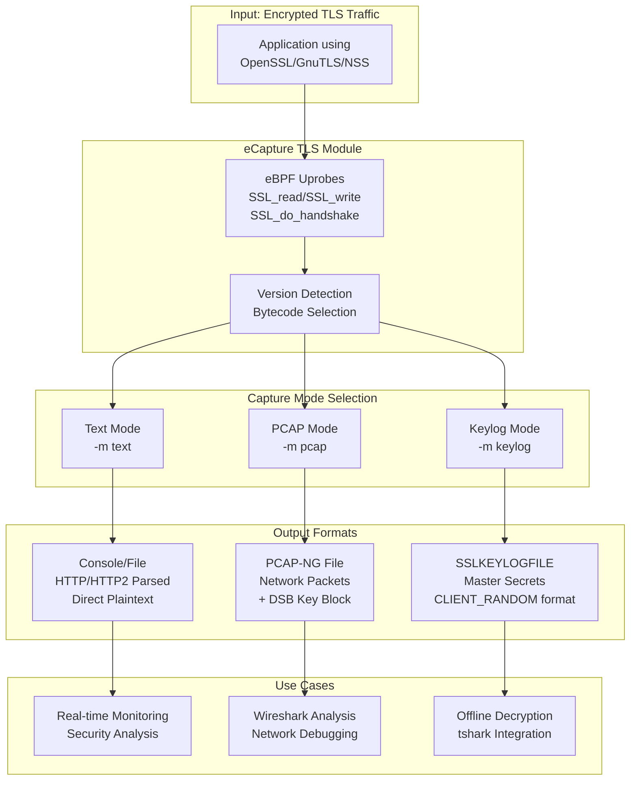
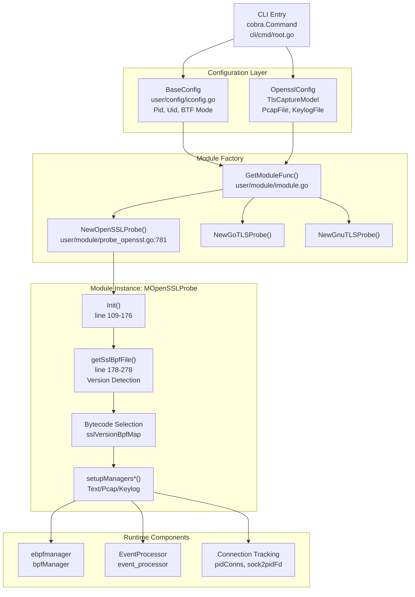
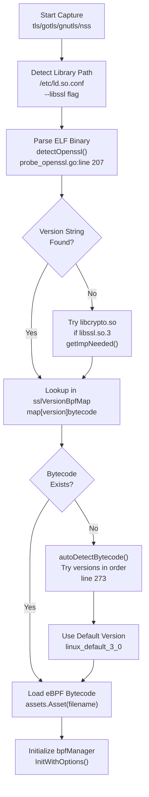

# TLS/SSL Modules

<details>
<summary>Relevant source files</summary>

The following files were used as context for generating this wiki page:

- [CHANGELOG.md](https://github.com/gojue/ecapture/blob/0766a93b/CHANGELOG.md)
- [README.md](https://github.com/gojue/ecapture/blob/0766a93b/README.md)
- [README_CN.md](https://github.com/gojue/ecapture/blob/0766a93b/README_CN.md)
- [cli/cmd/root.go](https://github.com/gojue/ecapture/blob/0766a93b/cli/cmd/root.go)
- [images/ecapture-help-v0.8.9.svg](https://github.com/gojue/ecapture/blob/0766a93b/images/ecapture-help-v0.8.9.svg)
- [main.go](https://github.com/gojue/ecapture/blob/0766a93b/main.go)
- [user/config/iconfig.go](https://github.com/gojue/ecapture/blob/0766a93b/user/config/iconfig.go)
- [user/module/imodule.go](https://github.com/gojue/ecapture/blob/0766a93b/user/module/imodule.go)
- [user/module/probe_openssl.go](https://github.com/gojue/ecapture/blob/0766a93b/user/module/probe_openssl.go)

</details>


## Purpose and Scope

This document provides an overview of eCapture's TLS/SSL capture modules, which enable plaintext capture of encrypted network traffic without requiring CA certificates or SSL/TLS library modifications. The TLS/SSL modules collectively support multiple encryption libraries including OpenSSL, BoringSSL, GnuTLS, and NSS/NSPR, offering three distinct capture modes: text output, PCAP packet capture, and keylog generation.

For detailed implementation of specific modules, see:
- OpenSSL/BoringSSL implementation: [OpenSSL Module](3.1.1-openssl-module.md)
- Go TLS implementation: [Go TLS Module](3.1.2-go-tls-module.md)
- GnuTLS and NSS implementations: [GnuTLS and NSS Modules](3.1.3-gnutls-and-nss-modules.md)
- Master secret extraction mechanics: [Master Secret Extraction](3.1.4-master-secret-extraction.md)

For network packet capture details, see [Network Packet Capture with TC](3.3-network-packet-capture-with-tc.md).

---

## Supported TLS/SSL Libraries

eCapture supports multiple TLS/SSL library implementations through dedicated modules. Each module uses eBPF uprobes to intercept encryption library functions and extract plaintext data or master secrets.

| Module Name | Supported Libraries | Version Coverage | Platform Support |
|-------------|-------------------|------------------|------------------|
| `tls` | OpenSSL, LibreSSL, BoringSSL | OpenSSL 1.0.2 - 3.5.x<br/>BoringSSL Android 12-16 | Linux x86_64/aarch64<br/>Android |
| `gotls` | Go crypto/tls | Go 1.8+ (all versions) | Linux x86_64/aarch64 |
| `gnutls` | GnuTLS | 3.x series | Linux x86_64/aarch64 |
| `nss` | NSS/NSPR (Firefox, Chrome) | NSS 3.x series | Linux x86_64/aarch64 |

**Sources:** [README.md:38-42](https://github.com/gojue/ecapture/blob/0766a93b/README.md#L38-L42), [CHANGELOG.md:202-204](https://github.com/gojue/ecapture/blob/0766a93b/CHANGELOG.md#L202-L204), [cli/cmd/root.go:152-161](https://github.com/gojue/ecapture/blob/0766a93b/cli/cmd/root.go#L152-L161)

---

## Capture Modes

All TLS/SSL modules support three operational modes that determine how captured data is processed and output. The mode is selected via the `-m` command-line flag.

### Capture Mode Comparison



**Sources:** [user/module/probe_openssl.go:58-76](https://github.com/gojue/ecapture/blob/0766a93b/user/module/probe_openssl.go#L58-L76), [user/config/iconfig.go:73-79](https://github.com/gojue/ecapture/blob/0766a93b/user/config/iconfig.go#L73-L79), [README.md:171-252](https://github.com/gojue/ecapture/blob/0766a93b/README.md#L171-L252)

### Mode Configuration Types

The capture mode is represented by the `TlsCaptureModelType` enumeration:

```go
type TlsCaptureModelType uint8

const (
    TlsCaptureModelTypePcap   TlsCaptureModelType = iota  // PCAP-NG format
    TlsCaptureModelTypeText                                // Text output
    TlsCaptureModelTypeKeylog                             // Keylog format
)
```

**Mode Selection Logic:**

1. **Text Mode** (`-m text` or default): Captures plaintext data and outputs directly to console or file. Supports HTTP/1.x and HTTP/2 protocol parsing for structured output.

2. **PCAP Mode** (`-m pcap` or `-m pcapng`): Captures network packets with plaintext payload and master secrets in PCAP-NG format. Requires `-i` (interface) and `--pcapfile` parameters. Supports Wireshark-compatible Decryption Secrets Block (DSB) for automatic decryption.

3. **Keylog Mode** (`-m keylog` or `-m key`): Captures only TLS master secrets in `SSLKEYLOGFILE` format compatible with Wireshark and tshark. Requires `--keylogfile` parameter (default: `ecapture_masterkey.log`).

**Sources:** [user/module/probe_openssl.go:128-154](https://github.com/gojue/ecapture/blob/0766a93b/user/module/probe_openssl.go#L128-L154), [README_CN.md:150-220](https://github.com/gojue/ecapture/blob/0766a93b/README_CN.md#L150-L220)

---

## Architecture Overview

### Module Initialization and Configuration Flow



**Sources:** [cli/cmd/root.go:249-403](https://github.com/gojue/ecapture/blob/0766a93b/cli/cmd/root.go#L249-L403), [user/module/probe_openssl.go:109-176](https://github.com/gojue/ecapture/blob/0766a93b/user/module/probe_openssl.go#L109-L176), [user/module/imodule.go:47-75](https://github.com/gojue/ecapture/blob/0766a93b/user/module/imodule.go#L47-L75)

### TLS Module State Management

The `MOpenSSLProbe` struct maintains critical state for TLS capture operations:

**Key Data Structures:**

| Field | Type | Purpose |
|-------|------|---------|
| `pidConns` | `map[uint32]map[uint32]ConnInfo` | Tracks connections by PID and file descriptor |
| `sock2pidFd` | `map[uint64][2]uint32` | Reverse lookup from socket to PID/FD for cleanup |
| `masterKeys` | `map[string]bool` | Deduplicates master secrets by client random |
| `eBPFProgramType` | `TlsCaptureModelType` | Active capture mode (Text/Pcap/Keylog) |
| `sslVersionBpfMap` | `map[string]string` | Maps SSL versions to eBPF bytecode files |
| `isBoringSSL` | `bool` | Indicates BoringSSL library detection |

**Connection Tracking Operations:**

- `AddConn(pid, fd, tuple, sock)`: Registers new connection from TC hook or connect syscall
- `GetConn(pid, fd)`: Retrieves connection tuple for data event correlation
- `DelConn(sock)`: Schedules connection cleanup after 3-second delay
- `DestroyConn(sock)`: Immediately removes connection from tracking maps

**Sources:** [user/module/probe_openssl.go:83-106](https://github.com/gojue/ecapture/blob/0766a93b/user/module/probe_openssl.go#L83-L106), [user/module/probe_openssl.go:398-481](https://github.com/gojue/ecapture/blob/0766a93b/user/module/probe_openssl.go#L398-L481)

---

## Version Detection and Bytecode Selection

eCapture automatically detects the SSL/TLS library version and selects appropriate eBPF bytecode to handle version-specific structure layouts.

### Version Detection Flow



**Sources:** [user/module/probe_openssl.go:178-278](https://github.com/gojue/ecapture/blob/0766a93b/user/module/probe_openssl.go#L178-L278), [user/module/probe_openssl.go:280-350](https://github.com/gojue/ecapture/blob/0766a93b/user/module/probe_openssl.go#L280-L350)

### Bytecode Naming Convention

eBPF bytecode files are named according to a specific pattern that encodes version, kernel compatibility, and CO-RE mode:

**Pattern:** `<library>_<version>_kern[_core|_noncore][_less52].o`

**Examples:**
- `openssl_3_0_0_kern_core.o` - OpenSSL 3.0.x, CO-RE mode, kernel ≥5.2
- `openssl_1_1_1_kern_noncore.o` - OpenSSL 1.1.x, non-CO-RE, kernel ≥5.2
- `boringssl_a_14_kern_core_less52.o` - BoringSSL Android 14, CO-RE, kernel <5.2

**Version Map Initialization:**

The `initOpensslOffset()` method populates `sslVersionBpfMap` with mappings like:

```
"openssl 1.1.1a" -> "openssl_1_1_1_kern.o"
"openssl 3.0.0"  -> "openssl_3_0_0_kern.o"
"boringssl"      -> "boringssl_a_13_kern.o"
```

**Sources:** [user/module/imodule.go:191-214](https://github.com/gojue/ecapture/blob/0766a93b/user/module/imodule.go#L191-L214), [CHANGELOG.md:14-24](https://github.com/gojue/ecapture/blob/0766a93b/CHANGELOG.md#L14-L24)

---

## Module Variants

### OpenSSL/BoringSSL Module (`tls`)

**Primary Implementation:** `MOpenSSLProbe` in [user/module/probe_openssl.go](https://github.com/gojue/ecapture/blob/0766a93b/user/module/probe_openssl.go)

**Supported Versions:**
- OpenSSL: 1.0.2 through 3.5.x
- BoringSSL: Android 12 (A12) through Android 16 (A16)
- LibreSSL: Compatible versions

**Key Hook Points:**
- `SSL_read` / `SSL_write` - Data capture
- `SSL_do_handshake` - Master secret extraction (OpenSSL)
- `SSL_get_wbio` - Bio/FD correlation
- `SSL_in_before` / `SSL_state` - Handshake state (version dependent)

**BoringSSL Specifics:**
- Uses `SSL_get_session` for master secret extraction
- Android version detection via `--androidver` flag
- Special offset handling for Android 12-16 variants

**Sources:** [user/module/probe_openssl.go:83-106](https://github.com/gojue/ecapture/blob/0766a93b/user/module/probe_openssl.go#L83-L106), [CHANGELOG.md:305-309](https://github.com/gojue/ecapture/blob/0766a93b/CHANGELOG.md#L305-L309), [README.md:163-169](https://github.com/gojue/ecapture/blob/0766a93b/README.md#L163-L169)

### Go TLS Module (`gotls`)

**Primary Implementation:** `MGoTLSProbe` (referenced but not in provided files)

**Capabilities:**
- Go binary analysis for TLS structure offsets
- PIE (Position Independent Executable) support
- Register vs Stack ABI detection
- Automatic `crypto/tls` version compatibility

**Hook Strategy:**
- `crypto/tls.(*Conn).Read` / `Write` for data
- `crypto/tls.(*Conn).handshakeContext` for keys
- Structure offset calculation from Go debug info

**Limitations:**
- Requires debug symbols or known Go version
- May need `--elfpath` parameter for stripped binaries

**Sources:** [README.md:254-276](https://github.com/gojue/ecapture/blob/0766a93b/README.md#L254-L276), [cli/cmd/root.go:156](https://github.com/gojue/ecapture/blob/0766a93b/cli/cmd/root.go#L156)

### GnuTLS Module (`gnutls`)

**Support Status:** Full capture support including keylog mode as of v1.3.0

**Hook Functions:**
- `gnutls_record_send` / `gnutls_record_recv` - Data capture
- `gnutls_handshake` - Master secret extraction
- Early secret support for TLS 1.3

**Output Modes:** Text, PCAP, Keylog (added in v1.3.0)

**Sources:** [README.md:155](https://github.com/gojue/ecapture/blob/0766a93b/README.md#L155), [CHANGELOG.md:126-127](https://github.com/gojue/ecapture/blob/0766a93b/CHANGELOG.md#L126-L127)

### NSS/NSPR Module (`nss`)

**Target Applications:**
- Firefox browser
- Chrome/Chromium (when built with NSS)
- Applications using NSS crypto library

**Hook Functions:**
- `PR_Read` / `PR_Write` (NSPR layer)
- `SSL_ImportFD` - Session initialization
- NSS-specific handshake functions

**Considerations:**
- May require special handling for `libnss3.so` path detection
- Chrome may use BoringSSL instead of NSS on some platforms

**Sources:** [README.md:158](https://github.com/gojue/ecapture/blob/0766a93b/README.md#L158), [CHANGELOG.md:402](https://github.com/gojue/ecapture/blob/0766a93b/CHANGELOG.md#L402)

---

## Key Capabilities

### 1. Master Secret Extraction

All TLS/SSL modules extract master secrets for both TLS 1.2 and TLS 1.3 protocols:

**TLS 1.2:**
- Client Random (32 bytes)
- Master Secret (48 bytes)
- Output format: `CLIENT_RANDOM <random> <master_key>`

**TLS 1.3:**
- Client Random (32 bytes)
- Handshake Secret
- Client/Server Handshake Traffic Secrets
- Client/Server Application Traffic Secrets
- Exporter Secret
- HKDF derivation using SHA256/SHA384

**Secret Storage:**
- Deduplication via `masterKeys` map keyed by client random
- Format compatible with `SSLKEYLOGFILE` environment variable
- Can be used with Wireshark's "Pre-Master-Secret log filename" setting

**Sources:** [user/module/probe_openssl.go:482-642](https://github.com/gojue/ecapture/blob/0766a93b/user/module/probe_openssl.go#L482-L642), [README.md:234-247](https://github.com/gojue/ecapture/blob/0766a93b/README.md#L234-L247)

### 2. Protocol Parsing

**Text Mode HTTP Support:**

The modules include built-in HTTP/1.x and HTTP/2 protocol parsers:

- HTTP/1.x: Request/response parsing with headers and body
- HTTP/2: Frame parsing including HEADERS, DATA, SETTINGS, PING
- HPACK header decompression for HTTP/2
- Automatic content-type detection and display

**Sources:** [CHANGELOG.md:487](https://github.com/gojue/ecapture/blob/0766a93b/CHANGELOG.md#L487), [cli/cmd/root.go:152](https://github.com/gojue/ecapture/blob/0766a93b/cli/cmd/root.go#L152)

### 3. Multi-Architecture Support

**Supported Platforms:**
- Linux x86_64: Kernel 4.18+
- Linux aarch64: Kernel 5.5+
- Android x86_64: Android 12+
- Android aarch64: Android 12+

**Cross-Compilation:**
- Dual-mode bytecode (CO-RE and non-CO-RE) in single binary
- Automatic BTF detection and mode selection
- Kernel version-specific bytecode variants (<5.2)

**Sources:** [README.md:14-16](https://github.com/gojue/ecapture/blob/0766a93b/README.md#L14-L16), [CHANGELOG.md:553-561](https://github.com/gojue/ecapture/blob/0766a93b/CHANGELOG.md#L553-L561)

### 4. Filtering and Targeting

**Process Filtering:**
- `--pid` flag: Target specific process ID
- `--uid` flag: Target specific user ID
- Default: Capture all processes/users

**Network Filtering (PCAP mode):**
- PCAP filter expression support (tcpdump syntax)
- Example: `tcp port 443`
- Applied via TC eBPF program instruction patching

**Sources:** [user/module/probe_openssl.go:361-387](https://github.com/gojue/ecapture/blob/0766a93b/user/module/probe_openssl.go#L361-L387), [README.md:183-184](https://github.com/gojue/ecapture/blob/0766a93b/README.md#L183-L184)

### 5. Connection Lifecycle Tracking

**4-Tuple Generation:**

The modules track network connections using 4-tuple information:
- Source IP:Port
- Destination IP:Port
- IPv4 and IPv6 support

**Tracking Mechanism:**
1. TC hook captures packets and generates 4-tuple
2. Kprobe on `tcp_sendmsg` / `__sys_connect` associates socket with PID/FD
3. SSL data events correlate with tuple via `pidConns` map
4. Connection cleanup on socket destroy or process exit

**Delayed Cleanup:**
- 3-second delay via `time.AfterFunc()` to handle race conditions
- Prevents premature deletion while events are in-flight
- Coordinated with EventProcessor merge interval

**Sources:** [user/module/probe_openssl.go:398-462](https://github.com/gojue/ecapture/blob/0766a93b/user/module/probe_openssl.go#L398-L462), [CHANGELOG.md:306-309](https://github.com/gojue/ecapture/blob/0766a93b/CHANGELOG.md#L306-L309)

---

## Configuration Parameters

### Common TLS Module Flags

| Flag | Type | Default | Description |
|------|------|---------|-------------|
| `-m, --model` | string | `text` | Capture mode: text/pcap/pcapng/keylog/key |
| `--libssl` | string | auto-detect | Path to SSL library or statically linked binary |
| `--pcapfile` | string | `ecapture_openssl.pcapng` | PCAP output file (pcap mode) |
| `--keylogfile` | string | `ecapture_masterkey.log` | Keylog output file (keylog mode) |
| `-i, --ifname` | string | - | Network interface (pcap mode, required) |
| `--pid` | uint64 | 0 | Target process ID (0 = all) |
| `--uid` | uint64 | 0 | Target user ID (0 = all) |
| `-b, --btf` | uint8 | 0 | BTF mode: 0=auto, 1=core, 2=non-core |

### Android-Specific Flags

| Flag | Type | Description |
|------|------|-------------|
| `--android` | bool | Enable Android/BoringSSL mode |
| `--androidver` | string | Android version (12-16) for bytecode selection |

**Sources:** [user/config/iconfig.go:73-93](https://github.com/gojue/ecapture/blob/0766a93b/user/config/iconfig.go#L73-L93), [cli/cmd/root.go:140-152](https://github.com/gojue/ecapture/blob/0766a93b/cli/cmd/root.go#L140-L152)

---

## Output Examples

### Text Mode Output

```
UUID:233479_233479_curl_5_1_39.156.66.10:443, Name:HTTPRequest, Type:1, Length:73
GET / HTTP/1.1
Host: baidu.com
Accept: */*
User-Agent: curl/7.81.0
```

**UUID Format:** `<pid>_<tid>_<comm>_<fd>_<direction>_<tuple>`

**Sources:** [README_CN.md:103-125](https://github.com/gojue/ecapture/blob/0766a93b/README_CN.md#L103-L125)

### PCAP Mode Output

- File format: PCAP-NG
- Contains: Network packets with plaintext payload
- Decryption Secrets Block (DSB): Embedded master secrets
- Compatible with: Wireshark, tshark, tcpdump

**Sources:** [README.md:187-232](https://github.com/gojue/ecapture/blob/0766a93b/README.md#L187-L232)

### Keylog Mode Output

```
CLIENT_RANDOM 5a6f2b3c... 1d8e9f0a...
CLIENT_HANDSHAKE_TRAFFIC_SECRET 5a6f2b3c... 8c7d6e5f...
SERVER_HANDSHAKE_TRAFFIC_SECRET 5a6f2b3c... 3b2a1c0d...
CLIENT_TRAFFIC_SECRET_0 5a6f2b3c... f9e8d7c6...
SERVER_TRAFFIC_SECRET_0 5a6f2b3c... b5a49382...
EXPORTER_SECRET 5a6f2b3c... 71625348...
```

**Usage with tshark:**
```bash
tshark -o tls.keylog_file:ecapture_masterkey.log -Y http -T fields -e http.file_data -f "port 443" -i eth0
```

**Sources:** [README.md:239-247](https://github.com/gojue/ecapture/blob/0766a93b/README.md#L239-L247), [user/module/probe_openssl.go:492-554](https://github.com/gojue/ecapture/blob/0766a93b/user/module/probe_openssl.go#L492-L554)