# OpenSSL Module

<details>
<summary>Relevant source files</summary>

The following files were used as context for generating this wiki page:

- [cli/cmd/root.go](https://github.com/gojue/ecapture/blob/0766a93b/cli/cmd/root.go)
- [kern/boringssl_const.h](https://github.com/gojue/ecapture/blob/0766a93b/kern/boringssl_const.h)
- [kern/boringssl_masterkey.h](https://github.com/gojue/ecapture/blob/0766a93b/kern/boringssl_masterkey.h)
- [kern/openssl_masterkey.h](https://github.com/gojue/ecapture/blob/0766a93b/kern/openssl_masterkey.h)
- [kern/openssl_masterkey_3.0.h](https://github.com/gojue/ecapture/blob/0766a93b/kern/openssl_masterkey_3.0.h)
- [user/config/iconfig.go](https://github.com/gojue/ecapture/blob/0766a93b/user/config/iconfig.go)
- [user/module/imodule.go](https://github.com/gojue/ecapture/blob/0766a93b/user/module/imodule.go)
- [user/module/probe_openssl.go](https://github.com/gojue/ecapture/blob/0766a93b/user/module/probe_openssl.go)
- [user/module/probe_openssl_lib.go](https://github.com/gojue/ecapture/blob/0766a93b/user/module/probe_openssl_lib.go)
- [utils/boringssl-offset.c](https://github.com/gojue/ecapture/blob/0766a93b/utils/boringssl-offset.c)
- [variables.mk](https://github.com/gojue/ecapture/blob/0766a93b/variables.mk)

</details>


The OpenSSL Module captures SSL/TLS plaintext traffic and master secrets from applications using OpenSSL or BoringSSL libraries. It supports multiple capture modes (text, pcap, keylog) and handles both TLS 1.2 and TLS 1.3 protocols across a wide range of library versions.

For information about other TLS/SSL modules, see Go TLS Module [3.1.2](3.1.2-go-tls-module.md) and GnuTLS/NSS modules [3.1.3](3.1.3-gnutls-and-nss-modules.md). For details on master secret extraction techniques, see [3.1.4](3.1.4-master-secret-extraction.md).

---

## Architecture Overview

The OpenSSL module consists of three primary subsystems: version detection and bytecode selection, eBPF probes for data capture, and userspace processing for output generation.

### Core Components

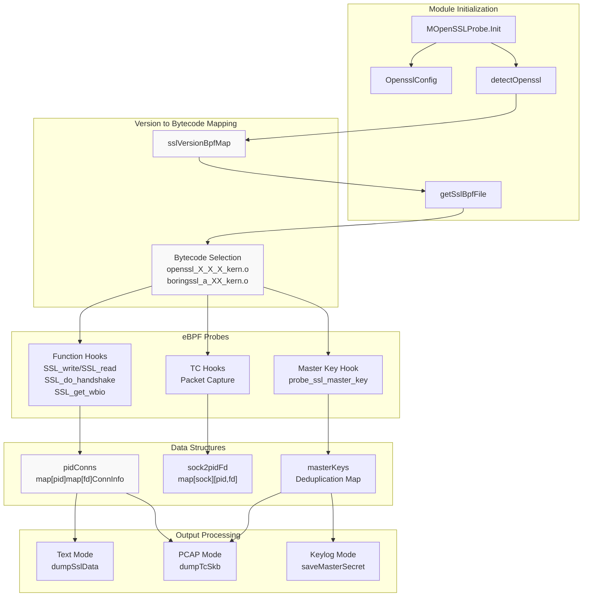

**MOpenSSLProbe Structure**: The main module struct `MOpenSSLProbe` embeds `MTCProbe` (for TC-based packet capture) and maintains several critical data structures for connection tracking and key management.

Sources: [user/module/probe_openssl.go:83-106](https://github.com/gojue/ecapture/blob/0766a93b/user/module/probe_openssl.go#L83-L106)

---

## Supported Library Versions

The module supports an extensive range of OpenSSL and BoringSSL versions through version-specific bytecode variants.

### Version Support Matrix

| Library | Version Range | Bytecode Files | Notes |
|---------|--------------|----------------|-------|
| OpenSSL | 1.0.2a-1.0.2u | `openssl_1_0_2a_kern.o` | Requires `SSL_state` hook |
| OpenSSL | 1.1.0a-1.1.0l | `openssl_1_1_0a_kern.o` | Standard hooks |
| OpenSSL | 1.1.1a-1.1.1w | `openssl_1_1_1{a,b,d,j}_kern.o` | Four offset groups |
| OpenSSL | 3.0.0-3.0.17 | `openssl_3_0_{0,12}_kern.o` | 3.0.12 has unique offsets |
| OpenSSL | 3.1.0-3.1.8 | `openssl_3_1_0_kern.o` | Shares offsets with 3.0 |
| OpenSSL | 3.2.0-3.2.5 | `openssl_3_2_{0,3,4}_kern.o` | Three offset variants |
| OpenSSL | 3.3.0-3.3.4 | `openssl_3_3_{0,2,3}_kern.o` | Three offset variants |
| OpenSSL | 3.4.0-3.4.2 | `openssl_3_4_{0,1}_kern.o` | Two offset variants |
| OpenSSL | 3.5.0-3.5.4 | `openssl_3_5_0_kern.o` | Latest supported |
| BoringSSL | Android 12-16 | `boringssl_a_{13,14,15,16}_kern.o` | Android-specific |
| BoringSSL | Non-Android | `boringssl_na_kern.o` | General BoringSSL |

The version mapping is initialized in `initOpensslOffset()` which populates the `sslVersionBpfMap` with version-to-bytecode mappings.

Sources: [user/module/probe_openssl_lib.go:73-187](https://github.com/gojue/ecapture/blob/0766a93b/user/module/probe_openssl_lib.go#L73-L187), [variables.mk:190-213](https://github.com/gojue/ecapture/blob/0766a93b/variables.mk#L190-L213)

---

## Version Detection Mechanism

Version detection is a critical phase that determines which eBPF bytecode to load for proper structure offset handling.

### Detection Flow

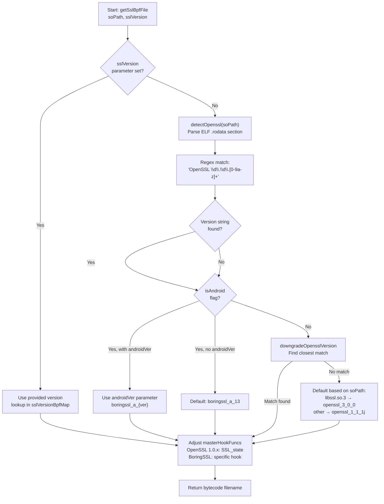

**ELF Parsing**: The `detectOpenssl()` function opens the shared library as an ELF file and searches the `.rodata` section for the OpenSSL version string using regex pattern `(OpenSSL\s\d\.\d\.[0-9a-z]+)`.

**Fallback Strategy**: When version detection fails, the module attempts progressively:
1. Check for `libcrypto.so.3` if `libssl.so.3` doesn't contain version info
2. Use Android-specific bytecode if `isAndroid` flag is set
3. Apply `downgradeOpensslVersion()` to find closest matching version
4. Fall back to default bytecode based on library path

**Special Cases**:
- OpenSSL 1.0.x requires using `SSL_state` hook instead of `SSL_in_before` (a macro)
- OpenSSL 3.0.12 has unique offsets different from 3.0.0-3.0.11 and 3.0.13-3.0.17
- BoringSSL version is often "1.1.1" but requires Android version-specific bytecode

Sources: [user/module/probe_openssl.go:179-278](https://github.com/gojue/ecapture/blob/0766a93b/user/module/probe_openssl.go#L179-L278), [user/module/probe_openssl_lib.go:189-282](https://github.com/gojue/ecapture/blob/0766a93b/user/module/probe_openssl_lib.go#L189-L282), [user/module/probe_openssl_lib.go:284-369](https://github.com/gojue/ecapture/blob/0766a93b/user/module/probe_openssl_lib.go#L284-L369)

---

## Hook Points and eBPF Probes

The module attaches uprobes to strategic SSL/TLS library functions to intercept plaintext data and master secrets.

### Primary Hook Functions

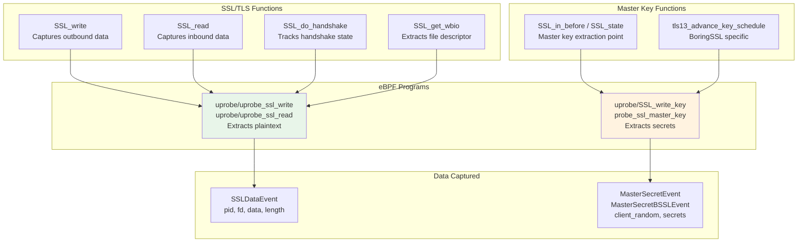

**Data Capture Hooks**: The probes on `SSL_write` and `SSL_read` capture plaintext data before encryption and after decryption. The `SSL_get_wbio` hook extracts the underlying socket file descriptor for connection tracking.

**Master Key Hooks**: The hook point for master secret extraction varies by library:
- **OpenSSL 1.1.0+**: `SSL_in_before` function
- **OpenSSL 1.0.x**: `SSL_state` function (since `SSL_in_before` is a macro)
- **BoringSSL**: `tls13_advance_key_schedule` function

The list of master key hook functions is configured in `masterHookFuncs` array and adjusted during initialization based on detected version.

Sources: [user/module/probe_openssl.go:104](https://github.com/gojue/ecapture/blob/0766a93b/user/module/probe_openssl.go#L104), [user/module/probe_openssl.go:179-196](https://github.com/gojue/ecapture/blob/0766a93b/user/module/probe_openssl.go#L179-L196), [kern/openssl_masterkey.h:80-257](https://github.com/gojue/ecapture/blob/0766a93b/kern/openssl_masterkey.h#L80-L257), [kern/boringssl_masterkey.h:169-403](https://github.com/gojue/ecapture/blob/0766a93b/kern/boringssl_masterkey.h#L169-L403)

---

## Connection Tracking System

The module maintains bidirectional mappings between processes, file descriptors, and network sockets to associate captured data with connections.

### Connection Tracking Data Structures

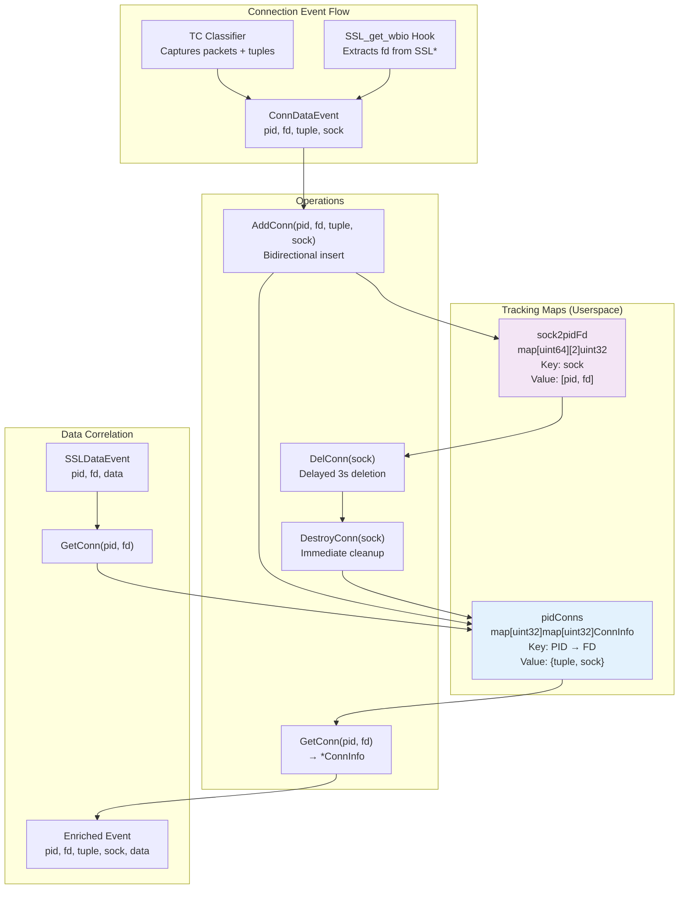

**ConnInfo Structure**: Each connection is represented by a `ConnInfo` struct containing the network 4-tuple (src/dst IP:port) and socket pointer.

**Bidirectional Lookup**: 
- `pidConns`: Maps `(pid, fd)` → `ConnInfo` for enriching SSL data events
- `sock2pidFd`: Maps `sock` → `(pid, fd)` for connection cleanup when socket closes

**Lifecycle Management**:
- **AddConn**: Called when TC hook or SSL_get_wbio captures connection metadata
- **GetConn**: Retrieves tuple for a given `(pid, fd)` pair when processing SSL data
- **DelConn**: Schedules delayed deletion (3 seconds) to allow event processing to complete
- **DestroyConn**: Performs actual cleanup, notifies event processor

The 3-second delay in `DelConn` ensures that any in-flight events can still be correlated before the connection metadata is removed.

Sources: [user/module/probe_openssl.go:78-81](https://github.com/gojue/ecapture/blob/0766a93b/user/module/probe_openssl.go#L78-L81), [user/module/probe_openssl.go:91-94](https://github.com/gojue/ecapture/blob/0766a93b/user/module/probe_openssl.go#L91-L94), [user/module/probe_openssl.go:398-481](https://github.com/gojue/ecapture/blob/0766a93b/user/module/probe_openssl.go#L398-L481), [user/module/probe_openssl.go:756-775](https://github.com/gojue/ecapture/blob/0766a93b/user/module/probe_openssl.go#L756-L775)

---

## Master Secret Extraction

Master secrets enable decryption of captured TLS traffic. The extraction technique differs between TLS 1.2 and TLS 1.3 due to different key derivation mechanisms.

### TLS 1.2 Master Secret Extraction

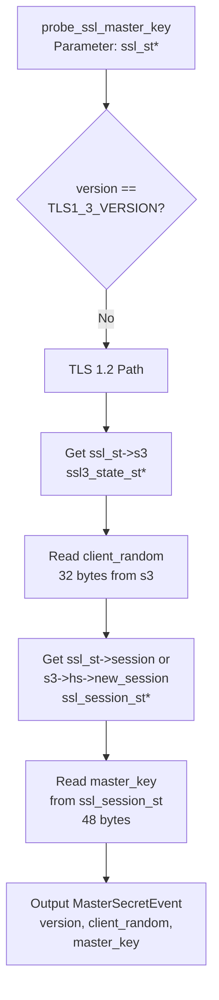

**TLS 1.2 Structure Navigation** (OpenSSL):
1. `ssl_st->s3` → `ssl3_state_st*`
2. `ssl3_state_st->client_random` (32 bytes)
3. `ssl_st->session` → `ssl_session_st*`
4. `ssl_session_st->master_key` (48 bytes)

**TLS 1.2 Structure Navigation** (BoringSSL):
1. `ssl_st->s3` → `bssl::SSL3_STATE*`
2. `ssl3_state->client_random` (32 bytes)
3. `ssl3_state->hs` → `bssl::SSL_HANDSHAKE*`
4. `ssl_handshake->new_session` or `ssl_st->session` → `ssl_session_st*`
5. `ssl_session_st->secret` and `ssl_session_st->secret_length`

The handshake state is checked to ensure the handshake is complete (`state >= CLIENT_STATE12_SEND_CLIENT_FINISHED` for BoringSSL).

Sources: [kern/openssl_masterkey.h:82-169](https://github.com/gojue/ecapture/blob/0766a93b/kern/openssl_masterkey.h#L82-L169), [kern/boringssl_masterkey.h:170-342](https://github.com/gojue/ecapture/blob/0766a93b/kern/boringssl_masterkey.h#L170-L342), [kern/openssl_masterkey_3.0.h:82-165](https://github.com/gojue/ecapture/blob/0766a93b/kern/openssl_masterkey_3.0.h#L82-L165)

### TLS 1.3 Master Secret Extraction

TLS 1.3 uses multiple derived secrets instead of a single master key. The extraction is more complex:

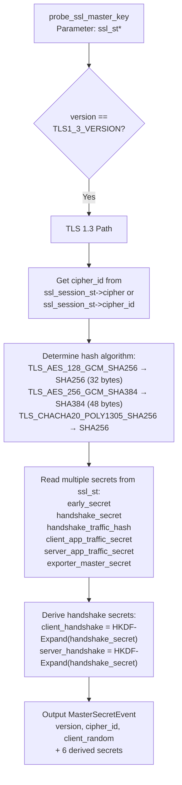

**TLS 1.3 Structure Navigation** (OpenSSL):
1. `ssl_st->s3->client_random` (32 bytes) - OpenSSL 3.0+ has client_random directly in ssl_st
2. `ssl_st->session->cipher->id` → cipher suite ID
3. From `ssl_st`, read multiple secrets (each up to 64 bytes):
   - `early_secret` (offset `SSL_ST_EARLY_SECRET`)
   - `handshake_secret` (offset `SSL_ST_HANDSHAKE_SECRET`)
   - `handshake_traffic_hash` (offset `SSL_ST_HANDSHAKE_TRAFFIC_HASH`)
   - `client_app_traffic_secret` (offset `SSL_ST_CLIENT_APP_TRAFFIC_SECRET`)
   - `server_app_traffic_secret` (offset `SSL_ST_SERVER_APP_TRAFFIC_SECRET`)
   - `exporter_master_secret` (offset `SSL_ST_EXPORTER_MASTER_SECRET`)

**TLS 1.3 Structure Navigation** (BoringSSL):
1. `ssl_st->s3->client_random` from `bssl::SSL3_STATE`
2. `ssl_st->s3->hs->hash_len` for secret length
3. `ssl_st->s3->hs->client_version` to verify TLS 1.3
4. Check handshake state: `tls13_state >= CLIENT_STATE13_READ_SERVER_FINISHED`
5. From `ssl_handshake`, read private member secrets (calculated offsets):
   - `early_traffic_secret_` (offset `SSL_HANDSHAKE_EARLY_TRAFFIC_SECRET_`)
   - `client_handshake_secret_` (offset `SSL_HANDSHAKE_CLIENT_HANDSHAKE_SECRET_`)
   - `server_handshake_secret_` (offset `SSL_HANDSHAKE_SERVER_HANDSHAKE_SECRET_`)
   - `client_traffic_secret_0_` (offset `SSL_HANDSHAKE_CLIENT_TRAFFIC_SECRET_0_`)
   - `server_traffic_secret_0_` (offset `SSL_HANDSHAKE_SERVER_TRAFFIC_SECRET_0_`)
6. From `ssl_st->s3`, read:
   - `exporter_secret` (offset `BSSL__SSL3_STATE_EXPORTER_SECRET`)

**HKDF Derivation**: For OpenSSL TLS 1.3, the handshake traffic secrets must be derived using HKDF-Expand-Label in userspace since OpenSSL stores only the base `handshake_secret`. The derivation uses labels "c hs traffic" and "s hs traffic" with the handshake transcript hash.

**BoringSSL Private Members**: BoringSSL stores TLS 1.3 secrets as private members in the `SSL_HANDSHAKE` struct. The offsets are calculated by adding `SSL_MAX_MD_SIZE` (48 bytes) for each secret after the `hash_len_` field. See `SSL_HANDSHAKE_SECRET_` through `SSL_HANDSHAKE_EXPECTED_CLIENT_FINISHED_` constant definitions.

Sources: [kern/openssl_masterkey.h:171-257](https://github.com/gojue/ecapture/blob/0766a93b/kern/openssl_masterkey.h#L171-L257), [kern/boringssl_masterkey.h:343-403](https://github.com/gojue/ecapture/blob/0766a93b/kern/boringssl_masterkey.h#L343-L403), [kern/openssl_masterkey_3.0.h:167-253](https://github.com/gojue/ecapture/blob/0766a93b/kern/openssl_masterkey_3.0.h#L167-L253), [kern/boringssl_const.h:1-63](https://github.com/gojue/ecapture/blob/0766a93b/kern/boringssl_const.h#L1-L63), [user/module/probe_openssl.go:518-551](https://github.com/gojue/ecapture/blob/0766a93b/user/module/probe_openssl.go#L518-L551)

### Keylog Format Generation

Captured master secrets are formatted according to the NSS Key Log format (SSLKEYLOGFILE):

**TLS 1.2 Format**:
```
CLIENT_RANDOM <client_random_hex> <master_key_hex>
```

**TLS 1.3 Format**:
```
CLIENT_HANDSHAKE_TRAFFIC_SECRET <client_random_hex> <secret_hex>
SERVER_HANDSHAKE_TRAFFIC_SECRET <client_random_hex> <secret_hex>
CLIENT_TRAFFIC_SECRET_0 <client_random_hex> <secret_hex>
SERVER_TRAFFIC_SECRET_0 <client_random_hex> <secret_hex>
EXPORTER_SECRET <client_random_hex> <secret_hex>
```

The `client_random` (32 bytes) serves as the key for deduplication—each unique client random is only written once to the keylog file. The `masterKeys` map tracks which client randoms have been processed.

Sources: [user/module/probe_openssl.go:482-642](https://github.com/gojue/ecapture/blob/0766a93b/user/module/probe_openssl.go#L482-L642), [user/module/probe_openssl.go:98](https://github.com/gojue/ecapture/blob/0766a93b/user/module/probe_openssl.go#L98)

---

## Capture Modes

The module supports three distinct capture modes, configured via the `OpensslConfig.Model` field.

### Capture Mode Comparison

| Mode | Output Format | Use Case | Data Captured |
|------|--------------|----------|---------------|
| Text | Human-readable text | Real-time monitoring | Plaintext SSL data + HTTP/HTTP2 parsing |
| PCAP | PCAP-NG file | Network analysis | Raw packets + DSB with master secrets |
| Keylog | SSLKEYLOGFILE | Traffic decryption | Master secrets only |

### Text Mode

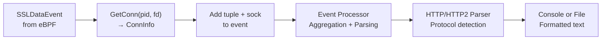

**Text Mode Flow**:
1. `SSLDataEvent` captured by uprobe contains `pid`, `fd`, `data`, `data_len`
2. `dumpSslData()` calls `GetConn(pid, fd)` to retrieve connection tuple
3. Event enriched with tuple and socket pointer
4. Sent to event processor which aggregates fragments and detects HTTP/HTTP2
5. Parsed events output as formatted text

Text mode is the default and provides immediate visibility into decrypted traffic with automatic protocol parsing.

Sources: [user/module/probe_openssl.go:756-775](https://github.com/gojue/ecapture/blob/0766a93b/user/module/probe_openssl.go#L756-L775), [user/module/probe_openssl.go:152-153](https://github.com/gojue/ecapture/blob/0766a93b/user/module/probe_openssl.go#L152-L153)

### PCAP Mode

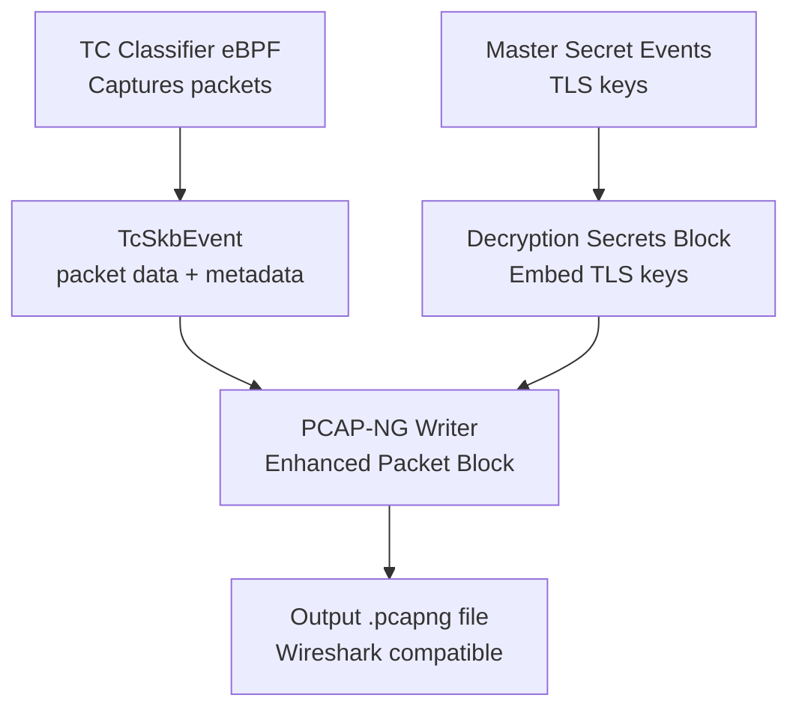

**PCAP Mode Features**:
- **Packet Capture**: TC eBPF classifier captures raw network packets (ingress/egress)
- **Decryption Secrets Block (DSB)**: Master secrets embedded in PCAP-NG file using DSB format
- **4-Tuple Filtering**: Can filter packets by source/destination IP/port via BPF instructions
- **Wireshark Integration**: Generated files can be directly opened in Wireshark for decryption

The `setupManagersPcap()` function configures TC hooks on network interfaces, while `savePcapngSslKeyLog()` writes master secrets as DSB records.

PCAP mode is ideal for offline analysis and sharing captures with standard network analysis tools.

Sources: [user/module/probe_openssl.go:138-148](https://github.com/gojue/ecapture/blob/0766a93b/user/module/probe_openssl.go#L138-L148), [user/module/probe_openssl.go:288-289](https://github.com/gojue/ecapture/blob/0766a93b/user/module/probe_openssl.go#L288-L289)

### Keylog Mode

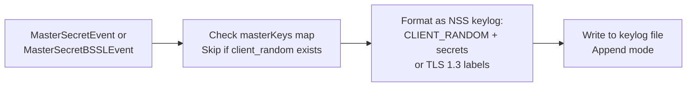

**Keylog Mode Characteristics**:
- **Output**: Standard SSLKEYLOGFILE format compatible with browsers and tools
- **Deduplication**: Uses `client_random` as key to prevent duplicate entries
- **TLS Version Support**: Handles both TLS 1.2 (single master key) and TLS 1.3 (multiple derived secrets)
- **File Management**: Opens keylog file in append mode with 0600 permissions

The keylog file can be used with:
- Wireshark (Edit → Preferences → Protocols → TLS → Pre-Master-Secret log filename)
- Browsers for debugging encrypted traffic
- Other tools that support NSS Key Log format

Keylog mode is the most lightweight option when only master secrets are needed for decryption.

Sources: [user/module/probe_openssl.go:129-136](https://github.com/gojue/ecapture/blob/0766a93b/user/module/probe_openssl.go#L129-L136), [user/module/probe_openssl.go:482-642](https://github.com/gojue/ecapture/blob/0766a93b/user/module/probe_openssl.go#L482-L642), [user/module/probe_openssl.go:288](https://github.com/gojue/ecapture/blob/0766a93b/user/module/probe_openssl.go#L288)

---

## Initialization and Lifecycle

The module follows the standard IModule lifecycle with specialized setup for SSL/TLS interception.

### Module Lifecycle

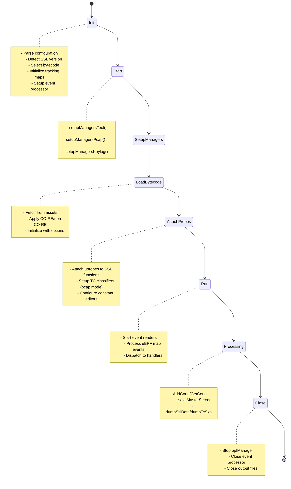

**Initialization Steps** (`Init`):
1. Call base `Module.Init()` for common setup
2. Initialize connection tracking maps (`pidConns`, `sock2pidFd`, `masterKeys`)
3. Determine capture mode from configuration
4. Open output files (keylog or PCAP)
5. Call `initOpensslOffset()` to populate version-to-bytecode map
6. Call `getSslBpfFile()` to detect version and select bytecode
7. Set `masterHookFuncs` based on detected library (OpenSSL vs BoringSSL)

**Start Phase**:
- Calls appropriate setup function based on `eBPFProgramType`
- Configures `ebpfmanager` with probes and maps
- Applies constant editors for PID/UID filtering
- Loads bytecode from embedded assets
- Initializes decode functions for eBPF maps

**Runtime Processing**:
- Event readers continuously poll eBPF maps (perf arrays or ring buffers)
- Events dispatched via `Dispatcher()` to appropriate handlers
- Connection lifecycle managed through `AddConn`, `GetConn`, `DelConn` operations

**Cleanup** (`Close`):
- Stop `bpfManager` with `CleanAll` flag
- Close event processor
- Close keylog file (if open)
- Call base `Module.Close()`

Sources: [user/module/probe_openssl.go:109-176](https://github.com/gojue/ecapture/blob/0766a93b/user/module/probe_openssl.go#L109-L176), [user/module/probe_openssl.go:280-350](https://github.com/gojue/ecapture/blob/0766a93b/user/module/probe_openssl.go#L280-L350), [user/module/probe_openssl.go:352-358](https://github.com/gojue/ecapture/blob/0766a93b/user/module/probe_openssl.go#L352-L358), [user/module/probe_openssl.go:733-754](https://github.com/gojue/ecapture/blob/0766a93b/user/module/probe_openssl.go#L733-L754)

---

## Configuration

The OpenSSL module is configured via the `OpensslConfig` struct.

### Configuration Parameters

| Parameter | Type | Purpose | Default |
|-----------|------|---------|---------|
| `Pid` | uint64 | Target process ID (0 = all) | 0 |
| `Uid` | uint64 | Target user ID (0 = all) | 0 |
| `Model` | string | Capture mode: text/pcap/keylog | text |
| `KeylogFile` | string | Path to keylog output file | - |
| `PcapFile` | string | Path to PCAP output file | - |
| `PcapFilter` | string | BPF filter for packet capture | "" |
| `SslVersion` | string | Manual version override | "" |
| `IsAndroid` | bool | Android environment flag | false |
| `AndroidVer` | string | Android API level (13-16) | "" |
| `CGroupPath` | string | cgroup path for filtering | "" |
| `BtfMode` | uint8 | BTF mode: 0=auto, 1=core, 2=non-core | 0 |

**Manual Version Override**: Setting `SslVersion` bypasses automatic detection. Useful for Android where version detection may be unreliable. Examples:
- `--ssl_version='boringssl_a_13'` for Android 12
- `--ssl_version='openssl 3.0.0'` for specific OpenSSL version

**PCAP Filter**: When using PCAP mode, `PcapFilter` applies BPF filtering to captured packets. The filter is compiled into eBPF instruction patches applied to TC classifiers.

Sources: [user/config/iconfig.go:73-79](https://github.com/gojue/ecapture/blob/0766a93b/user/config/iconfig.go#L73-L79), [cli/cmd/root.go:157-175](https://github.com/gojue/ecapture/blob/0766a93b/cli/cmd/root.go#L157-L175)

---

## Integration with Event Processing

The OpenSSL module dispatches events to the central event processing system for aggregation, parsing, and output.

### Event Types and Handlers

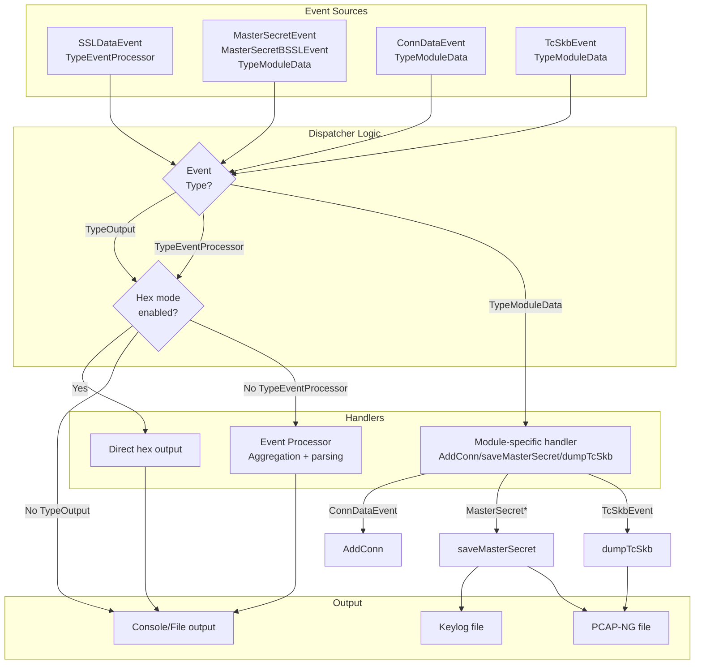

**Event Type Routing**:
- `TypeEventProcessor`: SSL data events sent to event processor for aggregation and HTTP parsing
- `TypeModuleData`: Module-internal events (connections, master secrets, packets) handled by module
- `TypeOutput`: Pre-formatted output events sent directly to output writer

**Module-Specific Handlers**:
- `ConnDataEvent`: Calls `AddConn()` or `DelConn()` based on `IsDestroy` flag
- `MasterSecretEvent`/`MasterSecretBSSLEvent`: Calls `saveMasterSecret()` or `saveMasterSecretBSSL()`
- `TcSkbEvent`: Calls `dumpTcSkb()` to write packet to PCAP-NG
- `SSLDataEvent`: Calls `dumpSslData()` to enrich and forward to processor

The `Dispatcher()` method implements this routing logic, checking the `isClosed` flag to prevent processing events after shutdown.

Sources: [user/module/probe_openssl.go:733-754](https://github.com/gojue/ecapture/blob/0766a93b/user/module/probe_openssl.go#L733-L754), [user/module/imodule.go:408-448](https://github.com/gojue/ecapture/blob/0766a93b/user/module/imodule.go#L408-L448)

---

## Structure Offset Calculation

Capturing master secrets requires reading from internal SSL/TLS library structures. Since these structures vary by version, precise offset calculation is critical.

### Offset Calculation Approaches

**1. Automated Offset Generation** (BoringSSL):

The `boringssl-offset.c` utility uses C's `offsetof()` macro to calculate structure member offsets at compile time:

```c
#define X(struct_name, field_name) \
    format(#struct_name, #field_name, offsetof(struct struct_name, field_name));

SSL_STRUCT_OFFSETS
```

This generates header file constants like:
```c
#define SSL_ST_S3 0x18
#define BSSL__SSL3_STATE_HS 0x30
#define SSL_SESSION_ST_SECRET 0x48
```

**2. Manual Offset Mapping** (OpenSSL):

For OpenSSL, offsets are manually determined for each major version by:
- Analyzing OpenSSL source code structure definitions
- Verifying offsets across minor version updates
- Creating version-specific header files (e.g., `openssl_1_1_1j_offset.h`)

**3. Private Member Handling** (BoringSSL TLS 1.3):

BoringSSL stores TLS 1.3 secrets as private members in `SSL_HANDSHAKE`. Since `offsetof()` cannot access private members, offsets are calculated by:
- Finding the last public member (`max_version`)
- Adding size with memory alignment
- Computing cumulative offsets for each secret field

Example calculation in `boringssl_const.h`:
```c
// max_version is at offset 30, sizeof(uint16_t) = 2
// Memory aligned to 8-byte boundary
#define SSL_HANDSHAKE_HASH_LEN_ roundup(30+2, 8)  // = 32
#define SSL_HANDSHAKE_SECRET_ (32 + 8)  // hash_len_ is size_t (8 bytes)
#define SSL_HANDSHAKE_EARLY_TRAFFIC_SECRET_ (40 + 48*1)
#define SSL_HANDSHAKE_CLIENT_HANDSHAKE_SECRET_ (40 + 48*2)
// ... each secret is SSL_MAX_MD_SIZE (48 bytes) apart
```

**Version-Specific Challenges**:
- OpenSSL 3.0+ moved `client_random` directly into `ssl_st` structure
- OpenSSL 3.0.12 has unique offsets different from other 3.0.x versions
- Android BoringSSL changes offsets between API levels

Sources: [utils/boringssl-offset.c:1-79](https://github.com/gojue/ecapture/blob/0766a93b/utils/boringssl-offset.c#L1-L79), [kern/boringssl_const.h:1-63](https://github.com/gojue/ecapture/blob/0766a93b/kern/boringssl_const.h#L1-L63), [user/module/probe_openssl_lib.go:73-187](https://github.com/gojue/ecapture/blob/0766a93b/user/module/probe_openssl_lib.go#L73-L187)

---

## Performance Considerations

**Connection Tracking Overhead**: The bidirectional maps (`pidConns`, `sock2pidFd`) use mutexes for thread safety. Connections are only added/removed on socket events, not per-packet, minimizing lock contention.

**Event Buffer Sizing**: The per-CPU map size (default 1024 * PAGE_SIZE) affects how many events can be buffered before dropping. Increase via `--mapsize` flag for high-throughput scenarios.

**Delayed Connection Cleanup**: The 3-second delay in `DelConn()` prevents premature removal of connection metadata while events are still being processed by the event processor. This trades memory for correctness.

**Master Key Deduplication**: The `masterKeys` map prevents writing duplicate entries to the keylog file. Each entry is indexed by `client_random` hex string, ensuring O(1) lookup.

**PCAP Mode Overhead**: TC-based packet capture has lower overhead than traditional libpcap since it operates entirely in kernel space. However, it captures all packets on the interface, which may include non-SSL traffic unless filtered.

Sources: [user/module/probe_openssl.go:94](https://github.com/gojue/ecapture/blob/0766a93b/user/module/probe_openssl.go#L94), [user/module/probe_openssl.go:98](https://github.com/gojue/ecapture/blob/0766a93b/user/module/probe_openssl.go#L98), [user/module/probe_openssl.go:454-462](https://github.com/gojue/ecapture/blob/0766a93b/user/module/probe_openssl.go#L454-L462), [cli/cmd/root.go:143](https://github.com/gojue/ecapture/blob/0766a93b/cli/cmd/root.go#L143)

---

## Error Handling and Fallbacks

**Version Detection Failures**: When `detectOpenssl()` fails to find a version string:
1. Try reading from `libcrypto.so.3` instead of `libssl.so.3`
2. Apply `downgradeOpensslVersion()` to find closest matching version
3. Fall back to default bytecode based on library path pattern
4. Log warnings with suggestions for manual version specification

**Bytecode Selection Failures**: If no bytecode matches the detected version, the module uses conservative defaults:
- `openssl_1_1_1j_kern.o` for general Linux OpenSSL
- `openssl_3_0_0_kern.o` for `libssl.so.3`
- `boringssl_a_13_kern.o` for Android

**Master Secret Extraction Errors**: The eBPF probes include extensive error checking with debug logging. If reading a field fails, the probe typically returns early rather than sending partial/corrupted data. Common failure scenarios:
- Handshake not yet complete (state checks prevent premature capture)
- Null pointers for session structures (fallback session retrieval logic)
- Invalid memory addresses (bpf_probe_read_user returns error)

**Connection Tracking Errors**: When `GetConn()` fails to find a connection (e.g., SSL data event arrives before TC event):
- Event is still processed with default tuple `"0.0.0.0:0-0.0.0.0:0"`
- Logged for debugging purposes
- Does not block SSL data capture

Sources: [user/module/probe_openssl_lib.go:206-278](https://github.com/gojue/ecapture/blob/0766a93b/user/module/probe_openssl_lib.go#L206-L278), [user/module/probe_openssl_lib.go:284-317](https://github.com/gojue/ecapture/blob/0766a93b/user/module/probe_openssl_lib.go#L284-L317), [user/module/probe_openssl.go:756-775](https://github.com/gojue/ecapture/blob/0766a93b/user/module/probe_openssl.go#L756-L775)