# OpenSSL Module

<details>
<summary>Relevant source files</summary>

The following files were used as context for generating this wiki page:

- [cli/cmd/root.go](https://github.com/gojue/ecapture/blob/ca085d05/cli/cmd/root.go)
- [kern/openssl.h](https://github.com/gojue/ecapture/blob/ca085d05/kern/openssl.h)
- [kern/openssl_masterkey.h](https://github.com/gojue/ecapture/blob/ca085d05/kern/openssl_masterkey.h)
- [kern/openssl_masterkey_3.0.h](https://github.com/gojue/ecapture/blob/ca085d05/kern/openssl_masterkey_3.0.h)
- [user/config/iconfig.go](https://github.com/gojue/ecapture/blob/ca085d05/user/config/iconfig.go)
- [user/module/imodule.go](https://github.com/gojue/ecapture/blob/ca085d05/user/module/imodule.go)
- [user/module/probe_openssl.go](https://github.com/gojue/ecapture/blob/ca085d05/user/module/probe_openssl.go)
- [user/module/probe_openssl_keylog.go](https://github.com/gojue/ecapture/blob/ca085d05/user/module/probe_openssl_keylog.go)
- [user/module/probe_openssl_lib.go](https://github.com/gojue/ecapture/blob/ca085d05/user/module/probe_openssl_lib.go)
- [user/module/probe_openssl_text.go](https://github.com/gojue/ecapture/blob/ca085d05/user/module/probe_openssl_text.go)
- [utils/openssl_offset_3.0.sh](https://github.com/gojue/ecapture/blob/ca085d05/utils/openssl_offset_3.0.sh)
- [utils/openssl_offset_3.1.sh](https://github.com/gojue/ecapture/blob/ca085d05/utils/openssl_offset_3.1.sh)
- [utils/openssl_offset_3.2.sh](https://github.com/gojue/ecapture/blob/ca085d05/utils/openssl_offset_3.2.sh)
- [utils/openssl_offset_3.3.sh](https://github.com/gojue/ecapture/blob/ca085d05/utils/openssl_offset_3.3.sh)
- [utils/openssl_offset_3.4.sh](https://github.com/gojue/ecapture/blob/ca085d05/utils/openssl_offset_3.4.sh)
- [utils/openssl_offset_3.5.sh](https://github.com/gojue/ecapture/blob/ca085d05/utils/openssl_offset_3.5.sh)

</details>


## Purpose and Scope

The OpenSSL Module captures TLS/SSL plaintext traffic and master secrets from applications using the OpenSSL library (versions 1.0.x, 1.1.x, and 3.x). It uses eBPF uprobes to hook into `SSL_read` and `SSL_write` functions without requiring application modification or root CA certificates. The module supports three output modes: text (plaintext display), pcap (network packet capture), and keylog (master secret extraction for decryption).

For BoringSSL support (Android and non-Android variants), see [BoringSSL Module](3.1.2-boringssl-module.md). For Go TLS capture, see [Go TLS Module](3.1.3-go-tls-module.md). For master secret extraction implementation details across all libraries, see [Master Secret Extraction](3.1.5-master-secret-extraction.md).

**Sources:** [user/module/probe_openssl.go:15-106](https://github.com/gojue/ecapture/blob/ca085d05/user/module/probe_openssl.go#L15-L106), [cli/cmd/root.go:86-101](https://github.com/gojue/ecapture/blob/ca085d05/cli/cmd/root.go#L86-L101)

---

## Supported OpenSSL Versions

The module supports a wide range of OpenSSL versions through intelligent bytecode selection and offset grouping:

| Version Range | Bytecode File | Offset Groups |
|--------------|---------------|---------------|
| 1.0.2a - 1.0.2u | `openssl_1_0_2a_kern.o` | Single group (26 versions) |
| 1.1.0a - 1.1.0l | `openssl_1_1_0a_kern.o` | Single group (12 versions) |
| 1.1.1a | `openssl_1_1_1a_kern.o` | Group A |
| 1.1.1b - 1.1.1c | `openssl_1_1_1b_kern.o` | Group B |
| 1.1.1d - 1.1.1i | `openssl_1_1_1d_kern.o` | Group C |
| 1.1.1j - 1.1.1w | `openssl_1_1_1j_kern.o` | Group D |
| 3.0.0 - 3.0.11, 3.0.13 - 3.0.17 | `openssl_3_0_0_kern.o` | Standard 3.0.x |
| 3.0.12 | `openssl_3_0_12_kern.o` | Special case (unique offsets) |
| 3.1.0 - 3.1.8 | `openssl_3_1_0_kern.o` | Compatible with 3.0.x |
| 3.2.0 - 3.2.2 | `openssl_3_2_0_kern.o` | 3.2 base group |
| 3.2.3 | `openssl_3_2_3_kern.o` | 3.2 variant A |
| 3.2.4 - 3.2.5 | `openssl_3_2_4_kern.o` | 3.2 variant B |
| 3.3.0 - 3.3.1 | `openssl_3_3_0_kern.o` | 3.3 base group |
| 3.3.2 | `openssl_3_3_2_kern.o` | 3.3 variant A |
| 3.3.3 - 3.3.4 | `openssl_3_3_3_kern.o` | 3.3 variant B |
| 3.4.0 | `openssl_3_4_0_kern.o` | 3.4 base |
| 3.4.1 - 3.4.2 | `openssl_3_4_1_kern.o` | 3.4 variant |
| 3.5.0 - 3.5.4 | `openssl_3_5_0_kern.o` | 3.5 base group |

**Note:** OpenSSL 3.0.12 is a special case where internal structure offsets differ from surrounding versions (3.0.11 and 3.0.13), requiring dedicated bytecode.

**Sources:** [user/module/probe_openssl_lib.go:30-62](https://github.com/gojue/ecapture/blob/ca085d05/user/module/probe_openssl_lib.go#L30-L62), [user/module/probe_openssl_lib.go:73-187](https://github.com/gojue/ecapture/blob/ca085d05/user/module/probe_openssl_lib.go#L73-L187)

---

## Version Detection and Bytecode Selection

### Detection Process

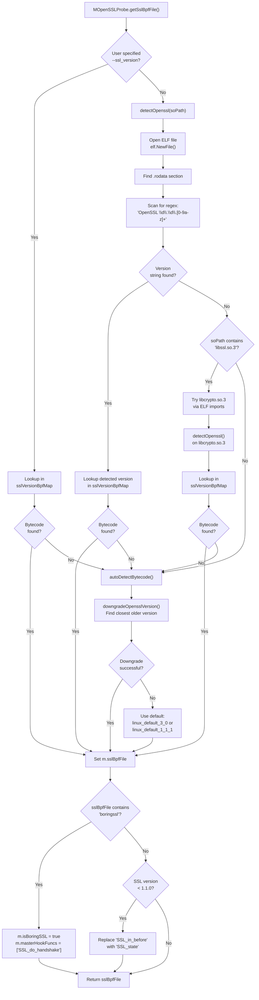
```mermaid
flowchart TD
    Start["MOpenSSLProbe.getSslBpfFile()"] --> CheckUserVer{"User specified<br/>--ssl_version?"}
    CheckUserVer -->|Yes| LookupMap["Lookup in<br/>sslVersionBpfMap"]
    CheckUserVer -->|No| DetectELF["detectOpenssl(soPath)"]
    
    DetectELF --> OpenELF["Open ELF file<br/>elf.NewFile()"]
    OpenELF --> FindRodata["Find .rodata section"]
    FindRodata --> ScanSection["Scan for regex:<br/>'OpenSSL \\d\\.\\d\\.[0-9a-z]+'"]
    ScanSection --> VersionFound{"Version<br/>string found?"}
    
    VersionFound -->|Yes| LookupDetected["Lookup detected version<br/>in sslVersionBpfMap"]
    VersionFound -->|No| CheckLibSSL3{"soPath contains<br/>'libssl.so.3'?"}
    
    CheckLibSSL3 -->|Yes| TryLibcrypto["Try libcrypto.so.3<br/>via ELF imports"]
    CheckLibSSL3 -->|No| AutoDetect["autoDetectBytecode()"]
    
    TryLibcrypto --> DetectLibcrypto["detectOpenssl()<br/>on libcrypto.so.3"]
    DetectLibcrypto --> LookupLibcrypto["Lookup in<br/>sslVersionBpfMap"]
    
    LookupMap --> Found1{"Bytecode<br/>found?"}
    LookupDetected --> Found2{"Bytecode<br/>found?"}
    LookupLibcrypto --> Found3{"Bytecode<br/>found?"}
    
    Found1 -->|Yes| SetBpfFile["Set m.sslBpfFile"]
    Found2 -->|Yes| SetBpfFile
    Found3 -->|Yes| SetBpfFile
    
    Found1 -->|No| AutoDetect
    Found2 -->|No| AutoDetect
    Found3 -->|No| AutoDetect
    
    AutoDetect --> Downgrade["downgradeOpensslVersion()<br/>Find closest older version"]
    Downgrade --> DefaultFallback{"Downgrade<br/>successful?"}
    
    DefaultFallback -->|Yes| SetBpfFile
    DefaultFallback -->|No| UseDefault["Use default:<br/>linux_default_3_0 or<br/>linux_default_1_1_1"]
    UseDefault --> SetBpfFile
    
    SetBpfFile --> CheckBoringSSL{"sslBpfFile contains<br/>'boringssl'?"}
    CheckBoringSSL -->|Yes| SetBoringSSLFlag["m.isBoringSSL = true<br/>m.masterHookFuncs = ['SSL_do_handshake']"]
    CheckBoringSSL -->|No| CheckOldVersion{"SSL version<br/>< 1.1.0?"}
    
    CheckOldVersion -->|Yes| ReplaceHook["Replace 'SSL_in_before'<br/>with 'SSL_state'"]
    CheckOldVersion -->|No| End["Return sslBpfFile"]
    
    SetBoringSSLFlag --> End
    ReplaceHook --> End
```

**Version Detection Algorithm**

The `detectOpenssl` function performs binary analysis on the OpenSSL shared library:

1. **ELF Parsing**: Opens the shared library as an ELF file and validates architecture (x86_64 or aarch64)
2. **Section Scanning**: Locates the `.rodata` section containing read-only data
3. **Version String Extraction**: Reads the section in 1MB chunks, searching for the regex pattern `(OpenSSL\s\d\.\d\.[0-9a-z]+)`
4. **Edge Case Handling**: Uses overlapping reads (subtracting 30 bytes per iteration) to handle version strings split across buffer boundaries

**Sources:** [user/module/probe_openssl.go:178-278](https://github.com/gojue/ecapture/blob/ca085d05/user/module/probe_openssl.go#L178-L278), [user/module/probe_openssl_lib.go:189-282](https://github.com/gojue/ecapture/blob/ca085d05/user/module/probe_openssl_lib.go#L189-L282)

### Downgrade Strategy

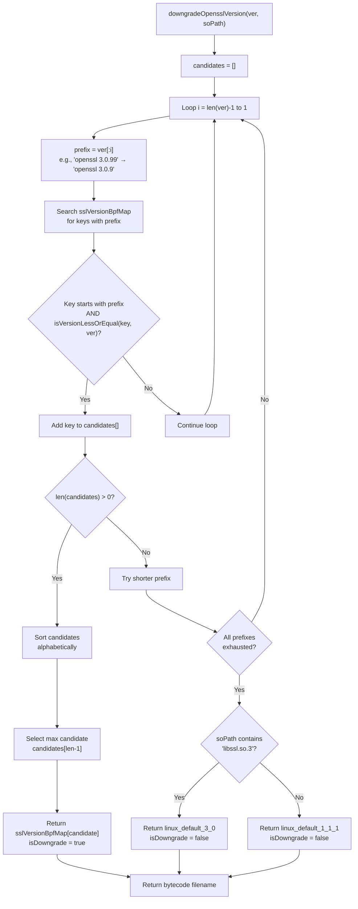
```mermaid
flowchart TD
    Start["downgradeOpensslVersion(ver, soPath)"] --> InitCandidates["candidates = []"]
    InitCandidates --> LoopPrefix["Loop i = len(ver)-1 to 1"]
    
    LoopPrefix --> CreatePrefix["prefix = ver[:i]<br/>e.g., 'openssl 3.0.99' → 'openssl 3.0.9'"]
    CreatePrefix --> SearchMap["Search sslVersionBpfMap<br/>for keys with prefix"]
    
    SearchMap --> CheckVersion{"Key starts with prefix<br/>AND isVersionLessOrEqual(key, ver)?"}
    CheckVersion -->|Yes| AddCandidate["Add key to candidates[]"]
    CheckVersion -->|No| Continue["Continue loop"]
    
    AddCandidate --> CheckCandidates{"len(candidates) > 0?"}
    Continue --> LoopPrefix
    
    CheckCandidates -->|Yes| SortCandidates["Sort candidates<br/>alphabetically"]
    CheckCandidates -->|No| NextPrefix["Try shorter prefix"]
    
    SortCandidates --> SelectMax["Select max candidate<br/>candidates[len-1]"]
    SelectMax --> ReturnBytecode["Return sslVersionBpfMap[candidate]<br/>isDowngrade = true"]
    
    NextPrefix --> AllPrefixesTried{"All prefixes<br/>exhausted?"}
    AllPrefixesTried -->|Yes| UseDefault{"soPath contains<br/>'libssl.so.3'?"}
    AllPrefixesTried -->|No| LoopPrefix
    
    UseDefault -->|Yes| Return30["Return linux_default_3_0<br/>isDowngrade = false"]
    UseDefault -->|No| Return111["Return linux_default_1_1_1<br/>isDowngrade = false"]
    
    ReturnBytecode --> End["Return bytecode filename"]
    Return30 --> End
    Return111 --> End
```

**Version Comparison Logic**

The `isVersionLessOrEqual` function compares version strings by:
- Stripping the "openssl " prefix
- Splitting by dots (e.g., `3.0.12` → `["3", "0", "12"]`)
- Parsing each segment into numeric and alphabetic parts (e.g., `12a` → `(12, "a")`)
- Comparing numerically first, then alphabetically for suffixes

**Sources:** [user/module/probe_openssl_lib.go:341-422](https://github.com/gojue/ecapture/blob/ca085d05/user/module/probe_openssl_lib.go#L341-L422), [user/module/probe_openssl_lib.go:284-317](https://github.com/gojue/ecapture/blob/ca085d05/user/module/probe_openssl_lib.go#L284-L317)

---

## eBPF Hook Architecture

### Uprobe Hook Points

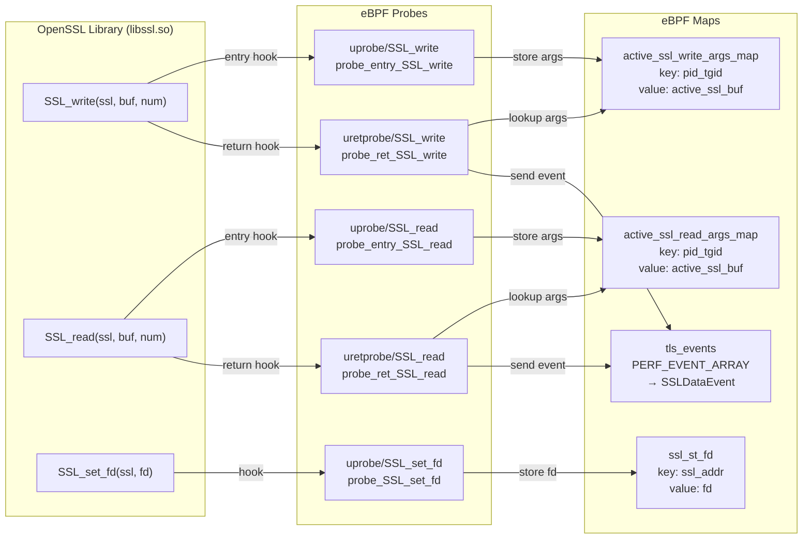
```mermaid
flowchart LR
    subgraph "OpenSSL Library (libssl.so)"
        SSL_write["SSL_write(ssl, buf, num)"]
        SSL_read["SSL_read(ssl, buf, num)"]
        SSL_set_fd["SSL_set_fd(ssl, fd)"]
    end
    
    subgraph "eBPF Probes"
        entry_write["uprobe/SSL_write<br/>probe_entry_SSL_write"]
        ret_write["uretprobe/SSL_write<br/>probe_ret_SSL_write"]
        entry_read["uprobe/SSL_read<br/>probe_entry_SSL_read"]
        ret_read["uretprobe/SSL_read<br/>probe_ret_SSL_read"]
        setfd["uprobe/SSL_set_fd<br/>probe_SSL_set_fd"]
    end
    
    subgraph "eBPF Maps"
        write_args["active_ssl_write_args_map<br/>key: pid_tgid<br/>value: active_ssl_buf"]
        read_args["active_ssl_read_args_map<br/>key: pid_tgid<br/>value: active_ssl_buf"]
        ssl_fd_map["ssl_st_fd<br/>key: ssl_addr<br/>value: fd"]
        tls_events["tls_events<br/>PERF_EVENT_ARRAY<br/>→ SSLDataEvent"]
    end
    
    SSL_write -->|"entry hook"| entry_write
    SSL_write -->|"return hook"| ret_write
    SSL_read -->|"entry hook"| entry_read
    SSL_read -->|"return hook"| ret_read
    SSL_set_fd -->|"hook"| setfd
    
    entry_write -->|"store args"| write_args
    entry_read -->|"store args"| read_args
    ret_write -->|"lookup args"| write_args
    ret_read -->|"lookup args"| read_args
    setfd -->|"store fd"| ssl_fd_map
    
    ret_write -->|"send event"| tls_events
    ret_read -->|"send event"| tls_events
```

**Uprobe Implementation Details**

The two-stage probe pattern works as follows:

1. **Entry Probe** (`probe_entry_SSL`):
   - Captures SSL context pointer (`PT_REGS_PARM1`) and buffer pointer (`PT_REGS_PARM2`)
   - Reads SSL version from `ssl->version` offset
   - Calls `process_SSL_bio()` to extract file descriptor and BIO type from `ssl->bio->num`
   - Stores context in `active_ssl_*_args_map` keyed by `pid_tgid`

2. **Return Probe** (`probe_ret_SSL`):
   - Retrieves return value (bytes read/written) from `PT_REGS_RC`
   - Looks up stored context from entry probe
   - Calls `process_SSL_data()` to read actual buffer data using `bpf_probe_read_user()`
   - Sends `ssl_data_event_t` to userspace via perf event array

**Sources:** [kern/openssl.h:268-323](https://github.com/gojue/ecapture/blob/ca085d05/kern/openssl.h#L268-L323), [kern/openssl.h:164-191](https://github.com/gojue/ecapture/blob/ca085d05/kern/openssl.h#L164-L191), [user/module/probe_openssl_text.go:46-151](https://github.com/gojue/ecapture/blob/ca085d05/user/module/probe_openssl_text.go#L46-L151)

### Connection Tracking Integration

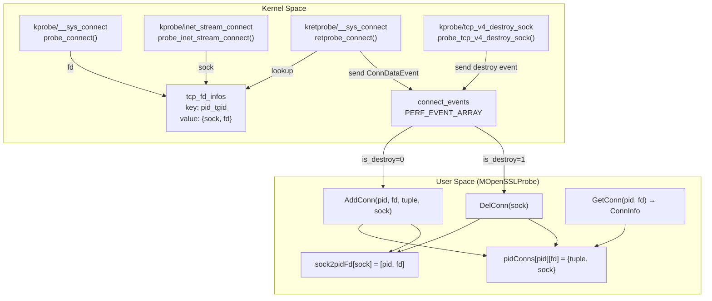
```mermaid
flowchart TD
    subgraph "Kernel Space"
        sys_connect["kprobe/__sys_connect<br/>probe_connect()"]
        inet_stream["kprobe/inet_stream_connect<br/>probe_inet_stream_connect()"]
        ret_connect["kretprobe/__sys_connect<br/>retprobe_connect()"]
        tcp_destroy["kprobe/tcp_v4_destroy_sock<br/>probe_tcp_v4_destroy_sock()"]
        
        tcp_fd_map["tcp_fd_infos<br/>key: pid_tgid<br/>value: {sock, fd}"]
        connect_events["connect_events<br/>PERF_EVENT_ARRAY"]
    end
    
    subgraph "User Space (MOpenSSLProbe)"
        AddConn["AddConn(pid, fd, tuple, sock)"]
        DelConn["DelConn(sock)"]
        GetConn["GetConn(pid, fd) → ConnInfo"]
        
        pidConns["pidConns[pid][fd] = {tuple, sock}"]
        sock2pidFd["sock2pidFd[sock] = [pid, fd]"]
    end
    
    sys_connect -->|"fd"| tcp_fd_map
    inet_stream -->|"sock"| tcp_fd_map
    ret_connect -->|"lookup"| tcp_fd_map
    ret_connect -->|"send ConnDataEvent"| connect_events
    tcp_destroy -->|"send destroy event"| connect_events
    
    connect_events -->|"is_destroy=0"| AddConn
    connect_events -->|"is_destroy=1"| DelConn
    
    AddConn --> pidConns
    AddConn --> sock2pidFd
    DelConn --> sock2pidFd
    DelConn --> pidConns
    
    GetConn --> pidConns
```

**Connection Lifecycle Management**

The module maintains bidirectional mappings between process/file descriptors and network connections:

- **pidConns**: `map[pid]map[fd]{tuple, sock}` - Lookup connection info by process and file descriptor
- **sock2pidFd**: `map[sock][pid, fd]` - Reverse lookup for cleanup on socket destruction

When `SSLDataEvent` is processed, `GetConn(pid, fd)` retrieves the tuple (source:port-dest:port) and socket pointer, enriching the captured data with network context.

**Sources:** [user/module/probe_openssl.go:83-106](https://github.com/gojue/ecapture/blob/ca085d05/user/module/probe_openssl.go#L83-L106), [user/module/probe_openssl.go:406-488](https://github.com/gojue/ecapture/blob/ca085d05/user/module/probe_openssl.go#L406-L488), [kern/openssl.h:374-525](https://github.com/gojue/ecapture/blob/ca085d05/kern/openssl.h#L374-L525)

---

## Structure Offset Calculation

### Offset Generation Process

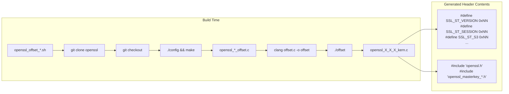
```mermaid
flowchart LR
    subgraph "Build Time"
        Script["openssl_offset_*.sh"]
        CloneRepo["git clone openssl"]
        Checkout["git checkout <tag>"]
        Configure["./config && make"]
        OffsetC["openssl_*_offset.c"]
        Compile["clang offset.c -o offset"]
        Execute["./offset"]
        HeaderC["openssl_X_X_X_kern.c"]
    end
    
    subgraph "Generated Header Contents"
        Defines["#define SSL_ST_VERSION 0xNN<br/>#define SSL_ST_SESSION 0xNN<br/>#define SSL_ST_S3 0xNN<br/>..."]
        Includes["#include 'openssl.h'<br/>#include 'openssl_masterkey_*.h'"]
    end
    
    Script --> CloneRepo
    CloneRepo --> Checkout
    Checkout --> Configure
    Configure --> OffsetC
    OffsetC --> Compile
    Compile --> Execute
    Execute --> HeaderC
    
    HeaderC --> Defines
    HeaderC --> Includes
```

**Offset Extraction Mechanism**

The offset generation scripts automate the process of extracting structure member offsets from OpenSSL source code:

1. **Repository Setup**: Clone or fetch OpenSSL repository at `deps/openssl`
2. **Version Iteration**: Loop through supported versions (e.g., 3.0.0 to 3.0.17)
3. **Build Configuration**: Run `./config` and `make build_generated` to generate headers
4. **Offset Compilation**: Compile `offset.c` which uses `offsetof()` macro to calculate structure member positions
5. **Header Generation**: Execute the compiled binary to output C preprocessor defines

**Example Offset Output** (from `offset.c`):
```c
printf("#define SSL_ST_VERSION %d\n", offsetof(struct ssl_st, version));
printf("#define SSL_ST_SESSION %d\n", offsetof(struct ssl_st, session));
printf("#define SSL_SESSION_ST_MASTER_KEY %d\n", offsetof(struct ssl_session_st, master_key));
```

**Sources:** [utils/openssl_offset_3.0.sh:1-95](https://github.com/gojue/ecapture/blob/ca085d05/utils/openssl_offset_3.0.sh#L1-L95), [utils/openssl_offset_3.2.sh:1-82](https://github.com/gojue/ecapture/blob/ca085d05/utils/openssl_offset_3.2.sh#L1-L82), [utils/openssl_offset_3.3.sh:1-82](https://github.com/gojue/ecapture/blob/ca085d05/utils/openssl_offset_3.3.sh#L1-L82)

### OpenSSL 3.x Structural Changes

Starting with OpenSSL 3.2.0, internal structures were refactored:

| OpenSSL Version | Structure Changes | Offset Mapping |
|----------------|-------------------|----------------|
| 3.0.x, 3.1.x | Direct `ssl_st` members | `SSL_ST_VERSION`, `SSL_ST_WBIO`, `SSL_ST_RBIO` |
| 3.2.x onwards | Indirection via `ssl_connection_st` | `SSL_CONNECTION_ST_VERSION`, `SSL_CONNECTION_ST_WBIO`, etc.<br/>Mapped back via `#define SSL_ST_VERSION SSL_CONNECTION_ST_VERSION` |

The mapping layer allows the eBPF code to use consistent symbolic names (`SSL_ST_*`) while the actual offset values differ based on the OpenSSL version's internal structure layout.

**Sources:** [utils/openssl_offset_3.2.sh:58-67](https://github.com/gojue/ecapture/blob/ca085d05/utils/openssl_offset_3.2.sh#L58-L67), [utils/openssl_offset_3.3.sh:58-67](https://github.com/gojue/ecapture/blob/ca085d05/utils/openssl_offset_3.3.sh#L58-L67)

---

## Master Secret Extraction

### TLS 1.2 vs TLS 1.3 Architecture

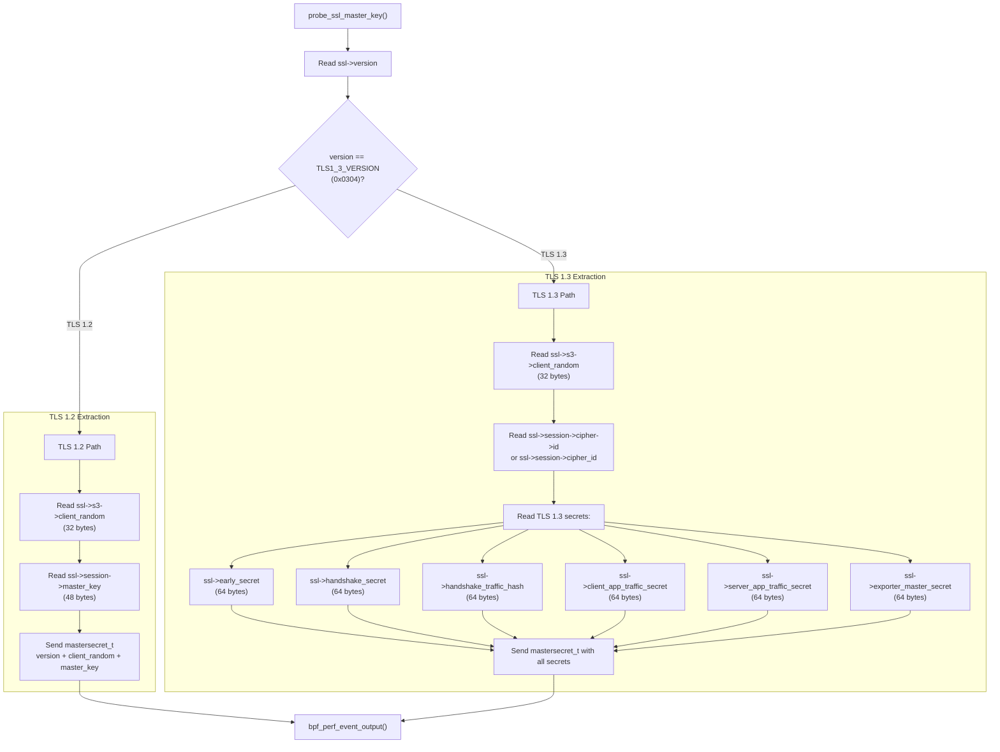
```mermaid
flowchart TD
    Start["probe_ssl_master_key()"] --> ReadVersion["Read ssl->version"]
    ReadVersion --> CheckVersion{"version == TLS1_3_VERSION<br/>(0x0304)?"}
    
    CheckVersion -->|"TLS 1.2"| TLS12Path["TLS 1.2 Path"]
    CheckVersion -->|"TLS 1.3"| TLS13Path["TLS 1.3 Path"]
    
    subgraph "TLS 1.2 Extraction"
        TLS12Path --> ReadClientRandom12["Read ssl->s3->client_random<br/>(32 bytes)"]
        ReadClientRandom12 --> ReadMasterKey["Read ssl->session->master_key<br/>(48 bytes)"]
        ReadMasterKey --> SendTLS12["Send mastersecret_t<br/>version + client_random + master_key"]
    end
    
    subgraph "TLS 1.3 Extraction"
        TLS13Path --> ReadClientRandom13["Read ssl->s3->client_random<br/>(32 bytes)"]
        ReadClientRandom13 --> ReadCipherID["Read ssl->session->cipher->id<br/>or ssl->session->cipher_id"]
        ReadCipherID --> ReadSecrets["Read TLS 1.3 secrets:"]
        
        ReadSecrets --> EarlySecret["ssl->early_secret<br/>(64 bytes)"]
        ReadSecrets --> HandshakeSecret["ssl->handshake_secret<br/>(64 bytes)"]
        ReadSecrets --> HandshakeTrafficHash["ssl->handshake_traffic_hash<br/>(64 bytes)"]
        ReadSecrets --> ClientAppSecret["ssl->client_app_traffic_secret<br/>(64 bytes)"]
        ReadSecrets --> ServerAppSecret["ssl->server_app_traffic_secret<br/>(64 bytes)"]
        ReadSecrets --> ExporterSecret["ssl->exporter_master_secret<br/>(64 bytes)"]
        
        EarlySecret --> SendTLS13["Send mastersecret_t with all secrets"]
        HandshakeSecret --> SendTLS13
        HandshakeTrafficHash --> SendTLS13
        ClientAppSecret --> SendTLS13
        ServerAppSecret --> SendTLS13
        ExporterSecret --> SendTLS13
    end
    
    SendTLS12 --> End["bpf_perf_event_output()"]
    SendTLS13 --> End
```

**Master Secret Structure**

The `mastersecret_t` structure accommodates both TLS 1.2 and 1.3:

```c
struct mastersecret_t {
    // Common fields
    s32 version;                                    // TLS version
    u8 client_random[SSL3_RANDOM_SIZE];            // 32 bytes
    
    // TLS 1.2 specific
    u8 master_key[MASTER_SECRET_MAX_LEN];          // 48 bytes
    
    // TLS 1.3 specific
    u32 cipher_id;
    u8 early_secret[EVP_MAX_MD_SIZE];              // 64 bytes
    u8 handshake_secret[EVP_MAX_MD_SIZE];          // 64 bytes
    u8 handshake_traffic_hash[EVP_MAX_MD_SIZE];    // 64 bytes
    u8 client_app_traffic_secret[EVP_MAX_MD_SIZE]; // 64 bytes
    u8 server_app_traffic_secret[EVP_MAX_MD_SIZE]; // 64 bytes
    u8 exporter_master_secret[EVP_MAX_MD_SIZE];    // 64 bytes
};
```

**Sources:** [kern/openssl_masterkey.h:25-39](https://github.com/gojue/ecapture/blob/ca085d05/kern/openssl_masterkey.h#L25-L39), [kern/openssl_masterkey.h:81-251](https://github.com/gojue/ecapture/blob/ca085d05/kern/openssl_masterkey.h#L81-L251), [kern/openssl_masterkey_3.0.h:82-247](https://github.com/gojue/ecapture/blob/ca085d05/kern/openssl_masterkey_3.0.h#L82-L247)

### Keylog File Generation (TLS 1.3)

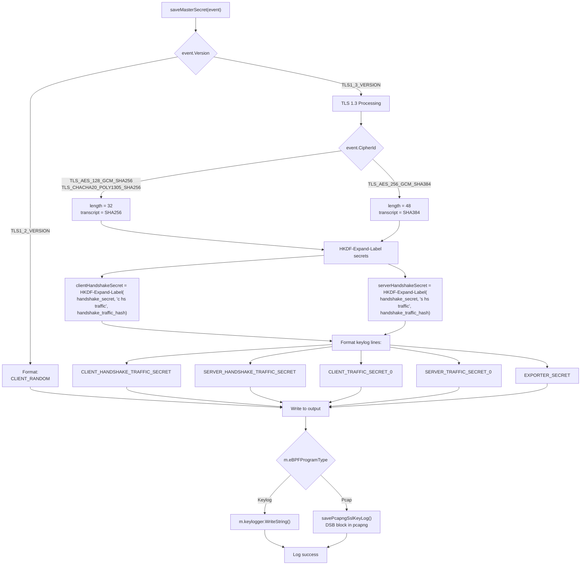
```mermaid
flowchart TD
    Start["saveMasterSecret(event)"] --> CheckVersion{"event.Version"}
    
    CheckVersion -->|"TLS1_2_VERSION"| TLS12Format["Format:<br/>CLIENT_RANDOM <client_random> <master_key>"]
    CheckVersion -->|"TLS1_3_VERSION"| TLS13Process["TLS 1.3 Processing"]
    
    TLS13Process --> DetermineCipher{"event.CipherId"}
    DetermineCipher -->|"TLS_AES_128_GCM_SHA256<br/>TLS_CHACHA20_POLY1305_SHA256"| SetLen32["length = 32<br/>transcript = SHA256"]
    DetermineCipher -->|"TLS_AES_256_GCM_SHA384"| SetLen48["length = 48<br/>transcript = SHA384"]
    
    SetLen32 --> ExpandSecrets["HKDF-Expand-Label secrets"]
    SetLen48 --> ExpandSecrets
    
    ExpandSecrets --> ClientHS["clientHandshakeSecret = HKDF-Expand-Label(<br/>handshake_secret, 'c hs traffic', handshake_traffic_hash)"]
    ExpandSecrets --> ServerHS["serverHandshakeSecret = HKDF-Expand-Label(<br/>handshake_secret, 's hs traffic', handshake_traffic_hash)"]
    
    ClientHS --> FormatLines["Format keylog lines:"]
    ServerHS --> FormatLines
    
    FormatLines --> Line1["CLIENT_HANDSHAKE_TRAFFIC_SECRET <cr> <chs>"]
    FormatLines --> Line2["SERVER_HANDSHAKE_TRAFFIC_SECRET <cr> <shs>"]
    FormatLines --> Line3["CLIENT_TRAFFIC_SECRET_0 <cr> <cats>"]
    FormatLines --> Line4["SERVER_TRAFFIC_SECRET_0 <cr> <sats>"]
    FormatLines --> Line5["EXPORTER_SECRET <cr> <ems>"]
    
    TLS12Format --> WriteOutput["Write to output"]
    Line1 --> WriteOutput
    Line2 --> WriteOutput
    Line3 --> WriteOutput
    Line4 --> WriteOutput
    Line5 --> WriteOutput
    
    WriteOutput --> CheckMode{"m.eBPFProgramType"}
    CheckMode -->|"Keylog"| WriteFile["m.keylogger.WriteString()"]
    CheckMode -->|"Pcap"| WriteDSB["savePcapngSslKeyLog()<br/>DSB block in pcapng"]
    
    WriteFile --> End["Log success"]
    WriteDSB --> End
```

**HKDF Key Derivation for TLS 1.3**

TLS 1.3 uses HKDF (HMAC-based Key Derivation Function) to derive traffic secrets from handshake secrets. The eBPF program captures the raw `handshake_secret` and `handshake_traffic_hash`, and userspace performs:

```
clientHandshakeSecret = HKDF-Expand-Label(
    handshake_secret, 
    "c hs traffic", 
    handshake_traffic_hash, 
    hash_length
)
```

This matches the TLS 1.3 RFC 8446 key schedule, producing SSLKEYLOGFILE-compatible output that Wireshark can use for decryption.

**Sources:** [user/module/probe_openssl.go:490-583](https://github.com/gojue/ecapture/blob/ca085d05/user/module/probe_openssl.go#L490-L583), [user/module/probe_openssl.go:509-559](https://github.com/gojue/ecapture/blob/ca085d05/user/module/probe_openssl.go#L509-L559)

### Hook Function Selection

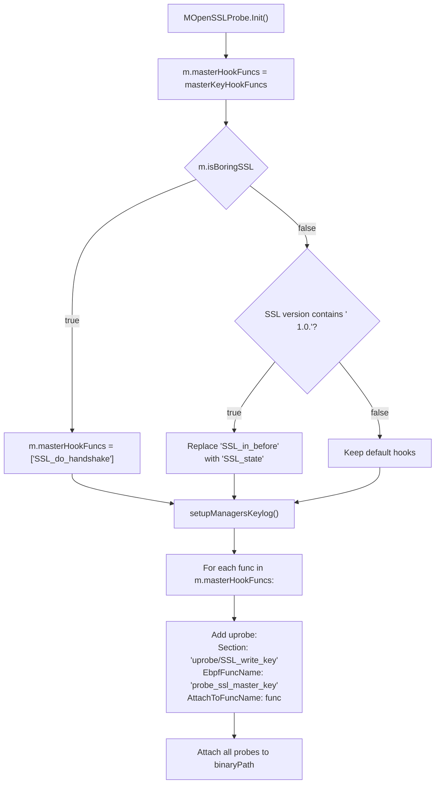
```mermaid
flowchart TD
    Start["MOpenSSLProbe.Init()"] --> InitHooks["m.masterHookFuncs = masterKeyHookFuncs"]
    InitHooks --> CheckBoringSSL{"m.isBoringSSL"}
    
    CheckBoringSSL -->|true| SetBoringFunc["m.masterHookFuncs = ['SSL_do_handshake']"]
    CheckBoringSSL -->|false| CheckOldSSL{"SSL version contains ' 1.0.'?"}
    
    CheckOldSSL -->|true| ReplaceFunc["Replace 'SSL_in_before' with 'SSL_state'"]
    CheckOldSSL -->|false| KeepDefault["Keep default hooks"]
    
    SetBoringFunc --> SetupProbes["setupManagersKeylog()"]
    ReplaceFunc --> SetupProbes
    KeepDefault --> SetupProbes
    
    SetupProbes --> CreateProbes["For each func in m.masterHookFuncs:"]
    CreateProbes --> AddProbe["Add uprobe:<br/>Section: 'uprobe/SSL_write_key'<br/>EbpfFuncName: 'probe_ssl_master_key'<br/>AttachToFuncName: func"]
    
    AddProbe --> End["Attach all probes to binaryPath"]
```

**Default Master Key Hook Functions** (defined at module level):

```go
var masterKeyHookFuncs = []string{
    "SSL_do_handshake",
    "SSL_connect",
    "SSL_accept",
    "SSL_in_before",
}
```

For OpenSSL 1.0.x, `SSL_in_before` is replaced with `SSL_state` because the former is a macro rather than a function in older versions.

**Sources:** [user/module/probe_openssl.go:178-196](https://github.com/gojue/ecapture/blob/ca085d05/user/module/probe_openssl.go#L178-L196), [user/module/probe_openssl_keylog.go:32-94](https://github.com/gojue/ecapture/blob/ca085d05/user/module/probe_openssl_keylog.go#L32-L94)

---

## MOpenSSLProbe Implementation

### Core Structure

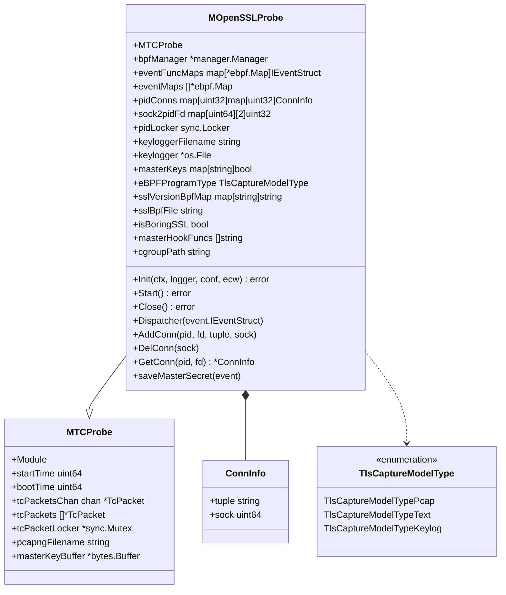
```mermaid
classDiagram
    class MOpenSSLProbe {
        +MTCProbe
        +bpfManager *manager.Manager
        +eventFuncMaps map[*ebpf.Map]IEventStruct
        +eventMaps []*ebpf.Map
        +pidConns map[uint32]map[uint32]ConnInfo
        +sock2pidFd map[uint64][2]uint32
        +pidLocker sync.Locker
        +keyloggerFilename string
        +keylogger *os.File
        +masterKeys map[string]bool
        +eBPFProgramType TlsCaptureModelType
        +sslVersionBpfMap map[string]string
        +sslBpfFile string
        +isBoringSSL bool
        +masterHookFuncs []string
        +cgroupPath string
        +Init(ctx, logger, conf, ecw) error
        +Start() error
        +Close() error
        +Dispatcher(event.IEventStruct)
        +AddConn(pid, fd, tuple, sock)
        +DelConn(sock)
        +GetConn(pid, fd) *ConnInfo
        +saveMasterSecret(event)
    }
    
    class MTCProbe {
        +Module
        +startTime uint64
        +bootTime uint64
        +tcPacketsChan chan *TcPacket
        +tcPackets []*TcPacket
        +tcPacketLocker *sync.Mutex
        +pcapngFilename string
        +masterKeyBuffer *bytes.Buffer
    }
    
    class ConnInfo {
        +tuple string
        +sock uint64
    }
    
    class TlsCaptureModelType {
        <<enumeration>>
        TlsCaptureModelTypePcap
        TlsCaptureModelTypeText
        TlsCaptureModelTypeKeylog
    }
    
    MOpenSSLProbe --|> MTCProbe
    MOpenSSLProbe *-- ConnInfo
    MOpenSSLProbe ..> TlsCaptureModelType
```

**Field Descriptions**:

- **bpfManager**: Manages eBPF program lifecycle (loading, attaching, detaching)
- **eventFuncMaps**: Maps eBPF maps to their corresponding event decoders
- **pidConns**: Connection tracking by PID and file descriptor
- **sock2pidFd**: Reverse mapping from socket pointer to [PID, FD] for cleanup
- **keylogger**: File handle for writing SSLKEYLOGFILE format output
- **masterKeys**: Deduplication map (client_random hex → bool) to avoid duplicate key writes
- **eBPFProgramType**: Determines which eBPF programs to load (text/pcap/keylog)
- **sslVersionBpfMap**: Version string to bytecode filename mapping
- **isBoringSSL**: Flag to select BoringSSL-specific code paths

**Sources:** [user/module/probe_openssl.go:83-106](https://github.com/gojue/ecapture/blob/ca085d05/user/module/probe_openssl.go#L83-L106), [user/module/probe_openssl.go:109-176](https://github.com/gojue/ecapture/blob/ca085d05/user/module/probe_openssl.go#L109-L176)

### Initialization Flow

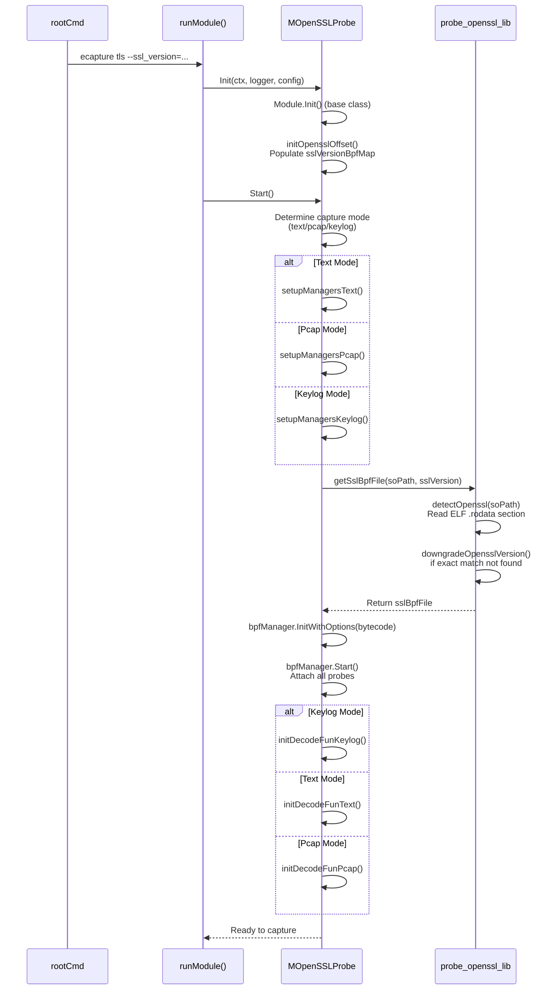
```mermaid
sequenceDiagram
    participant CLI as rootCmd
    participant RM as runModule()
    participant M as MOpenSSLProbe
    participant Lib as probe_openssl_lib
    
    CLI->>RM: ecapture tls --ssl_version=...
    RM->>M: Init(ctx, logger, config)
    M->>M: Module.Init() (base class)
    M->>M: initOpensslOffset()<br/>Populate sslVersionBpfMap
    
    RM->>M: Start()
    M->>M: Determine capture mode<br/>(text/pcap/keylog)
    
    alt Text Mode
        M->>M: setupManagersText()
    else Pcap Mode
        M->>M: setupManagersPcap()
    else Keylog Mode
        M->>M: setupManagersKeylog()
    end
    
    M->>Lib: getSslBpfFile(soPath, sslVersion)
    Lib->>Lib: detectOpenssl(soPath)<br/>Read ELF .rodata section
    Lib->>Lib: downgradeOpensslVersion()<br/>if exact match not found
    Lib-->>M: Return sslBpfFile
    
    M->>M: bpfManager.InitWithOptions(bytecode)
    M->>M: bpfManager.Start()<br/>Attach all probes
    
    alt Keylog Mode
        M->>M: initDecodeFunKeylog()
    else Text Mode
        M->>M: initDecodeFunText()
    else Pcap Mode
        M->>M: initDecodeFunPcap()
    end
    
    M-->>RM: Ready to capture
```

**Sources:** [user/module/probe_openssl.go:109-176](https://github.com/gojue/ecapture/blob/ca085d05/user/module/probe_openssl.go#L109-L176), [user/module/probe_openssl.go:280-350](https://github.com/gojue/ecapture/blob/ca085d05/user/module/probe_openssl.go#L280-L350), [user/module/probe_openssl_text.go:18-188](https://github.com/gojue/ecapture/blob/ca085d05/user/module/probe_openssl_text.go#L18-L188)

---

## Capture Modes

### Mode Comparison

| Mode | eBPF Maps Used | Output Format | Use Case |
|------|---------------|---------------|----------|
| **Text** | `tls_events`, `connect_events` | Plaintext with metadata | Real-time monitoring, debugging |
| **Pcap** | `tls_events`, `connect_events`, `skb_events` | Pcapng with DSB blocks | Wireshark analysis, network forensics |
| **Keylog** | `mastersecret_events` | SSLKEYLOGFILE format | Pre-decryption key extraction |

**Event Type Mapping**:

```go
// Text Mode
m.eventFuncMaps[tls_events] = &event.SSLDataEvent{}
m.eventFuncMaps[connect_events] = &event.ConnDataEvent{}

// Keylog Mode
if m.isBoringSSL {
    m.eventFuncMaps[mastersecret_events] = &event.MasterSecretBSSLEvent{}
} else {
    m.eventFuncMaps[mastersecret_events] = &event.MasterSecretEvent{}
}

// Pcap Mode (includes all of Text Mode plus)
m.eventFuncMaps[skb_events] = &event.TcSkbEvent{}
```

**Sources:** [user/module/probe_openssl_text.go:190-234](https://github.com/gojue/ecapture/blob/ca085d05/user/module/probe_openssl_text.go#L190-L234), [user/module/probe_openssl_keylog.go:97-118](https://github.com/gojue/ecapture/blob/ca085d05/user/module/probe_openssl_keylog.go#L97-L118)

### Text Mode Architecture

Text mode captures SSL data events and enriches them with connection information:

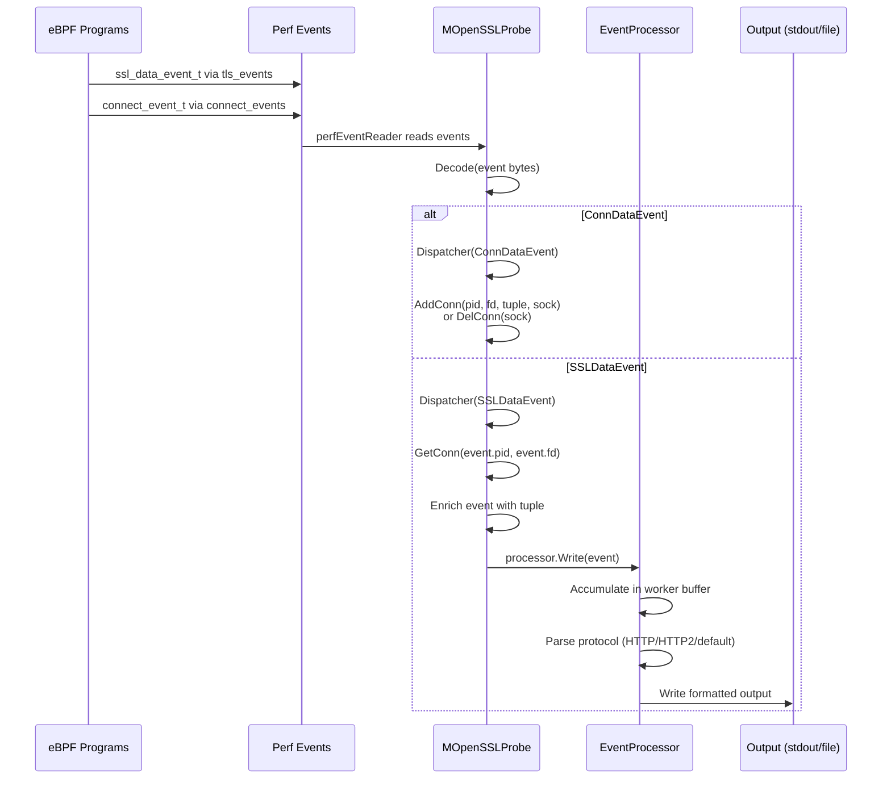
```mermaid
sequenceDiagram
    participant eBPF as eBPF Programs
    participant PE as Perf Events
    participant M as MOpenSSLProbe
    participant EP as EventProcessor
    participant Out as Output (stdout/file)
    
    eBPF->>PE: ssl_data_event_t via tls_events
    eBPF->>PE: connect_event_t via connect_events
    
    PE->>M: perfEventReader reads events
    M->>M: Decode(event bytes)
    
    alt ConnDataEvent
        M->>M: Dispatcher(ConnDataEvent)
        M->>M: AddConn(pid, fd, tuple, sock)<br/>or DelConn(sock)
    else SSLDataEvent
        M->>M: Dispatcher(SSLDataEvent)
        M->>M: GetConn(event.pid, event.fd)
        M->>M: Enrich event with tuple
        M->>EP: processor.Write(event)
        EP->>EP: Accumulate in worker buffer
        EP->>EP: Parse protocol (HTTP/HTTP2/default)
        EP->>Out: Write formatted output
    end
```

**Sources:** [user/module/probe_openssl.go:741-783](https://github.com/gojue/ecapture/blob/ca085d05/user/module/probe_openssl.go#L741-L783), [user/module/probe_openssl_text.go:18-188](https://github.com/gojue/ecapture/blob/ca085d05/user/module/probe_openssl_text.go#L18-L188)

### Keylog Mode Architecture

Keylog mode focuses exclusively on master secret extraction:

- Only attaches uprobes to master key hook functions (no data capture)
- Writes secrets in NSS Key Log Format compatible with Wireshark
- Deduplicates by client_random to avoid repeated keys
- For TLS 1.3, performs HKDF key derivation in userspace

**Example Keylog Output**:
```
CLIENT_RANDOM 52d7... a8c9...
CLIENT_HANDSHAKE_TRAFFIC_SECRET 52d7... 9f3e...
SERVER_HANDSHAKE_TRAFFIC_SECRET 52d7... b2a1...
CLIENT_TRAFFIC_SECRET_0 52d7... 3c4d...
SERVER_TRAFFIC_SECRET_0 52d7... 7e8f...
EXPORTER_SECRET 52d7... 1a2b...
```

**Sources:** [user/module/probe_openssl_keylog.go:32-118](https://github.com/gojue/ecapture/blob/ca085d05/user/module/probe_openssl_keylog.go#L32-L118), [user/module/probe_openssl.go:490-650](https://github.com/gojue/ecapture/blob/ca085d05/user/module/probe_openssl.go#L490-L650)

---

## Configuration and Filtering

### OpensslConfig Structure

```go
type OpensslConfig struct {
    BaseConfig
    Openssl      string // Path to libssl.so
    SslVersion   string // User-specified version
    Model        string // text/pcap/keylog
    KeylogFile   string // Output path for keylog mode
    PcapFile     string // Output path for pcap mode
    PcapFilter   string // BPF filter expression
    ElfType      uint8  // ElfTypeSo = 0
    IsAndroid    bool   // Android platform flag
    AndroidVer   string // Android version (e.g., "13", "14")
    CGroupPath   string // Cgroup path for filtering
}
```

**Version Specification**:
- `--ssl_version="openssl 3.0.12"` - Exact version
- `--ssl_version="boringssl_a_14"` - Android BoringSSL variant
- Auto-detect if not specified

**Sources:** [user/module/probe_openssl.go:108-176](https://github.com/gojue/ecapture/blob/ca085d05/user/module/probe_openssl.go#L108-L176), [cli/cmd/root.go:156-175](https://github.com/gojue/ecapture/blob/ca085d05/cli/cmd/root.go#L156-L175)

### Constant Editors for Filtering

```go
func (m *MOpenSSLProbe) constantEditor() []manager.ConstantEditor {
    return []manager.ConstantEditor{
        {
            Name:  "target_pid",
            Value: uint64(m.conf.GetPid()),
        },
        {
            Name:  "target_uid",
            Value: uint64(m.conf.GetUid()),
        },
        {
            Name:  "less52",
            Value: kernelLess52, // 0 or 1
        },
    }
}
```

These constants are rewritten in the eBPF bytecode at load time, allowing efficient filtering without map lookups. The `passes_filter()` function in eBPF checks these values before processing events.

**Sources:** [user/module/probe_openssl.go:361-395](https://github.com/gojue/ecapture/blob/ca085d05/user/module/probe_openssl.go#L361-L395), [kern/openssl.h:269-271](https://github.com/gojue/ecapture/blob/ca085d05/kern/openssl.h#L269-L271)

---

## Error Handling and Edge Cases

### Null Secret Detection

The module validates that extracted secrets are non-null before writing them:

```go
func (m *MOpenSSLProbe) mk13NullSecrets(hashLen int, 
    ClientHandshakeSecret, ClientTrafficSecret0, 
    ServerHandshakeSecret, ServerTrafficSecret0, 
    ExporterSecret [64]byte) bool {
    
    isNullCount := 5
    // Check each secret; decrement counter if non-zero byte found
    for i := 0; i < hashLen; i++ {
        if ClientHandshakeSecret[i] != 0 { isNullCount-- }
        // ... check other secrets
    }
    return isNullCount != 0 // true if any secret is all zeros
}
```

This prevents writing incomplete or invalid key material to the keylog file.

**Sources:** [user/module/probe_openssl.go:697-739](https://github.com/gojue/ecapture/blob/ca085d05/user/module/probe_openssl.go#L697-L739), [user/module/probe_openssl.go:652-672](https://github.com/gojue/ecapture/blob/ca085d05/user/module/probe_openssl.go#L652-L672)

### File Descriptor Fallback

When `ssl->bio->num` is 0 (not set), the module checks the `ssl_st_fd` map populated by `SSL_set_fd` hooks:

```c
*fd = (u32)ssl_bio_num_addr;
if (*fd == 0) {
    u64 ssl_addr = (u64)ssl;
    u64 *fd_ptr = bpf_map_lookup_elem(&ssl_st_fd, &ssl_addr);
    if (fd_ptr) {
        *fd = (u32)*fd_ptr;
    }
}
```

This handles applications that explicitly call `SSL_set_fd()` instead of using BIO functions.

**Sources:** [kern/openssl.h:225-267](https://github.com/gojue/ecapture/blob/ca085d05/kern/openssl.h#L225-L267), [kern/openssl.h:528-543](https://github.com/gojue/ecapture/blob/ca085d05/kern/openssl.h#L528-L543)

### BIO Type Filtering

The module reads the BIO method type to distinguish between different I/O types:

```c
#define BIO_TYPE_SOURCE_SINK 0x0400
#define BIO_TYPE_DESCRIPTOR  0x0100
```

Events with `bio_type > BIO_TYPE_SOURCE_SINK | BIO_TYPE_DESCRIPTOR` may indicate non-socket BIOs (e.g., memory BIOs) and are logged as warnings but not discarded, as the fd may still be valid from `ssl_st_fd` map.

**Sources:** [kern/openssl.h:193-223](https://github.com/gojue/ecapture/blob/ca085d05/kern/openssl.h#L193-L223), [user/module/probe_openssl.go:764-779](https://github.com/gojue/ecapture/blob/ca085d05/user/module/probe_openssl.go#L764-L779)

---

## Summary

The OpenSSL Module demonstrates sophisticated binary instrumentation through:

1. **Version Agnostic Design**: 100+ OpenSSL versions supported through offset grouping (26 versions of 1.0.2.x share one bytecode file)
2. **Dual TLS Protocol Support**: Handles both TLS 1.2 (single master_key) and TLS 1.3 (multiple traffic secrets with HKDF derivation)
3. **Multi-Modal Output**: Text (real-time), pcap (Wireshark-compatible), and keylog (pre-decryption keys)
4. **Intelligent Fallback**: Automatic version downgrade, libcrypto fallback, and default bytecode selection
5. **Connection Enrichment**: Integrates kprobe-based TCP connection tracking to map SSL events to network tuples

The module's architecture separates concerns cleanly: version detection occurs at initialization, eBPF programs handle kernel-space data capture, and userspace processes events with protocol-specific parsers and key derivation logic.

**Sources:** [user/module/probe_openssl.go:1-795](https://github.com/gojue/ecapture/blob/ca085d05/user/module/probe_openssl.go#L1-L795), [user/module/probe_openssl_lib.go:1-449](https://github.com/gojue/ecapture/blob/ca085d05/user/module/probe_openssl_lib.go#L1-L449), [kern/openssl.h:1-544](https://github.com/gojue/ecapture/blob/ca085d05/kern/openssl.h#L1-L544)