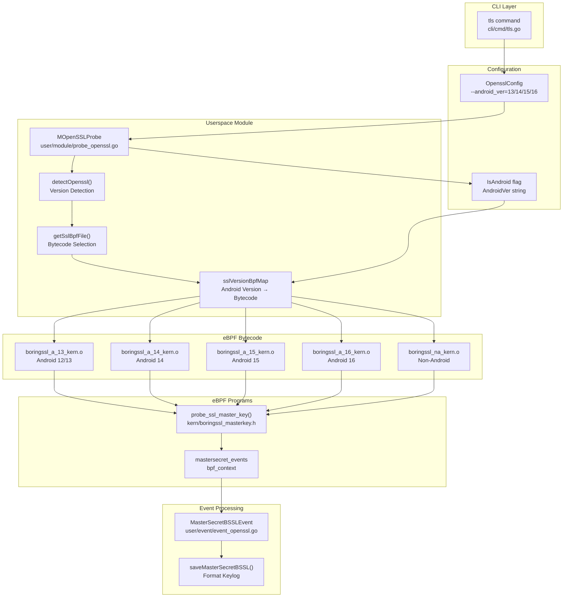
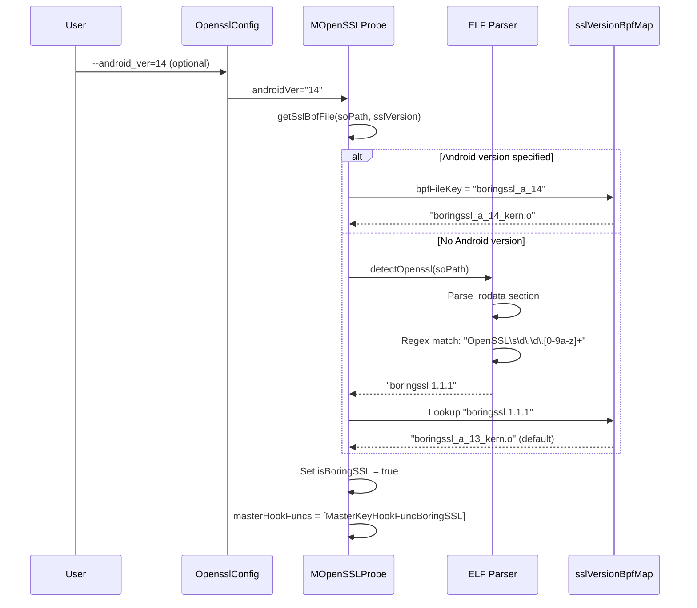
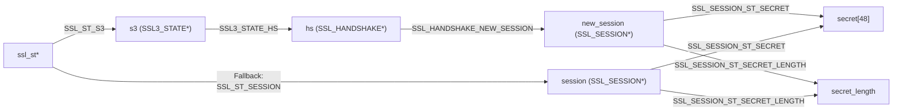
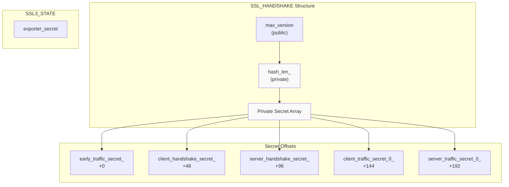

# BoringSSL Module

<details>
<summary>Relevant source files</summary>

The following files were used as context for generating this wiki page:

- [cli/cmd/root.go](https://github.com/gojue/ecapture/blob/ca085d05/cli/cmd/root.go)
- [kern/boringssl_const.h](https://github.com/gojue/ecapture/blob/ca085d05/kern/boringssl_const.h)
- [kern/boringssl_masterkey.h](https://github.com/gojue/ecapture/blob/ca085d05/kern/boringssl_masterkey.h)
- [user/config/iconfig.go](https://github.com/gojue/ecapture/blob/ca085d05/user/config/iconfig.go)
- [user/module/imodule.go](https://github.com/gojue/ecapture/blob/ca085d05/user/module/imodule.go)
- [user/module/probe_openssl.go](https://github.com/gojue/ecapture/blob/ca085d05/user/module/probe_openssl.go)
- [user/module/probe_openssl_lib.go](https://github.com/gojue/ecapture/blob/ca085d05/user/module/probe_openssl_lib.go)
- [utils/boringssl-offset.c](https://github.com/gojue/ecapture/blob/ca085d05/utils/boringssl-offset.c)
- [utils/openssl_offset_3.0.sh](https://github.com/gojue/ecapture/blob/ca085d05/utils/openssl_offset_3.0.sh)
- [utils/openssl_offset_3.1.sh](https://github.com/gojue/ecapture/blob/ca085d05/utils/openssl_offset_3.1.sh)
- [utils/openssl_offset_3.2.sh](https://github.com/gojue/ecapture/blob/ca085d05/utils/openssl_offset_3.2.sh)
- [utils/openssl_offset_3.3.sh](https://github.com/gojue/ecapture/blob/ca085d05/utils/openssl_offset_3.3.sh)
- [utils/openssl_offset_3.4.sh](https://github.com/gojue/ecapture/blob/ca085d05/utils/openssl_offset_3.4.sh)
- [utils/openssl_offset_3.5.sh](https://github.com/gojue/ecapture/blob/ca085d05/utils/openssl_offset_3.5.sh)

</details>


## Purpose and Scope

The BoringSSL module captures TLS/SSL plaintext traffic and master secrets from applications using BoringSSL, Google's fork of OpenSSL. This module is primarily designed for Android environments (Android 12-16), where BoringSSL is the default SSL/TLS implementation, though it also supports non-Android BoringSSL deployments.

For general OpenSSL support (versions 1.0.x, 1.1.x, 3.x), see [OpenSSL Module](3.1.1-openssl-module.md). For Go's native TLS implementation, see [Go TLS Module](3.1.3-go-tls-module.md). For overall TLS/SSL capture capabilities, see [TLS/SSL Capture Modules](3.1-tlsssl-capture-modules.md).

## Overview

BoringSSL is Google's fork of OpenSSL, designed for Chrome/Chromium and Android. While it maintains API compatibility with OpenSSL, its internal structures and offsets differ significantly, requiring dedicated eBPF bytecode and offset calculations.

The BoringSSL module shares the same userspace implementation (`MOpenSSLProbe`) as the OpenSSL module, with specialized handling for:
- Android version detection
- BoringSSL-specific structure offsets
- Private C++ member access via manual offset calculation
- BoringSSL-specific master secret events (`MasterSecretBSSLEvent`)

Sources: [user/module/probe_openssl.go:83-106](https://github.com/gojue/ecapture/blob/ca085d05/user/module/probe_openssl.go#L83-L106), [user/module/probe_openssl_lib.go:90-103](https://github.com/gojue/ecapture/blob/ca085d05/user/module/probe_openssl_lib.go#L90-L103)

## Module Architecture



Sources: [user/module/probe_openssl.go:83-106](https://github.com/gojue/ecapture/blob/ca085d05/user/module/probe_openssl.go#L83-L106), [user/module/probe_openssl_lib.go:73-187](https://github.com/gojue/ecapture/blob/ca085d05/user/module/probe_openssl_lib.go#L73-L187)

## Supported BoringSSL Versions

The module supports BoringSSL across multiple Android releases and non-Android deployments:

| Version Key | Android Version | Bytecode File | Git Repository |
|-------------|----------------|---------------|----------------|
| `boringssl_a_13` | Android 12/13 | `boringssl_a_13_kern.o` | android12-release branch |
| `boringssl_a_14` | Android 14 | `boringssl_a_14_kern.o` | android14-release branch |
| `boringssl_a_15` | Android 15 | `boringssl_a_15_kern.o` | android15-release branch |
| `boringssl_a_16` | Android 16 | `boringssl_a_16_kern.o` | android16-release branch |
| `boringssl na` | Non-Android | `boringssl_na_kern.o` | github.com/google/boringssl |
| `boringssl 1.1.1` | Generic | `boringssl_a_13_kern.o` | Fallback for undetected versions |

The version mapping is initialized in `initOpensslOffset()`:

Sources: [user/module/probe_openssl_lib.go:90-103](https://github.com/gojue/ecapture/blob/ca085d05/user/module/probe_openssl_lib.go#L90-L103)

## Version Detection

### Detection Strategy

BoringSSL version detection follows a multi-step process:



Sources: [user/module/probe_openssl.go:179-277](https://github.com/gojue/ecapture/blob/ca085d05/user/module/probe_openssl.go#L179-L277), [user/module/probe_openssl_lib.go:189-282](https://github.com/gojue/ecapture/blob/ca085d05/user/module/probe_openssl_lib.go#L189-L282)

### Android Version Parameter

Users can explicitly specify the Android version to bypass auto-detection:

```bash
# Explicitly specify Android 14
ecapture tls --android_ver=14

# Explicitly specify Android 15
ecapture tls --android_ver=15
```

When the `--android_ver` flag is provided, the module constructs the bytecode key as `boringssl_a_{androidVer}` and skips version string detection. This is particularly useful when version detection fails or for performance reasons.

Sources: [user/module/probe_openssl.go:247-262](https://github.com/gojue/ecapture/blob/ca085d05/user/module/probe_openssl.go#L247-L262)

### Version String Detection Fallback

If the Android version is not specified, the module attempts to detect the version string from the `.rodata` section of `libssl.so` or `libcrypto.so`. BoringSSL typically reports itself as `"boringssl 1.1.1"`, which maps to the default `boringssl_a_13_kern.o` bytecode.

However, because BoringSSL versions on different Android releases have different internal structure offsets despite reporting the same version string, relying solely on version string detection may lead to incorrect offset usage. This is why the `--android_ver` parameter is recommended for Android environments.

Sources: [user/module/probe_openssl_lib.go:231-282](https://github.com/gojue/ecapture/blob/ca085d05/user/module/probe_openssl_lib.go#L231-L282)

## Structure Offset Generation

### Private Member Challenge

BoringSSL uses C++ with private members in critical structures like `SSL_HANDSHAKE`. Since C++ private members cannot be accessed via standard `offsetof()` macros, eCapture employs a manual offset calculation strategy based on memory layout analysis.

The `SSL_HANDSHAKE` structure in BoringSSL contains TLS 1.3 secrets as private members:

```cpp
// From boringssl src/ssl/internal.h
struct SSL_HANDSHAKE {
  uint16_t max_version = 0;  // Offset calculable via offsetof()
  
 private:
  size_t hash_len_ = 0;      // Offset must be manually calculated
  uint8_t secret_[SSL_MAX_MD_SIZE] = {0};
  uint8_t early_traffic_secret_[SSL_MAX_MD_SIZE] = {0};
  uint8_t client_handshake_secret_[SSL_MAX_MD_SIZE] = {0};
  uint8_t server_handshake_secret_[SSL_MAX_MD_SIZE] = {0};
  uint8_t client_traffic_secret_0_[SSL_MAX_MD_SIZE] = {0};
  uint8_t server_traffic_secret_0_[SSL_MAX_MD_SIZE] = {0};
};
```

Sources: [kern/boringssl_const.h:9-33](https://github.com/gojue/ecapture/blob/ca085d05/kern/boringssl_const.h#L9-L33)

### Manual Offset Calculation

The offsets for private members are calculated in `kern/boringssl_const.h` using memory alignment rules:

| Member | Calculation | Offset |
|--------|-------------|--------|
| `max_version` | From `offsetof()` | Varies (e.g., 30) |
| `hash_len_` | `roundup(max_version + sizeof(uint16_t), 8)` | 32 |
| `secret_` | `hash_len_ + sizeof(size_t)` | 40 |
| `early_traffic_secret_` | `secret_ + SSL_MAX_MD_SIZE * 1` | 88 |
| `client_handshake_secret_` | `secret_ + SSL_MAX_MD_SIZE * 2` | 136 |
| `server_handshake_secret_` | `secret_ + SSL_MAX_MD_SIZE * 3` | 184 |
| `client_traffic_secret_0_` | `secret_ + SSL_MAX_MD_SIZE * 4` | 232 |
| `server_traffic_secret_0_` | `secret_ + SSL_MAX_MD_SIZE * 5` | 280 |

The `SSL_MAX_MD_SIZE` constant is 48 bytes (SHA-384 hash size).

Sources: [kern/boringssl_const.h:38-60](https://github.com/gojue/ecapture/blob/ca085d05/kern/boringssl_const.h#L38-L60)

### Offset Generation Script

The `utils/boringssl-offset.c` program generates offsets for public members that can be accessed via `offsetof()`:

```c
#define SSL_STRUCT_OFFSETS                   \
    X(ssl_st, version)                       \
    X(ssl_st, session)                       \
    X(ssl_st, rbio)                          \
    X(ssl_st, wbio)                          \
    X(ssl_st, s3)                            \
    X(ssl_session_st, secret_length)         \
    X(ssl_session_st, secret)                \
    X(bssl::SSL3_STATE, hs)                  \
    X(bssl::SSL3_STATE, client_random)       \
    X(bssl::SSL3_STATE, exporter_secret)     \
    X(bssl::SSL_HANDSHAKE, new_session)      \
    X(bssl::SSL_HANDSHAKE, client_version)   \
    X(bssl::SSL_HANDSHAKE, state)            \
    X(bssl::SSL_HANDSHAKE, tls13_state)
```

The script is invoked for each Android version to generate version-specific offset files (e.g., `kern/boringssl_a_13_kern.c`).

Sources: [utils/boringssl-offset.c:23-46](https://github.com/gojue/ecapture/blob/ca085d05/utils/boringssl-offset.c#L23-L46)

## Master Secret Extraction

### BoringSSL-Specific Event Structure

BoringSSL uses a dedicated event structure `MasterSecretBSSLEvent` with a different layout than OpenSSL's `MasterSecretEvent`:

```go
type MasterSecretBSSLEvent struct {
    Version      int32      // TLS version
    ClientRandom [32]byte   // Client random
    HashLen      uint32     // Hash length (32 for SHA-256, 48 for SHA-384)
    
    // TLS 1.2 single secret
    Secret [48]byte
    
    // TLS 1.3 multiple secrets
    EarlyTrafficSecret       [64]byte
    ClientHandshakeSecret    [64]byte
    ServerHandshakeSecret    [64]byte
    ClientTrafficSecret0     [64]byte
    ServerTrafficSecret0     [64]byte
    ExporterSecret           [64]byte
}
```

Key differences from OpenSSL:
- Uses `HashLen` instead of separate length fields
- Secret arrays are sized for maximum hash length (64 bytes for EVP_MAX_MD_SIZE)
- Single `Secret` field for TLS 1.2 instead of `MasterKey`

Sources: [user/event/event_openssl.go:76-95](https://github.com/gojue/ecapture/blob/ca085d05/user/event/event_openssl.go#L76-L95)

### TLS 1.2 Master Secret Extraction

For TLS 1.2 connections, BoringSSL stores the master secret in the `SSL_SESSION` structure:



The extraction logic in `probe_ssl_master_key()` follows this path:

1. Check if handshake state is complete (`state >= CLIENT_STATE12_SEND_CLIENT_FINISHED`)
2. Read `ssl_st->s3->hs->new_session` address
3. If `new_session` is NULL, fallback to `ssl_st->session`
4. Read `secret_length` and `secret` from the session structure
5. Send event to userspace

**Android 16 Special Case**: In Android 16, BoringSSL removed the `secret_length` field from `SSL_SESSION`. The module detects this by checking if `SSL_SESSION_ST_SECRET_LENGTH == 0xFF` and uses `BORINGSSL_SSL_MAX_MASTER_KEY_LENGTH` (48 bytes) as the default length.

Sources: [kern/boringssl_masterkey.h:282-336](https://github.com/gojue/ecapture/blob/ca085d05/kern/boringssl_masterkey.h#L282-L336), [kern/boringssl_masterkey.h:307-320](https://github.com/gojue/ecapture/blob/ca085d05/kern/boringssl_masterkey.h#L307-L320)

### TLS 1.3 Secret Extraction

TLS 1.3 uses multiple traffic secrets derived during the handshake. BoringSSL stores these in the private members of `SSL_HANDSHAKE`:



The extraction sequence:

1. Verify handshake state (`tls13_state >= CLIENT_STATE13_READ_SERVER_FINISHED`)
2. Read `hash_len_` to determine secret size (32 for SHA-256, 48 for SHA-384)
3. Read each secret from calculated offsets:
   - `SSL_HANDSHAKE_EARLY_TRAFFIC_SECRET_`
   - `SSL_HANDSHAKE_CLIENT_HANDSHAKE_SECRET_`
   - `SSL_HANDSHAKE_SERVER_HANDSHAKE_SECRET_`
   - `SSL_HANDSHAKE_CLIENT_TRAFFIC_SECRET_0_`
   - `SSL_HANDSHAKE_SERVER_TRAFFIC_SECRET_0_`
4. Read `exporter_secret` from `SSL3_STATE` (not private)
5. Send complete event to userspace

Sources: [kern/boringssl_masterkey.h:338-396](https://github.com/gojue/ecapture/blob/ca085d05/kern/boringssl_masterkey.h#L338-L396)

### Userspace Processing

The `saveMasterSecretBSSL()` function formats secrets into SSLKEYLOGFILE format:

```go
func (m *MOpenSSLProbe) saveMasterSecretBSSL(secretEvent *event.MasterSecretBSSLEvent) {
    k := fmt.Sprintf("%02x", secretEvent.ClientRandom)
    
    // Check for duplicate
    if _, exists := m.masterKeys[k]; exists {
        return
    }
    
    switch secretEvent.Version {
    case event.Tls12Version:
        // TLS 1.2: Single CLIENT_RANDOM line
        length := int(secretEvent.HashLen)
        b = fmt.Sprintf("%s %02x %02x\n", 
            hkdf.KeyLogLabelTLS12,
            secretEvent.ClientRandom,
            secretEvent.Secret[:length])
        
    case event.Tls13Version:
        // TLS 1.3: Multiple secret lines
        length := int(secretEvent.HashLen)
        b.WriteString(fmt.Sprintf("%s %02x %02x\n",
            hkdf.KeyLogLabelClientHandshake,
            secretEvent.ClientRandom,
            secretEvent.ClientHandshakeSecret[:length]))
        // ... repeat for all 5 secrets
    }
    
    // Write to keylog file or PCAPNG DSB
    m.keylogger.WriteString(b.String())
}
```

Sources: [user/module/probe_openssl.go:585-650](https://github.com/gojue/ecapture/blob/ca085d05/user/module/probe_openssl.go#L585-L650)

## eBPF Implementation Details

### Hook Point

BoringSSL uses a single hook function for master secret capture:

```c
SEC("uprobe/SSL_write_key")
int probe_ssl_master_key(struct pt_regs *ctx) {
    void *ssl_st_ptr = (void *)PT_REGS_PARM1(ctx);
    // Extract secrets...
}
```

Unlike OpenSSL which may hook multiple functions (`SSL_write`, `SSL_read`, `SSL_do_handshake`), BoringSSL capture uses a unified approach. The function name `SSL_write_key` is determined at initialization:

```go
if strings.Contains(m.sslBpfFile, "boringssl") {
    m.isBoringSSL = true
    m.masterHookFuncs = []string{MasterKeyHookFuncBoringSSL}
}
```

Sources: [kern/boringssl_masterkey.h:169-170](https://github.com/gojue/ecapture/blob/ca085d05/kern/boringssl_masterkey.h#L169-L170), [user/module/probe_openssl.go:181-184](https://github.com/gojue/ecapture/blob/ca085d05/user/module/probe_openssl.go#L181-L184)

### Handshake State Validation

BoringSSL defines specific state values to determine when secrets are ready:

```c
// Client states
#define CLIENT_STATE13_READ_SERVER_FINISHED 8
#define CLIENT_STATE13_DONE 14

// Server states  
#define SERVER_STATE13_READ_CLIENT_FINISHED 14
#define SERVER_STATE13_DONE 16

// TLS 1.2 states
#define CLIENT_STATE12_SEND_CLIENT_FINISHED 16
#define CLIENT_STATE12_DONE 22
#define SERVER_STATE12_READ_CLIENT_FINISHED 18
#define SERVER_STATE12_DONE 21
```

The eBPF program checks these states before reading secrets:

```c
// TLS 1.2 check
if (mastersecret->version != TLS1_3_VERSION) {
    if (ssl3_hs_state.state < CLIENT_STATE12_SEND_CLIENT_FINISHED) {
        return 0; // Handshake not complete
    }
}

// TLS 1.3 check
if (ssl3_hs_state.tls13_state < CLIENT_STATE13_READ_SERVER_FINISHED) {
    return 0; // Handshake not complete
}
```

This prevents capturing incomplete or invalid secrets during the handshake process.

Sources: [kern/boringssl_masterkey.h:77-86](https://github.com/gojue/ecapture/blob/ca085d05/kern/boringssl_masterkey.h#L77-L86), [kern/boringssl_masterkey.h:283-342](https://github.com/gojue/ecapture/blob/ca085d05/kern/boringssl_masterkey.h#L283-L342)

### Null Secret Detection

The userspace module validates that secrets are non-zero before writing them to the keylog:

```go
func (m *MOpenSSLProbe) bSSLEvent13NullSecrets(e *event.MasterSecretBSSLEvent) bool {
    hashLen := int(e.HashLen)
    return m.mk13NullSecrets(hashLen,
        e.ClientHandshakeSecret,
        e.ClientTrafficSecret0,
        e.ServerHandshakeSecret,
        e.ServerTrafficSecret0,
        e.ExporterSecret,
    )
}

func (m *MOpenSSLProbe) mk13NullSecrets(hashLen int, ...) bool {
    isNullCount := 5
    // Check each secret byte by byte
    for i := 0; i < hashLen; i++ {
        if ClientHandshakeSecret[i] != 0 {
            isNullCount -= 1
        }
        // ... check other secrets
    }
    return isNullCount != 0 // Return true if any secret is all zeros
}
```

This prevents writing invalid keylog entries when secrets haven't been properly initialized or when eBPF read operations fail.

Sources: [user/module/probe_openssl.go:674-738](https://github.com/gojue/ecapture/blob/ca085d05/user/module/probe_openssl.go#L674-L738)

## Usage Examples

### Basic BoringSSL Capture on Android

```bash
# Auto-detect BoringSSL version (may use default bytecode)
ecapture tls

# Specify Android 14 explicitly
ecapture tls --android_ver=14

# Capture to keylog file
ecapture tls --android_ver=15 --keylogfile=/sdcard/keylog.log

# Capture to PCAPNG with embedded keys
ecapture tls --android_ver=15 -m pcap -w /sdcard/capture.pcapng
```

### Non-Android BoringSSL

For non-Android systems using BoringSSL (e.g., Chromium on Linux):

```bash
# May require specifying the library path
ecapture tls --libssl=/path/to/libssl.so
```

The module will detect BoringSSL from the version string and use `boringssl_na_kern.o` bytecode.

Sources: [cli/cmd/tls.go](https://github.com/gojue/ecapture/blob/ca085d05/cli/cmd/tls.go) (referenced from architecture)

### Decrypting Captured Traffic

After capturing to PCAPNG with embedded keys:

```bash
# Open in Wireshark (automatically uses embedded DSB)
wireshark capture.pcapng

# Or use tshark for command-line analysis
tshark -r capture.pcapng -Y "http"
```

For keylog file format:

```bash
# Use with Wireshark via Edit → Preferences → Protocols → TLS
# Set "(Pre)-Master-Secret log filename" to the keylog file path
```

Sources: [Output Formats](../4-output-formats/index.md) (architecture reference)

## Limitations and Considerations

### Android Version Detection

Version auto-detection often fails on Android because BoringSSL reports a generic version string (`"boringssl 1.1.1"`) regardless of internal structure differences. Users should:

1. **Use `--android_ver` flag**: Explicitly specify Android version (13-16)
2. **Check Android release**: Match eCapture's Android version support with device OS
3. **Test with known traffic**: Verify keylog works before production use

### Structure Offset Compatibility

BoringSSL frequently changes internal structure layouts between Android releases. Each Android version requires dedicated bytecode:

- Android 12/13: Same offsets
- Android 14: New `SSL_HANDSHAKE` layout
- Android 15: Further layout changes
- Android 16: Removed `secret_length` field

Using incorrect bytecode results in reading wrong memory locations and producing invalid keylogs.

Sources: [user/module/probe_openssl.go:247-277](https://github.com/gojue/ecapture/blob/ca085d05/user/module/probe_openssl.go#L247-L277), [kern/boringssl_masterkey.h:307-320](https://github.com/gojue/ecapture/blob/ca085d05/kern/boringssl_masterkey.h#L307-L320)

### Memory Alignment

The manual offset calculation assumes standard C++ memory alignment rules (8-byte alignment for 64-bit). Different compilers or build configurations could theoretically produce different layouts, though this is rare in practice for Android's standardized build environment.

Sources: [kern/boringssl_const.h:38-60](https://github.com/gojue/ecapture/blob/ca085d05/kern/boringssl_const.h#L38-L60)

### Performance

BoringSSL capture has similar performance characteristics to OpenSSL capture. Each SSL/TLS operation triggers uprobe overhead, which is typically negligible for modern systems but may be noticeable under extreme load (tens of thousands of TLS connections per second).

Sources: [Architecture](../2-architecture/index.md) (general eBPF overhead)