# Go TLS Module

<details>
<summary>Relevant source files</summary>

The following files were used as context for generating this wiki page:

- [cli/cmd/bash.go](https://github.com/gojue/ecapture/blob/0766a93b/cli/cmd/bash.go)
- [cli/cmd/gnutls.go](https://github.com/gojue/ecapture/blob/0766a93b/cli/cmd/gnutls.go)
- [cli/cmd/gotls.go](https://github.com/gojue/ecapture/blob/0766a93b/cli/cmd/gotls.go)
- [cli/cmd/mysqld.go](https://github.com/gojue/ecapture/blob/0766a93b/cli/cmd/mysqld.go)
- [cli/cmd/nspr.go](https://github.com/gojue/ecapture/blob/0766a93b/cli/cmd/nspr.go)
- [cli/cmd/postgres.go](https://github.com/gojue/ecapture/blob/0766a93b/cli/cmd/postgres.go)
- [cli/cmd/tls.go](https://github.com/gojue/ecapture/blob/0766a93b/cli/cmd/tls.go)
- [cli/cmd/zsh.go](https://github.com/gojue/ecapture/blob/0766a93b/cli/cmd/zsh.go)
- [kern/go_argument.h](https://github.com/gojue/ecapture/blob/0766a93b/kern/go_argument.h)
- [kern/gotls_kern.c](https://github.com/gojue/ecapture/blob/0766a93b/kern/gotls_kern.c)
- [pkg/util/ws/client.go](https://github.com/gojue/ecapture/blob/0766a93b/pkg/util/ws/client.go)
- [pkg/util/ws/client_test.go](https://github.com/gojue/ecapture/blob/0766a93b/pkg/util/ws/client_test.go)
- [user/config/config_gotls.go](https://github.com/gojue/ecapture/blob/0766a93b/user/config/config_gotls.go)
- [user/module/probe_gotls.go](https://github.com/gojue/ecapture/blob/0766a93b/user/module/probe_gotls.go)
- [user/module/probe_gotls_keylog.go](https://github.com/gojue/ecapture/blob/0766a93b/user/module/probe_gotls_keylog.go)
- [user/module/probe_gotls_text.go](https://github.com/gojue/ecapture/blob/0766a93b/user/module/probe_gotls_text.go)

</details>


## Purpose and Scope

The Go TLS Module captures plaintext TLS/SSL traffic and cryptographic secrets from applications compiled with the Go programming language. Unlike the OpenSSL Module (see [3.1.1](3.1.1-openssl-module.md)), which hooks dynamic library functions, this module directly instruments the Go binary's crypto/tls package functions by parsing the Go application's ELF structure and symbol tables.

This module addresses unique challenges of Go binaries: statically-linked TLS implementation, evolving Application Binary Interface (ABI) conventions (register-based vs stack-based), Position Independent Executable (PIE) build modes, and version-specific symbol table formats. For general TLS capture concepts and master secret extraction techniques, see [3.1.4](3.1.4-master-secret-extraction.md).

**Key Capabilities:**
- Capture plaintext TLS data from Go applications without library injection
- Extract TLS master secrets for traffic decryption
- Support both register-based ABI (Go 1.17+) and stack-based ABI (Go <1.17)
- Handle PIE and non-PIE Go binaries
- Three output modes: text, keylog, and pcap (see [4](../4-output-formats/index.md))

---

## Architecture Overview

The Go TLS Module follows a three-phase initialization and execution pattern distinct from library-based modules:

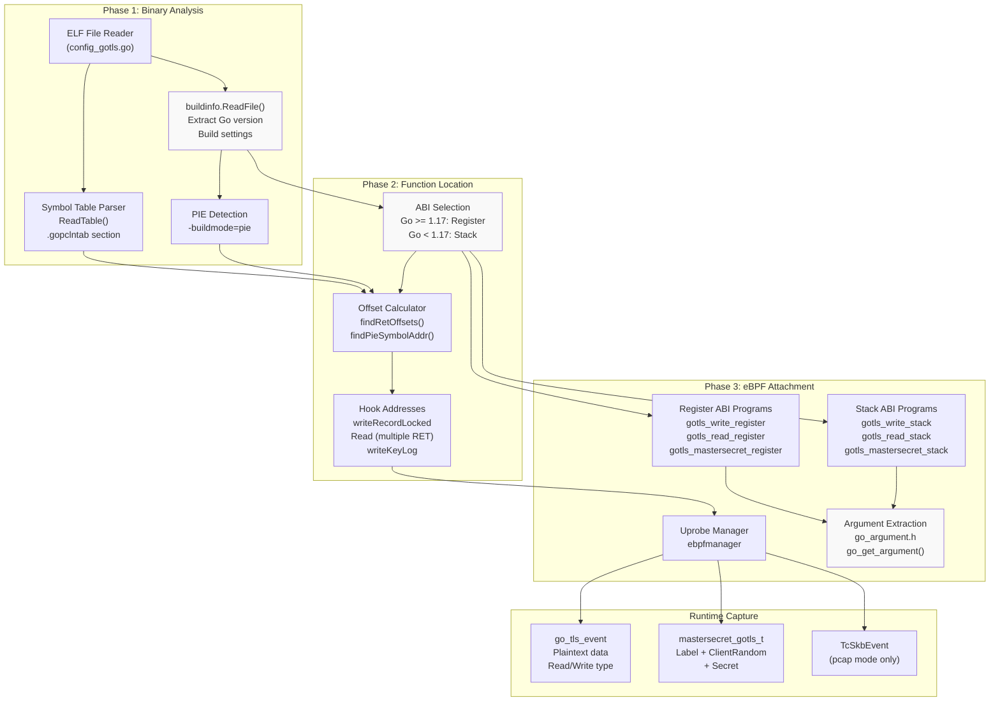

**Sources:** [user/module/probe_gotls.go:58-122](https://github.com/gojue/ecapture/blob/0766a93b/user/module/probe_gotls.go#L58-L122), [user/config/config_gotls.go:95-190](https://github.com/gojue/ecapture/blob/0766a93b/user/config/config_gotls.go#L95-L190)

---

## Go Binary Analysis and ABI Detection

### ELF Structure Parsing

The module begins by extracting metadata from the target Go binary using Go's `debug/buildinfo` and `debug/elf` packages:

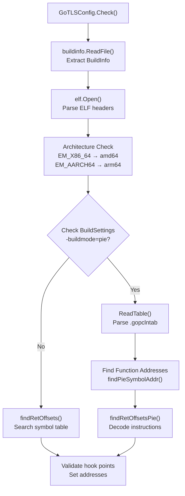

**Key Data Structures:**

| Field | Type | Purpose |
|-------|------|---------|
| `Buildinfo` | `*buildinfo.BuildInfo` | Go version, build settings, module info |
| `goElf` | `*elf.File` | ELF file handle for section/symbol access |
| `goSymTab` | `*gosym.Table` | Symbol table for PIE binaries |
| `IsPieBuildMode` | `bool` | Indicates PIE compilation |
| `ReadTlsAddrs` | `[]int` | Multiple RET instruction offsets for Read uretprobes |
| `GoTlsWriteAddr` | `uint64` | Address of writeRecordLocked function |
| `GoTlsMasterSecretAddr` | `uint64` | Address of Config.writeKeyLog function |

**Sources:** [user/config/config_gotls.go:102-190](https://github.com/gojue/ecapture/blob/0766a93b/user/config/config_gotls.go#L102-L190)

### Symbol Table Parsing for PIE Binaries

PIE binaries require special handling because symbols are unlabeled and relocated. The module locates the `.gopclntab` section (or `.data.rel.ro.gopclntab` for PIE) using magic number matching:

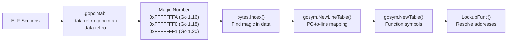

The magic number varies by Go version to accommodate changes in the program counter line table format:

| Go Version | Magic Number | Hex Value |
|------------|--------------|-----------|
| < 1.16 | `go12magic` | `0xFFFFFFFB` |
| 1.16-1.17 | `go116magic` | `0xFFFFFFFA` |
| 1.18-1.19 | `go118magic` | `0xFFFFFFF0` |
| ≥ 1.20 | `go120magic` | `0xFFFFFFF1` |

**Sources:** [user/config/config_gotls.go:46-69](https://github.com/gojue/ecapture/blob/0766a93b/user/config/config_gotls.go#L46-L69), [user/config/config_gotls.go:281-325](https://github.com/gojue/ecapture/blob/0766a93b/user/config/config_gotls.go#L281-L325)

### ABI Version Detection

Go 1.17 introduced a register-based calling convention, fundamentally changing how function arguments are passed. The module detects this by comparing the Go version:

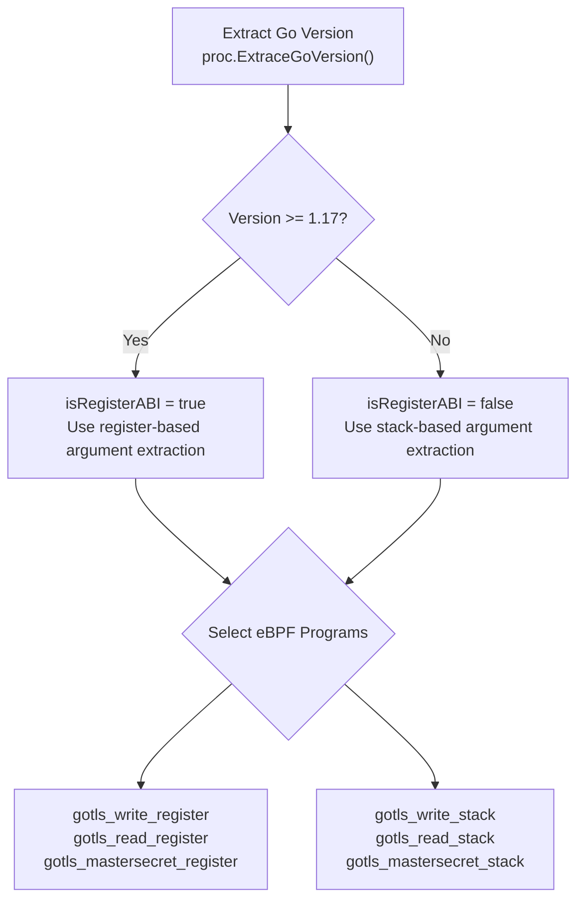

**Sources:** [user/module/probe_gotls.go:71-79](https://github.com/gojue/ecapture/blob/0766a93b/user/module/probe_gotls.go#L71-L79), [user/module/probe_gotls_text.go:37-47](https://github.com/gojue/ecapture/blob/0766a93b/user/module/probe_gotls_text.go#L37-L47)

---

## Hook Points and Function Offsets

### Target Functions

The module hooks three critical functions in the `crypto/tls` package:

| Function | Constant | Purpose | Hook Type |
|----------|----------|---------|-----------|
| `(*Conn).writeRecordLocked` | `GoTlsWriteFunc` | Writes TLS records (plaintext data) | Uprobe (entry) |
| `(*Conn).Read` | `GoTlsReadFunc` | Reads TLS records (plaintext data) | Uretprobe (return) |
| `(*Config).writeKeyLog` | `GoTlsMasterSecretFunc` | Logs TLS secrets for keylog files | Uprobe (entry) |

**Sources:** [user/config/config_gotls.go:31-35](https://github.com/gojue/ecapture/blob/0766a93b/user/config/config_gotls.go#L31-L35)

### RET Instruction Offset Calculation

For `Read` function uretprobes, the module must find all RET instruction offsets because uretprobes in userspace are implemented as uprobes on RET instructions. The process differs for PIE vs non-PIE binaries:

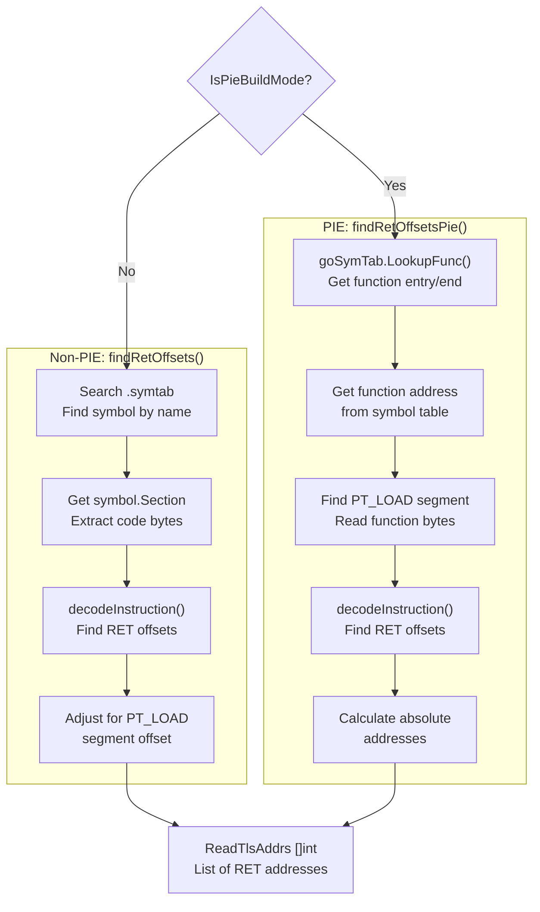

The `decodeInstruction()` function is architecture-specific and searches for RET opcodes (0xC3 on x86-64, specific patterns on ARM64).

**Sources:** [user/config/config_gotls.go:196-262](https://github.com/gojue/ecapture/blob/0766a93b/user/config/config_gotls.go#L196-L262), [user/config/config_gotls.go:327-357](https://github.com/gojue/ecapture/blob/0766a93b/user/config/config_gotls.go#L327-L357)

---

## eBPF Programs and Argument Extraction

### Register vs Stack ABI Argument Access

The core challenge is extracting function arguments, which differ fundamentally between ABIs:

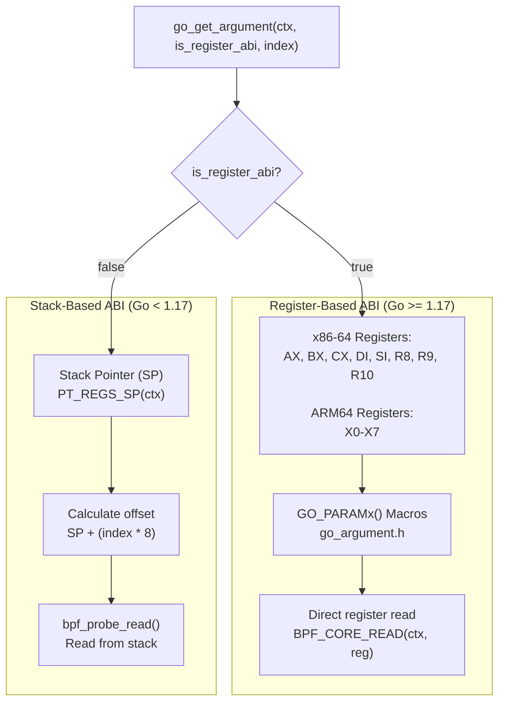

**x86-64 Register Mapping:**

| Argument Index | Register (Register ABI) | Stack Offset (Stack ABI) |
|----------------|------------------------|-------------------------|
| 1 | RAX | SP + 8 |
| 2 | RBX | SP + 16 |
| 3 | RCX | SP + 24 |
| 4 | RDI | SP + 32 |
| 5 | RSI | SP + 40 |
| 6 | R8 | SP + 48 |
| 7 | R9 | SP + 56 |
| 8 | R10 | SP + 64 |

**Sources:** [kern/go_argument.h:74-108](https://github.com/gojue/ecapture/blob/0766a93b/kern/go_argument.h#L74-L108)

### Write Capture (gotls_write)

The `writeRecordLocked` function signature is:
```go
func (c *Conn) writeRecordLocked(typ recordType, data []byte) (int, error)
```

The eBPF program extracts:
- Argument 2: `recordType` (uint8) - must be `recordTypeApplicationData` (23)
- Argument 3: `data` pointer (byte slice array pointer)
- Argument 4: `len` (int) - length of data

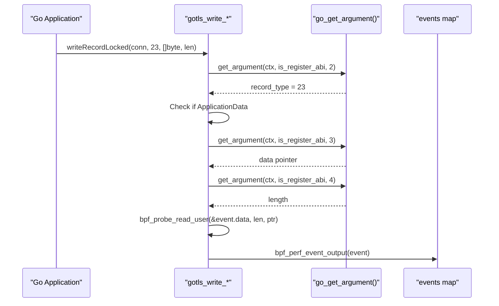

**Event Structure:**

```c
struct go_tls_event {
    u64 ts_ns;              // Timestamp
    u32 pid;                // Process ID
    u32 tid;                // Thread ID
    s32 data_len;           // Data length
    u8 event_type;          // 0=Write, 1=Read
    char comm[TASK_COMM_LEN]; // Process name
    char data[MAX_DATA_SIZE_OPENSSL]; // Plaintext data
};
```

**Sources:** [kern/gotls_kern.c:89-123](https://github.com/gojue/ecapture/blob/0766a93b/kern/gotls_kern.c#L89-L123), [kern/gotls_kern.c:31-39](https://github.com/gojue/ecapture/blob/0766a93b/kern/gotls_kern.c#L31-L39)

### Read Capture (gotls_read)

The `Read` function signature is:
```go
func (c *Conn) Read(b []byte) (int, error)
```

This uses **uretprobe** to capture data after the read completes. The challenge is that at return time, arguments are on the stack even for register ABI:

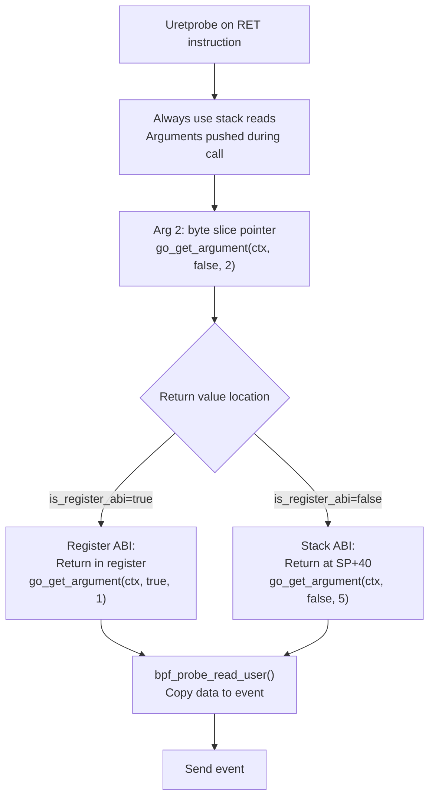

**Sources:** [kern/gotls_kern.c:137-179](https://github.com/gojue/ecapture/blob/0766a93b/kern/gotls_kern.c#L137-L179)

### Master Secret Capture (gotls_mastersecret)

The `writeKeyLog` function signature is:
```go
func (c *Config) writeKeyLog(label string, clientRandom, secret []byte) error
```

Go slices are represented as three-word structures: `{pointer, len, cap}`. The eBPF program extracts:

| Argument | Index | Content |
|----------|-------|---------|
| label (string) | 2 | Label pointer |
| label.len | 3 | Label length |
| clientRandom ([]byte) | 4 | Client random pointer |
| clientRandom.len | 5 | Client random length |
| clientRandom.cap | 6 | (skipped) |
| secret ([]byte) | 7 | Secret pointer |
| secret.len | 8 | Secret length |

```c
struct mastersecret_gotls_t {
    u8 label[MASTER_SECRET_KEY_LEN];           // "CLIENT_RANDOM" etc
    u8 labellen;
    u8 client_random[EVP_MAX_MD_SIZE];         // 32 bytes
    u8 client_random_len;
    u8 secret_[EVP_MAX_MD_SIZE];               // TLS secret
    u8 secret_len;
};
```

**Sources:** [kern/gotls_kern.c:194-267](https://github.com/gojue/ecapture/blob/0766a93b/kern/gotls_kern.c#L194-L267), [kern/gotls_kern.c:41-48](https://github.com/gojue/ecapture/blob/0766a93b/kern/gotls_kern.c#L41-L48)

---

## Capture Modes

The module supports three capture modes, each with different eBPF program configurations:

### Text Mode

Captures plaintext data for immediate console output or logging.

**Setup:**
- Hooks: `writeRecordLocked` (uprobe), `Read` (multiple uretprobes)
- Maps: `events` (perf array for `go_tls_event`)
- No TC programs

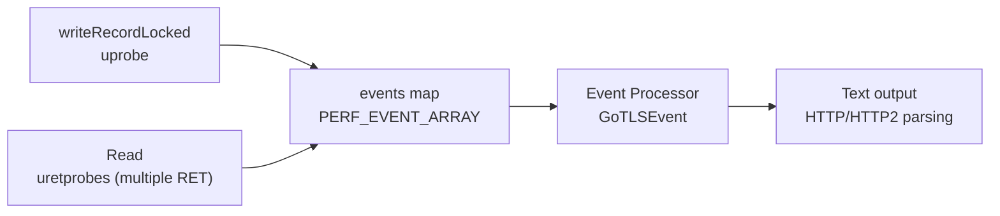

**Sources:** [user/module/probe_gotls_text.go:31-118](https://github.com/gojue/ecapture/blob/0766a93b/user/module/probe_gotls_text.go#L31-L118), [user/module/probe_gotls_text.go:120-135](https://github.com/gojue/ecapture/blob/0766a93b/user/module/probe_gotls_text.go#L120-L135)

### Keylog Mode

Captures TLS master secrets for decryption with external tools (Wireshark, etc).

**Setup:**
- Hooks: `writeKeyLog` (uprobe) only
- Maps: `mastersecret_go_events` (perf array for `mastersecret_gotls_t`)
- Output: SSLKEYLOGFILE format

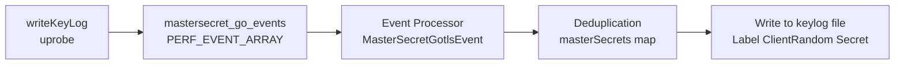

Master secrets are deduplicated using a key: `{label}-{clientRandom}` to prevent duplicate entries for the same TLS session.

**Sources:** [user/module/probe_gotls_keylog.go:31-122](https://github.com/gojue/ecapture/blob/0766a93b/user/module/probe_gotls_keylog.go#L31-L122), [user/module/probe_gotls.go:236-275](https://github.com/gojue/ecapture/blob/0766a93b/user/module/probe_gotls.go#L236-L275)

### PCAP Mode

Captures both plaintext data and network packets for complete traffic reconstruction.

**Setup:**
- Hooks: `writeKeyLog` (uprobe), TC ingress/egress classifiers
- Maps: `mastersecret_go_events`, `packet_events`, connection tracking maps
- Output: PCAP-NG with DSB (Decryption Secrets Block)

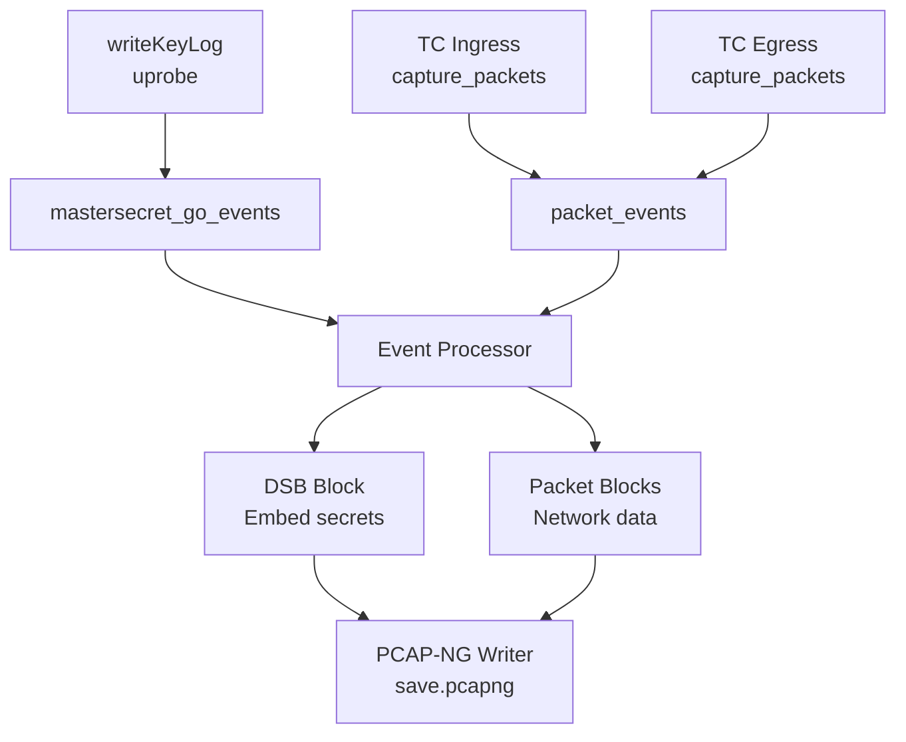

The TC classifiers use connection tracking (see [2.6](../2-architecture/2.6-network-connection-tracking.md)) to associate packets with processes.

**Sources:** [user/module/probe_gotls_pcap.go](https://github.com/gojue/ecapture/blob/0766a93b/user/module/probe_gotls_pcap.go)

---

## Configuration and CLI

### Configuration Structure

The `GoTLSConfig` struct centralizes all module settings:

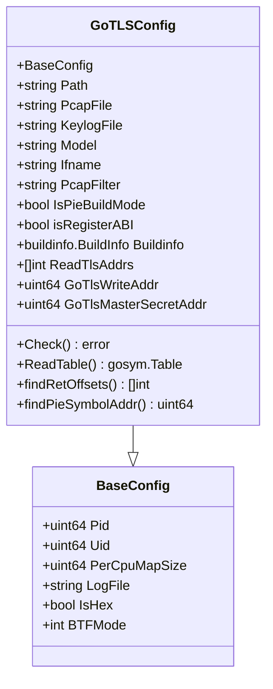

**Sources:** [user/config/config_gotls.go:76-93](https://github.com/gojue/ecapture/blob/0766a93b/user/config/config_gotls.go#L76-L93)

### CLI Commands

The `gotls` subcommand provides the user interface:

```bash
# Basic text capture
ecapture gotls --elfpath=/path/to/go_binary

# Keylog mode with filtering
ecapture gotls -m keylog -k /tmp/keys.log --elfpath=/path/to/go_binary --pid=1234

# PCAP mode with network interface
ecapture gotls -m pcap -w capture.pcapng -i eth0 --elfpath=/path/to/go_binary tcp port 443
```

**Flag Mapping:**

| Flag | Config Field | Default | Purpose |
|------|--------------|---------|---------|
| `-e, --elfpath` | `Path` | (required) | Path to Go binary |
| `-m, --model` | `Model` | `text` | Capture mode: text/pcap/keylog |
| `-w, --pcapfile` | `PcapFile` | `ecapture_gotls.pcapng` | PCAP output file |
| `-k, --keylogfile` | `KeylogFile` | `ecapture_gotls_key.log` | Keylog output file |
| `-i, --ifname` | `Ifname` | (required for pcap) | Network interface |
| `--pid` | `Pid` | 0 (all) | Target process ID |

**Sources:** [cli/cmd/gotls.go:26-58](https://github.com/gojue/ecapture/blob/0766a93b/cli/cmd/gotls.go#L26-L58)

---

## Event Processing and Output

### Event Dispatcher

The `Dispatcher` method routes events based on type:

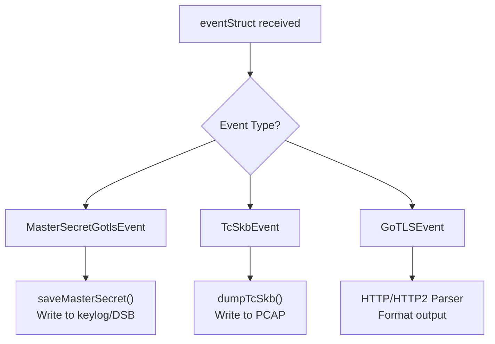

**Sources:** [user/module/probe_gotls.go:277-288](https://github.com/gojue/ecapture/blob/0766a93b/user/module/probe_gotls.go#L277-L288)

### Deduplication of Master Secrets

Master secrets are deduplicated to prevent multiple writes of the same key:

```go
// Key format: "LABEL-CLIENTRANDOM"
// e.g., "CLIENT_RANDOM-6a7b8c9d..."
k := fmt.Sprintf("%s-%02x", label, clientRandom)

_, exists := g.masterSecrets[k]
if exists {
    return // Skip duplicate
}
g.masterSecrets[k] = true
```

This ensures that repeated TLS handshakes (e.g., HTTP/2 with session resumption) don't produce redundant keylog entries.

**Sources:** [user/module/probe_gotls.go:242-248](https://github.com/gojue/ecapture/blob/0766a93b/user/module/probe_gotls.go#L242-L248)

---

## Build System Integration

The module integrates with eCapture's dual-path eBPF compilation:

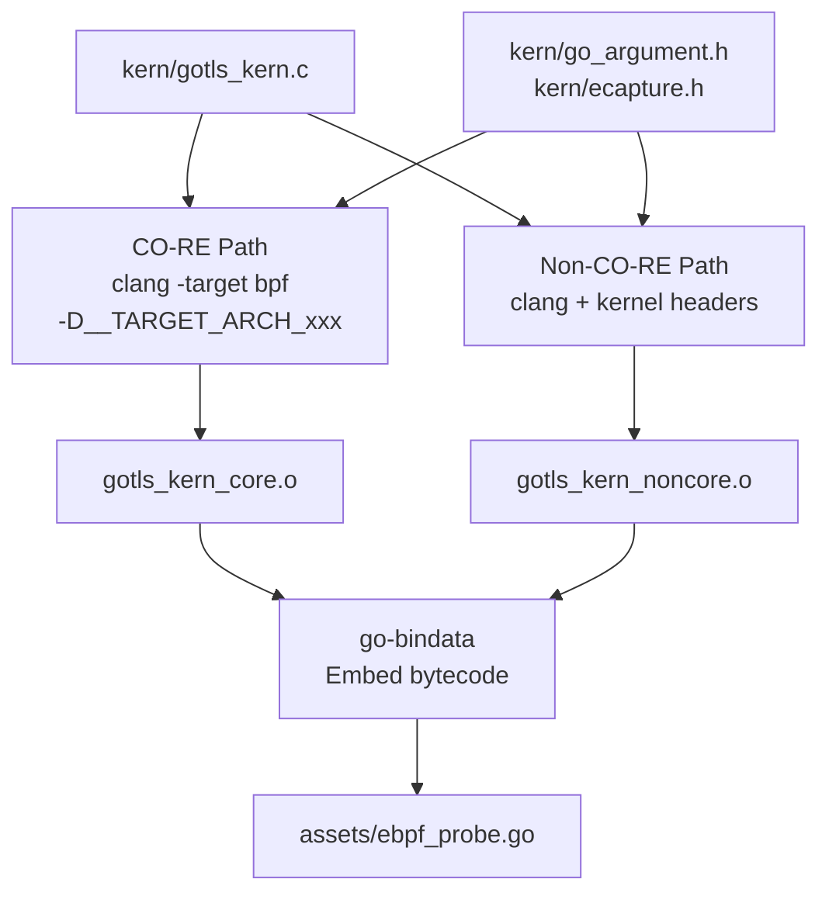

The module selects bytecode at runtime via `geteBPFName()` based on kernel BTF support.

**Sources:** See [5.1](../5-development-guide/5.1-build-system.md) for comprehensive build system documentation.

---

## Error Handling and Edge Cases

### Common Failure Scenarios

| Issue | Detection | Mitigation |
|-------|-----------|-----------|
| Not a Go binary | `buildinfo.ReadFile()` fails | Return `ErrNotGoCompiledBin` |
| Architecture mismatch | `runtime.GOARCH != goElfArch` | Return architecture error |
| Stripped PIE binary | Symbol table not found | Return `ErrorSymbolNotFoundFromTable` |
| No RET instructions found | `decodeInstruction()` returns empty | Return `ErrorNoRetFound` |
| Function not found | `LookupFunc()` returns nil | Return `ErrorNoFuncFoundFromSymTabFun` |

**Sources:** [user/config/config_gotls.go:37-44](https://github.com/gojue/ecapture/blob/0766a93b/user/config/config_gotls.go#L37-L44), [user/module/probe_gotls.go:40](https://github.com/gojue/ecapture/blob/0766a93b/user/module/probe_gotls.go#L40)

### PIE Binary Challenges

PIE binaries present unique challenges:
1. **Relocated Symbols**: Addresses are relative, requiring runtime calculation
2. **Hidden Sections**: `.gopclntab` may be unlabeled in `.data.rel.ro`
3. **Magic Number Search**: Must scan section data for pclntab signature
4. **Address Translation**: Must account for `PT_LOAD` segment virtual addresses

The module handles these by parsing the symbol table directly and using `gosym.Table.LookupFunc()` for address resolution.

**Sources:** [user/config/config_gotls.go:281-325](https://github.com/gojue/ecapture/blob/0766a93b/user/config/config_gotls.go#L281-L325), [user/config/config_gotls.go:327-357](https://github.com/gojue/ecapture/blob/0766a93b/user/config/config_gotls.go#L327-L357)

---

## Summary

The Go TLS Module demonstrates sophisticated binary instrumentation techniques tailored to Go's unique runtime characteristics. By parsing ELF structures, detecting ABI conventions, and hooking crypto/tls functions, it captures TLS traffic without requiring source modifications or dynamic library injection. The module's support for both legacy stack-based and modern register-based ABIs ensures compatibility across Go versions 1.0 through current releases.

For related TLS capture techniques using dynamic libraries, see the OpenSSL Module ([3.1.1](3.1.1-openssl-module.md)). For master secret extraction details applicable to both modules, see [3.1.4](3.1.4-master-secret-extraction.md).