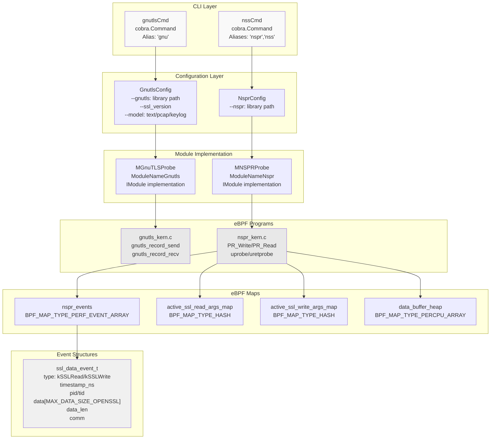
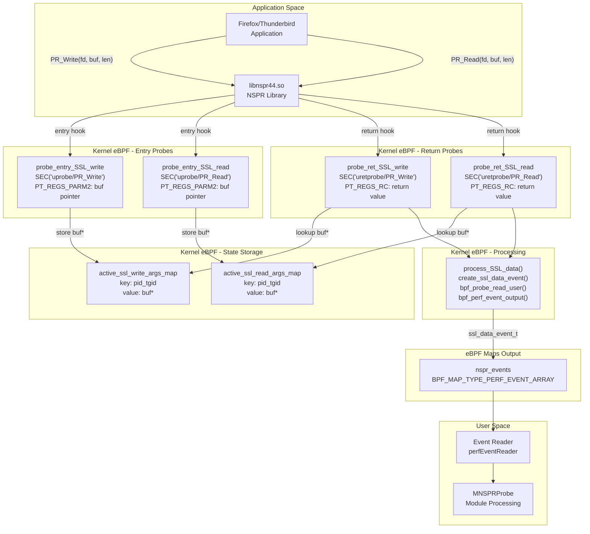
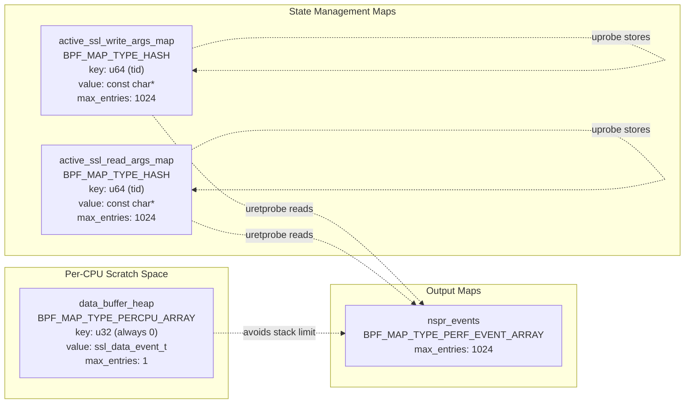
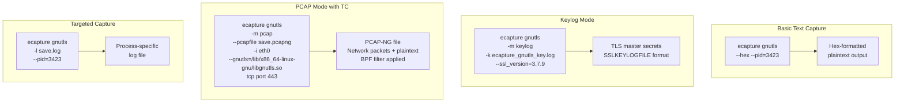
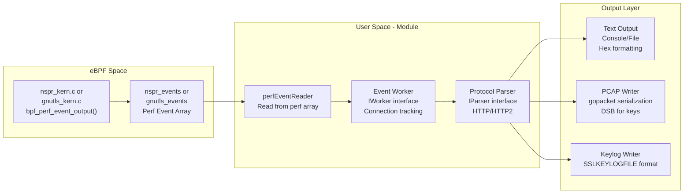

# GnuTLS and NSS Modules

<details>
<summary>Relevant source files</summary>

The following files were used as context for generating this wiki page:

- [cli/cmd/bash.go](https://github.com/gojue/ecapture/blob/0766a93b/cli/cmd/bash.go)
- [cli/cmd/gnutls.go](https://github.com/gojue/ecapture/blob/0766a93b/cli/cmd/gnutls.go)
- [cli/cmd/gotls.go](https://github.com/gojue/ecapture/blob/0766a93b/cli/cmd/gotls.go)
- [cli/cmd/mysqld.go](https://github.com/gojue/ecapture/blob/0766a93b/cli/cmd/mysqld.go)
- [cli/cmd/nspr.go](https://github.com/gojue/ecapture/blob/0766a93b/cli/cmd/nspr.go)
- [cli/cmd/postgres.go](https://github.com/gojue/ecapture/blob/0766a93b/cli/cmd/postgres.go)
- [cli/cmd/tls.go](https://github.com/gojue/ecapture/blob/0766a93b/cli/cmd/tls.go)
- [cli/cmd/zsh.go](https://github.com/gojue/ecapture/blob/0766a93b/cli/cmd/zsh.go)
- [kern/bash_kern.c](https://github.com/gojue/ecapture/blob/0766a93b/kern/bash_kern.c)
- [kern/mysqld_kern.c](https://github.com/gojue/ecapture/blob/0766a93b/kern/mysqld_kern.c)
- [kern/nspr_kern.c](https://github.com/gojue/ecapture/blob/0766a93b/kern/nspr_kern.c)
- [kern/postgres_kern.c](https://github.com/gojue/ecapture/blob/0766a93b/kern/postgres_kern.c)
- [pkg/util/ws/client.go](https://github.com/gojue/ecapture/blob/0766a93b/pkg/util/ws/client.go)
- [pkg/util/ws/client_test.go](https://github.com/gojue/ecapture/blob/0766a93b/pkg/util/ws/client_test.go)

</details>


## Purpose and Scope

This document describes the GnuTLS and NSS/NSPR capture modules in eCapture. These modules provide TLS/SSL plaintext capture capabilities for applications using GnuTLS and NSS/NSPR cryptographic libraries, complementing the OpenSSL module (see [OpenSSL Module](3.1.1-openssl-module.md)) and GoTLS module (see [Go TLS Module](3.1.2-go-tls-module.md)). Both modules use eBPF uprobes to intercept read/write functions in their respective libraries, extracting plaintext data before encryption and after decryption.

The GnuTLS module targets applications built with the GnuTLS library (commonly used by wget, curl variants, and other GNU utilities), while the NSS/NSPR module targets applications using Mozilla's Network Security Services (NSS) and Netscape Portable Runtime (NSPR) libraries, most notably Firefox and Thunderbird.

For information about TLS master secret extraction across all modules, see [Master Secret Extraction](3.1.4-master-secret-extraction.md). For output format details, see [Output Formats](../4-output-formats/index.md).

---

## Module Architecture

Both modules follow eCapture's standard module pattern, implementing the `IModule` interface (see [Module System and Lifecycle](../2-architecture/2.4-module-system-and-lifecycle.md)). They share similar architectural patterns with the OpenSSL module but target different library function signatures.



**Module Architecture Overview**: Both modules integrate into eCapture's CLI and module system. The GnuTLS module provides more comprehensive configuration options including capture modes (text/pcap/keylog), while NSPR module focuses on text capture. Both use eBPF uprobes to intercept library I/O functions and perf event arrays to stream data to user space.

**Sources**: [cli/cmd/gnutls.go:1-65](https://github.com/gojue/ecapture/blob/0766a93b/cli/cmd/gnutls.go#L1-L65), [cli/cmd/nspr.go:1-52](https://github.com/gojue/ecapture/blob/0766a93b/cli/cmd/nspr.go#L1-L52), [kern/nspr_kern.c:1-218](https://github.com/gojue/ecapture/blob/0766a93b/kern/nspr_kern.c#L1-L218)

---

## Target Libraries

### GnuTLS

GnuTLS is a free software implementation of the TLS, SSL, and DTLS protocols. It provides a high-level API for secure communication and is commonly used in:

- **GNU wget**: Network downloader
- **curl (GnuTLS variant)**: Command-line HTTP client
- **Various GNU utilities**: Applications requiring secure networking

The module targets the core I/O functions:
- `gnutls_record_send()`: Sends encrypted data
- `gnutls_record_recv()`: Receives and decrypts data

### NSS/NSPR

Network Security Services (NSS) and Netscape Portable Runtime (NSPR) are cryptographic libraries developed by Mozilla:

- **NSS**: Provides cryptographic operations, certificate handling, and SSL/TLS
- **NSPR**: Provides platform abstraction for I/O, threading, and other system operations

Primary applications:
- **Mozilla Firefox**: Web browser
- **Mozilla Thunderbird**: Email client
- **Chrome/Chromium (older versions)**: Web browsers
- **Various Mozilla-based applications**

The module targets NSPR I/O functions:
- `PR_Write()`: Writes data to a file descriptor
- `PR_Read()`: Reads data from a file descriptor

**Sources**: [cli/cmd/gnutls.go:35-36](https://github.com/gojue/ecapture/blob/0766a93b/cli/cmd/gnutls.go#L35-L36), [cli/cmd/nspr.go:33-34](https://github.com/gojue/ecapture/blob/0766a93b/cli/cmd/nspr.go#L33-L34), [kern/nspr_kern.c:110-113](https://github.com/gojue/ecapture/blob/0766a93b/kern/nspr_kern.c#L110-L113)

---

## NSPR/NSS Module Implementation

The NSPR module demonstrates eCapture's approach to library-specific TLS capture. The implementation uses uprobe entry/exit pairs to capture buffer pointers on entry and extract data on return.

### Hook Points and Data Flow



**NSPR Hook Implementation**: The module uses a two-phase approach. Entry probes (`probe_entry_SSL_write`, `probe_entry_SSL_read`) capture buffer pointers and store them in hash maps keyed by thread ID. Return probes (`probe_ret_SSL_write`, `probe_ret_SSL_read`) retrieve the stored pointers, check return values for success, and use `process_SSL_data()` to extract plaintext and emit events. This pattern ensures buffer contents are captured only after successful I/O operations.

**Sources**: [kern/nspr_kern.c:114-217](https://github.com/gojue/ecapture/blob/0766a93b/kern/nspr_kern.c#L114-L217)

### Event Structure

The NSPR module uses a unified event structure for both read and write operations:

| Field | Type | Description |
|-------|------|-------------|
| `type` | `enum ssl_data_event_type` | `kSSLRead` (0) or `kSSLWrite` (1) |
| `timestamp_ns` | `u64` | Event timestamp from `bpf_ktime_get_ns()` |
| `pid` | `u32` | Process ID (upper 32 bits of `pid_tgid`) |
| `tid` | `u32` | Thread ID (lower 32 bits of `pid_tgid`) |
| `data` | `char[MAX_DATA_SIZE_OPENSSL]` | Captured plaintext data |
| `data_len` | `s32` | Actual data length (capped at `MAX_DATA_SIZE_OPENSSL`) |
| `comm` | `char[TASK_COMM_LEN]` | Process command name from `bpf_get_current_comm()` |

**Sources**: [kern/nspr_kern.c:19-27](https://github.com/gojue/ecapture/blob/0766a93b/kern/nspr_kern.c#L19-L27)

### eBPF Maps Configuration

The NSPR module uses four eBPF maps:



**eBPF Map Design**: The `data_buffer_heap` uses `BPF_MAP_TYPE_PERCPU_ARRAY` to work around eBPF's 512-byte stack limit. Each CPU gets its own `ssl_data_event_t` instance for event construction. The `active_ssl_*_args_map` hash maps provide temporary storage between uprobe entry and return, using thread ID as key to handle concurrent operations.

**Sources**: [kern/nspr_kern.c:29-62](https://github.com/gojue/ecapture/blob/0766a93b/kern/nspr_kern.c#L29-L62)

---

## GnuTLS Module Implementation

The GnuTLS module follows a similar architectural pattern to NSPR but targets different library functions and provides more comprehensive capture modes.

### Library Detection and Version Handling

The GnuTLS CLI command supports version-specific behavior through the `--ssl_version` flag:

```bash
ecapture gnutls --ssl_version=3.7.9
```

This allows the module to adapt to different GnuTLS API versions and structure layouts. The module automatically searches for `libgnutls.so` if no path is specified.

**Sources**: [cli/cmd/gnutls.go:54](https://github.com/gojue/ecapture/blob/0766a93b/cli/cmd/gnutls.go#L54)

### Capture Modes

The GnuTLS module supports three capture modes via the `--model` flag:

| Mode | Description | Output |
|------|-------------|--------|
| `text` | Direct plaintext capture | Console/log file with HTTP/HTTP2 parsing |
| `pcap`/`pcapng` | Network packet capture with plaintext | PCAP-NG file compatible with Wireshark |
| `key`/`keylog` | TLS master secrets | SSLKEYLOGFILE format for decryption |

**Sources**: [cli/cmd/gnutls.go:50-53](https://github.com/gojue/ecapture/blob/0766a93b/cli/cmd/gnutls.go#L50-L53)

### CLI Usage Examples



**GnuTLS CLI Patterns**: The command supports flexible targeting (by PID/UID), custom library paths, network interface attachment for TC-based packet capture, and BPF filter expressions for PCAP mode. The keylog mode enables offline decryption of captured traffic using standard tools like Wireshark.

**Sources**: [cli/cmd/gnutls.go:36-43](https://github.com/gojue/ecapture/blob/0766a93b/cli/cmd/gnutls.go#L36-L43)

---

## Filtering and Targeting

Both modules implement PID and UID filtering at the eBPF level for efficient event processing:

```c
#ifndef KERNEL_LESS_5_2
    // if target_ppid is 0 then we target all pids
    if (target_pid != 0 && target_pid != pid) {
        return 0;
    }
    if (target_uid != 0 && target_uid != uid) {
        return 0;
    }
#endif
```

This filtering pattern appears in all hook functions and operates in kernel space before any data is captured, minimizing performance overhead. The conditional compilation (`#ifndef KERNEL_LESS_5_2`) indicates that global variables for filtering are only available in kernels 5.2+.

**Sources**: [kern/nspr_kern.c:122-130](https://github.com/gojue/ecapture/blob/0766a93b/kern/nspr_kern.c#L122-L130), [kern/nspr_kern.c:147-153](https://github.com/gojue/ecapture/blob/0766a93b/kern/nspr_kern.c#L147-L153), [kern/nspr_kern.c:177-185](https://github.com/gojue/ecapture/blob/0766a93b/kern/nspr_kern.c#L177-L185), [kern/nspr_kern.c:200-208](https://github.com/gojue/ecapture/blob/0766a93b/kern/nspr_kern.c#L200-L208)

---

## Data Capture Implementation

### Buffer Size Management

Both modules use size-limited buffers with bitwise masking for safety:

```c
// NSPR module data capture
event->data_len = (len < MAX_DATA_SIZE_OPENSSL ? 
                   (len & (MAX_DATA_SIZE_OPENSSL - 1)) : 
                   MAX_DATA_SIZE_OPENSSL);
bpf_probe_read_user(event->data, event->data_len, buf);
```

The bitwise AND operation `(len & (MAX_DATA_SIZE_OPENSSL - 1))` ensures the size doesn't exceed the buffer even if the comparison fails due to verifier limitations. This pattern is common across eCapture's eBPF programs for eBPF verifier compliance.

**Sources**: [kern/nspr_kern.c:100-101](https://github.com/gojue/ecapture/blob/0766a93b/kern/nspr_kern.c#L100-L101)

### Event Creation and Output

The NSPR module uses a helper function to create events from per-CPU scratch space:

```c
static __inline struct ssl_data_event_t* create_ssl_data_event(u64 current_pid_tgid) {
    u32 kZero = 0;
    struct ssl_data_event_t* event = bpf_map_lookup_elem(&data_buffer_heap, &kZero);
    if (event == NULL) {
        return NULL;
    }
    
    const u32 kMask32b = 0xffffffff;
    event->timestamp_ns = bpf_ktime_get_ns();
    event->pid = current_pid_tgid >> 32;
    event->tid = current_pid_tgid & kMask32b;
    return event;
}
```

This function avoids stack allocation by using a per-CPU array map, working around the 512-byte eBPF stack limit. Events are then output via `bpf_perf_event_output()` to the `nspr_events` perf array.

**Sources**: [kern/nspr_kern.c:68-80](https://github.com/gojue/ecapture/blob/0766a93b/kern/nspr_kern.c#L68-L80), [kern/nspr_kern.c:103](https://github.com/gojue/ecapture/blob/0766a93b/kern/nspr_kern.c#L103)

---

## Integration with Event Processing Pipeline

Both modules integrate with eCapture's event processing system (see [Event Processing Pipeline](../2-architecture/2.2-event-processing-pipeline.md)):



**Event Processing Integration**: Events flow from eBPF programs through perf arrays to the module's event reader. The worker layer manages connection state and lifecycle, while parsers decode protocol data (HTTP/HTTP2). Output handlers format data according to the selected mode (text/pcap/keylog).

**Sources**: [cli/cmd/gnutls.go:50-53](https://github.com/gojue/ecapture/blob/0766a93b/cli/cmd/gnutls.go#L50-L53), [cli/cmd/nspr.go:34-39](https://github.com/gojue/ecapture/blob/0766a93b/cli/cmd/nspr.go#L34-L39)

---

## Comparison with Other TLS Modules

The following table compares GnuTLS and NSS modules with other TLS capture modules:

| Feature | OpenSSL | GoTLS | GnuTLS | NSS/NSPR |
|---------|---------|-------|--------|----------|
| **Primary Target** | OpenSSL/BoringSSL apps | Go TLS apps | GNU utilities | Mozilla apps |
| **Hook Functions** | SSL_read/SSL_write | crypto/tls.Conn.Read/Write | gnutls_record_recv/send | PR_Read/PR_Write |
| **Version Detection** | Extensive (1.0.x-3.5.x) | Go version + ABI | Optional | Optional |
| **Master Secret Extraction** | Yes (TLS 1.2/1.3) | Yes | Yes | Limited |
| **PCAP Mode** | Yes with TC | Yes with TC | Yes with TC | Limited |
| **Keylog Format** | Yes | Yes | Yes | No |
| **Android Support** | Yes (BoringSSL) | No | No | No |
| **CLI Complexity** | High | Medium | Medium | Low |

**Module Comparison**: GnuTLS and NSS modules provide simpler implementations compared to OpenSSL due to less version fragmentation. NSS module is the most minimal, focusing on basic text capture. GnuTLS offers a middle ground with keylog and PCAP support but without the extensive version-specific bytecode variants required by OpenSSL.

**Sources**: [cli/cmd/tls.go:1-68](https://github.com/gojue/ecapture/blob/0766a93b/cli/cmd/tls.go#L1-L68), [cli/cmd/gotls.go:1-59](https://github.com/gojue/ecapture/blob/0766a93b/cli/cmd/gotls.go#L1-L59), [cli/cmd/gnutls.go:1-65](https://github.com/gojue/ecapture/blob/0766a93b/cli/cmd/gnutls.go#L1-L65), [cli/cmd/nspr.go:1-52](https://github.com/gojue/ecapture/blob/0766a93b/cli/cmd/nspr.go#L1-L52)

---

## Build System Integration

Both modules are conditionally compiled based on platform:

```go
//go:build !androidgki
// +build !androidgki
```

This build tag excludes GnuTLS and NSS modules from Android builds, as these libraries are not typically available on Android platforms. The OpenSSL/BoringSSL module handles Android's TLS requirements.

The modules integrate with eCapture's build system:
- **eBPF compilation**: `kern/gnutls_kern.c` and `kern/nspr_kern.c` compiled via Makefile
- **CO-RE support**: Both support BTF-enabled kernels for portability
- **Non-CO-RE fallback**: Kernel header-based compilation for older systems
- **Asset embedding**: Bytecode embedded via go-bindata into the final binary

**Sources**: [cli/cmd/gnutls.go:1-2](https://github.com/gojue/ecapture/blob/0766a93b/cli/cmd/gnutls.go#L1-L2), [cli/cmd/nspr.go:1-2](https://github.com/gojue/ecapture/blob/0766a93b/cli/cmd/nspr.go#L1-L2)

---

## Usage Examples

### Capturing Firefox Traffic (NSS)

```bash
# Basic capture with hex output
ecapture nspr --hex --pid=$(pgrep firefox)

# Save to log file
ecapture nspr -l firefox_capture.log --pid=$(pgrep firefox)

# Specify NSPR library path manually
ecapture nspr --nspr=/usr/lib/x86_64-linux-gnu/libnspr4.so
```

### Capturing wget Traffic (GnuTLS)

```bash
# Text mode with automatic library detection
ecapture gnutls

# PCAP mode with network interface and BPF filter
ecapture gnutls -m pcap --pcapfile wget_traffic.pcapng -i eth0 \
  --gnutls=/lib/x86_64-linux-gnu/libgnutls.so.30 \
  tcp port 443

# Keylog mode for offline decryption
ecapture gnutls -m keylog -k gnutls_keys.log --ssl_version=3.7.9

# Targeted capture by PID
ecapture gnutls --pid=$(pgrep wget) -l wget_output.log
```

### Advanced Filtering

```bash
# Capture only specific user's traffic
ecapture gnutls --uid=1000

# PCAP with complex BPF filter
ecapture gnutls -m pcap -w capture.pcapng -i wlan0 \
  "host 192.168.1.100 and tcp port 443"
```

**Sources**: [cli/cmd/nspr.go:35-39](https://github.com/gojue/ecapture/blob/0766a93b/cli/cmd/nspr.go#L35-L39), [cli/cmd/gnutls.go:36-43](https://github.com/gojue/ecapture/blob/0766a93b/cli/cmd/gnutls.go#L36-L43)

---

## Limitations and Considerations

### NSS/NSPR Module Limitations

1. **No PCAP mode**: Unlike GnuTLS, the NSPR module doesn't support PCAP output mode
2. **No keylog support**: Master secret extraction is not implemented
3. **Limited configuration**: Fewer CLI options compared to other TLS modules
4. **NSPR-specific**: Only captures data through PR_Read/PR_Write, not NSS's higher-level functions

### GnuTLS Module Limitations

1. **Version sensitivity**: Some GnuTLS versions may have different structure layouts
2. **Limited adoption**: Fewer applications use GnuTLS compared to OpenSSL
3. **Master secret extraction complexity**: TLS 1.3 secrets require version-specific offsets

### General Considerations

- **Library detection**: Automatic detection may fail if libraries are in non-standard paths
- **Performance overhead**: Capturing all traffic from busy applications (e.g., Firefox) can generate significant data
- **Kernel version**: Some features require kernel 5.2+ for global variable support
- **BTF requirement**: CO-RE mode requires kernel with BTF support

**Sources**: [cli/cmd/nspr.go:43-45](https://github.com/gojue/ecapture/blob/0766a93b/cli/cmd/nspr.go#L43-L45), [cli/cmd/gnutls.go:47-55](https://github.com/gojue/ecapture/blob/0766a93b/cli/cmd/gnutls.go#L47-L55), [kern/nspr_kern.c:122-130](https://github.com/gojue/ecapture/blob/0766a93b/kern/nspr_kern.c#L122-L130)

---

## Related Modules

For comprehensive TLS capture coverage across different applications and libraries:

- **[OpenSSL Module](3.1.1-openssl-module.md)**: Primary module for OpenSSL/BoringSSL applications
- **[Go TLS Module](3.1.2-go-tls-module.md)**: Specialized module for Go applications using crypto/tls
- **[Master Secret Extraction](3.1.4-master-secret-extraction.md)**: Deep dive into TLS key material extraction
- **[TC-based Packet Capture](3.3-network-packet-capture-with-tc.md)**: Network-level packet capture with process attribution

The GnuTLS and NSS modules extend eCapture's coverage to applications outside the OpenSSL ecosystem, enabling comprehensive TLS observability across diverse application stacks.