# Go TLS Module

<details>
<summary>Relevant source files</summary>

The following files were used as context for generating this wiki page:

- [go.mod](https://github.com/gojue/ecapture/blob/ca085d05/go.mod)
- [go.sum](https://github.com/gojue/ecapture/blob/ca085d05/go.sum)
- [kern/go_argument.h](https://github.com/gojue/ecapture/blob/ca085d05/kern/go_argument.h)
- [kern/gotls_kern.c](https://github.com/gojue/ecapture/blob/ca085d05/kern/gotls_kern.c)
- [user/config/config_gotls.go](https://github.com/gojue/ecapture/blob/ca085d05/user/config/config_gotls.go)
- [user/module/probe_gotls.go](https://github.com/gojue/ecapture/blob/ca085d05/user/module/probe_gotls.go)
- [user/module/probe_gotls_keylog.go](https://github.com/gojue/ecapture/blob/ca085d05/user/module/probe_gotls_keylog.go)
- [user/module/probe_gotls_text.go](https://github.com/gojue/ecapture/blob/ca085d05/user/module/probe_gotls_text.go)

</details>


## Purpose and Scope

The Go TLS Module captures TLS/SSL plaintext traffic from applications compiled with the Go toolchain by hooking into the Go standard library's `crypto/tls` package functions. Unlike the OpenSSL and BoringSSL modules that hook into shared library functions, this module attaches uprobes directly to functions within Go binary executables.

This page covers Go-specific TLS capture implementation, including Go version detection, calling convention (ABI) detection, and function hooking mechanisms. For general TLS capture concepts, see [TLS/SSL Capture Modules](3.1-tlsssl-capture-modules.md). For other TLS libraries, see [OpenSSL Module](3.1.1-openssl-module.md), [BoringSSL Module](3.1.2-boringssl-module.md), and [GnuTLS and NSS Modules](3.1.4-gnutls-and-nss-modules.md).

**Sources:** [user/module/probe_gotls.go:1-312](https://github.com/gojue/ecapture/blob/ca085d05/user/module/probe_gotls.go#L1-L312), [README.md (inferred)]()

---

## Architecture Overview

The Go TLS module follows a three-phase approach: detect Go version and calling convention, locate target functions in the binary, and attach uprobes to capture plaintext data and master secrets.

### System Components

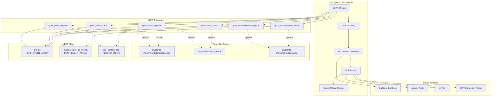

**Sources:** [user/module/probe_gotls.go:43-56](https://github.com/gojue/ecapture/blob/ca085d05/user/module/probe_gotls.go#L43-L56), [kern/gotls_kern.c:50-87](https://github.com/gojue/ecapture/blob/ca085d05/kern/gotls_kern.c#L50-L87), [user/config/config_gotls.go:77-94](https://github.com/gojue/ecapture/blob/ca085d05/user/config/config_gotls.go#L77-L94)

---

## Go Version and ABI Detection

### Version Detection Process

The module extracts the Go version from the target binary using the `debug/buildinfo` package, which reads embedded build information from Go executables.

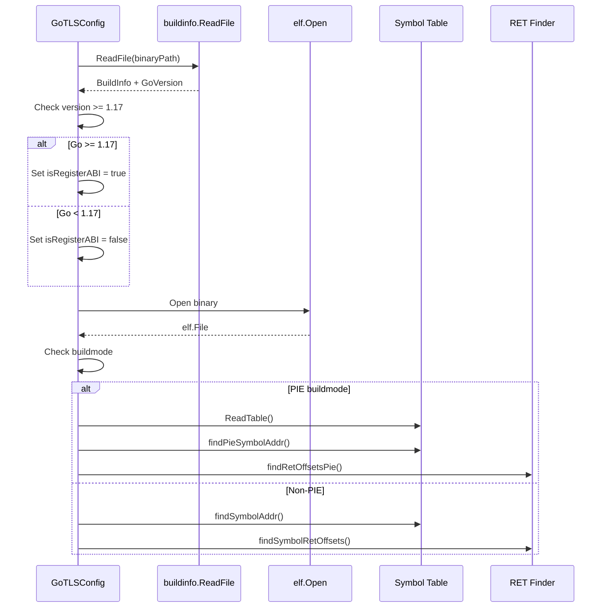

The critical version boundary is **Go 1.17**, which introduced register-based calling conventions via the internal ABI specification. Prior versions used stack-based argument passing.

**Sources:** [user/module/probe_gotls.go:71-79](https://github.com/gojue/ecapture/blob/ca085d05/user/module/probe_gotls.go#L71-L79), [user/config/config_gotls.go:103-213](https://github.com/gojue/ecapture/blob/ca085d05/user/config/config_gotls.go#L103-L213)

### ABI Detection

| Go Version | Calling Convention | eBPF Program Suffix | Argument Extraction |
|------------|-------------------|-------------------|-------------------|
| < 1.17 | Stack-based | `_stack` | Read from stack pointer (SP + offset * 8) |
| >= 1.17 | Register-based | `_register` | Read from CPU registers (AX, BX, CX, DI, SI, R8-R11) |

**Register Mapping (x86_64):**

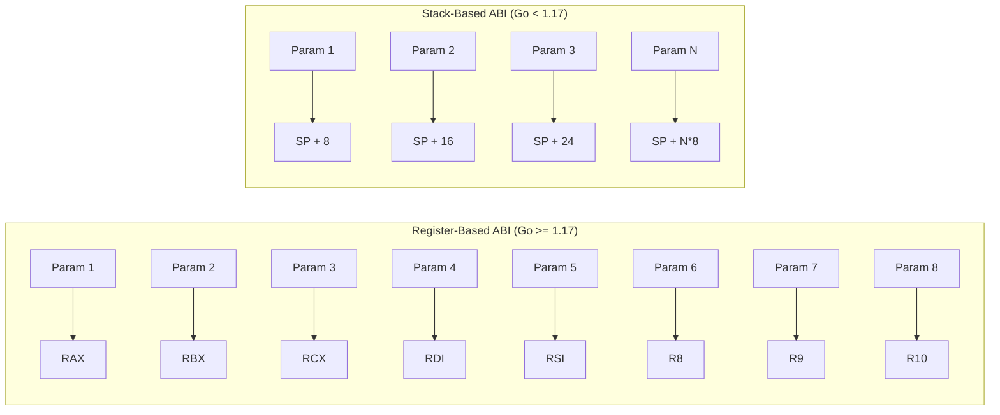

**Sources:** [kern/go_argument.h:74-108](https://github.com/gojue/ecapture/blob/ca085d05/kern/go_argument.h#L74-L108), [user/module/probe_gotls.go:76-79](https://github.com/gojue/ecapture/blob/ca085d05/user/module/probe_gotls.go#L76-L79)

---

## Function Hooks

The module hooks three key functions in the `crypto/tls` package to capture plaintext data and cryptographic secrets.

### Hooked Functions

| Function | Purpose | Hook Type | Event Type |
|----------|---------|-----------|------------|
| `crypto/tls.(*Conn).writeRecordLocked` | Capture outgoing plaintext | uprobe (entry) | `go_tls_event` (write) |
| `crypto/tls.(*Conn).Read` | Capture incoming plaintext | uprobe (at RET) | `go_tls_event` (read) |
| `crypto/tls.(*Config).writeKeyLog` | Capture master secrets | uprobe (entry) | `mastersecret_gotls_t` |

**Sources:** [user/config/config_gotls.go:31-35](https://github.com/gojue/ecapture/blob/ca085d05/user/config/config_gotls.go#L31-L35), [kern/gotls_kern.c:31-48](https://github.com/gojue/ecapture/blob/ca085d05/kern/gotls_kern.c#L31-L48)

### Symbol Resolution

The module resolves function addresses differently based on whether the binary is compiled as PIE (Position Independent Executable) or non-PIE.

**PIE Mode:**
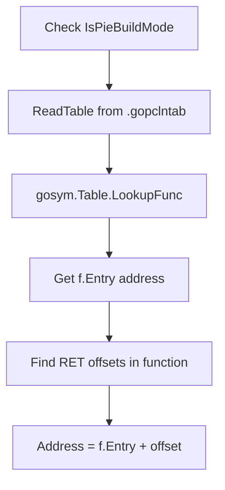

**Non-PIE Mode:**
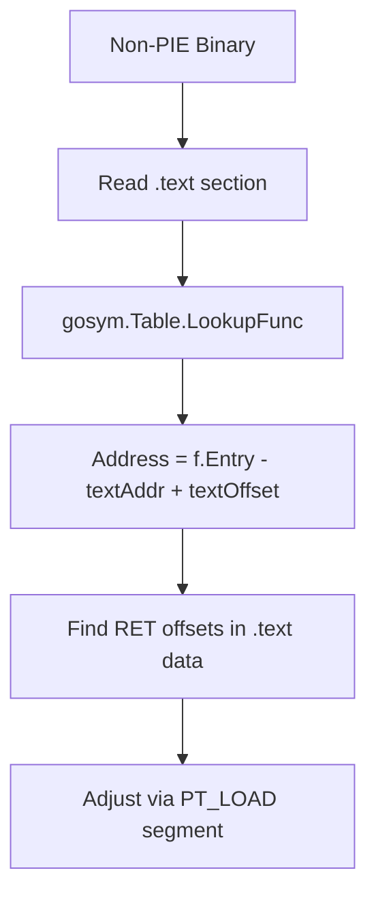

**Sources:** [user/config/config_gotls.go:155-213](https://github.com/gojue/ecapture/blob/ca085d05/user/config/config_gotls.go#L155-L213), [user/config/config_gotls.go:350-446](https://github.com/gojue/ecapture/blob/ca085d05/user/config/config_gotls.go#L350-L446)

### RET Instruction Detection

For the `Read` function, the module must hook at return points (equivalent to uretprobe) because the return value indicates how many bytes were actually read. The module finds all RET instructions within the function body.

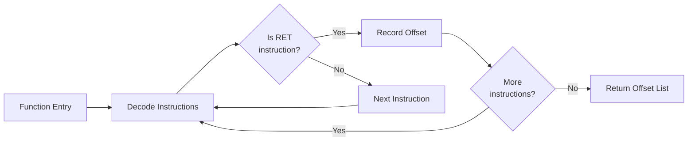

The decoder uses architecture-specific instruction analysis:
- **x86_64**: Looks for `0xc3` (RET) opcode
- **arm64**: Looks for `0xd65f03c0` (RET) instruction

**Sources:** [user/config/config_gotls.go:219-285](https://github.com/gojue/ecapture/blob/ca085d05/user/config/config_gotls.go#L219-L285), [user/config/config_gotls_amd64.go (inferred)](), [user/config/config_gotls_arm64.go (inferred)]()

---

## eBPF Program Implementation

### Data Capture Flow

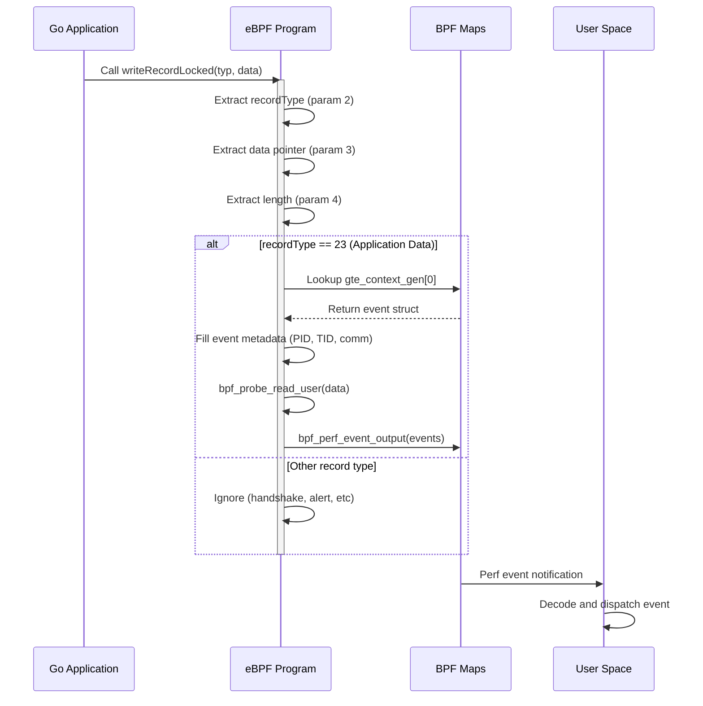

**Sources:** [kern/gotls_kern.c:89-123](https://github.com/gojue/ecapture/blob/ca085d05/kern/gotls_kern.c#L89-L123)

### Event Structures

**go_tls_event** (plaintext data):
```c
struct go_tls_event {
    u64 ts_ns;                      // Timestamp
    u32 pid;                        // Process ID
    u32 tid;                        // Thread ID
    s32 data_len;                   // Data length
    u8 event_type;                  // WRITE=0, READ=1
    char comm[TASK_COMM_LEN];       // Process name
    char data[MAX_DATA_SIZE_OPENSSL]; // Plaintext data
};
```

**mastersecret_gotls_t** (TLS secrets):
```c
struct mastersecret_gotls_t {
    u8 label[MASTER_SECRET_KEY_LEN];     // Secret label
    u8 labellen;
    u8 client_random[EVP_MAX_MD_SIZE];   // Client random
    u8 client_random_len;
    u8 secret_[EVP_MAX_MD_SIZE];         // Secret value
    u8 secret_len;
};
```

**Sources:** [kern/gotls_kern.c:31-48](https://github.com/gojue/ecapture/blob/ca085d05/kern/gotls_kern.c#L31-L48)

### Argument Extraction

The module uses `go_get_argument()` helper function to extract arguments from either registers or stack based on the ABI version.

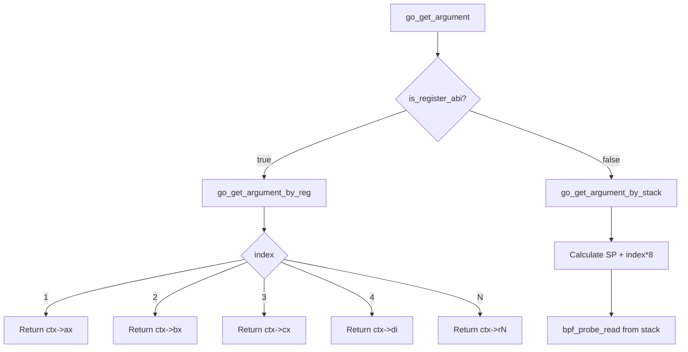

**Sources:** [kern/go_argument.h:74-108](https://github.com/gojue/ecapture/blob/ca085d05/kern/go_argument.h#L74-L108), [kern/gotls_kern.c:94-98](https://github.com/gojue/ecapture/blob/ca085d05/kern/gotls_kern.c#L94-L98)

---

## Capture Modes

The Go TLS module supports three capture modes, configured via the `Model` field in `GoTLSConfig`.

### Text Mode (Default)

Captures plaintext TLS data and outputs to console or file in text format.

**Setup:**
- Attaches uprobes to `writeRecordLocked` and `Read` functions
- Reads from `events` map
- Dispatches `GoTLSEvent` structures

**Configuration:**
```go
type GoTLSConfig struct {
    Model: "text"  // or empty string
}
```

**eBPF Programs Used:**
- `uprobe/gotls_write_register` or `uprobe/gotls_write_stack`
- `uprobe/gotls_read_register` or `uprobe/gotls_read_stack`

**Sources:** [user/module/probe_gotls_text.go:31-135](https://github.com/gojue/ecapture/blob/ca085d05/user/module/probe_gotls_text.go#L31-L135), [user/module/probe_gotls.go:99-103](https://github.com/gojue/ecapture/blob/ca085d05/user/module/probe_gotls.go#L99-L103)

### Keylog Mode

Captures TLS master secrets and writes them in NSS Key Log format for later decryption.

**Setup:**
- Attaches uprobe only to `writeKeyLog` function
- Reads from `mastersecret_go_events` map
- Writes to keylog file in format: `<LABEL> <CLIENT_RANDOM_HEX> <SECRET_HEX>`

**Configuration:**
```go
type GoTLSConfig struct {
    Model: "keylog" // or "key"
    KeylogFile: "/path/to/keylog.log"
}
```

**Master Secret Labels:**
- `CLIENT_HANDSHAKE_TRAFFIC_SECRET`
- `SERVER_HANDSHAKE_TRAFFIC_SECRET`
- `CLIENT_TRAFFIC_SECRET_0`
- `SERVER_TRAFFIC_SECRET_0`
- `EXPORTER_SECRET`

**Sources:** [user/module/probe_gotls_keylog.go:31-122](https://github.com/gojue/ecapture/blob/ca085d05/user/module/probe_gotls_keylog.go#L31-L122), [user/module/probe_gotls.go:84-90](https://github.com/gojue/ecapture/blob/ca085d05/user/module/probe_gotls.go#L84-L90), [user/module/probe_gotls.go:244-283](https://github.com/gojue/ecapture/blob/ca085d05/user/module/probe_gotls.go#L244-L283)

### PCAP Mode

Combines master secret capture with TC (Traffic Control) packet capture to generate pcapng files with embedded decryption secrets.

**Setup:**
- Attaches uprobe to `writeKeyLog` function
- Attaches TC classifiers to network interface
- Writes master secrets as DSB (Decryption Secrets Block) in pcapng file
- Correlates captured packets with Go process via `network_map`

**Configuration:**
```go
type GoTLSConfig struct {
    Model: "pcap"      // or "pcapng"
    PcapFile: "/path/to/capture.pcapng"
    Ifname: "eth0"     // Network interface
    PcapFilter: ""     // Optional BPF filter
}
```

**Sources:** [user/module/probe_gotls_pcap.go (inferred)](), [user/module/probe_gotls.go:91-98](https://github.com/gojue/ecapture/blob/ca085d05/user/module/probe_gotls.go#L91-L98), [user/module/probe_gotls.go:148-153](https://github.com/gojue/ecapture/blob/ca085d05/user/module/probe_gotls.go#L148-L153)

---

## Read Function Hooking Strategy

The `Read` function requires special handling because it's hooked at return points to capture the actual bytes read (return value).

### Multi-Uprobe Approach

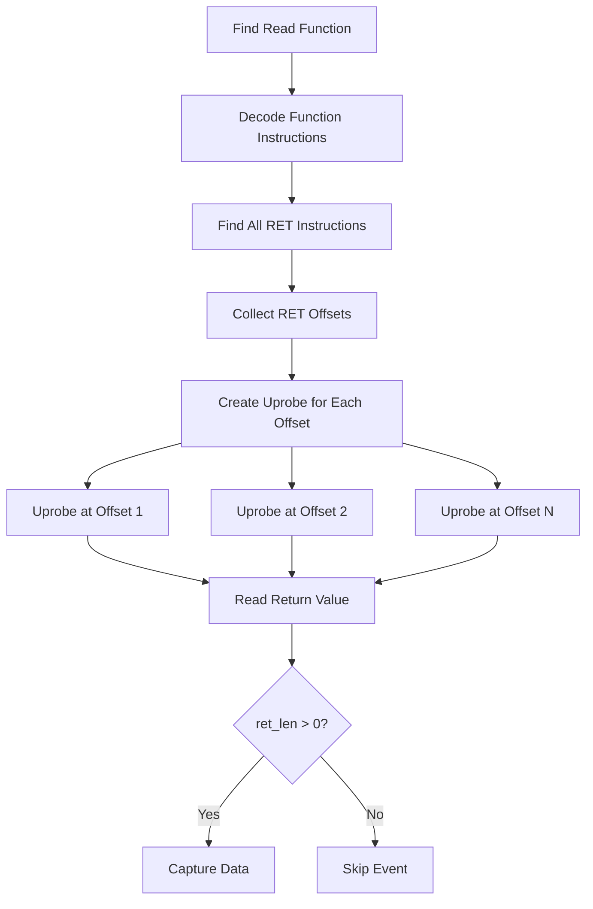

Each RET instruction gets a unique uprobe with a UID like `gotls_read_register_12345` where `12345` is the offset.

**Return Value Extraction:**
- **Register ABI**: Return value in register (param 1 via `go_get_argument`)
- **Stack ABI**: Return value on stack at position 5

**Sources:** [user/module/probe_gotls_text.go:83-97](https://github.com/gojue/ecapture/blob/ca085d05/user/module/probe_gotls_text.go#L83-L97), [kern/gotls_kern.c:137-179](https://github.com/gojue/ecapture/blob/ca085d05/kern/gotls_kern.c#L137-L179)

---

## Master Secret Extraction

The module captures TLS secrets from the `writeKeyLog` function which Go's crypto/tls calls to export secrets when `SSLKEYLOGFILE` environment variable is set, or when explicitly configured.

### Argument Layout

Go function signature:
```go
func (c *Config) writeKeyLog(label string, clientRandom, secret []byte) error
```

**Slice Structure in Go:**
```
type slice struct {
    array unsafe.Pointer  // Data pointer
    len   int             // Length
    cap   int             // Capacity
}
```

**Argument Indices:**

| Argument | Index (Register) | Description |
|----------|-----------------|-------------|
| `label` pointer | 2 | String data pointer |
| `label` length | 3 | String length |
| `clientRandom` pointer | 4 | Slice data pointer |
| `clientRandom` length | 5 | Slice length |
| `clientRandom` capacity | 6 | Slice capacity (not used) |
| `secret` pointer | 7 | Slice data pointer |
| `secret` length | 8 | Slice length |

**Sources:** [kern/gotls_kern.c:194-267](https://github.com/gojue/ecapture/blob/ca085d05/kern/gotls_kern.c#L194-L267)

### Secret Storage

The module maintains a deduplication map to avoid writing duplicate secrets:

```go
masterSecrets map[string]bool  // Key: "LABEL-clientRandomHex"
```

Before writing a secret, it checks if the key exists in the map. This prevents duplicate entries when the same TLS session is logged multiple times.

**Output Format:**
```
CLIENT_HANDSHAKE_TRAFFIC_SECRET <client_random_hex> <secret_hex>
SERVER_HANDSHAKE_TRAFFIC_SECRET <client_random_hex> <secret_hex>
```

**Sources:** [user/module/probe_gotls.go:52-53](https://github.com/gojue/ecapture/blob/ca085d05/user/module/probe_gotls.go#L52-L53), [user/module/probe_gotls.go:244-283](https://github.com/gojue/ecapture/blob/ca085d05/user/module/probe_gotls.go#L244-L283)

---

## Module Lifecycle

### Initialization Flow

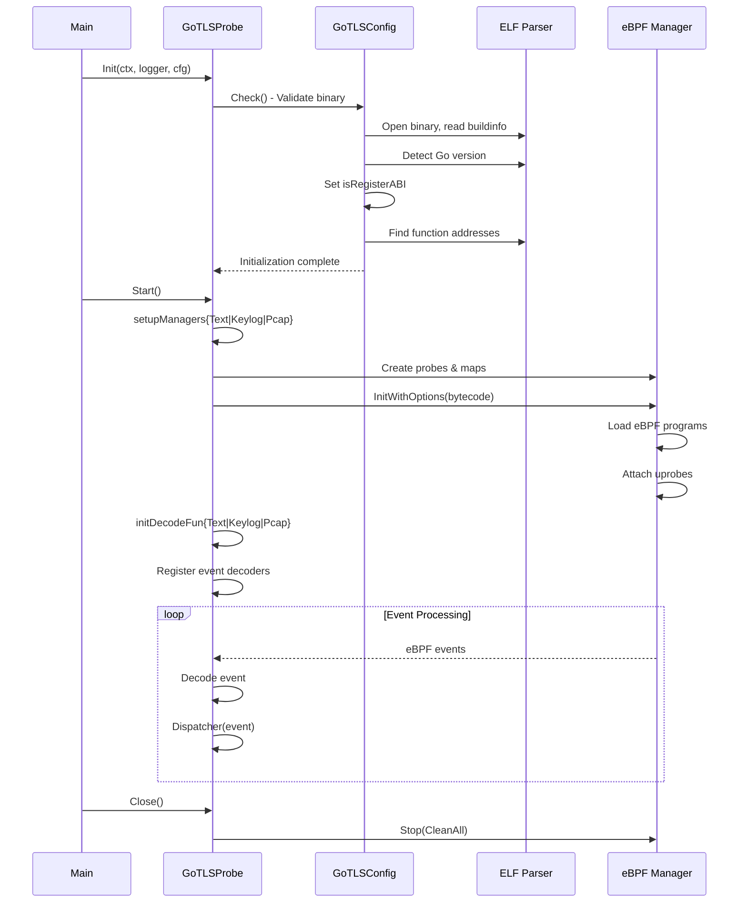

**Sources:** [user/module/probe_gotls.go:58-122](https://github.com/gojue/ecapture/blob/ca085d05/user/module/probe_gotls.go#L58-L122), [user/module/probe_gotls.go:128-189](https://github.com/gojue/ecapture/blob/ca085d05/user/module/probe_gotls.go#L128-L189)

### Manager Setup by Mode

Each capture mode creates different probe configurations:

**Text Mode:**
- **Probes**: `writeRecordLocked` entry + multiple `Read` return points
- **Maps**: `events`
- **Decoders**: `GoTLSEvent`

**Keylog Mode:**
- **Probes**: `writeKeyLog` entry only
- **Maps**: `mastersecret_go_events`
- **Decoders**: `MasterSecretGotlsEvent`

**PCAP Mode:**
- **Probes**: `writeKeyLog` entry + TC classifiers on network interface
- **Maps**: `mastersecret_go_events`, `skb_events`, `network_map`
- **Decoders**: `MasterSecretGotlsEvent`, `TcSkbEvent`

**Sources:** [user/module/probe_gotls_text.go:31-135](https://github.com/gojue/ecapture/blob/ca085d05/user/module/probe_gotls_text.go#L31-L135), [user/module/probe_gotls_keylog.go:31-122](https://github.com/gojue/ecapture/blob/ca085d05/user/module/probe_gotls_keylog.go#L31-L122), [user/module/probe_gotls_pcap.go (inferred)]()

---

## PIE (Position Independent Executable) Support

Modern Go binaries are often compiled with `-buildmode=pie` for security. PIE binaries have different symbol resolution requirements.

### Detection

```go
for _, bs := range gc.Buildinfo.Settings {
    if bs.Key == "-buildmode" && bs.Value == "pie" {
        gc.IsPieBuildMode = true
        break
    }
}
```

### Symbol Resolution Differences

| Aspect | Non-PIE | PIE |
|--------|---------|-----|
| Symbol addresses | Absolute | Relative to base |
| Symbol table location | `.symtab` | `.gopclntab` + `.data.rel.ro` |
| Address calculation | `f.Entry - textAddr + textOffset` | `f.Entry` (already relative) |
| Function data location | `.text` section | PT_LOAD segments |

**Sources:** [user/config/config_gotls.go:155-183](https://github.com/gojue/ecapture/blob/ca085d05/user/config/config_gotls.go#L155-L183), [user/config/config_gotls.go:350-380](https://github.com/gojue/ecapture/blob/ca085d05/user/config/config_gotls.go#L350-L380)

---

## Configuration Reference

### GoTLSConfig Structure

```go
type GoTLSConfig struct {
    BaseConfig
    Path                  string    // Path to Go binary
    PcapFile              string    // PCAP output file (pcap mode)
    KeylogFile            string    // Keylog output file (keylog mode)
    Model                 string    // "text", "pcap", "keylog"
    Ifname                string    // Network interface (pcap mode)
    PcapFilter            string    // BPF filter (pcap mode)
    
    // Detected values
    Buildinfo             *buildinfo.BuildInfo
    ReadTlsAddrs          []int     // RET instruction offsets
    GoTlsWriteAddr        uint64    // writeRecordLocked address
    GoTlsMasterSecretAddr uint64    // writeKeyLog address
    IsPieBuildMode        bool      // PIE detection result
}
```

**Sources:** [user/config/config_gotls.go:77-94](https://github.com/gojue/ecapture/blob/ca085d05/user/config/config_gotls.go#L77-L94)

### Command-Line Flags

The `gotls` subcommand accepts the following flags:

| Flag | Type | Description | Default |
|------|------|-------------|---------|
| `--golang` | string | Path to Go binary | (required) |
| `-m, --model` | string | Capture mode: text/pcap/keylog | "text" |
| `-i, --ifname` | string | Network interface (pcap mode) | "" |
| `--pcapfile` | string | Output pcap file | "gotls.pcapng" |
| `--keylogfile` | string | Output keylog file | "gotls_keylog.log" |
| `--pcap-filter` | string | BPF filter expression | "" |
| `--pid` | uint | Target process ID | 0 (all) |
| `--uid` | uint | Target user ID | 0 (all) |

**Sources:** [cli/cmd/gotls.go (inferred)]()

---

## Event Processing

### Event Dispatcher

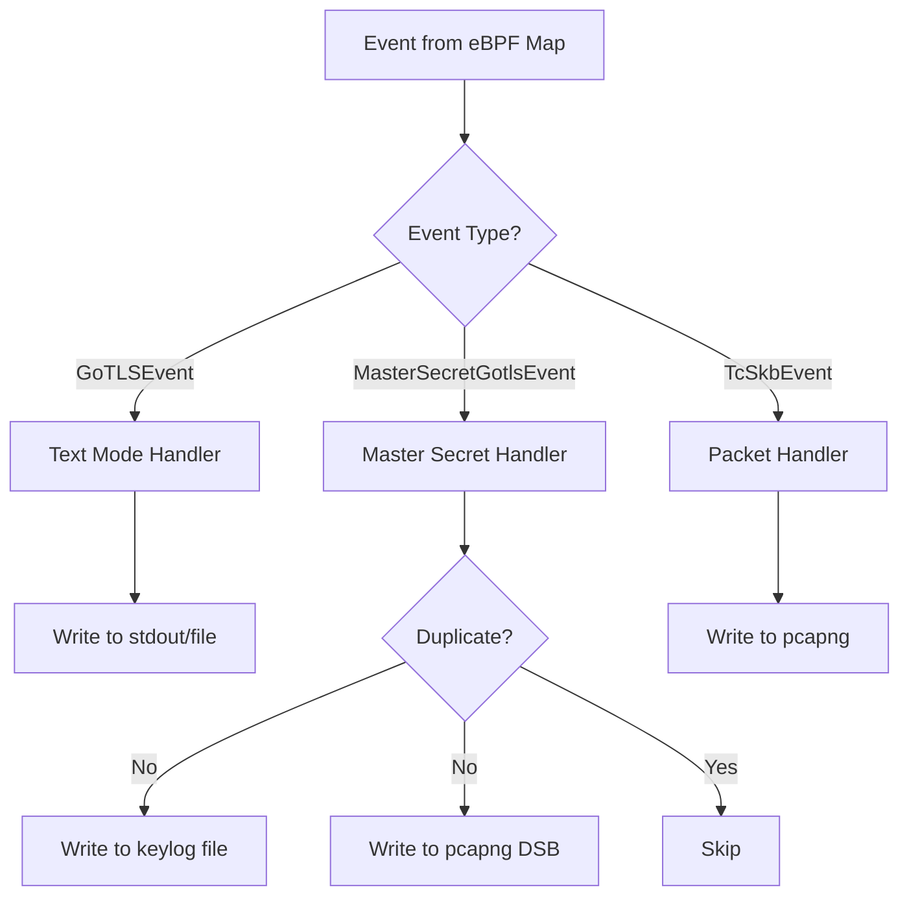

The `Dispatcher` method routes events based on their concrete type:

```go
func (g *GoTLSProbe) Dispatcher(eventStruct event.IEventStruct) {
    switch eventStruct.(type) {
    case *event.MasterSecretGotlsEvent:
        g.saveMasterSecret(eventStruct.(*event.MasterSecretGotlsEvent))
    case *event.TcSkbEvent:
        g.dumpTcSkb(eventStruct.(*event.TcSkbEvent))
    }
}
```

**Sources:** [user/module/probe_gotls.go:285-296](https://github.com/gojue/ecapture/blob/ca085d05/user/module/probe_gotls.go#L285-L296)

---

## Limitations and Considerations

### Supported Go Versions

- **Minimum**: Go 1.8 (introduction of stable crypto/tls API)
- **Register ABI**: Go 1.17+ (requires separate eBPF programs)
- **Tested**: Go 1.17 through 1.24+

### Binary Requirements

- Must be a valid Go executable (not a script or non-Go binary)
- ELF format (Linux only)
- Architecture: x86_64 or arm64 (matches eCapture build arch)
- Must not be stripped completely (needs `.gopclntab` for symbol resolution)

### Known Issues

1. **Inlined Functions**: If the compiler inlines `Read` or `writeRecordLocked`, hooks may not attach
2. **Stripped Binaries**: Completely stripped binaries without `.gopclntab` cannot be hooked
3. **Custom TLS Implementations**: Only captures traffic through `crypto/tls` package
4. **FIPS Mode**: Go's FIPS mode (BoringCrypto) may have different internal structures

**Sources:** [user/config/config_gotls.go:103-213](https://github.com/gojue/ecapture/blob/ca085d05/user/config/config_gotls.go#L103-L213), [user/module/probe_gotls.go:71-79](https://github.com/gojue/ecapture/blob/ca085d05/user/module/probe_gotls.go#L71-L79)

---

## Integration with Other Modules

### Shared Components

The Go TLS module leverages common infrastructure:

- **MTCProbe**: Base probe implementation with TC and pcapng support
- **EventProcessor**: Event dispatching and worker management
- **IParser**: Protocol parsing for HTTP/HTTP2 detection
- **Network Tracking**: Shares `network_map` for process-to-connection mapping

### Event Flow to Output

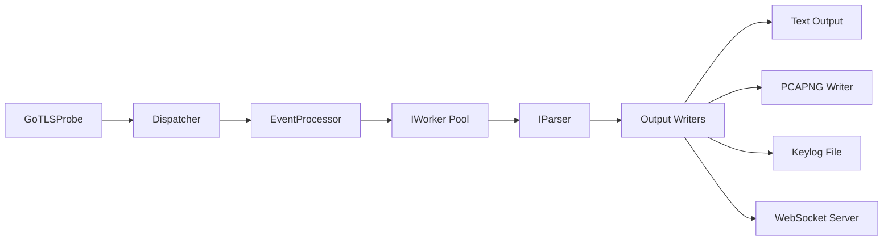

**Sources:** [user/module/probe_gotls.go:43-56](https://github.com/gojue/ecapture/blob/ca085d05/user/module/probe_gotls.go#L43-L56), [user/module/probe_base.go (inferred)]()

---

## Example Usage

### Basic Text Capture

```bash
# Capture TLS from a Go web server
sudo ecapture gotls --golang=/usr/local/bin/myapp

# Target specific process
sudo ecapture gotls --golang=/usr/bin/go-service --pid=1234
```

### Keylog Extraction

```bash
# Extract master secrets for offline decryption
sudo ecapture gotls --golang=/app/server \
  -m keylog \
  --keylogfile=/tmp/tls_keys.log

# Use with Wireshark
SSLKEYLOGFILE=/tmp/tls_keys.log wireshark
```

### PCAP with Decryption Secrets

```bash
# Capture packets with embedded secrets
sudo ecapture gotls --golang=/usr/bin/myapp \
  -m pcap \
  -i eth0 \
  --pcapfile=/tmp/capture.pcapng

# Open in Wireshark (secrets auto-loaded from DSB)
wireshark /tmp/capture.pcapng
```

**Sources:** [README.md (inferred)](), [cli/cmd/gotls.go (inferred)]()