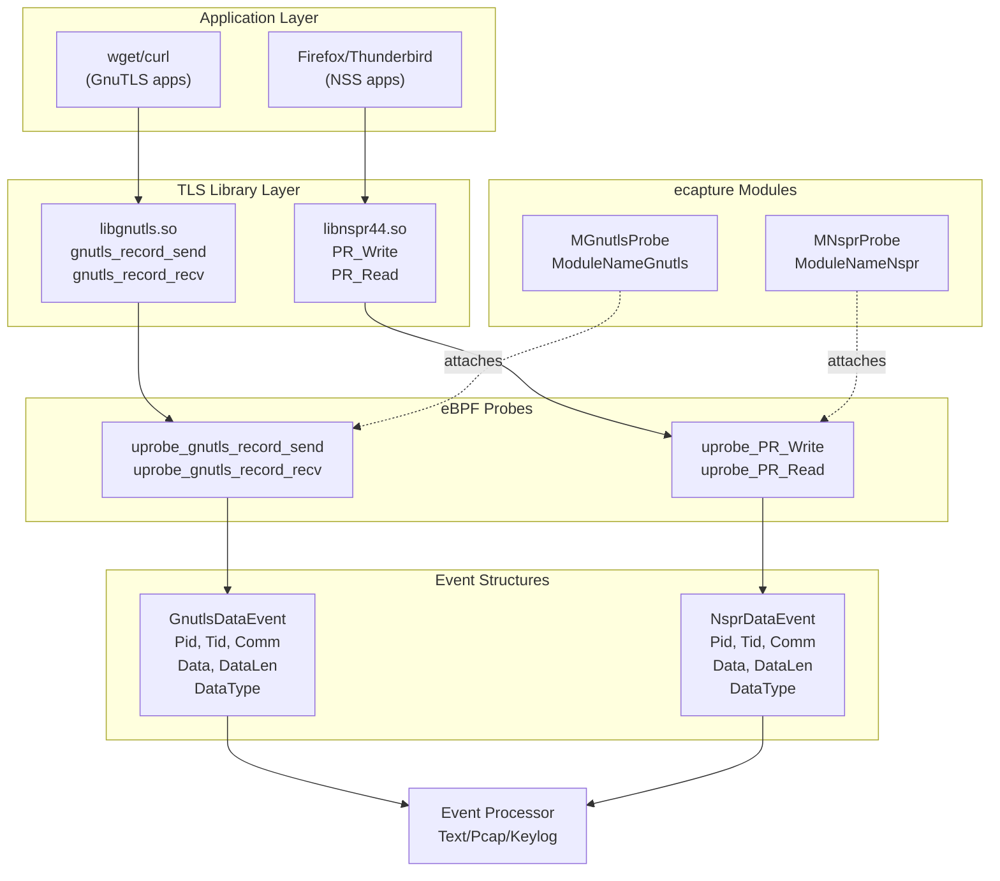
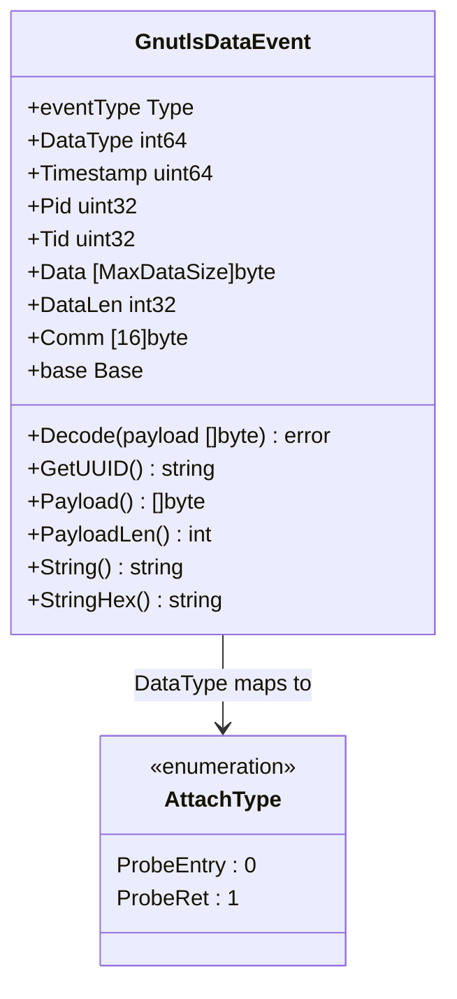
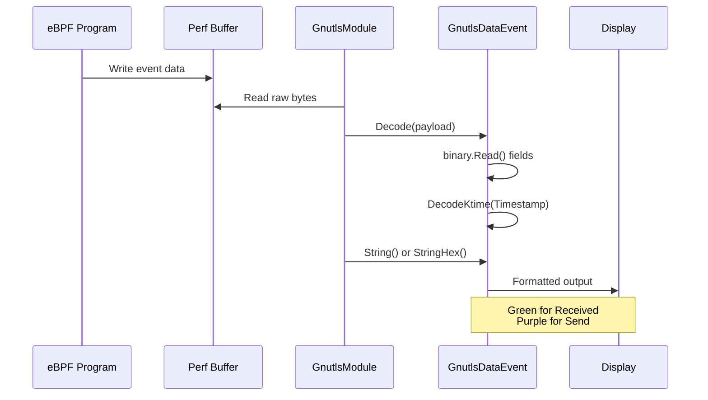
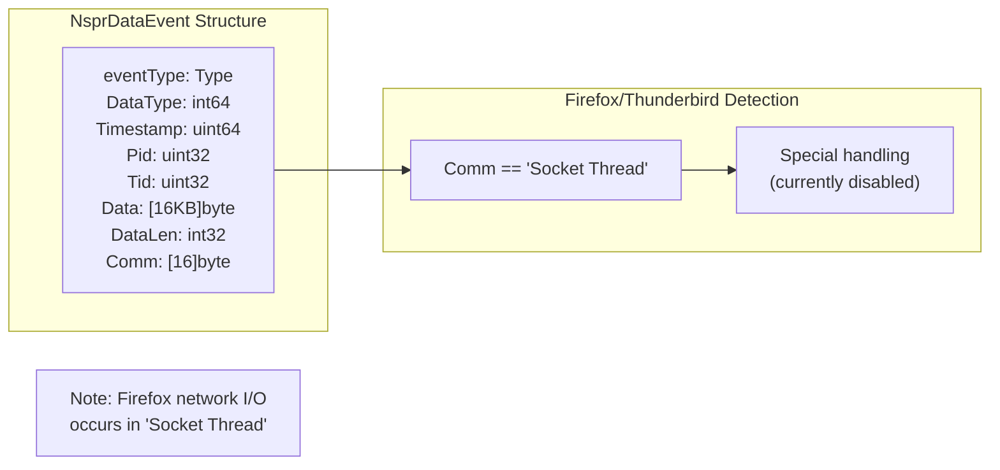
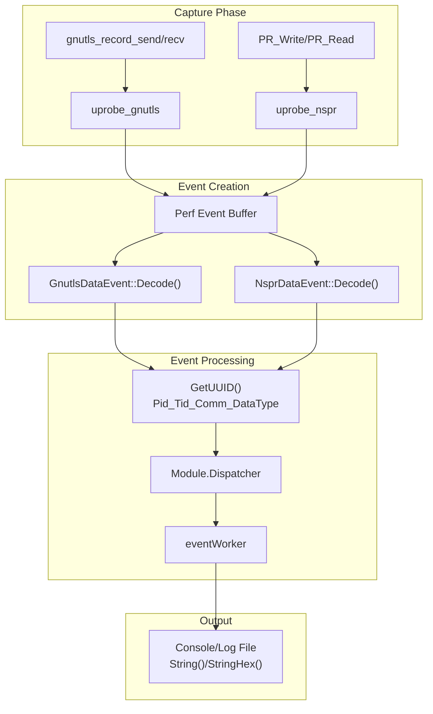
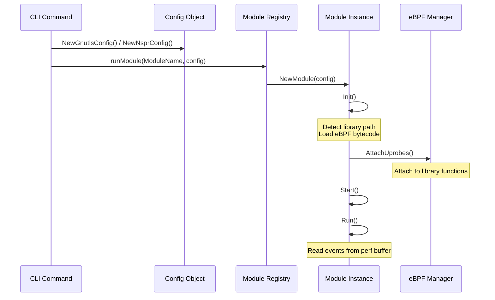
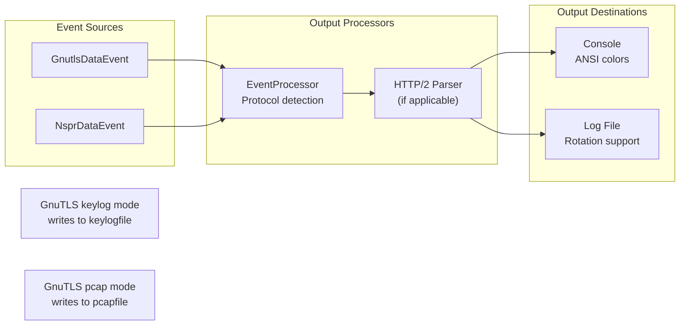

# GnuTLS and NSS Modules

<details>
<summary>Relevant source files</summary>

The following files were used as context for generating this wiki page:

- [CHANGELOG.md](https://github.com/gojue/ecapture/blob/ca085d05/CHANGELOG.md)
- [README.md](https://github.com/gojue/ecapture/blob/ca085d05/README.md)
- [README_CN.md](https://github.com/gojue/ecapture/blob/ca085d05/README_CN.md)
- [cli/cmd/bash.go](https://github.com/gojue/ecapture/blob/ca085d05/cli/cmd/bash.go)
- [cli/cmd/gnutls.go](https://github.com/gojue/ecapture/blob/ca085d05/cli/cmd/gnutls.go)
- [cli/cmd/gotls.go](https://github.com/gojue/ecapture/blob/ca085d05/cli/cmd/gotls.go)
- [cli/cmd/mysqld.go](https://github.com/gojue/ecapture/blob/ca085d05/cli/cmd/mysqld.go)
- [cli/cmd/nspr.go](https://github.com/gojue/ecapture/blob/ca085d05/cli/cmd/nspr.go)
- [cli/cmd/postgres.go](https://github.com/gojue/ecapture/blob/ca085d05/cli/cmd/postgres.go)
- [cli/cmd/tls.go](https://github.com/gojue/ecapture/blob/ca085d05/cli/cmd/tls.go)
- [cli/cmd/zsh.go](https://github.com/gojue/ecapture/blob/ca085d05/cli/cmd/zsh.go)
- [images/ecapture-help-v0.8.9.svg](https://github.com/gojue/ecapture/blob/ca085d05/images/ecapture-help-v0.8.9.svg)
- [main.go](https://github.com/gojue/ecapture/blob/ca085d05/main.go)
- [pkg/util/ws/client.go](https://github.com/gojue/ecapture/blob/ca085d05/pkg/util/ws/client.go)
- [pkg/util/ws/client_test.go](https://github.com/gojue/ecapture/blob/ca085d05/pkg/util/ws/client_test.go)

</details>


## Purpose and Scope

This document describes the GnuTLS and NSS/NSPR capture modules in ecapture. These modules provide TLS/SSL traffic interception for applications that use alternative TLS libraries instead of OpenSSL. For OpenSSL and BoringSSL interception, see [OpenSSL/BoringSSL Module](3.1.1-openssl-module.md). For Go's native TLS implementation, see [Go TLS Module](3.1.2-boringssl-module.md).

The GnuTLS module targets applications using the GNU TLS library (`libgnutls.so`), commonly found in GTK-based applications and Linux command-line tools like `wget`. The NSS/NSPR module targets applications using Mozilla's Network Security Services library (`libnspr44.so`), primarily Firefox, Thunderbird, and Chrome on some Linux distributions.

## Module Architecture

Both modules follow the standard ecapture module pattern but hook different library functions than the OpenSSL module. They capture plaintext data at the TLS library boundary before encryption (send) and after decryption (receive).



**Sources:** [cli/cmd/gnutls.go:1-65](https://github.com/gojue/ecapture/blob/ca085d05/cli/cmd/gnutls.go#L1-L65), [cli/cmd/nspr.go:1-52](https://github.com/gojue/ecapture/blob/ca085d05/cli/cmd/nspr.go#L1-L52), [user/event/event_gnutls.go:1-157](https://github.com/gojue/ecapture/blob/ca085d05/user/event/event_gnutls.go#L1-L157), [user/event/event_nspr.go:1-174](https://github.com/gojue/ecapture/blob/ca085d05/user/event/event_nspr.go#L1-L174)

## GnuTLS Module

### CLI Command and Configuration

The GnuTLS module is invoked using the `gnutls` command (alias: `gnu`). It provides options similar to the OpenSSL module but targets GnuTLS libraries.

| Flag | Short | Default | Description |
|------|-------|---------|-------------|
| `--gnutls` | | (auto-detect) | Path to `libgnutls.so`, auto-discovered from system paths if not specified |
| `--model` | `-m` | `text` | Capture mode: `text`, `pcap`/`pcapng`, `key`/`keylog` |
| `--keylogfile` | `-k` | `ecapture_gnutls_key.log` | File path for TLS key logging |
| `--pcapfile` | `-w` | `save.pcapng` | Output file for pcapng capture |
| `--ifname` | `-i` | | Network interface for TC classifier (pcap mode) |
| `--ssl_version` | | | GnuTLS version string, e.g., `--ssl_version="3.7.9"` |

**Sources:** [cli/cmd/gnutls.go:29-56](https://github.com/gojue/ecapture/blob/ca085d05/cli/cmd/gnutls.go#L29-L56)

### Usage Examples

```bash
# Basic text capture
ecapture gnutls

# Capture with hex output for specific PID
ecapture gnutls --hex --pid=3423

# Save to log file
ecapture gnutls -l save.log --pid=3423

# Specify custom library path
ecapture gnutls --gnutls=/lib/x86_64-linux-gnu/libgnutls.so

# Keylog mode for Wireshark decryption
ecapture gnutls -m keylog -k ecapture_gnutls_key.log --ssl_version=3.7.9

# Pcap capture with network interface
ecapture gnutls -m pcap --pcapfile save.pcapng -i eth0 --gnutls=/lib/x86_64-linux-gnu/libgnutls.so tcp port 443
```

**Sources:** [cli/cmd/gnutls.go:36-43](https://github.com/gojue/ecapture/blob/ca085d05/cli/cmd/gnutls.go#L36-L43)

### GnuTLS Event Structure

The `GnutlsDataEvent` structure captures plaintext data intercepted at the GnuTLS library boundary.



**Event Fields:**

- **DataType**: `0` (ProbeEntry) for received data, `1` (ProbeRet) for sent data
- **Timestamp**: Kernel time converted to Unix nanoseconds using `DecodeKtime()`
- **Pid/Tid**: Process ID and thread ID of the GnuTLS-using process
- **Comm**: Process command name (16 bytes)
- **Data**: Raw plaintext payload (up to `MaxDataSize` = 16KB)
- **DataLen**: Actual length of captured data

**UUID Format:** `Pid_Tid_Comm_DataType` - e.g., `12345_12346_wget_0`

**Sources:** [user/event/event_gnutls.go:25-157](https://github.com/gojue/ecapture/blob/ca085d05/user/event/event_gnutls.go#L25-L157)

### Event Decoding and Display

The module decodes events from binary eBPF perf buffer data:



The `String()` method formats output with color coding:
- **Green (ProbeEntry)**: `Received N bytes`
- **Purple (ProbeRet)**: `Send N bytes`

Example output format:
```
PID:1234, Comm:wget, TID:1234, TYPE:Received, DataLen:512 bytes, Payload:
GET / HTTP/1.1
Host: example.com
```

**Sources:** [user/event/event_gnutls.go:37-102](https://github.com/gojue/ecapture/blob/ca085d05/user/event/event_gnutls.go#L37-L102)

## NSS/NSPR Module

### CLI Command and Configuration

The NSS/NSPR module is invoked using the `nspr` command (alias: `nss`). It is simpler than the GnuTLS module, providing only text-mode capture.

| Flag | Default | Description |
|------|---------|-------------|
| `--nspr` | (auto-detect) | Path to `libnspr44.so`, auto-discovered if not specified |

**Module Aliases:** The command can be invoked as either `ecapture nspr` or `ecapture nss`.

**Sources:** [cli/cmd/nspr.go:27-46](https://github.com/gojue/ecapture/blob/ca085d05/cli/cmd/nspr.go#L27-L46)

### Usage Examples

```bash
# Basic capture
ecapture nspr

# Hex output for specific PID
ecapture nspr --hex --pid=3423

# Save to log file
ecapture nspr -l save.log --pid=3423

# Specify custom library path
ecapture nspr --nspr=/lib/x86_64-linux-gnu/libnspr44.so
```

**Sources:** [cli/cmd/nspr.go:35-39](https://github.com/gojue/ecapture/blob/ca085d05/cli/cmd/nspr.go#L35-L39)

### NSS/NSPR Event Structure

The `NsprDataEvent` structure is nearly identical to `GnutlsDataEvent` but includes special handling for Mozilla applications.



**Key Differences from GnuTLS:**
- Target library: `libnspr44.so` (Mozilla's NSPR)
- Primary use case: Firefox, Thunderbird, Chrome (some distributions)
- Thread-name aware: Firefox's network operations occur in threads named "Socket Thread"

**Sources:** [user/event/event_nspr.go:26-174](https://github.com/gojue/ecapture/blob/ca085d05/user/event/event_nspr.go#L26-L174)

### Firefox/Thunderbird Support

The NSS/NSPR module is specifically designed for Mozilla applications. The event decoder contains logic to detect Firefox's communication thread:

```
var fireThread = strings.TrimSpace(fmt.Sprintf("%s", ne.Comm[:13]))
// Firefox network thread is named "Socket Thread"
```

While the filtering is currently disabled (`if false && ...`), this demonstrates awareness of Mozilla's threading model. The first 13 bytes of the `Comm` field are checked against the string "Socket Thread".

**UUID Format:** `Pid_Tid_Comm_DataType` - e.g., `5678_5679_Socket Thread_1`

**Sources:** [user/event/event_nspr.go:84-93](https://github.com/gojue/ecapture/blob/ca085d05/user/event/event_nspr.go#L84-L93)

## Event Processing Flow

Both modules follow identical event processing paths after capturing data:



**Event Type:** Both modules use `TypeEventProcessor` as their event type, which routes events to the event processing pipeline for potential HTTP parsing and protocol detection.

**Sources:** [user/event/event_gnutls.go:104-108](https://github.com/gojue/ecapture/blob/ca085d05/user/event/event_gnutls.go#L104-L108), [user/event/event_nspr.go:123-127](https://github.com/gojue/ecapture/blob/ca085d05/user/event/event_nspr.go#L123-L127)

## Comparison with OpenSSL Module

The following table highlights key differences between the OpenSSL, GnuTLS, and NSS modules:

| Feature | OpenSSL Module | GnuTLS Module | NSS/NSPR Module |
|---------|----------------|---------------|-----------------|
| **Target Library** | `libssl.so` | `libgnutls.so` | `libnspr44.so` |
| **Version Detection** | Extensive (1.0.2 - 3.5, BoringSSL) | Basic (version flag) | Not required |
| **Capture Modes** | text, pcap, keylog | text, pcap, keylog | text only |
| **Connection Tracking** | Yes (Tuple, Sock, Fd) | No | No |
| **Master Secret Extraction** | Yes (TLS 1.2/1.3) | Yes (keylog mode) | No |
| **Network Context** | Full (IP:Port tuples) | Limited | Limited |
| **Primary Use Cases** | curl, nginx, Apache | wget, GTK apps | Firefox, Thunderbird |
| **Event Structure Complexity** | High (`SSLDataEvent`) | Medium (`GnutlsDataEvent`) | Medium (`NsprDataEvent`) |
| **BIO Type Support** | Yes | No | No |

**Sources:** [user/event/event_openssl.go:77-198](https://github.com/gojue/ecapture/blob/ca085d05/user/event/event_openssl.go#L77-L198), [user/event/event_gnutls.go:25-157](https://github.com/gojue/ecapture/blob/ca085d05/user/event/event_gnutls.go#L25-L157), [user/event/event_nspr.go:26-174](https://github.com/gojue/ecapture/blob/ca085d05/user/event/event_nspr.go#L26-L174)

## Module Registration and Initialization

Both modules register with the ecapture module system through the standard pattern:



**Module Names:**
- GnuTLS: `module.ModuleNameGnutls`
- NSS/NSPR: `module.ModuleNameNspr`

**Sources:** [cli/cmd/gnutls.go:59-64](https://github.com/gojue/ecapture/blob/ca085d05/cli/cmd/gnutls.go#L59-L64), [cli/cmd/nspr.go:49-51](https://github.com/gojue/ecapture/blob/ca085d05/cli/cmd/nspr.go#L49-L51)

## Library Detection Strategy

Both modules support automatic library detection when no path is specified:

1. **Search System Paths**: Check standard library locations (`/lib`, `/usr/lib`, `/lib64`, `/usr/lib64`)
2. **LD Library Path**: Parse `/etc/ld.so.conf` and `/etc/ld.so.conf.d/*`
3. **Linked Libraries**: Examine target process memory maps
4. **Fallback**: Use default system paths

**Specified Path Priority**: If `--gnutls` or `--nspr` flags are provided, those paths are used directly without auto-detection.

**Sources:** [cli/cmd/gnutls.go:49](https://github.com/gojue/ecapture/blob/ca085d05/cli/cmd/gnutls.go#L49), [cli/cmd/nspr.go:44](https://github.com/gojue/ecapture/blob/ca085d05/cli/cmd/nspr.go#L44)

## Limitations and Considerations

### GnuTLS Module Limitations
- **No connection correlation**: Unlike OpenSSL module, does not capture socket metadata or connection tuples
- **Version compatibility**: May require `--ssl_version` flag for accurate keylog generation
- **Pcap mode complexity**: Requires TC classifier for network-level capture

### NSS/NSPR Module Limitations
- **Text mode only**: No pcap or keylog modes currently implemented
- **Thread filtering**: Firefox-specific optimizations are disabled in current implementation
- **Limited metadata**: No TLS version, cipher, or connection information captured

### Common Limitations
- **Binary data handling**: Both modules capture up to 16KB (`MaxDataSize`) per event, which may truncate large payloads
- **Performance impact**: Uprobe overhead increases with high-frequency calls
- **Root privileges**: Both modules require root/CAP_BPF capabilities

**Sources:** [user/event/event_gnutls.go:32](https://github.com/gojue/ecapture/blob/ca085d05/user/event/event_gnutls.go#L32), [user/event/event_nspr.go:32](https://github.com/gojue/ecapture/blob/ca085d05/user/event/event_nspr.go#L32)

## Integration with Output Formats

Both modules support the standard ecapture output pipeline:



**Protobuf Support**: Both event types implement `ToProtobufEvent()` for serialization to external systems, though they populate limited fields (no IP addresses or ports).

**Sources:** [user/event/event_gnutls.go:125-139](https://github.com/gojue/ecapture/blob/ca085d05/user/event/event_gnutls.go#L125-L139), [user/event/event_nspr.go:143-157](https://github.com/gojue/ecapture/blob/ca085d05/user/event/event_nspr.go#L143-L157)