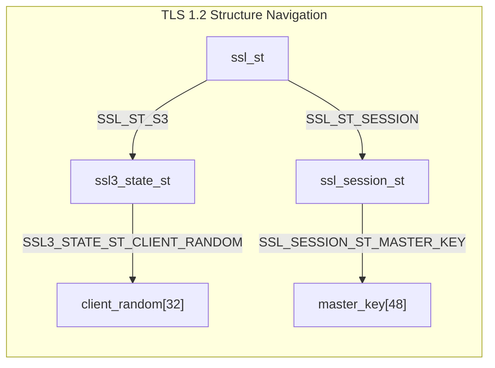
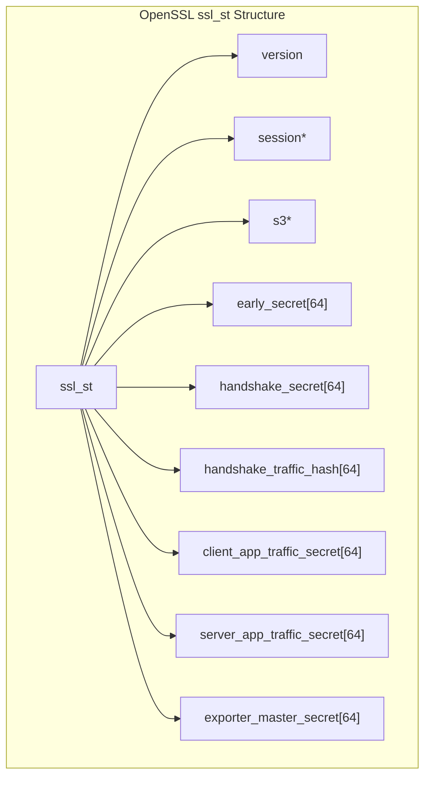
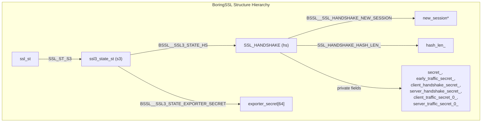
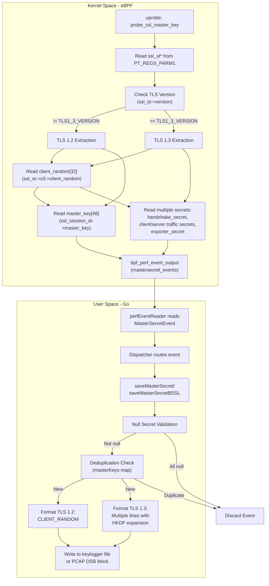
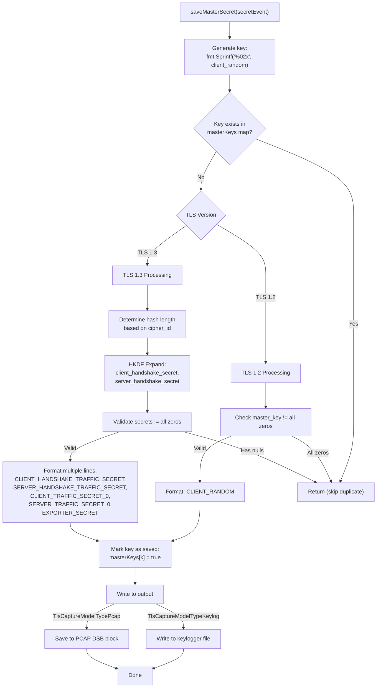

# Master Secret Extraction

<details>
<summary>Relevant source files</summary>

The following files were used as context for generating this wiki page:

- [cli/cmd/root.go](https://github.com/gojue/ecapture/blob/0766a93b/cli/cmd/root.go)
- [kern/boringssl_const.h](https://github.com/gojue/ecapture/blob/0766a93b/kern/boringssl_const.h)
- [kern/boringssl_masterkey.h](https://github.com/gojue/ecapture/blob/0766a93b/kern/boringssl_masterkey.h)
- [kern/openssl_masterkey.h](https://github.com/gojue/ecapture/blob/0766a93b/kern/openssl_masterkey.h)
- [kern/openssl_masterkey_3.0.h](https://github.com/gojue/ecapture/blob/0766a93b/kern/openssl_masterkey_3.0.h)
- [user/config/iconfig.go](https://github.com/gojue/ecapture/blob/0766a93b/user/config/iconfig.go)
- [user/module/imodule.go](https://github.com/gojue/ecapture/blob/0766a93b/user/module/imodule.go)
- [user/module/probe_openssl.go](https://github.com/gojue/ecapture/blob/0766a93b/user/module/probe_openssl.go)
- [utils/boringssl-offset.c](https://github.com/gojue/ecapture/blob/0766a93b/utils/boringssl-offset.c)

</details>


This document describes the mechanisms eCapture uses to extract TLS master secrets and traffic keys from OpenSSL and BoringSSL libraries. These secrets enable decryption of captured TLS traffic without requiring certificate private keys.

For information about general TLS capture architecture, see [OpenSSL Module](3.1.1-openssl-module.md). For keylog file generation and PCAP integration, see [TLS Key Logging](../4-output-formats/4.3-tls-key-logging.md) and [PCAP Integration](../4-output-formats/4.2-pcap-integration.md).

## Overview

Master secret extraction operates through eBPF uprobes attached to SSL/TLS library functions. eCapture intercepts cryptographic handshakes to capture:

- **TLS 1.2**: Single master secret derived during handshake
- **TLS 1.3**: Multiple traffic secrets (handshake, client/server traffic, exporter secrets)

The extracted secrets are exported in SSLKEYLOGFILE format for use with Wireshark and other decryption tools.

Sources: [user/module/probe_openssl.go:482-575](https://github.com/gojue/ecapture/blob/0766a93b/user/module/probe_openssl.go#L482-L575), [kern/openssl_masterkey.h:25-39](https://github.com/gojue/ecapture/blob/0766a93b/kern/openssl_masterkey.h#L25-L39), [kern/boringssl_masterkey.h:37-56](https://github.com/gojue/ecapture/blob/0766a93b/kern/boringssl_masterkey.h#L37-L56)

## TLS Version Differences

### TLS 1.2 Secret Extraction

TLS 1.2 uses a single 48-byte `master_key` derived from the pre-master secret and client/server random values. This master key remains constant for the session.



**TLS 1.2 Extraction Process:**
1. Read `ssl_st->version` to verify TLS version
2. Navigate to `ssl_st->s3->client_random` for the 32-byte random value
3. Navigate to `ssl_st->session->master_key` for the 48-byte master secret
4. Format as: `CLIENT_RANDOM <client_random> <master_key>`

Sources: [kern/openssl_masterkey.h:151-168](https://github.com/gojue/ecapture/blob/0766a93b/kern/openssl_masterkey.h#L151-L168), [kern/boringssl_masterkey.h:288-342](https://github.com/gojue/ecapture/blob/0766a93b/kern/boringssl_masterkey.h#L288-L342)

### TLS 1.3 Secret Extraction

TLS 1.3 replaced the single master secret with multiple derived secrets for different phases:

| Secret Type | Purpose | Size |
|------------|---------|------|
| `early_secret` | Early data (0-RTT) | 32 or 48 bytes |
| `handshake_secret` | Handshake encryption | 32 or 48 bytes |
| `client_handshake_secret` | Derived from handshake_secret | 32 or 48 bytes |
| `server_handshake_secret` | Derived from handshake_secret | 32 or 48 bytes |
| `client_app_traffic_secret` | Client application data | 32 or 48 bytes |
| `server_app_traffic_secret` | Server application data | 32 or 48 bytes |
| `exporter_master_secret` | Key exporters | 32 or 48 bytes |

The secret length depends on cipher suite (32 bytes for SHA256-based, 48 bytes for SHA384-based).

Sources: [kern/openssl_masterkey.h:171-256](https://github.com/gojue/ecapture/blob/0766a93b/kern/openssl_masterkey.h#L171-L256), [kern/boringssl_masterkey.h:344-402](https://github.com/gojue/ecapture/blob/0766a93b/kern/boringssl_masterkey.h#L344-L402), [user/module/probe_openssl.go:502-551](https://github.com/gojue/ecapture/blob/0766a93b/user/module/probe_openssl.go#L502-L551)

## OpenSSL vs BoringSSL Extraction

### OpenSSL Structure Layout

OpenSSL stores TLS 1.3 secrets directly in the `ssl_st` structure at fixed offsets:



**OpenSSL Offset Macros** (version-specific):
- `SSL_ST_VERSION`: Version field offset
- `SSL_ST_SESSION`: Session pointer offset
- `SSL_ST_EARLY_SECRET`: Early secret offset (TLS 1.3)
- `SSL_ST_HANDSHAKE_SECRET`: Handshake secret offset
- `SSL_ST_CLIENT_APP_TRAFFIC_SECRET`: Client traffic secret offset
- `SSL_ST_SERVER_APP_TRAFFIC_SECRET`: Server traffic secret offset
- `SSL_ST_EXPORTER_MASTER_SECRET`: Exporter secret offset

Sources: [kern/openssl_masterkey.h:80-257](https://github.com/gojue/ecapture/blob/0766a93b/kern/openssl_masterkey.h#L80-L257), [kern/openssl_masterkey_3.0.h:80-253](https://github.com/gojue/ecapture/blob/0766a93b/kern/openssl_masterkey_3.0.h#L80-L253)

### BoringSSL Structure Layout

BoringSSL stores TLS 1.3 secrets in the `SSL_HANDSHAKE` structure (accessible via `ssl_st->s3->hs`), and some secrets are marked `private`, requiring manual offset calculation:



**Private Field Offset Calculation:**

BoringSSL's `SSL_HANDSHAKE` structure contains private fields that cannot be accessed via standard `offsetof()`. The offsets are computed manually:

```c
// max_version is the last public field (uint16_t, offset 30)
// After memory alignment to 8 bytes: offset 32
// hash_len_ (size_t): offset 32
// secret_ starts at: 32 + sizeof(size_t) = 40
#define SSL_HANDSHAKE_HASH_LEN_ roundup(BSSL__SSL_HANDSHAKE_MAX_VERSION+2,8)
#define SSL_HANDSHAKE_SECRET_ SSL_HANDSHAKE_HASH_LEN_+8
#define SSL_HANDSHAKE_EARLY_TRAFFIC_SECRET_ SSL_HANDSHAKE_SECRET_+SSL_MAX_MD_SIZE*1
#define SSL_HANDSHAKE_CLIENT_HANDSHAKE_SECRET_ SSL_HANDSHAKE_SECRET_+SSL_MAX_MD_SIZE*2
// ... and so on
```

Sources: [kern/boringssl_const.h:28-60](https://github.com/gojue/ecapture/blob/0766a93b/kern/boringssl_const.h#L28-L60), [kern/boringssl_masterkey.h:90-98](https://github.com/gojue/ecapture/blob/0766a93b/kern/boringssl_masterkey.h#L90-L98), [utils/boringssl-offset.c:23-78](https://github.com/gojue/ecapture/blob/0766a93b/utils/boringssl-offset.c#L23-L78)

## eBPF Hook Point

Both OpenSSL and BoringSSL extraction use the same hook point strategy:

**Uprobe Function:** `SSL_write_key` (symbolic name, actual function varies)

The eBPF program `probe_ssl_master_key` is attached as a uprobe to SSL/TLS library functions. The actual hook functions are determined by version detection (see [Version Detection and Bytecode Selection](../2-architecture/2.5-version-detection-and-bytecode-selection.md)):

| Hook Function | Library | Purpose |
|--------------|---------|---------|
| `SSL_write` | OpenSSL/BoringSSL | Main hook point for capturing secrets during writes |
| `SSL_do_handshake` | OpenSSL/BoringSSL | Handshake completion hook |
| `SSL_get_wbio` | BoringSSL | BIO retrieval for connection tracking |
| `SSL_in_before` | OpenSSL 1.1.0+ | Handshake state check |
| `SSL_state` | OpenSSL 1.0.x | Alternative handshake state (older versions) |

The master hook functions are configured in [user/module/probe_openssl_masterkey.go:13-21](https://github.com/gojue/ecapture/blob/0766a93b/user/module/probe_openssl_masterkey.go#L13-L21):

```go
var masterKeyHookFuncs = []string{
    "SSL_write",
    "SSL_read",
    "SSL_do_handshake",
}
```

Sources: [kern/openssl_masterkey.h:81-82](https://github.com/gojue/ecapture/blob/0766a93b/kern/openssl_masterkey.h#L81-L82), [kern/boringssl_masterkey.h:169-170](https://github.com/gojue/ecapture/blob/0766a93b/kern/boringssl_masterkey.h#L169-L170), [user/module/probe_openssl.go:104](https://github.com/gojue/ecapture/blob/0766a93b/user/module/probe_openssl.go#L104), [user/module/probe_openssl.go:179-195](https://github.com/gojue/ecapture/blob/0766a93b/user/module/probe_openssl.go#L179-L195)

## Extraction Flow

### Complete Extraction Pipeline



Sources: [kern/openssl_masterkey.h:82-257](https://github.com/gojue/ecapture/blob/0766a93b/kern/openssl_masterkey.h#L82-L257), [kern/boringssl_masterkey.h:170-403](https://github.com/gojue/ecapture/blob/0766a93b/kern/boringssl_masterkey.h#L170-L403), [user/module/probe_openssl.go:482-642](https://github.com/gojue/ecapture/blob/0766a93b/user/module/probe_openssl.go#L482-L642)

### State Validation

The eBPF programs check handshake state to ensure secrets are only captured after negotiation completes:

**OpenSSL:** No explicit state check (relies on secret availability)

**BoringSSL TLS 1.2:**
```c
if (ssl3_hs_state.state < CLIENT_STATE12_SEND_CLIENT_FINISHED) {
    return 0; // not finished yet
}
```

**BoringSSL TLS 1.3:**
```c
if (ssl3_hs_state.tls13_state < CLIENT_STATE13_READ_SERVER_FINISHED) {
    return 0; // not finished yet
}
```

Sources: [kern/boringssl_masterkey.h:263-292](https://github.com/gojue/ecapture/blob/0766a93b/kern/boringssl_masterkey.h#L263-L292), [kern/boringssl_masterkey.h:345-348](https://github.com/gojue/ecapture/blob/0766a93b/kern/boringssl_masterkey.h#L345-L348)

## Data Structures

### Kernel-Side Event Structures

**OpenSSL Event Structure:**

```c
struct mastersecret_t {
    s32 version;                                   // TLS version
    u8 client_random[SSL3_RANDOM_SIZE];            // 32 bytes
    u8 master_key[MASTER_SECRET_MAX_LEN];          // 48 bytes (TLS 1.2)
    
    // TLS 1.3 fields
    u32 cipher_id;                                 // Cipher suite ID
    u8 early_secret[EVP_MAX_MD_SIZE];              // 64 bytes
    u8 handshake_secret[EVP_MAX_MD_SIZE];          // 64 bytes
    u8 handshake_traffic_hash[EVP_MAX_MD_SIZE];    // 64 bytes
    u8 client_app_traffic_secret[EVP_MAX_MD_SIZE]; // 64 bytes
    u8 server_app_traffic_secret[EVP_MAX_MD_SIZE]; // 64 bytes
    u8 exporter_master_secret[EVP_MAX_MD_SIZE];    // 64 bytes
};
```

**BoringSSL Event Structure:**

```c
struct mastersecret_bssl_t {
    s32 version;                                   // TLS version
    u8 client_random[SSL3_RANDOM_SIZE];            // 32 bytes
    u8 secret_[MASTER_SECRET_MAX_LEN];             // 48 bytes (TLS 1.2)
    
    // TLS 1.3 fields
    u32 hash_len;                                  // Hash length (32 or 48)
    u8 early_traffic_secret_[EVP_MAX_MD_SIZE];    // 64 bytes
    u8 client_handshake_secret_[EVP_MAX_MD_SIZE]; // 64 bytes
    u8 server_handshake_secret_[EVP_MAX_MD_SIZE]; // 64 bytes
    u8 client_traffic_secret_0_[EVP_MAX_MD_SIZE]; // 64 bytes
    u8 server_traffic_secret_0_[EVP_MAX_MD_SIZE]; // 64 bytes
    u8 exporter_secret[EVP_MAX_MD_SIZE];          // 64 bytes
};
```

Sources: [kern/openssl_masterkey.h:25-39](https://github.com/gojue/ecapture/blob/0766a93b/kern/openssl_masterkey.h#L25-L39), [kern/boringssl_masterkey.h:37-56](https://github.com/gojue/ecapture/blob/0766a93b/kern/boringssl_masterkey.h#L37-L56)

### User-Space Event Structures

The Go-side mirrors these structures in [user/event/event_openssl.go](https://github.com/gojue/ecapture/blob/0766a93b/user/event/event_openssl.go):

- `MasterSecretEvent`: OpenSSL master secret event
- `MasterSecretBSSLEvent`: BoringSSL master secret event

Both implement the `IEventStruct` interface for unified event processing.

Sources: [user/module/probe_openssl.go:50-56](https://github.com/gojue/ecapture/blob/0766a93b/user/module/probe_openssl.go#L50-L56)

## Master Secret Processing

### User-Space Handler: saveMasterSecret

The `saveMasterSecret` function processes OpenSSL master secret events:



Sources: [user/module/probe_openssl.go:482-575](https://github.com/gojue/ecapture/blob/0766a93b/user/module/probe_openssl.go#L482-L575)

### TLS 1.3 HKDF Expansion

For TLS 1.3, the handshake secrets must be expanded using HKDF-Expand-Label:

**Cipher Suite Hash Determination:**

| Cipher Suite | Hash | Length |
|-------------|------|--------|
| `TLS_AES_128_GCM_SHA256` | SHA256 | 32 bytes |
| `TLS_CHACHA20_POLY1305_SHA256` | SHA256 | 32 bytes |
| `TLS_AES_256_GCM_SHA384` | SHA384 | 48 bytes |

**HKDF-Expand-Label Invocations:**

```go
// Expand handshake secret into client/server handshake secrets
clientHandshakeSecret := hkdf.ExpandLabel(
    secretEvent.HandshakeSecret[:length],
    hkdf.ClientHandshakeTrafficLabel,
    secretEvent.HandshakeTrafficHash[:length],
    length,
    transcript
)

serverHandshakeSecret := hkdf.ExpandLabel(
    secretEvent.HandshakeSecret[:length],
    hkdf.ServerHandshakeTrafficLabel,
    secretEvent.HandshakeTrafficHash[:length],
    length,
    transcript
)
```

Labels used:
- `ClientHandshakeTrafficLabel`: "c hs traffic"
- `ServerHandshakeTrafficLabel`: "s hs traffic"

Sources: [user/module/probe_openssl.go:502-551](https://github.com/gojue/ecapture/blob/0766a93b/user/module/probe_openssl.go#L502-L551), [pkg/util/hkdf/hkdf.go](https://github.com/gojue/ecapture/blob/0766a93b/pkg/util/hkdf/hkdf.go)

### Null Secret Validation

Both TLS 1.2 and TLS 1.3 secrets are validated to ensure they are not all zeros (which would indicate an error or incomplete handshake):

**TLS 1.2 Validation:**
```go
func (m *MOpenSSLProbe) mk12NullSecrets(hashLen int, secret []byte) bool {
    isNull := true
    for i := 0; i < hashLen; i++ {
        if secret[i] != 0 {
            isNull = false
            break
        }
    }
    return isNull
}
```

**TLS 1.3 Validation:**
The function checks all five secrets (client handshake, client traffic, server handshake, server traffic, exporter) and returns `true` if any remain all-zero:

```go
func (m *MOpenSSLProbe) mk13NullSecrets(hashLen int,
    ClientHandshakeSecret [64]byte,
    ClientTrafficSecret0 [64]byte,
    ServerHandshakeSecret [64]byte,
    ServerTrafficSecret0 [64]byte,
    ExporterSecret [64]byte) bool {
    // Returns true if any secret is still null
    // ...
}
```

Sources: [user/module/probe_openssl.go:652-731](https://github.com/gojue/ecapture/blob/0766a93b/user/module/probe_openssl.go#L652-L731)

## Output Formats

### SSLKEYLOGFILE Format

The standard format for TLS key logging:

**TLS 1.2:**
```
CLIENT_RANDOM <64 hex digits client_random> <96 hex digits master_key>
```

**TLS 1.3:**
```
CLIENT_HANDSHAKE_TRAFFIC_SECRET <64 hex digits client_random> <64-96 hex digits>
SERVER_HANDSHAKE_TRAFFIC_SECRET <64 hex digits client_random> <64-96 hex digits>
CLIENT_TRAFFIC_SECRET_0 <64 hex digits client_random> <64-96 hex digits>
SERVER_TRAFFIC_SECRET_0 <64 hex digits client_random> <64-96 hex digits>
EXPORTER_SECRET <64 hex digits client_random> <64-96 hex digits>
```

### Output Modes

Based on `TlsCaptureModelType` configuration:

| Mode | Implementation | Output Location |
|------|---------------|-----------------|
| `TlsCaptureModelTypeKeylog` | Write to file via `m.keylogger.WriteString()` | Keylog file specified by `--keylog` flag |
| `TlsCaptureModelTypePcap` | Embed in PCAP-NG DSB block via `m.savePcapngSslKeyLog()` | Inside PCAP-NG file |
| `TlsCaptureModelTypeText` | No output (secrets not needed) | N/A |

Sources: [user/module/probe_openssl.go:58-76](https://github.com/gojue/ecapture/blob/0766a93b/user/module/probe_openssl.go#L58-L76), [user/module/probe_openssl.go:558-574](https://github.com/gojue/ecapture/blob/0766a93b/user/module/probe_openssl.go#L558-L574)

## Offset Calculation Utilities

### BoringSSL Offset Generator

The `boringssl-offset.c` utility generates offset macros for BoringSSL structures by compiling against BoringSSL headers:

```bash
g++ -I include/ -I src/ ./utils/boringssl-offset.c -o off
./off > generated_offsets.h
```

It uses the `offsetof()` macro for public fields:

```c
#define X(struct_name, field_name) \
    format(#struct_name, #field_name, offsetof(struct struct_name, field_name));
SSL_STRUCT_OFFSETS
#undef X
```

Output example:
```c
// ssl_st->version
#define SSL_ST_VERSION 0x10

// ssl_st->session
#define SSL_ST_SESSION 0x18
```

For private fields in BoringSSL, manual calculation is required (see [BoringSSL Structure Layout](#boringssl-structure-layout)).

Sources: [utils/boringssl-offset.c:1-78](https://github.com/gojue/ecapture/blob/0766a93b/utils/boringssl-offset.c#L1-L78), [kern/boringssl_const.h:28-60](https://github.com/gojue/ecapture/blob/0766a93b/kern/boringssl_const.h#L28-L60)

## Deduplication Strategy

The `masterKeys` map prevents duplicate master secret output:

```go
type MOpenSSLProbe struct {
    // ...
    masterKeys map[string]bool
}
```

**Key:** Hexadecimal representation of `client_random` (32 bytes → 64 hex characters)

**Value:** Boolean flag indicating whether the secret has been saved

When a new master secret event arrives:
1. Generate key: `k := fmt.Sprintf("%02x", secretEvent.ClientRandom)`
2. Check existence: `_, f := m.masterKeys[k]`
3. If exists, return early (duplicate)
4. If new, process and mark: `m.masterKeys[k] = true`

This prevents duplicate entries when multiple SSL/TLS functions are hooked on the same connection.

Sources: [user/module/probe_openssl.go:98](https://github.com/gojue/ecapture/blob/0766a93b/user/module/probe_openssl.go#L98), [user/module/probe_openssl.go:482-489](https://github.com/gojue/ecapture/blob/0766a93b/user/module/probe_openssl.go#L482-L489), [user/module/probe_openssl.go:500](https://github.com/gojue/ecapture/blob/0766a93b/user/module/probe_openssl.go#L500), [user/module/probe_openssl.go:533](https://github.com/gojue/ecapture/blob/0766a93b/user/module/probe_openssl.go#L533)