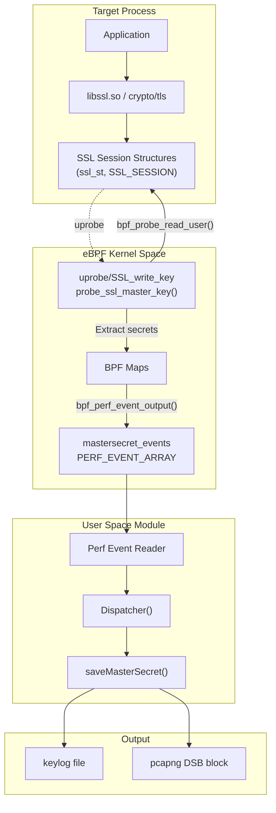
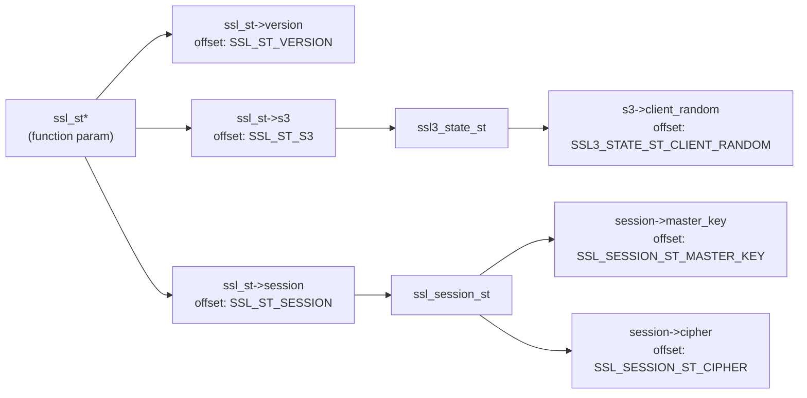
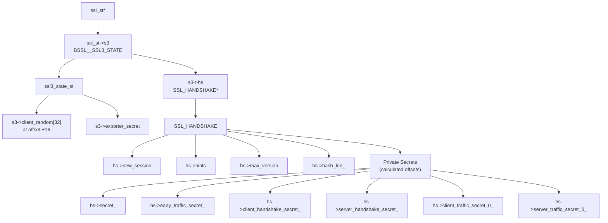
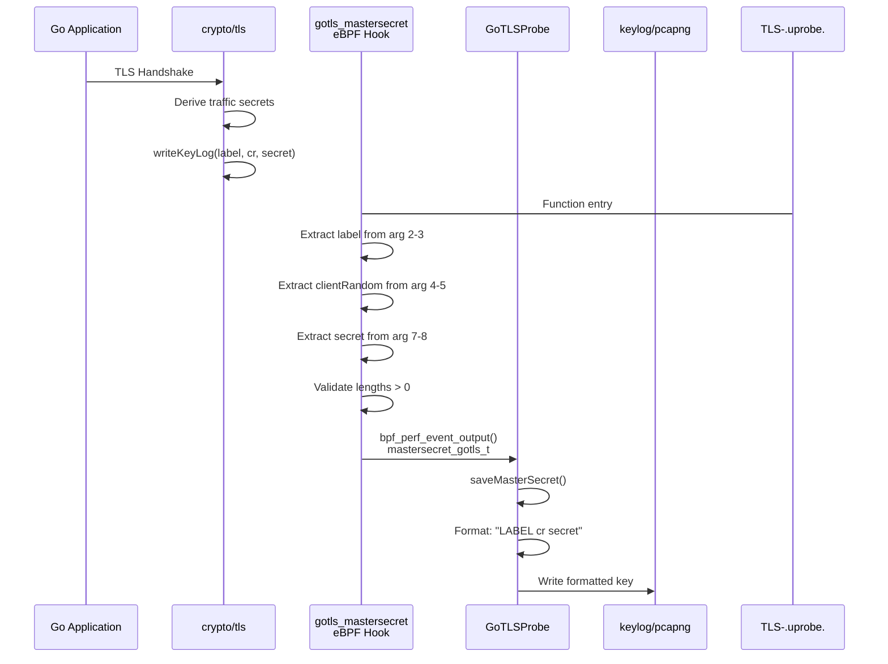
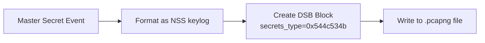

# Master Secret Extraction

<details>
<summary>Relevant source files</summary>

The following files were used as context for generating this wiki page:

- [kern/boringssl_const.h](https://github.com/gojue/ecapture/blob/ca085d05/kern/boringssl_const.h)
- [kern/boringssl_masterkey.h](https://github.com/gojue/ecapture/blob/ca085d05/kern/boringssl_masterkey.h)
- [kern/go_argument.h](https://github.com/gojue/ecapture/blob/ca085d05/kern/go_argument.h)
- [kern/gotls_kern.c](https://github.com/gojue/ecapture/blob/ca085d05/kern/gotls_kern.c)
- [kern/openssl.h](https://github.com/gojue/ecapture/blob/ca085d05/kern/openssl.h)
- [kern/openssl_masterkey.h](https://github.com/gojue/ecapture/blob/ca085d05/kern/openssl_masterkey.h)
- [kern/openssl_masterkey_3.0.h](https://github.com/gojue/ecapture/blob/ca085d05/kern/openssl_masterkey_3.0.h)
- [user/module/probe_gotls.go](https://github.com/gojue/ecapture/blob/ca085d05/user/module/probe_gotls.go)
- [user/module/probe_openssl_keylog.go](https://github.com/gojue/ecapture/blob/ca085d05/user/module/probe_openssl_keylog.go)
- [user/module/probe_openssl_text.go](https://github.com/gojue/ecapture/blob/ca085d05/user/module/probe_openssl_text.go)
- [utils/boringssl-offset.c](https://github.com/gojue/ecapture/blob/ca085d05/utils/boringssl-offset.c)

</details>


This page documents how eCapture extracts TLS/SSL master secrets and traffic keys from running processes. Master secret extraction enables decryption of captured TLS traffic when using keylog or pcap output modes. The extraction process differs significantly between TLS 1.2 and TLS 1.3, and varies across OpenSSL, BoringSSL, and Go TLS implementations.

For information about how extracted keys are written to output files, see [TLS Key Logging](../4-output-formats/4.3-tls-key-logging.md). For details about the capture modules that use master secret extraction, see [OpenSSL Module](3.1.1-openssl-module.md), [BoringSSL Module](3.1.2-boringssl-module.md), and [Go TLS Module](3.1.3-go-tls-module.md).

## TLS 1.2 vs TLS 1.3 Key Material

The fundamental difference between TLS 1.2 and TLS 1.3 lies in the key material structure and derivation process.

### TLS 1.2 Master Secret

In TLS 1.2, a single master secret is derived during the handshake and used for the entire session. The key format written to keylog files follows the NSS Key Log Format:

```
CLIENT_RANDOM <client_random_hex> <master_secret_hex>
```

**Key Components:**
- `client_random`: 32 bytes of random data from ClientHello
- `master_secret`: 48 bytes of master key material

Sources: [kern/openssl_masterkey.h:20-29](https://github.com/gojue/ecapture/blob/ca085d05/kern/openssl_masterkey.h#L20-L29), [kern/boringssl_masterkey.h:20-23](https://github.com/gojue/ecapture/blob/ca085d05/kern/boringssl_masterkey.h#L20-L23)

### TLS 1.3 Traffic Secrets

TLS 1.3 uses multiple derived secrets for different stages of the handshake and application data transmission. Each secret is derived independently and serves a specific purpose:

| Secret Name | Purpose | When Available |
|------------|---------|----------------|
| `CLIENT_EARLY_TRAFFIC_SECRET` | 0-RTT early data (optional) | After ClientHello |
| `CLIENT_HANDSHAKE_TRAFFIC_SECRET` | Client handshake encryption | During handshake |
| `SERVER_HANDSHAKE_TRAFFIC_SECRET` | Server handshake encryption | During handshake |
| `CLIENT_TRAFFIC_SECRET_0` | Client application data | After handshake complete |
| `SERVER_TRAFFIC_SECRET_0` | Server application data | After handshake complete |
| `EXPORTER_SECRET` | Key export functionality | After handshake complete |

Each secret is logged in the format:
```
<LABEL> <client_random_hex> <secret_hex>
```

Sources: [kern/openssl_masterkey.h:32-39](https://github.com/gojue/ecapture/blob/ca085d05/kern/openssl_masterkey.h#L32-L39), [kern/boringssl_masterkey.h:44-56](https://github.com/gojue/ecapture/blob/ca085d05/kern/boringssl_masterkey.h#L44-L56)

## Master Secret Extraction Architecture



**Extraction Flow:**
1. Uprobe triggers on SSL write/read functions
2. eBPF program reads SSL structure offsets to locate secrets
3. Validates handshake state to ensure secrets are available
4. Extracts client random and secret material
5. Sends event to userspace via perf buffer
6. Userspace formats and writes to keylog or PCAP

Sources: [kern/openssl_masterkey.h:80-251](https://github.com/gojue/ecapture/blob/ca085d05/kern/openssl_masterkey.h#L80-L251), [kern/boringssl_masterkey.h:169-397](https://github.com/gojue/ecapture/blob/ca085d05/kern/boringssl_masterkey.h#L169-L397), [user/module/probe_gotls.go:244-283](https://github.com/gojue/ecapture/blob/ca085d05/user/module/probe_gotls.go#L244-L283)

## OpenSSL Master Secret Extraction

### Hook Point and Structure Navigation

OpenSSL master secrets are extracted by hooking SSL write/read functions and navigating through internal structures:



**TLS 1.2 Extraction (OpenSSL 1.1.x, 3.x):**

The uprobe hook `probe_ssl_master_key` executes on SSL write operations:

1. Read `ssl_st->version` to determine TLS version
2. Navigate `ssl_st->s3->client_random` for 32-byte random
3. Navigate `ssl_st->session->master_key` for 48-byte master secret
4. Send `mastersecret_t` structure to userspace

Sources: [kern/openssl_masterkey.h:82-163](https://github.com/gojue/ecapture/blob/ca085d05/kern/openssl_masterkey.h#L82-L163)

**TLS 1.3 Extraction (OpenSSL 1.1.1+, 3.x):**

TLS 1.3 stores secrets directly in the `ssl_st` structure:

```c
// Offsets in ssl_st for TLS 1.3 secrets
ssl_st->early_secret              // SSL_ST_EARLY_SECRET
ssl_st->handshake_secret          // SSL_ST_HANDSHAKE_SECRET
ssl_st->handshake_traffic_hash    // SSL_ST_HANDSHAKE_TRAFFIC_HASH
ssl_st->client_app_traffic_secret // SSL_ST_CLIENT_APP_TRAFFIC_SECRET
ssl_st->server_app_traffic_secret // SSL_ST_SERVER_APP_TRAFFIC_SECRET
ssl_st->exporter_master_secret    // SSL_ST_EXPORTER_MASTER_SECRET
```

Each secret is 64 bytes (`EVP_MAX_MD_SIZE`). The cipher ID is obtained from `ssl_session_st->cipher->id` or `ssl_session_st->cipher_id`.

Sources: [kern/openssl_masterkey.h:165-251](https://github.com/gojue/ecapture/blob/ca085d05/kern/openssl_masterkey.h#L165-L251)

### OpenSSL 3.0+ Differences

OpenSSL 3.0 reorganized internal structures. The primary difference is the client_random location:

| OpenSSL Version | Client Random Location |
|----------------|----------------------|
| 1.1.x | `ssl_st->s3->client_random` |
| 3.0+ | `ssl_st->s3_client_random` (direct field) |

The extraction uses `SSL_ST_S3_CLIENT_RANDOM` offset which points directly to the field in 3.0+.

Sources: [kern/openssl_masterkey_3.0.h:114-128](https://github.com/gojue/ecapture/blob/ca085d05/kern/openssl_masterkey_3.0.h#L114-L128)

## BoringSSL Master Secret Extraction

BoringSSL, used extensively on Android, has a different internal structure layout. The extraction process is more complex due to private member variables and handshake state management.

### Structure Navigation



### Private Member Offset Calculation

BoringSSL's TLS 1.3 secrets are `private` C++ members, making them inaccessible via standard `offsetof()`. The offsets are calculated based on the memory layout after public members:

```c
// Last public member
uint16_t max_version;  // offset: BSSL__SSL_HANDSHAKE_MAX_VERSION

// Private section starts after alignment
// hash_len_ is first private member
// offset = roundup(MAX_VERSION + 2, 8) = 32

#define SSL_HANDSHAKE_HASH_LEN_ roundup(BSSL__SSL_HANDSHAKE_MAX_VERSION+2, 8)
#define SSL_HANDSHAKE_SECRET_ SSL_HANDSHAKE_HASH_LEN_ + 8

// Subsequent secrets offset by SSL_MAX_MD_SIZE (48 bytes)
#define SSL_HANDSHAKE_EARLY_TRAFFIC_SECRET_ SSL_HANDSHAKE_SECRET_ + SSL_MAX_MD_SIZE*1
#define SSL_HANDSHAKE_CLIENT_HANDSHAKE_SECRET_ SSL_HANDSHAKE_SECRET_ + SSL_MAX_MD_SIZE*2
// ... etc
```

Sources: [kern/boringssl_const.h:28-61](https://github.com/gojue/ecapture/blob/ca085d05/kern/boringssl_const.h#L28-L61)

### Session Pointer Resolution

BoringSSL stores the master secret in `SSL_SESSION`, but the pointer requires careful resolution:

1. **Try `ssl_st->s3->hs->new_session`** (preferred for active handshakes)
2. **Fallback to `ssl_st->session`** if `new_session` is NULL

The `get_session_addr()` helper implements this logic:

Sources: [kern/boringssl_masterkey.h:141-166](https://github.com/gojue/ecapture/blob/ca085d05/kern/boringssl_masterkey.h#L141-L166)

### Android-Specific Handling

Android 16 introduced breaking changes to BoringSSL structure offsets:

**Version Field Location:**
- Android 15 and earlier: `ssl_st->version`
- Android 16: `ssl_session_st->ssl_version`

**Secret Length:**
- Android 15 and earlier: `ssl_session_st->secret_length`
- Android 16: Field removed, uses constant `BORINGSSL_SSL_MAX_MASTER_KEY_LENGTH` (48)

Conditional compilation handles these differences:

```c
#ifdef SSL_SESSION_ST_SSL_VERSION
    // Android 16 path
    u64 *ssl_version_ptr = (u64 *)(ssl_session_st_addr + SSL_SESSION_ST_SSL_VERSION);
#else
    // Android 15 and earlier
    u64 *ssl_version_ptr = (u64 *)(ssl_st_ptr + SSL_ST_VERSION);
#endif
```

Sources: [kern/boringssl_masterkey.h:196-320](https://github.com/gojue/ecapture/blob/ca085d05/kern/boringssl_masterkey.h#L196-L320), [utils/boringssl-offset.c:23-46](https://github.com/gojue/ecapture/blob/ca085d05/utils/boringssl-offset.c#L23-L46)

## Go TLS Master Secret Extraction

Go's `crypto/tls` package provides a `writeKeyLog` callback for logging keys. eCapture hooks this function to intercept all key material.

### Hook Function and ABI Handling

**Function Signature:**
```go
func (c *Config) writeKeyLog(label string, clientRandom, secret []byte) error
```

**eBPF Hook:** `uprobe/gotls_mastersecret_register` or `uprobe/gotls_mastersecret_stack`

The hook must handle two Go ABI variants:
- **Register ABI** (Go 1.17+): Arguments passed in registers
- **Stack ABI** (Go < 1.17): Arguments passed on stack

### Argument Extraction

Go slice headers have three fields: `array unsafe.Pointer`, `len int`, `cap int`. The extraction reads these in sequence:

```c
// Argument indices for writeKeyLog(label string, clientRandom, secret []byte)
lab_ptr = go_get_argument(ctx, is_register_abi, 2);      // label.data
lab_len_ptr = go_get_argument(ctx, is_register_abi, 3);  // label.len
cr_ptr = go_get_argument(ctx, is_register_abi, 4);       // clientRandom.data
cr_len_ptr = go_get_argument(ctx, is_register_abi, 5);   // clientRandom.len
// cap field at index 6 (ignored)
secret_ptr = go_get_argument(ctx, is_register_abi, 7);   // secret.data
secret_len_ptr = go_get_argument(ctx, is_register_abi, 8); // secret.len
```

Sources: [kern/gotls_kern.c:194-220](https://github.com/gojue/ecapture/blob/ca085d05/kern/gotls_kern.c#L194-L220), [kern/go_argument.h:74-108](https://github.com/gojue/ecapture/blob/ca085d05/kern/go_argument.h#L74-L108)

### Master Secret Structure

```c
struct mastersecret_gotls_t {
    u8 label[MASTER_SECRET_KEY_LEN];  // 32 bytes max
    u8 labellen;
    u8 client_random[EVP_MAX_MD_SIZE]; // 64 bytes
    u8 client_random_len;
    u8 secret_[EVP_MAX_MD_SIZE];       // 64 bytes
    u8 secret_len;
};
```

The label identifies the secret type (e.g., `"CLIENT_TRAFFIC_SECRET_0"`, `"SERVER_TRAFFIC_SECRET_0"`).

Sources: [kern/gotls_kern.c:41-48](https://github.com/gojue/ecapture/blob/ca085d05/kern/gotls_kern.c#L41-L48)

### Go TLS Key Material Events



Sources: [kern/gotls_kern.c:194-267](https://github.com/gojue/ecapture/blob/ca085d05/kern/gotls_kern.c#L194-L267), [user/module/probe_gotls.go:244-283](https://github.com/gojue/ecapture/blob/ca085d05/user/module/probe_gotls.go#L244-L283)

## Handshake State Validation

Before extracting secrets, eBPF programs validate that the TLS handshake has progressed far enough for secrets to be available. Premature extraction would read uninitialized or incomplete data.

### OpenSSL State Validation

OpenSSL does not expose explicit handshake state in the `ssl_st` structure for TLS 1.2. The program simply checks that `ssl_st->session` is non-null before reading the master key.

For TLS 1.3, the program assumes that if the uprobe on `SSL_write` fires, the handshake is complete and secrets are available.

Sources: [kern/openssl_masterkey.h:82-163](https://github.com/gojue/ecapture/blob/ca085d05/kern/openssl_masterkey.h#L82-L163)

### BoringSSL State Validation

BoringSSL maintains explicit handshake state in `SSL_HANDSHAKE->state` and `SSL_HANDSHAKE->tls13_state`. The extraction validates these states:

**TLS 1.2 State Requirements:**
```c
struct ssl3_handshake_st {
    s32 state;        // TLS 1.2 state machine
    s32 tls13_state;  // TLS 1.3 state machine
};

// TLS 1.2 minimum states
#define CLIENT_STATE12_SEND_CLIENT_FINISHED 16
#define SERVER_STATE12_READ_CLIENT_FINISHED 18

if (ssl3_hs_state.state < CLIENT_STATE12_SEND_CLIENT_FINISHED) {
    return 0;  // Not finished yet
}
```

**TLS 1.3 State Requirements:**
```c
// TLS 1.3 minimum states
#define CLIENT_STATE13_READ_SERVER_FINISHED 8
#define SERVER_STATE13_READ_CLIENT_FINISHED 14

if (ssl3_hs_state.tls13_state < CLIENT_STATE13_READ_SERVER_FINISHED) {
    return 0;  // Not finished yet
}
```

These constants correspond to enum values in BoringSSL's state machines.

Sources: [kern/boringssl_masterkey.h:76-86](https://github.com/gojue/ecapture/blob/ca085d05/kern/boringssl_masterkey.h#L76-L86), [kern/boringssl_masterkey.h:257-268](https://github.com/gojue/ecapture/blob/ca085d05/kern/boringssl_masterkey.h#L257-L268), [kern/boringssl_masterkey.h:283-342](https://github.com/gojue/ecapture/blob/ca085d05/kern/boringssl_masterkey.h#L283-L342)

### Go TLS Implicit Validation

Go's `writeKeyLog` callback is invoked by the TLS library only when secrets are ready. The eBPF hook doesn't need explicit state validation - the function call itself indicates the secret is valid.

The userspace code performs deduplication to avoid logging the same secret multiple times:

```go
k := fmt.Sprintf("%s-%02x", label, clientRandom)
_, exists := g.masterSecrets[k]
if exists {
    return  // Already logged this secret
}
g.masterSecrets[k] = true
```

Sources: [user/module/probe_gotls.go:250-256](https://github.com/gojue/ecapture/blob/ca085d05/user/module/probe_gotls.go#L250-L256)

## Data Structure Comparison

### Master Secret Event Structures

**OpenSSL (`mastersecret_t`):**
```c
struct mastersecret_t {
    s32 version;                                 // TLS version
    u8 client_random[SSL3_RANDOM_SIZE];         // 32 bytes
    u8 master_key[MASTER_SECRET_MAX_LEN];       // 48 bytes (TLS 1.2)
    
    // TLS 1.3 fields
    u32 cipher_id;
    u8 early_secret[EVP_MAX_MD_SIZE];           // 64 bytes each
    u8 handshake_secret[EVP_MAX_MD_SIZE];
    u8 handshake_traffic_hash[EVP_MAX_MD_SIZE];
    u8 client_app_traffic_secret[EVP_MAX_MD_SIZE];
    u8 server_app_traffic_secret[EVP_MAX_MD_SIZE];
    u8 exporter_master_secret[EVP_MAX_MD_SIZE];
};
```

Sources: [kern/openssl_masterkey.h:25-39](https://github.com/gojue/ecapture/blob/ca085d05/kern/openssl_masterkey.h#L25-L39)

**BoringSSL (`mastersecret_bssl_t`):**
```c
struct mastersecret_bssl_t {
    s32 version;
    u8 client_random[SSL3_RANDOM_SIZE];         // 32 bytes
    u8 secret_[MASTER_SECRET_MAX_LEN];          // 48 bytes (TLS 1.2)
    
    // TLS 1.3 fields
    u32 hash_len;
    u8 early_traffic_secret_[EVP_MAX_MD_SIZE];  // 64 bytes each
    u8 client_handshake_secret_[EVP_MAX_MD_SIZE];
    u8 server_handshake_secret_[EVP_MAX_MD_SIZE];
    u8 client_traffic_secret_0_[EVP_MAX_MD_SIZE];
    u8 server_traffic_secret_0_[EVP_MAX_MD_SIZE];
    u8 exporter_secret[EVP_MAX_MD_SIZE];
};
```

The key difference is that BoringSSL includes `hash_len` (the hash algorithm output size) rather than `cipher_id`.

Sources: [kern/boringssl_masterkey.h:37-56](https://github.com/gojue/ecapture/blob/ca085d05/kern/boringssl_masterkey.h#L37-L56)

**Go TLS (`mastersecret_gotls_t`):**
```c
struct mastersecret_gotls_t {
    u8 label[MASTER_SECRET_KEY_LEN];           // 32 bytes
    u8 labellen;
    u8 client_random[EVP_MAX_MD_SIZE];         // 64 bytes
    u8 client_random_len;
    u8 secret_[EVP_MAX_MD_SIZE];               // 64 bytes
    u8 secret_len;
};
```

Go sends one event per secret, with the label identifying the secret type. OpenSSL and BoringSSL send all secrets in a single event.

Sources: [kern/gotls_kern.c:41-48](https://github.com/gojue/ecapture/blob/ca085d05/kern/gotls_kern.c#L41-L48)

## Memory Management and BPF Map Usage

### Per-CPU Heap Allocation

eBPF programs have a 512-byte stack limit. Master secret structures exceed this, requiring heap allocation via BPF maps:

```c
struct {
    __uint(type, BPF_MAP_TYPE_ARRAY);
    __type(key, u32);
    __type(value, struct mastersecret_t);
    __uint(max_entries, 1);
} bpf_context_gen SEC(".maps");

struct {
    __uint(type, BPF_MAP_TYPE_LRU_HASH);
    __type(key, u64);  // PID/TID
    __type(value, struct mastersecret_t);
    __uint(max_entries, 2048);
} bpf_context SEC(".maps");

static __always_inline struct mastersecret_t *make_event() {
    u32 key_gen = 0;
    struct mastersecret_t *bpf_ctx = bpf_map_lookup_elem(&bpf_context_gen, &key_gen);
    if (!bpf_ctx) return 0;
    
    u64 id = bpf_get_current_pid_tgid();
    bpf_map_update_elem(&bpf_context, &id, bpf_ctx, BPF_ANY);
    return bpf_map_lookup_elem(&bpf_context, &id);
}
```

**Allocation Strategy:**
1. `bpf_context_gen` is a per-CPU array providing temporary storage
2. Copy structure to `bpf_context` LRU hash keyed by PID/TID
3. Return pointer from hash map for modification
4. Structure persists until explicitly deleted or LRU eviction

This pattern appears in all three implementations (OpenSSL, BoringSSL, Go TLS).

Sources: [kern/openssl_masterkey.h:62-78](https://github.com/gojue/ecapture/blob/ca085d05/kern/openssl_masterkey.h#L62-L78), [kern/boringssl_masterkey.h:122-137](https://github.com/gojue/ecapture/blob/ca085d05/kern/boringssl_masterkey.h#L122-L137)

### Perf Event Output

After populating the structure, the eBPF program sends it to userspace:

```c
bpf_perf_event_output(ctx, &mastersecret_events, BPF_F_CURRENT_CPU, 
                      mastersecret, sizeof(struct mastersecret_t));
```

The `mastersecret_events` perf event array has 1024 entries (one per possible CPU). Userspace polls these arrays to receive events.

Sources: [kern/openssl_masterkey.h:48-53](https://github.com/gojue/ecapture/blob/ca085d05/kern/openssl_masterkey.h#L48-L53), [kern/gotls_kern.c:52-58](https://github.com/gojue/ecapture/blob/ca085d05/kern/gotls_kern.c#L52-L58)

## Integration with Output Formats

### Keylog Mode

When operating in keylog mode (`-m keylog` or `-m key`), the userspace module writes secrets to a file in NSS Key Log Format:

**TLS 1.2:**
```
CLIENT_RANDOM <32-byte-hex> <48-byte-hex>
```

**TLS 1.3 (multiple lines):**
```
CLIENT_HANDSHAKE_TRAFFIC_SECRET <32-byte-hex> <secret-hex>
SERVER_HANDSHAKE_TRAFFIC_SECRET <32-byte-hex> <secret-hex>
CLIENT_TRAFFIC_SECRET_0 <32-byte-hex> <secret-hex>
SERVER_TRAFFIC_SECRET_0 <32-byte-hex> <secret-hex>
EXPORTER_SECRET <32-byte-hex> <secret-hex>
```

This format is compatible with Wireshark and other tools that support NSS Key Log Files.

Sources: [user/module/probe_gotls.go:265-273](https://github.com/gojue/ecapture/blob/ca085d05/user/module/probe_gotls.go#L265-L273)

### PCAP Mode with DSB

When operating in pcap/pcapng mode (`-m pcap` or `-m pcapng`), secrets are embedded in the PCAP-NG file as Decryption Secrets Blocks (DSB):



The DSB block type `0x544c534b` ("TLSK") indicates TLS Key Log format. Wireshark automatically uses these keys to decrypt traffic when opening the file.

Sources: [user/module/probe_gotls.go:275-279](https://github.com/gojue/ecapture/blob/ca085d05/user/module/probe_gotls.go#L275-L279)

### Deduplication Logic

All modules implement deduplication to prevent logging the same secret multiple times:

```go
// Key format: "label-clientRandomHex"
k := fmt.Sprintf("%s-%02x", label, clientRandom)

_, exists := g.masterSecrets[k]
if exists {
    return  // Already logged
}

g.masterSecrets[k] = true
// ... write to output
```

This is necessary because:
- SSL write/read functions may be called multiple times per connection
- Go's `writeKeyLog` may be called multiple times for the same secret
- Duplicate keys in keylog files can confuse decryption tools

Sources: [user/module/probe_gotls.go:250-256](https://github.com/gojue/ecapture/blob/ca085d05/user/module/probe_gotls.go#L250-L256)

## Offset Generation and Maintenance

### Build-Time Offset Extraction

Structure offsets vary across library versions. The build system generates offset header files by compiling small C programs against each library version:

**OpenSSL Offset Generation:**
```bash
# Script: boringssl_offset_android_16.sh
git clone https://boringssl.googlesource.com/boringssl
cd boringssl && git checkout android-16-release
g++ -I include/ -I src/ ./src/boringssl-offset.c -o off
./off > boringssl_a_16_kern.c
```

**Offset Extraction Program:**
```c
#define X(struct_name, field_name) \
    format(#struct_name, #field_name, offsetof(struct struct_name, field_name));

SSL_STRUCT_OFFSETS  // Expands to offset calculations
#undef X
```

This generates output like:
```c
// ssl_st->version
#define SSL_ST_VERSION 0x18

// ssl_st->session  
#define SSL_ST_SESSION 0x30

// ssl_session_st->secret
#define SSL_SESSION_ST_SECRET 0x28
```

Sources: [utils/boringssl-offset.c:69-78](https://github.com/gojue/ecapture/blob/ca085d05/utils/boringssl-offset.c#L69-L78)

### Version-Specific Bytecode

The generated offset headers are compiled into version-specific eBPF bytecode files:
- `openssl_1_1_1a_kern.o` through `openssl_1_1_1w_kern.o`
- `openssl_3_0_0_kern.o` through `openssl_3_5_0_kern.o`
- `boringssl_a_13_kern.o` through `boringssl_a_16_kern.o`

At runtime, the module detects the library version and loads the corresponding bytecode.

Sources: Documentation reference to section [Structure Offset Calculation](../5-development-guide/5.2.2-structure-offset-calculation.md)

## Summary

Master secret extraction in eCapture requires:

1. **Version Detection**: Identify TLS protocol version (1.2 vs 1.3) and library type
2. **Structure Navigation**: Walk internal data structures using pre-calculated offsets
3. **State Validation**: Ensure handshake completion before reading secrets (BoringSSL)
4. **Secret Extraction**: Read appropriate fields based on TLS version
5. **Event Transmission**: Send secrets to userspace via perf events
6. **Deduplication**: Avoid logging duplicate secrets
7. **Output Formatting**: Write secrets in NSS Key Log Format to keylog file or PCAP DSB

The implementation is library-specific due to different internal structure layouts and naming conventions, but the overall flow remains consistent across OpenSSL, BoringSSL, and Go TLS.

Sources: [kern/openssl_masterkey.h](https://github.com/gojue/ecapture/blob/ca085d05/kern/openssl_masterkey.h), [kern/boringssl_masterkey.h](https://github.com/gojue/ecapture/blob/ca085d05/kern/boringssl_masterkey.h), [kern/gotls_kern.c](https://github.com/gojue/ecapture/blob/ca085d05/kern/gotls_kern.c), [user/module/probe_gotls.go:244-283](https://github.com/gojue/ecapture/blob/ca085d05/user/module/probe_gotls.go#L244-L283)