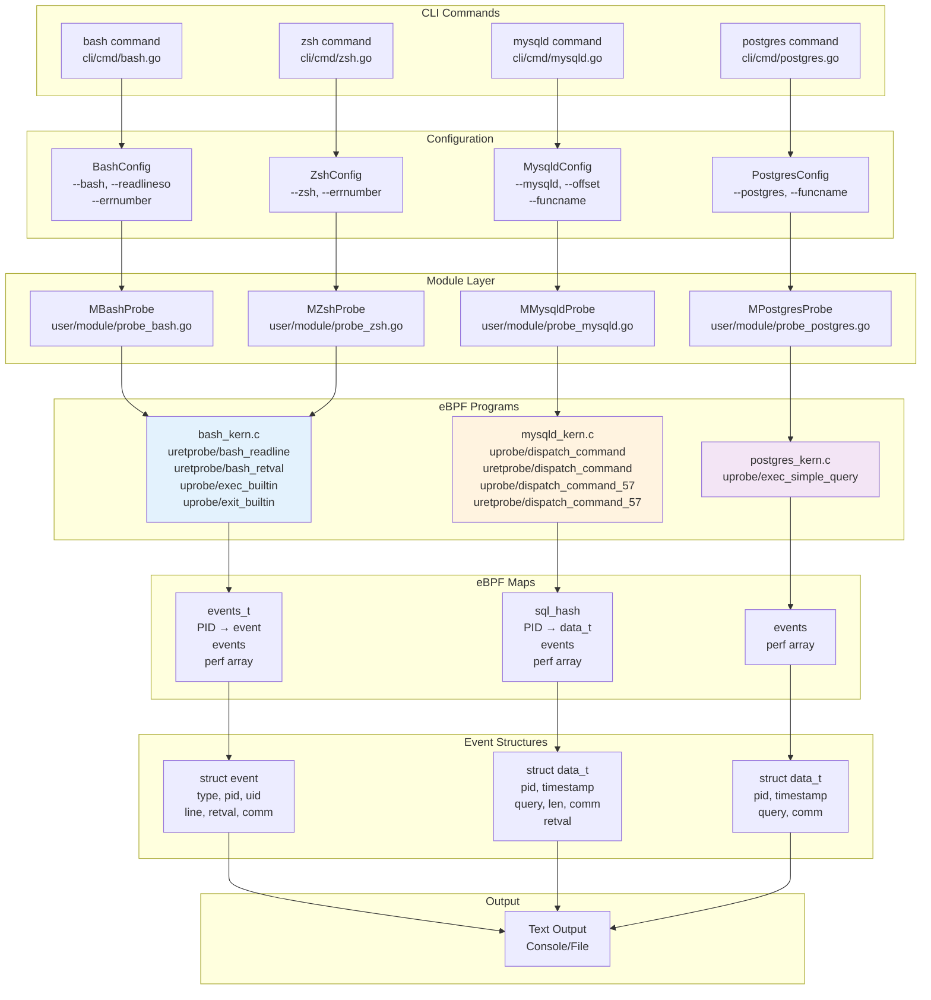
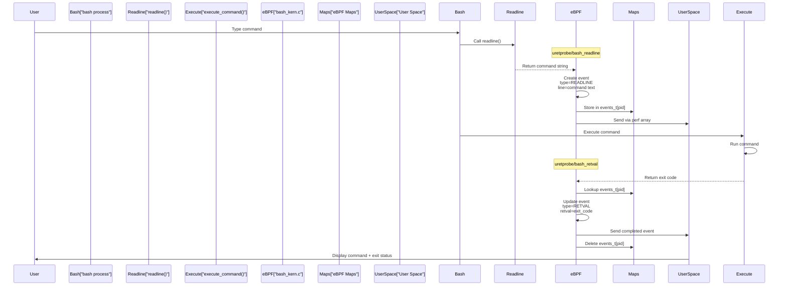
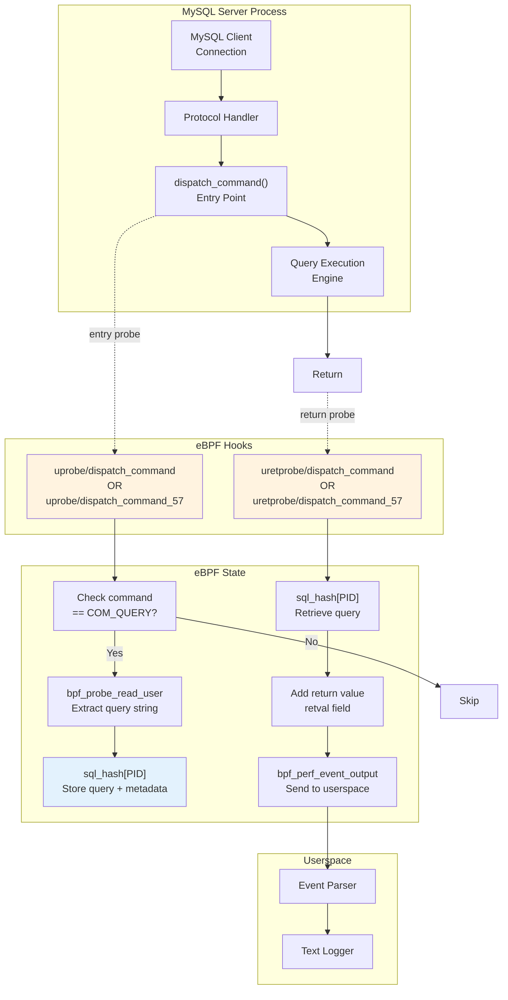
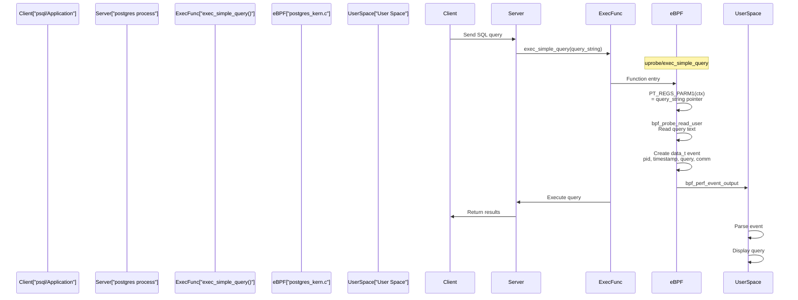

# System Audit Modules

<details>
<summary>Relevant source files</summary>

The following files were used as context for generating this wiki page:

- [cli/cmd/bash.go](https://github.com/gojue/ecapture/blob/0766a93b/cli/cmd/bash.go)
- [cli/cmd/gnutls.go](https://github.com/gojue/ecapture/blob/0766a93b/cli/cmd/gnutls.go)
- [cli/cmd/gotls.go](https://github.com/gojue/ecapture/blob/0766a93b/cli/cmd/gotls.go)
- [cli/cmd/mysqld.go](https://github.com/gojue/ecapture/blob/0766a93b/cli/cmd/mysqld.go)
- [cli/cmd/nspr.go](https://github.com/gojue/ecapture/blob/0766a93b/cli/cmd/nspr.go)
- [cli/cmd/postgres.go](https://github.com/gojue/ecapture/blob/0766a93b/cli/cmd/postgres.go)
- [cli/cmd/tls.go](https://github.com/gojue/ecapture/blob/0766a93b/cli/cmd/tls.go)
- [cli/cmd/zsh.go](https://github.com/gojue/ecapture/blob/0766a93b/cli/cmd/zsh.go)
- [kern/bash_kern.c](https://github.com/gojue/ecapture/blob/0766a93b/kern/bash_kern.c)
- [kern/mysqld_kern.c](https://github.com/gojue/ecapture/blob/0766a93b/kern/mysqld_kern.c)
- [kern/nspr_kern.c](https://github.com/gojue/ecapture/blob/0766a93b/kern/nspr_kern.c)
- [kern/postgres_kern.c](https://github.com/gojue/ecapture/blob/0766a93b/kern/postgres_kern.c)
- [pkg/util/ws/client.go](https://github.com/gojue/ecapture/blob/0766a93b/pkg/util/ws/client.go)
- [pkg/util/ws/client_test.go](https://github.com/gojue/ecapture/blob/0766a93b/pkg/util/ws/client_test.go)

</details>


## Purpose and Scope

This document covers eCapture's system auditing capabilities for capturing shell commands and database queries without code modification. System audit modules use eBPF uprobes to hook into critical functions in shell interpreters (Bash, Zsh) and database servers (MySQL, PostgreSQL), enabling security auditing and forensics analysis.

For TLS/SSL capture modules including OpenSSL and Go TLS, see [TLS/SSL Modules](3.1-tlsssl-modules.md). For network packet capture using TC classifiers, see [Network Packet Capture with TC](3.3-network-packet-capture-with-tc.md).

## Overview

System audit modules provide real-time visibility into:
- **Shell Commands**: Bash and Zsh command execution, including command text and exit status
- **Database Queries**: MySQL and PostgreSQL SQL queries executed by server processes

Unlike TLS modules that focus on encrypted network traffic, system audit modules capture application-level activity directly from process memory, providing:
- Command-line activity monitoring for security compliance
- Database query auditing for debugging and performance analysis
- Process and user attribution via PID/UID filtering
- Zero configuration on target applications

The system audit subsystem consists of four specialized modules:

| Module | Target | Hook Functions | Supported Versions |
|--------|--------|----------------|-------------------|
| Bash | `/bin/bash` | `readline()`, `execute_command()` | All versions |
| Zsh | `/bin/zsh` | `zleread()`, `execcmd_exec()` | All versions |
| MySQL | `mysqld`/`mariadbd` | `dispatch_command()` | 5.6, 5.7, 8.0, MariaDB 10.5+ |
| PostgreSQL | `postgres` | `exec_simple_query()` | 10+ |

**Sources:** [cli/cmd/bash.go:1-56](https://github.com/gojue/ecapture/blob/0766a93b/cli/cmd/bash.go#L1-L56), [cli/cmd/zsh.go:1-58](https://github.com/gojue/ecapture/blob/0766a93b/cli/cmd/zsh.go#L1-L58), [cli/cmd/mysqld.go:1-50](https://github.com/gojue/ecapture/blob/0766a93b/cli/cmd/mysqld.go#L1-L50), [cli/cmd/postgres.go:1-46](https://github.com/gojue/ecapture/blob/0766a93b/cli/cmd/postgres.go#L1-L46)

## System Audit Architecture



**Diagram: System Audit Module Architecture**

The architecture follows a layered design where CLI commands parse user arguments into configuration objects, which are passed to module implementations that load and manage eBPF programs. The eBPF programs use uprobes to intercept function calls, store intermediate state in eBPF maps, and emit events via perf arrays to userspace.

**Sources:** [cli/cmd/bash.go:24-55](https://github.com/gojue/ecapture/blob/0766a93b/cli/cmd/bash.go#L24-L55), [cli/cmd/mysqld.go:27-49](https://github.com/gojue/ecapture/blob/0766a93b/cli/cmd/mysqld.go#L27-L49), [cli/cmd/postgres.go:27-45](https://github.com/gojue/ecapture/blob/0766a93b/cli/cmd/postgres.go#L27-L45), [kern/bash_kern.c:17-133](https://github.com/gojue/ecapture/blob/0766a93b/kern/bash_kern.c#L17-L133), [kern/mysqld_kern.c:19-266](https://github.com/gojue/ecapture/blob/0766a93b/kern/mysqld_kern.c#L19-L266), [kern/postgres_kern.c:17-61](https://github.com/gojue/ecapture/blob/0766a93b/kern/postgres_kern.c#L17-L61)

## Shell Command Auditing

### Bash Command Capture

Bash command auditing works by hooking the `readline()` function and related execution functions to capture both the command text and its exit status.



**Diagram: Bash Command Capture Flow**

The capture process uses two uretprobes:
1. **uretprobe/bash_readline** [kern/bash_kern.c:42-70](https://github.com/gojue/ecapture/blob/0766a93b/kern/bash_kern.c#L42-L70) captures the command text when `readline()` returns
2. **uretprobe/bash_retval** [kern/bash_kern.c:71-112](https://github.com/gojue/ecapture/blob/0766a93b/kern/bash_kern.c#L71-L112) captures the exit status from command execution

The two-phase capture correlates commands with their results using PID-indexed map storage.

**Sources:** [kern/bash_kern.c:42-112](https://github.com/gojue/ecapture/blob/0766a93b/kern/bash_kern.c#L42-L112)

### Bash eBPF Implementation

The Bash eBPF program defines event structures and uses hash maps for state tracking:

```c
struct event {
    u32 type;              // Event type: READLINE or RETVAL
    u32 pid;               // Process ID
    u32 uid;               // User ID
    u8 line[MAX_DATA_SIZE_BASH];  // Command text
    u32 retval;            // Exit status
    char comm[TASK_COMM_LEN];      // Process name
};
```

The program uses two eBPF maps:
- **events** (BPF_MAP_TYPE_PERF_EVENT_ARRAY): Output events to userspace [kern/bash_kern.c:26-31](https://github.com/gojue/ecapture/blob/0766a93b/kern/bash_kern.c#L26-L31)
- **events_t** (BPF_MAP_TYPE_HASH): Store partial events indexed by PID [kern/bash_kern.c:33-38](https://github.com/gojue/ecapture/blob/0766a93b/kern/bash_kern.c#L33-L38)

**PID/UID Filtering**: When compiled for kernels ≥5.2 (non-KERNEL_LESS_5_2), the program performs filtering:
```c
if (target_pid != 0 && target_pid != pid) {
    return 0;
}
if (target_uid != 0 && target_uid != uid) {
    return 0;
}
```

This allows users to target specific processes or users via CLI flags.

**Sources:** [kern/bash_kern.c:17-112](https://github.com/gojue/ecapture/blob/0766a93b/kern/bash_kern.c#L17-L112)

### Bash/Zsh Exit and Exec Events

Both Bash and Zsh modules capture special events when the shell exits or executes external commands:

```c
static __always_inline int send_bash_exit_event(struct pt_regs *ctx) {
    struct event event = {
        .type = BASH_EVENT_TYPE_EXIT_OR_EXEC,
        .pid = pid,
        .uid = uid,
    };
    bpf_perf_event_output(ctx, &events, BPF_F_CURRENT_CPU, &event, sizeof(struct event));
    return 0;
}

SEC("uprobe/exec_builtin")
int uprobe_exec_builtin(struct pt_regs *ctx) { return send_bash_exit_event(ctx); }

SEC("uprobe/exit_builtin")
int uprobe_exit_builtin(struct pt_regs *ctx) { return send_bash_exit_event(ctx); }
```

These probes track shell lifecycle events, useful for session monitoring and forensics.

**Sources:** [kern/bash_kern.c:114-133](https://github.com/gojue/ecapture/blob/0766a93b/kern/bash_kern.c#L114-L133)

### Zsh Command Capture

Zsh auditing follows the same architecture as Bash but hooks different functions:
- `zleread()` for command input
- `execcmd_exec()` for return values

The Zsh module reuses the same eBPF bytecode structure [kern/bash_kern.c](https://github.com/gojue/ecapture/blob/0766a93b/kern/bash_kern.c) with different hook points configured via the CLI command [cli/cmd/zsh.go:30-57](https://github.com/gojue/ecapture/blob/0766a93b/cli/cmd/zsh.go#L30-L57).

**Sources:** [cli/cmd/zsh.go:30-57](https://github.com/gojue/ecapture/blob/0766a93b/cli/cmd/zsh.go#L30-L57)

## Database Query Auditing

### MySQL Query Capture

MySQL query auditing intercepts the `dispatch_command()` function, which processes all client commands including SQL queries.



**Diagram: MySQL Query Capture Flow**

The capture uses version-specific probe functions:
- **MySQL 5.6**: `dispatch_command(enum command, THD *thd, char *packet, uint length)` [kern/mysqld_kern.c:43-99](https://github.com/gojue/ecapture/blob/0766a93b/kern/mysqld_kern.c#L43-L99)
- **MySQL 5.7+/8.0**: `dispatch_command(THD *thd, const COM_DATA *com_data, enum command)` [kern/mysqld_kern.c:186-226](https://github.com/gojue/ecapture/blob/0766a93b/kern/mysqld_kern.c#L186-L226)

**Sources:** [kern/mysqld_kern.c:43-266](https://github.com/gojue/ecapture/blob/0766a93b/kern/mysqld_kern.c#L43-L266)

### MySQL Version-Specific Handling

The MySQL module handles two different function signatures:

**MySQL 5.6 Signature:**
```c
SEC("uprobe/dispatch_command")
int mysql56_query(struct pt_regs *ctx) {
    u64 command = (u64)PT_REGS_PARM1(ctx);  // enum_server_command
    if (command != COM_QUERY) {
        return 0;  // Only capture SQL queries (COM_QUERY = 0x03)
    }
    
    u64 len = (u64)PT_REGS_PARM4(ctx);
    bpf_probe_read_user(&data.query, len, (void *)PT_REGS_PARM3(ctx));
}
```

**MySQL 5.7+/8.0 Signature:**
```c
SEC("uprobe/dispatch_command_57")
int mysql57_query(struct pt_regs *ctx) {
    u64 command = (u64)PT_REGS_PARM3(ctx);  // enum_server_command moved
    if (command != COM_QUERY) {
        return 0;
    }
    
    void *st = (void *)PT_REGS_PARM2(ctx);  // COM_DATA struct pointer
    struct COM_QUERY_DATA query;
    bpf_probe_read_user(&query, sizeof(query), st);
    bpf_probe_read_user(&data.query, sizeof(data.query), query.query);
}
```

The COM_DATA structure layout changed between versions [kern/mysqld_kern.c:173-178](https://github.com/gojue/ecapture/blob/0766a93b/kern/mysqld_kern.c#L173-L178).

**Sources:** [kern/mysqld_kern.c:43-266](https://github.com/gojue/ecapture/blob/0766a93b/kern/mysqld_kern.c#L43-L266)

### MySQL Event Structure

The MySQL event structure captures comprehensive query information:

```c
struct data_t {
    u64 pid;        // Process ID
    u64 timestamp;  // Capture timestamp
    char query[MAX_DATA_SIZE_MYSQL];  // SQL query text
    u64 alllen;     // Original query length
    u64 len;        // Captured length (truncated if > MAX)
    char comm[TASK_COMM_LEN];  // Process name
    s8 retval;      // dispatch_command return value
};
```

The `retval` field indicates query execution status:
- **MySQL 5.6**: `DISPATCH_COMMAND_SUCCESS=0`, `DISPATCH_COMMAND_CLOSE_CONNECTION=1`, `DISPATCH_COMMAND_WOULDBLOCK=2`
- **MySQL 5.7**: `0` for success, `1` for connection close, with `DISPATCH_COMMAND_V57_FAILED=-2` used internally

**Sources:** [kern/mysqld_kern.c:19-27](https://github.com/gojue/ecapture/blob/0766a93b/kern/mysqld_kern.c#L19-L27), [kern/mysqld_kern.c:101-141](https://github.com/gojue/ecapture/blob/0766a93b/kern/mysqld_kern.c#L101-L141), [kern/mysqld_kern.c:233-266](https://github.com/gojue/ecapture/blob/0766a93b/kern/mysqld_kern.c#L233-L266)

### PostgreSQL Query Capture

PostgreSQL auditing is simpler, hooking a single function that processes text queries:



**Diagram: PostgreSQL Query Capture Flow**

The PostgreSQL implementation is straightforward because `exec_simple_query()` handles text-based queries uniformly across versions 10+.

**Sources:** [kern/postgres_kern.c:35-60](https://github.com/gojue/ecapture/blob/0766a93b/kern/postgres_kern.c#L35-L60)

### PostgreSQL eBPF Implementation

The PostgreSQL eBPF program is the simplest of the database modules:

```c
struct data_t {
    u64 pid;
    u64 timestamp;
    char query[MAX_DATA_SIZE_POSTGRES];
    char comm[TASK_COMM_LEN];
};

SEC("uprobe/exec_simple_query")
int postgres_query(struct pt_regs *ctx) {
    // PID/UID filtering
    
    struct data_t data = {};
    data.pid = pid;
    data.timestamp = bpf_ktime_get_ns();
    
    char *sql_string = (char *)PT_REGS_PARM1(ctx);
    bpf_get_current_comm(&data.comm, sizeof(data.comm));
    bpf_probe_read_user(&data.query, sizeof(data.query), sql_string);
    bpf_perf_event_output(ctx, &events, BPF_F_CURRENT_CPU, &data, sizeof(data));
    return 0;
}
```

Unlike MySQL, PostgreSQL doesn't require return value tracking or multiple version-specific hooks.

**Sources:** [kern/postgres_kern.c:17-60](https://github.com/gojue/ecapture/blob/0766a93b/kern/postgres_kern.c#L17-L60)

## CLI Usage and Configuration

### Shell Command Auditing CLI

**Bash Command:**
```bash
# Basic usage
ecapture bash

# Specify bash binary path
ecapture bash --bash=/bin/bash

# Specify readline library path
ecapture bash --readlineso=/lib/x86_64-linux-gnu/libreadline.so.8

# Filter by exit code (e.g., only failed commands)
ecapture bash -e 1

# PID/UID filtering (common flags)
ecapture bash --pid=1234 --uid=1000
```

**Zsh Command:**
```bash
ecapture zsh
ecapture zsh --zsh=/bin/zsh -e 0  # Only successful commands
```

The `--errnumber` flag filters events by exit status:
- `-e 0`: Only show successful commands
- `-e 1`: Only show failed commands
- `-e 128` (default): Show all commands

**Sources:** [cli/cmd/bash.go:27-55](https://github.com/gojue/ecapture/blob/0766a93b/cli/cmd/bash.go#L27-L55), [cli/cmd/zsh.go:30-57](https://github.com/gojue/ecapture/blob/0766a93b/cli/cmd/zsh.go#L30-L57)

### Database Auditing CLI

**MySQL Command:**
```bash
# Basic usage
ecapture mysqld

# Specify mysqld binary
ecapture mysqld --mysqld=/usr/sbin/mysqld

# MariaDB
ecapture mysqld --mysqld=/usr/sbin/mariadbd

# Manual function specification (for symbol resolution issues)
ecapture mysqld --funcname=_Z16dispatch_commandP3THDPK8COM_DATA19enum_server_command

# Manual offset specification
ecapture mysqld --offset=0x710410
```

**PostgreSQL Command:**
```bash
# Basic usage
ecapture postgres

# Specify postgres binary
ecapture postgres --postgres=/usr/lib/postgresql/14/bin/postgres

# Manual function specification
ecapture postgres --funcname=exec_simple_query
```

The `--funcname` and `--offset` flags provide fallback mechanisms when automatic symbol resolution fails.

**Sources:** [cli/cmd/mysqld.go:30-49](https://github.com/gojue/ecapture/blob/0766a93b/cli/cmd/mysqld.go#L30-L49), [cli/cmd/postgres.go:30-45](https://github.com/gojue/ecapture/blob/0766a93b/cli/cmd/postgres.go#L30-L45)

## System Audit Module Comparison

| Feature | Bash/Zsh | MySQL | PostgreSQL |
|---------|----------|-------|------------|
| **Hook Strategy** | Two-phase (command + retval) | Two-phase (entry + return) | Single-phase (entry only) |
| **State Storage** | events_t[PID] hash map | sql_hash[PID] hash map | None (direct output) |
| **Version Variants** | Single eBPF program | Two variants (5.6 vs 5.7+) | Single program |
| **Output Timing** | After command completes | After query completes | At query start |
| **Truncation** | MAX_DATA_SIZE_BASH | MAX_DATA_SIZE_MYSQL | MAX_DATA_SIZE_POSTGRES |
| **Return Value** | Exit code (0-255) | dispatch_command result | N/A |
| **Lifecycle Events** | Exit/exec tracking | None | None |
| **CLI Filtering** | Error number, PID, UID | PID, UID | PID, UID |

## Implementation Considerations

### Memory Constraints

eBPF programs have a 512-byte stack limit, requiring careful buffer management:
- Bash: `MAX_DATA_SIZE_BASH` for command text [kern/bash_kern.c:21](https://github.com/gojue/ecapture/blob/0766a93b/kern/bash_kern.c#L21)
- MySQL: `MAX_DATA_SIZE_MYSQL` for queries [kern/mysqld_kern.c:22](https://github.com/gojue/ecapture/blob/0766a93b/kern/mysqld_kern.c#L22)
- PostgreSQL: `MAX_DATA_SIZE_POSTGRES` for queries [kern/postgres_kern.c:20](https://github.com/gojue/ecapture/blob/0766a93b/kern/postgres_kern.c#L20)

Large commands/queries are truncated with length tracking via `alllen` vs `len` fields.

### PID-Based Correlation

Both shell and database modules use PID-indexed hash maps to correlate entry and return probes:
1. Entry probe stores event in map [kern/bash_kern.c:66](https://github.com/gojue/ecapture/blob/0766a93b/kern/bash_kern.c#L66), [kern/mysqld_kern.c:95](https://github.com/gojue/ecapture/blob/0766a93b/kern/mysqld_kern.c#L95)
2. Return probe retrieves event [kern/bash_kern.c:89](https://github.com/gojue/ecapture/blob/0766a93b/kern/bash_kern.c#L89), [kern/mysqld_kern.c:132](https://github.com/gojue/ecapture/blob/0766a93b/kern/mysqld_kern.c#L132)
3. Return probe updates with return value
4. Return probe outputs completed event
5. Return probe deletes map entry

This pattern prevents memory leaks while enabling two-phase capture.

### Cross-Version Compatibility

MySQL requires version detection to select the correct eBPF program:
- Module code detects MySQL version via binary analysis
- Loads either `mysql56_query`/`mysql56_query_return` or `mysql57_query`/`mysql57_query_return`
- COM_DATA structure layout differs between versions

PostgreSQL's stable ABI across versions 10+ simplifies implementation.

**Sources:** [kern/mysqld_kern.c:43-266](https://github.com/gojue/ecapture/blob/0766a93b/kern/mysqld_kern.c#L43-L266)