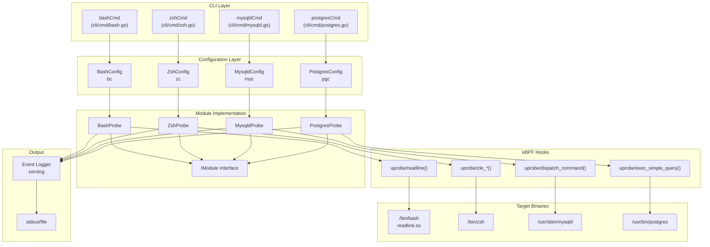
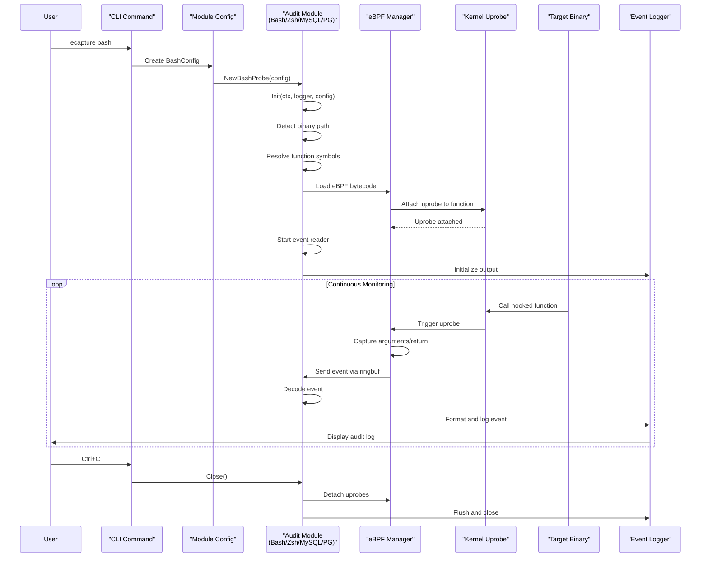
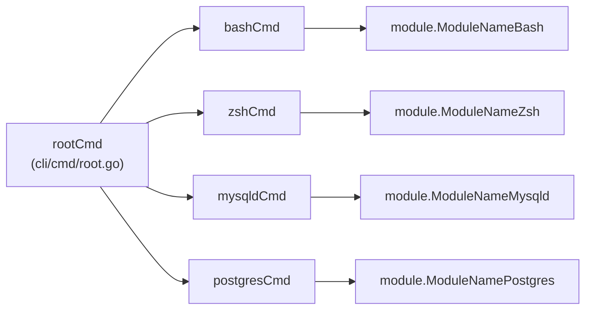

# System Audit Modules

<details>
<summary>Relevant source files</summary>

The following files were used as context for generating this wiki page:

- [CHANGELOG.md](https://github.com/gojue/ecapture/blob/ca085d05/CHANGELOG.md)
- [README.md](https://github.com/gojue/ecapture/blob/ca085d05/README.md)
- [README_CN.md](https://github.com/gojue/ecapture/blob/ca085d05/README_CN.md)
- [cli/cmd/bash.go](https://github.com/gojue/ecapture/blob/ca085d05/cli/cmd/bash.go)
- [cli/cmd/gnutls.go](https://github.com/gojue/ecapture/blob/ca085d05/cli/cmd/gnutls.go)
- [cli/cmd/gotls.go](https://github.com/gojue/ecapture/blob/ca085d05/cli/cmd/gotls.go)
- [cli/cmd/mysqld.go](https://github.com/gojue/ecapture/blob/ca085d05/cli/cmd/mysqld.go)
- [cli/cmd/nspr.go](https://github.com/gojue/ecapture/blob/ca085d05/cli/cmd/nspr.go)
- [cli/cmd/postgres.go](https://github.com/gojue/ecapture/blob/ca085d05/cli/cmd/postgres.go)
- [cli/cmd/tls.go](https://github.com/gojue/ecapture/blob/ca085d05/cli/cmd/tls.go)
- [cli/cmd/zsh.go](https://github.com/gojue/ecapture/blob/ca085d05/cli/cmd/zsh.go)
- [images/ecapture-help-v0.8.9.svg](https://github.com/gojue/ecapture/blob/ca085d05/images/ecapture-help-v0.8.9.svg)
- [main.go](https://github.com/gojue/ecapture/blob/ca085d05/main.go)
- [pkg/util/ws/client.go](https://github.com/gojue/ecapture/blob/ca085d05/pkg/util/ws/client.go)
- [pkg/util/ws/client_test.go](https://github.com/gojue/ecapture/blob/ca085d05/pkg/util/ws/client_test.go)

</details>


This document provides an overview of eCapture's system audit modules, which enable security monitoring of shell commands and database queries without requiring code modifications. Unlike the TLS/SSL capture modules covered in [TLS/SSL Capture Modules](3.1-tlsssl-capture-modules.md), these modules focus on auditing user actions and SQL queries rather than network traffic.

For detailed implementation of shell auditing, see [Shell Command Auditing](3.2.1-shell-command-auditing.md). For database query auditing details, see [Database Query Auditing](3.2.2-database-query-auditing.md).

---

## Purpose and Scope

System audit modules use eBPF uprobe technology to intercept function calls in user-space binaries, capturing command-line input/output and SQL query strings. These modules serve security audit, compliance monitoring, and forensic analysis use cases.

**Supported Audit Targets:**
- **Shell Commands**: bash (via readline library), zsh (via zle library)
- **Database Queries**: MySQL/MariaDB (5.6, 5.7, 8.0), PostgreSQL (10+)

All audit modules operate independently of TLS/SSL modules and do not require network interface access or packet capture capabilities.

Sources: [README.md:152-161](https://github.com/gojue/ecapture/blob/ca085d05/README.md#L152-L161), [cli/cmd/bash.go:1-56](https://github.com/gojue/ecapture/blob/ca085d05/cli/cmd/bash.go#L1-L56), [cli/cmd/zsh.go:1-58](https://github.com/gojue/ecapture/blob/ca085d05/cli/cmd/zsh.go#L1-L58), [cli/cmd/mysqld.go:1-50](https://github.com/gojue/ecapture/blob/ca085d05/cli/cmd/mysqld.go#L1-L50), [cli/cmd/postgres.go:1-46](https://github.com/gojue/ecapture/blob/ca085d05/cli/cmd/postgres.go#L1-L46)

---

## Module Overview

The following table summarizes the four system audit modules available in eCapture:

| Module | Target Binary | Hook Library/Function | Data Captured | Primary Use Case |
|--------|--------------|----------------------|---------------|------------------|
| `bash` | `/bin/bash` | readline.so (`readline()`) | Command input/output, exit codes | Shell command auditing |
| `zsh` | `/bin/zsh` | zsh binary (zle functions) | Command input/output, exit codes | Shell command auditing |
| `mysqld` | `/usr/sbin/mysqld` or `/usr/sbin/mariadbd` | mysqld binary (dispatch functions) | SQL query strings | Database query auditing |
| `postgres` | `/usr/bin/postgres` | postgres binary (query execution) | SQL query strings | Database query auditing |

All modules inherit from the `IModule` interface and follow the standard module lifecycle (Init → Run → Close) described in [Module System and Lifecycle](../2-architecture/2.5-module-system-and-lifecycle.md).

Sources: [README.md:152-161](https://github.com/gojue/ecapture/blob/ca085d05/README.md#L152-L161), [cli/cmd/bash.go:24-38](https://github.com/gojue/ecapture/blob/ca085d05/cli/cmd/bash.go#L24-L38), [cli/cmd/zsh.go:27-41](https://github.com/gojue/ecapture/blob/ca085d05/cli/cmd/zsh.go#L27-L41), [cli/cmd/mysqld.go:27-42](https://github.com/gojue/ecapture/blob/ca085d05/cli/cmd/mysqld.go#L27-L42), [cli/cmd/postgres.go:27-40](https://github.com/gojue/ecapture/blob/ca085d05/cli/cmd/postgres.go#L27-L40)

---

## Architecture Integration

System audit modules integrate with eCapture's core architecture as specialized implementations of the `IModule` interface, focusing on uprobe-based event capture without requiring network components.

### Audit Module Architecture


```mermaid
graph TB
    subgraph "CLI Layer"
        BASH_CMD["bashCmd<br/>(cli/cmd/bash.go)"]
        ZSH_CMD["zshCmd<br/>(cli/cmd/zsh.go)"]
        MYSQL_CMD["mysqldCmd<br/>(cli/cmd/mysqld.go)"]
        PG_CMD["postgresCmd<br/>(cli/cmd/postgres.go)"]
    end
    
    subgraph "Configuration Layer"
        BASH_CFG["BashConfig<br/>bc"]
        ZSH_CFG["ZshConfig<br/>zc"]
        MYSQL_CFG["MysqldConfig<br/>myc"]
        PG_CFG["PostgresConfig<br/>pgc"]
    end
    
    subgraph "Module Implementation"
        IMODULE["IModule Interface"]
        BASH_MOD["BashProbe"]
        ZSH_MOD["ZshProbe"]
        MYSQL_MOD["MysqldProbe"]
        PG_MOD["PostgresProbe"]
    end
    
    subgraph "eBPF Hooks"
        UPROBE_READLINE["uprobe/readline()"]
        UPROBE_ZLE["uprobe/zle_*()"]
        UPROBE_DISPATCH["uprobe/dispatch_command()"]
        UPROBE_EXEC["uprobe/exec_simple_query()"]
    end
    
    subgraph "Target Binaries"
        BASH_BIN["/bin/bash<br/>readline.so"]
        ZSH_BIN["/bin/zsh"]
        MYSQL_BIN["/usr/sbin/mysqld"]
        PG_BIN["/usr/bin/postgres"]
    end
    
    subgraph "Output"
        LOGGER["Event Logger<br/>zerolog"]
        STDOUT["stdout/file"]
    end
    
    BASH_CMD --> BASH_CFG
    ZSH_CMD --> ZSH_CFG
    MYSQL_CMD --> MYSQL_CFG
    PG_CMD --> PG_CFG
    
    BASH_CFG --> BASH_MOD
    ZSH_CFG --> ZSH_MOD
    MYSQL_CFG --> MYSQL_MOD
    PG_CFG --> PG_MOD
    
    BASH_MOD --> IMODULE
    ZSH_MOD --> IMODULE
    MYSQL_MOD --> IMODULE
    PG_MOD --> IMODULE
    
    BASH_MOD --> UPROBE_READLINE
    ZSH_MOD --> UPROBE_ZLE
    MYSQL_MOD --> UPROBE_DISPATCH
    PG_MOD --> UPROBE_EXEC
    
    UPROBE_READLINE --> BASH_BIN
    UPROBE_ZLE --> ZSH_BIN
    UPROBE_DISPATCH --> MYSQL_BIN
    UPROBE_EXEC --> PG_BIN
    
    BASH_MOD --> LOGGER
    ZSH_MOD --> LOGGER
    MYSQL_MOD --> LOGGER
    PG_MOD --> LOGGER
    
    LOGGER --> STDOUT
```

**Key Differences from TLS Modules:**
- No network interface (`-i`) parameter required
- No pcap/keylog output modes
- No Traffic Control (TC) hooks or packet capture
- Simpler event flow: uprobe → decode → log (no protocol parsing)

Sources: [cli/cmd/bash.go:1-56](https://github.com/gojue/ecapture/blob/ca085d05/cli/cmd/bash.go#L1-L56), [cli/cmd/zsh.go:1-58](https://github.com/gojue/ecapture/blob/ca085d05/cli/cmd/zsh.go#L1-L58), [cli/cmd/mysqld.go:1-50](https://github.com/gojue/ecapture/blob/ca085d05/cli/cmd/mysqld.go#L1-L50), [cli/cmd/postgres.go:1-46](https://github.com/gojue/ecapture/blob/ca085d05/cli/cmd/postgres.go#L1-L46)

---

## Command-Line Interface

Each audit module is invoked as a subcommand of the `ecapture` binary with module-specific configuration flags.

### Shell Command Audit Commands

#### Bash Module

```bash
# Basic usage - auto-detect bash binary
sudo ecapture bash

# Specify bash binary path
sudo ecapture bash --bash=/bin/bash

# Specify readline library path
sudo ecapture bash --readlineso=/lib/x86_64-linux-gnu/libreadline.so.8

# Filter by error number (show only failed commands)
sudo ecapture bash --errnumber=1

# Combined flags with logging
sudo ecapture bash -l bash_audit.log --pid=1234
```

**Configuration Structure**: `BashConfig` [cli/cmd/bash.go:24](https://github.com/gojue/ecapture/blob/ca085d05/cli/cmd/bash.go#L24)
- `Bashpath`: Path to bash binary (default: auto-detected from `$SHELL`)
- `Readline`: Path to readline.so library (default: auto-detected)
- `ErrNo`: Filter commands by exit code (default: `BashErrnoDefault`)

#### Zsh Module

```bash
# Basic usage - auto-detect zsh binary
sudo ecapture zsh

# Specify zsh binary path
sudo ecapture zsh --zsh=/bin/zsh

# Filter by error number
sudo ecapture zsh --errnumber=127
```

**Configuration Structure**: `ZshConfig` [cli/cmd/zsh.go:27](https://github.com/gojue/ecapture/blob/ca085d05/cli/cmd/zsh.go#L27)
- `Zshpath`: Path to zsh binary (default: auto-detected from `$SHELL`)
- `ErrNo`: Filter commands by exit code (default: `ZshErrnoDefault`)

Sources: [cli/cmd/bash.go:24-56](https://github.com/gojue/ecapture/blob/ca085d05/cli/cmd/bash.go#L24-L56), [cli/cmd/zsh.go:27-58](https://github.com/gojue/ecapture/blob/ca085d05/cli/cmd/zsh.go#L27-L58)

---

### Database Query Audit Commands

#### MySQL/MariaDB Module

```bash
# Basic usage - default mysqld path
sudo ecapture mysqld

# Specify mysqld binary (MySQL)
sudo ecapture mysqld --mysqld=/usr/sbin/mysqld

# Specify mariadbd binary (MariaDB)
sudo ecapture mysqld --mysqld=/usr/sbin/mariadbd

# Hook specific function by name
sudo ecapture mysqld --funcname=dispatch_command

# Hook by offset (advanced usage)
sudo ecapture mysqld --offset=0x710410

# Combined with logging
sudo ecapture mysqld -l mysql_queries.log --pid=3306
```

**Configuration Structure**: `MysqldConfig` [cli/cmd/mysqld.go:27](https://github.com/gojue/ecapture/blob/ca085d05/cli/cmd/mysqld.go#L27)
- `Mysqldpath`: Path to mysqld/mariadbd binary (default: `/usr/sbin/mariadbd`)
- `FuncName`: Specific function name to hook (optional)
- `Offset`: Memory offset for uprobe attachment (optional, advanced)

**Supported Versions**: MySQL 5.6/5.7/8.0, MariaDB 10.5+

#### PostgreSQL Module

```bash
# Basic usage - default postgres path
sudo ecapture postgres

# Specify postgres binary path
sudo ecapture postgres --postgres=/usr/lib/postgresql/14/bin/postgres

# Hook specific function
sudo ecapture postgres --funcname=exec_simple_query

# Combined with logging
sudo ecapture postgres -l postgres_queries.log --pid=5432
```

**Configuration Structure**: `PostgresConfig` [cli/cmd/postgres.go:27](https://github.com/gojue/ecapture/blob/ca085d05/cli/cmd/postgres.go#L27)
- `PostgresPath`: Path to postgres binary (default: `/usr/bin/postgres`)
- `FuncName`: Specific function name to hook (optional)

**Supported Versions**: PostgreSQL 10+

Sources: [cli/cmd/mysqld.go:27-50](https://github.com/gojue/ecapture/blob/ca085d05/cli/cmd/mysqld.go#L27-L50), [cli/cmd/postgres.go:27-46](https://github.com/gojue/ecapture/blob/ca085d05/cli/cmd/postgres.go#L27-L46)

---

## Module Execution Flow

All audit modules follow the standard eCapture module lifecycle with simplified event processing compared to TLS modules.

### Audit Module Lifecycle


```mermaid
sequenceDiagram
    participant User
    participant CLI as "CLI Command"
    participant Config as "Module Config"
    participant Module as "Audit Module<br/>(Bash/Zsh/MySQL/PG)"
    participant eBPF as "eBPF Manager"
    participant Kernel as "Kernel Uprobe"
    participant Target as "Target Binary"
    participant Logger as "Event Logger"
    
    User->>CLI: ecapture bash
    CLI->>Config: Create BashConfig
    Config->>Module: NewBashProbe(config)
    
    Module->>Module: Init(ctx, logger, config)
    Module->>Module: Detect binary path
    Module->>Module: Resolve function symbols
    
    Module->>eBPF: Load eBPF bytecode
    eBPF->>Kernel: Attach uprobe to function
    Kernel-->>eBPF: Uprobe attached
    
    Module->>Module: Start event reader
    Module->>Logger: Initialize output
    
    loop Continuous Monitoring
        Target->>Kernel: Call hooked function
        Kernel->>eBPF: Trigger uprobe
        eBPF->>eBPF: Capture arguments/return
        eBPF->>Module: Send event via ringbuf
        Module->>Module: Decode event
        Module->>Logger: Format and log event
        Logger->>User: Display audit log
    end
    
    User->>CLI: Ctrl+C
    CLI->>Module: Close()
    Module->>eBPF: Detach uprobes
    Module->>Logger: Flush and close
```

**Key Differences from TLS Modules:**
1. No network interface binding or TC classifier setup
2. No EventProcessor/IWorker pool (simpler event flow)
3. No protocol parsing (IParser not used)
4. Direct event decode → log pipeline
5. No master key extraction or pcap file generation

Sources: [cli/cmd/bash.go:52-55](https://github.com/gojue/ecapture/blob/ca085d05/cli/cmd/bash.go#L52-L55), [cli/cmd/mysqld.go:46-49](https://github.com/gojue/ecapture/blob/ca085d05/cli/cmd/mysqld.go#L46-L49)

---

## Common Configuration Parameters

All audit modules support the standard global flags inherited from the root command, in addition to their module-specific flags.

### Global Flags (Inherited)

| Flag | Type | Default | Description |
|------|------|---------|-------------|
| `--pid` | uint | 0 | Target specific process ID (0 = all processes) |
| `--uid` | uint | 0 | Target specific user ID (0 = all users) |
| `-l, --logaddr` | string | "" | Log output file path (empty = stdout) |
| `--hex` | bool | false | Print payload as hexadecimal format |

### Module Detection Logic

Each audit module implements binary/library detection logic:

1. **Bash Module** [cli/cmd/bash.go:36-37](https://github.com/gojue/ecapture/blob/ca085d05/cli/cmd/bash.go#L36-L37)
   - Auto-detects bash from `$SHELL` environment variable
   - Auto-locates readline.so from bash's linked libraries

2. **Zsh Module** [cli/cmd/zsh.go:39](https://github.com/gojue/ecapture/blob/ca085d05/cli/cmd/zsh.go#L39)
   - Auto-detects zsh from `$SHELL` environment variable

3. **MySQL Module** [cli/cmd/mysqld.go:40](https://github.com/gojue/ecapture/blob/ca085d05/cli/cmd/mysqld.go#L40)
   - Default path: `/usr/sbin/mariadbd`
   - Can specify `/usr/sbin/mysqld` for MySQL installations

4. **PostgreSQL Module** [cli/cmd/postgres.go:37](https://github.com/gojue/ecapture/blob/ca085d05/cli/cmd/postgres.go#L37)
   - Default path: `/usr/bin/postgres`
   - Version-agnostic detection (works with PG 10+)

Sources: [cli/cmd/bash.go:36-37](https://github.com/gojue/ecapture/blob/ca085d05/cli/cmd/bash.go#L36-L37), [cli/cmd/zsh.go:39](https://github.com/gojue/ecapture/blob/ca085d05/cli/cmd/zsh.go#L39), [cli/cmd/mysqld.go:40](https://github.com/gojue/ecapture/blob/ca085d05/cli/cmd/mysqld.go#L40), [cli/cmd/postgres.go:37](https://github.com/gojue/ecapture/blob/ca085d05/cli/cmd/postgres.go#L37)

---

## Use Cases and Examples

### Security Audit Scenarios

#### Command History Auditing

**Scenario**: Monitor all bash commands executed by a specific user without modifying shell configuration or requiring user cooperation.

```bash
# Monitor all commands from user ID 1000
sudo ecapture bash --uid=1000 -l /var/log/audit/bash_commands.log

# Monitor specific bash process
sudo ecapture bash --pid=12345 -l /var/log/audit/process_12345.log

# Show only failed commands (non-zero exit codes)
sudo ecapture bash --errnumber=1
```

**Output Format**: Captures command text, PID, UID, timestamp, and exit code.

#### Database Query Auditing

**Scenario**: Audit all SQL queries executed on a production MySQL server for compliance monitoring.

```bash
# Monitor all MySQL queries
sudo ecapture mysqld --mysqld=/usr/sbin/mysqld -l /var/log/audit/mysql_queries.log

# Monitor specific MySQL instance by PID
sudo ecapture mysqld --pid=3306 -l /var/log/audit/mysql_3306.log
```

**Output Format**: Captures SQL query strings with connection metadata (PID, timestamp).

#### Forensic Analysis

**Scenario**: Investigate suspicious activity by capturing all shell commands and database queries during an incident response.

```bash
# Terminal 1: Monitor bash commands
sudo ecapture bash -l /tmp/forensics/bash.log

# Terminal 2: Monitor PostgreSQL queries
sudo ecapture postgres -l /tmp/forensics/postgres.log

# Terminal 3: Monitor zsh commands
sudo ecapture zsh -l /tmp/forensics/zsh.log
```

Sources: [README.md:152-161](https://github.com/gojue/ecapture/blob/ca085d05/README.md#L152-L161), [cli/cmd/bash.go:30-32](https://github.com/gojue/ecapture/blob/ca085d05/cli/cmd/bash.go#L30-L32), [cli/cmd/mysqld.go:32-36](https://github.com/gojue/ecapture/blob/ca085d05/cli/cmd/mysqld.go#L32-L36)

---

## Comparison with TLS Modules

The following table highlights architectural differences between audit modules and TLS capture modules:

| Feature | System Audit Modules | TLS/SSL Modules |
|---------|---------------------|-----------------|
| **Hook Type** | Uprobe only | Uprobe + TC + Kprobe |
| **Network Interface** | Not required | Required for pcap mode |
| **Event Processing** | Direct decode → log | EventProcessor + IWorker pool |
| **Protocol Parsing** | Not applicable | IParser implementations |
| **Output Modes** | Text only | Text, pcap, keylog |
| **Master Key Extraction** | Not applicable | TLS 1.2/1.3 keys |
| **Target Detection** | Binary path lookup | Library version detection |
| **Use Case** | Command/query auditing | Encrypted traffic capture |

Audit modules are significantly simpler than TLS modules, as they do not require:
- Network packet reassembly
- Connection tracking (4-tuple mapping)
- Protocol state machines
- Master secret extraction
- PCAP file generation with DSB blocks

For TLS module details, see [TLS/SSL Capture Modules](3.1-tlsssl-capture-modules.md).

Sources: [README.md:38-43](https://github.com/gojue/ecapture/blob/ca085d05/README.md#L38-L43), [README.md:152-161](https://github.com/gojue/ecapture/blob/ca085d05/README.md#L152-L161)

---

## Module Registration

All audit modules are registered in the CLI command structure through the `init()` functions in their respective command files:


```mermaid
graph LR
    ROOT["rootCmd<br/>(cli/cmd/root.go)"]
    
    ROOT --> BASH["bashCmd"]
    ROOT --> ZSH["zshCmd"]
    ROOT --> MYSQL["mysqldCmd"]
    ROOT --> PG["postgresCmd"]
    
    BASH --> BASH_MOD["module.ModuleNameBash"]
    ZSH --> ZSH_MOD["module.ModuleNameZsh"]
    MYSQL --> MYSQL_MOD["module.ModuleNameMysqld"]
    PG --> PG_MOD["module.ModuleNamePostgres"]
```

**Command Registration**: [cli/cmd/bash.go:35-55](https://github.com/gojue/ecapture/blob/ca085d05/cli/cmd/bash.go#L35-L55), [cli/cmd/zsh.go:38-52](https://github.com/gojue/ecapture/blob/ca085d05/cli/cmd/zsh.go#L38-L52), [cli/cmd/mysqld.go:39-44](https://github.com/gojue/ecapture/blob/ca085d05/cli/cmd/mysqld.go#L39-L44), [cli/cmd/postgres.go:36-40](https://github.com/gojue/ecapture/blob/ca085d05/cli/cmd/postgres.go#L36-L40)

**Module Execution**: All commands invoke `runModule(moduleName, config)` which:
1. Calls `setModConfig(globalConf, moduleConfig)`
2. Instantiates the module implementation
3. Executes the standard lifecycle: Init() → Run() → Close()

For detailed module lifecycle information, see [Module System and Lifecycle](../2-architecture/2.5-module-system-and-lifecycle.md).

Sources: [cli/cmd/bash.go:52-55](https://github.com/gojue/ecapture/blob/ca085d05/cli/cmd/bash.go#L52-L55), [cli/cmd/zsh.go:54-57](https://github.com/gojue/ecapture/blob/ca085d05/cli/cmd/zsh.go#L54-L57), [cli/cmd/mysqld.go:46-49](https://github.com/gojue/ecapture/blob/ca085d05/cli/cmd/mysqld.go#L46-L49), [cli/cmd/postgres.go:42-45](https://github.com/gojue/ecapture/blob/ca085d05/cli/cmd/postgres.go#L42-L45)

---

## Build Configuration

System audit modules are conditionally compiled based on build tags:

- **Bash Module**: Available on all platforms
- **Zsh Module**: Excluded on Android (`!androidgki` build tag) [cli/cmd/zsh.go:1-2](https://github.com/gojue/ecapture/blob/ca085d05/cli/cmd/zsh.go#L1-L2)
- **MySQL Module**: Excluded on Android (`!androidgki` build tag) [cli/cmd/mysqld.go:1-2](https://github.com/gojue/ecapture/blob/ca085d05/cli/cmd/mysqld.go#L1-L2)
- **PostgreSQL Module**: Excluded on Android (`!androidgki` build tag) [cli/cmd/postgres.go:1-2](https://github.com/gojue/ecapture/blob/ca085d05/cli/cmd/postgres.go#L1-L2)

This conditional compilation reduces binary size for Android deployments where these audit capabilities are typically not needed.

For build system details, see [Build System](../5-development-guide/5.1-build-system.md).

Sources: [cli/cmd/zsh.go:1-2](https://github.com/gojue/ecapture/blob/ca085d05/cli/cmd/zsh.go#L1-L2), [cli/cmd/mysqld.go:1-2](https://github.com/gojue/ecapture/blob/ca085d05/cli/cmd/mysqld.go#L1-L2), [cli/cmd/postgres.go:1-2](https://github.com/gojue/ecapture/blob/ca085d05/cli/cmd/postgres.go#L1-L2)