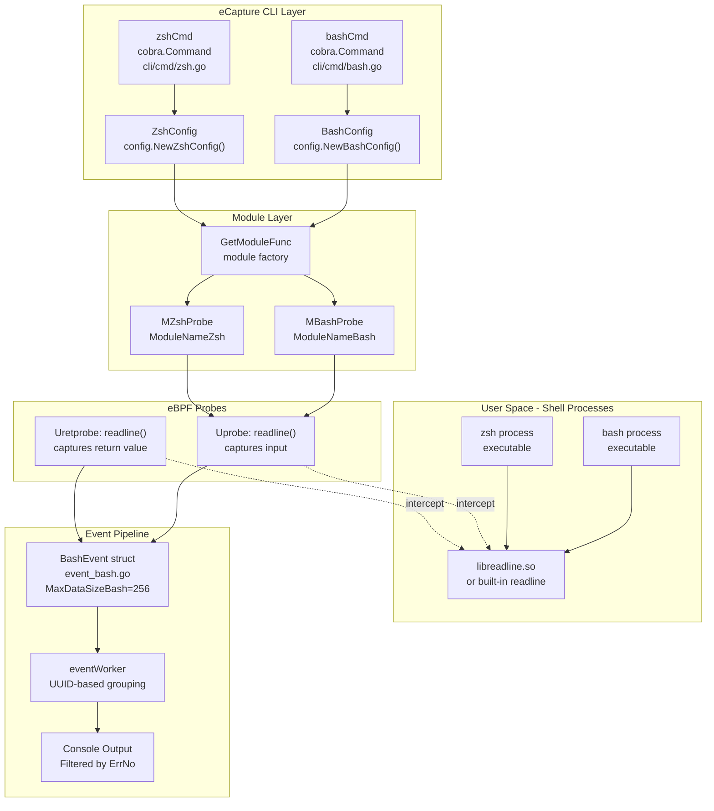
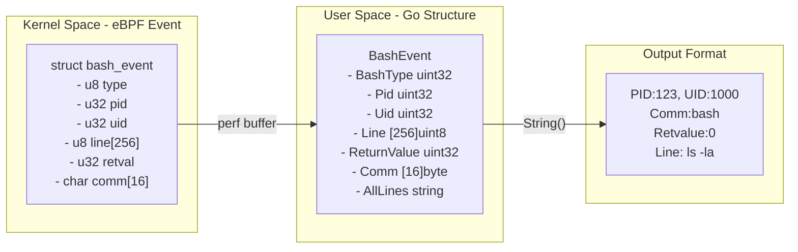
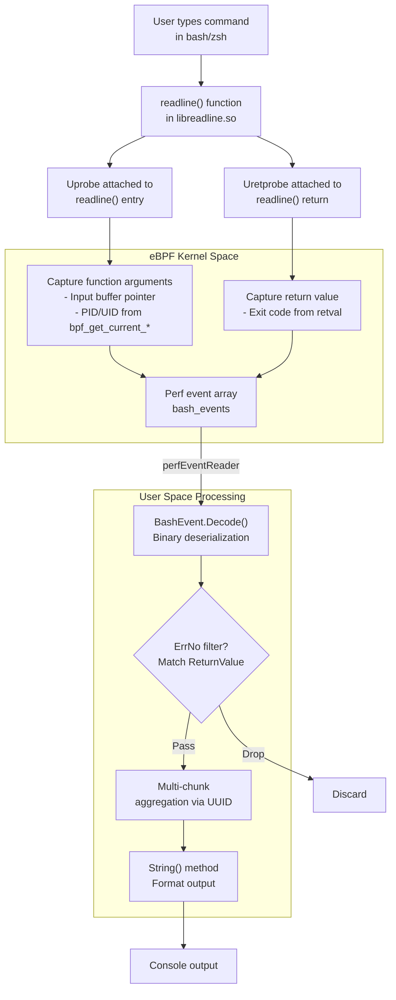
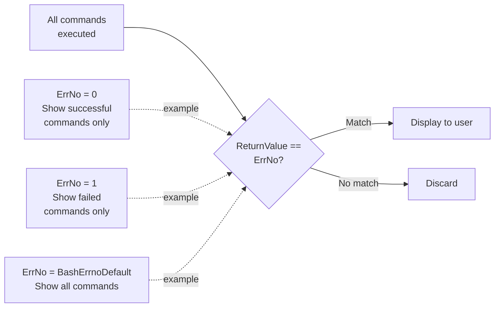
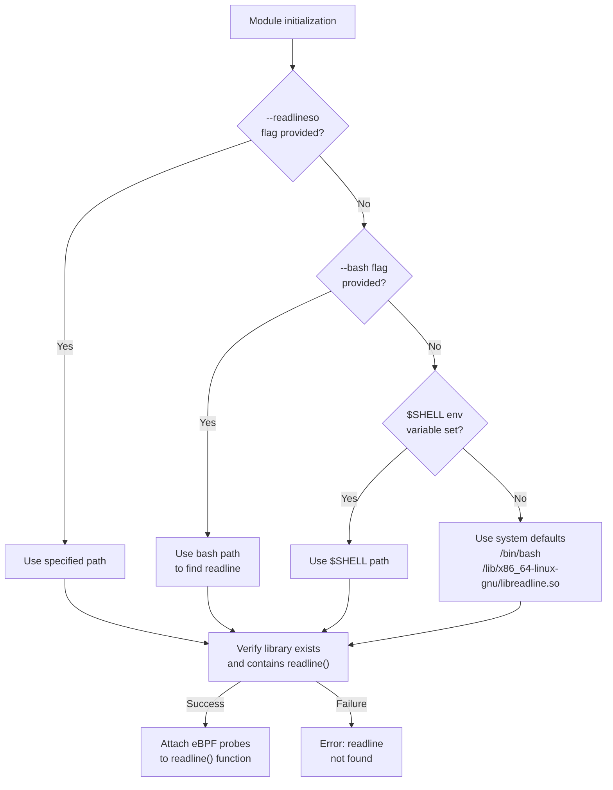
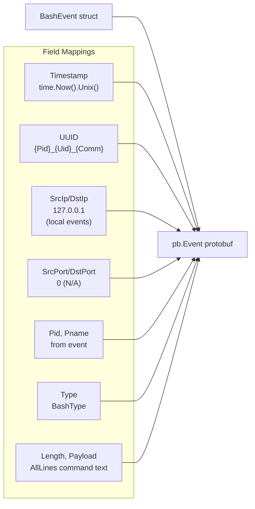

# Shell Command Auditing

<details>
<summary>Relevant source files</summary>

The following files were used as context for generating this wiki page:

- [kern/bash_kern.c](https://github.com/gojue/ecapture/blob/0766a93b/kern/bash_kern.c)
- [kern/mysqld_kern.c](https://github.com/gojue/ecapture/blob/0766a93b/kern/mysqld_kern.c)
- [kern/nspr_kern.c](https://github.com/gojue/ecapture/blob/0766a93b/kern/nspr_kern.c)
- [kern/postgres_kern.c](https://github.com/gojue/ecapture/blob/0766a93b/kern/postgres_kern.c)
- [pkg/event_processor/base_event.go](https://github.com/gojue/ecapture/blob/0766a93b/pkg/event_processor/base_event.go)
- [user/event/event_bash.go](https://github.com/gojue/ecapture/blob/0766a93b/user/event/event_bash.go)
- [user/event/event_gnutls.go](https://github.com/gojue/ecapture/blob/0766a93b/user/event/event_gnutls.go)
- [user/event/event_masterkey.go](https://github.com/gojue/ecapture/blob/0766a93b/user/event/event_masterkey.go)
- [user/event/event_mysqld.go](https://github.com/gojue/ecapture/blob/0766a93b/user/event/event_mysqld.go)
- [user/event/event_nspr.go](https://github.com/gojue/ecapture/blob/0766a93b/user/event/event_nspr.go)
- [user/event/event_openssl.go](https://github.com/gojue/ecapture/blob/0766a93b/user/event/event_openssl.go)
- [user/event/event_openssl_tc.go](https://github.com/gojue/ecapture/blob/0766a93b/user/event/event_openssl_tc.go)
- [user/event/event_postgres.go](https://github.com/gojue/ecapture/blob/0766a93b/user/event/event_postgres.go)

</details>


## Purpose and Scope

This document describes eCapture's shell command auditing capabilities, which intercept and log commands executed in Bash and Zsh shells for security auditing purposes. The module uses eBPF uprobes to hook into the GNU readline library, capturing command-line input and execution results without requiring shell history files or configuration changes.

This page covers the Bash and Zsh capture modules. For database query auditing, see [Database Query Auditing](3.2.2-database-query-auditing.md). For general module architecture, see [Module System and Lifecycle](../2-architecture/2.4-module-system-and-lifecycle.md).

---

## Module Architecture

The shell command auditing system consists of two parallel modules sharing the same underlying architecture: one for Bash and one for Zsh. Both modules hook into the readline library to intercept user input before command execution.

### System Components



**Sources:** [cli/cmd/bash.go:1-56](https://github.com/gojue/ecapture/blob/0766a93b/cli/cmd/bash.go#L1-L56), [cli/cmd/zsh.go:1-58](https://github.com/gojue/ecapture/blob/0766a93b/cli/cmd/zsh.go#L1-L58), [user/event/event_bash.go:1-134](https://github.com/gojue/ecapture/blob/0766a93b/user/event/event_bash.go#L1-L134)

---

## Configuration

### Bash Module Configuration

The Bash module accepts the following configuration parameters:

| Parameter | Flag | Type | Default | Description |
|-----------|------|------|---------|-------------|
| Bashpath | `--bash` | string | Auto-detect from `$SHELL` | Path to bash executable |
| Readline | `--readlineso` | string | Auto-detect from bash path | Path to readline.so library |
| ErrNo | `-e, --errnumber` | int | `BashErrnoDefault` | Filter commands by exit code |

**Configuration Structure:**

```go
// Created via config.NewBashConfig()
type BashConfig struct {
    Bashpath string  // Target bash binary
    Readline string  // libreadline.so path
    ErrNo    int     // Exit code filter
}
```

### Zsh Module Configuration

| Parameter | Flag | Type | Default | Description |
|-----------|------|------|---------|-------------|
| Zshpath | `--zsh` | string | Auto-detect from `$SHELL` | Path to zsh executable |
| ErrNo | `-e, --errnumber` | int | `ZshErrnoDefault` | Filter commands by exit code |

**Sources:** [cli/cmd/bash.go:24-39](https://github.com/gojue/ecapture/blob/0766a93b/cli/cmd/bash.go#L24-L39), [cli/cmd/zsh.go:27-41](https://github.com/gojue/ecapture/blob/0766a93b/cli/cmd/zsh.go#L27-L41)

### Command Line Usage

```bash
# Basic bash command capture
ecapture bash

# Capture bash commands with custom paths
ecapture bash --bash=/bin/bash --readlineso=/lib/x86_64-linux-gnu/libreadline.so

# Filter by exit code (only show failed commands)
ecapture bash -e 1

# Zsh command capture
ecapture zsh --zsh=/bin/zsh -e 0
```

**Sources:** [cli/cmd/bash.go:26-33](https://github.com/gojue/ecapture/blob/0766a93b/cli/cmd/bash.go#L26-L33), [cli/cmd/zsh.go:30-36](https://github.com/gojue/ecapture/blob/0766a93b/cli/cmd/zsh.go#L30-L36)

---

## Event Structure

### BashEvent Data Layout

Commands captured from the shell are encoded in the `BashEvent` structure, which mirrors the eBPF kernel-side structure:



**Sources:** [user/event/event_bash.go:26-47](https://github.com/gojue/ecapture/blob/0766a93b/user/event/event_bash.go#L26-L47)

### Field Descriptions

| Field | Type | Size | Description |
|-------|------|------|-------------|
| BashType | uint32 | 4 bytes | Event type identifier |
| Pid | uint32 | 4 bytes | Process ID of shell |
| Uid | uint32 | 4 bytes | User ID executing command |
| Line | [256]uint8 | 256 bytes | Command line text (may be partial) |
| ReturnValue | uint32 | 4 bytes | Exit code of command |
| Comm | [16]byte | 16 bytes | Process name (typically "bash" or "zsh") |
| AllLines | string | Variable | Aggregated full command (for multi-chunk commands) |

**Maximum Data Size:** Commands longer than 256 bytes are captured in multiple events and reassembled using the `AllLines` field.

**Sources:** [user/event/event_bash.go:37-47](https://github.com/gojue/ecapture/blob/0766a93b/user/event/event_bash.go#L37-L47)

---

## Event Processing Pipeline

### Data Flow from Shell to Output



**Sources:** [user/event/event_bash.go:49-80](https://github.com/gojue/ecapture/blob/0766a93b/user/event/event_bash.go#L49-L80), [cli/cmd/bash.go:38](https://github.com/gojue/ecapture/blob/0766a93b/cli/cmd/bash.go#L38)

### UUID-Based Event Correlation

Each command execution generates a unique identifier for event grouping:

**UUID Format:** `{Pid}_{Uid}_{Comm}`

Example: `1234_1000_bash`

This UUID enables:
- Correlation of multi-chunk command captures
- Grouping of related events from the same shell session
- Proper event ordering in the event worker pipeline

**Sources:** [user/event/event_bash.go:123-125](https://github.com/gojue/ecapture/blob/0766a93b/user/event/event_bash.go#L123-L125)

---

## Exit Code Filtering

The shell auditing modules support filtering by command exit codes, allowing users to focus on specific execution outcomes.

### Filter Configuration



**Sources:** [cli/cmd/bash.go:38](https://github.com/gojue/ecapture/blob/0766a93b/cli/cmd/bash.go#L38), [cli/cmd/zsh.go:40](https://github.com/gojue/ecapture/blob/0766a93b/cli/cmd/zsh.go#L40)

### Common Use Cases

| ErrNo Value | Use Case | Description |
|-------------|----------|-------------|
| 0 | Successful commands | Audit commands that completed successfully |
| 1 | Failed commands | Detect failed execution attempts |
| 127 | Command not found | Identify typos or missing binaries |
| 126 | Permission denied | Track permission issues |
| Default | All commands | Comprehensive audit trail |

---

## Output Format

### Text Output Structure

The `BashEvent.String()` method formats captured commands for console display:

```
PID:1234, UID:1000, 	Comm:bash, 	Retvalue:0, 	Line:
ls -la /etc/passwd
```

**Format Template:** `PID:%d, UID:%d, \tComm:%s, \tRetvalue:%d, \tLine:\n%s`

**Color Coding:** Output uses the standard color scheme from [user/event/event_bash.go:72-75](https://github.com/gojue/ecapture/blob/0766a93b/user/event/event_bash.go#L72-L75), though the specific colors depend on terminal support.

**Sources:** [user/event/event_bash.go:72-75](https://github.com/gojue/ecapture/blob/0766a93b/user/event/event_bash.go#L72-L75)

### Hex Output Mode

When running with `--hex` flag, commands are displayed in hexadecimal format via `StringHex()`:

```
PID:1234, UID:1000, 	Comm:bash, 	Retvalue:0, 	Line:
0000    6C 73 20 2D 6C 61    ls -la
```

**Sources:** [user/event/event_bash.go:77-80](https://github.com/gojue/ecapture/blob/0766a93b/user/event/event_bash.go#L77-L80)

---

## Library Detection and Hooking

### Readline Library Resolution

The module employs a multi-step process to locate the readline library:



**Sources:** [cli/cmd/bash.go:36-37](https://github.com/gojue/ecapture/blob/0766a93b/cli/cmd/bash.go#L36-L37)

### Uprobe Attachment Points

The module attaches to two critical points in the readline library:

| Probe Type | Function | Purpose |
|------------|----------|---------|
| Uprobe | `readline()` entry | Capture PID, UID, command text buffer |
| Uretprobe | `readline()` return | Capture exit code after command execution |

**Note:** The actual eBPF program implementation is not shown in the provided files, but the event structure in [user/event/event_bash.go:26-47](https://github.com/gojue/ecapture/blob/0766a93b/user/event/event_bash.go#L26-L47) reflects the data captured at these hook points.

---

## Protobuf Event Serialization

Shell events can be exported via the Protobuf/WebSocket interface for external integrations:

### Protobuf Mapping



**Special Handling:**
- Bash events do not have network context (SrcIP/DstIP set to `127.0.0.1`, ports set to `0`)
- Timestamp uses `time.Now().Unix()` rather than kernel timestamp
- Payload contains the full command line text from `AllLines`

**Sources:** [user/event/event_bash.go:103-117](https://github.com/gojue/ecapture/blob/0766a93b/user/event/event_bash.go#L103-L117)

---

## Event Lifecycle

### Event Type Classification

Shell events are classified as `TypeModuleData`, which routes them through module-specific handling rather than the generic event processor:

```go
func (be *BashEvent) Clone() IEventStruct {
    event := new(BashEvent)
    event.eventType = TypeModuleData  // Not TypeEventProcessor
    return event
}
```

This classification means:
- Events bypass HTTP protocol parsing
- No PCAP output generation
- Direct output to console or log file
- Module maintains control over formatting

**Sources:** [user/event/event_bash.go:82-86](https://github.com/gojue/ecapture/blob/0766a93b/user/event/event_bash.go#L82-L86)

### Multi-Chunk Command Handling

Commands exceeding 256 bytes are captured in multiple events:

1. First chunk captured when user presses Enter
2. eBPF program reads up to 256 bytes from readline buffer
3. Subsequent chunks captured if command continues
4. User-space code aggregates chunks into `AllLines` field using UUID correlation

**Maximum Command Length:** Limited by eBPF program design and event aggregation logic (not visible in provided files, but structure supports unlimited length via `AllLines` string).

**Sources:** [user/event/event_bash.go:37-47](https://github.com/gojue/ecapture/blob/0766a93b/user/event/event_bash.go#L37-L47)

---

## Integration with Other Modules

### Module Factory Registration

Both Bash and Zsh modules are registered with the module factory:

```
ModuleNameBash  -> MBashProbe  -> BashConfig
ModuleNameZsh   -> MZshProbe   -> ZshConfig
```

The `runModule()` function in CLI commands delegates to the factory:

```go
func bashCommandFunc(command *cobra.Command, args []string) error {
    return runModule(module.ModuleNameBash, bc)
}
```

**Sources:** [cli/cmd/bash.go:53-55](https://github.com/gojue/ecapture/blob/0766a93b/cli/cmd/bash.go#L53-L55), [cli/cmd/zsh.go:55-57](https://github.com/gojue/ecapture/blob/0766a93b/cli/cmd/zsh.go#L55-L57)

### Shared Infrastructure

Shell modules leverage common eCapture infrastructure:

- **Event Pipeline:** [Event Processing Pipeline](../2-architecture/2.2-event-processing-pipeline.md)
- **Module Lifecycle:** [Module System and Lifecycle](../2-architecture/2.4-module-system-and-lifecycle.md)
- **Configuration System:** [Configuration System](../2-architecture/2.3-configuration-system.md)
- **Output Formats:** [Text Output Mode](../4-output-formats/4.1-text-output-mode.md) and [Protobuf Integration](../4-output-formats/4.4-protobuf-and-external-integration.md)

---

## Security Considerations

### Audit Trail Integrity

Shell command auditing provides:

- **Non-bypassable capture:** Hooks at library level before history file writes
- **UID tracking:** Associates commands with user identities
- **Exit code tracking:** Distinguishes successful vs. failed attempts
- **Process correlation:** Links commands to specific shell sessions

### Privacy Implications

The module captures:
- All interactive command input (including passwords if typed)
- Arguments to commands (may contain sensitive data)
- Working directory context (via process inspection)

**Recommendation:** Use exit code filtering and secure log storage when deploying in production environments.

---

## Use Cases

### Security Auditing

```bash
# Monitor all commands executed by specific user
ecapture bash --pid=$(pgrep -u suspicious_user bash)

# Track failed command attempts (potential reconnaissance)
ecapture bash -e 1
```

### Compliance Monitoring

```bash
# Capture all successful administrative commands
ecapture bash -e 0 -l /var/log/audit/bash_commands.log
```

### Debugging and Support

```bash
# Record all commands during troubleshooting session
ecapture bash > debug_session.log
```

### Intrusion Detection

```bash
# Monitor for command-not-found errors (unusual activity)
ecapture bash -e 127
```

**Sources:** [cli/cmd/bash.go:28-33](https://github.com/gojue/ecapture/blob/0766a93b/cli/cmd/bash.go#L28-L33), [user/event/event_bash.go:72-75](https://github.com/gojue/ecapture/blob/0766a93b/user/event/event_bash.go#L72-L75)